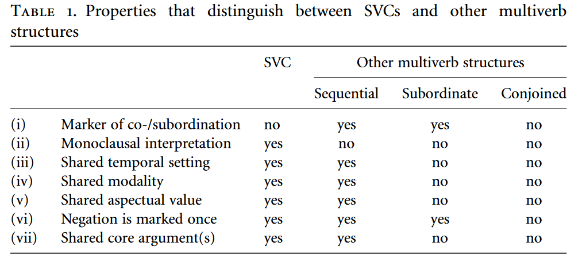

## East Ambae
### Details
Glottocode: east2443 <br> 
Family: Austronesian <br>
Macroarea: Papunesia

### Coding
IU: 1 <br> Grouping: 0 <br> Grammatical: 0

> Intonation is an important factor in recognising SVCs, and in distinguishing them from conjoined clauses. While in many cases the only possible reading for a particular clause requires that it be recognised as containing an SVC, in numerous other cases ambiguity could arise, if it were not for the fact that the clause boundaries were indicated by intonation. Sentences \ref(@eambae1) and \ref(@eambae2) are minimal pairs which can only be distinguished by the difference in intonation. The comma in these sentences indicates the clause boundary. As discussed in §10.6.3.1.1, *rovo* 'finish' has two different functions apart from its function as an independent verbal predicate. Sentence \ref(@eambae1) contains two clauses, the first of which is an example of aspectual serialisation (§10.6.3.1), where *rovo* indicates completive aspect. Sentence \ref(@eambae2) is not an example of an SVC, but here *rovo* has a discourse function in linking clauses, expressing the fact that 'after' the event ofthe first clause, another event occurred. [@hyslop2001, 275]

### Examples

(@eambae1) @hyslop2001, 275, example 3

```r
gloss_example(transliteration = "Mo vatu na veveo mo rovo, mo vai na hinaga...",
             glosses = "RL weave ACC weaving RL finish RL make ACC food",
             free_translation = "She finished weaving the weaving, and she made the food...")
```

<table class=" lightable-minimal" style='font-family: "Trebuchet MS", verdana, sans-serif; width: auto !important; border-bottom: 0;'>
<tbody>
  <tr>
   <td style="text-align:left;"> _Mo_ </td>
   <td style="text-align:left;"> _vatu_ </td>
   <td style="text-align:left;"> _na_ </td>
   <td style="text-align:left;"> _veveo_ </td>
   <td style="text-align:left;"> _mo_ </td>
   <td style="text-align:left;"> _rovo,_ </td>
   <td style="text-align:left;"> _mo_ </td>
   <td style="text-align:left;"> _vai_ </td>
   <td style="text-align:left;"> _na_ </td>
   <td style="text-align:left;"> _hinaga..._ </td>
  </tr>
  <tr>
   <td style="text-align:left;"> <span style="font-variant:small-caps;">rl</span> </td>
   <td style="text-align:left;"> weave </td>
   <td style="text-align:left;"> <span style="font-variant:small-caps;">acc</span> </td>
   <td style="text-align:left;"> weaving </td>
   <td style="text-align:left;"> <span style="font-variant:small-caps;">rl</span> </td>
   <td style="text-align:left;"> finish </td>
   <td style="text-align:left;"> <span style="font-variant:small-caps;">rl</span> </td>
   <td style="text-align:left;"> make </td>
   <td style="text-align:left;"> <span style="font-variant:small-caps;">acc</span> </td>
   <td style="text-align:left;"> food </td>
  </tr>
</tbody>
<tfoot><tr><td style="padding: 0; " colspan="100%">
<sup></sup> 'She finished weaving the weaving, and she made the food...'</td></tr></tfoot>
</table>

(@eambae1) @hyslop2001, 275, example 4

```r
gloss_example(transliteration = "Mo vatu na veveo, mo rovo, mo vai na hinaga...",
             glosses = "RL weave ACC weaving RL finish RL make ACC food",
             free_translation = "She did the weaving, and after that she made the food...")
```

<table class=" lightable-minimal" style='font-family: "Trebuchet MS", verdana, sans-serif; width: auto !important; border-bottom: 0;'>
<tbody>
  <tr>
   <td style="text-align:left;"> _Mo_ </td>
   <td style="text-align:left;"> _vatu_ </td>
   <td style="text-align:left;"> _na_ </td>
   <td style="text-align:left;"> _veveo,_ </td>
   <td style="text-align:left;"> _mo_ </td>
   <td style="text-align:left;"> _rovo,_ </td>
   <td style="text-align:left;"> _mo_ </td>
   <td style="text-align:left;"> _vai_ </td>
   <td style="text-align:left;"> _na_ </td>
   <td style="text-align:left;"> _hinaga..._ </td>
  </tr>
  <tr>
   <td style="text-align:left;"> <span style="font-variant:small-caps;">rl</span> </td>
   <td style="text-align:left;"> weave </td>
   <td style="text-align:left;"> <span style="font-variant:small-caps;">acc</span> </td>
   <td style="text-align:left;"> weaving </td>
   <td style="text-align:left;"> <span style="font-variant:small-caps;">rl</span> </td>
   <td style="text-align:left;"> finish </td>
   <td style="text-align:left;"> <span style="font-variant:small-caps;">rl</span> </td>
   <td style="text-align:left;"> make </td>
   <td style="text-align:left;"> <span style="font-variant:small-caps;">acc</span> </td>
   <td style="text-align:left;"> food </td>
  </tr>
</tbody>
<tfoot><tr><td style="padding: 0; " colspan="100%">
<sup></sup> 'She did the weaving, and after that she made the food...'</td></tr></tfoot>
</table>

## East Makian
### Details
Glottocode: east2440 <br> 
Family: Austronesian <br>
Macroarea: Papunesia

### Coding
IU: 1 <br> Grouping: 0 <br> Grammatical: 0

> Verbs containing SVCs characteristically have the same intonational properties as do mono-verbal clauses. Taba declarative clauses generally have a falling intonation over the last elements of the clause and speakers frequently pause at their completion. This is characteristic of clauses containing SVCs just as it is of clauses containing monoverbal clauses. Contrast \ref(@taba1), showing the characteristic intonation associated with a serial verb clause with that shown in \ref(@taba2) which is an example of simple clause chaining, showing juxtaposed clauses. [@bowden2001, 303]

### Examples

Note that intonation contours for \ref(@taba1) and \ref(@taba2) are available in the original source.

(@taba1) @bowden2001, 304, example 28

```r
gloss_example(transliteration = "t=han t=ronda po-pe Ploili",
             glosses = "1PL.INCL=go 1PL.INCL=stroll down-ESS Peleri",
             free_translation = "We went strlling in Peleri.",
             annotation = "Than tronda pope ploili.")
```

<table class=" lightable-minimal" style='font-family: "Trebuchet MS", verdana, sans-serif; width: auto !important; border-bottom: 0;'>
<tbody>
  <tr>
   <td style="text-align:left;"> Than </td>
   <td style="text-align:left;"> tronda </td>
   <td style="text-align:left;"> pope </td>
   <td style="text-align:left;"> ploili. </td>
  </tr>
  <tr>
   <td style="text-align:left;"> _t=han_ </td>
   <td style="text-align:left;"> _t=ronda_ </td>
   <td style="text-align:left;"> _po-pe_ </td>
   <td style="text-align:left;"> _Ploili_ </td>
  </tr>
  <tr>
   <td style="text-align:left;"> <span style="font-variant:small-caps;">1pl</span>.<span style="font-variant:small-caps;">incl</span>=go </td>
   <td style="text-align:left;"> <span style="font-variant:small-caps;">1pl</span>.<span style="font-variant:small-caps;">incl</span>=stroll </td>
   <td style="text-align:left;"> down-<span style="font-variant:small-caps;">ess</span> </td>
   <td style="text-align:left;"> Peleri </td>
  </tr>
</tbody>
<tfoot><tr><td style="padding: 0; " colspan="100%">
<sup></sup> 'We went strlling in Peleri.'</td></tr></tfoot>
</table>

(@taba2) @bowden2001, 304, example 29

```r
gloss_example(transliteration = "Motor n=wom n=bantu n=yol manusia",
             glosses = "motor_boat 3SG=come 3SG=help 3SG=carry people",
             free_translation = "Boats came... they helped... they took people away.",
             annotation = "Motor nwom... nbantu... nyol manusia.")
```

<table class=" lightable-minimal" style='font-family: "Trebuchet MS", verdana, sans-serif; width: auto !important; border-bottom: 0;'>
<tbody>
  <tr>
   <td style="text-align:left;"> Motor </td>
   <td style="text-align:left;"> nwom... </td>
   <td style="text-align:left;"> nbantu... </td>
   <td style="text-align:left;"> nyol </td>
   <td style="text-align:left;"> manusia. </td>
  </tr>
  <tr>
   <td style="text-align:left;"> _Motor_ </td>
   <td style="text-align:left;"> _n=wom_ </td>
   <td style="text-align:left;"> _n=bantu_ </td>
   <td style="text-align:left;"> _n=yol_ </td>
   <td style="text-align:left;"> _manusia_ </td>
  </tr>
  <tr>
   <td style="text-align:left;"> motor_boat </td>
   <td style="text-align:left;"> <span style="font-variant:small-caps;">3sg</span>=come </td>
   <td style="text-align:left;"> <span style="font-variant:small-caps;">3sg</span>=help </td>
   <td style="text-align:left;"> <span style="font-variant:small-caps;">3sg</span>=carry </td>
   <td style="text-align:left;"> people </td>
  </tr>
</tbody>
<tfoot><tr><td style="padding: 0; " colspan="100%">
<sup></sup> 'Boats came... they helped... they took people away.'</td></tr></tfoot>
</table>

## East Uvean
### Details
Glottocode: wall1257 <br> 
Family: Austronesian <br>
Macroarea: Papunesia

### Coding
IU: 1 <br> Grouping: 0 <br> Grammatical: 0

> Verb serialization (in the strict V1V2 sense) is a fairly rare phenomenon in East Uvean, although it is quite grammatical and accepted as such by native speakers. It is rare, because there is a strong tendency in this language to prefer one predicate utterance followed by a nominalization, rather than twohead predications (see 2.3). In my entire text corpus (more than thirty hours of recordings), I only found some thirty occurrences of SVCs, most of them involving specialization (see 2.2, 2.4 and 2.5). [@moyse-faurie2004, 203-204]

### Examples

(@euvean1) @moyse-faurie2004, 205, example 9

```r
gloss_example(transliteration = "Ko te tama nei 'e hopo malimali i loto mala'e o te faleako",
             glosses = "TOP DEF child DEIC NS jump smile OBL inside yard POSS DEF school",
             free_translation = "This child jumps smiling in the school yard.")
```

<table class=" lightable-minimal" style='font-family: "Trebuchet MS", verdana, sans-serif; width: auto !important; border-bottom: 0;'>
<tbody>
  <tr>
   <td style="text-align:left;"> _Ko_ </td>
   <td style="text-align:left;"> _te_ </td>
   <td style="text-align:left;"> _tama_ </td>
   <td style="text-align:left;"> _nei_ </td>
   <td style="text-align:left;"> _'e_ </td>
   <td style="text-align:left;"> _hopo_ </td>
   <td style="text-align:left;"> _malimali_ </td>
   <td style="text-align:left;"> _i_ </td>
   <td style="text-align:left;"> _loto_ </td>
   <td style="text-align:left;"> _mala'e_ </td>
   <td style="text-align:left;"> _o_ </td>
   <td style="text-align:left;"> _te_ </td>
   <td style="text-align:left;"> _faleako_ </td>
  </tr>
  <tr>
   <td style="text-align:left;"> <span style="font-variant:small-caps;">top</span> </td>
   <td style="text-align:left;"> <span style="font-variant:small-caps;">def</span> </td>
   <td style="text-align:left;"> child </td>
   <td style="text-align:left;"> <span style="font-variant:small-caps;">deic</span> </td>
   <td style="text-align:left;"> <span style="font-variant:small-caps;">ns</span> </td>
   <td style="text-align:left;"> jump </td>
   <td style="text-align:left;"> smile </td>
   <td style="text-align:left;"> <span style="font-variant:small-caps;">obl</span> </td>
   <td style="text-align:left;"> inside </td>
   <td style="text-align:left;"> yard </td>
   <td style="text-align:left;"> <span style="font-variant:small-caps;">poss</span> </td>
   <td style="text-align:left;"> <span style="font-variant:small-caps;">def</span> </td>
   <td style="text-align:left;"> school </td>
  </tr>
</tbody>
<tfoot><tr><td style="padding: 0; " colspan="100%">
<sup></sup> 'This child jumps smiling in the school yard.'</td></tr></tfoot>
</table>


## Eastern Arrernte
### Details
Glottocode: east2379 <br> 
Family: Pama-Nyungan <br>
Macroarea: Australian

### Coding
IU: 1 <br> Grouping: ? <br> Grammatical: ?

### Examples

> Verbs formed from compounding may have verbs, nominals, or adverbials as the first element of the compound and the final element is always a verb stem. The compounding of two verb stems is not very common in Mparntwe Arrernte but it does occur. [@wilkins1989, 265]

> The process of compounding two verb stems seems to have been much more prevalent in earlier stages of Arrernte. Many of the aspectual and category of associated motions inflections can be seen to derive from the compounding of verb stems. [@wilkins1989, 265, Footnote 43]

(@arrernte1) @wilkins1989, 508, line 14

```r
gloss_example(transliteration = "Kele arrpenhele tyarre-kng-irtne-ke.",
             glosses = "okay other:ERG pull_out-take-REVERS-PST.IPFV",
             free_translation = "So the other one pulled him along after him back towards home.")
```

<table class=" lightable-minimal" style='font-family: "Trebuchet MS", verdana, sans-serif; width: auto !important; border-bottom: 0;'>
<tbody>
  <tr>
   <td style="text-align:left;"> _Kele_ </td>
   <td style="text-align:left;"> _arrpenhele_ </td>
   <td style="text-align:left;"> _tyarre-kng-irtne-ke._ </td>
  </tr>
  <tr>
   <td style="text-align:left;"> okay </td>
   <td style="text-align:left;"> other:<span style="font-variant:small-caps;">erg</span> </td>
   <td style="text-align:left;"> pull_out-take-<span style="font-variant:small-caps;">revers</span>-<span style="font-variant:small-caps;">pst</span>.<span style="font-variant:small-caps;">ipfv</span> </td>
  </tr>
</tbody>
<tfoot><tr><td style="padding: 0; " colspan="100%">
<sup></sup> 'So the other one pulled him along after him back towards home.'</td></tr></tfoot>
</table>

(@arrernte2) @wilkins1989, 516, line 35

```r
gloss_example(transliteration = "Relhe mape-le ante ampe mape-le arrat-intye-me-le arrwekele-werne re-nhe, mpwepe-ke-rle tne-me-le ile-ke anteme, artange-perte-ke.",
             glosses = "woman PL-ERG and child PL-ERG appear-DO.COMING-NPST.IPFV-SS front-ALL 3SG-ACC middle-DAT-REL stand-NPST.IPFV-SS tell-PST.PFV(REL) now cooperate-creep_up_on-PST.PFV",
             free_translation = "The women and children came out and together they closed in on the man who was now standing in the middle talking.")
```

<table class=" lightable-minimal" style='font-family: "Trebuchet MS", verdana, sans-serif; width: auto !important; '>
<tbody>
  <tr>
   <td style="text-align:left;"> _Relhe_ </td>
   <td style="text-align:left;"> _mape-le_ </td>
   <td style="text-align:left;"> _ante_ </td>
   <td style="text-align:left;"> _ampe_ </td>
   <td style="text-align:left;"> _mape-le_ </td>
   <td style="text-align:left;"> _arrat-intye-me-le_ </td>
  </tr>
  <tr>
   <td style="text-align:left;"> woman </td>
   <td style="text-align:left;"> <span style="font-variant:small-caps;">pl</span>-<span style="font-variant:small-caps;">erg</span> </td>
   <td style="text-align:left;"> and </td>
   <td style="text-align:left;"> child </td>
   <td style="text-align:left;"> <span style="font-variant:small-caps;">pl</span>-<span style="font-variant:small-caps;">erg</span> </td>
   <td style="text-align:left;"> appear-<span style="font-variant:small-caps;">do</span>.<span style="font-variant:small-caps;">coming</span>-<span style="font-variant:small-caps;">npst</span>.<span style="font-variant:small-caps;">ipfv</span>-<span style="font-variant:small-caps;">ss</span> </td>
  </tr>
</tbody>
</table> <table class=" lightable-minimal" style='font-family: "Trebuchet MS", verdana, sans-serif; width: auto !important; '>
<tbody>
  <tr>
   <td style="text-align:left;"> _arrwekele-werne_ </td>
  </tr>
  <tr>
   <td style="text-align:left;"> front-<span style="font-variant:small-caps;">all</span> </td>
  </tr>
</tbody>
</table><table class=" lightable-minimal" style='font-family: "Trebuchet MS", verdana, sans-serif; width: auto !important; '>
<tbody>
  <tr>
   <td style="text-align:left;"> _re-nhe,_ </td>
  </tr>
  <tr>
   <td style="text-align:left;"> <span style="font-variant:small-caps;">3sg</span>-<span style="font-variant:small-caps;">acc</span> </td>
  </tr>
</tbody>
</table><table class=" lightable-minimal" style='font-family: "Trebuchet MS", verdana, sans-serif; width: auto !important; '>
<tbody>
  <tr>
   <td style="text-align:left;"> _mpwepe-ke-rle_ </td>
   <td style="text-align:left;"> _tne-me-le_ </td>
   <td style="text-align:left;"> _ile-ke_ </td>
   <td style="text-align:left;"> _anteme,_ </td>
  </tr>
  <tr>
   <td style="text-align:left;"> middle-<span style="font-variant:small-caps;">dat</span>-<span style="font-variant:small-caps;">rel</span> </td>
   <td style="text-align:left;"> stand-<span style="font-variant:small-caps;">npst</span>.<span style="font-variant:small-caps;">ipfv</span>-<span style="font-variant:small-caps;">ss</span> </td>
   <td style="text-align:left;"> tell-<span style="font-variant:small-caps;">pst</span>.<span style="font-variant:small-caps;">pfv</span>(<span style="font-variant:small-caps;">rel</span>) </td>
   <td style="text-align:left;"> now </td>
  </tr>
</tbody>
</table> <table class=" lightable-minimal" style='font-family: "Trebuchet MS", verdana, sans-serif; width: auto !important; border-bottom: 0;'>
<tbody>
  <tr>
   <td style="text-align:left;"> _artange-perte-ke._ </td>
  </tr>
  <tr>
   <td style="text-align:left;"> cooperate-creep_up_on-<span style="font-variant:small-caps;">pst</span>.<span style="font-variant:small-caps;">pfv</span> </td>
  </tr>
</tbody>
<tfoot><tr><td style="padding: 0; " colspan="100%">
<sup></sup> 'The women and children came out and together they closed in on the man who was now standing in the middle talking.'</td></tr></tfoot>
</table>

<!-- ## Eleme -->
<!-- ### Details -->
<!-- Glottocode: elem1253 <br>  -->
<!-- Family: Volta-Congo <br> -->
<!-- Macroarea: Africa -->

<!-- ### Coding -->
<!-- IU: 1 <br> Grouping: ? <br> Grammatical: 1 -->

<!-- > Citation [@source2001] -->

<!-- ### Examples -->

<!-- (@language1) @source2001, pg, example 27 -->
<!-- ```{r, echo=FALSE} -->
<!-- gloss_example(transliteration = "ko:dulu sulo:bo-mo: wElE sE:-ja:", -->
<!--              glosses = "downward NAME-DAT shout say-PST", -->
<!--              free_translation = "I shouted it down to Solo:bu.") -->
<!-- ``` -->


## English!
### Details
Glottocode: stan1293 <br> 
Family: Indo-European <br>
Macroarea: Eurasia

### Coding
IU: 1 <br> Grouping: 0 <br> Grammatical: 0

### Examples

> Citation [@huddlestonpullum2002]

(@english1) Personal Knowledge

```r
gloss_example(transliteration = "Go get me some food!",
             glosses = "go.IMP get.IMP 1SG.ACC some food")
```

<table class=" lightable-minimal" style='font-family: "Trebuchet MS", verdana, sans-serif; width: auto !important; '>
<tbody>
  <tr>
   <td style="text-align:left;"> _Go_ </td>
   <td style="text-align:left;"> _get_ </td>
   <td style="text-align:left;"> _me_ </td>
   <td style="text-align:left;"> _some_ </td>
   <td style="text-align:left;"> _food!_ </td>
  </tr>
  <tr>
   <td style="text-align:left;"> go.<span style="font-variant:small-caps;">imp</span> </td>
   <td style="text-align:left;"> get.<span style="font-variant:small-caps;">imp</span> </td>
   <td style="text-align:left;"> <span style="font-variant:small-caps;">1sg</span>.<span style="font-variant:small-caps;">acc</span> </td>
   <td style="text-align:left;"> some </td>
   <td style="text-align:left;"> food </td>
  </tr>
</tbody>
</table>


## Ewe
### Details
Glottocode: ewee1241 <br> 
Family: Kwa Volta-Congo <br>
Macroarea: Africa

### Coding
IU: 1 <br> Grouping: 0 <br> Grammatical: 1

> An SVC in Ewe is a sequence of two or more verb phrases (including any complements and adjuncts): <br>
- without any marker of syntactic dependency;<br>
- the VPs in the sequence are construed as occurring within the same temporal frame;<br>
- the VPs share the same mood (e.g. imperative); <br>
- the VPs can be formally marked for different aspect and modality categories; <br>
- the individual verbs can function as independent verbs in simple clauses (in the same form);<br>
- same syntactic subject for all VPs in the series but expressed only once before VP1;<br>
- monoclausal construction;<br>
- VPs cannot be formally independently negated;<br>
- the verbs can be individually focused or questioned.[@ameka2006, 128-129]

### Examples

(@ewe1) @ameka2006, 130, example 8a

```r
gloss_example(transliteration = "é-yɔ́ ɗeví-á-wó fo fú-i",
             glosses = "3SG-call child-DEF-PL hit bone-LK",
             free_translation = "She called the children together.")
```

<table class=" lightable-minimal" style='font-family: "Trebuchet MS", verdana, sans-serif; width: auto !important; border-bottom: 0;'>
<tbody>
  <tr>
   <td style="text-align:left;"> _é-y&lt;U+0254&gt;´_ </td>
   <td style="text-align:left;"> _&lt;U+0257&gt;eví-á-wó_ </td>
   <td style="text-align:left;"> _fo_ </td>
   <td style="text-align:left;"> _fú-i_ </td>
  </tr>
  <tr>
   <td style="text-align:left;"> <span style="font-variant:small-caps;">3sg</span>-call </td>
   <td style="text-align:left;"> child-<span style="font-variant:small-caps;">def</span>-<span style="font-variant:small-caps;">pl</span> </td>
   <td style="text-align:left;"> hit </td>
   <td style="text-align:left;"> bone-<span style="font-variant:small-caps;">lk</span> </td>
  </tr>
</tbody>
<tfoot><tr><td style="padding: 0; " colspan="100%">
<sup></sup> 'She called the children together.'</td></tr></tfoot>
</table>

(@ewe1) @ameka2006, 130, example 8a

```r
gloss_example(transliteration = "é-yÓ Deví-á-wó fo fú-i",
             glosses = "3SG-call child-DEF-PL hit bone-LK",
             free_translation = "She called the children together.")
```

<table class=" lightable-minimal" style='font-family: "Trebuchet MS", verdana, sans-serif; width: auto !important; border-bottom: 0;'>
<tbody>
  <tr>
   <td style="text-align:left;"> _é-yÓ_ </td>
   <td style="text-align:left;"> _Deví-á-wó_ </td>
   <td style="text-align:left;"> _fo_ </td>
   <td style="text-align:left;"> _fú-i_ </td>
  </tr>
  <tr>
   <td style="text-align:left;"> <span style="font-variant:small-caps;">3sg</span>-call </td>
   <td style="text-align:left;"> child-<span style="font-variant:small-caps;">def</span>-<span style="font-variant:small-caps;">pl</span> </td>
   <td style="text-align:left;"> hit </td>
   <td style="text-align:left;"> bone-<span style="font-variant:small-caps;">lk</span> </td>
  </tr>
</tbody>
<tfoot><tr><td style="padding: 0; " colspan="100%">
<sup></sup> 'She called the children together.'</td></tr></tfoot>
</table>

## Filomeno Mata Totonac
### Details
Glottocode: filo1235 <br> 
Family: Totonacan <br>
Macroarea: North American

### Coding
IU: 1 <br> Grouping: ? <br> Grammatical: ?

> When a complementtaking verb is followed by another verb with the same subject as its complement, incomplete sharing of inflection occurs. ... In such constructions, V1 is fully inflected as normally for person agreement and TAM. Whatever the aspect of V1, V2 is in the imperfective aspect, that is, it has final stress and carries the IMPF suffix –aa where expected (whenever another suffix or enclitic attaches outside it, mostly with first plural or second subjects or objects). The imperfective stem thus seems to function here like an infinitival or participial form, in a language which otherwise makes no use of non-finite forms. Tense and person marking on V2 have some degree of optionality. [@mcfarland2009, 200]

### Examples

(@ftotonac1) @mcfarland2009, 201, example 252

```r
gloss_example(transliteration = "na-k-ta-yaa-aa na-k-malakčawa-aa",
             glosses = "FUT-1SBJ-INC-stand-IPFV FUT-1SBJ-open-IPFV",
             free_translation = "I will get up to close the door.",
             annotation = "naktayáa nakmalakčawá")
```

<table class=" lightable-minimal" style='font-family: "Trebuchet MS", verdana, sans-serif; width: auto !important; border-bottom: 0;'>
<tbody>
  <tr>
   <td style="text-align:left;"> naktayáa </td>
   <td style="text-align:left;"> nakmalakc<u>awá </u>
</td>
  </tr>
  <tr>
   <td style="text-align:left;"> _na-k-ta-yaa-aa_ </td>
   <td style="text-align:left;"> _na-k-malakc&lt;U+030C&gt;awa-aa_ </td>
  </tr>
  <tr>
   <td style="text-align:left;"> <span style="font-variant:small-caps;">fut</span>-<span style="font-variant:small-caps;">1sbj</span>-<span style="font-variant:small-caps;">inc</span>-stand-<span style="font-variant:small-caps;">ipfv</span> </td>
   <td style="text-align:left;"> <span style="font-variant:small-caps;">fut</span>-<span style="font-variant:small-caps;">1sbj</span>-open-<span style="font-variant:small-caps;">ipfv</span> </td>
  </tr>
</tbody>
<tfoot><tr><td style="padding: 0; " colspan="100%">
<sup></sup> 'I will get up to close the door.'</td></tr></tfoot>
</table>
<!-- fix example -->


(@ftotonac2) @mcfarland2009, 202, example 257

```r
gloss_example(transliteration = "ša-k-laqatí-aa ša-k-'an-aa k-qaɬtawaqá-aa",
             glosses = "PST-1SBJ-like-IPFV PST-1SBJ-go-IPFV 1SBJ-study-IPFV",
             free_translation = "I used to like to go to study.",
             annotation = "šaklaqatí šak'an kqaɬtawaqá")
```

<table class=" lightable-minimal" style='font-family: "Trebuchet MS", verdana, sans-serif; width: auto !important; border-bottom: 0;'>
<tbody>
  <tr>
   <td style="text-align:left;"> šaklaqatí </td>
   <td style="text-align:left;"> šak'an </td>
   <td style="text-align:left;"> kqa<u>tawaqá </u>
</td>
  </tr>
  <tr>
   <td style="text-align:left;"> _ša-k-laqatí-aa_ </td>
   <td style="text-align:left;"> _ša-k-'an-aa_ </td>
   <td style="text-align:left;"> _k-qa&lt;U+026C&gt;tawaqá-aa_ </td>
  </tr>
  <tr>
   <td style="text-align:left;"> <span style="font-variant:small-caps;">pst</span>-<span style="font-variant:small-caps;">1sbj</span>-like-<span style="font-variant:small-caps;">ipfv</span> </td>
   <td style="text-align:left;"> <span style="font-variant:small-caps;">pst</span>-<span style="font-variant:small-caps;">1sbj</span>-go-<span style="font-variant:small-caps;">ipfv</span> </td>
   <td style="text-align:left;"> <span style="font-variant:small-caps;">1sbj</span>-study-<span style="font-variant:small-caps;">ipfv</span> </td>
  </tr>
</tbody>
<tfoot><tr><td style="padding: 0; " colspan="100%">
<sup></sup> 'I used to like to go to study.'</td></tr></tfoot>
</table>
<!-- fix example -->
<!-- ## Fon -->
<!-- ### Details -->
<!-- Glottocode: fonn1241 <br>  -->
<!-- Family: Kwa Volta-Congo <br> -->
<!-- Macroarea: Afroca -->

<!-- ### Coding -->
<!-- IU: 1 <br> Grouping: ? <br> Grammatical: 1 -->

<!-- > Citation [@source2001] -->

<!-- ### Examples -->

<!-- (@language1) @source2001, pg, example 27 -->
<!-- ```{r, echo=FALSE} -->
<!-- gloss_example(transliteration = "ko:dulu sulo:bo-mo: wElE sE:-ja:", -->
<!--              glosses = "downward NAME-DAT shout say-PST", -->
<!--              free_translation = "I shouted it down to Solo:bu.") -->
<!-- ``` -->


<!-- ## Gamo -->
<!-- ### Details -->
<!-- Glottocode: gamo1243 <br>  -->
<!-- Family: Ta-Ne-Omotic <br> -->
<!-- Macroarea: Africa -->

<!-- ### Coding -->
<!-- IU: 1 <br> Grouping: ? <br> Grammatical: 1 -->

<!-- > Citation [@source2001] -->

<!-- ### Examples -->

<!-- (@language1) @source2001, pg, example 27 -->
<!-- ```{r, echo=FALSE} -->
<!-- gloss_example(transliteration = "ko:dulu sulo:bo-mo: wElE sE:-ja:", -->
<!--              glosses = "downward NAME-DAT shout say-PST", -->
<!--              free_translation = "I shouted it down to Solo:bu.") -->
<!-- ``` -->

## Gayo
### Details
Glottocode: gato1244 <br> 
Family: Austronesian <br>
Macroarea: Papunesia

### Coding
IU: 1 <br> Grouping: 0 <br> Grammatical: 0

> There are a number of features that characterise serialisation in Gayo. Firstly, the verbs share a single subject NP, and the entire construction takes a single intonation contour. The two verbs represent two separate predicates, which can be separated by their shared subject. Unlike paratactic constructions (§16.5) the two verbs are not separated by a pause, and neither are the verbs marked by a conjunction, as is the case with subordination (§16.1). [@eades2005, 136]

### Examples

(@gayo1) @eades2005, 138, example 6-96

```r
gloss_example(transliteration = "Wè kunul mongot.",
             glosses = "3 sit AV:weep",
             free_translation = "She sat weeping. / She sat and (then) wept.")
```

<table class=" lightable-minimal" style='font-family: "Trebuchet MS", verdana, sans-serif; width: auto !important; border-bottom: 0;'>
<tbody>
  <tr>
   <td style="text-align:left;"> _Wè_ </td>
   <td style="text-align:left;"> _kunul_ </td>
   <td style="text-align:left;"> _mongot._ </td>
  </tr>
  <tr>
   <td style="text-align:left;"> <span style="font-variant:small-caps;">3</span> </td>
   <td style="text-align:left;"> sit </td>
   <td style="text-align:left;"> <span style="font-variant:small-caps;">av</span>:weep </td>
  </tr>
</tbody>
<tfoot><tr><td style="padding: 0; " colspan="100%">
<sup></sup> 'She sat weeping. / She sat and (then) wept.'</td></tr></tfoot>
</table>

(@gayo1) @eades2005, 139, example 6-102

```r
gloss_example(transliteration = "Maté wè i-tuh-i atang.",
             glosses = "die 3 UV-fall-LOC log",
             free_translation = "He died (after having been) fallen on by a log.")
```

<table class=" lightable-minimal" style='font-family: "Trebuchet MS", verdana, sans-serif; width: auto !important; border-bottom: 0;'>
<tbody>
  <tr>
   <td style="text-align:left;"> _Maté_ </td>
   <td style="text-align:left;"> _wè_ </td>
   <td style="text-align:left;"> _i-tuh-i_ </td>
   <td style="text-align:left;"> _atang._ </td>
  </tr>
  <tr>
   <td style="text-align:left;"> die </td>
   <td style="text-align:left;"> <span style="font-variant:small-caps;">3</span> </td>
   <td style="text-align:left;"> <span style="font-variant:small-caps;">uv</span>-fall-<span style="font-variant:small-caps;">loc</span> </td>
   <td style="text-align:left;"> log </td>
  </tr>
</tbody>
<tfoot><tr><td style="padding: 0; " colspan="100%">
<sup></sup> 'He died (after having been) fallen on by a log.'</td></tr></tfoot>
</table>

## Goemai
### Details
Glottocode: goem1240 <br> 
Family: Afro-Asiatic <br>
Macroarea: Africa

### Coding
IU: 1 <br> Grouping: 0 <br> Grammatical: 0

> SVCs are distinguished from other multiverb structures by the properties summarized in Table 1. Subtypes of SVCs are deWned on the basis of how properties (iv) to (vi) are realized; and on the basis of some additional characteristics. [@hellwig2006, 91]



> As repeatedly stated in the literature, SVCs should not contain any marker of coor subordination. While this is true for Goemai, this property cannot reliably distinguish SVCs from conjoined structures (since Goemai does not employ any conjunctions and often omits recoverable subject arguments). Compare examples \ref(@goemai1) and \ref(@goemai2): the conjoined structure in \ref(@goemai2) can only be recognized by the presence of an intonation break. [@hellwig2006, 91]

### Examples

(@goemai1) @hellwig2006, 91, example 2a

```r
gloss_example(transliteration = "sai su ru n-goede gado",
             glosses = "then run.SG enter.SG LOC-bottom bed",
             free_translation = "Then (he) ran (and) entered under the bed.")
```

<table class=" lightable-minimal" style='font-family: "Trebuchet MS", verdana, sans-serif; width: auto !important; border-bottom: 0;'>
<tbody>
  <tr>
   <td style="text-align:left;"> _sai_ </td>
   <td style="text-align:left;"> _su_ </td>
   <td style="text-align:left;"> _ru_ </td>
   <td style="text-align:left;"> _n-goede_ </td>
   <td style="text-align:left;"> _gado_ </td>
  </tr>
  <tr>
   <td style="text-align:left;"> then </td>
   <td style="text-align:left;"> run.<span style="font-variant:small-caps;">sg</span> </td>
   <td style="text-align:left;"> enter.<span style="font-variant:small-caps;">sg</span> </td>
   <td style="text-align:left;"> <span style="font-variant:small-caps;">loc</span>-bottom </td>
   <td style="text-align:left;"> bed </td>
  </tr>
</tbody>
<tfoot><tr><td style="padding: 0; " colspan="100%">
<sup></sup> 'Then (he) ran (and) entered under the bed.'</td></tr></tfoot>
</table>

(@goemai2) @hellwig2006, 91, example 2e

```r
gloss_example(transliteration = "mûep swo / mûep rwo n-s'et",
             glosses = "3PL run.PL {} 3PL enter.PL LOC-bush",
             free_translation = "They ran, (and) they entered into the bush.")
```

<table class=" lightable-minimal" style='font-family: "Trebuchet MS", verdana, sans-serif; width: auto !important; border-bottom: 0;'>
<tbody>
  <tr>
   <td style="text-align:left;"> _mûep_ </td>
   <td style="text-align:left;"> _swo_ </td>
   <td style="text-align:left;"> _/_ </td>
   <td style="text-align:left;"> _mûep_ </td>
   <td style="text-align:left;"> _rwo_ </td>
   <td style="text-align:left;"> _n-s'et_ </td>
  </tr>
  <tr>
   <td style="text-align:left;"> <span style="font-variant:small-caps;">3pl</span> </td>
   <td style="text-align:left;"> run.<span style="font-variant:small-caps;">pl</span> </td>
   <td style="text-align:left;">  </td>
   <td style="text-align:left;"> <span style="font-variant:small-caps;">3pl</span> </td>
   <td style="text-align:left;"> enter.<span style="font-variant:small-caps;">pl</span> </td>
   <td style="text-align:left;"> <span style="font-variant:small-caps;">loc</span>-bush </td>
  </tr>
</tbody>
<tfoot><tr><td style="padding: 0; " colspan="100%">
<sup></sup> 'They ran, (and) they entered into the bush.'</td></tr></tfoot>
</table>

<!-- ## Gyeli -->
<!-- ### Details -->
<!-- Glottocode: gyel1242 <br>  -->
<!-- Family: Bantu <br> -->
<!-- Macroarea: Africa -->

<!-- ### Coding -->
<!-- IU: 1 <br> Grouping: ? <br> Grammatical: 1 -->

<!-- > Citation [@source2001] -->

<!-- ### Examples -->

<!-- (@language1) @source2001, pg, example 27 -->
<!-- ```{r, echo=FALSE} -->
<!-- gloss_example(transliteration = "ko:dulu sulo:bo-mo: wElE sE:-ja:", -->
<!--              glosses = "downward NAME-DAT shout say-PST", -->
<!--              free_translation = "I shouted it down to Solo:bu.") -->
<!-- ``` -->

