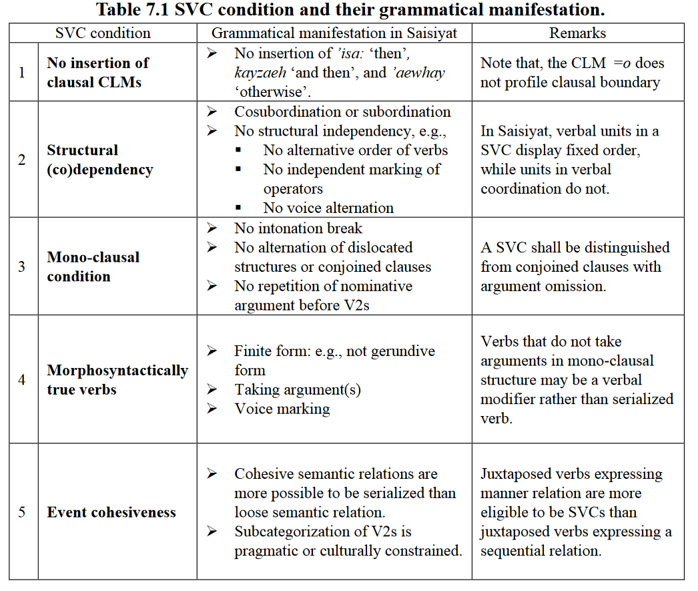

## Pagibete
### Details
Glottocode: pagi1243 <br> 
Family: Bantu <br>
Macroarea: Africa

### Coding
IU: 1 <br> Grouping: ? <br> Grammatical: ?

> The final type of complement clause is an apparent paratactic construction. Again, the first verbs which occur in this type of construction are a restricted set: *gɛnɛ́ye* ‘to go’, *biyɛ́ye* ‘to come’, and *sikɛ́ye* ‘to repeat'. In this construction, two fully inflected verbs appear one after the other without any kind of conjunction or complementizer, just as in two regularly juxtaposed clauses. Semantically, however, they are tightly bound together. [@reader1998, 83-84]

### Examples

(@pagibete1) @reader1998, 84, example 91a

```r
gloss_example(transliteration = "...mba'bú asiké awɛndá embále lɔ́ɔ go'bɛlɔ́ɔ...",
             glosses = "Rat 3SG:repeat:NARR 3SG:see:NARR C5:money C5.DEM that:there:C5",
             free_translation = "...Rat again saw that money there...")
```

```
## <table class=" lightable-minimal" style='font-family: "Trebuchet MS", verdana, sans-serif; width: auto !important; '>
## <tbody>
##   <tr>
##    <td style="text-align:left;"> _...mba'bú_ </td>
##    <td style="text-align:left;"> _asiké_ </td>
##   </tr>
##   <tr>
##    <td style="text-align:left;"> Rat </td>
##    <td style="text-align:left;"> <span style="font-variant:small-caps;">3sg</span>:repeat:<span style="font-variant:small-caps;">narr</span> </td>
##   </tr>
## </tbody>
## </table> <table class=" lightable-minimal" style='font-family: "Trebuchet MS", verdana, sans-serif; width: auto !important; '>
## <tbody>
##   <tr>
##    <td style="text-align:left;"> _aw&lt;U+025B&gt;ndá_ </td>
##   </tr>
##   <tr>
##    <td style="text-align:left;"> <span style="font-variant:small-caps;">3sg</span>:see:<span style="font-variant:small-caps;">narr</span> </td>
##   </tr>
## </tbody>
## </table><table class=" lightable-minimal" style='font-family: "Trebuchet MS", verdana, sans-serif; width: auto !important; '>
## <tbody>
##   <tr>
##    <td style="text-align:left;"> _embále_ </td>
##   </tr>
##   <tr>
##    <td style="text-align:left;"> <span style="font-variant:small-caps;">c5</span>:money </td>
##   </tr>
## </tbody>
## </table><table class=" lightable-minimal" style='font-family: "Trebuchet MS", verdana, sans-serif; width: auto !important; '>
## <tbody>
##   <tr>
##    <td style="text-align:left;"> _l&lt;U+0254&gt;´&lt;U+0254&gt;_ </td>
##   </tr>
##   <tr>
##    <td style="text-align:left;"> <span style="font-variant:small-caps;">c5</span>.<span style="font-variant:small-caps;">dem</span> </td>
##   </tr>
## </tbody>
## </table><table class=" lightable-minimal" style='font-family: "Trebuchet MS", verdana, sans-serif; width: auto !important; border-bottom: 0;'>
## <tbody>
##   <tr>
##    <td style="text-align:left;"> _go'b&lt;U+025B&gt;l&lt;U+0254&gt;´&lt;U+0254&gt;..._ </td>
##   </tr>
##   <tr>
##    <td style="text-align:left;"> that:there:<span style="font-variant:small-caps;">c5</span> </td>
##   </tr>
## </tbody>
## <tfoot><tr><td style="padding: 0; " colspan="100%">
## <sup></sup> '...Rat again saw that money there...'</td></tr></tfoot>
## </table>
```

<!-- ## Pagu -->
<!-- ### Details -->
<!-- Glottocode: pagu1249 <br>  -->
<!-- Family: North Halmahera <br> -->
<!-- Macroarea: Papunesia -->

<!-- ### Coding -->
<!-- IU: 1 <br> Grouping: ? <br> Grammatical: 1 -->

<!-- > Citation [@source2001] -->

<!-- ### Examples -->

<!-- (@language1) @source2001, pg, example 27 -->
<!-- ```{r, echo=FALSE} -->
<!-- gloss_example(transliteration = "ko:dulu sulo:bo-mo: wElE sE:-ja:", -->
<!--              glosses = "downward NAME-DAT shout say-PST", -->
<!--              free_translation = "I shouted it down to Solo:bu.") -->
<!-- ``` -->

## Paluai
### Details
Glottocode: balu1257 <br> 
Family: Austronesian <br>
Macroarea: Papunesia

### Coding
IU: 1 <br> Grouping: ? <br> Grammatical: ?

> It is widely agreed that a sequence of verbs must comply with the following criteria to be regarded as a SVC (based on Aikhenvald (2006a) and references there):<br> 
1. Form a single predicate, without any overt marking of coordination, subordination or syntactic dependency<br>  
2. Describe what is conceptualised as a single event<br>  
3. Have intonation properties that are the same as those of a monoverbal clause<br>  
4. Have one tense, aspect and polarity value<br>  
5. Each component must be able to appear on its own<br>  
For Paluai SVCs, all of the criteria apply. [@schokkin2014, 317]

### Examples

(@paluai1) @schokkin2014, 324, example 1

```r
gloss_example(transliteration = "ip=ka-pêl pwon yep te-yo",
             glosses = "3PL=IRR.NSG-roll be_covered fire EMP-DEM.INT",
             free_translation = "They will cover up the fire by rolling stones onto it.",
             annotation = "ipkapêl pwon yep teo")
```

<table class=" lightable-minimal" style='font-family: "Trebuchet MS", verdana, sans-serif; width: auto !important; border-bottom: 0;'>
<tbody>
  <tr>
   <td style="text-align:left;"> ipkapêl </td>
   <td style="text-align:left;"> pwon </td>
   <td style="text-align:left;"> yep </td>
   <td style="text-align:left;"> teo </td>
  </tr>
  <tr>
   <td style="text-align:left;"> _ip=ka-pêl_ </td>
   <td style="text-align:left;"> _pwon_ </td>
   <td style="text-align:left;"> _yep_ </td>
   <td style="text-align:left;"> _te-yo_ </td>
  </tr>
  <tr>
   <td style="text-align:left;"> <span style="font-variant:small-caps;">3pl</span>=<span style="font-variant:small-caps;">irr</span>.<span style="font-variant:small-caps;">nsg</span>-roll </td>
   <td style="text-align:left;"> be_covered </td>
   <td style="text-align:left;"> fire </td>
   <td style="text-align:left;"> <span style="font-variant:small-caps;">emp</span>-<span style="font-variant:small-caps;">dem</span>.<span style="font-variant:small-caps;">int</span> </td>
  </tr>
</tbody>
<tfoot><tr><td style="padding: 0; " colspan="100%">
<sup></sup> 'They will cover up the fire by rolling stones onto it.'</td></tr></tfoot>
</table>

(@paluai2) @schokkin2014, 325, example 4

```r
gloss_example(transliteration = "ki-no arei mat=i",
             glosses = "IRR.3SG-IPFV bite die=3SG",
             free_translation = "He may bite him to death.",
             annotation = "kino arei mari")
```

<table class=" lightable-minimal" style='font-family: "Trebuchet MS", verdana, sans-serif; width: auto !important; border-bottom: 0;'>
<tbody>
  <tr>
   <td style="text-align:left;"> kino </td>
   <td style="text-align:left;"> arei </td>
   <td style="text-align:left;"> mari </td>
  </tr>
  <tr>
   <td style="text-align:left;"> _ki-no_ </td>
   <td style="text-align:left;"> _arei_ </td>
   <td style="text-align:left;"> _mat=i_ </td>
  </tr>
  <tr>
   <td style="text-align:left;"> <span style="font-variant:small-caps;">irr</span>.<span style="font-variant:small-caps;">3sg</span>-<span style="font-variant:small-caps;">ipfv</span> </td>
   <td style="text-align:left;"> bite </td>
   <td style="text-align:left;"> die=<span style="font-variant:small-caps;">3sg</span> </td>
  </tr>
</tbody>
<tfoot><tr><td style="padding: 0; " colspan="100%">
<sup></sup> 'He may bite him to death.'</td></tr></tfoot>
</table>

## Pech
### Details
Glottocode: pech1241 <br> 
Family: Chibchan <br>
Macroarea: North America

### Coding
IU: 1 <br> Grouping: ? <br> Grammatical: ?

> Verb + verb conjunction is accomplished by the use of serial verb-stems which include, for each verb involved, the stem and the subject-suffix (except for the 1st-person plural, for which only the stem is used for all but the last verb-stem), plus any associated object-prefixes... [@holt1999, 68]

### Examples

Note that glossing was not provided in the original source.

<!-- (@pech1) @holt1999, 68 -->
<!-- ```{r} -->
<!-- gloss_example(transliteration = "mángoh kúh-ẽ̀ʔ-pẽ́ʔ", -->
<!--              glosses = "mango buy-eat-FUT:EMPH", -->
<!--              free_translation = "He will buy and eat a mango.") -->
<!-- ``` -->

(@pech2) @holt1999, 68

```r
gloss_example(transliteration = "mikátes kúha-pèʔka-uši",
             glosses = "rope buy:1SG-bring:1SG-1SG.RECPST",
             free_translation = "I bought a rope and brought it (home).")
```

<table class=" lightable-minimal" style='font-family: "Trebuchet MS", verdana, sans-serif; width: auto !important; border-bottom: 0;'>
<tbody>
  <tr>
   <td style="text-align:left;"> _mikátes_ </td>
   <td style="text-align:left;"> _kúha-pè&lt;U+0294&gt;ka-us&lt;U+030C&gt;i_ </td>
  </tr>
  <tr>
   <td style="text-align:left;"> rope </td>
   <td style="text-align:left;"> buy:<span style="font-variant:small-caps;">1sg</span>-bring:<span style="font-variant:small-caps;">1sg</span>-<span style="font-variant:small-caps;">1sg</span>.<span style="font-variant:small-caps;">recpst</span> </td>
  </tr>
</tbody>
<tfoot><tr><td style="padding: 0; " colspan="100%">
<sup></sup> 'I bought a rope and brought it (home).'</td></tr></tfoot>
</table>

## Pnar
### Details
Glottocode: pnar1238 <br> 
Family: Austroasiatic <br>
Macroarea: Eurasia

### Coding
IU: 1 <br> Grouping: ? <br> Grammatical: 0

> SVCs in Pnar ... are composed of two verbal elements which occur together in a way that allows both verbs to affect the semantics of the verbal event. The two verbal elements generally occur side by side as a single element... 
In the case of SVCs without a clear head, neither verb root receives affixation, whereas in SVCs with a clear head, the head verb is (or can be) affixed. When the first verb can receive affixation, there seem to be no clear restrictions on what verbs can occur as the second element. When the second verb can receive affixation the first element tends to be a ‘light’ verb or auxiliary. [@ring2015,439]

### Examples

(@pnar1) @ring2015, 442, example 1090

```r
gloss_example(transliteration = "he=i=pɔr daŋ ja-tʃɔŋ ha ka= palɔŋ kʰian ka= palɔŋ tdut aʔ kɔ ha ka=ni ka kdʒat ɔ",
             glosses = "LOC=NEUT=time PROG PLURACT-sit LOC FEM= bed be_small FEM= bed break cut NOM LOC FEM=PROX FEM= leg 1SG.NOM",
             free_translation = "once, while we were sitting on the small bed, suddenly the bed broke, cutting my leg",
             annotation = "heipor dang ya-chong ha ka palong khian ka palong tdut ah ko ha kani ka kjat o")
```

<table class=" lightable-minimal" style='font-family: "Trebuchet MS", verdana, sans-serif; width: auto !important; '>
<tbody>
  <tr>
   <td style="text-align:left;"> heipor </td>
  </tr>
  <tr>
   <td style="text-align:left;"> _he=i=p&lt;U+0254&gt;r_ </td>
  </tr>
  <tr>
   <td style="text-align:left;"> <span style="font-variant:small-caps;">loc</span>=<span style="font-variant:small-caps;">neut</span>=time </td>
  </tr>
</tbody>
</table> <table class=" lightable-minimal" style='font-family: "Trebuchet MS", verdana, sans-serif; width: auto !important; '>
<tbody>
  <tr>
   <td style="text-align:left;"> dang </td>
  </tr>
  <tr>
   <td style="text-align:left;"> _da&lt;U+014B&gt;_ </td>
  </tr>
  <tr>
   <td style="text-align:left;"> <span style="font-variant:small-caps;">prog</span> </td>
  </tr>
</tbody>
</table><table class=" lightable-minimal" style='font-family: "Trebuchet MS", verdana, sans-serif; width: auto !important; '>
<tbody>
  <tr>
   <td style="text-align:left;"> palong </td>
  </tr>
  <tr>
   <td style="text-align:left;"> _pal&lt;U+0254&gt;&lt;U+014B&gt;_ </td>
  </tr>
  <tr>
   <td style="text-align:left;"> bed </td>
  </tr>
</tbody>
</table> <table class=" lightable-minimal" style='font-family: "Trebuchet MS", verdana, sans-serif; width: auto !important; '>
<tbody>
  <tr>
   <td style="text-align:left;"> khian </td>
  </tr>
  <tr>
   <td style="text-align:left;"> _k&lt;U+02B0&gt;ian_ </td>
  </tr>
  <tr>
   <td style="text-align:left;"> be_small </td>
  </tr>
</tbody>
</table> <table class=" lightable-minimal" style='font-family: "Trebuchet MS", verdana, sans-serif; width: auto !important; '>
<tbody>
  <tr>
   <td style="text-align:left;"> ka </td>
  </tr>
  <tr>
   <td style="text-align:left;"> _ka=_ </td>
  </tr>
  <tr>
   <td style="text-align:left;"> <span style="font-variant:small-caps;">fem</span>=<span style="font-variant:small-caps;">fem</span> </td>
  </tr>
</tbody>
</table><table class=" lightable-minimal" style='font-family: "Trebuchet MS", verdana, sans-serif; width: auto !important; '>
<tbody>
  <tr>
   <td style="text-align:left;"> ya-chong </td>
   <td style="text-align:left;"> ha </td>
   <td style="text-align:left;"> ka </td>
  </tr>
  <tr>
   <td style="text-align:left;"> _ja-t&lt;U+0283&gt;&lt;U+0254&gt;&lt;U+014B&gt;_ </td>
   <td style="text-align:left;"> _ha_ </td>
   <td style="text-align:left;"> _ka=_ </td>
  </tr>
  <tr>
   <td style="text-align:left;"> <span style="font-variant:small-caps;">pluract</span>-sit </td>
   <td style="text-align:left;"> <span style="font-variant:small-caps;">loc</span> </td>
   <td style="text-align:left;"> <span style="font-variant:small-caps;">fem</span>=<span style="font-variant:small-caps;">pluract</span> </td>
  </tr>
</tbody>
</table><table class=" lightable-minimal" style='font-family: "Trebuchet MS", verdana, sans-serif; width: auto !important; '>
<tbody>
  <tr>
   <td style="text-align:left;"> palong </td>
   <td style="text-align:left;"> tdut </td>
  </tr>
  <tr>
   <td style="text-align:left;"> _pal&lt;U+0254&gt;&lt;U+014B&gt;_ </td>
   <td style="text-align:left;"> _tdut_ </td>
  </tr>
  <tr>
   <td style="text-align:left;"> bed </td>
   <td style="text-align:left;"> break </td>
  </tr>
</tbody>
</table> <table class=" lightable-minimal" style='font-family: "Trebuchet MS", verdana, sans-serif; width: auto !important; '>
<tbody>
  <tr>
   <td style="text-align:left;"> ah </td>
  </tr>
  <tr>
   <td style="text-align:left;"> _a&lt;U+0294&gt;_ </td>
  </tr>
  <tr>
   <td style="text-align:left;"> cut </td>
  </tr>
</tbody>
</table> <table class=" lightable-minimal" style='font-family: "Trebuchet MS", verdana, sans-serif; width: auto !important; '>
<tbody>
  <tr>
   <td style="text-align:left;"> ko </td>
   <td style="text-align:left;"> ha </td>
  </tr>
  <tr>
   <td style="text-align:left;"> _k&lt;U+0254&gt;_ </td>
   <td style="text-align:left;"> _ha_ </td>
  </tr>
  <tr>
   <td style="text-align:left;"> <span style="font-variant:small-caps;">nom</span> </td>
   <td style="text-align:left;"> <span style="font-variant:small-caps;">loc</span> </td>
  </tr>
</tbody>
</table><table class=" lightable-minimal" style='font-family: "Trebuchet MS", verdana, sans-serif; width: auto !important; '>
<tbody>
  <tr>
   <td style="text-align:left;"> kjat </td>
  </tr>
  <tr>
   <td style="text-align:left;"> _kd&lt;U+0292&gt;at_ </td>
  </tr>
  <tr>
   <td style="text-align:left;"> leg </td>
  </tr>
</tbody>
</table> <table class=" lightable-minimal" style='font-family: "Trebuchet MS", verdana, sans-serif; width: auto !important; border-bottom: 0;'>
<tbody>
  <tr>
   <td style="text-align:left;"> o </td>
  </tr>
  <tr>
   <td style="text-align:left;"> _&lt;U+0254&gt;_ </td>
  </tr>
  <tr>
   <td style="text-align:left;"> <span style="font-variant:small-caps;">1sg</span>.<span style="font-variant:small-caps;">nom</span> </td>
  </tr>
</tbody>
<tfoot><tr><td style="padding: 0; " colspan="100%">
<sup></sup> 'once, while we were sitting on the small bed, suddenly the bed broke, cutting my leg'</td></tr></tfoot>
</table><table class=" lightable-minimal" style='font-family: "Trebuchet MS", verdana, sans-serif; width: auto !important; '>
<tbody>
  <tr>
   <td style="text-align:left;"> kani </td>
   <td style="text-align:left;"> ka </td>
  </tr>
  <tr>
   <td style="text-align:left;"> _ka=ni_ </td>
   <td style="text-align:left;"> _ka_ </td>
  </tr>
  <tr>
   <td style="text-align:left;"> <span style="font-variant:small-caps;">fem</span>=<span style="font-variant:small-caps;">prox</span> </td>
   <td style="text-align:left;"> <span style="font-variant:small-caps;">fem</span>=<span style="font-variant:small-caps;">fem</span> </td>
  </tr>
</tbody>
</table>

(@pnar2) @ring2015, 445, example 1100

```r
gloss_example(transliteration = "tɛ sɲiaw rɛm keʔ i ka= tʃɔŋ ka= tʰaw ŋut",
             glosses = "NVIS sense lose cry 1PL FEM= village FEM= place CL.HUM",
             free_translation = "so we felt disgraced, the people of the village",
             annotation = "tæ sñiaw ræm keih i ka chnong ka thaw ngut")
```

```
## <table class=" lightable-minimal" style='font-family: "Trebuchet MS", verdana, sans-serif; width: auto !important; '>
## <tbody>
##   <tr>
##    <td style="text-align:left;"> sñiaw </td>
##   </tr>
##   <tr>
##    <td style="text-align:left;"> _s&lt;U+0272&gt;iaw_ </td>
##   </tr>
##   <tr>
##    <td style="text-align:left;"> sense </td>
##   </tr>
## </tbody>
## </table> <table class=" lightable-minimal" style='font-family: "Trebuchet MS", verdana, sans-serif; width: auto !important; '>
## <tbody>
##   <tr>
##    <td style="text-align:left;"> ræm </td>
##   </tr>
##   <tr>
##    <td style="text-align:left;"> _r&lt;U+025B&gt;m_ </td>
##   </tr>
##   <tr>
##    <td style="text-align:left;"> lose </td>
##   </tr>
## </tbody>
## </table><table class=" lightable-minimal" style='font-family: "Trebuchet MS", verdana, sans-serif; width: auto !important; '>
## <tbody>
##   <tr>
##    <td style="text-align:left;"> tæ </td>
##   </tr>
##   <tr>
##    <td style="text-align:left;"> _t&lt;U+025B&gt;_ </td>
##   </tr>
##   <tr>
##    <td style="text-align:left;"> <span style="font-variant:small-caps;">nvis</span> </td>
##   </tr>
## </tbody>
## </table> <table class=" lightable-minimal" style='font-family: "Trebuchet MS", verdana, sans-serif; width: auto !important; '>
## <tbody>
##   <tr>
##    <td style="text-align:left;"> keih </td>
##    <td style="text-align:left;"> i </td>
##    <td style="text-align:left;"> ka </td>
##   </tr>
##   <tr>
##    <td style="text-align:left;"> _ke&lt;U+0294&gt;_ </td>
##    <td style="text-align:left;"> _i_ </td>
##    <td style="text-align:left;"> _ka=_ </td>
##   </tr>
##   <tr>
##    <td style="text-align:left;"> cry </td>
##    <td style="text-align:left;"> <span style="font-variant:small-caps;">1pl</span> </td>
##    <td style="text-align:left;"> <span style="font-variant:small-caps;">fem</span>=cry </td>
##   </tr>
## </tbody>
## </table><table class=" lightable-minimal" style='font-family: "Trebuchet MS", verdana, sans-serif; width: auto !important; '>
## <tbody>
##   <tr>
##    <td style="text-align:left;"> chnong </td>
##    <td style="text-align:left;"> ka </td>
##   </tr>
##   <tr>
##    <td style="text-align:left;"> _t&lt;U+0283&gt;&lt;U+0254&gt;&lt;U+014B&gt;_ </td>
##    <td style="text-align:left;"> _ka=_ </td>
##   </tr>
##   <tr>
##    <td style="text-align:left;"> village </td>
##    <td style="text-align:left;"> <span style="font-variant:small-caps;">fem</span>=village </td>
##   </tr>
## </tbody>
## </table> <table class=" lightable-minimal" style='font-family: "Trebuchet MS", verdana, sans-serif; width: auto !important; '>
## <tbody>
##   <tr>
##    <td style="text-align:left;"> thaw </td>
##   </tr>
##   <tr>
##    <td style="text-align:left;"> _t&lt;U+02B0&gt;aw_ </td>
##   </tr>
##   <tr>
##    <td style="text-align:left;"> place </td>
##   </tr>
## </tbody>
## </table><table class=" lightable-minimal" style='font-family: "Trebuchet MS", verdana, sans-serif; width: auto !important; border-bottom: 0;'>
## <tbody>
##   <tr>
##    <td style="text-align:left;"> ngut </td>
##   </tr>
##   <tr>
##    <td style="text-align:left;"> _&lt;U+014B&gt;ut_ </td>
##   </tr>
##   <tr>
##    <td style="text-align:left;"> <span style="font-variant:small-caps;">cl</span>.<span style="font-variant:small-caps;">hum</span> </td>
##   </tr>
## </tbody>
## <tfoot><tr><td style="padding: 0; " colspan="100%">
## <sup></sup> 'so we felt disgraced, the people of the village'</td></tr></tfoot>
## </table>
```

(@pnar3) @ring2015, 469, example 1171

```r
gloss_example(transliteration = "ne=i=tɛ jeɲ laj li-lor ɔ",
             glosses = "ABL=NEUT=NVIS stand go DUR-plow 1SG.NOM",
             free_translation = "then I would stand and continue/begin plowing again",
             annotation = "neitæ yeñ lai liloor o")
```

<table class=" lightable-minimal" style='font-family: "Trebuchet MS", verdana, sans-serif; width: auto !important; border-bottom: 0;'>
<tbody>
  <tr>
   <td style="text-align:left;"> neitæ </td>
   <td style="text-align:left;"> yeñ </td>
   <td style="text-align:left;"> lai </td>
   <td style="text-align:left;"> liloor </td>
   <td style="text-align:left;"> o </td>
  </tr>
  <tr>
   <td style="text-align:left;"> _ne=i=t&lt;U+025B&gt;_ </td>
   <td style="text-align:left;"> _je&lt;U+0272&gt;_ </td>
   <td style="text-align:left;"> _laj_ </td>
   <td style="text-align:left;"> _li-lor_ </td>
   <td style="text-align:left;"> _&lt;U+0254&gt;_ </td>
  </tr>
  <tr>
   <td style="text-align:left;"> <span style="font-variant:small-caps;">abl</span>=<span style="font-variant:small-caps;">neut</span>=<span style="font-variant:small-caps;">nvis</span> </td>
   <td style="text-align:left;"> stand </td>
   <td style="text-align:left;"> go </td>
   <td style="text-align:left;"> <span style="font-variant:small-caps;">dur</span>-plow </td>
   <td style="text-align:left;"> <span style="font-variant:small-caps;">1sg</span>.<span style="font-variant:small-caps;">nom</span> </td>
  </tr>
</tbody>
<tfoot><tr><td style="padding: 0; " colspan="100%">
<sup></sup> 'then I would stand and continue/begin plowing again'</td></tr></tfoot>
</table>

## Polish!
### Details
Glottocode: poli1269 <br> 
Family: Indo-European <br>
Macroarea: Eurasia

### Coding
IU: 1 <br> Grouping: 0 <br> Grammatical: 0

### Examples

> Citation [@andrason2018]

(@polish1) Aiton 2016:200, example 27

```r
gloss_example(transliteration = "ko:dulu sulo:bo-mo: wElE sE:-ja:",
             glosses = "downward NAME-DAT shout say-PST",
             free_translation = "I shouted it down to Solo:bu.")
```

<table class=" lightable-minimal" style='font-family: "Trebuchet MS", verdana, sans-serif; width: auto !important; border-bottom: 0;'>
<tbody>
  <tr>
   <td style="text-align:left;"> _ko:dulu_ </td>
   <td style="text-align:left;"> _sulo:bo-mo:_ </td>
   <td style="text-align:left;"> _wElE_ </td>
   <td style="text-align:left;"> _sE:-ja:_ </td>
  </tr>
  <tr>
   <td style="text-align:left;"> downward </td>
   <td style="text-align:left;"> <span style="font-variant:small-caps;">name</span>-<span style="font-variant:small-caps;">dat</span> </td>
   <td style="text-align:left;"> shout </td>
   <td style="text-align:left;"> say-<span style="font-variant:small-caps;">pst</span> </td>
  </tr>
</tbody>
<tfoot><tr><td style="padding: 0; " colspan="100%">
<sup></sup> 'I shouted it down to Solo:bu.'</td></tr></tfoot>
</table>

## Punjabi
### Details
Glottocode: panj1256 <br> 
Family: Indo-European <br>
Macroarea: Eurasia

### Coding
IU: 1 <br> Grouping: 0 <br> Grammatical: 0

> ...compound verbs involve primarily a sequence of two verbs. The first verb in the sequence is termed the 'main verb'. The second verb has variously been referred to as operator, auxiliary, reinforcer, vector, and explicator in hte South Asian linguistic literature (we will, henceforth, use the term explicator). The explicator verbs add specific abstract meaning to the meaning of the main verb. The primary meaning of the sentence is determined by the lexical meaning of the main verb. The explicator receives tense-aspectual marking. [@bhatia1993, 326]

> Often it is possible to drop the conjunction leaving the two sentences juxtaposed. The gap of the conjunction marker is filled either by a pause or by context. [@bhatia1993, 103]

### Examples

(@punjabi1) @bhatia1993, 326, example 1

```r
gloss_example(transliteration = "gurjit kaur bol báiTh-ii",
             glosses = "Gurjit Kaur speak sit:PST-F.S",
             free_translation = "Gurjit Kaur spoke inappropriately.")
```

<table class=" lightable-minimal" style='font-family: "Trebuchet MS", verdana, sans-serif; width: auto !important; border-bottom: 0;'>
<tbody>
  <tr>
   <td style="text-align:left;"> _gurjit_ </td>
   <td style="text-align:left;"> _kaur_ </td>
   <td style="text-align:left;"> _bol_ </td>
   <td style="text-align:left;"> _báiTh-ii_ </td>
  </tr>
  <tr>
   <td style="text-align:left;"> Gurjit </td>
   <td style="text-align:left;"> Kaur </td>
   <td style="text-align:left;"> speak </td>
   <td style="text-align:left;"> sit:<span style="font-variant:small-caps;">pst</span>-<span style="font-variant:small-caps;">f</span>.<span style="font-variant:small-caps;">s</span> </td>
  </tr>
</tbody>
<tfoot><tr><td style="padding: 0; " colspan="100%">
<sup></sup> 'Gurjit Kaur spoke inappropriately.'</td></tr></tfoot>
</table>

(@punjabi2) @bhatia1993, 327, example 6

```r
gloss_example(transliteration = "ó ro ditt-ii",
             glosses = "3SG cry give-PST.F.S",
             free_translation = "She cried (overtly).")
```

<table class=" lightable-minimal" style='font-family: "Trebuchet MS", verdana, sans-serif; width: auto !important; border-bottom: 0;'>
<tbody>
  <tr>
   <td style="text-align:left;"> _ó_ </td>
   <td style="text-align:left;"> _ro_ </td>
   <td style="text-align:left;"> _ditt-ii_ </td>
  </tr>
  <tr>
   <td style="text-align:left;"> <span style="font-variant:small-caps;">3sg</span> </td>
   <td style="text-align:left;"> cry </td>
   <td style="text-align:left;"> give-<span style="font-variant:small-caps;">pst</span>.<span style="font-variant:small-caps;">f</span>.<span style="font-variant:small-caps;">s</span> </td>
  </tr>
</tbody>
<tfoot><tr><td style="padding: 0; " colspan="100%">
<sup></sup> 'She cried (overtly).'</td></tr></tfoot>
</table>

<!-- ## Puyuma -->
<!-- ### Details -->
<!-- Glottocode: puyu1239 <br>  -->
<!-- Family: Austronesian <br> -->
<!-- Macroarea: Papunesia -->

<!-- ### Coding -->
<!-- IU: 1 <br> Grouping: ? <br> Grammatical: 1 -->

<!-- > Citation [@source2001] -->

<!-- ### Examples -->

<!-- (@language1) @source2001, pg, example 27 -->
<!-- ```{r, echo=FALSE} -->
<!-- gloss_example(transliteration = "ko:dulu sulo:bo-mo: wElE sE:-ja:", -->
<!--              glosses = "downward NAME-DAT shout say-PST", -->
<!--              free_translation = "I shouted it down to Solo:bu.") -->
<!-- ``` -->

<!-- ## Riuk Bekati' -->
<!-- ### Details -->
<!-- Glottocode: beka1241 <br>  -->
<!-- Family: Austronesian <br> -->
<!-- Macroarea: Papunesia -->

<!-- ### Coding -->
<!-- IU: 1 <br> Grouping: ? <br> Grammatical: 1 -->

<!-- > Citation [@source2001] -->

<!-- ### Examples -->

<!-- (@language1) @source2001, pg, example 27 -->
<!-- ```{r, echo=FALSE} -->
<!-- gloss_example(transliteration = "ko:dulu sulo:bo-mo: wElE sE:-ja:", -->
<!--              glosses = "downward NAME-DAT shout say-PST", -->
<!--              free_translation = "I shouted it down to Solo:bu.") -->
<!-- ``` -->

<!-- ## Rukai -->
<!-- ### Details -->
<!-- Glottocode: ruka1240 <br>  -->
<!-- Family: Austronesian <br> -->
<!-- Macroarea: Papunesia -->

<!-- ### Coding -->
<!-- IU: 1 <br> Grouping: ? <br> Grammatical: 1 -->

<!-- > Citation [@source2001] -->

<!-- ### Examples -->

<!-- (@language1) @source2001, pg, example 27 -->
<!-- ```{r, echo=FALSE} -->
<!-- gloss_example(transliteration = "ko:dulu sulo:bo-mo: wElE sE:-ja:", -->
<!--              glosses = "downward NAME-DAT shout say-PST", -->
<!--              free_translation = "I shouted it down to Solo:bu.") -->
<!-- ``` -->


## Sabanê!
### Details
Glottocode: saba1268 <br> 
Family: Nambiquaran <br>
Macroarea: South America

### Coding
IU: 1 <br> Grouping: 0 <br> Grammatical: 0

> When an identical agent/subject is involved in two actions in coordinated sentences, the verbs can be concatenated in which case only the last one receives all verbal suffixes. ... However, if tense or arguments are distinct, each sentence has its own TAM structure. In this case, sentences are just concatenated. [@dearaujo2004, 189-190]

### Examples

(@sabane1) @dearaujo2004, 129, example 8

```r
gloss_example(transliteration = "ip-a-ntal-i a-san-i-ntal-i",
             glosses = "see-VS-PRET-ASSR 3OBJ-catch-VS-PRET-ASSR",
             free_translation = "S/he saw it and caught it.")
```

<table class=" lightable-minimal" style='font-family: "Trebuchet MS", verdana, sans-serif; width: auto !important; border-bottom: 0;'>
<tbody>
  <tr>
   <td style="text-align:left;"> _ip-a-ntal-i_ </td>
   <td style="text-align:left;"> _a-san-i-ntal-i_ </td>
  </tr>
  <tr>
   <td style="text-align:left;"> see-<span style="font-variant:small-caps;">vs</span>-<span style="font-variant:small-caps;">pret</span>-<span style="font-variant:small-caps;">assr</span> </td>
   <td style="text-align:left;"> <span style="font-variant:small-caps;">3obj</span>-catch-<span style="font-variant:small-caps;">vs</span>-<span style="font-variant:small-caps;">pret</span>-<span style="font-variant:small-caps;">assr</span> </td>
  </tr>
</tbody>
<tfoot><tr><td style="padding: 0; " colspan="100%">
<sup></sup> 'S/he saw it and caught it.'</td></tr></tfoot>
</table>

(@sabane2) @dearaujo2004, 152, example 122

```r
gloss_example(transliteration = "sa-n-n t-osa-n-n",
             glosses = "catch-VS-IMP 1OBJ-give-VS-IMP",
             free_translation = "Catch (it) and give it to me.",
             comment = "[ˌsãˑtoˈsãː]")
```

<table class=" lightable-minimal" style='font-family: "Trebuchet MS", verdana, sans-serif; width: auto !important; border-bottom: 0;border-bottom: 0;'>
<tbody>
  <tr>
   <td style="text-align:left;"> _sa-n-n_ </td>
   <td style="text-align:left;"> _t-osa-n-n_ </td>
  </tr>
  <tr>
   <td style="text-align:left;"> catch-<span style="font-variant:small-caps;">vs</span>-<span style="font-variant:small-caps;">imp</span> </td>
   <td style="text-align:left;"> <span style="font-variant:small-caps;">1obj</span>-give-<span style="font-variant:small-caps;">vs</span>-<span style="font-variant:small-caps;">imp</span> </td>
  </tr>
</tbody>
<tfoot><tr><td style="padding: 0; " colspan="100%">
<sup></sup> [&lt;U+02CC&gt;sã&lt;U+02D1&gt;to'sã&lt;U+02D0&gt;]</td></tr></tfoot>
<tfoot><tr><td style="padding: 0; " colspan="100%">
<sup></sup> 'Catch (it) and give it to me.'</td></tr></tfoot>
</table>

(@sabane3) @dearaujo2004, 190, example 118

```r
gloss_example(transliteration = "towali wola ilul-i iney-i-dana",
             glosses = "1SBJ a_lot eat-VS drink-VS-PRS.EVID",
             free_translation = "I eat and drink a lot.")
```

<table class=" lightable-minimal" style='font-family: "Trebuchet MS", verdana, sans-serif; width: auto !important; border-bottom: 0;'>
<tbody>
  <tr>
   <td style="text-align:left;"> _towali_ </td>
   <td style="text-align:left;"> _wola_ </td>
   <td style="text-align:left;"> _ilul-i_ </td>
   <td style="text-align:left;"> _iney-i-dana_ </td>
  </tr>
  <tr>
   <td style="text-align:left;"> <span style="font-variant:small-caps;">1sbj</span> </td>
   <td style="text-align:left;"> a_lot </td>
   <td style="text-align:left;"> eat-<span style="font-variant:small-caps;">vs</span> </td>
   <td style="text-align:left;"> drink-<span style="font-variant:small-caps;">vs</span>-<span style="font-variant:small-caps;">prs</span>.<span style="font-variant:small-caps;">evid</span> </td>
  </tr>
</tbody>
<tfoot><tr><td style="padding: 0; " colspan="100%">
<sup></sup> 'I eat and drink a lot.'</td></tr></tfoot>
</table>

## Saisiyat
### Details
Glottocode: sais1237 <br> 
Family: Austronesian <br>
Macroarea: Papunesia

### Coding
IU: 1 <br> Grouping: 0 <br> Grammatical: 0


@wang2018, 321

### Examples

(@saisiyat1) @wang2018, 316, example 7.18a

```r
gloss_example(transliteration = "lasia kash-re're' ka loehoeng t<om>awbon ka ho'ol",
             glosses = "3PL.NOM step_on-tight ACC mortar <AV>stomp ACC glutinous_rice",
             free_translation = "They step onto the mortar to stomp the glutinous rice.")
```

<table class=" lightable-minimal" style='font-family: "Trebuchet MS", verdana, sans-serif; width: auto !important; border-bottom: 0;'>
<tbody>
  <tr>
   <td style="text-align:left;"> _lasia_ </td>
   <td style="text-align:left;"> _kash-re're'_ </td>
   <td style="text-align:left;"> _ka_ </td>
   <td style="text-align:left;"> _loehoeng_ </td>
   <td style="text-align:left;"> _t&lt;om&gt;awbon_ </td>
   <td style="text-align:left;"> _ka_ </td>
   <td style="text-align:left;"> _ho'ol_ </td>
  </tr>
  <tr>
   <td style="text-align:left;"> <span style="font-variant:small-caps;">3pl</span>.<span style="font-variant:small-caps;">nom</span> </td>
   <td style="text-align:left;"> step_on-tight </td>
   <td style="text-align:left;"> <span style="font-variant:small-caps;">acc</span> </td>
   <td style="text-align:left;"> mortar </td>
   <td style="text-align:left;"> &lt;<span style="font-variant:small-caps;">av</span>&gt;stomp </td>
   <td style="text-align:left;"> <span style="font-variant:small-caps;">acc</span> </td>
   <td style="text-align:left;"> glutinous_rice. </td>
  </tr>
</tbody>
<tfoot><tr><td style="padding: 0; " colspan="100%">
<sup></sup> 'They step onto the mortar to stomp the glutinous rice.'</td></tr></tfoot>
</table>

<!-- ## Samba Leko -->
<!-- ### Details -->
<!-- Glottocode: samb1305 <br>  -->
<!-- Family: Volta-Congo <br> -->
<!-- Macroarea: Africa -->

<!-- ### Coding -->
<!-- IU: 1 <br> Grouping: ? <br> Grammatical: 1 -->

<!-- > Citation [@source2001] -->

<!-- ### Examples -->

<!-- (@language1) @source2001, pg, example 27 -->
<!-- ```{r, echo=FALSE} -->
<!-- gloss_example(transliteration = "ko:dulu sulo:bo-mo: wElE sE:-ja:", -->
<!--              glosses = "downward NAME-DAT shout say-PST", -->
<!--              free_translation = "I shouted it down to Solo:bu.") -->
<!-- ``` -->


## Santa Mongolian
### Details
Glottocode: dong1285 <br> 
Family: Mongolic-Khitan <br>
Macroarea: Eurasian

### Coding
IU: 1 <br> Grouping: ? <br> Grammatical: ?

> ...the primary function ... is to specify 1) that the unmarked verb and the following verb are the *same* event; and 2) that there is a temporal/semantic relationship of *integration* between the two verbs. [@field1997, 422]

### Examples

(@santa1) @field1997, 390, example 93

```r
gloss_example(transliteration = "bi xolu ɑndɑ irə-wo",
             glosses = "1SG.NOM run escape come-PFV",
             free_translation = "I ran and escaped. / I escaped by running. / I came by means of escaping by running.")
```

<table class=" lightable-minimal" style='font-family: "Trebuchet MS", verdana, sans-serif; width: auto !important; border-bottom: 0;'>
<tbody>
  <tr>
   <td style="text-align:left;"> _bi_ </td>
   <td style="text-align:left;"> _xolu_ </td>
   <td style="text-align:left;"> _&lt;U+0251&gt;nd&lt;U+0251&gt;_ </td>
   <td style="text-align:left;"> _ir&lt;U+0259&gt;-wo_ </td>
  </tr>
  <tr>
   <td style="text-align:left;"> <span style="font-variant:small-caps;">1sg</span>.<span style="font-variant:small-caps;">nom</span> </td>
   <td style="text-align:left;"> run </td>
   <td style="text-align:left;"> escape </td>
   <td style="text-align:left;"> come-<span style="font-variant:small-caps;">pfv</span> </td>
  </tr>
</tbody>
<tfoot><tr><td style="padding: 0; " colspan="100%">
<sup></sup> 'I ran and escaped. / I escaped by running. / I came by means of escaping by running.'</td></tr></tfoot>
</table>

(@santa2) @field1997, 422, example 123

```r
gloss_example(transliteration = "bi ɑji xolu hətʂə buɕin-dɑ-dʐiwo",
             glosses = "1SG.NOM afraid run tire weak-VBLZR-PROG", 
             free_translation = "I am running because I was afraid and I have became so tired I am weak.")
```

```
## <table class=" lightable-minimal" style='font-family: "Trebuchet MS", verdana, sans-serif; width: auto !important; '>
## <tbody>
##   <tr>
##    <td style="text-align:left;"> _bi_ </td>
##   </tr>
##   <tr>
##    <td style="text-align:left;"> <span style="font-variant:small-caps;">1sg</span>.<span style="font-variant:small-caps;">nom</span> </td>
##   </tr>
## </tbody>
## </table> <table class=" lightable-minimal" style='font-family: "Trebuchet MS", verdana, sans-serif; width: auto !important; '>
## <tbody>
##   <tr>
##    <td style="text-align:left;"> _&lt;U+0251&gt;ji_ </td>
##   </tr>
##   <tr>
##    <td style="text-align:left;"> afraid </td>
##   </tr>
## </tbody>
## </table><table class=" lightable-minimal" style='font-family: "Trebuchet MS", verdana, sans-serif; width: auto !important; '>
## <tbody>
##   <tr>
##    <td style="text-align:left;"> _xolu_ </td>
##   </tr>
##   <tr>
##    <td style="text-align:left;"> run </td>
##   </tr>
## </tbody>
## </table> <table class=" lightable-minimal" style='font-family: "Trebuchet MS", verdana, sans-serif; width: auto !important; '>
## <tbody>
##   <tr>
##    <td style="text-align:left;"> _h&lt;U+0259&gt;t&lt;U+0282&gt;&lt;U+0259&gt;_ </td>
##   </tr>
##   <tr>
##    <td style="text-align:left;"> tire </td>
##   </tr>
## </tbody>
## </table><table class=" lightable-minimal" style='font-family: "Trebuchet MS", verdana, sans-serif; width: auto !important; border-bottom: 0;'>
## <tbody>
##   <tr>
##    <td style="text-align:left;"> _bu&lt;U+0255&gt;in-d&lt;U+0251&gt;-d&lt;U+0290&gt;iwo_ </td>
##   </tr>
##   <tr>
##    <td style="text-align:left;"> weak-<span style="font-variant:small-caps;">vblzr</span>-<span style="font-variant:small-caps;">prog</span> </td>
##   </tr>
## </tbody>
## <tfoot><tr><td style="padding: 0; " colspan="100%">
## <sup></sup> 'I am running because I was afraid and I have became so tired I am weak.'</td></tr></tfoot>
## </table>
```

## Saramaccan
### Details
Glottocode: sara1340 <br> 
Family: Indo-European <br>
Macroarea: South America

### Coding
IU: 1 <br> Grouping: ? <br> Grammatical: 1

> Verbs in Saramaccan can occur in the same clause without markers of coordination or subordination, depicting single events that entail both actions. In this relationship, usually one of the verbs has grammaticalized or semantically drifted to some degree and modifies the other verb. However, other cases simply reveal Saramaccan as a grammar in which parataxis plays a greater role than in European languages. [@mcwhortergood2012, 137]

> Second verbs in serial verb constructions (cf. Chapter 8) can be clefted and copied when their usage as a serial verb is only moderately grammaticalized, such that a lexical residue remains (@saramaccan4). [@mcwhortergood2012, 206]

### Examples

(@saramaccan1) @mcwhortergood2012, 137, example 1

```r
gloss_example(transliteration = "Mi tá tjá wáta gó butá a di bóto déndu.",
             glosses = "1SG IPFV carry water go put LOC DEF boat inside",
             free_translation = "I am carrying water into the boat.")
```

<table class=" lightable-minimal" style='font-family: "Trebuchet MS", verdana, sans-serif; width: auto !important; border-bottom: 0;'>
<tbody>
  <tr>
   <td style="text-align:left;"> _Mi_ </td>
   <td style="text-align:left;"> _tá_ </td>
   <td style="text-align:left;"> _tjá_ </td>
   <td style="text-align:left;"> _wáta_ </td>
   <td style="text-align:left;"> _gó_ </td>
   <td style="text-align:left;"> _butá_ </td>
   <td style="text-align:left;"> _a_ </td>
   <td style="text-align:left;"> _di_ </td>
   <td style="text-align:left;"> _bóto_ </td>
   <td style="text-align:left;"> _déndu._ </td>
  </tr>
  <tr>
   <td style="text-align:left;"> <span style="font-variant:small-caps;">1sg</span> </td>
   <td style="text-align:left;"> <span style="font-variant:small-caps;">ipfv</span> </td>
   <td style="text-align:left;"> carry </td>
   <td style="text-align:left;"> water </td>
   <td style="text-align:left;"> go </td>
   <td style="text-align:left;"> put </td>
   <td style="text-align:left;"> <span style="font-variant:small-caps;">loc</span> </td>
   <td style="text-align:left;"> <span style="font-variant:small-caps;">def</span> </td>
   <td style="text-align:left;"> boat </td>
   <td style="text-align:left;"> inside </td>
  </tr>
</tbody>
<tfoot><tr><td style="padding: 0; " colspan="100%">
<sup></sup> 'I am carrying water into the boat.'</td></tr></tfoot>
</table>

(@saramaccan2) @mcwhortergood2012, 137, example 2

```r
gloss_example(transliteration = "A tá kulé tá lṍtu.",
             glosses = "3SG IPFV run IPFV go_round",
             free_translation = "He is running in circles.")
```

<table class=" lightable-minimal" style='font-family: "Trebuchet MS", verdana, sans-serif; width: auto !important; border-bottom: 0;'>
<tbody>
  <tr>
   <td style="text-align:left;"> _A_ </td>
   <td style="text-align:left;"> _tá_ </td>
   <td style="text-align:left;"> _kulé_ </td>
   <td style="text-align:left;"> _tá_ </td>
   <td style="text-align:left;"> _lõ´tu._ </td>
  </tr>
  <tr>
   <td style="text-align:left;"> <span style="font-variant:small-caps;">3sg</span> </td>
   <td style="text-align:left;"> <span style="font-variant:small-caps;">ipfv</span> </td>
   <td style="text-align:left;"> run </td>
   <td style="text-align:left;"> <span style="font-variant:small-caps;">ipfv</span> </td>
   <td style="text-align:left;"> go_round </td>
  </tr>
</tbody>
<tfoot><tr><td style="padding: 0; " colspan="100%">
<sup></sup> 'He is running in circles.'</td></tr></tfoot>
</table>

(@saramaccan3) @mcwhortergood2012, 149, example 88

```r
gloss_example(transliteration = "A súti dí patupátu túwɛ gó kai a wáta.",
             glosses = "3SG shoot DEF duck throw go fall LOC water",
             free_translation = "He shot the duck and it fell into the water.")
```

<table class=" lightable-minimal" style='font-family: "Trebuchet MS", verdana, sans-serif; width: auto !important; border-bottom: 0;'>
<tbody>
  <tr>
   <td style="text-align:left;"> _A_ </td>
   <td style="text-align:left;"> _súti_ </td>
   <td style="text-align:left;"> _dí_ </td>
   <td style="text-align:left;"> _patupátu_ </td>
   <td style="text-align:left;"> _túw&lt;U+025B&gt;_ </td>
   <td style="text-align:left;"> _gó_ </td>
   <td style="text-align:left;"> _kai_ </td>
   <td style="text-align:left;"> _a_ </td>
   <td style="text-align:left;"> _wáta._ </td>
  </tr>
  <tr>
   <td style="text-align:left;"> <span style="font-variant:small-caps;">3sg</span> </td>
   <td style="text-align:left;"> shoot </td>
   <td style="text-align:left;"> <span style="font-variant:small-caps;">def</span> </td>
   <td style="text-align:left;"> duck </td>
   <td style="text-align:left;"> throw </td>
   <td style="text-align:left;"> go </td>
   <td style="text-align:left;"> fall </td>
   <td style="text-align:left;"> <span style="font-variant:small-caps;">loc</span> </td>
   <td style="text-align:left;"> water </td>
  </tr>
</tbody>
<tfoot><tr><td style="padding: 0; " colspan="100%">
<sup></sup> 'He shot the duck and it fell into the water.'</td></tr></tfoot>
</table>

(@saramaccan4) @mcwhortergood2012, 206, example 7

```r
gloss_example(transliteration = "Gó Kobí kulé gó a dí wósu.",
             glosses = "go Kobi run go LOC DEF house",
             free_translation = "Kobi ran *to* the house.")
```

<table class=" lightable-minimal" style='font-family: "Trebuchet MS", verdana, sans-serif; width: auto !important; border-bottom: 0;'>
<tbody>
  <tr>
   <td style="text-align:left;"> _Gó_ </td>
   <td style="text-align:left;"> _Kobí_ </td>
   <td style="text-align:left;"> _kulé_ </td>
   <td style="text-align:left;"> _gó_ </td>
   <td style="text-align:left;"> _a_ </td>
   <td style="text-align:left;"> _dí_ </td>
   <td style="text-align:left;"> _wósu._ </td>
  </tr>
  <tr>
   <td style="text-align:left;"> go </td>
   <td style="text-align:left;"> Kobi </td>
   <td style="text-align:left;"> run </td>
   <td style="text-align:left;"> go </td>
   <td style="text-align:left;"> <span style="font-variant:small-caps;">loc</span> </td>
   <td style="text-align:left;"> <span style="font-variant:small-caps;">def</span> </td>
   <td style="text-align:left;"> house </td>
  </tr>
</tbody>
<tfoot><tr><td style="padding: 0; " colspan="100%">
<sup></sup> 'Kobi ran *to* the house.'</td></tr></tfoot>
</table>

(@saramaccan5) @mcwhortergood2012, 207, example 15

```r
gloss_example(transliteration = "Dí wósu wɛ a mbéi kabá.",
             glosses = "DEF house FOC 3SG make finish",
             free_translation = "He built the *house*.")
```

<table class=" lightable-minimal" style='font-family: "Trebuchet MS", verdana, sans-serif; width: auto !important; border-bottom: 0;'>
<tbody>
  <tr>
   <td style="text-align:left;"> _Dí_ </td>
   <td style="text-align:left;"> _wósu_ </td>
   <td style="text-align:left;"> _w&lt;U+025B&gt;_ </td>
   <td style="text-align:left;"> _a_ </td>
   <td style="text-align:left;"> _mbéi_ </td>
   <td style="text-align:left;"> _kabá._ </td>
  </tr>
  <tr>
   <td style="text-align:left;"> <span style="font-variant:small-caps;">def</span> </td>
   <td style="text-align:left;"> house </td>
   <td style="text-align:left;"> <span style="font-variant:small-caps;">foc</span> </td>
   <td style="text-align:left;"> <span style="font-variant:small-caps;">3sg</span> </td>
   <td style="text-align:left;"> make </td>
   <td style="text-align:left;"> finish </td>
  </tr>
</tbody>
<tfoot><tr><td style="padding: 0; " colspan="100%">
<sup></sup> 'He built the *house*.'</td></tr></tfoot>
</table>

## Savosavo
### Details
Glottocode: savo1255 <br> 
Family: Isolate <br>
Macroarea: Papunesia

### Coding
IU: 1 <br> Grouping: 0 <br> Grammatical: 1

> Serial verb constructions are commonly used in Savosavo. The criteria for identifying SVCs in Savosavo are that a sequence of verbs in one utterance <br> – are not linked by any overt conjunctive or subjunctive morpheme **AND** <br>– share one overt marking of finiteness, tense, aspect and/or mood on the last verb of the sequence. [@wegener2012, 186]

### Examples

(@savosavo1) @wegener2012, 187, example 359

```r
gloss_example(transliteration = "Kati=ze ata lo japani=gha=na l-olomi bo bomu-li ta-i.",
             glosses = "CERT=3PL here 3SG.MASC Japanese=PL=NOM 3SG.MASC.OBJ-know go bomb-3SG.MASC.OBJ FUT-FIN",
             free_translation = "Later the Japanese here will know it, go, and bomb it.")
```

```
## <table class=" lightable-minimal" style='font-family: "Trebuchet MS", verdana, sans-serif; width: auto !important; '>
## <tbody>
##   <tr>
##    <td style="text-align:left;"> _Kati=ze_ </td>
##    <td style="text-align:left;"> _ata_ </td>
##    <td style="text-align:left;"> _lo_ </td>
##    <td style="text-align:left;"> _japani=gha=na_ </td>
##    <td style="text-align:left;"> _l-olomi_ </td>
##    <td style="text-align:left;"> _bo_ </td>
##   </tr>
##   <tr>
##    <td style="text-align:left;"> <span style="font-variant:small-caps;">cert</span>=<span style="font-variant:small-caps;">3pl</span> </td>
##    <td style="text-align:left;"> here </td>
##    <td style="text-align:left;"> <span style="font-variant:small-caps;">3sg</span>.<span style="font-variant:small-caps;">masc</span> </td>
##    <td style="text-align:left;"> Japanese=<span style="font-variant:small-caps;">pl</span>=<span style="font-variant:small-caps;">nom</span> </td>
##    <td style="text-align:left;"> <span style="font-variant:small-caps;">3sg</span>.<span style="font-variant:small-caps;">masc</span>.<span style="font-variant:small-caps;">obj</span>-know </td>
##    <td style="text-align:left;"> go </td>
##   </tr>
## </tbody>
## </table> <table class=" lightable-minimal" style='font-family: "Trebuchet MS", verdana, sans-serif; width: auto !important; border-bottom: 0;'>
## <tbody>
##   <tr>
##    <td style="text-align:left;"> _bomu-li_ </td>
##    <td style="text-align:left;"> _ta-i._ </td>
##   </tr>
##   <tr>
##    <td style="text-align:left;"> bomb-<span style="font-variant:small-caps;">3sg</span>.<span style="font-variant:small-caps;">masc</span>.<span style="font-variant:small-caps;">obj</span> </td>
##    <td style="text-align:left;"> <span style="font-variant:small-caps;">fut</span>-<span style="font-variant:small-caps;">fin</span> </td>
##   </tr>
## </tbody>
## <tfoot><tr><td style="padding: 0; " colspan="100%">
## <sup></sup> 'Later the Japanese here will know it, go, and bomb it.'</td></tr></tfoot>
## </table>
```

(@savosavo2) @wegener2012, 188, example 365

```r
gloss_example(transliteration = "Elekati=gne kokoqa l-au p-ali ta-i.",
             glosses = "CERT=1SG.NOM stick 3SG.MASC.OBJ-take 2DU.OBJ-hit FUT-FIN",
             free_translation = "I will take a stick and hit you two.")
```

<table class=" lightable-minimal" style='font-family: "Trebuchet MS", verdana, sans-serif; width: auto !important; border-bottom: 0;'>
<tbody>
  <tr>
   <td style="text-align:left;"> _Elekati=gne_ </td>
   <td style="text-align:left;"> _kokoqa_ </td>
   <td style="text-align:left;"> _l-au_ </td>
   <td style="text-align:left;"> _p-ali_ </td>
   <td style="text-align:left;"> _ta-i._ </td>
  </tr>
  <tr>
   <td style="text-align:left;"> <span style="font-variant:small-caps;">cert</span>=<span style="font-variant:small-caps;">1sg</span>.<span style="font-variant:small-caps;">nom</span> </td>
   <td style="text-align:left;"> stick </td>
   <td style="text-align:left;"> <span style="font-variant:small-caps;">3sg</span>.<span style="font-variant:small-caps;">masc</span>.<span style="font-variant:small-caps;">obj</span>-take </td>
   <td style="text-align:left;"> <span style="font-variant:small-caps;">2du</span>.<span style="font-variant:small-caps;">obj</span>-hit </td>
   <td style="text-align:left;"> <span style="font-variant:small-caps;">fut</span>-<span style="font-variant:small-caps;">fin</span> </td>
  </tr>
</tbody>
<tfoot><tr><td style="padding: 0; " colspan="100%">
<sup></sup> 'I will take a stick and hit you two.'</td></tr></tfoot>
</table>

<!-- ## Selaru -->
<!-- ### Details -->
<!-- Glottocode: sela1259 <br>  -->
<!-- Family: Austronesian <br> -->
<!-- Macroarea: Papunesia -->

<!-- ### Coding -->
<!-- IU: 1 <br> Grouping: ? <br> Grammatical: 1 -->

<!-- > Citation [@source2001] -->

<!-- ### Examples -->

<!-- (@language1) @source2001, pg, example 27 -->
<!-- ```{r, echo=FALSE} -->
<!-- gloss_example(transliteration = "ko:dulu sulo:bo-mo: wElE sE:-ja:", -->
<!--              glosses = "downward NAME-DAT shout say-PST", -->
<!--              free_translation = "I shouted it down to Solo:bu.") -->
<!-- ``` -->

<!-- ## Selee -->
<!-- ### Details -->
<!-- Glottocode: sele1249 <br>  -->
<!-- Family: Kwa Volta-Congo <br> -->
<!-- Macroarea: Africa -->

<!-- ### Coding -->
<!-- IU: 1 <br> Grouping: ? <br> Grammatical: 1 -->

<!-- > Citation [@source2001] -->

<!-- ### Examples -->

<!-- (@language1) @source2001, pg, example 27 -->
<!-- ```{r, echo=FALSE} -->
<!-- gloss_example(transliteration = "ko:dulu sulo:bo-mo: wElE sE:-ja:", -->
<!--              glosses = "downward NAME-DAT shout say-PST", -->
<!--              free_translation = "I shouted it down to Solo:bu.") -->
<!-- ``` -->


## Semelai
### Details
Glottocode: seme1247 <br> 
Family: Austroasiatic <br>
Macroarea: Eurasia

### Coding
IU: 1 <br> Grouping: ? <br> Grammatical: 0

> The serial construction consists of two verbs, which combine into a single predicate in a monoclausal structure, forming a single phonological phrase. The serial unit conveys a single proposition. Syntactically, it consists not of two clauses, but of two predicates which share a single set of arguments. [@kruspe2004, 359]

> The SVC has the intonation contour of a single clause construction. There is no intonational indication of a clause boundary separating the two predicates. The introduction of such would change the whole nature of the clause. [@kruspe2004, 361-362]

> Clause concatenation is a string of two or more clauses, which a speaker chooses to represent as a string of events in a single unit under a single intonation contour. This construction is referred to as a sentence. Each clause within the sentence is marked off from the other clauses in the construction by a non-final pause. [@kruspe2004, 373]

### Examples

(@semelai1) @kruspe2004, 362, example 123

```r
gloss_example(transliteration = "ki=gorj paloh la=bapaʔ=hn knon=hn",
             glosses = "3A=take flee A=father=3POSS offspring=3POSS",
             free_translation = "The father fled taking his child.")
```

<table class=" lightable-minimal" style='font-family: "Trebuchet MS", verdana, sans-serif; width: auto !important; border-bottom: 0;'>
<tbody>
  <tr>
   <td style="text-align:left;"> _ki=gorj_ </td>
   <td style="text-align:left;"> _paloh_ </td>
   <td style="text-align:left;"> _la=bapa&lt;U+0294&gt;=hn_ </td>
   <td style="text-align:left;"> _knon=hn_ </td>
  </tr>
  <tr>
   <td style="text-align:left;"> <span style="font-variant:small-caps;">3a</span>=take </td>
   <td style="text-align:left;"> flee </td>
   <td style="text-align:left;"> <span style="font-variant:small-caps;">a</span>=father=<span style="font-variant:small-caps;">3poss</span> </td>
   <td style="text-align:left;"> offspring=<span style="font-variant:small-caps;">3poss</span> </td>
  </tr>
</tbody>
<tfoot><tr><td style="padding: 0; " colspan="100%">
<sup></sup> 'The father fled taking his child.'</td></tr></tfoot>
</table>

(@semelai2) @kruspe2004, 362, example 124

```r
gloss_example(transliteration = "ki=gorj la=bapaʔ=hn, paloh knon=hn",
             glosses = "3A=take A=father=3POSS flee offspring=3POSS",
             free_translation = "His father took (it) (and) (his) child fled.")
```

<table class=" lightable-minimal" style='font-family: "Trebuchet MS", verdana, sans-serif; width: auto !important; border-bottom: 0;'>
<tbody>
  <tr>
   <td style="text-align:left;"> _ki=gorj_ </td>
   <td style="text-align:left;"> _la=bapa&lt;U+0294&gt;=hn,_ </td>
   <td style="text-align:left;"> _paloh_ </td>
   <td style="text-align:left;"> _knon=hn_ </td>
  </tr>
  <tr>
   <td style="text-align:left;"> <span style="font-variant:small-caps;">3a</span>=take </td>
   <td style="text-align:left;"> <span style="font-variant:small-caps;">a</span>=father=<span style="font-variant:small-caps;">3poss</span> </td>
   <td style="text-align:left;"> flee </td>
   <td style="text-align:left;"> offspring=<span style="font-variant:small-caps;">3poss</span> </td>
  </tr>
</tbody>
<tfoot><tr><td style="padding: 0; " colspan="100%">
<sup></sup> 'His father took (it) (and) (his) child fled.'</td></tr></tfoot>
</table>

(@semelai1) @kruspe2004, 362, example 125

```r
gloss_example(transliteration = "ki=gorj la=bapaʔ=hn knon=hn, paloh",
             glosses = "3A=take A=father=3POSS offspring=3POSS flee",
             free_translation = "His father took his child (and they) fled.")
```

<table class=" lightable-minimal" style='font-family: "Trebuchet MS", verdana, sans-serif; width: auto !important; border-bottom: 0;'>
<tbody>
  <tr>
   <td style="text-align:left;"> _ki=gorj_ </td>
   <td style="text-align:left;"> _la=bapa&lt;U+0294&gt;=hn_ </td>
   <td style="text-align:left;"> _knon=hn,_ </td>
   <td style="text-align:left;"> _paloh_ </td>
  </tr>
  <tr>
   <td style="text-align:left;"> <span style="font-variant:small-caps;">3a</span>=take </td>
   <td style="text-align:left;"> <span style="font-variant:small-caps;">a</span>=father=<span style="font-variant:small-caps;">3poss</span> </td>
   <td style="text-align:left;"> offspring=<span style="font-variant:small-caps;">3poss</span> </td>
   <td style="text-align:left;"> flee </td>
  </tr>
</tbody>
<tfoot><tr><td style="padding: 0; " colspan="100%">
<sup></sup> 'His father took his child (and they) fled.'</td></tr></tfoot>
</table>

## Shabo
### Details
Glottocode: shab1252 <br> 
Family: Isolate <br>
Macroarea: Africa

### Coding
IU: 1 <br> Grouping: ? <br> Grammatical: 0

> “A serial verb construction contains two or more verb roots neither that are compounded ...nor members of separate clauses.” (Payne, 2006, p. 288). Serial verbs express various faces of one complex event. According to Payne, the difference of a prototypical serial verb from a coordinate clause construction is that in serial verb construction: 1. There is only one subject. 2. The tense/aspect marking is done only on one verb. 3. The intonation is characteristic of a single clause. (Payne, 2006, p. 289) <br> Chabu [exhibits] serial verbs that fulfill the criteria discussed by Payne. Most of them are formed using a movement verb as first component and the verbs *am* ‘come’ or *no* ‘go’ as a second component of the serial. [@kibebe2015, 327-328]

> ...there is only one subject in each clause. In addition, tense, aspect and number markers are suffixed to only the second verb in the clause. In fact there is a helping auxiliary that precedes the first verb which hosts some person, tense and aspect markers. However, the auxiliary and the markers attached to the auxiliary do not repeat themselves before the second verb. ... most Chabu serial verb constructions place the two verbs that constitute the serial in successive, adjacent position as compounded entities. [@kibebe2015, 329]

### Examples

(@shabo1) @kibebe2015, 328, example 746

```r
gloss_example(transliteration = "no-ʔa-k aɓal am-e",
             glosses = "go-CVB-AUX buy come-PST",
             free_translation = "He went, bought and came.")
```

<table class=" lightable-minimal" style='font-family: "Trebuchet MS", verdana, sans-serif; width: auto !important; border-bottom: 0;'>
<tbody>
  <tr>
   <td style="text-align:left;"> _no-&lt;U+0294&gt;a-k_ </td>
   <td style="text-align:left;"> _a&lt;U+0253&gt;al_ </td>
   <td style="text-align:left;"> _am-e_ </td>
  </tr>
  <tr>
   <td style="text-align:left;"> go-<span style="font-variant:small-caps;">cvb</span>-<span style="font-variant:small-caps;">aux</span> </td>
   <td style="text-align:left;"> buy </td>
   <td style="text-align:left;"> come-<span style="font-variant:small-caps;">pst</span> </td>
  </tr>
</tbody>
<tfoot><tr><td style="padding: 0; " colspan="100%">
<sup></sup> 'He went, bought and came.'</td></tr></tfoot>
</table>

(@shabo2) @kibebe2015, 328, example 747

```r
gloss_example(transliteration = "baj-e-m doku ponti-ka-k gera no-mo-je",
             glosses = "monkey-DEF-MASC house on-ALL-AUX ascend go-PROG-PST",
             free_translation = "The monkey was ascending on top of the house (away from the ground where the speaker was).")
```

<table class=" lightable-minimal" style='font-family: "Trebuchet MS", verdana, sans-serif; width: auto !important; border-bottom: 0;'>
<tbody>
  <tr>
   <td style="text-align:left;"> _baj-e-m_ </td>
   <td style="text-align:left;"> _doku_ </td>
   <td style="text-align:left;"> _ponti-ka-k_ </td>
   <td style="text-align:left;"> _gera_ </td>
   <td style="text-align:left;"> _no-mo-je_ </td>
  </tr>
  <tr>
   <td style="text-align:left;"> monkey-<span style="font-variant:small-caps;">def</span>-<span style="font-variant:small-caps;">masc</span> </td>
   <td style="text-align:left;"> house </td>
   <td style="text-align:left;"> on-<span style="font-variant:small-caps;">all</span>-<span style="font-variant:small-caps;">aux</span> </td>
   <td style="text-align:left;"> ascend </td>
   <td style="text-align:left;"> go-<span style="font-variant:small-caps;">prog</span>-<span style="font-variant:small-caps;">pst</span> </td>
  </tr>
</tbody>
<tfoot><tr><td style="padding: 0; " colspan="100%">
<sup></sup> 'The monkey was ascending on top of the house (away from the ground where the speaker was).'</td></tr></tfoot>
</table>

## Sheko!
### Details
Glottocode: shek1245 <br> 
Family: Dizoid <br>
Macroarea: Africa

### Coding
IU: 1 <br> Grouping: ? <br> Grammatical: ?

### Examples

> Citation [@hellenthal2010, 334-341]

(@language1) Aiton 2016:200, example 27

```r
gloss_example(transliteration = "ko:dulu sulo:bo-mo: wElE sE:-ja:",
             glosses = "downward NAME-DAT shout say-PST",
             free_translation = "I shouted it down to Solo:bu.")
```

<table class=" lightable-minimal" style='font-family: "Trebuchet MS", verdana, sans-serif; width: auto !important; border-bottom: 0;'>
<tbody>
  <tr>
   <td style="text-align:left;"> _ko:dulu_ </td>
   <td style="text-align:left;"> _sulo:bo-mo:_ </td>
   <td style="text-align:left;"> _wElE_ </td>
   <td style="text-align:left;"> _sE:-ja:_ </td>
  </tr>
  <tr>
   <td style="text-align:left;"> downward </td>
   <td style="text-align:left;"> <span style="font-variant:small-caps;">name</span>-<span style="font-variant:small-caps;">dat</span> </td>
   <td style="text-align:left;"> shout </td>
   <td style="text-align:left;"> say-<span style="font-variant:small-caps;">pst</span> </td>
  </tr>
</tbody>
<tfoot><tr><td style="padding: 0; " colspan="100%">
<sup></sup> 'I shouted it down to Solo:bu.'</td></tr></tfoot>
</table>

## Shilluk
### Details
Glottocode: shil1265 <br> 
Family: Nilotic <br>
Macroarea: Africa

### Coding
IU: 1 <br> Grouping: ? <br> Grammatical: 1

> Serialisation can be defined by the presence of two lexical roots serving as predicates within the same clause. In such constructions, any tense marking is expressed on the first verb, and the topic is resumed by a pronoun before the second constituent head. [@remijsenayoker2018, 51, footnote 22]

> A second example involves a serial verb construction. In \ref(@shilluk1), the topic of this clause is a woman called Apwodho. She is referenced before the first constituent verb in the serialisation (á-weekɪ ̀ ), and again, resumptively, by the pronoun ɛ́ , immediately before the second constituent verb, cʊ̂́ʊʊl ̄ , which is in Applicative voice. Apwodho constitutes the semantic role of Instrument, used to compensate the hippo, the semantic object that follows the verb. [@remijsenayoker2018, 25]

### Examples

(@shilluk1) @remijsenayoker2018, 25, example 19

```r
gloss_example(transliteration = "ápwǒoot̪ɔ́ ɲɪ̄ ɟɪ̀ɪw ɲɪ̄ mīi ʊ́kwɛ́r á-weekɪ̀ ɲɪ́kāaaŋɔ̄ ɛ́ cʊ̂́ʊʊl ̄a pʌ̀ʌʌr",
             glosses = "Apwodho daughter:PRT Jiw daughter:PRT father:PRT Okwer PST-give:BNF:OV Nyikango PR3S pay.for:XV FOC hippo",
             free_translation = "Apwodho, the daughter of Jiw, the sister of Okwer, was given to Nyikango in compensation for for the hippo.")
```

<table class=" lightable-minimal" style='font-family: "Trebuchet MS", verdana, sans-serif; width: auto !important; '>
<tbody>
  <tr>
   <td style="text-align:left;"> _&lt;U+0272&gt;&lt;U+026A&gt;¯_ </td>
  </tr>
  <tr>
   <td style="text-align:left;"> daughter:<span style="font-variant:small-caps;">prt</span> </td>
  </tr>
</tbody>
</table> <table class=" lightable-minimal" style='font-family: "Trebuchet MS", verdana, sans-serif; width: auto !important; '>
<tbody>
  <tr>
   <td style="text-align:left;"> _&lt;U+025F&gt;&lt;U+026A&gt;`&lt;U+026A&gt;w_ </td>
  </tr>
  <tr>
   <td style="text-align:left;"> Jiw </td>
  </tr>
</tbody>
</table><table class=" lightable-minimal" style='font-family: "Trebuchet MS", verdana, sans-serif; width: auto !important; '>
<tbody>
  <tr>
   <td style="text-align:left;"> _&lt;U+0272&gt;&lt;U+026A&gt;¯_ </td>
   <td style="text-align:left;"> _mi¯i_ </td>
  </tr>
  <tr>
   <td style="text-align:left;"> daughter:<span style="font-variant:small-caps;">prt</span> </td>
   <td style="text-align:left;"> father:<span style="font-variant:small-caps;">prt</span> </td>
  </tr>
</tbody>
</table> <table class=" lightable-minimal" style='font-family: "Trebuchet MS", verdana, sans-serif; width: auto !important; '>
<tbody>
  <tr>
   <td style="text-align:left;"> _&lt;U+028A&gt;´kw&lt;U+025B&gt;´r_ </td>
  </tr>
  <tr>
   <td style="text-align:left;"> Okwer </td>
  </tr>
</tbody>
</table><table class=" lightable-minimal" style='font-family: "Trebuchet MS", verdana, sans-serif; width: auto !important; '>
<tbody>
  <tr>
   <td style="text-align:left;"> _a´-week&lt;U+026A&gt;`_ </td>
  </tr>
  <tr>
   <td style="text-align:left;"> <span style="font-variant:small-caps;">pst</span>-give:<span style="font-variant:small-caps;">bnf</span>:<span style="font-variant:small-caps;">ov</span> </td>
  </tr>
</tbody>
</table> <table class=" lightable-minimal" style='font-family: "Trebuchet MS", verdana, sans-serif; width: auto !important; '>
<tbody>
  <tr>
   <td style="text-align:left;"> _&lt;U+0272&gt;&lt;U+026A&gt;´ka¯aa&lt;U+014B&gt;&lt;U+0254&gt;¯_ </td>
  </tr>
  <tr>
   <td style="text-align:left;"> Nyikango </td>
  </tr>
</tbody>
</table><table class=" lightable-minimal" style='font-family: "Trebuchet MS", verdana, sans-serif; width: auto !important; '>
<tbody>
  <tr>
   <td style="text-align:left;"> _&lt;U+025B&gt;´_ </td>
  </tr>
  <tr>
   <td style="text-align:left;"> <span style="font-variant:small-caps;">pr3s</span> </td>
  </tr>
</tbody>
</table> <table class=" lightable-minimal" style='font-family: "Trebuchet MS", verdana, sans-serif; width: auto !important; '>
<tbody>
  <tr>
   <td style="text-align:left;"> _c&lt;U+028A&gt;^´&lt;U+028A&gt;&lt;U+028A&gt;l_ </td>
   <td style="text-align:left;"> _¯a_ </td>
  </tr>
  <tr>
   <td style="text-align:left;"> pay.for:<span style="font-variant:small-caps;">xv</span> </td>
   <td style="text-align:left;"> <span style="font-variant:small-caps;">foc</span> </td>
  </tr>
</tbody>
</table><table class=" lightable-minimal" style='font-family: "Trebuchet MS", verdana, sans-serif; width: auto !important; '>
<tbody>
  <tr>
   <td style="text-align:left;"> _a´pwo&lt;U+030C&gt;oot&lt;U+032A&gt;&lt;U+0254&gt;´_ </td>
  </tr>
  <tr>
   <td style="text-align:left;"> Apwodho </td>
  </tr>
</tbody>
</table> <table class=" lightable-minimal" style='font-family: "Trebuchet MS", verdana, sans-serif; width: auto !important; border-bottom: 0;'>
<tbody>
  <tr>
   <td style="text-align:left;"> _p&lt;U+028C&gt;`&lt;U+028C&gt;&lt;U+028C&gt;r_ </td>
  </tr>
  <tr>
   <td style="text-align:left;"> hippo </td>
  </tr>
</tbody>
<tfoot><tr><td style="padding: 0; " colspan="100%">
<sup></sup> 'Apwodho, the daughter of Jiw, the sister of Okwer, was given to Nyikango in compensation for for the hippo.'</td></tr></tfoot>
</table>

(@shilluk2) @remijsenayoker2018, 51, example 71b

```r
gloss_example(transliteration = "ábác cấm̄ kwʌ̄n ɛ́ ʊ́-cùŋɔ",
             glosses = "Abac eat:NTENS porridge PR3S IMPF-stand",
             free_translation = "Abac eats porridge while standing.")
```

```
## <table class=" lightable-minimal" style='font-family: "Trebuchet MS", verdana, sans-serif; width: auto !important; '>
## <tbody>
##   <tr>
##    <td style="text-align:left;"> _a´ba´c_ </td>
##   </tr>
##   <tr>
##    <td style="text-align:left;"> Abac </td>
##   </tr>
## </tbody>
## </table> <table class=" lightable-minimal" style='font-family: "Trebuchet MS", verdana, sans-serif; width: auto !important; '>
## <tbody>
##   <tr>
##    <td style="text-align:left;"> _ca^´m¯_ </td>
##   </tr>
##   <tr>
##    <td style="text-align:left;"> eat:<span style="font-variant:small-caps;">ntens</span> </td>
##   </tr>
## </tbody>
## </table><table class=" lightable-minimal" style='font-family: "Trebuchet MS", verdana, sans-serif; width: auto !important; '>
## <tbody>
##   <tr>
##    <td style="text-align:left;"> _kw&lt;U+028C&gt;¯n_ </td>
##   </tr>
##   <tr>
##    <td style="text-align:left;"> porridge </td>
##   </tr>
## </tbody>
## </table> <table class=" lightable-minimal" style='font-family: "Trebuchet MS", verdana, sans-serif; width: auto !important; '>
## <tbody>
##   <tr>
##    <td style="text-align:left;"> _&lt;U+025B&gt;´_ </td>
##   </tr>
##   <tr>
##    <td style="text-align:left;"> <span style="font-variant:small-caps;">pr3s</span> </td>
##   </tr>
## </tbody>
## </table><table class=" lightable-minimal" style='font-family: "Trebuchet MS", verdana, sans-serif; width: auto !important; border-bottom: 0;'>
## <tbody>
##   <tr>
##    <td style="text-align:left;"> _&lt;U+028A&gt;´-cu`&lt;U+014B&gt;&lt;U+0254&gt;_ </td>
##   </tr>
##   <tr>
##    <td style="text-align:left;"> <span style="font-variant:small-caps;">impf</span>-stand </td>
##   </tr>
## </tbody>
## <tfoot><tr><td style="padding: 0; " colspan="100%">
## <sup></sup> 'Abac eats porridge while standing.'</td></tr></tfoot>
## </table>
```

## Southeastern Tepehuan
### Details
Glottocode: sout2976 <br> 
Family: Uto-Aztecan <br>
Macroarea: North America

### Coding
IU: 1 <br> Grouping: ? <br> Grammatical: 0

> In (@tepehuan1) there are three clauses. The first two are linked without conjunction or drop in intonation, so that the pronoun referring to the subject of the second is phonologically suffixed to the subject enclitic of the first. This is the highest form of continuity possible between two events. The second two are linked only by a slight pause and drop in intonation, indicated by the period.
[@willett1991,223]

> SET has a limited number of complex verb phrases that function as a complementation strategy. They have no overt subordination or coordination markers. These constructions exhibit the following properties of serial verb constructions: i) they share the same subject and markers of tense and aspect; ii) they contain two verbs without overt markers of coordination or subordination; iii) the verbs form a single predicate; iv) serialized verbs also occur alone in non-serial constructions; v) the negation particle *cham* has scope over the two verbs; vi) the adverb has scope over the two verbs; vii) there is no lexical or grammatical material between the verbs, with the exception of the cause-effect type; and viii) these predicates are not marked by the suffix -ji, which is a productive marker expressing dependency. [@garciasalido2014, 141]

> Juxtaposition is often preferred in natural conjunction--that is, when the two conjuncts usually go together and form some kind of conceptual unit. In SET the lack of an overt coordinator may allow the encoding of a construction that is called a serial verb, where the two verbs in a sequence express one single event, as illustrated in (@tepehuan2) with the verbs ‘work’ and ‘plant.’ The two verbs in this construction do not show any kind of dependency.
[@garciasalido2014, 194]

### Examples

(@tepehuan3) @garciasalido2014, 223, example 86b

```r
gloss_example(transliteration = "Mi’-ñ-kiijax chu-di-dha’ gu burru",
             glosses = "DIR-1SG.PO-kick DUR-make-APPL DET donkey",
             free_translation = "He made the donkey kick me.")
```

<table class=" lightable-minimal" style='font-family: "Trebuchet MS", verdana, sans-serif; width: auto !important; border-bottom: 0;'>
<tbody>
  <tr>
   <td style="text-align:left;"> _Mi'-ñ-kiijax_ </td>
   <td style="text-align:left;"> _chu-di-dha'_ </td>
   <td style="text-align:left;"> _gu_ </td>
   <td style="text-align:left;"> _burru_ </td>
  </tr>
  <tr>
   <td style="text-align:left;"> <span style="font-variant:small-caps;">dir</span>-<span style="font-variant:small-caps;">1sg</span>.<span style="font-variant:small-caps;">po</span>-kick </td>
   <td style="text-align:left;"> <span style="font-variant:small-caps;">dur</span>-make-<span style="font-variant:small-caps;">appl</span> </td>
   <td style="text-align:left;"> <span style="font-variant:small-caps;">det</span> </td>
   <td style="text-align:left;"> donkey </td>
  </tr>
</tbody>
<tfoot><tr><td style="padding: 0; " colspan="100%">
<sup></sup> 'He made the donkey kick me.'</td></tr></tfoot>
</table>

(@tepehuan1) @willett1991, 223, example 658

```r
gloss_example(transliteration = "Jiñ-pahlvuidya-'-ap-añ jupsa-' dyi postis. Jai'-ñ mi-chuttu-'.",
             glosses = "1SG-help-FUT-2SG-1SG remove-FUT ART posts others-1SG there-stand-FUT",
             free_translation = "Please help me remove these posts. I (want to) put other ones in.")
```

<table class=" lightable-minimal" style='font-family: "Trebuchet MS", verdana, sans-serif; width: auto !important; border-bottom: 0;'>
<tbody>
  <tr>
   <td style="text-align:left;"> _Jiñ-pahlvuidya-'-ap-añ_ </td>
   <td style="text-align:left;"> _jupsa-'_ </td>
   <td style="text-align:left;"> _dyi_ </td>
   <td style="text-align:left;"> _postis._ </td>
   <td style="text-align:left;"> _Jai'-ñ_ </td>
   <td style="text-align:left;"> _mi-chuttu-'._ </td>
  </tr>
  <tr>
   <td style="text-align:left;"> <span style="font-variant:small-caps;">1sg</span>-help-<span style="font-variant:small-caps;">fut</span>-<span style="font-variant:small-caps;">2sg</span>-<span style="font-variant:small-caps;">1sg</span> </td>
   <td style="text-align:left;"> remove-<span style="font-variant:small-caps;">fut</span> </td>
   <td style="text-align:left;"> <span style="font-variant:small-caps;">art</span> </td>
   <td style="text-align:left;"> posts </td>
   <td style="text-align:left;"> others-<span style="font-variant:small-caps;">1sg</span> </td>
   <td style="text-align:left;"> there-stand-<span style="font-variant:small-caps;">fut</span> </td>
  </tr>
</tbody>
<tfoot><tr><td style="padding: 0; " colspan="100%">
<sup></sup> 'Please help me remove these posts. I (want to) put other ones in.'</td></tr></tfoot>
</table>

(@tepehuan2) @garciasalido2014, 195, example 23

```r
gloss_example(transliteration = "Tu-tur gok yuntach ja-bia’-ka tu-m-jua-da’ ti-m-ɨs-da’ gu tu-kua-da-ich gio ba’ na-gu’ tu-m-juan-da’ aserradera ji’x-na=m jiipi’ñ-ka’ na-gu’ gu alhi=p ba=r-gɜ’-ka’",
             glosses = "RED:PL-bull two yoke 3PL.PO-have-EST DUR-3R/M-work-CONT DUR-3R/M-plant-CONT DET DUR-food-CONT-1PL.SBJ.PFV COORD SEQ SUB-ADVR DUR-3R/M-work-CONT sawmill QUANT-SUB=3PL.SBJ rest-EST SUB-ADVR DET boy=IT CMP=COP-big-EST",
             free_translation = "We had two yoke of oxen, there was work, there was planting, we used to eat, and then there was work at the sawmill and when they rested...because the child was already big.")
```

<table class=" lightable-minimal" style='font-family: "Trebuchet MS", verdana, sans-serif; width: auto !important; '>
<tbody>
  <tr>
   <td style="text-align:left;"> _ji'x-na=m_ </td>
   <td style="text-align:left;"> _jiipi'ñ-ka'_ </td>
   <td style="text-align:left;"> _na-gu'_ </td>
   <td style="text-align:left;"> _gu_ </td>
   <td style="text-align:left;"> _alhi=p_ </td>
  </tr>
  <tr>
   <td style="text-align:left;"> <span style="font-variant:small-caps;">quant</span>-<span style="font-variant:small-caps;">sub</span>=<span style="font-variant:small-caps;">3pl</span>.<span style="font-variant:small-caps;">sbj</span> </td>
   <td style="text-align:left;"> rest-<span style="font-variant:small-caps;">est</span> </td>
   <td style="text-align:left;"> <span style="font-variant:small-caps;">sub</span>-<span style="font-variant:small-caps;">advr</span> </td>
   <td style="text-align:left;"> <span style="font-variant:small-caps;">det</span> </td>
   <td style="text-align:left;"> boy=<span style="font-variant:small-caps;">it</span> </td>
  </tr>
</tbody>
</table> <table class=" lightable-minimal" style='font-family: "Trebuchet MS", verdana, sans-serif; width: auto !important; border-bottom: 0;'>
<tbody>
  <tr>
   <td style="text-align:left;"> _ba=r-g&lt;U+025C&gt;'-ka'_ </td>
  </tr>
  <tr>
   <td style="text-align:left;"> <span style="font-variant:small-caps;">cmp</span>=<span style="font-variant:small-caps;">cop</span>-big-<span style="font-variant:small-caps;">est</span> </td>
  </tr>
</tbody>
<tfoot><tr><td style="padding: 0; " colspan="100%">
<sup></sup> 'We had two yoke of oxen, there was work, there was planting, we used to eat, and then there was work at the sawmill and when they rested...because the child was already big.'</td></tr></tfoot>
</table><table class=" lightable-minimal" style='font-family: "Trebuchet MS", verdana, sans-serif; width: auto !important; '>
<tbody>
  <tr>
   <td style="text-align:left;"> _Tu-tur_ </td>
   <td style="text-align:left;"> _gok_ </td>
   <td style="text-align:left;"> _yuntach_ </td>
   <td style="text-align:left;"> _ja-bia'-ka_ </td>
   <td style="text-align:left;"> _tu-m-jua-da'_ </td>
   <td style="text-align:left;"> _ti-m-&lt;U+0268&gt;s-da'_ </td>
  </tr>
  <tr>
   <td style="text-align:left;"> <span style="font-variant:small-caps;">red</span>:<span style="font-variant:small-caps;">pl</span>-bull </td>
   <td style="text-align:left;"> two </td>
   <td style="text-align:left;"> yoke </td>
   <td style="text-align:left;"> <span style="font-variant:small-caps;">3pl</span>.<span style="font-variant:small-caps;">po</span>-have-<span style="font-variant:small-caps;">est</span> </td>
   <td style="text-align:left;"> <span style="font-variant:small-caps;">dur</span>-<span style="font-variant:small-caps;">3r/m</span>-work-<span style="font-variant:small-caps;">cont</span> </td>
   <td style="text-align:left;"> <span style="font-variant:small-caps;">dur</span>-<span style="font-variant:small-caps;">3r/m</span>-plant-<span style="font-variant:small-caps;">cont</span> </td>
  </tr>
</tbody>
</table> <table class=" lightable-minimal" style='font-family: "Trebuchet MS", verdana, sans-serif; width: auto !important; '>
<tbody>
  <tr>
   <td style="text-align:left;"> _gu_ </td>
   <td style="text-align:left;"> _tu-kua-da-ich_ </td>
   <td style="text-align:left;"> _gio_ </td>
   <td style="text-align:left;"> _ba'_ </td>
   <td style="text-align:left;"> _na-gu'_ </td>
   <td style="text-align:left;"> _tu-m-juan-da'_ </td>
   <td style="text-align:left;"> _aserradera_ </td>
  </tr>
  <tr>
   <td style="text-align:left;"> <span style="font-variant:small-caps;">det</span> </td>
   <td style="text-align:left;"> <span style="font-variant:small-caps;">dur</span>-food-<span style="font-variant:small-caps;">cont</span>-<span style="font-variant:small-caps;">1pl</span>.<span style="font-variant:small-caps;">sbj</span>.<span style="font-variant:small-caps;">pfv</span> </td>
   <td style="text-align:left;"> <span style="font-variant:small-caps;">coord</span> </td>
   <td style="text-align:left;"> <span style="font-variant:small-caps;">seq</span> </td>
   <td style="text-align:left;"> <span style="font-variant:small-caps;">sub</span>-<span style="font-variant:small-caps;">advr</span> </td>
   <td style="text-align:left;"> <span style="font-variant:small-caps;">dur</span>-<span style="font-variant:small-caps;">3r/m</span>-work-<span style="font-variant:small-caps;">cont</span> </td>
   <td style="text-align:left;"> sawmill </td>
  </tr>
</tbody>
</table>


<!-- ## Sri Lanka Malay -->
<!-- ### Details -->
<!-- Glottocode: sril1245 <br>  -->
<!-- Family: Austronesian <br> -->
<!-- Macroarea: Eurasia -->

<!-- ### Coding -->
<!-- IU: 1 <br> Grouping: ? <br> Grammatical: 1 -->

<!-- > Citation [@source2001] -->

<!-- ### Examples -->

<!-- (@language1) @source2001, pg, example 27 -->
<!-- ```{r, echo=FALSE} -->
<!-- gloss_example(transliteration = "ko:dulu sulo:bo-mo: wElE sE:-ja:", -->
<!--              glosses = "downward NAME-DAT shout say-PST", -->
<!--              free_translation = "I shouted it down to Solo:bu.") -->
<!-- ``` -->

## Suabo
### Details
Glottocode: suab1238 <br> 
Family: Inanwatan <br>
Macroarea: Papunesia

### Coding
IU: 1 <br> Grouping: ? <br> Grammatical: ?

> Verb roots can be combined in compound verb stems like *dewo-* 'to come across' in \ref(@suabo1) and in complex phrasal verbs like *mógo-we-wo-re* in \ref(@suabo2). <br>
The verbs *de-* and *wo-* are phonologically and morphologically integratated in the compound verb *dewo-* but in phrasal verbs there is only phonological integration. For example, *mógo-* 'to carry' in \ref(@suabo2) is phonologically one word with the inflected second verb. A sign that these phrasal verb combinations form phonological words is the stress pattern, the bare verb root attracts the main word stress and the second inflected verb receives secondary stress. Another sign is that the /m/ of the subject prefix me- is always realized by its intervocalic allophone [w]. The fact that the subject and object prefixes separale the bare verb form tile following inflected verb signals that there is no morphological integration of the two verbs, in contrast with compound verbs. Complex phrasal verbs frequently occur in the texts ... both with two Inanwatan verbs and with a Malay loan or code mix followed by an inflected form of *ge-* 'to do'. [@devries2004, 57]

### Examples

(@suabo1) @devries2004, 57, example 4.35

```r
gloss_example(transliteration = "Wé-de-wo-re.",
             glosses = "3.SBJ-go_across-come-PST",
             free_translation = "They came across.")
```

<table class=" lightable-minimal" style='font-family: "Trebuchet MS", verdana, sans-serif; width: auto !important; border-bottom: 0;'>
<tbody>
  <tr>
   <td style="text-align:left;"> _Wé-de-wo-re._ </td>
  </tr>
  <tr>
   <td style="text-align:left;"> <span style="font-variant:small-caps;">3</span>.<span style="font-variant:small-caps;">sbj</span>-go_across-come-<span style="font-variant:small-caps;">pst</span> </td>
  </tr>
</tbody>
<tfoot><tr><td style="padding: 0; " colspan="100%">
<sup></sup> 'They came across.'</td></tr></tfoot>
</table>

(@suabo2) @devries2004, 57, example 4.36

```r
gloss_example(transliteration = "Suqére mógo-we-wo-re.",
             glosses = "sago carry-3.SBJ-come-PST",
             free_translation = "She brought sago.")
```

<table class=" lightable-minimal" style='font-family: "Trebuchet MS", verdana, sans-serif; width: auto !important; border-bottom: 0;'>
<tbody>
  <tr>
   <td style="text-align:left;"> _Suqére_ </td>
   <td style="text-align:left;"> _mógo-we-wo-re._ </td>
  </tr>
  <tr>
   <td style="text-align:left;"> sago </td>
   <td style="text-align:left;"> carry-<span style="font-variant:small-caps;">3</span>.<span style="font-variant:small-caps;">sbj</span>-come-<span style="font-variant:small-caps;">pst</span> </td>
  </tr>
</tbody>
<tfoot><tr><td style="padding: 0; " colspan="100%">
<sup></sup> 'She brought sago.'</td></tr></tfoot>
</table>

(@suabo3) @devries2004, 84, excerpt from line 10

```r
gloss_example(transliteration = "ao_árubugere urú-we-de-wo-i, mó-uwu-i...",
             glosses = "his_relatives together-3.SBJ-cross-come-PST.SG.M 3.SBJ-sit-PST.SG.M",
             free_translation = "...he brought across his relatives and settled...")
```

<table class=" lightable-minimal" style='font-family: "Trebuchet MS", verdana, sans-serif; width: auto !important; border-bottom: 0;'>
<tbody>
  <tr>
   <td style="text-align:left;"> _ao_árubugere_ </td>
   <td style="text-align:left;"> _urú-we-de-wo-i,_ </td>
   <td style="text-align:left;"> _mó-uwu-i..._ </td>
  </tr>
  <tr>
   <td style="text-align:left;"> his_relatives </td>
   <td style="text-align:left;"> together-<span style="font-variant:small-caps;">3</span>.<span style="font-variant:small-caps;">sbj</span>-cross-come-<span style="font-variant:small-caps;">pst</span>.<span style="font-variant:small-caps;">sg</span>.<span style="font-variant:small-caps;">m</span> </td>
   <td style="text-align:left;"> <span style="font-variant:small-caps;">3</span>.<span style="font-variant:small-caps;">sbj</span>-sit-<span style="font-variant:small-caps;">pst</span>.<span style="font-variant:small-caps;">sg</span>.<span style="font-variant:small-caps;">m</span> </td>
  </tr>
</tbody>
<tfoot><tr><td style="padding: 0; " colspan="100%">
<sup></sup> '...he brought across his relatives and settled...'</td></tr></tfoot>
</table>

<!-- ## Sundanese -->
<!-- ### Details -->
<!-- Glottocode: sund1252 <br>  -->
<!-- Family: Austronesian <br> -->
<!-- Macroarea: Papunesia -->

<!-- ### Coding -->
<!-- IU: 1 <br> Grouping: ? <br> Grammatical: 1 -->

<!-- > Citation [@source2001] -->

<!-- ### Examples -->

<!-- (@language1) @source2001, pg, example 27 -->
<!-- ```{r, echo=FALSE} -->
<!-- gloss_example(transliteration = "ko:dulu sulo:bo-mo: wElE sE:-ja:", -->
<!--              glosses = "downward NAME-DAT shout say-PST", -->
<!--              free_translation = "I shouted it down to Solo:bu.") -->
<!-- ``` -->

