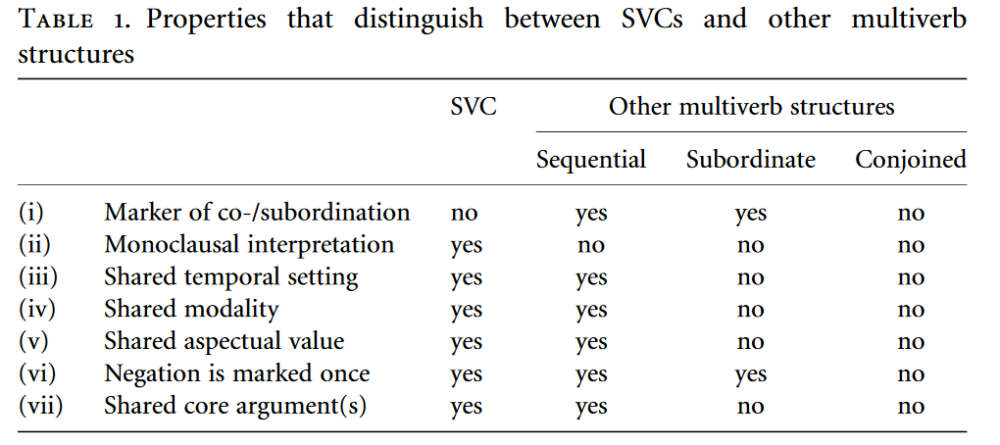

--- 
title: "Are all serial verb constructions realised in a single intonation unit?"
author: "Naomi Peck"
date: "`r Sys.Date()`"
site: bookdown::bookdown_site
documentclass: book
mainfont: arial
output:
  bookdown::gitbook:
    split_bib: true
    split_by: section
bibliography: [book.bib, packages.bib, references.bib]
url: https\://naomipeck.github.io/svc-prosody/
# cover-image: path to the social sharing image like images/cover.jpg
#description: |
#  This is a minimal example of using the bookdown package to write a book.
#  The HTML output format for this example is bookdown::gitbook,
#  set in the _output.yml file.
link-citations: yes
#github-repo: rstudio/bookdown-demo
---

# Abstract {-}

```{r setup, include=FALSE}
knitr::opts_chunk$set(echo = FALSE, cache = TRUE)
#install.packages("remotes")
#remotes::install_github("agricolamz/lingglosses")
library(lingglosses)
```

Serial verb constructions (SVCs) are commonly described as occurring within a single intonation unit (IU) following @givon1991, leading to @himmelmann2022 to assert that they are "IU-bounded constructions". However, as of yet, there is no empirical study exploring the prosodic realisation of SVCs. In this poster, I show results from a first study into the prosody of serial verb constructions, based on a sample of grammatical descriptions from 150 languages with verb serialisation, accompanied with examples from spoken corpora. I find that serial verb constructions do not necessarily need to obey a “One Intonation Unit” constraint.

Initial evidence suggests that we cannot claim that all SVCs are IU-bounded. Himmelmann's claim presupposes that a) serial verb constructions are not grammatically robust, and that b) a serial verb construction will not be recognised as such when realised over multiple IUs. In fact, we find a mix of prosodically-dependent and prosodically-robust types across languages: while the majority of constructions appear to be IU-bounded, a number of constructions can be realised as prosodic groupings (prosodically-dependent constructions consisting of multiple IUs), and elsewhere SVCs can fulfil constituent tests typical of prosodically-robust, i.e. grammaticalised, constructions in other languages.

It has been recognised for a while that the label of serial verb construction is used as an umbrella term for many different constructional subtypes [@foley2010]. My empirical investigation of the prosody of serial verb constructions shows similarly that the “single IU constraint” is not one-size-fits-all. 


<br><br>
<div class="alert alert-warning">
  <strong>Important!</strong><br> Please note that this site represents a work in progress and should not be cited without prior permission from the author.
</div>


```{r include=FALSE}
# automatically create a bib database for R packages
knitr::write_bib(c(
  .packages(), 'bookdown', 'knitr', 'rmarkdown', 'lingglosses', 'lingtypology', 'tidyverse'
), 'packages.bib')
```

<!--chapter:end:index.Rmd-->

# Definitions

> Defining serial verb constructions is a sticky business. [@lord1993, 1]

## Serial Verb Construction

A serial verb construction (SVC) is a grammatical unit which consists of two or more verbs which are juxtaposed without any marking of coordination or subordination. This construction has the same distribution as single verbs in the same language, and can be grammatically defined using the same criteria (although construction-specific criteria may also apply). The verbs within the construction should be able to be used as standalone predicates (i.e., as single verbs), albeit with a different but related meaning.

Note that I do not operationalise a prototype approach to serial verb constructions like @aikhenvald2006, nor do I use an 'event-first' understanding to serial verb constructions pace @bisang2009. In this study, I rely on morphosyntactic characteristics such as agreement indexing and distribution of verbs and markers to identify potential serial verb constructions. 

## Intonation Unit

An intonation unit can be defined both as a phonetic and as a phonological unit. As a phonetic unit, intonation units can be universally defined as units of speech (and potentially sign) which commence with a 'pitch reset' [@himmelmannetal2018]. These units are often bounded by other cues, such as pauses, changes in tempo (lags/rushes), changes in voice quality (creaky/breathy), as well as intonational contour cues, such as boundary tones. Intonation units are the minimal unit in conversation, i.e. turns minimally consist of a single intonation unit [@selting1996], and are hypothesised to be the minimal unit of information packaging in human language [@chafe1994].
As a phonological unit, intonation units must be defined on a language-specific basis with reference to lower phonological units within a language. Typically, intonation units can be the domain for (morpho-)phonological rules, and feature a unit-level accent and boundary tones.
Given the universality of phonetic intonation units, as well as the universality of functions related to intonation unit-like units in speech, I assume that all languages have a phonological unit which corresponds to the phonetic intonation unit.

It is important to additionally distinguish between intonation *units* and intonation *contours*. Intonation units create chunks of language, while intonation contours encode additional information (and contribute to the ability of the intonation unit to chunk). As opposed to the omnipresence of intonation units, intonation contours are language-specific and can extend over multiple intonation units [@cruttenden1997; @ladd2008]. As such, discussions of intonation contours should not be interpreted as equivalent to those of intonation units.

## "One Intonation Unit" constraint

The "One Intonation Unit" constraint refers to the hypothesis that all serial verb constructions must be realised within a single intonation unit. This constraint is a hypothesis which relies on a number of hypotheses and assumptions within functional-typological literature. 

Firstly, serial verb constructions are commonly assumed to encode a single event, due to their similar distribution to single verbs [e.g. @aikhenvald2006; @bisang2009].
@pawley1987 suggested that serial verb constructions actually can encode more than one event.
@givon1991 tested this hypothesis by using the proxy of breath groups (stretches of speech between pauses) for events, and found that the large majority of SVCs were realised within a single breath group. This finding was then taken more broadly to mean that all SVCs were realised in either a single intonation unit, or under a single intonation contour.
However, @chafe1994 hypothesised that no more than "one new idea" can be realised in a given intonation unit at a time, which would suggest that serial verb constructions - if they realise only 'one event' - could be realised within a single intonation unit, but that it would be possible for SVCs to be encoded over multiple intonation units if more new information is to be encoded. It additionally suggests that discourse plays a role in how events are construed.

The constraint as it is tested in this work takes the form of @himmelmann2022's assertion that SVCs are "IU-bounded constructions", i.e. a construction is only recognisable as an SVC when it is realised within the same intonation unit. 

<!--chapter:end:01-intro.Rmd-->

# Background


The struggle to define the serial verb construction (SVC) has led researchers to focus on finding commonalities which hold across a wide variety of languages.
A general consensus holds that a SVC consists of a string of two verbs acting as a single unit.
Most definitions additionally include the conditions of monoclausality [e.g. @dechaine1993, 799; @foleyolson1985, 18-32], a lack of overt marking between verbal elements within the construction [e.g. @foleyolson1985, 18; @collins1997, 462] and single eventhood [e.g. @durie1997; @aikhenvald2006, 3; @bisang2009]. Other potential restrictions include that the verbal elements must be able to be used as independent predicates elsewhere [e.g. @aikhenvald2006, 3; @haspelmath2016, 302-304], the construction is realised under a single intonation contour or within a single intonation unit [e.g. @givon1991; @bradshaw1993], and that at least one argument must be shared by the verbs within the construction [e.g. @baker1989; @sebba1987].

Some linguists do not consider the presence of any linking morphemes within the construction [@zwicky1990; @haspelmath2016], while others allow it, given that the marker does not indicate dependency of any sort [@aikhenvald2018, 3; @foleyolson1985; @foley2010]. 
Similarly, @crowley1987's 'ambient serialisation', where the state of affairs expressed by the first verbal element acts as the subject of the second verbal element, is accepted as a SVC by many [e.g. @aikhenvald2006], but rejected by others [e.g. @cleary-kemp2015; @haspelmath2016].

There is additionally a split in how results of a number of syntactic constituent tests are treated.
Aikhenvald [-@aikhenvald2018, 1] states that constituent verbal elements within an SVC cannot be extracted, separately negated or questioned, or used independently as the answer to a question.
Bisang [-@bisang2009, 796] explicitly allows for separate focusing of elements, but does not address other constituent tests; Sebba similarly allows for independent focusing and clefting of constituent elements [-@sebba1987, 65-71], while disallowing separate negation [-@sebba1987, 89]. Foley and Olson, on the other hand, allow for variation in the scope and marking of negation [-@foleyolson1985, 28; @foley2010, 102].

---

> ...while verbal-subject serial verbs can never be separated from the verbs they modify by an intonation break or a conjunction, ambient-subject serial verbs can, with no appreciable effet on grammaticality or basic meaning. (In that case, they can strictly speaking no longer be considered serialized.) [@bradshaw1993, 157]

---

We can link much of the theoretical debate over the definition of the serial verb construction back to one important issue: namely, if an SVC can constitute a legitimate grammatical construction or not. 
This point is anticipated by @himmelmann2022 when he argues that serial verb constructions are intonation unit-bounded, i.e. that a construction is only recognisable as an SVC when it is realised within a single intonation unit.
Only prosodically-robust, i.e. syntactic, constructions can undergo grammatical diagnostic tests such as substitution or extraction. 
These are the only constructions which are able to 'project'^[Note that I use 'project' here in an emergent/interactional sense, whereby the use of a given construction anticipates or foreshadows the upcoming use of a unit of language [cf. @auer2005a].] syntactic structures which persist over prosodic breaks and allow for incremental or reformulated realisations [cf. @hopperthompson2008].
All other constructions are prosodically dependent, whether they be IU-bounded or prosodic groupings (multi-IU constructions, such as lists).
The fact that a single intonation unit or contour is often cited as a criterion for SVCs suggests that these constructions, too, have not been fully grammaticalised.

There has been little comparative work investigating the prosodic realisation of serial verb constructions which could help shed light upon this issue. 
@givon1991's seminal study investigated the distribution of serial verbs across breath groups in four languages of Papua New Guinea, arguing that the distribution was similar to that of single lexemes.
He did not look at pauses occurring within serial verb constructions.
@unterladstetter2019 argues for the need to integrate prosodic analysis and discourse information management to understand the distribution of the kinds of multi-verbal constructions seen in Eastern Indonesia.
A theoretical accounting for different prosodic outputs of serialisation is put forward in @tylerkastner2022 from a generative perspective.
No wide-scale survey of the prosody of verb serialisation exists.


<!--chapter:end:02-cross-refs.Rmd-->

# Overview of Data

```{r map-setup, include=FALSE, cache=FALSE}
#library(linguisticsdown)
#linguisticsdown::writeIPA()
library(lingtypology)
library(tidyverse)
```

I manually coded 150 languages with serial verb constructions for the presence or absence of the three different construction types posed by @himmelmann2022: IU-bounded, prosodic groupings, and grammatical (prosodically-robust). This information was taken from grammatical descriptions, with additional inspection of audio data when available.

All languages were assumed to be able to realise SVCs within single intonation units, due to the nature of an IU being the smallest realisation of a turn in interaction [@selting1996].

Languages were judged to have prosodically-grouped SVCs if a serial verb construction was realised over two adjacent intonation units with a robust language-specific contour.

Languages were judged to have prosodically robust SVCs based on a few kinds of evidence. The first set of evidence comes from grammatical diagnostic tests. If arguments could be extracted out of the SVC, the construction was considered as grammaticalised. Similarly, if separate verbs could be focussed, the construction was considered grammaticalised. The other type of evidence is constructional templates. For a SVC to be considered prosodically-robust under this condition, the SVC must have a distinct construction type in a given language which could not be construed as a different construction if a pause were to occur mid-construction.

The distribution of construction possibilities across the data set can be seen in Figure \@(#map).

```{r map}

full_glottolog <- lingtypology::glottolog
svc_prosody <- read.csv("svc-prosody.csv")
full_info <- merge(x=svc_prosody,y=full_glottolog,by="glottocode",all.x=TRUE)

mapping <- full_info %>%
  drop_na() %>%
  subset(select = c(language.y, glottocode, iu, grouping, grammatical, latitude, longitude)) %>%
  mutate(coding =
           case_when(
             grouping == 1 ~ "prosodic grouping",
             grammatical == 1 ~ "grammatical construction",
             TRUE ~ "intonation-unit bounded"
           )) 
       
map.feature(languages = mapping$language.y, features = mapping$coding)

```

# Data

<!--chapter:end:03-parts.Rmd-->


<!-- ```{r setup, include=FALSE} -->
<!-- knitr::opts_chunk$set(echo = FALSE, cache = TRUE) -->
<!-- library(lingglosses) -->
<!-- #library(linguisticsdown) -->
<!-- #linguisticsdown::writeIPA() -->
<!-- ``` -->

## Abun
### Details
Glottocode: abun1252 <br> 
Family: Isolate <br>
Macroarea: Papunesia

### Coding
IU: 1 <br> Grouping: ? <br> Grammatical: 0

> The other modifying component of Abun verb phrases is *verbal particles*. These particles are attached to certain verbs like 'up' in the English, 'He *looked up* the words', which may, in English, also be in the form, 'He *looked* the words *up*'. ...
In English the verbal particules 'up', 'down', and so on, may be continuous or discontinuous with the verb. In Abun, however, the particle is discontinuous when there is a direct object ...
None of the Abun verbal particles appear to have been derived from adpositions. Instead, most of the verbal particles are derived from verbs such as *mu* 'go', *ma* 'come' and *kwop* 'die'.
[@berryberry1999, 67]

> In *simple juxtaposition*, there are no markers of conjunction. ... This strategy is permitted at all levels from sentence to noun phrase, as well as in verb phrases (verb phrases, incidentally, only allow this type of strategy to give what appear to be serial verb formations). [@berryberry1999, 94]

### Examples

(@abun1) @berry1995, 40, example 59
```{r}
gloss_example(transliteration = "Prisila ma sap Barbarina o ya",
             glosses = "Prisila come cut Barbarina again POSSIB",
             free_translation = "Prisila might come and cut Barbarina again.")
```

(@abun2) @berryberry1999, 67, example 5.6.a
```{r}
gloss_example(transliteration = "An gwat buku ma mo nu.",
             glosses = "3SG carry book come LOC house",
             free_translation = "He brought the book to the house.")
```

(@abun3) @berryberry1999, 95, example 5.166
```{r}
gloss_example(transliteration = "An kas mu sem mo nden.",
             glosses = "3SG run go sleep LOC bush",
             free_translation = "He ran and went and slept in the bush.")
```


## Afar
### Details
Glottocode: afar1241 <br> 
Family: Afro-Asiatic <br>
Macroarea: Africa

### Coding
IU: 1 <br> Grouping: ? <br> Grammatical: ?

### Examples

(@afar1) @kamil2015, 291, example 907
```{r}
gloss_example(transliteration = "taamiit -íyye",
             glosses = "work.DIM say.3M.PFV",
             free_translation = "He worked a little.")
```

(@afar2) @kamil2015, 292, example 909
```{r}
gloss_example(transliteration = "boddiná mukuɖ -ítta",
             glosses = "tooth wobble say.3F.IPFV",
             free_translation = "The tooth moves.")
```

## Ahamb
### Details
Glottocode: axam1237 <br> 
Family: Austronesian <br>
Macroarea: Papunesia

### Coding
IU: 1 <br> Grouping: ? <br> Grammatical: 1

> In Ahamb, there is a small closed class of nonprototypical verbs that appear in nuclear serialisation-like constructions. Such lexemes are referred to here as coverbs and the constructions that they form – as coverbal SVCs. ... Ahamb does not have prototypical same-subject SVCs, but has both switch-function and ambient SVCs. [@rangelov2020, 331]

> [Coverbal constructions] function prosodically as one unit with the preceding verb stem and any affixes. Some phonological processes have been attested in more commonly used coverbal constructions. [@rangelov2020, 338]

> The sequential event subject indexes, characterised by the vowel /e/ (and less commonly /ø/), are used exclusively to mark the second and subsequent verb in SECs as in (@ahamb3). The subject index on the first verb of SECs is usually a neutral subject index. [@rangelov2020, 370]

### Examples

(@ahamb1) @rangelov2020, 333, example 11.2a
```{r}
gloss_example(transliteration = "Nga-ro-kar husür-i.",
             glosses = "3SG-IPFV-say follow-OBJ",
             free_translation = "He talks about it.")
```

(@ahamb2) @rangelov2020, 344, example 11.14b
```{r}
gloss_example(transliteration = "Ange nga-tams bbën hana na-r-maj.",
             glosses = "3SG 3SG-hit eliminate 1SG 1SG-SBQT-die",
             free_translation = "He beat me to death.")
```

(@ahamb3) @rangelov2020, 370, example 13.19a
```{r}
gloss_example(transliteration = "Ta-gmay te-prag gasin.",
             glosses = "3PL-come 3PL.SEQ-do work",
             free_translation = "They come, they do the work.")
```

## Aimele
### Details
Glottocode: aime1238 <br> 
Family: Aimele <br>
Macroarea: Papunesia

### Coding
IU: 1 <br> Grouping: ? <br> Grammatical: 1

> Neither of the constituent verbs in the SVC in (@aimele1) is morphologically-marked as subordinate to a final verb. Instead, each verb is uninflected, except for the final verb, which bears predicate markers such as tense, aspect, mood, modality, and evidentiality. 
[@aiton2016, 201]

### Examples

(@aimele1) @aiton2016, 200, example 27
```{r}
gloss_example("ko:dulu sulo:bo -mo: wɛlɛ sɛ: -ja:",
             "downward {NAME} DAT shout say PST",
             "I shouted it down to Solo:bu.")
```

(@aimele2) @aiton2016, 201, example 30
```{r}
gloss_example(transliteration = "nɛ: ti:ɸɛ: o:ga: ɛja: o:gɛ: di a:nɛ:",
              glosses = "1:SG afterwards pandanus seedling:ABS carry_in_bilum take go:PST",
              free_translation = "I went after him, taking the pandanus seeds in a bilum.")
```

(@aimele3) @aiton2016, 201, example 31
```{r}
gloss_example(transliteration = "sugu:lu: ɛna: hɛna: do:ga: dijɛ:=bi: kɛi",
               glosses = "school that:ABS go house:ABS build=IMP ASSER",
               free_translation = "Go build that building for the school!")
```

## Alamblak
### Details
Glottocode: alam1246 <br> 
Family: Sepik <br>
Macroarea: Papunesia

### Coding
IU: 1 <br> Grouping: 0 <br> Grammatical: 0

> Structurally the complex-verb stem is-a serialisation of roots (verb, noun, adjective, time word and adverb). Serialised constructions range from stemlike derived and compound stems, to constructions resembling predicates of merged clauses accompanied by strict constraints on possible combinations of clause participants. Others are phrase-like constructions with head plus modifying constituents. [@bruce1984, 152]

### Examples

(@alamblak1) @bruce1984, 160, example 233c
```{r}
gloss_example(transliteration = "këfrat tu-hay-më-r-r",
             glosses = "spear throw-give-R.PST-3SG.MASC-3SG.MASC",
             free_translation = "He threw the spear to him for him.")
```

(@alamblak2) @bruce1984, 163, example 238b
```{r}
gloss_example(transliteration = "hohra-t kak-yirona-më-t-t",
             glosses = "thorn-3SG.FEM get-feel_pain-R.PST-3SG.FEM-3SG.FEM",
             free_translation = "She got/held the thorn and felt pain.")
```

(@alamblak3) @bruce1984, 165, example 243
```{r}
gloss_example(transliteration = "grha-nur-më-m",
             glosses = "dance-cry-R.PST-3PL",
             free_translation = "They danced and cried.")
```

## Ami
### Details
Glottocode: ammi1238 <br> 
Family: Western Daly <br>
Macroarea: Australia

### Coding
IU: 1 <br> Grouping: 0 <br> Grammatical: ?

> Phonological liaison occurs between the two verbs... There are grounds here for proposing that each serial construction constitutes a single phonological conglomerate. There is no pause between the VPs and the single intonation contour points to their constituting a single clause. [@ford1998, 316]

### Examples

(@ami1) @ford1998, 316, example 8-54
```{r}
gloss_example(transliteration = "gama vulhut gama",
             glosses = "3MIN.S.R.stand beeswax 3MIN.S.R.stand",
             free_translation = "The beeswax is standing up.",
             comment = "['kamaɸ̀ʊl̪ʊkàma]")
```

(@ami2) @ford1998, 316, example 8-55
```{r}
gloss_example(transliteration = "guman-pitji gaya",
             glosses = "3MIN.A.R.poke-roll 3MIN.S.R.lie",
             free_translation = "He is still making fire.",
             comment = "['kʊmanp̀ɪcɪɣàja]")
```


## Amkoe
### Details
Glottocode: hoaa1235 <br> 
Family: Kxa <br>
Macroarea: Africa

### Coding
IU: 1 <br> Grouping: ? <br> Grammatical: 0

> A serial verb construction (SVC) is where one verb immediately follows the other without any intervening adverbs, negation, tense/aspect markers, passive prefix, or conjunctions. Such a construction is also referred to as a verbal compound. Serial verbs are used in ǂHȍȁ to express a wide range of semantic relations, including directions, results, sequences of ac­ tions and benefactives. Many concepts expressed by prepositions in other languages are ex­ pressed by serial verbs in ǂHȍã. [@collinsgruber2014, 167]

### Examples

(@amkoe1) @collinsgruber2014, 167, example 2a
```{r}
gloss_example(transliteration = "ma ’a ǁhù ǀ’o ǰȍ kì kx’ù na",
             glosses = "1SG PROG pour put_in water LK pot in",
             free_translation = "I am pouring water into the pot.")
```

(@amkoe2) @collinsgruber2014, 172, example 27
```{r}
gloss_example(transliteration = "ma ’a kígyè'o kíni Jefo",
             glosses = "1SG PROG call look_for Jeff",
             free_translation = "I am calling Jeff, looking for him.")
```

## Anem
### Details
Glottocode: anem1249 <br> 
Family: Isolate <br>
Macroarea: Papunesia

### Coding
IU: 1 <br> Grouping: ? <br> Grammatical: 0

### Examples

The glosses are adapted from the original source.

(@anem1) @thurston1982, 100, line 9
```{r}
gloss_example(transliteration = "i-pik-îl i-gêx-îl",
             glosses = "3PL.SBJ.RL-jump-PL 3PL.SUBJ.RL-descend-PL",
             free_translation = "The two of them jumped down.")
```

(@anem2) @thurston1982, 101, line 24
```{r}
gloss_example(transliteration = "i-ki-u u-sêm",
             glosses = "3PL.SBJ.RL-hide-3SG.OBJ.MASC 3SG.MASC.SBJ.RL-lie",
             free_translation = "He was kept hidden.")
```

## A'ou
### Details
Glottocode: aoua1234 <br> 
Family: Tai-Kadai <br>
Macroarea: Eurasia

### Coding
IU: 1 <br> Grouping: ? <br> Grammatical: 0

### Examples

(@aou1) @lietal2014, 206, example 8
```{r}
gloss_example(transliteration = "ve13 jɔ33 i13na33 məɯ31 ta55 ta33",
             glosses = "3SG ask 1PL come cut tree",
             free_translation = "They asked us to come and cut trees.")
```

(@aou2) @lietal2014, 142, example 11
```{r}
gloss_example(transliteration = "ve13 tai31 vlai31 səɯ31 təɯ33 vei31",
             glosses = "3SG beat die two CLF mosquito",
             free_translation = "He killed two mosquitos.")
```


## Apinayé
### Details
Glottocode: apin1244 <br> 
Family: Nuclear-Macro-Je <br>
Macroarea: South America

### Coding
IU: 1 <br> Grouping: 0 <br> Grammatical: ?

> Serialization requires the nonfinite form of verbs when the (causative or instrumental morpheme) verb *ɔ* ‘do’ is involved. Otherwise, it is just the bare form of verbs that occur in a sequence; in this case, the verbs involved are usually from the class of intransitives (i.e. they take no inflection in their finite form). In Apinajé, serialization always involves either a movement verb or a position verb. Not all verbs belonging to each category are eligible for serial constructions expressing aspectual meanings, but only a selected few. When verbs from outside this inventory are used, the resulting overall meaning of the construction is more literal than grammatical, sometimes yielding awkward or jocose meanings. [@cunhadeoliveira2005, 275]

> From the prosodic point of view, the elements of each complex construction belong within a single sentential intonation contour. Morphologically, there is only one mode marker for the whole construction, such that all elements fall under its scope. In regard to syntax, boundary indices and the internally cohesive distribution of elements in the sentence are indicative of the internal coherence of serialization... [@cunhadeoliveira2005, 276]

### Examples

(@apinaye2) @cunhadeoliveira2005, 162, example 106d
```{r}
gloss_example(transliteration = "Pa tẽ tẽm.",
             glosses = "RL go fall",
             free_translation = "I fell.")
```

(@apinaye3) @cunhadeoliveira2005, 161, example 106a
```{r}
gloss_example(transliteration = "Kɔt paj arĩ ic-krĩ",
             glosses = "IRR 1.IRR stay 1-sit",
             free_translation = "I'll remain seated.")
```

(@apinaye1) @cunhadeoliveira2005, 295, example 24a
```{r}
gloss_example(transliteration = "na pa kɔtmə̃ i-ɲ-õ pĩ katprɛ ɔ tẽ",
             glosses = "RL 1 still 1-RP-GEN wood fasten do go",
             free_translation = "I'm still walking and fastening my wood.")
```


## Arta
### Details
Glottocode: arta1239 <br> 
Family: Austronesian <br>
Macroarea: Papunesia

### Coding
IU: 1 <br> Grouping: 0 <br> Grammatical: ?

> Sequential verb construction is the coordination in which the motion verbs such as (ma)ngay and (a)ngin are combined with another predicate. This construction prosodically constitutes a single intonation unit, with no intonation break between the two predicates involved. [@kimoto2017, 383]

> Tight coordination is another type of clausal coordination, in which the whole constituent is pronounced in a single intonation contour and the absolutive arguments of both of the predicates should be co-referential. If the absolutive argument is realized in a full NP, it immediately follows the first predicate before the second predicate, with the second clause having no overt person index. [@kimoto2017, 384]

### Examples

Note that genitive marking in these examples may function as ergative marking.

(@arta1) @kimoto2017, 384, example 100
```{r}
gloss_example(transliteration = "Angin=mi=tid pa-sdèp-èn ti bunbun=mi.",
             glosses = "go=1PL.GEN=3PL.ABS CAUS-enter-TR SG.OBL.DEF house=1PL.GEN",
             free_translation = "We go and bring them into our house.")
```

(@arta2) @kimoto2017, 385, example 105
```{r, results='asis'}
gloss_example(transliteration = "P<in>idut=di tidi bunga na ayu=y n-i-lugun=di tamman ti baske:t=i.",
             glosses = "<PST>pick_up=3PL.GEN PL.ABS.DEF fruit GEN.INDF tree=SPC PST-TR-container=3PL.GEN again SG.OBL.DEF basket=SPC",
             free_translation = "They picked up the fruits and put it into the basket again.")
```

## Ashéninka Perené
### Details
Glottocode: ashe1272 <br> 
Family: Arawakan <br>
Macroarea: South American

### Coding
IU: 1 <br> Grouping: ? <br> Grammatical: 0

> Serialized predicates do not have more than two verbs in a verb sequence which are fully inflected grammatical and phonological words, capable of being integrated into discourse. There is no pause separating the verbs from each other... the serialized verbs are independent phonological words, each inflected for person, aspect, realis status, and mode. [@mihas2015, 163]

### Examples

(@asheninka1) @mihas2015, 165, example 6.13.b
```{r}
gloss_example(transliteration = "o- ja -t -atz -i o- shimaa -t -a",
             glosses = "3NM.S go EP PROG REAL 3NM.S fish EP REAL",
             free_translation = "She went to fish.")
```

(@asheninka2) @mihas2015, 168, example 6.19.b
```{r}
gloss_example(transliteration = "p- aako -t -ashi -t -a pi- ma -atz -i -tsi",
             glosses = "2S overtake EP APL.INT EP REAL 2S sleep PROG REAL NEG",
             free_translation = "Don't stay asleep.")
```


## Atakapa
### Details
Glottocode: atak1252 <br> 
Family: Isolate <br>
Macroarea: North America

### Coding
IU: 1 <br> Grouping: ? <br> Grammatical: ?

> Two, and occasionally three, verb stems are put together in the same complex so freely and in so many different ways that we find a complete gradation from stems very closely united to a purely syntactic connection. Two or three cases have already been given in which the first stem has been reduced almost to the condition of a prefix. On the other hand certain stems in the second position perform the functions of auxiliaries. Nevertheless these do not seem to be singled out for special treatment. There is nothing to differentiate them from a number of principal verb stems. The various forms of verb composition which occur may be classified as follows: (1) those in which the first stem appears to have no suffixes... [@swanton1929, 134]

### Examples

Note that glosses were not present in the original source and the orthography of the vowels has been altered to be closer to the IPA.

(@atakapa1) @swanton1929, 134
```{r}
gloss_example(transliteration = "ne:ʃ po:l tsa-t ne:-t",
             glosses = "wood float go_fast-CONT down-CONT",
             free_translation = "The log is floating past down stream.")
```

(@atakapa2) @swanton1929, 134
```{r}
gloss_example(transliteration = "kõ:-hi-pa-m-u:l-et",
             glosses = "take.SG.ABS-1SG.ABS-beat-PLURACT-3PL.ERG-PST",
             free_translation = "They seized and beat me.")
```

## Avatime
### Details
Glottocode: avat1244 <br> 
Family: Kwa Volta-Congo <br>
Macroarea: Africa

### Coding
IU: 1 <br> Grouping: ? <br> Grammatical: 1

> Avatime SVCs are characterized by the following properties: <br>
i. A sequence of two or more verbs in a single clause <br>
ii. No predicate-argument relation between the verbs <br>
iii. Only the first verb is fully inflected for subject agreement, aspect, mood, and polarity <br>
iv. Subsequent verbs may be bare or prefixed with a reduced agreement marker <br>
v. The recurrent aspect may be independently marked on subsequent verbs in some SVCs, all other aspects and moods may be marked only once on the first verb and scope over the whole construction. <br>
vi. The subject must be an argument of all verbs <br>
vii. Other arguments may also be shared by verbs within the SVC, in which case they are mentioned once only following their first verb. <br>
viii.Individual verbs may be focused
[@defina2016, 632]

<!-- abbreviations can be found on @defina2016 651 -->

### Examples

(@avatime1) @defina2016, 665, example 48
```{r}
gloss_example(transliteration = "wo-trutru ò-pupu=lò dra",
             glosses = "2SG.PFV-push C2.SG-door=DEF open",
             free_translation = "You pushed the door open.")
```

(@avatime2) @defina2016, 673, example 74a
```{r}
gloss_example(transliteration = "ma-tsà tomatoes=ye a-kpɛ mí kè-zi=a mɛ̀",
             glosses = "1SG.PFV-cut tomatoes=DEF SV.1SG.PFV-put LOC C6S-bowl=DEF inside",
             free_translation = "I cut tomatoes and put them in the bowl.")
```

## Awa-Cuaiquer
### Details
Glottocode: awac1239 <br> 
Family: Barbacoan <br>
Macroarea: South America

### Coding
IU: 1 <br> Grouping: 0 <br> Grammatical: ?

> The Awa Pit Serial Verb construction thus consists of two active verbs with identical subcategorization frames, which are obligatorily adjacent and occur in a temporally iconic order. The normal range of morphological and syntactic possibilities is open to the clause, with any inflection occurring on the second verb stem. The first verb stem is either bare (if consonant-final) or suffixed with *t* (if vowel-final). Any modification, such as negation, applies semantically to both verbs, but is indicated formally on the second verb.
[@curnow1997, 305]

### Examples

(@awa1) @curnow1997, 303, example 766
```{r}
gloss_example(transliteration = "gato=na tunya pizh ku-mtu",
             glosses = "cat=TOP rat grab eat-IPFV.PART",
             free_translation = "The cat is grabbing and eating the rat.")
```

(@awa2) @curnow1997, 306, example 776
```{r}
gloss_example(transliteration = "pa azh kway-zi",
             glosses = "sun shine drop-NONLOCUT",
             free_translation = "The sun shone out.")
```

(@awa3) @curnow1997, 306, example 775
```{r}
gloss_example(transliteration = "Demetrio=na I-t kway-zi",
             glosses = "Demetrio=TOP go-SV drop-NONLOCUT",
             free_translation = "Demetrio left.")
```


<!--chapter:end:examples-a.Rmd-->


<!--  ```{r setup, include=FALSE} -->
<!--  knitr::opts_chunk$set(echo = FALSE, cache = TRUE) -->
<!--  library(lingglosses) -->
<!--  #library(linguisticsdown) -->
<!--  #linguisticsdown::writeIPA() -->
<!--  ``` -->

## Bafut
### Details
Glottocode: bafu1246 <br> 
Family: Grassfields <br>
Macroarea: Africa

### Coding
IU: 1 <br> Grouping: ? <br> Grammatical: 1

> In the serial verb construction in Bafut, two or more verbs which all refer to subparts or aspects of a single overall event occur in a series in the same construction. The second verb usually denotes an outgrowth of the action denoted by the first verb and represents a further development, consequence, result, goal or culmination of the action of the first verb. Morphologically, the serial verb construction (henceforth SVC) is marked by an initial homorganic nasal consonant on the second verb (or subsequent verbs) when the construction is in the past tense. [@tamanji2010, 182]

### Examples

(@bafut1) @tamanji2010, 183, example 28c
```{r, results='asis'}
gloss_example(transliteration = "n-ó j-á=ɨ̀ kɨ̀ kóŋnə̂ N-ʒÎ N-lóô ǹ-dɨ̀ɨ̀ w-á",
             glosses = "9-snake 9-the=SM P2 silently N-come N-bite 1-witch 1-the",
             free_translation = "The snake silently came up and bit the witch.",
             annotation = "nó já kɨ̀ kòŋnɨ̀ nʒì nlóó ndɨ̀ɨ̀ wá.")
```

(@bafut2) @tamanji2010, 183, example 29b
```{r}
gloss_example(transliteration = "ǹ-tsìì-twúgɨ̀ w-á-à kɨ̀ bwíì n-lì'ìnə́ n-óò",
             glosses = "1-guard-night 1-the=SM P2 sleep N-forget 1-time",
             free_translation = "The snake silently came up and bit the witch.",
             annotation = "ǹtsììtwúgɨ̀ wá kɨ̀ bwíì nlì'ìnə́ nóò.")
```

## Bambassi
### Details
Glottocode: bamb1262 <br> 
Family: Blue Nile Mao <br>
Macroarea: Africa

### Coding
IU: 1 <br> Grouping: ? <br> Grammatical: 0

> Northern Mao natural discourse exhibits only a very occasional use of serialization, i.e. a construction in which verb stems occur in immediate succession and where the subjects of each of these verbs is the same, but where none of the verbs is marked with the SS:NF suffix or any other dependency marker. In contrast, verbal compounds, where two verb stems (i.e. roots with verbal tone melodies) join to form a single complex verb stem, the entirety of which is surrounded by inflectional prefixes and suffixes, are more commonly attested. These compounds form single morpho-phonological words. Verbal compounding mainly involves a grammaticalized verb from a small closed set of verbs joining with a lexical verb from a large open class. [@ahland2012, 601]

### Examples

(@bambassi1) @ahland2012, 602, example 12.73
```{r}
gloss_example(transliteration = "kí mí-in tí-hów-j-à",
             glosses = "come eat-SS.NF 1SG-go-AWAY-DECL",
             free_translation = "I came, ate, and left.")
```

(@bambassi2) @ahland2012, 603, example 12.78
```{r}
gloss_example(transliteration = "pàpáj kez-èt pór k'íl-kòt'-in tí-hów-kj-á",
             glosses = "papaya top-LOC forget leave-PF-SS.NF 1SG-go-TOWARD-DECL",
             free_translation = "I forgot and have left (it) up in the papaya tree and came.")
```

## Bangime
### Details
Glottocode: bang1363 <br> 
Family: Isolate <br>
Macroarea: Africa

### Coding
IU: 1 <br> Grouping: ? <br> Grammatical: ?

### Examples

(@bangime1) @hantgan2013, 370, line 1
```{r}
gloss_example(transliteration = "bàráá-mi=ndɛ̀ wò jàg-ú-H nààmàà=jàà=ndɛ́ ng kí náà-H",
             glosses = "Baraa-people=PL go cut-PRF-3 1PL.POSS=child=PL 1/3 ADP wilderness-3",
             free_translation = "The people of Baraa went [and] attacked our children [in the] wilderness.")
```

(@bangime2) @hantgan2013, 367, line 3
```{r}
gloss_example(transliteration = "níì kóɔ́ n wó ŋ káárà-L péʋɛ́-rè bíé níì ŋ káràà-L",
             glosses = "3PL COMPL 1/3 go TR find-3 wind-LNK NEG 3PL TR obtain-3",
             free_translation = "They went [and] they found [the] wind does not get them (the place was not breezy enough).")
```


## Barai
### Details
Glottocode: nucl1630 <br> 
Family: Koiarian <br>
Macroarea: Papunesia

### Coding
IU: 1 <br> Grouping: 1 <br> Grammatical: 0

> Another important difference between [tight and loose] serial verb constructions has to do with intonation. We noted earlier that both grammatical and phonological features coincide to mark the boundaries between sentences in Barai (and Papuan languages generally) and that the significant phonological feature was an overall intonation pattern superimposed over the entire clause chain. ... The relevant fact for our consideration here is that the standard serial construction requires the phrasal contour over each conjunct of its series. The more tightly knit string of juxtaposed predicates collectively takes just a single phrasal contour. [@olson1981, 176-177]

### Examples

(@barai1) @olson1981, 177, example 57
```{r}
gloss_example(transliteration = "na fi fase isoe-vo",
             glosses = "1SG sit letter write-PRS",
             free_translation = "I am sitting and writing a letter.")
```

(@barai2) @olson1981, 177, example 58
```{r}
gloss_example(transliteration = "na fase fi isoe-vo",
             glosses = "1SG letter sit write-PRS",
             free_translation = "I am sitting writing a letter.")
```

## Bardi
### Details
Glottocode: bard1255 <br> 
Family: Nyulnyulan <br>
Macroarea: Australia

### Coding
IU: 1 <br> Grouping: ? <br> Grammatical: 1

> [Serial verbs] occur in a single intonation contour (although there are also examples with breaks, and examples where intonation units and syntactic units are not isomorphic). 
[@bowern2013, 663-664]

> A further piece of evidence shows that these clauses are joined in a single higher structure rather than chained without embedding. It is possible to extract constituents from a lower clause into a higher clause. If the clauses are conjoined, this should not be possible, since conjunction is a strong barrier to extraction...
[@bowern2013, 664-665]

### Examples

(@bardi1) @bowern2013, 663, example 16.64
```{r, results='asis'}
gloss_example(transliteration = "Ginyinggon roowil i-n-nya-na Ngarrigoonbooroo baali-ngan darr i-n-ar-na=jirri niimana aamba agal ambooriny Ngoolbirndi.",
             glosses = "then walk 3-TR-catch-REM.PST {NAME} shade-ALL come 3-TR-spear-REM.PST=3AUG.IO many men and people {NAME}",
             free_translation = "Then Ngarrigoonbooroo walked to her camp and came across many people at Ngoolbirndi.",
             annotation = "Ginyinggon roowil innyana Ngarrigoonbooroo baalingan darr inarnajirri niimana aamba agal ambooriny Ngoolbirndi.")
```

## Batak Karo
### Details
Glottocode: bata1293 <br> 
Family: Austronesian <br>
Macroarea: Papunesia

### Coding
IU: 1 <br> Grouping: 0 <br> Grammatical: 0

> A favourite clause-combining strategy in Karo is serialisation, whereby two clauses are welded into one by virtue of a shared nominal element (normally the subject). [@woollams1996, 325]

> It is very common in Karo for two independent clauses to be combined in a single sentence without the use of an explicit connective. This conjoining into the one sentence is signalled phonologically by a shorter than usual intersentential pause, and orthographically by a comma instead of a full stop. [@woollams1996, 344]

### Examples

(@karo1) @woollams1996, 327, example 8.213
```{r}
gloss_example(transliteration = "Naktak iluh Datuk Rubia Gandé megi sora kempu-na rendé.",
             glosses = "fall tears Datuk Rubia Gande hear voice grandson-3.POSS sing",
             free_translation = "Datuk Rubia Gande shed tears as he heard his grandson singing.")
```

(@karo1) @woollams1996, 328, example 8.219
```{r}
gloss_example(transliteration = "Asuh-asuh-en-na enggo keri ben-én i-tangko kalak.",
             glosses = "tend-RDP-PL-3.POSS already gone lost-PL PASS-steal person",
             free_translation = "Their cattle were all gone, missing, stolen by somebody.")
```

## Baure
### Details
Glottocode: baur1253 <br> 
Family: Arawakan <br>
Macroarea: South America

### Coding
IU: 1 <br> Grouping: 0 <br> Grammatical: ?

> Finite verbs with possible person cross-reference on the verb, as in Baure, may also occur in serial verb constructions. ... The coordination of predicates is identical with the coordination of clauses without connector. Serial verb constructions, on the other hand, are a number of verbs that are uttered in one clause. In Baure the two categories seem pretty well distinguishable... [@danielsen2007, 427]

### Examples

(@baure1) @danielsen2007, 428, example 144
```{r}
gloss_example(transliteration = "ro=kač-po-wo ro=pino-po",
             glosses = "3SG.M=go-PRFLX-COP 3SG.M=flee-PRFLX",
             annotation = "*rokačpow* *ropinop*",
             free_translation = "he (went away and) fled")
```

## Belep
### Details
Glottocode: nyal1254 <br> 
Family: Austronesian <br>
Macroarea: Papunesia

### Coding
IU: 1 <br> Grouping: 0 <br> Grammatical: 0

> In Belep, same-subject serialization with a limited set of verbs may be used to modify the aspect or modality of the clause. In such cases, the first verb provides modal information and the second verb provides lexical information. Switch-subject SVCs, by contrast, are used as a complementation strategy; in these instances, the first verb is the main verb (see §7.2.9). Belep SVCs are distinguished from compound verbs in that each verb in a SVC can serve independently as the main verb of a clause. [@mccracken2012, 370]

> The elements of the verb group always occur in a fixed order (they are an instance of templatic morphology; c.f. Bickel & Nichols 2007) and cannot undergo any syntactic operations except as a unit. Most elements in a verb group are not obligatory, but when they occur they have a conventionalized meaning and occur in an obligatory order. [@mccracken2012, 170]

> Intonation breaks, pauses, and repairs during the production of the verb group are most likely to occur immediately after the preface; however, these should be considered indicators of a phonological, rather than a grammatical, word boundary (Dixon and Aikhenvald 2002:24). [@mccracken2012, 330]

### Examples

Note that the glossing has been altered in \ref(@belep1) to reflect the grammatical dependency of *a=* 'NOM'.

(@belep1) @mccracken2012, 372, example 153
```{r}
gloss_example(transliteration = "te=mo may a=cama-la",
             glosses = "3SG.SBJ=live die NOM=father-3PL.POSS",
             free_translation = "Their father was about to die.",
             comment = "Te mo maac ya camala.")
```

(@belep1) @mccracken2012, 371, example 149
```{r}
gloss_example(transliteration = "ava=jara bae pê",
             glosses = "1PL.EXCL.SBJ=want bite bread",
             free_translation = "We want to eat the bread.",
             comment = "Ava jaar bae pê.")
```

## Bih
### Details
Glottocode: biha1246 <br> 
Family: Austronesian <br>
Macroarea: Eurasia

### Coding
IU: 1 <br> Grouping: 0 <br> Grammatical: 0

> ...although there is more than one verb, Bih SVCs function as a single predicate to describe a single event. Again, each construction can only take one aspect or negation marker as a single syntactic unit even though they consist of at least two verbs or they will be ungrammatical... [@nguyen2013, 188]

### Examples

(@bih1) @nguyen2013, pg, example 13.22
```{r}
gloss_example(transliteration = "Ñu lŏ nao hưn hŏng palei ñu.",
             glosses = "3 again go inform with wife 3",
             free_translation = "He again goes to inform to his wife.")
```


## Blablanga
### Details
Glottocode: blab1237 <br> 
Family: Austronesian <br>
Macroarea: Papunesia

### Coding
IU: 1 <br> Grouping: 0 <br> Grammatical: 0

> Predicates or clauses expressing two or more consecutive events can be simply juxtaposed, which leads to two possibilities. They can be either clauses coordinated by juxtaposition in the same sentence or different juxtaposed sentences. In such cases, there are only prosodic clues to their status, mainly provided by pause and intonation, but the distinctions are many times blurred by the rapidity of speech and the degree of engagement of the speaker. The more predicates in a sequence, the more difficult it is to tell. In rapid speech, which is very often employed by my consultants, and/or when the speaker becomes extremely engaged in and enthusiastic about the narrative, prosodic pauses get shorter and shorter to the extent that they become irrelevant. Moreover, even in moderate velocity speech, prosodic pauses often do not coincide with breathing pauses. In rapid or very rapid speech, while one can still distinguish a sort of list intonation as the events are mentioned, a clearly distinguishable pause will occur only once the speaker is out of breath and, almost always, that does not express prosodic information. [@voica2018, 296-297]

### Examples

(@blablanga1) @voica2018, 299, excerpt from example 5.52
```{r, results='asis'}
gloss_example(transliteration = "Thoke hore=o, ghohra=ni zaho ghai Sulei. Zaho thoke Sulei...",
             glosses = "reach canoe=DEM.NV.SG paddle=3SG.AGR go 1PL.EXCL Sulei go reach Sulei",
             free_translation = "We reach the canoe, paddle it and go to Sulei. We go and reach Sulei....")
```


## Bulo Stieng
### Details
Glottocode: bulo1242 <br> 
Family: Austroasiatic <br>
Macroarea: Eurasia

### Coding
IU: 1 <br> Grouping: 0 <br> Grammatical: 0

> Parmi ces critères [pour les CVS] - variables d'une langue à l'autre - les suivants ont été retenus pour être appliqués au stieng:
- le critère prosodique permettant de distinguer une CVS d'une concaténation de propositions... [@bon2014, 503]

Translation: Amongst the criteria [for SVCs] - which vary from language to language - the following have been retained for application to Stieng:
- the prosodic criterion which allows us to distinguish a SVC from a concatenation of clauses...

### Examples

> Dans l'example suivant (@bulo1), la séquence [sədiaŋ-dʔuar ɡɔk lot-kətaːŋ ʔuː rənaːp-rəsɨː] constitue un premier groupe de soufle, avec une prosodie montante. La séquence [ɓɑt joːh-ndiaŋ] constitue quant à elle un second groupe de souffle avec une intonation descendante. Ainsi, il est possible d'identifier les verbs *ɡɔk* 'ê.assis' *lot-kətaːŋ* 'ê.assis.à.genoux' comme faisant partie d'une série verbale au sein d'une même proposition; et *ɓɑt* 'plier' comme tête de la proposition suivant.
[@bon2014, 504-505]

Translation: In the following example (@bulo1), the sequence [sədiaŋ-dʔuar ɡɔk lot-kətaːŋ ʔuː rənaːp-rəsɨː] constitutes the first breath group with a rising contour. The sequence [ɓɑt joːh-ndiaŋ] in turn constitutes a second breath group with a falling intonation. Thus, it is possible to identify the verbs *ɡɔk* 'sit' *lot-kətaːŋ* 'kneel' as forming a serial verb construction within a single clause, and *ɓɑt* 'fold' as the head of the following clause.

(@bulo1) @bon2014, 505, example 839
```{r}
gloss_example(transliteration = "sədiaŋdʔuar ɡɔk lotkətaːŋ ʔuː rənaːprəsɨː (pause) ɓɑt joːhndiaŋ",
             glosses = "woman sit kneel on bamboo.mat (pause) fold shirt",
             free_translation = "The woman is kneeling on a bamboo mat and folding a shirt.")
```


## Burarra
### Details
Glottocode: bura1267 <br> 
Family: Maningrida <br>
Macroarea: Australia

### Coding
IU: 1 <br> Grouping: ? <br> Grammatical: ?

### Examples

Note that glosses have been adapted for a general audience.

(@burarra2) @green1987, 79, example 5(lxxxii)
```{r}
gloss_example(transliteration = "Nginyi-pa gornabola ø-gana-ø ø-bamba-ø",
             glosses = "2MIN-DIR wallaby 2MIN.IMP-watch-IRR 2MIN.IMP-go_along-IRR",
             free_translation = "You go along watching for wallabies.")
```

(@burarra3) @green1987, 80, example 5(lxxxix)
```{r}
gloss_example(transliteration = "ngu-durtchi-nga ngu-bo-na",
             glosses = "1MIN-be_full-RL 1MIN-go-ANT",
             free_translation = "I'm full.")
```

(@burarra1) Green 1987:77, example 5(lxxviii)
```{r}
gloss_example(transliteration = "m-ba-nga a-rrik-nga gorrngunya",
             glosses = "3MIN>3MIN.mun-eat-PST 3MIN.an-crawl-PST grass",
             free_translation = "He crawled along eating grass.")
```

## Burmese
### Details
Glottocode: nucl1310 <br> 
Family: Trans-Himalayan <br>
Macroarea: Eurasian

### Coding
IU: 1 <br> Grouping: 0 <br> Grammatical: 0

> The sentence in (@burmese1) contains two verbs that are separated by the object of the second one, i.e. ‘hand’ [lɛʔ]. As suggested by the translation, we have here two clauses that are chained and not subordinated as in the previous example, while example (@burmese2) illustrated a SVC. Actually, in this sentence, the object of the second verb, i.e. ‘words’ [zəKa3], precedes the string of verbs, which suggests that the two verbs are closely associated syntactically. [@vittrant2012, 106]

<br>

> Vittrant (2006: 309): “Une construction de verbes en série (CVS) est une séquence de verbes qui ne sont syntaxiquement ni coordonnés ni subordonnés. Elle a d’autre part, la forme de surface d’un syntagme verbal unique.” [@vittrant2012, 106 footnote 9]

Translation: A serial verb construction is a sequence of verbes which are neither coordinated nor subordinated syntactically. It has, on the other hand, the surface form of a single verb phrase.

### Examples

(@burmese1) @vittrant2012, 107, example 5
```{r}
gloss_example(transliteration = "pəKan^3^ thɛ^3^ ye^2^ thɛ^1^ lɛʔ she^2^=Pi^3^",
             glosses = "plate inside water put hand wash=SUB.TPS",
             free_translation = "... after having poured water into the plate and having washed his hands...")
```

(@burmese2) @vittrant2012, 107, example 6
```{r}
gloss_example(transliteration = "θiN^2^bɔ^1^ pɔ^2^ =Ma^2^ θiN^2^bɔ^1^ pɔ^2^ =Ma^2^ zəKa^3^ la^2^ pyɔ^3^ =Tɛ^2^",
             glosses = "boat on LOC boat on LOC word come say REAL.ASS",
             free_translation = "On the boat, on the boat, (she) came to me to talk.",
             comment = "Lit. ...she came to tell me some words.")
```


## Buru
### Details
Glottocode: buru1303 <br> 
Family: Austronesian <br>
Macroarea: Papunesia

### Coding
IU: 1 <br> Grouping: 0 <br> Grammatical: 0

> When serial verbs form a clause with 1) core arguments occurring before (and after) the serial construction, but not between, 2) shared verbal modifiers (pre-verbal TAM markers and post-verbal auxiliaries), and 3) no pause or separating intonation dip between the verbs, they are behaving as the nucleus of a clause with a single predicate head. [@grimes1991, 208]

### Examples

(@buru1) @grimes1991, 208, example 15
```{r}
gloss_example(transliteration = "Da iko linga-h.",
             glosses = "3SG go look-3SG.OBJ",
             free_translation = "He went to look at it. / He went and looked at it.")
```


<!--chapter:end:examples-b.Rmd-->

<!-- # ```{r setup, include=FALSE} -->
<!-- # knitr::opts_chunk$set(echo = FALSE, cache = TRUE) -->
<!-- # library(lingglosses) -->
<!-- # #library(linguisticsdown) -->
<!-- # #linguisticsdown::writeIPA() -->
<!-- # ``` -->

<!-- ## Cahuilla -->
<!-- ### Details -->
<!-- Glottocode: cahu1264 <br>  -->
<!-- Family: Uto-Aztecan <br> -->
<!-- Macroarea: North America -->

<!-- ### Coding -->
<!-- IU: 1 <br> Grouping: ? <br> Grammatical: 1 -->

<!-- > Citation [@source2001] -->

<!-- ### Examples -->

<!-- (@language1) @source2001, pg, example 27 -->
<!-- ```{r, echo=FALSE} -->
<!-- gloss_example(transliteration = "ko:dulu sulo:bo-mo: wElE sE:-ja:", -->
<!--              glosses = "downward NAME-DAT shout say-PST", -->
<!--              free_translation = "I shouted it down to Solo:bu.") -->
<!-- ``` -->


<!-- ## Central Kanuri -->
<!-- ### Details -->
<!-- Glottocode: cent2050 <br>  -->
<!-- Family: Saharan <br> -->
<!-- Macroarea: Africa -->

<!-- ### Coding -->
<!-- IU: 1 <br> Grouping: ? <br> Grammatical: 1 -->

<!-- > Citation [@source2001] -->

<!-- ### Examples -->

<!-- (@language1) @source2001, pg, example 27 -->
<!-- ```{r, echo=FALSE} -->
<!-- gloss_example(transliteration = "ko:dulu sulo:bo-mo: wElE sE:-ja:", -->
<!--              glosses = "downward NAME-DAT shout say-PST", -->
<!--              free_translation = "I shouted it down to Solo:bu.") -->
<!-- ``` -->


## Central Khmer
### Details
Glottocode: cent1989 <br> 
Family: Austroasiatic <br>
Macroarea: Eurasia

### Coding
IU: 1 <br> Grouping: ? <br> Grammatical: 0

### Examples

> Serial verbs are different: as far as one can tell, and with one single possible exception, all serial verbs are homophonous with currently attested main verbs. There are thus virtually no dedicated serial verbs. (Or if there are, we may question whether they are in fact verbs at all.) ... Serial verbs are in many cases indistinguishable from any asyndetically following clause. [@haiman2011, 270]

(@khmer1) @haiman2011, 276, example 62b
```{r}
gloss_example(transliteration = "ko: bamreah cenj pi: neum",
             glosses = "ox wriggle exit from yoke",
             free_translation = "The ox wriggled out from under the yoke.")
```

(@khmer2) @haiman2011, 280, example 69
```{r, results='asis'}
gloss_example(transliteration = "koat lu:k daj tev knong thawng.jiam haeuj daw:k luj muaj rial mau:k",
             glosses = "3 reach hand go in knapsack finish remove money one rial DIR",
             free_translation = "He reached into his knapsack and then removed a one-rial piece.")
```


## Chakali
### Details
Glottocode: chak1271 <br> 
Family: Volta-Congo <br>
Macroarea: Africa

### Coding
IU: 1 <br> Grouping: ? <br> Grammatical: ?

> Let us start by stating that the SVC in Chakali has the following properties: (i) a SVC is a sequence of verbs which act together as a single predicate, (ii) each verb in the series could occur as a predicate on its own, (iii) no connectives surface (coordination or subordination), (iv) tense, aspect, mood, and/or polarity are marked only once, (v) a verb involved in a SVC may be formally shortened, (vi) transitivity is common to the series, so arguments are shared (one argument obligatorily), (vii) the verbs in the series are not necessarily contiguous, and (viii) the grammar does not limit the number of verbs. [@brindle2017, 309]

### Examples

(@chakali1) @brindle2017, 310, example 20
```{r}
gloss_example(transliteration = "hÈmbÍÍ táwá fótò làgà dáá nÍ",
             glosses = "nail pierce picture hang wood POSTP",
             free_translation = "A picture hangs from a nail on a wooden pole.")
```


## Creek
### Details
Glottocode: cree1270 <br> 
Family: Muskogean <br>
Macroarea: North America

### Coding
IU: 1 <br> Grouping: ? <br> Grammatical: ?

> Creek has several constructions in which an auxiliary verb is used with a main verb to express a stronger assertion, possibility, or aspect. ...the main verb is marked with durative -i: and agent person markers appear either on the auxiliary verb or on the main verb. [@martin2011, 298]

### Examples

(@creek1) @martin2011, 306, example 34
```{r}
gloss_example(transliteration = "nis-í: po:y-iphoy-í:-t ô:-s",
             glosses = "buy-DUR finish-SPON.IMPL-DUR-SS be.FGR-IND",
             free_translation = "They’ve bought it all.")
```

(@creek2) @martin2011, 306, example 38
```{r}
gloss_example(transliteration = "wana:y-í: mâ:h-ey-s",
             glosses = "tie.LGR-DUR keep.FGR-1SG.AG-IND",
             free_translation = "They’ve bought it all.")
```

## Daakaka
### Details
Glottocode: daka1243 <br> 
Family: Austronesian <br>
Macroarea: Papunesia

### Coding
IU: 1 <br> Grouping: 1 <br> Grammatical: 0

### Examples

> One fundamental criterion according to which all serial predicate constructions can be classified into one of two groups is finite marking: Depending on the non-initial predicate, some SPCs contain only one TAM marker (single marking), while in others, each predicate is preceded by its own TAM marker (multiple marking). Subject pronouns are never allowed in a non-initial predicate, the TAM marker always takes its monosyllabic form, as with third person singular subjects (see also section 5.1). [@vonprince2012, 304]

> The main two functions of intonation in Daakaka are to mark phrase boundaries and to distinguish between speech acts. [@vonprince2012, 37]

> Regarding multiple-marking SVCs, there is a tendency for every TMA marker to be aligned with a pitch rise: In three out of six cases, a high boundary tone was found at the position before the second tense marker (Figure 17). This is the predicted position if the two verbs in a multiple-marking SVC instantiate their own IPs. In two cases, a boundary tone was not found before the second TMA marker, and one case remains unclear. [@hopperdietzel2020, 138]

(@daakaka1) @vonprince2012, 308, example 6c
```{r}
gloss_example(transliteration = "mwe tavya te polo usili ló-ó swa vyan milye",
             glosses = "RL get_up CONJ climb follow plant-coconut one go on_top",
             free_translation = "she got up and climbed up a coconut palm")
```

(@daakaka2) @vonprince2012, 336, example 80a
```{r}
gloss_example(transliteration = "Ko=m en seaa ada mubuo mo nok?",
             glosses = "2SG=RL eat all CL2:1DU.INCL.POSS meat RL finish",
             free_translation = "Have you eaten all our meat?")
```

## Dagik
### Details
Glottocode: dagi1241 <br> 
Family: Narrow Talodi <br>
Macroarea: Africa

### Coding
IU: 1 <br> Grouping: ? <br> Grammatical: ?

> This section investigates verbal sequences (VS) in independent clauses. They have the following characteristics: (i) they consist of at least two verbs, (ii) aspect-mood is only marked once for the whole verbal sequence, (iii) the subject is only expressed once for the whole verbal sequence, and (iv) the verbal sequence can only be negated as a whole. These characteristics show that verbal sequences are monoclausal. The first verb of the sequence (V1) carries aspect-mood markers and agrees with the subject. The subsequent verb(s) is/are in status 2 (see section 4.7). [@vanderelst2016, 213]

### Examples

(@dagik1) @vanderelst2016, 214, example 69
```{r}
gloss_example(transliteration = "a-ŋɪ b-a=nda ðɛŋg-ɔ baɽ-a",
             glosses = "REF-1SG CL-COP=afterwards stay-FV go_out-FV",
             free_translation = "I will go out after a little while. (lit.: I will stay [and] go out)")
```

(@dagik2) @vanderelst2016, 216, example 83
```{r}
gloss_example(transliteration = "ŋ-əmasɛ ŋ-a ɾas-ɔ nag-a ð-ʊɽa",
             glosses = "CL-child CL-COP come-FV keep-FV CL-stealing_activity",
             free_translation = "'The child will become a thief.' (e.g. as a grown-up) (lit.: 'the child will come keep stealing')")
```

## Darma
### Details
Glottocode: darm1243 <br> 
Family: Trans-Himalayan <br>
Macroarea: Eurasia

### Coding
IU: 1 <br> Grouping: ? <br> Grammatical: ?

> When a verb functions as an auxiliary, it is found following another verb stem; the auxiliary bears the inflectional morphology of the utterance. In these cases, the two verbs form a single unit. In the following subsections I will outline the verbs found in combination. (These constructions may be better analyzed as serial verbs.) [@willis2007, 341]

> A verb includes a verb stem plus inflectional morphology. The stem is the morpheme that contains the lexical information of the verb. Verbs can be inflected for person, number, tense, aspect and mood. Verb stems generally do not appear alone except when they precede an inflected verb to form a complex verb. [@willis2007, 327]

### Examples

(@darma1) @willis2007, 342, example 36
```{r}
gloss_example(transliteration = "ning gu dar’umpha wan r’a-hen",
             glosses = "1PL POSS door.at reach come-1PL.NPST",
             free_translation = "(We) reach our door.",
             annotation = "ning gu dar’umpha wan r’ahen..")
```

(@darma2) @willis2007, 344, example 43
```{r}
gloss_example(transliteration = "hã yak to dee-nu ni-n-su",
             glosses = "then yak buy go-NOM AUX.EQ-1PL-PST",
             free_translation = "Then, (we) used to go buy a yak.",
             annotation = "hã yak to deen ninsu.")
```

## Dazaga
### Details
Glottocode: daza1242 <br> 
Family: Saharan <br>
Macroarea: Africa

### Coding
IU: 1 <br> Grouping: ? <br> Grammatical: 1

> ...the two verbs in an SVC (as identified by various syntactic tests) are never separated by a coordinator, whereas clausal coordination is never asyndetic; the two verbs in an SVC always share at least one argument (as is typical in SVCs; cf. Kroeger 2004:229; Haspelmath 2016:309), whereas verbs in coordinate clauses need not share any arguments. [@walters2016, 216]

> The test of whether only one half or part of a construction can be questioned does not distinguish SVCs from coordinate constructions in Dazaga. A single constituent can be questioned from ... SVCs, as in \ref(@dazaga1) and \ref(@dazaga2). [@walters2016, 221]

### Examples

(@dazaga3) @walters2016, 222, example 585
```{r}
gloss_example(transliteration = "búrú X-lôn-X ànìSí X-dÍR-X",
             glosses = "hole 3.OBJ-dig.IMV-2 pure_sand 3.OBJ-take_out.IMV-2",
             free_translation = "Dig a hole to take out pure sand.",
             annotation = "búrú lôn ànìSí dÍR")
```

(@dazaga1) @walters2016, 221, example 579
```{r}
gloss_example(transliteration = "ínní ló-X-j ànìSí X-j-tíR",
             glosses = "what dig-3.OBJ-3 pure_sand 3.OBJ-3-take_out",
             free_translation = "What did he dig to take out pure sand?",
             annotation = "ínní lóì ànìSí díRÙ")
```

(@dazaga2) @walters2016, 221, example 580
```{r}
gloss_example(transliteration = "búrú ló-X-j ínní X-j-tíR",
             glosses = "hole dig-3.OBJ-3 what 3.OBJ-3-take_out",
             free_translation = "What did he dig a hole to take out?",
             annotation = "búrú lóì ínní díRÙ")
```

## Desano
### Details
Glottocode: desa1247 <br> 
Family: Tucanoan <br>
Macroarea: South America

### Coding
IU: 1 <br> Grouping: 0 <br> Grammatical: 0

> As in other Eastern Tukanoan languages, SVCs are a highly productive morphological process in Desano. The SVCs in Desano can be characterized as being ‘continuous’ and ‘incorporating’; showing both symmetrical and asymmetrical constructions, and having both single and concordant marking. Concordance marking is not very common. [@delimasilva2012, 235]

### Examples

(@desano1) @delimasilva2012, pg235-236, example 58
```{r, results='asis'}
gloss_example(transliteration = "yuu-~dʉ yai—~yeko—~beda ~bibi wʉ-bida—~da i—~yo—~da",
             glosses = "one-CLS:day heron-grandmother-COM hummingbird fly-play-3PL.ANIM.PERF do-HSAY-3PL:ANIM.PERF",
             free_translation = "One day, the tuiuiu bird and the hummingbird were flying and playing.",
             annotation = "yuhunʉ̃  yahiyẽhkõmẽɾã mĩmĩ wʉbiɾaɾã iyõɾã")
```
<!-- fix example -->

(@desano2) @delimasilva2012, pg236, example 60
```{r}
gloss_example(transliteration = "pe-bʉ kudi-bʉ yʉʉ—~sa",
             glosses = "listen-NON3.PERF walk-NON3.PERF 1SG-ADD",
             free_translation = "I also listened and walked.",
             annotation = "peebʉ kuɾibʉ yʉ'ʉsã.")
```
<!-- fix example -->


## Dhao
### Details
Glottocode: dhao1237 <br> 
Family: Austronesian <br>
Macroarea: Papunesia

### Coding
IU: 1 <br> Grouping: ? <br> Grammatical: 0

> Juxtaposition refers to coordination without an overt linker. This type of construction occurs either on word, phrase, or clause level. Since there is no overt marking, intonation is the only means to identify conjoined units (Haspelmath, 2007: 7). [@balukh2020, 230]

> Paratactic constructions also appear like SVCs in terms of the consecutive occurrence of verbs. An extreme sequence of verbs is shown in \ref(@dhao2) below. It is a complement construction marked by the complementizer *na* (see §6.3.2.1). The matrix clause itself contains a SVC consisting of two verbs, *pèci* ‘to throw’ and the inflected verb *mere* ‘to take’. Furthermore, the complement clause has seven verbs that occur consecutively ... It is difficult to determine SVCs in this construction, as there are no overt syntactic markings. Contributing to this difficulty is the fact that subject and object deletion is a common pattern in natural discourse in Dhao. As such, argument sharing is difficult to identify. After looking at the construction in detail, it appears that it has two separate clauses tied together. The first clause involves V1-V3, while the second clause involves V4-V7. It is shown that they have separate subjects, even though the different subjects refer to the same referent. ... the complement clause covers only the first clause in this construction, while the second clause is a separate clause that designates another follow-up event, which is the event that takes place after another event (fetch). ... There still are two sequence of verbs, *lami madhutu* ‘go to fetch’ and *la’e tenge* ‘go to look for’. In turn, these will not be considered as SVCs either, due to their predicate-argument relation. As the result, no sequence of the seven verbs qualifies as a SVC. [@balukh2020, 259]

### Examples

(@dhao1) @balukh2020, 231, example 14
```{r, results='asis'}
gloss_example(transliteration = "k-ore doi, la-ku hèli èi na'i mea mèdi, mai nasu hèngu ne'e, te ja'a doi aad'o nga",
             glosses = "1SG-take money go-1SG buy water tobacco red black come boil yarn PROX.SG because 1SG money be_absent PART",
             free_translation = "I can earn money and I go to buy red and black dye and then I come to boil these yarns, because I don't have money.")
```

(@dhao2) @balukh2020, 259, example 116
```{r, results='asis'}
gloss_example(transliteration = "pèci m-ere na mai la-mi madhutu mai hia la-'e tenge",
             glosses = "throw 2PL-take COMP come go-2PL follow come give go-3SG look_for",
             free_translation = "after throwing it, (you) go home and took (him), (you) come to ask (him) to find...")
```

## Dla
### Details
Glottocode: dera1245 <br> 
Family: Senagi <br>
Macroarea: Papunesia

### Coding
IU: 1 <br> Grouping: 0 <br> Grammatical: 1

> Non-finite verb stems are used in non-finite chain verbs (§7.3.1) and verbal nouns (§7.3.2). Serial verb constructions in non-finite chain clauses have a string of non-finite verb stems (with no cross-reference suffix in between) plus other affixes. ... Serial verb constructions in independent, subordinate and chain clauses can consist of strings of finite verb root plus cross-reference suffix(es) and other affixes. [@desousa2006, 261]

### Examples

(@dla1) @desousa2006, 447, example 7-70
```{r}
gloss_example(transliteration = "ser-i fa-hya-a numb-a,",
             glosses = "eat-1SG COMPL-1SG-3SG.FEM.OBJ SEQ-1SG",
             free_translation = "I ate, and after that I...")
```

(@dla2) @desousa2006, 38, example 1-4
```{r}
gloss_example(transliteration = "hwama-i fa-i-hi,",
             glosses = "hang-3SG.MASC leave-3SG.MASC-SIM",
             free_translation = "While he hang and left him there...")
```
<!-- ## Dongwang Tibetan -->
<!-- ### Details -->
<!-- Glottocode: kham1282 <br>  -->
<!-- Family: Trans-Himalayan <br> -->
<!-- Macroarea: Eurasia -->

<!-- ### Coding -->
<!-- IU: 1 <br> Grouping: ? <br> Grammatical: 1 -->

<!-- > Citation [@source2001] -->

<!-- ### Examples -->

<!-- (@language1) @source2001, pg, example 27 -->
<!-- ```{r, echo=FALSE} -->
<!-- gloss_example(transliteration = "ko:dulu sulo:bo-mo: wElE sE:-ja:", -->
<!--              glosses = "downward NAME-DAT shout say-PST", -->
<!--              free_translation = "I shouted it down to Solo:bu.") -->
<!-- ``` -->

## Doromu-Koki
### Details
Glottocode: doro1266 <br> 
Family: Manubaran <br>
Macroarea: Papunesia

### Coding
IU: 1 <br> Grouping: 0 <br> Grammatical: 0

> While serial verb constructions do occur in Doromu-Koki, they are not nearly as productive as in other Papuan languages. In fact, they are very rare. They are limited to the verbs *afe* ‘return’, *baku* ‘find’, *bo* ‘go up’, *fere* ‘leave’, *ne* ‘go down’, *ni* ‘say’, *moi* ‘get’, *re* ‘do’, and *usi* ‘follow’, which indicates that they are usually tied to motion, combining two separate actions together into one event. [@bradshaw2012, 101-102]

### Examples

An single intonation contour is given in the original source for \ref(@doromukoki1).

(@doromukoki1) @bradshaw2012, 36, example 9
```{r, results='asis'}
gloss_example(transliteration = "Rei mona maka de re-yo ma yaku bura ri-yo urusa rofu.",
             glosses = "do properly only NEG do-2/3SG.PST and DM expose make-2/3SG.PST night BEN",
             free_translation = "He did not do it properly and so he was exposed at night.")
```

(@doromukoki2) @bradshaw2012, 102, example 113
```{r}
gloss_example(transliteration = "Maruo ve-sa dada ya ferei bai-yaka.",
             glosses = "movie see-2SG.PRS so 2 leave come-1SG.PST",
             free_translation = "You are watching a movie, so I left you and came.")
```

## Duhumbi
### Details
Glottocode: chug1252 <br> 
Family: Trans-Himalayan <br>
Macroarea: Eurasia

### Coding
IU: 1 <br> Grouping: 0 <br> Grammatical: 0

> A Duhumbi serial verb construction is defined as a minimum of two verb roots forming a predicate in any non-finite or finite context that refer to what can be construed as a single event (though with sub-events possible) and form a single phonosyntactic unit. [@bodt2020, 437]

> The modifying verb roots in asymmetrical SVCs can be compared to what have been called ‘converbs’ in other languages (e.g. Coupe 2007 for Mongsen Ao; Hyslop 2017 for Kurtöp). Their omission from the string or breaking up the string by adding non-finite markers to the individual roots, changes the entire meaning of the clause. [@bodt2020, 444]

### Examples

(@duhumbi1) @bodt2020, 438, example 655
```{r}
gloss_example(transliteration = "hentʰoŋ-kʰo pʰargiŋ kej oloʔ lek woj-ʨʰa-kʰen ose ʥu-loŋ=beʔ=oloʔ",
             glosses = "neck-LOC yoke place then field plough-eat-AGN like_that stay-PRF=COP.EX=then",
             free_translation = "(He) placed the yoke on the neck. And like that (the bull) had stayed (as) the one ploughing and eating the field.")
```
<!-- fix example -->

(@duhumbi2) @bodt2020, 446, example 668
```{r}
gloss_example(transliteration = "ɕapa kʰonow ɲis=gi lon-le-da, ‘Kʰar-han-ɲi’ in-ba=le.",
             glosses = "butcher siblings two=TOP come-do-IPFV call-bring-IMP say-NOM=COP",
             free_translation = "After those two butcher brothers came, (the demoness) said 'Call them over!'.")
```
<!-- fix example -->


## Duna
### Details
Glottocode: duna1248 <br> 
Family: Isolate <br>
Macroarea: Papunesia

### Coding
IU: 1 <br> Grouping: 0 <br> Grammatical: ?

> For Duna, I use the term ‘verb series’ (and related terms) to refer to sequences of verb roots for which the final verb in the sequence (Vlast) is inflected, bearing medial or final verb morphology, and the other verbs in the sequence (Vn) are uninflected. [@sanroque2008, 227]

### Examples

(@duna1) @sanroque2008, 113, example 84a
```{r}
gloss_example(transliteration = "no waya sa-ya ngo.",
             glosses = "1SG wash take-DEP go.PFV",
             free_translation = "I went to wash.")
```


## Dzongkha
### Details
Glottocode: dzon1239 <br> 
Family: Trans-Himalayan <br>
Macroarea: Eurasia

### Coding
IU: 1 <br> Grouping: 0 <br> Grammatical: 0

> The difference between the phonological word and the grammatical word can be illustrated in the clause *d'orzü=ci tâng ta-ge* 'Let me tell you a shortened version' (S16-1). The sequence *tâng ta-ge* is an example of a serial verb construction (SVC), and it consists of two grammatical words, *tâng* 'send' and *ta-ge* 'look-ADH'. Figure 46 shows, however, that the two grammatical words are part of a single phonological word. [@watters2018, 138]

### Examples

(@dzongkha1) @watters2018, 261, example 111
```{r}
gloss_example(transliteration = "zai numo-i gari jo dö ong mâ-lê phâ",
             glosses = "EX night-EMPH vehicle go sit PROB down=ABL over_there",
             free_translation = "Yikes! Vehicles even travel at night, down across there (to Kalimpong).")
```

<!--chapter:end:examples-cd.Rmd-->

<!-- # ```{r setup, include=FALSE} -->
<!-- # knitr::opts_chunk$set(echo = FALSE, cache = TRUE) -->
<!-- # library(lingglosses) -->
<!-- # #library(linguisticsdown) -->
<!-- # #linguisticsdown::writeIPA() -->
<!-- # ``` -->

## East Ambae
### Details
Glottocode: east2443 <br> 
Family: Austronesian <br>
Macroarea: Papunesia

### Coding
IU: 1 <br> Grouping: 0 <br> Grammatical: 0

> Intonation is an important factor in recognising SVCs, and in distinguishing them from conjoined clauses. While in many cases the only possible reading for a particular clause requires that it be recognised as containing an SVC, in numerous other cases ambiguity could arise, if it were not for the fact that the clause boundaries were indicated by intonation. Sentences \ref(@eambae1) and \ref(@eambae2) are minimal pairs which can only be distinguished by the difference in intonation. The comma in these sentences indicates the clause boundary. As discussed in §10.6.3.1.1, *rovo* 'finish' has two different functions apart from its function as an independent verbal predicate. Sentence \ref(@eambae1) contains two clauses, the first of which is an example of aspectual serialisation (§10.6.3.1), where *rovo* indicates completive aspect. Sentence \ref(@eambae2) is not an example of an SVC, but here *rovo* has a discourse function in linking clauses, expressing the fact that 'after' the event ofthe first clause, another event occurred. [@hyslop2001, 275]

### Examples

(@eambae1) @hyslop2001, 275, example 3
```{r}
gloss_example(transliteration = "Mo vatu na veveo mo rovo, mo vai na hinaga...",
             glosses = "RL weave ACC weaving RL finish RL make ACC food",
             free_translation = "She finished weaving the weaving, and she made the food...")
```

(@eambae2) @hyslop2001, 275, example 4
```{r}
gloss_example(transliteration = "Mo vatu na veveo, mo rovo, mo vai na hinaga...",
             glosses = "RL weave ACC weaving RL finish RL make ACC food",
             free_translation = "She did the weaving, and after that she made the food...")
```

## East Makian
### Details
Glottocode: east2440 <br> 
Family: Austronesian <br>
Macroarea: Papunesia

### Coding
IU: 1 <br> Grouping: 0 <br> Grammatical: 0

> Verbs containing SVCs characteristically have the same intonational properties as do mono-verbal clauses. Taba declarative clauses generally have a falling intonation over the last elements of the clause and speakers frequently pause at their completion. This is characteristic of clauses containing SVCs just as it is of clauses containing monoverbal clauses. Contrast \ref(@taba1), showing the characteristic intonation associated with a serial verb clause with that shown in \ref(@taba2) which is an example of simple clause chaining, showing juxtaposed clauses. [@bowden2001, 303]

### Examples

Note that intonation contours for \ref(@taba1) and \ref(@taba2) are available in the original source.

(@taba1) @bowden2001, 304, example 28
```{r}
gloss_example(transliteration = "t=han t=ronda po-pe Ploili",
             glosses = "1PL.INCL=go 1PL.INCL=stroll down-ESS Peleri",
             free_translation = "We went strlling in Peleri.",
             annotation = "Than tronda pope ploili.")
```

(@taba2) @bowden2001, 304, example 29
```{r}
gloss_example(transliteration = "Motor n=wom n=bantu n=yol manusia",
             glosses = "motor_boat 3SG=come 3SG=help 3SG=carry people",
             free_translation = "Boats came... they helped... they took people away.",
             annotation = "Motor nwom... nbantu... nyol manusia.")
```

## East Uvean
### Details
Glottocode: wall1257 <br> 
Family: Austronesian <br>
Macroarea: Papunesia

### Coding
IU: 1 <br> Grouping: 0 <br> Grammatical: 0

> Verb serialization (in the strict V1V2 sense) is a fairly rare phenomenon in East Uvean, although it is quite grammatical and accepted as such by native speakers. It is rare, because there is a strong tendency in this language to prefer one predicate utterance followed by a nominalization, rather than twohead predications (see 2.3). In my entire text corpus (more than thirty hours of recordings), I only found some thirty occurrences of SVCs, most of them involving specialization (see 2.2, 2.4 and 2.5). [@moyse-faurie2004, 203-204]

### Examples

(@euvean1) @moyse-faurie2004, 205, example 9
```{r, results='asis'}
gloss_example(transliteration = "Ko te tama nei 'e hopo malimali i loto mala'e o te faleako",
             glosses = "TOP DEF child DEIC NS jump smile OBL inside yard POSS DEF school",
             free_translation = "This child jumps smiling in the school yard.")
```


## Eastern Arrernte
### Details
Glottocode: east2379 <br> 
Family: Pama-Nyungan <br>
Macroarea: Australian

### Coding
IU: 1 <br> Grouping: ? <br> Grammatical: ?

### Examples

> Verbs formed from compounding may have verbs, nominals, or adverbials as the first element of the compound and the final element is always a verb stem. The compounding of two verb stems is not very common in Mparntwe Arrernte but it does occur. [@wilkins1989, 265]

> The process of compounding two verb stems seems to have been much more prevalent in earlier stages of Arrernte. Many of the aspectual and category of associated motions inflections can be seen to derive from the compounding of verb stems. [@wilkins1989, 265, Footnote 43]

(@arrernte1) @wilkins1989, 508, line 14
```{r}
gloss_example(transliteration = "Kele arrpenhele tyarre-kng-irtne-ke.",
             glosses = "okay other:ERG pull_out-take-REVERS-PST.IPFV",
             free_translation = "So the other one pulled him along after him back towards home.")
```

(@arrernte2) @wilkins1989, 516, line 35
```{r, results='asis'}
gloss_example(transliteration = "Relhe mape-le ante ampe mape-le arrat-intye-me-le arrwekele-werne re-nhe, mpwepe-ke-rle tne-me-le ile-ke anteme, artange-perte-ke.",
             glosses = "woman PL-ERG and child PL-ERG appear-DO.COMING-NPST.IPFV-SS front-ALL 3SG-ACC middle-DAT-REL stand-NPST.IPFV-SS tell-PST.PFV(REL) now cooperate-creep_up_on-PST.PFV",
             free_translation = "The women and children came out and together they closed in on the man who was now standing in the middle talking.")
```

<!-- ## Eleme -->
<!-- ### Details -->
<!-- Glottocode: elem1253 <br>  -->
<!-- Family: Volta-Congo <br> -->
<!-- Macroarea: Africa -->

<!-- ### Coding -->
<!-- IU: 1 <br> Grouping: ? <br> Grammatical: 1 -->

<!-- > Citation [@source2001] -->

<!-- ### Examples -->

<!-- (@language1) @source2001, pg, example 27 -->
<!-- ```{r, echo=FALSE} -->
<!-- gloss_example(transliteration = "ko:dulu sulo:bo-mo: wElE sE:-ja:", -->
<!--              glosses = "downward NAME-DAT shout say-PST", -->
<!--              free_translation = "I shouted it down to Solo:bu.") -->
<!-- ``` -->


## English
### Details
Glottocode: stan1293 <br> 
Family: Indo-European <br>
Macroarea: Eurasia

### Coding
IU: 1 <br> Grouping: 0 <br> Grammatical: 0

### Examples

> A link between catenative complementation and coordination is seen with *try* and *go* ... Go occurs with *and* in coordination, as in *Go and get yourself something to eat*, *I went and got myself something to eat*, but under restrictive conditions it appears without *and*, as in \ref(@english1). Both verbs must be in the plain form and as the construction is specific to *go* it is best treated as a special case of bare infinitival complementation. [@huddlestonpullum2002, 1225]

(@english1) @huddlestonpullum2002, 1225, 50ii
```{r}
gloss_example(transliteration = "Go get yourself something to eat.",
             glosses = "go.IMP get.IMP 2SG.REFL something INF eat")
```


## Ewe
### Details
Glottocode: ewee1241 <br> 
Family: Kwa Volta-Congo <br>
Macroarea: Africa

### Coding
IU: 1 <br> Grouping: 0 <br> Grammatical: 1

> An SVC in Ewe is a sequence of two or more verb phrases (including any complements and adjuncts): <br>
- without any marker of syntactic dependency;<br>
- the VPs in the sequence are construed as occurring within the same temporal frame;<br>
- the VPs share the same mood (e.g. imperative); <br>
- the VPs can be formally marked for different aspect and modality categories; <br>
- the individual verbs can function as independent verbs in simple clauses (in the same form);<br>
- same syntactic subject for all VPs in the series but expressed only once before VP1;<br>
- monoclausal construction;<br>
- VPs cannot be formally independently negated;<br>
- the verbs can be individually focused or questioned.[@ameka2006, 128-129]

### Examples

(@ewe1) @ameka2006, 130, example 8a
```{r}
gloss_example(transliteration = "é-yɔ́ ɗeví-á-wó fo fú-i",
             glosses = "3SG-call child-DEF-PL hit bone-LK",
             free_translation = "She called the children together.")
```

(@ewe1) @ameka2006, 130, example 8a
```{r}
gloss_example(transliteration = "é-yÓ Deví-á-wó fo fú-i",
             glosses = "3SG-call child-DEF-PL hit bone-LK",
             free_translation = "She called the children together.")
```

## Filomeno Mata Totonac
### Details
Glottocode: filo1235 <br> 
Family: Totonacan <br>
Macroarea: North American

### Coding
IU: 1 <br> Grouping: ? <br> Grammatical: ?

> When a complementtaking verb is followed by another verb with the same subject as its complement, incomplete sharing of inflection occurs. ... In such constructions, V1 is fully inflected as normally for person agreement and TAM. Whatever the aspect of V1, V2 is in the imperfective aspect, that is, it has final stress and carries the IMPF suffix –aa where expected (whenever another suffix or enclitic attaches outside it, mostly with first plural or second subjects or objects). The imperfective stem thus seems to function here like an infinitival or participial form, in a language which otherwise makes no use of non-finite forms. Tense and person marking on V2 have some degree of optionality. [@mcfarland2009, 200]

### Examples

(@ftotonac1) @mcfarland2009, 201, example 252
```{r}
gloss_example(transliteration = "na-k-ta-yaa-aa na-k-malakčawa-aa",
             glosses = "FUT-1SBJ-INC-stand-IPFV FUT-1SBJ-open-IPFV",
             free_translation = "I will get up to close the door.",
             annotation = "naktayáa nakmalakčawá")
```
<!-- fix example -->


(@ftotonac2) @mcfarland2009, 202, example 257
```{r}
gloss_example(transliteration = "ša-k-laqatí-aa ša-k-'an-aa k-qaɬtawaqá-aa",
             glosses = "PST-1SBJ-like-IPFV PST-1SBJ-go-IPFV 1SBJ-study-IPFV",
             free_translation = "I used to like to go to study.",
             annotation = "šaklaqatí šak'an kqaɬtawaqá")
```
<!-- fix example -->
<!-- ## Fon -->
<!-- ### Details -->
<!-- Glottocode: fonn1241 <br>  -->
<!-- Family: Kwa Volta-Congo <br> -->
<!-- Macroarea: Afroca -->

<!-- ### Coding -->
<!-- IU: 1 <br> Grouping: ? <br> Grammatical: 1 -->

<!-- > Citation [@source2001] -->

<!-- ### Examples -->

<!-- (@language1) @source2001, pg, example 27 -->
<!-- ```{r, echo=FALSE} -->
<!-- gloss_example(transliteration = "ko:dulu sulo:bo-mo: wElE sE:-ja:", -->
<!--              glosses = "downward NAME-DAT shout say-PST", -->
<!--              free_translation = "I shouted it down to Solo:bu.") -->
<!-- ``` -->


<!-- ## Gamo -->
<!-- ### Details -->
<!-- Glottocode: gamo1243 <br>  -->
<!-- Family: Ta-Ne-Omotic <br> -->
<!-- Macroarea: Africa -->

<!-- ### Coding -->
<!-- IU: 1 <br> Grouping: ? <br> Grammatical: 1 -->

<!-- > Citation [@source2001] -->

<!-- ### Examples -->

<!-- (@language1) @source2001, pg, example 27 -->
<!-- ```{r, echo=FALSE} -->
<!-- gloss_example(transliteration = "ko:dulu sulo:bo-mo: wElE sE:-ja:", -->
<!--              glosses = "downward NAME-DAT shout say-PST", -->
<!--              free_translation = "I shouted it down to Solo:bu.") -->
<!-- ``` -->

## Gayo
### Details
Glottocode: gato1244 <br> 
Family: Austronesian <br>
Macroarea: Papunesia

### Coding
IU: 1 <br> Grouping: 0 <br> Grammatical: 0

> There are a number of features that characterise serialisation in Gayo. Firstly, the verbs share a single subject NP, and the entire construction takes a single intonation contour. The two verbs represent two separate predicates, which can be separated by their shared subject. Unlike paratactic constructions (§16.5) the two verbs are not separated by a pause, and neither are the verbs marked by a conjunction, as is the case with subordination (§16.1). [@eades2005, 136]

### Examples

(@gayo1) @eades2005, 138, example 6-96
```{r}
gloss_example(transliteration = "Wè kunul mongot.",
             glosses = "3 sit AV:weep",
             free_translation = "She sat weeping. / She sat and (then) wept.")
```

(@gayo1) @eades2005, 139, example 6-102
```{r}
gloss_example(transliteration = "Maté wè i-tuh-i atang.",
             glosses = "die 3 UV-fall-LOC log",
             free_translation = "He died (after having been) fallen on by a log.")
```

## Goemai
### Details
Glottocode: goem1240 <br> 
Family: Afro-Asiatic <br>
Macroarea: Africa

### Coding
IU: 1 <br> Grouping: 0 <br> Grammatical: 0

> SVCs are distinguished from other multiverb structures by the properties summarized in Table 1. Subtypes of SVCs are deWned on the basis of how properties (iv) to (vi) are realized; and on the basis of some additional characteristics. [@hellwig2006, 91]



> As repeatedly stated in the literature, SVCs should not contain any marker of coor subordination. While this is true for Goemai, this property cannot reliably distinguish SVCs from conjoined structures (since Goemai does not employ any conjunctions and often omits recoverable subject arguments). Compare examples \ref(@goemai1) and \ref(@goemai2): the conjoined structure in \ref(@goemai2) can only be recognized by the presence of an intonation break. [@hellwig2006, 91]

### Examples

(@goemai1) @hellwig2006, 91, example 2a
```{r}
gloss_example(transliteration = "sai su ru n-goede gado",
             glosses = "then run.SG enter.SG LOC-bottom bed",
             free_translation = "Then (he) ran (and) entered under the bed.")
```

(@goemai2) @hellwig2006, 91, example 2e
```{r}
gloss_example(transliteration = "mûep swo / mûep rwo n-s'et",
             glosses = "3PL run.PL {} 3PL enter.PL LOC-bush",
             free_translation = "They ran, (and) they entered into the bush.")
```

<!-- ## Gyeli -->
<!-- ### Details -->
<!-- Glottocode: gyel1242 <br>  -->
<!-- Family: Bantu <br> -->
<!-- Macroarea: Africa -->

<!-- ### Coding -->
<!-- IU: 1 <br> Grouping: ? <br> Grammatical: 1 -->

<!-- > Citation [@source2001] -->

<!-- ### Examples -->

<!-- (@language1) @source2001, pg, example 27 -->
<!-- ```{r, echo=FALSE} -->
<!-- gloss_example(transliteration = "ko:dulu sulo:bo-mo: wElE sE:-ja:", -->
<!--              glosses = "downward NAME-DAT shout say-PST", -->
<!--              free_translation = "I shouted it down to Solo:bu.") -->
<!-- ``` -->


<!--chapter:end:examples-eg.Rmd-->


<!-- # ```{r setup, include=FALSE} -->
<!-- # knitr::opts_chunk$set(echo = FALSE, cache = TRUE) -->
<!-- # library(lingglosses) -->
<!-- # #library(linguisticsdown) -->
<!-- # #linguisticsdown::writeIPA() -->
<!-- # ``` -->

## Haida
### Details
Glottocode: nort2938 <br> 
Family: Isolate <br>
Macroarea: North America

### Coding
IU: 1 <br> Grouping: ? <br> Grammatical: 1

### Examples

> It is necessary to carefully distinguish compound verbs from serial constructions (which do not occur in Haida) on the one hand, and from sequences of main verbs plus verb-complex elements (which are phrases rather than lexical items) on the other. Like all phrases and unlike verb-verb compounds, sequences of verb followed by verb-complex element(s) exhibit productivity limited only by semantic compatibility. ... In all languages with serial verbs, verb sequences describing acts of moving and then getting something have the verbs in that order (Durie 1997:304, 310, 335-336). Note, then, the order of verb and movement verb-complex element in \ref(@haida1) and \ref(@haida2), and also the order of the transient verb-complex elements vis a vis the head verb in \ref(@haida3). [@enrico2003, 1125-1126]

Note that I understand Enrico's argument for Haida not having SVCs to be that the order of verbal elements is unlike the SVCs discussed in @durie1997; however, this argument is orthogonal to the data that he presents.

(@haida1) @enrico2003, 1125, example 36b
```{r}
gloss_example(transliteration = "ya.aats' 'la tl'ak'a qaa-gya.ang-gang.",
             glosses = "knife 3 whet walk-PROG-PRS",
             free_translation = "He is walking along whetting a knife.")
```

(@haida2) @enrico2003, 1126, example 39a
```{r}
gloss_example(transliteration = "'laa-ga 'la di.ing dluwii-gwaang-gang.",
             glosses = "3-POSTP 3 search run-around-PRS",
             free_translation = "He is running around searching for her.")
```

(@haida3) @enrico2003, 1127, example 40b
```{r}
gloss_example(transliteration = "'la hlranggula 7in-gan.",
             glosses = "3 work leave_to_do-PST",
             free_translation = "He went to work (on a vehicle).")
```

## Hakhun Tangsa
### Details
Glottocode: noct1238 <br> 
Family: Trans-Himalayan <br>
Macroarea: Eurasia

### Coding
IU: 1 <br> Grouping: ? <br> Grammatical: 1

> When we have multiple verbs in a row it is hard to tell whether we have multiple predications, and if so, where one ends and the other begins. ... There are a few formal means that help us delimit a predication. This involves morphological elements marking the boundary of the verb stems on both sides in two constructions – the auxiliary construction and the prohibitive construction. In addition, the position of certain verbs and knowledge of the possible semantic relations between the verbs can help us infer whether there are multiple predications and where the boundary is.  [@boro2017, 278]

> Thus, the checked stems occur in more nominalized constructions like the auxiliary construction, stand-alone nominalized sentences, or complement clauses. The open stems, on the other hand, function as finite verbs of finite clauses directly marked with the inflected operators (without an intervening auxiliary verb). [@boro2017, 276]

### Examples

(@hakhun1) @boro2017, 276, example 511
```{r}
gloss_example(transliteration = "vàn nɤ́ twè heʔ keʔ kuʔ t-iʔ",
             glosses = "fire LOC take keep go give PST-1PL",
             free_translation = "(We) throw (it) in the fire.")
```

(@hakhun2) @boro2017, 285, example 529
```{r}
gloss_example(transliteration = "pik ibə́ nâm ibə́ ŋé vù l-iʔ-mə",
             glosses = "paddy.field that plant.type that finish cut NF-1PL-NF",
             free_translation = "After finishing cutting the paddy field, the weeds...")
```

(@hakhun3) @boro2017, 289, example 533
```{r}
gloss_example(transliteration = "irə́kə́ bátənî mó rik nɤʔ t-ɤʔ",
             glosses = "there perhaps by.mistake die tread PST-1SG",
             free_translation = "There perhaps (I) trod (the ghost child) to death by mistake.")
```

<!-- ## Hano -->
<!-- ### Details -->
<!-- Glottocode: hano1246 <br>  -->
<!-- Family: Austronesian <br> -->
<!-- Macroarea: Papunesia -->

<!-- ### Coding -->
<!-- IU: 1 <br> Grouping: ? <br> Grammatical: 1 -->

<!-- > Citation [@source2001] -->

<!-- ### Examples -->

<!-- (@language1) @source2001, pg, example 27 -->
<!-- ```{r, echo=FALSE} -->
<!-- gloss_example(transliteration = "ko:dulu sulo:bo-mo: wElE sE:-ja:", -->
<!--              glosses = "downward NAME-DAT shout say-PST", -->
<!--              free_translation = "I shouted it down to Solo:bu.") -->
<!-- ``` -->


## Haruai
### Details
Glottocode: haru1245 <br> 
Family: Piawi <br>
Macroarea: Papunesia

### Coding
IU: 1 <br> Grouping: ? <br> Grammatical: 1

> While a Haruai clause can contain at most one morphologically marked verb, many Haruai clauses contain more than one verb, these are serial verb constructions... Note that in the Haruai serial verb construction, it is always the last verb that shows morphological marking. [@comrie1995, 28]

> There is one further observation that needs to be made concerning the interpretation of morphological marking on verbs. In the third person singular of the present tense, Haruai has a zero inflection. In positive declarative sentences, the verb is nonetheless marked, by the declarative suffix *-a*. In interrogative or negative sentences, however, there is no declarative suffix, and the verb thus appears overtly in the same form as nonfinal verbs in a serial verb construction, as in \ref(@haruai2). ... However, such third person present forms can always be distinguished from morphologically unmarked verb forms by changing the person-number... [@comrie1995, 29]

### Examples

(@haruai1) @comrie1995, 28, example 11
```{r}
gloss_example(transliteration = "An absö rag h-n-ng-a.",
             glosses = "we vegetables carry come-FUT-1PL-DECL",
             free_translation = "We will bring vegetables.")
```

(@haruai2) @comrie1995, 29, example 14
```{r}
gloss_example(transliteration = "Nöb'-akw ögapm p?",
             glosses = "man-that what take:PRES:3SG",
             free_translation = "What has that man taken?")
```

## Hatam
### Details
Glottocode: hata1243 <br> 
Family: Hatam-Mansim <br>
Macroarea: Papunesia

### Coding
IU: 1 <br> Grouping: ? <br> Grammatical: 0

> Hatam allows sequences of verbs without intervening conjunctions, usually called serial verb constructions. Although there are instances of three (or more) verbs, I will make my comments on sequences of two verbs. In most cases both verbs are marked for subject person/number... [@reesink1999, 97]

> When explicit conjunctions are employed it is clear that the sequence involves coordination of clauses. The same observation holds for sequences interrupted by a pause, as in example \ref(@hatam2). [@reesink1999, 98]

### Examples

(@hatam1) @reesink1999, 97, example 4.95
```{r}
gloss_example(transliteration = "Munggwom de di-ma i-pim i-nggum lo ig-yem hum ngum.",
             glosses = "child POS REL-that 3PL-cry 3PL-hungry but 3PL-eat fire coal",
             free_translation = "Those children are crying from hunger but they are eating charcoal.")
```

(@hatam2) @reesink1999, 97, example 4.97
```{r}
gloss_example(transliteration = "Lene i-ngot igy-o, i-com tut paku ni-kinei-o...",
             glosses = "then 3PL-tie house-or 3PL-throw along nail 3SG-bad-or",
             free_translation = "Then they built houses, they threw away nails that were bad...")
```

## Hidatsa
### Details
Glottocode: hida1246 <br> 
Family: Siouan  <br>
Macroarea: North America

### Coding
IU: 1 <br> Grouping: ? <br> Grammatical: 1

> There are two types of serial verb constructions in Hidatsa. In the first type (the majority of cases), except for the final verb in the sequence, all preceding component-verbs are marked with the contemporaneous suffix that triggers ablaut on the immediately preceding vowel. In the other type, the nonfinal verbs are not marked with the contemporaneous suffix and so do not ablaut. ... Subjects of verbs in serial verb constructions are coreferential and, with the exception of component-verbs that precede motion verbs in unmarked serial constructions, usually marked with pronominal prefixes. In the normal rate of speech serial verb constructions *usually* [emphasis NP] form a pitch phrase. [@park2012, 538-539]

> Contemporaneous serial verb constructions are always paraphrasable into two clauses that are then conceptualized as two separate events; i.e., replacing the contemporaneous suffix with the coordinative suffix yields two clauses that are conceptualized as two separate events (typically, events in sequence). [@park2012, 541]

> None of the elements in an unmarked serial construction are marked with ablaut-triggering contemporaneous suffixes if the semantics of the serialized construction encodes intent, desire, or purpose. The so-called purposive serial verb constructions anticipate future events, whereby the intended action follows the intent or motion encoded in the second verb. [@park2012, 544]

Note that the final verb in a clause *must* take an illocutionary suffix, which is non-zero except for imperatives to single subjects [@park2012, 224-225].

### Examples

(@hidatsa1) @park2012, 540, example 111
```{r}
gloss_example(transliteration = "miidí-Ø nuwí-Ø úˀsia-c",
             glosses = "crawl-CONT go.around-CONT arrive-DECL",
             free_translation = "He arrived by crawling.",
             annotation = "Miidá nuwá úˀsiaˀc.")
```


(@hidatsa2) @park2012, 545, example 124
```{r}
gloss_example(transliteration = "ma-iréˀ goowí-waa-c",
             glosses = "1POS-speak finish-1CAUS.DIR-DECL",
             free_translation = "I finished talking.",
             annotation = "Maréˀ goowíwaac.")
```

## Highland Populuca
### Details
Glottocode: high1276 <br> 
Family: Mixe-Zoque <br>
Macroarea: North America

### Coding
IU: 1 <br> Grouping: 0 <br> Grammatical: 1

### Examples

> Serial verb constructions, especially nuclear serial verbs, make up a unique type of multi-verb construction in that, as stated above, more than one verb forms a complex, tightly bound unit requiring no special linking morphology that denotes a single event such that they share arguments, aspect, tense and mood. [@dejongboudreault2009, 674]

> The stress patterns that occur on complex predicates formed with two or more verbs show that these forms make up a single phonological word. [@dejongboudreault2009, 676] 

(@highland1) @dejongboudreault2009, 673, example 21.2
```{r}
gloss_example(transliteration = "ʔi=jetz tɨɨm-pa jeʔm ʔi=way",
             glosses = "3ERG=brush stretch_out-INC that 3PSR=hair",
             free_translation = "She untangles her hair.")
```

(@highland2) @dejongboudreault2009, 681, example 21.15
```{r}
gloss_example(transliteration = "ʔi=ʔak=jiʔp kaʔ-W ʔi=karreta jeʔm chimpa",
             glosses = "3ERG=CAUS=squash die-COMP 3PSR=cart that dog",
             free_translation = "The cart squashed and killed the dog.")
```


## Hinuq
### Details
Glottocode: hinu1240 <br> 
Family: Nakh-Dagestanian <br>
Macroarea: Eurasia

### Coding
IU: 1 <br> Grouping: 0 <br> Grammatical: 0

> Serial verb constructions in Hinuq consist of two juxtaposed verbs which act together as a single predicate. The first verb appears only as a stem without any further suffixes but retains its agreement prefixes. The second verb takes all inflectional and derivational suffixes that apply to the whole complex. ... Many serial verbs belong to the semantic domain of verbs of motion and physical actions, but they cannot be characterized by other semantic criteria (e.g. they do not follow iconic principles, they do not denote culturally important concatenations of events). Serial verbs cannot be regarded as morphosyntactic devices (except for those expressing causative constructions). [@forker2013, 697]

> Nakh-Daghestanian languages do not belong to the languages that are generally known to employ verb serialization. Nevertheless, Hinuq serial verb constructions match well with Aikhenvald’s (2006) definition. They always consist of two verbs that together form a single predicate and have one single intonation contour. The two verbs are phonologically independent words, but they form one grammatical word, as can be seen by the argument structure and the agreement. Serial verbs share all arguments and modifiers and the agreement. [@forker2013, 702]

### Examples

(@hinuq1) @forker2013, 699, example 1283a
```{r}
gloss_example(transliteration = "hayɬoy ɣʷero-z t’oq hat͡ɬi-cat͡ɬi-š",
             glosses = "he.ERG cow-DAT knife bump-throw-PST",
             free_translation = "He repeatedly hit the cow with the knife.")
```

(@hinuq1) @forker2013, 700, example 1285b
```{r}
gloss_example(transliteration = "hibayɬi kek-Ø-ece goɬi polnostyu kek-Ø-ece goɬi de",
             glosses = "there break-I-melt be.IRR completely break-I-melt be.IRR 1SG",
             free_translation = "There I (masc.) would be smashed off, completely smashed off.")
```

## Ho
### Details
Glottocode: hooo1248 <br> 
Family: Austroasiatic <br>
Macroarea: Eurasia

### Coding
IU: 1 <br> Grouping: ? <br> Grammatical: ?

> We will see that Ho has nuclear serialization. The verbs in a nuclear serialization form a tight bond; there is only one set of arguments, and aspect marking modifies the complex event (rather than each verb root separately). ... We see that serialization is a productive feature of Ho grammar and, additionally, that many common V2s have grammaticalized to varying degrees. [@pucilowski2013, 202]

> In a serial verb construction, both verb roots form part of the same predicate i.e., there is no subordinating suffix, and they share subject clitics and object suffixes. Importantly, the negative particle and subject clitic – both of which must appear immediately before the main verb precede the entire serial verb construction, illustrating that it is a single unit. [@pucilowski2013, 203]

### Examples

(@ho1) @pucilowski2013, 204, example 6.55
```{r}
gloss_example(transliteration = "aɲ gaɽa-te iɖi-atu:-ɲ-pe",
             glosses = "1SG river-ALL take-leave-1SG-IMP.2PL",
             free_translation = "take me to the river and leave me")
```

(@ho1) @pucilowski2013, 204, example 6.55
```{r}
gloss_example(transliteration = "naʔ=do miyaɖ baru_daru baʈi-gur-ke-ɖ-a, maʔ-gur-ke-ɖ-a=eʔ",
             glosses = "now=FOC one.INAN kusum_tree overturn-fall-PFV-TR-FIN cut_swing-fall-PFV-TR-FIN=3SG",
             free_translation = "now he brought the kusum tree down, [he] chopped it down")
```

<!-- ## Huli -->
<!-- ### Details -->
<!-- Glottocode: huli1244 <br>  -->
<!-- Family: Nuclear Trans-New-Guinea <br> -->
<!-- Macroarea: Papunesia -->

<!-- ### Coding -->
<!-- IU: 1 <br> Grouping: ? <br> Grammatical: 1 -->

<!-- > Citation [@source2001] -->

<!-- ### Examples -->

<!-- (@language1) @source2001, pg, example 27 -->
<!-- ```{r, echo=FALSE} -->
<!-- gloss_example(transliteration = "ko:dulu sulo:bo-mo: wElE sE:-ja:", -->
<!--              glosses = "downward NAME-DAT shout say-PST", -->
<!--              free_translation = "I shouted it down to Solo:bu.") -->
<!-- ``` -->


## Hup
### Details
Glottocode: hupd1244 <br> 
Family: Naduhup <br>
Macroarea: South America

### Coding
IU: 1 <br> Grouping: 0 <br> Grammatical: 0

> The Hup verb compound is here understood as a type of serial verb construction that involves contiguous ‘nuclear’ serialization, resulting in a single phonological word ... In those Hup compounds that follow clear iconic principles, verb order corresponds to temporal succession of actions, including sub-events in a cause-effect relationship. Those Hup compounds that are less iconic (though perhaps not completely non-iconic, as discussed below) encode coincident motion, posture, and manner ... Finally, Hup verb compounds do not allow duplicate participant roles, such as two agents or two objects...
[@epps2008, 393]

> As a single-predicate, cosubordinate construction, a compound verb in Hup must encode an event that has a degree of conceptual unity. When this unity is not judged to be present, the events are necessarily represented by two predicates, linked by subordination or coordination strategies. However, among compound verbs, the linked stems can encode a variety of more or less conceptually integrated sub-events. [@epps2008, 395]

### Examples

(@hup1) @epps2008, 396, example 9
```{r}
gloss_example(transliteration = "ʔæ̌ytæn=yɨ́ʔ hɨd mæh-b’uy-d’əh-ham-yɨ́ʔ-ay-áh!",
             glosses = "together=TEL 3PL kill-throw-send-go-TEL-INCH-DECL",
             free_translation = "Together they killed them and threw them out!")
```


(@hup2) @epps2008, 397, example 15
```{r, echo=FALSE}
gloss_example(transliteration = "tɨ́h-ǎn kayǎk tɔ́ʔ hɨd g’ɔʔ-nɔ́ʔ-ɔ̃́y",
             glosses = "3SG-OBJ manioc tuber 3PL pull_up-give-DYNM",
             free_translation = "They’ve pulled up manioc and given it to her.")
```


Please note that not all diacritics could be represented accurately in (@hup3); please consult original source for original example.

(@hup3) @epps2008, 400, example 25
```{r}
gloss_example(transliteration = "tɨh yok-d’əh-ham-yæh-kamí=mah",
             glosses = "3SG poke-send-go-FRUST-time_of=REP",
             free_translation = "At the moment when she poked (the knife) in...")
```

## Iatmul
### Details
Glottocode: iatm1242 <br> 
Family: Ndu <br>
Macroarea: Papunesia

### Coding
IU: 1 <br> Grouping: ? <br> Grammatical: 0

### Examples

(@iatmul1) @jendraschek2012, 419, example 19.39
```{r}
gloss_example(transliteration = "da'mage laavwi-di li'-ka-di'",
             glosses = "door open-3PL stay-PRS-3SG.MASC",
             free_translation = "They left the door open. (lit: 'they opened the door (and it) stays (open))")
```


## Imonda
### Details
Glottocode: imon1245 <br> 
Family: Border <br>
Macroarea: Papua New Guinea

### Coding
IU: 1 <br> Grouping: 0 <br> Grammatical: ?

> Serialisation as described there consists of a lexical verb stem followed by one or more verb stems that are highly constrained and have mainly aspectual and other grammatical functions. The combination of these serialised verb stems is considered to constitute one word on the following grounds. First, there may be no pause between the stems and individual intonation contours of the stems is impossible. Second, the order of the serialised elements is strict. Third, the serialised stems share one set of verbal morphology and may not have individual arguments. [@seiler1985, 194]

> To conclude this section: Imonda possesses no morphosyntactic means to co-ordinate independent clauses. Clauses may be simply juxtaposed without any formal link. Frequently, juxtaposed clauses are reduced, often containing nothing but a verb. However, sequences of such reduced clauses are not to be regarded as monoclausal as they may have individual intonation contours, individual tense/mood marking, and individual core arguments. Semantically they do not form a unity (unlike the Vagala example cited above), but rather depict consecutive events. As far as the term verb serialisation is concerned, in this grammar this term is restricted to those cases where the individual stems form a tightly knit unity with one set of verbal morphology (5.41, and is not used for cases of reduced clauses that are neither semantically, syntactically nor phonologically tightly bound. Juxtaposed clauses need not necessarily involve a verb at all, in which case the term 'verb serialisation' would be obviously inappropriate. [@seiler1985, 196-197]

### Examples

(@imonda1) @seiler1985, 93, example 88
```{r, results='asis'}
gloss_example(transliteration = "tõgõ fe-lõh-fna; tëla-l-fa ha-pia-fna-ba, pe-m peha-fna",
             glosses = "thus do-stand-PROG husband-NOM-TOP DIR-come-PROG-TOP fear-CAUS go_down-PROG",
             free_translation = "They used to do it like this; when her husband came, she would run away in fear.")
```

(@imonda2) @seiler1985, 104, example 156
```{r}
gloss_example(transliteration = "kë-l tad-pada-hape",
             glosses = "bone-NOM CL-put-come_back",
             free_translation = "He put the bones there and came back.")
```

## Irabu
### Details
Glottocode: irab1238 <br> 
Family: Japonic <br>
Macroarea: Eurasia

### Coding
IU: 1 <br> Grouping: 0 <br> Grammatical: 0

> There are two major differences between compound verbs and agglutinative SVCs in Irabu. First, V2 in an SVC never undergoes sequential voicing, while V2 in a compound may do so ... Second, unlike compounds, V1 and V2 in an SVC constitute separate primary stems. Since each stem is a primary stem, each can carry its own derivational affix as long as it is semantically appropriate. As a single word, however, the serialised stems carry a single inflectional affix. [@shimoji2008, 302-303]

### Examples

(@irabu1) @shimoji2008, 303, example 6-71
```{r}
gloss_example(transliteration = "ibi-pazїmi-sїmi-tar",
             glosses = "plant-begin-CAUS-PST",
             free_translation = "ordered someone to begin planting")
```


## I'saka
### Details
Glottocode: kris1246 <br> 
Family: Sko <br>
Macroarea: Papunesia

### Coding
IU: 1 <br> Grouping: 0 <br> Grammatical: 0

> Independent verbs may be used in serial verb constructions, provided that they show identical subject agreement, and the same specifications for polarity, aspect, etc. Serial verb constructions are common constructions in the languages of New Guinea, and their use in I'saka can be seen in the following example, which shows both manner-of-motion and simple changeof-location verbs serialised together, each with their own inflection for subject, necessarily agreeing (if there is overt agreement – the 3PL subject in \ref(@isaka3) evokes no overt agreement on the verbs because these verbs take no agreement prefix for 3PL). [@donohuesanroque2004, 89]

> Adjacent verbs may sometimes share constituents, even when they do not form a serial verb construction. Object noun phrases are normally obligatory in bivalent clauses, but may be omitted if the clause immediately prior has the same object. Intonation patterns show that these are distinct clauses, rather than serial verbs. [@donohuesanroque2004, 88]

### Examples

(@isaka2) @donohuesanroque2004, 89, example 291
```{r}
gloss_example(transliteration = "A nuo k-aliè k-ele' ya.",
             glosses = "pig.MASC big 3SG.MASC-flee 3SG.MASC-go COMP",
             free_translation = "The big pig ran away.")
```

(@isaka3) @donohuesanroque2004, 89, example 292
```{r}
gloss_example(transliteration = "Dakau onde akane wíysau.",
             glosses = "children go hide forest",
             free_translation = "The children went and hid in the bush.")
```

(@isaka1) @donohuesanroque2004, 88, example 283
```{r}
gloss_example(transliteration = "Sù d-ai, n-òu.",
             glosses = "sago 1SG-get 1SG-eat",
             free_translation = "I got some sago, and ate (it).")
```

(@isaka4) @donohuesanroque2004, 92, line 6
```{r}
gloss_example(transliteration = "Pùng dina' tù, di makaing wii.",
             glosses = "y.sibling 1SG.POSS 3SG.NMASC.come 1SG.ACC help 3SG.NMASC.do",
             free_translation = "My little sister comes, she helps me.")
```

## Jamaican Creole English
### Details
Glottocode: jama1262 <br> 
Family: Indo-European <br>
Macroarea: North America

### Coding
IU: 1 <br> Grouping: ? <br> Grammatical: 1

> SVCs involve two or more verbs brought together without a complementizer, conjunction or infinitive marker, and with no pause. If TMA or negation are marked, the marking on all verbs agrees, and typically only occurs on the first. There is normally a single expressed subject, and one direct object (if any)... [@patrick2008]

> In Jamaican SVCs, it is also possible to focus the verbs in an SVC separately through predicate clefting ... [@hollington2015, 164]

### Examples

(@jcreole1) @hollington2015, 162, example 214
```{r}
gloss_example(transliteration = "Anansi iit kyari uom di pat",
             glosses = "Anansi eat carry home DEF pot",
             free_translation = "Anansi ate and carried the pot home.")
```

(@jcreole2) @hollington2015, 164, example 223
```{r}
gloss_example(transliteration = "A gi im bai di buk gi im",
             glosses = "COP give 3SG buy DEF book give 3SG",
             free_translation = "(S)he bought the book *for* him/her.")
```

(@jcreole3) @hollington2015, 164, example 223
```{r}
gloss_example(transliteration = "A bai im bai di buk gi im",
             glosses = "COP buy 3SG buy DEF book give 3SG",
             free_translation = "(S)he *bought* the book for him/her.")
```

<!--chapter:end:examples-hj.Rmd-->

<!-- # ```{r setup, include=FALSE} -->
<!-- # knitr::opts_chunk$set(echo = FALSE, cache = TRUE) -->
<!-- # library(lingglosses) -->
<!-- # #library(linguisticsdown) -->
<!-- # #linguisticsdown::writeIPA() -->
<!-- # ``` -->

## Kaba
### Details
Glottocode: kaba1281 <br> 
Family: Central Sudanic <br>
Macroarea: Africa

### Coding
IU: 1 <br> Grouping: ? <br> Grammatical: 1

> Serial verb constructions, on the other hand, appear to function as monoclausal predicates, sharing subject or object arguments and making reference to a single event. The second verb does not take any independent tense/aspect, modality, or iIIocutionary force marking, and negation has scope over the entire clause. Restrictions occur with regard to pronominal subjects and objects in these complex predicates. Full inflection occurs on the main verb if it occurs clause-finally. [@moser2004, 328-329]

### Examples

(@kaba1) @moser2004, 333, example 4
```{r}
gloss_example(transliteration = "E-ddèe e-dda are kùla lè-í ngàa uwa éngrú",
             glosses = "2SG-come 2SG-do CAUS string GEN-2SG now catch pigeon",
             free_translation = "You come and act now as if it was your string that caught this chicken.")
```

(@kaba2) @moser2004, 334, example 9
```{r}
gloss_example(transliteration = "Tə̀jə̀ á e-tàa-i Ø-ɔ́yn e-túwa-je né màann lé",
             glosses = "honey FOC 2SG-take-IRR 2SG-suck 2SG-evacuate-HON ANA water DET",
             free_translation = "Here is the honey, you take, you suck, and you evacuate that water with it!")
```

## Kalam
### Details
Glottocode: kala1397 <br> 
Family: Nuclear Trans-New-Guinea <br>
Macroarea: Papunesia

### Coding
IU: 1 <br> Grouping: 0 <br> Grammatical: 1

> Kalam, a Papuan (non-Austronesian) language of the New Guinea Highlands, allows constructions in which one or more uninflected verb stems precede an inflected verb stem. Such constructions correspond to the cross-linguistically attested phenomenon of serial verb constructions (SVCs). [@lane2007, 1]

> It seems likely that the ease with which long stretches of material can intervene between SVC-initial motion stems and the following stem contributes to the possibility of ‘getting lost’ in this way. It is also possible for a speaker to pause when *am-* or *ap-* are followed by long NPs, either immediately after the verb stem itself or after the following NP. In contrast, there would be no pause in an SVC such as *pak dad apl* ‘hit carrying having-come’. The intervention of long stretches of non-verb material, and the concomitant possibility of a pause and of the recapitulation of the subject, are evidence of a weaker bond between motion verbs and the following stem(s) than the bond which usually holds between the stems of an SVC. [@lane2007, 83]

### Examples

(@kalam1) @lane2007, 89, example 4.40
```{r}
gloss_example(transliteration = "...kti am kmn pak dad ap-l nb okok...",
             glosses = "they go game_mammal hit carry come-SS.PRIOR place these",
             free_translation = "... they having gone (and) hit and carried back game mammals...")
```

<!-- ## Kam -->
<!-- ### Details -->
<!-- Glottocode: kamm1249 <br>  -->
<!-- Family: Volta-Congo <br> -->
<!-- Macroarea: Africa -->

<!-- ### Coding -->
<!-- IU: 1 <br> Grouping: ? <br> Grammatical: 1 -->

<!-- > Citation [@source2001] -->

<!-- ### Examples -->

<!-- (@language1) @source2001, pg, example 27 -->
<!-- ```{r, echo=FALSE} -->
<!-- gloss_example(transliteration = "ko:dulu sulo:bo-mo: wElE sE:-ja:", -->
<!--              glosses = "downward NAME-DAT shout say-PST", -->
<!--              free_translation = "I shouted it down to Solo:bu.") -->
<!-- ``` -->

<!-- ## Kambera -->
<!-- ### Details -->
<!-- Glottocode: kamb1299 <br>  -->
<!-- Family: Austronesian <br> -->
<!-- Macroarea: Papunesia -->

<!-- ### Coding -->
<!-- IU: 1 <br> Grouping: ? <br> Grammatical: 1 -->

<!-- > Citation [@source2001] -->

<!-- ### Examples -->

<!-- (@language1) @source2001, pg, example 27 -->
<!-- ```{r, echo=FALSE} -->
<!-- gloss_example(transliteration = "ko:dulu sulo:bo-mo: wElE sE:-ja:", -->
<!--              glosses = "downward NAME-DAT shout say-PST", -->
<!--              free_translation = "I shouted it down to Solo:bu.") -->
<!-- ``` -->


## Karbi
### Details
Glottocode: karb1241 <br> 
Family: Trans-Himalayan <br>
Macroarea: Eurasia

### Coding
IU: 1 <br> Grouping: ? <br> Grammatical: 0

### Examples

(@karbi1) @konnerthtisso2019, 129, line 10
```{r, results='asis'}
gloss_example(transliteration = "lasì <fs> juja’ē hòm-tekáng-si hálasō a-pé a-rī ke-che-chōk-dām-jí pu-lò amātsi lasō osō-mār bàng-hiní a-phān juja’ē hòm-tekáng-si thàp-tekáng-lò",
             glosses = "therefore <fs> cradle fix_by_tying-leaving-NF.RL that POSS-cloth POSS-cloth NMLZ-RR-wash_clothes-go-IRR QUOT-RL and_then this child-PL CLF-two POSS-NSUBJ  cradle fix_by_tying-leaving-NF.RL put_inside-leaving-RL",
             free_translation = "so (the mother) fixed the cradle, and went to wash clothes, and then, she fixed the cradle for the two children, and put them inside",
             annotation = "lasi <ling> juja’e homtekangsi halaso ape ari kechechokdamji pulo amatsi laso osomar banghini aphan juja’e homtekangsi thaptekanglo")
```

## Karitiâna
### Details
Glottocode: kari1311 <br> 
Family: Tupian <br>
Macroarea: South America

### Coding
IU: 1 <br> Grouping: ? <br> Grammatical: ?


> Occasionally in Karitiana two verbs may be serialized. In such cases, the second verb is often *tat*, "to go." The first verb is not similarly restricted. [@everett2006]

### Examples

(@karitiana1) @everett2006, 385, example 15.111
```{r}
gloss_example(transliteration = "ɨ-kɨsepkɨsep ɨ-taka-tat-ø ɨ-taktang",
             glosses = "1SG.ABS-jump 1SG.ABS-SAP-go-NFUT 1SG.ABS-swim",
             free_translation = "I went jumping to swim.")
```


## Kayardild
### Details
Glottocode: kaya1319 <br> 
Family: Tangkic <br>
Macroarea: Australia

### Coding
IU: 1 <br> Grouping: ? <br> Grammatical: 0

> In (@kayardild2) the verbs belong to different clauses, as shown by the independent intonation contours (indicated here by a comma); a literal meaning is forced. ... In (@kayardild3) ... *thaatha* is a clausemate and follows the main verb, giving the 'go and return' meaning. [@evans1995, 308]

### Examples

(@kayardild1) @evans1995, 306-307, example 8-40
```{r}
gloss_example(transliteration = "nyingka dathin-ki dulk-i ngadi-ja kuluu-j, nyingka kalka-th",
             glosses = "2SG.NOM that-MLOC place-MLOC wound-ACT scratch-ACT 2SG.NOM sicken-ACT",
             free_translation = "You have despoiled that place by digging there, and you have fallen ill.")
```

(@kayardild2) @evans1995, 308, example 8-45
```{r}
gloss_example(transliteration = "niya kuujuu-j, thaa-th",
             glosses = "3SG.NOM swim-ACT return-ACT",
             free_translation = "He had a swim, and came back.")
```

(@kayardild3) @evans1995, 308, example 8-47
```{r}
gloss_example(transliteration = "niya kuujuu-ja thaa-th",
             glosses = "3SG.NOM swim-ACT return-ACT",
             free_translation = "He's gone for a swim (and will come back).")
```

## Keo
### Details
Glottocode: keoo1238 <br> 
Family: Austronesian <br>
Macroarea: Papunesia

### Coding
IU: 1 <br> Grouping: 0 <br> Grammatical: 0

> The following criteria are diagnostic of serial verb constructions in Kéo: <br>
1. A serial verb construction contains two or more verbs, which occur in the same clause describing a single event; <br> 
2. The whole serial verb complex is negated by a negator preceding the first verb (see 12.6.1);<br> 
3. All verbs come under the scope of one aspect or mood particle (see 12.2 and 12.3) which precedes the verb complex;<br> 
4. All verbs share a single subject, at the surface level;<br> 
5. The construction falls under the one intonation contour. That is, there are no pauses between the verbs in a serial construction. [@baird2002, 286-287]

> Based on auditory analysis, the verb complex falls under the one intonation contour. Therefore, in fluent speech there are no pauses with a grammatical function between contiguous verbs in serial verb constructions.<br>
Intonation does not fall nor rise on non-final verbs in a serial verb complex. A break in intonation, either in the form of a marked rise or fall on a non-final verb in a series, indicates that the verbs belong to different clauses. [@baird2002, 291]

### Examples

(@keo1) @baird2002, 292, example 11
```{r}
gloss_example(transliteration = "'Imu kai mbana pasa rédé So'a.",
             glosses = "3SG go walk market up So'a",
             free_translation = "She went to the market in So'a.")
```

(@keo2) @baird2002, 292, example 12
```{r}
gloss_example(transliteration = "'Imu kai, mbana pasa rédé So'a.",
             glosses = "3SG go walk market up So'a",
             free_translation = "She went, (she) went (walking) to the market in So'a.")
```

## Ket
### Details
Glottocode: kett1243 <br> 
Family: Teniseian <br>
Macroarea: Eurasian

### Coding
IU: 1 <br> Grouping: 0 <br> Grammatical: 0

> While the use of asyndetic coordination to conjoin two coordinands at the level of noun phrases does not pose any problem, it is not the case with asyndetic coordination at the interclausal level. ... Ket verbs can stand on their own as independent sentences. Therefore, it is difficult to know whether two clauses are combined into a complex construction or rather constitute two standalone sentences linked in discourse. The criterion of intonation does not really seem to be of much help here. [@nefedov2015, 95]

### Examples

(@ket1) @nefedov2015, 107, example 4.51
```{r}
gloss_example(transliteration = "dɨˀl du-k-hən du-den",
             glosses = "child 3-TH-stand 3-weep",
             free_translation = "The child is standing (and) crying.",
             annotation = "dɨˀlʲ dúkkʌːn dúrɛn")
```


## Khatso
### Details
Glottocode: kats1235 <br> 
Family: Trans-Himalayan <br>
Macroarea: Eurasia

### Coding
IU: 1 <br> Grouping: 0 <br> Grammatical: 0

> Like many langauges in the Tibeto-Burman family, Khatso allows multiple verbs to occur adjacently in a single clause. These serial verbs work together to form a unitary predicate that expresses one, or sometimes two, events. Syntactically, these constructions, which may contain two or three verbs, share the same arguments and aspect markers, with no indication that one verb is subordinate to another. [@donlay2019, 273]

### Examples

(@khatso1) @donlay2019, 276, example 510
```{r}
gloss_example(transliteration = "ŋa31 ma24 vɤ323 kɯ33 li33.",
             glosses = "fish CL.GEN buy enter come",
             free_translation = "Buy (and bring) home a fish.")
```

(@khatso2) @donlay2019, 288, example 545
```{r}
gloss_example(transliteration = "tɛi33ni44 ta31 tɕo35 o31ma33tsa35 tɛi31 ko55 xa55 tsa31.",
             glosses = "this_way after then turnip_soup one CL.COL boil eat",
             free_translation = "Because of that, (we would) boil a batch of turnip soup to eat.")
```

## Khroskyabs!
### Details
Glottocode: guan1266 <br> 
Family: Trans-Himalayan <br>
Macroarea: Eurasia

### Coding
IU: 1 <br> Grouping: ? <br> Grammatical: ?

### Examples

> Les constructions à verbe sériel en khroskyabs de Wobzi sont des prédicats complexes composés de deux verbes partageant les mêmes catégories de TAM. Les deux composantes d’un verbe sériel partagent donc aussi la transitivité (Jacques 2016a : 253). [@lai2017, 608-609]

Translation: Serial verb constructions in Khroskyabs are complex predicates consisting of two verbs which share the same TAM categories. The two verbal components in the serialisation thus also share their transitivity value.

(@khroskyabs1) @lai2017, 609, example 824
```{r}
gloss_example(transliteration = "cə̂ hǎiguī=tə=ɟi=rə Lóngbóguó pâ u-vɣə́r r-u-zə́m=si",
             glosses = "DEM turtle=DEF=PL=TOP Longbo_country all PST.INV-carry_on_back PST-INV-bring=IFR",
             free_translation = "The turtles carried them on their backs and brought them to Longbo country.")
```

(@khroskyabs2) @lai2017, 610, example 826b
```{r}
gloss_example(transliteration = "χtəlû=tə n-u-zə́m n-u-jî=si",
             glosses = "hat=DEF PST-INV-bring PST-INV-return=IFR",
             free_translation = "He took the hat and returned it to him.")
```


## Konai
### Details
Glottocode: kona1242 <br> 
Family: East Strickland <br>
Macroarea: Papunesia

### Coding
IU: 1 <br> Grouping: ? <br> Grammatical: ?

> There are, however, several constructions where one verb follows on another, and where it is not possible to insert anything in between, while still keeping the same meaning. These qualify as serial verb constructions. [@arsjo2016, 140]

### Examples

(@konai1) @arsjo2016, 141, excerpt from example 748
```{r}
gloss_example(transliteration = "Ke=nou=si o dia hiyou=ye ha i.",
             glosses = "that=only=CNTR man 3PL steal=INS cut go.NFUT",
             free_translation = "But the men cut (my sago palm) down, stealing it.")
```

(@konai2) @arsjo2016, 143, example 763
```{r}
gloss_example(transliteration = "awa dio ... mou-ma hagua=sige fele-ga-i.",
             glosses = "black_palm bone get-put come-DU/PL come_up-DU/PL-NFUT",
             free_translation = "plenty of people ... brought lots of black palm strips")
```

<!-- ## Korowai -->
<!-- ### Details -->
<!-- Glottocode: koro1312 <br>  -->
<!-- Family: Nuclear Trans-New-Guinea <br> -->
<!-- Macroarea: Papunesia -->

<!-- ### Coding -->
<!-- IU: 1 <br> Grouping: ? <br> Grammatical: 1 -->

<!-- > Citation [@source2001] -->

<!-- ### Examples -->

<!-- (@language1) @source2001, pg, example 27 -->
<!-- ```{r, echo=FALSE} -->
<!-- gloss_example(transliteration = "ko:dulu sulo:bo-mo: wElE sE:-ja:", -->
<!--              glosses = "downward NAME-DAT shout say-PST", -->
<!--              free_translation = "I shouted it down to Solo:bu.") -->
<!-- ``` -->

## Krongo
### Details
Glottocode: kron1241 <br> 
Family: Kadugli-Krongo <br>
Macroarea: Africa

### Coding
IU: 1 <br> Grouping: ? <br> Grammatical: ?

> Ein stärkerer Grad an Subordination liegt vor, wenn der Gliedsatz zwar über ein eigenes Subjekt verfügt - das allerdings mit dem Subjekt des Matrixsatzes identisch ist -, aber nur einen einzigen Aspekt aufweisen kann, und zwar den imperfektiven. Derartige Sätze drücken zumeist eine Modalbeziehung aus, können aber auch eine temporale Bedeutung haben \ref(@krongo3). [@reh1985, 332-333]

Translation: A stronger degree of subordination occurs when a subordinate clause has its own subject - which is identical to the subject of the matrix clause - but can only have one aspect, namely the imperfective. These clauses usually express modality, but can also have a temporal meaning.

> Semantisch zusammenhängende Sätze können ohne formales Verbindungszeichen nebeneinander stehen. Der Zusammenhang ergibt sich aus der Bedeutung der Sätze und durch die Intonation, indem nach dem ersten Satz kein vollständiges Absinken der Tonlage erfolgt. [@reh1985, 329]

Translation: Semantically related clauses can be juxtaposed without any formal marking. The two clauses become linked via the meaning of the clauses and through intonation, as there is no complete fall in pitch after the end of the first clause. 

### Examples

(@krongo1) @reh1985, 271, example 8
```{r}
gloss_example(transliteration = "m-íisò ìttóŋ m-yáaw àtʊ́ná bárákóorà.",
             glosses = "FEM-run:IPFV rabbit LK:FEM-go:IPFV DIR.HUM jackal",
             free_translation = "The rabbit runs to jackal.")
```

(@krongo2) @reh1985, 281, example g
```{r}
gloss_example(transliteration = "n-ácáaw àʔàŋ ò-dì n-yʊ́ŋwá àʔàŋ.",
             glosses = "1/2-go:PST 1SG DAT-home 1/2-be_alone:IPFV 1SG",
             free_translation = "I went home alone.")
```

(@krongo3) @reh1985, 333, example 3
```{r}
gloss_example(transliteration = "n-áa t-ánkwà-ànì nʊ́rʊ̀ná-ŋ ʊ́ʊní kànáày.",
             glosses = "LK:NEUT-COP INF-walk_around-DTR LK:NEUT:look_for:IPFV-TR tracks POSS:3PL",
             free_translation = "She walks around and looks for their tracks.")
```

<!-- ## Kulsab -->
<!-- ### Details -->
<!-- Glottocode: fait1240 <br>  -->
<!-- Family: Nuclear Trans-New-Guinea <br> -->
<!-- Macroarea:  -->

<!-- ### Coding -->
<!-- IU: 1 <br> Grouping: ? <br> Grammatical: 1 -->

<!-- > Citation [@source2001] -->

<!-- ### Examples -->

<!-- (@language1) @source2001, pg, example 27 -->
<!-- ```{r, echo=FALSE} -->
<!-- gloss_example(transliteration = "ko:dulu sulo:bo-mo: wElE sE:-ja:", -->
<!--              glosses = "downward NAME-DAT shout say-PST", -->
<!--              free_translation = "I shouted it down to Solo:bu.") -->
<!-- ``` -->


## Kumzari
### Details
Glottocode: kumz1235 <br> 
Family: Indo-European <br>
Macroarea: Eurasia

### Coding
IU: 1 <br> Grouping: ? <br> Grammatical: ?

> Kumzari has verb phrases with finite verbs, compound verbs, and auxiliary verbs. Compound verb phrases have morphosyntactic properties similar to those of finite verb phrases, but these are shared over two words: a deverb and a light verb. Auxiliary verbs do not necessarily share morphosyntax with their referent lexical verb, and they may be marked separately. [@walanonby2015, 112]

> The auxiliary verb takes the appropriate conjugation for the context, which is often the same as the lexical verb (@kumzari1). [@walanonby2015, 122]

### Examples

(@kumzari1) @walanonby2015, 122, example 271
```{r}
gloss_example(transliteration = "brō ūn-ī pēna muẓgit.",
             glosses = "go:2SG.IMP sit.IMP-2SG beside mosque",
             free_translation = "Go sit beside the mosque.")
```

(@kumzari2) @walanonby2015, 122, example 273
```{r}
gloss_example(transliteration = "č-im tkard-im ba xō kō-ō",
             glosses = "go:IMPF-1PL cultivate:IMPF-1PL for REFL mountain-the",
             free_translation = "We will go cultivate for ourselves on the mountain.")
```

## Kuot
### Details
Glottocode: kuot1243 <br> 
Family: Isolate <br>
Macroarea: Papunesia

### Coding
IU: 1 <br> Grouping: 0 <br> Grammatical: 0

> There are three verbs that serialise with other verbs (*-la* ‘go’, *mu-o* ‘come’ and *-op* ‘come’). [@lindstrom2002, 131]

### Examples

(@kuot1) @lindstrom2002, 218, excerpt from line 17
```{r}
gloss_example(transliteration = "me e i-la i-ar@-am ip@p ga ma-ko-ieN panap,",
             glosses = "for IMM.FUT 3FEM.SBJ-go 3FEM.SBJ-take-3PL.OBJ leaf and 3PL.OBJ-throw=3FEM.SBJ rubbish.NSG",
             free_translation = "[when she went] to get the leaves and throw the rubbish...")
```


## Lachi
### Details
Glottocode: lach1248 <br> 
Family: Tai-Kadai <br>
Macroarea: Eurasia

### Coding
IU: 1 <br> Grouping: ? <br> Grammatical: 1

> A predicative serialization refers to a syntactic construction where more than two predicatives with the identical lexeme as their subject are enumerated in the chronological order with no intermediate lexical assistance. Not only sequences of predicatives but also those of predicative expressions are considered as predicative serializations here. The Lachi language generally prefers the construction of predicative serializations to prepositional constructions. [@kosaka2000, 113]

### Examples

Note that glossing was not provided in the original source.

(@lachi1) @kosaka2000, 113
```{r}
gloss_example(transliteration = "khu43 ŋwi22 m0paN43 ta0qɑ45 fu43 fɑN43 qɑ0the23",
             glosses = "I sleep dream see two CLS tiger",
             free_translation = "I dreamt of two tigers.")
```

<!-- ## Lamaholot -->
<!-- ### Details -->
<!-- Glottocode: lama1277 <br>  -->
<!-- Family: Austronesian <br> -->
<!-- Macroarea: Papunesia -->

<!-- ### Coding -->
<!-- IU: 1 <br> Grouping: ? <br> Grammatical: 1 -->

<!-- > Citation [@source2001] -->

<!-- ### Examples -->

<!-- (@language1) @source2001, pg, example 27 -->
<!-- ```{r, echo=FALSE} -->
<!-- gloss_example(transliteration = "ko:dulu sulo:bo-mo: wElE sE:-ja:", -->
<!--              glosses = "downward NAME-DAT shout say-PST", -->
<!--              free_translation = "I shouted it down to Solo:bu.") -->
<!-- ``` -->

## Lamkang
### Details
Glottocode: lamk1238 <br> 
Family: Trans-Himalayan <br>
Macroarea: Eurasia

### Coding
IU: 1 <br> Grouping: ? <br> Grammatical: ?

### Examples

(@lamkang1) @thounaojamchelliah2007, 66, example 79b
```{r}
gloss_example(transliteration = "waŋ=kV-r-do-ləm-də",
             glosses = "go=1.AGR-R-method-MD.PROB-PFV",
             free_translation = "likely to have gone and joined",
             annotation = "wākarrdolamdā")
```

(@lamkang1) @thounaojamchelliah2007, 103, line 5
```{r}
gloss_example(transliteration = "ni-khət-i the-də ə-naw-pá hə-wa ə-éʔyəw di-də",
             glosses = "day-one-CVB.ST say-PFV 2-young-male PROX-DEM 2.AGR-kill die-PFV",
             free_translation = "One day she said (to her husband), 'Kill your younger brother.'",
             annotation = "nikhətti thedə ənawpá həwa əʔéʔyəw didə")
```

## Lao
### Details
Glottocode: laoo1244 <br> 
Family: Tai-Kadai <br>
Macroarea: Eurasia

### Coding
IU: 1 <br> Grouping: ? <br> Grammatical: 0

> In referring to multi-verb constructions, I restrict this in general to sequences which normally form prosodically integrated units. [@enfield2007, 339]

> A multi-verb construction shows clause separability if it can be paraphrased with insertion of overt marking which forces a reading of the verbs as belonging to independent clauses, and where this causes no significant change in the basic semantic relationship between those verbs (although certain pragmatic effects may arise). 
One way to clause-separate a multi-verb construction is to insert between verbs a marked pause... [@enfield2007, 340]

### Examples

(@lao1) @enfield2007, 341, example 951a
```{r}
gloss_example(transliteration = "kap2-khùùn2 maa2 pathêêt4 hian2 tòò1",
             glosses = "go_back-return come country study continue",
             free_translation = "(They) came back to (their) country to continue (their) studies.")
```

(@lao2) @enfield2007, 482, example 1419
```{r}
gloss_example(transliteration = "ñaang1 paj3 qaw3 nam4 juu1 kakhuq1",
             glosses = "walk go take water be_at bucket",
             free_translation = "(He) walks (to) get water in a bucket.")
```

<!-- ## Laven -->
<!-- ### Details -->
<!-- Glottocode: lave1248 <br>  -->
<!-- Family: Austroasiatic <br> -->
<!-- Macroarea: Eurasia -->

<!-- ### Coding -->
<!-- IU: 1 <br> Grouping: ? <br> Grammatical: 1 -->

<!-- > Citation [@source2001] -->

<!-- ### Examples -->

<!-- (@language1) @source2001, pg, example 27 -->
<!-- ```{r, echo=FALSE} -->
<!-- gloss_example(transliteration = "ko:dulu sulo:bo-mo: wElE sE:-ja:", -->
<!--              glosses = "downward NAME-DAT shout say-PST", -->
<!--              free_translation = "I shouted it down to Solo:bu.") -->
<!-- ``` -->

## Lavukaleve
### Details
Glottocode: lavu1241 <br> 
Family: Isolate <br>
Macroarea: Papunesia

### Coding
IU: 1 <br> Grouping: 0 <br> Grammatical: 1

> Serial verb constructions consist of two or, rarely, three verbs in juxtaposition, functioning as a single predicate, with no morphology to mark their relationship with each other. Each of the verbs receives its own stress, and thus is a separate phonological word, but the construction as a whole is expressed in one intonational unit. Verbs of a serial verb construction share their subjects and (if more than one member is transitive) objects. They also share adjuncts. They share all their morphology except object marking; all transitive verbs cross-reference their own objects. However, all other categories that can be marked on verbs (e.g. subject marking, TAM, polarity, valency changing, and other morphology) are marked only once on the predicate, and have scope over the whole predicate. [@terrill1999, 339-340]

> Such constructions, with two independent predicates occurring next to each other but not in a serial verb construction and with no overt relationship to each other, only occur with verbs *tave* and *tuna*; in all other cases, clauses in sequence must be overtly marked for their relationship with each other, either as subordinate-dependent or coordinate-dependent or coordinated independent clauses. [@terrill1999, 46-47]

### Examples

(@lavukaleve1) @terrill1999, 227, example 57
```{r}
gloss_example(transliteration = "vo-luri vo-fo vo-kae lolove e-i-va",
             glosses = "3PL.OBJ-sort_out 3PL.OBJ-lift 3PL.OBJ-put_up last_forever 3SG.NEUT.OBJ-do-PCT.IMP.SG",
             free_translation = "Rule them and lift them up forever.",
             annotation = "Voluri vofo vokae lolove eiva.")
```

(@lavukaleve2) @terrill1999, 343, example 10
```{r, results='asis'}
gloss_example(transliteration = "o-o-i-le nato ro o-le o-koroi o-u-me",
             glosses = "3SG.FEM.OBJ-3SG.SBJ-do-POT sago_palm(FEM) one.SG.FEM 3SG.FEM.OBJ-see 3SG.FEM.OBJ-chop 3SG.FEM.OBJ-eat-HORT",
             free_translation = "Let's go find and cut down a sago tree and eat it.",
             annotation = "Oile nato ro ole okoroi oume.",
             comment = "lit.: If it does it, let's find, cut down and eat a sago tree.")
```

(@lavukaleve2) @terrill1999, 207, example 4
```{r, results='asis'}
gloss_example(transliteration = "lo fi o-ha-n va vo-fou vo-a-kuru-re filifilimal vo-na",
             glosses = "finish 3SG.NEUT.FOC 3SG.POSS-rib_of_canoe-PL ART.PL 3SG.PL.OBJ-put_on 3SG.PL.OBJ-1SG.SBJ-hit-FUT nails 3PL.OBJ-in",
             free_translation = "Having finished, I make the ribs and hammer them. With nails.",
             annotation = "Lo fi, ohan va vofou, voakurure. Filifilimal vona.")
```

<!-- ## Lele -->
<!-- ### Details -->
<!-- Glottocode: lele1270 <br>  -->
<!-- Family: Austronesian <br> -->
<!-- Macroarea: Papunesia -->

<!-- ### Coding -->
<!-- IU: 1 <br> Grouping: ? <br> Grammatical: 1 -->

<!-- > Citation [@source2001] -->

<!-- ### Examples -->

<!-- (@language1) @source2001, pg, example 27 -->
<!-- ```{r, echo=FALSE} -->
<!-- gloss_example(transliteration = "ko:dulu sulo:bo-mo: wElE sE:-ja:", -->
<!--              glosses = "downward NAME-DAT shout say-PST", -->
<!--              free_translation = "I shouted it down to Solo:bu.") -->
<!-- ``` -->

<!-- ## Lelepa -->
<!-- ### Details -->
<!-- Glottocode: lele1267 <br>  -->
<!-- Family: Austronesian <br> -->
<!-- Macroarea: Papunesia -->

<!-- ### Coding -->
<!-- IU: 1 <br> Grouping: ? <br> Grammatical: 1 -->

<!-- > Citation [@source2001] -->

<!-- ### Examples -->

<!-- (@language1) @source2001, pg, example 27 -->
<!-- ```{r, echo=FALSE} -->
<!-- gloss_example(transliteration = "ko:dulu sulo:bo-mo: wElE sE:-ja:", -->
<!--              glosses = "downward NAME-DAT shout say-PST", -->
<!--              free_translation = "I shouted it down to Solo:bu.") -->
<!-- ``` -->


## Lower Chehalis
### Details
Glottocode: lowe1427 <br> 
Family: Salishan <br>
Macroarea: North America

### Coding
IU: 1 <br> Grouping: ? <br> Grammatical: ?

> In ɬəw̓á̓lməš frequently a series of predicates runs together as serial verbs, a phenomenon that has been discussed only a little in the Salish literature. ... In other words those sequences of verbs all are in the same clause, i.e. without conjunctions, complementizers, or prepositions joining them; they are identical in subject, aspect, tense and mood (and perhaps usually in voice). [@robertson2014, 147]

### Examples

(@lchehalis1) @robertson2014, 148, example 342
```{r}
gloss_example(transliteration = "√ʔís-n √ʔúcət-w̓-n",
             glosses = "√come-3.SBJ.IPFV √enter-INTR-3.SBJ.IPFV",
             free_translation = "she come [and] enters")
```

(@lchehalis2) @robertson2014, 148, example 343
```{r}
gloss_example(transliteration = "xʷát-√xʷətəq-aʔ √č̓ə́qʷ-ɬ-aʔ √pə́kʷ=čəp-aʔ-n",
             glosses = "RDUP-√jump-IMP √get.up-INTS-IMP √ignite=fire-IMP-X",
             free_translation = "hurry up, get up, and make a fire!")
```
<!-- check gloss of -n in lchehalis2 -->

<!--chapter:end:examples-kl.Rmd-->

<!-- # ```{r setup, include=FALSE} -->
<!-- # knitr::opts_chunk$set(echo = FALSE, cache = TRUE) -->
<!-- # library(lingglosses) -->
<!-- # #library(linguisticsdown) -->
<!-- # #linguisticsdown::writeIPA() -->
<!-- # ``` -->

## Ma'anyan
### Details
Glottocode: maan1238 <br> 
Family: Austronesian <br>
Macroarea: Papunesia

### Coding
IU: 1 <br> Grouping: 0 <br> Grammatical: ?

> Core cosubordinate nexus is found in constructions known as verb serialization, in which two verbs sharing a common core argument are merely juxtaposed with no element intervening between them. [@gudai1985, 284]

> In \ref(@maanyan3) the two juncts are merely juxtaposed with no overt coordinator occuring in between. This is known as paratactic construction, following Noonan and Bavin-Wood (1978). Paratactic coordinate construction seems to occur freely to replace the construction conjoined by the conjunction *anri* 'and'. This conjunction is the least marked in the sense that it merely functions to conjoin two or more juncts. Coordinate constructions conjoined by *anri* or arranged paratactically may consist of more than two juncts as long as a pause (identical to a comma in written language) is provided between each two juncts. [@gudai1985, 269-270]

### Examples

Note that morpheme boundaries were not given in the original source.

(@maanyan1) @gudai1985, 284, example 42
```{r}
gloss_example(transliteration = "here maharung kuman",
             glosses = "3PL sit eat",
             free_translation = "They sat eating.")
```

(@maanyan2) @gudai1985, 284, example 44
```{r}
gloss_example(transliteration = "kequni aku nganruq nuwen ma taruweh",
             glosses = "tomorrow 1SG TR:cook TR:make_dish for 1DU.INCL",
             free_translation = "I will cook and make a dish for both of us.")
```

(@maanyan3) @gudai1985, 269, example 7
```{r}
gloss_example(transliteration = "alap-nu punsi yiti, aku haut uyuh",
             glosses = "bring-2SG banana this 1SG already tired",
             free_translation = "Bring these bananas, I am tired.")
```

<!-- ## Mafea -->
<!-- ### Details -->
<!-- Glottocode: mafe1237 <br>  -->
<!-- Family: Austronesian <br> -->
<!-- Macroarea: Papunesia -->

<!-- ### Coding -->
<!-- IU: 1 <br> Grouping: ? <br> Grammatical: 1 -->

<!-- > Citation [@source2001] -->

<!-- ### Examples -->

<!-- (@language1) @source2001, pg, example 27 -->
<!-- ```{r, echo=FALSE} -->
<!-- gloss_example(transliteration = "ko:dulu sulo:bo-mo: wElE sE:-ja:", -->
<!--              glosses = "downward NAME-DAT shout say-PST", -->
<!--              free_translation = "I shouted it down to Solo:bu.") -->
<!-- ``` -->


## Mali
### Details
Glottocode: mali1284 <br> 
Family: Baining <br>
Macroarea: Papunesia

### Coding
IU: 1 <br> Grouping: ? <br> Grammatical: 0

> Mali makes use of an asymmetrical SVC to encode the semantics of aspect and modality. This construction is somewhat fossilised, with only one of the particles that function as a minor verb in an asymmetrical SVC also occurring as an independent verb. [@stebbins2011, 212]

> The term ‘clause chaining’ is also applicable to a specific sentence level syntactic construction in Mali in which strings of short clauses are marked with a distinctive tense pattern on the final verb. These clause chains typically refer to a series of actions that make up a larger event that can be viewed as a unified whole. <br> The final verb in the chain is always in the present tense... [@stebbins2011, 291-292]

### Examples

(@mali1) @stebbins2011, 213, example 13.19
```{r}
gloss_example(transliteration = "kama me:ng-ka sa ka=pe the:n.se:=ka i mali ka nangger",
             glosses = "ART tree-MASC.SG NEF 3MASC.SG=be_there grow_well.FUT=3MASC.SG because earlier 3MASC.SG be_bent.NI",
             free_translation = "The three is standing up where once (lit. 'because') it was bent.",
             annotation = "Kama me:ngga sa chave re:n.se:cha i mali cha nangger.")
```

(@mali2) @stebbins2011, 292, example 18.24
```{r, results='asis'}
gloss_example(transliteration = "da ta the:k.ne:=athe:vama chases-ta va ta thet ti ngim nani kama a=ru-ta",
             glosses = "and 3H.PL send.NPRES=3H.PL.POSS spy-H.PL PURP 3H.PL go.FUT 3H.PL look.PRES for ART SPEC=person-H.PL",
             free_translation = "And they sent their spies... to go out and look for people...",
             annotation = "De: tha the:k.nathe:vama chasesta... va tha thet ti ngim nani chama arutha...")
```

## Manam
### Details
Glottocode: mana1295 <br> 
Family: Austronesian <br>
Macroarea: Papunesia

### Coding
IU: 1 <br> Grouping: 1 <br> Grammatical: 0

> In our discussion of Manam sentence structures in this and the preceding chapters, we have encountered several constructions that exhibit an otherwise unusual characteristic: two verbs occur in sequence, and an argument of the second verb may precede the first verb, even though it is not an argument of that verb. [@lichtenberk1983, 560]

> Two facts concerning the Manam constructions under discussion should now be noted: <br>
1. The verbs in sequence may or may not be joined by *be* 'and': *be* is used in the vigorous action construction, it is not used in the ability constructions, and it is apparently optional in pseudo-purpose sentences. <br>
2. The intonation patterns are those characteristic of complex sentences, i.e., a slight rise in intonation at the end of the first verb. [@lichtenberk1983, 563-564]

### Examples

(@manam1) @lichtenberk1983, 561
```{r}
gloss_example(transliteration = "waríge ŋe go-láʔo go-tótoʔ-i",
             glosses = "rope this 2SG.IRR-go 2SG.IRR-cut-3SG.OBJ",
             free_translation = "Go cut this rope!")
```


## Mandarin Chinese
### Details
Glottocode: mand1415 <br> 
Family: Trans-Himalayan <br>
Macroarea: Eurasia

### Coding
IU: 1 <br> Grouping: ? <br> Grammatical: 0

> Indeed, the notion of coverb itself can be conceived of as a construction or recurring pattern rather than a part of speech or word class. In the coverbial construction, a verb forms a compound predicate together with the next verb, or MAIN VERB, which means that they share a subject, and that the coverbial phrase provides additional details about the event expressed by the main verb. [@wiedenhof2015a, 134]

> Sentence \ref(@mandarin2) will not be taken to mean (2) my writing of a letter on his behalf (‘I am writing a letter for him’) unless realized with a intonational break signaling an afterthought construction (§3.4): *Wó xiě xìn, gěi ta.* ‘I am writing a letter; for him, that is.’ But like \ref(@mandarin1), this special prosodic pattern also allows for reading (1) ‘I am writing a letter; to him, that is.’. [@wiedenhof2015a, 137]

### Examples

(@mandarin1) @wiedenhof2015a, 136, example 5.34a
```{r}
gloss_example(transliteration = "wó gěi ta xiě xìn",
             glosses = "1.SG give 3 write letter",
             free_translation = "literally ‘I bestow on him and write a letter’ >",
             comment = "(i) ‘I am writing him a letter’ (the letter being written to him)
             (ii) ‘I am writing a letter for him’")
```

(@mandarin2) @wiedenhof2015a, 136, example 5.34b
```{r}
gloss_example(transliteration = "wó xiě xìn gěi ta",
             glosses = "1.SG write letter give 3",
             free_translation = "literally ‘I write a letter and bestow on him’ >",
             comment = "‘I am writing a letter to him’")
```

(@mandarin3) @wiedenhof2015a, 130, example 5.27
```{r, results='asis'}
gloss_example(transliteration = "Suóyi dà bùfen de rén <m> dōu shi yòng xīshì jié hūn <oh>",
             glosses = "therefore big part SUB person mm all be use western_style connect marriage oh",
             free_translation = "Therefore most people <mm> have a Western-style wedding <oh>.")
```


## Mangghuer
### Details
Glottocode: minh1238 <br> 
Family: Mongolic-Khitan <br>
Macroarea: Eurasia

### Coding
IU: 1 <br> Grouping: ? <br> Grammatical: 0

> In a main verb + auxiliary construction, the main verb is nonfinite. There are six morphological possibilities. In many instances, the main verb appears as just a verb stem, with no morphology at all. ...
An auxiliary verb always follows the main verb. The auxiliary verb (the final one, if more than one is present in a particular clause) bears finite morphology, or, if the clause is dependent, it is the auxiliary verb which bears whatever nonfinite morphology is used to define the relationship between the clause and another clause, on which it is dependent.[@slater2005, 132]

> In fact, it turns out that constructions of just these two types account for all of the appearances of nonfinite bare verb stems in Mangghuer. It would be possible to treat these two construction types as serializations, and this would certainly be commensurate with previous discussions of serial constructions. However, constructions of the first type can also be accounted for as instances of clause chaining, and we will see in this chapter that they fall naturally into the category of Mangghuer non-final clauses. Constructions of the second type have already been accounted for in Chapter 4, as verb + auxiliary constructions. Thus, although these Mangghuer constructions could be described as instances of serialization, I will describe them with other terms instead. [@slater2005, 231]

> No such postposing of zero-marked non-final clauses is possible. These clauses rely on their position (preceding another clause) to give them a semantic interpretation (preceding the action of the other clause in time). The fact that zero-marked clauses cannot be postposed thus appears to be not a syntactic fact, but rather, simply a semantic fact. If the zero marker had more semantic content, as do some of the other markers we have seen, zero-marked clauses might also be postposable. However, due to the lack of semantic specificity which obtains when no suffix at all is used, linear positioning must bear an unusual semantic load, and postposing becomes impossible. [@slater2005, 262]

### Examples

(@mangghuer1) @slater2005, 135, example 43
```{r}
gloss_example(transliteration = "nughuai pusa di ge-jiang.",
             glosses = "dog another eat do-OBJ:PERF",
             free_translation = "the dog also ate (it).")
```

(@mangghuer2) @slater2005, 244, example 50
```{r, results = 'asis'}
gloss_example(transliteration = "gan xi gan=ni bulai=ni liang-banjier cida danana gerdi kerla gher-gha-jiang.",
             glosses = "3SG go 3SG=GEN child=ACC two-piece tear after roof throw go_out-CAUS-OBJ:PERF",
             free_translation = "He (Monkey) went, tore his child into two pieces, (and) threw (the pieces) onto the roof.")
```

(@mangghuer3) @slater2005, 259, example 81
```{r}
gloss_example(transliteration = "zaohuang=du xi shuer=ni bari gui-jiang.",
             glosses = "kitchen=DAT go chopsticks=ACC take run-OBJ:PERF",
             free_translation = "(she) went into the kitchen, took the chopsticks and ran.")
```

## Mapudungun
### Details
Glottocode: mapu1245 <br> 
Family: Araucanian <br>
Macroarea: South America

### Coding
IU: 1 <br> Grouping: ? <br> Grammatical: 1

### Examples

> An auxiliary is an uninflected verb stem which immediately precedes the verb with which it is combined. [@smeets2008, 175]

> Between *kim* and *tuku-fi-n* in \ref(@mapuche2) a pause can be heard which is lacking in \ref(@mapuche3). In a few compound verbs the verb *tuku-* adds aspectual value. [@smeets2008, 176]

> ...the modifying element V0 [is] negated or modified by the TAM-morphology at the right-hand end of the complex, and the last syllable of V0 is stressed. The verb *ngilla-* 'buy' can be found preceding other verbal roots to derive a compound meaning 'have X V-ed for someone'. [@zuniga2000, 38]

(@mapuche1) @smeets2008, 175-176, example 94
```{r}
gloss_example(transliteration = "pichi shingé amu-mün",
             glosses = "little move_up go-IMP.2PL",
             free_translation = "Move up a little, you!")
```

(@mapuche2) @smeets2008, 175, example 93
```{r}
gloss_example(transliteration = "kim tuku-fi-n",
             glosses = "know put_at-DIR-IND.1SG",
             free_translation = "I know how to put it.")
```

(@mapuche3) @smeets2008, 176, example 96
```{r}
gloss_example(transliteration = "kim-tuku-fi-n",
             glosses = "know-put_at-DIR-IND.1SG",
             free_translation = "I gradually got to understand/know it.")
```

(@mapuche4) @zuniga2000, 38, example 23
```{r}
gloss_example(transliteration = "ngilla-dewma-l-fi-ñ pantalon",
             glosses = "buy-make-APPL-DIR-IND.1SG pants",
             free_translation = "I had pants made for him/her.")
```

## Mawng
### Details
Glottocode: maun1240 <br> 
Family: Iwaidjan <br>
Macroarea: Australia

### Coding
IU: 1 <br> Grouping: ? <br> Grammatical: ?

Although there is some evidence for the serial verb construction forming a grammatical unit [@singer2006, 132], there is no grammatical marking involved which could potentially signal the continuation of a syntactic unit across a pause.

### Examples

(@mawng1) @singer2006, 131, example 4-85
```{r, results='asis'}
gloss_example(transliteration = "Waka-pa k-i-wani-ø k-ani-mirlaju-n ja y-ara ja single.",
             glosses = "DIST.LAND-EMPH PRS-3MASC-sit-NPST PRS-3MASC/3LAND-wait_for-NPST MASC MASC-other MASC single_man",
             free_translation = "During that time he keeps on waiting (for a wife), the single man.")
```

(@mawng2) @singer2006, 131, example 4-86
```{r}
gloss_example(transliteration = "K-a-wani-ø apu-la-ngung walij",
             glosses = "PRS-3PL-sit-NPST 3PL/3EDIB-eat-PST.CONT food",
             free_translation = "They were eating food.")
```

(@mawng3) @singer2006, 132, example 4-87
```{r}
gloss_example(transliteration = "Nuka ja k-i-wani-ø k-ani-wurru-n.",
             glosses = "PROX.MASC MASC PRS-3MASC-sit-NPST PRS-3MASC/3LAND-know-NPST",
             free_translation = "He's the one who knows.")
```

## Maybrat-Karon
### Details
Glottocode: maib1239 <br> 
Family: Isolate <br>
Macroarea: Papunesia

### Coding
IU: 1 <br> Grouping: 0 <br> Grammatical: 1

> Sequences involving these verbs are highly similar to the coordinating constructions described in §8.1. To begin with, they may be dominated by either a single intonation contour \ref(@maybrat1), or by an intonation contour over each verb plus its arguments, with a pause between the verbs \ref(@maybrat2), without effecting a marked semantic difference. ... <br> Secondly, all the verbs in sequences ... take an obligatory person prefix (whether overt or covert)... [@dol2007, 213-214]

> All the constructions discussed so far in this section deviate from the coordinating sequence in one important respect: to a certain extent, they allow extraction of objects, or, in other words, they violate Ross’ CSC. [@dol2007, 215-216]

> In other words, these constructions seem similar to two types of construction discussed before: they are similar to *coordinating constructions* from the point of view of intonation, and morphology, and they behave largely the same when placed in the interrogative mood. However, these forms violate the CSC. [@dol2007, 220]

### Examples

Note here that pauses are stylised as \</\>.

(@maybrat1) @dol2007, 213, example 124a
```{r}
gloss_example(transliteration = "m-amo m-ate ayà /",
             glosses = "3.UV-go 3.UV-go_under water (pause)",
             free_translation = "She goes and bathes.")
```

(@maybrat2) @dol2007, 213, example 124b
```{r}
gloss_example(transliteration = "m-amo / m-ate ayà /",
             glosses = "3.UV-go (pause) 3.UV-go_under water (pause)",
             free_translation = "She goes, and bathes.")
```

(@maybrat3) @dol2007, 216, example 140b
```{r}
gloss_example(transliteration = "aya ro m-amo m-ate m-hu e",
             glosses = "water REL 3.UV-go 3.UV-go_under 3.UV-stay far",
             free_translation = "The river that she goes and bathes in is far.")
```

<!-- ## Mehek -->
<!-- ### Details -->
<!-- Glottocode: mehe1243 <br>  -->
<!-- Family: Sepik <br> -->
<!-- Macroarea: Papunesia -->

<!-- ### Coding -->
<!-- IU: 1 <br> Grouping: ? <br> Grammatical: 1 -->

<!-- > Citation [@source2001] -->

<!-- ### Examples -->

<!-- (@language1) @source2001, pg, example 27 -->
<!-- ```{r, echo=FALSE} -->
<!-- gloss_example(transliteration = "ko:dulu sulo:bo-mo: wElE sE:-ja:", -->
<!--              glosses = "downward NAME-DAT shout say-PST", -->
<!--              free_translation = "I shouted it down to Solo:bu.") -->
<!-- ``` -->


## Menya
### Details
Glottocode: meny1245 <br> 
Family: Angan <br>
Macroarea: Papunesia

### Coding
IU: 1 <br> Grouping: ? <br> Grammatical: ?

### Examples

> ...verb serialization in Menya typically involves the juxtaposition of two verbs, one that is stripped of all the suffixation normally associated with verbs and the other an inflected verb of motion. [@whitehead2005, 181]

(@menya1) @whitehead2005, 182, example 431
```{r, results='asis'}
gloss_example(transliteration = "ye ä-p-wä-ayi qänakä=i ä-ma-ät-a ä-ma ä-p-y-ayi",
             glosses = "1DU ASS-come-go_down-1DU.SS pandanus=DEF ASS-get-SS-1DU.SS ASS-get ASS-come-go_up-1DU.SS",
             free_translation = "...we went down, got the pandanus nuts and brought them up, then...", 
             annotation = "...ye äpäweyi, qänaki ämeta äma äpäyayi...")
```

## Meriam
### Details
Glottocode: meri1244 <br> 
Family: Eastern Trans-Fly <br>
Macroarea: Papunesia

### Coding
IU: 1 <br> Grouping: 0 <br> Grammatical: ?

### Examples

(@meriam2) @piper1989, 100, example 3.65
```{r}
gloss_example(transliteration = "wi na-kasir weret-lare",
             glosses = "3NSG.SBJ 3NSG.SBJ-go_along AUX.PL-NPRS.PL",
             free_translation = "They were going along.")
```

(@meriam1) @piper1989, 96, example 3.58
```{r}
gloss_example(transliteration = "ma ta-bakyamu-ø, ge ikedi-ø",
             glosses = "2SG.SBJ DEIX-go.SG/DU.SBJ-2/3.FUT DEIX put_down.SG/DU.OBJ-2/3.FUT",
             free_translation = "Come, put it down here.")
```

## Meyah
### Details
Glottocode: meya1236 <br> 
Family: East Bird's Head <br>
Macroarea: Papunesia

### Coding
IU: 1 <br> Grouping: 0 <br> Grammatical: 0

> With motion-action sequences the first verb is the motion verb, as would be expected with the temporal sequencing of sub-events. The second verb denotes an activity. This kind of sequence differs from asyndetic coordination in the following ways: a) only the motion verb can take an optional aspect or irrealis prefix; b) the second verb is only marked for subject, but it can receive an instrument prefix if it is a transitive verb; c) a distinct pause does not occur between the verbs. [@gravelle2004, 238]

> In addition to the omission of conjunctions, Meyah also has a tendency to omit direct objects and prepositional phrases when they are established in the discourse. The omission of conjunctions and arguments results in juxtaposed verb constructions. A pause between verbs (indicated by a slant line) marks the clause boundary. [@gravelle2004, 236-237]

### Examples

(@meyah1) @gravelle2004, 238, example 238
```{r}
gloss_example(transliteration = "Rua ri-em-eja ri-agob rua ongga Morum",
             glosses = "they 3PL-IRR-go 3PL-strike they REL Mpur",
             free_translation = "They would go to fight those who were Mpur people.")
```

(@meyah1) @gravelle2004, 237, example 192
```{r}
gloss_example(transliteration = "ri-agob / ef marfeb / eij",
             glosses = "3PL-strike {} hang rope {} throw",
             free_translation = "They killed (a tree kangaroo, and then) he/she tied (it with a rope and) he/she threw (it over their back).")
```

<!-- ## Mian -->
<!-- ### Details -->
<!-- Glottocode: mian1256 <br>  -->
<!-- Family: Nuclear Trans-New-Guinea <br> -->
<!-- Macroarea: Papunesia -->

<!-- ### Coding -->
<!-- IU: 1 <br> Grouping: ? <br> Grammatical: 1 -->

<!-- > Citation [@source2001] -->

<!-- ### Examples -->

<!-- (@language1) @source2001, pg, example 27 -->
<!-- ```{r, echo=FALSE} -->
<!-- gloss_example(transliteration = "ko:dulu sulo:bo-mo: wElE sE:-ja:", -->
<!--              glosses = "downward NAME-DAT shout say-PST", -->
<!--              free_translation = "I shouted it down to Solo:bu.") -->
<!-- ``` -->

## Momu-Fas
### Details
Glottocode: fass1245 <br> 
Family: Baibai-Fas <br>
Macroarea: Papunesia

### Coding
IU: 1 <br> Grouping: 0 <br> Grammatical: 0

> Relevant diagnostic and classificatory criteria for SVCs in Momu include (1) concordant or shared subject marking and TAM marking; (2) the absence of marking of coordination or subordination, and the absence of sequence marking particles or expressions; (3) lexemic status; (4) the absence of participants (especially non-subject participants); and (5) the ordering of participants such that they precede verbs that do not license them. <br>
Shared subject marking on the final verb indicates that the verbs or verb phrases are not coordinated. [@honeyman2016, 418]

> In \ref(@momu1) three verbs combine in an SVC. Again, these verbs are tightly bound. The first two verbs *pwe(n)* ‘come’ and *pana(i)* ‘get one’ show a degree of predictable truncation (§2.5.3). As a further indication of the tightness of the combining verbs, the argument (*fyi* ‘water’) common to the second verb *pana(i)* ‘get one’ and third verb *kiy* ‘consume’ occurs before the first verb *pwe(n)* ‘come’. In \ref(@momu3) on the other hand, despite the shared subject, these are better considered coordinated clauses as reflected by the pause, the lack of truncation of *pi(n)* and to a lesser degree the position of the object argument adjacent to the verb that licenses it. [@honeyman2016, 420]

### Examples

(@momu1) @honeyman2016, 420, example 13.2a
```{r}
gloss_example(transliteration = "Fyi pwe=pana=kiye!",
             glosses = "beer |one.|comes=get.one=consume:SG:IMP",
             free_translation = "Come drink a beer!")
```

(@momu3) @honeyman2016, 420, example 13.2b
```{r}
gloss_example(transliteration = "Te pin, abe panai.",
             glosses = "1SG one.goes|1/3SG.SBJ| axe get.one|1SG.SBJ|",
             free_translation = "Come drink a beer!")
```

(@momu2) @honeyman2016, 474, example 14.37
```{r}
gloss_example(transliteration = "Na fyi=m kuw mereke-ta fey=m ta-mu.",
             glosses = "and beer=OBL consume_3SG.SBJ soft-INCH fight=OBL do_3SG.SBJ-VOL.FUT",
             free_translation = "And then he became drunk and (he) wanted to fight.")
```

<!-- ## Mon -->
<!-- ### Details -->
<!-- Glottocode: monn1252 <br>  -->
<!-- Family: Austroasiatic <br> -->
<!-- Macroarea: Eurasia -->

<!-- ### Coding -->
<!-- IU: 1 <br> Grouping: ? <br> Grammatical: 1 -->

<!-- > Citation [@source2001] -->

<!-- ### Examples -->

<!-- (@language1) @source2001, pg, example 27 -->
<!-- ```{r, echo=FALSE} -->
<!-- gloss_example(transliteration = "ko:dulu sulo:bo-mo: wElE sE:-ja:", -->
<!--              glosses = "downward NAME-DAT shout say-PST", -->
<!--              free_translation = "I shouted it down to Solo:bu.") -->
<!-- ``` -->

## Mundari
### Details
Glottocode: mund1320 <br> 
Family: Austroasiatic <br>
Macroarea: Eurasia

### Coding
IU: 1 <br> Grouping: ? <br> Grammatical: ?

> We define the serial verb as one with a compound verb (ie., V+V) construction. ... The serial verbs in Mundari are classified into three types on the basis of their semantic functions. [@osada1992, 109]

### Examples

(@mundari1) @osada1992, 110, example 70
```{r}
gloss_example(transliteration = "ne saan sarima-cetaN-te-bu dondo-rakah-e-a",
             glosses = "this firewood roof-over-to-1PL.INCL lift-go_up-it-Prd",
             free_translation = "We will lift this firewood and take it up to the roof.")
```

## Mungbam
### Details
Glottocode: abar1238 <br> 
Family: Bantoid <br>
Macroarea: Africa

### Coding
IU: 1 <br> Grouping: 0 <br> Grammatical: 1

### Examples

Please note that all diacritics may not be encoded properly and that the original source should be consulted for the correct examples.

(@mungbam1) @lovegren2013, 219, example 8.12
```{r}
gloss_example(transliteration = "ù kwɔ̂ wîlə fə̀ bɛ̂hɛ lɔ̀ ì-wìlə",
             glosses = "CL1 hold.IPFV peel.IPFV off.IPFV exit.IPFV VENT.IPFV CL5-skin",
             free_translation = "He is peeling off the [pig’s] skin [towards himself]...")
```

(@mungbam2) @lovegren2013, 247, example 8.122
```{r}
gloss_example(transliteration = "bú mà ú-tőm ə̀` dô kwàha",
             glosses = "CL2 take CL3-village then call gather",
             free_translation = "They took the village and called and gathered [them].")
```

(@mungbam3) @lovegren2013, 350, example 11.32
```{r}
gloss_example(transliteration = "ŋ́kɛ̀ wɔ̀ wū à jɛ́lə̀ kì fa̋-ŋkɔ̀nə, wà tò pì tâ m̀-pì-nə̀",
             glosses = "as CL1.child CL1.DET EXPL.SBJ ascend.IRR IPFV CL16-compound CL1.SBJ come.IRR die.IRR only CL1.INF-die-INF",
             free_translation = "As the child came up into the compound, he would just come and *die*.")
```

## Murrinhpatha
### Details
Glottocode: murr1258 <br> 
Family: Southern Daly <br>
Macroarea: Australia

### Coding
IU: 1 <br> Grouping: 0 <br> Grammatical: ?

### Examples

(@murrinhpatha2) @blythe2009, 364, On the Flat line 103
```{r}
gloss_example(transliteration = "ngunu-murrk-nu=ngi",
             glosses = "1SG.S.7go.FUT-eat-FUT=1SG.S.1sit.FUT",
             free_translation = "I want to eat some.")
```

(@murrinhpatha3) @blythe2009, 378, Ningbingi line 13
```{r}
gloss_example(transliteration = "me-nge-dha=pirri",
             glosses = "3SG.S.say.PSTIMP-3SG.IO-PST=3SG.S.3stand.PSTIMP",
             free_translation = "He was saying to her...")
```

(@murrinhpatha1) @blythe2009, 364, On the Flat line 87
```{r, results = 'asis'}
gloss_example(transliteration = "ku panda thanggugu thurdana-ngintha-yitj-tha=tjini ha ha",
             glosses = "animate that.you.know what_animate? 2SG.S.30.PSTIMP-DU.F.NSIB-tell_story-PST=2SG.S.1sit.PSTIMP ha ha",
             free_translation = "That thing of the 'ku' class, whatitsname. You two were telling that story. ")
```

<!--chapter:end:examples-m.Rmd-->

<!-- # ```{r setup, include=FALSE} -->
<!-- # knitr::opts_chunk$set(echo = FALSE, cache = TRUE) -->
<!-- # library(lingglosses) -->
<!-- # #library(linguisticsdown) -->
<!-- # #linguisticsdown::writeIPA() -->
<!-- # ``` -->


## N|uuki
### Details
Glottocode: nuuu1241 <br> 
Family: Tuu <br>
Macroarea: Africa

### Coding
IU: 1 <br> Grouping: ? <br> Grammatical: 0

> A serial verb construction in N|uuki is where one verb immediately follows another. Such a construction is aso referred to as a verbal compound. ... [N]othing can intervene between the two members of a serial verb construction. [@collinsnamaseb2011, 53]

### Examples

(@nuu1) @collinsnamaseb2011, 53, example 4a
```{r}
gloss_example(transliteration = "n-a si lʔama doŋki-si",
             glosses = "1SG-DECL IRR buy donkey-SG",
             free_translation = "I will buy the donkey.")
```

(@nuu2) @collinsnamaseb2011, 53, example 8c
```{r}
gloss_example(transliteration = "n-a kx'u-|x'õa-a ku",
             glosses = "1SG-DECL make-hunt-PFV 3SG",
             free_translation = "I made him hunt.")
```


<!-- ## Namuyi -->
<!-- ### Details -->
<!-- Glottocode: namu1246 <br>  -->
<!-- Family: Trans-Himalayan <br> -->
<!-- Macroarea: Eurasia -->

<!-- ### Coding -->
<!-- IU: 1 <br> Grouping: ? <br> Grammatical: 1 -->

<!-- > Citation [@source2001] -->

<!-- ### Examples -->

<!-- (@language1) @source2001, pg, example 27 -->
<!-- ```{r, echo=FALSE} -->
<!-- gloss_example(transliteration = "ko:dulu sulo:bo-mo: wElE sE:-ja:", -->
<!--              glosses = "downward NAME-DAT shout say-PST", -->
<!--              free_translation = "I shouted it down to Solo:bu.") -->
<!-- ``` -->

## Ncane-Mungong
### Details
Glottocode: ncan1245 <br> 
Family: Bantoid <br>
Macroarea: Africa

### Coding
IU: 1 <br> Grouping: ? <br> Grammatical: 1

> Sentences with multiple verbs are common in Nchane. Those which consist of clauses of equal status could possibly be described as serial verb constructions (henceforth SVCs)... There are no morphological or syntactic markers of clausal subordination or of support clause status, nor of clausal adjunction in either example. Subject marking is usually associated with each verb of a sequence. ... the tense-marking strategy of the language [] usually establishes tense at discourse boundaries, with little or no tense marking for later sentences. [@boutwell2020, 284-285]

> Prosodies represent another possible indicator to differentiate SVCs. However, prosodic elements in Nchane sentences are somewhat inconsistently realized. Clause boundaries are often marked by pauses, but this is not always the case. Example \ref(@ncane1) presents multiple verbal elements with no apparent pause, change in intensity or tonal phenomena to mark a clause boundary. However, the two verbs may not be interpreted as encoding a single complex event, but rather two separate events in sequence. Thus, I interpret this sentence as comprised of two juxtaposed, independent clauses. ... Conversely, some sentences with multiple verbs which seem to express a single event, and thus, representative of an SVC analysis, have clear pauses following the verbs. Such is the case in \ref(@ncane2), which has a distinct pause following the verb ‘go’. [@boutwell2020, 286]

### Examples

(@ncane1) @boutwell2020, 286, example 13.3
```{r}
gloss_example(transliteration = "wɔ́ gɛ̄: à màŋ-kàlà mā-nē lē, wɔ́ ɲá wù lē",
             glosses = "2SG.FUT put in c6a-cassava.puff c6a-PROX APPL 2SG.FUT give 3SG APPL",
             free_translation = "...you put [it] (the poison) in this cassava puff and give [it] to him.")
```

(@ncane2) @boutwell2020, 287, example 13.4
```{r}
gloss_example(transliteration = "mɛ́ ń-tú ŋ́-gɛ̰᷆́: / ɲ̄-jí bvū-lɛ̰̀́: bɛ́ ɲàŋ yī shi",
             glosses = "1SG.PRO 1SG-then 1SG-go {} 1SG-eat c14-food with c9.meat c9AM c9.chicken",
             free_translation = "I then went and ate fufu with chicken...")
```


## Ndebele
### Details
Glottocode: nort2795 <br> 
Family: Bantu <br>
Macroarea: Africa

### Coding
IU: 1 <br> Grouping: ? <br> Grammatical: 1

Question words must occur in second position. Verbs in serial verb constructions do not occur as a single unit in first position; rather, one verb precedes the question word and one follows (field notes).

### Examples

(@ndebele1) @bowernlotridge2002, 82
```{r, results='asis'}
gloss_example(transliteration = "u-ngi-khangela-e u-bona-e e-ngi-ku-enza-yo lawa futhi u-ku-enza",
             glosses = "2SG-1SG-look_at-SUBJ 2SG-watch-SUBJ REL-1SG-CL15-do-REL that.CL3 also 2SG-CL15-do",
             free_translation = "Watch me,what what I do and you do it too.",
             annotation = "Ungkhangele ubone enkwenzayo lawa futhi ukwenza.")
```

<!-- ## Nese -->
<!-- ### Details -->
<!-- Glottocode: nese1235 <br>  -->
<!-- Family: Austronesian <br> -->
<!-- Macroarea: Papunesia -->

<!-- ### Coding -->
<!-- IU: 1 <br> Grouping: ? <br> Grammatical: 1 -->

<!-- > Citation [@source2001] -->

<!-- ### Examples -->

<!-- (@language1) @source2001, pg, example 27 -->
<!-- ```{r, echo=FALSE} -->
<!-- gloss_example(transliteration = "ko:dulu sulo:bo-mo: wElE sE:-ja:", -->
<!--              glosses = "downward NAME-DAT shout say-PST", -->
<!--              free_translation = "I shouted it down to Solo:bu.") -->
<!-- ``` -->

## Ngiti
### Details
Glottocode: ngit1239 <br> 
Family: Central Sudanic <br>
Macroarea: Africa

### Coding
IU: 1 <br> Grouping: ? <br> Grammatical: 1

> The Perfective Present is also used in serial verb constructions. The first verb in a serial verb construction is inflected for tense/aspect. Any following verb is found in the Perfective Present and carries a subject clitic which is often (but not necessarily) identical to the subject of the initial verb. Both negative markers ... are attested with the Perfective Present when used as second or subsequent verb in a serial verb construction. [@kutschlojenga1994, 253]

> This means that, when used as a consecutive, the Perfective Present does not refer to a particular time by itself, but that it indicates a continuation of the previously-set time of the narration. [@kutschlojenga1994, 254]

Note that there is no suffix associated with the Perfective Present [@kutschlojenga1994, 251].

### Examples

(@ngiti1) @kutschlojenga1994, 224
```{r}
gloss_example(transliteration = "ma m-òzè m-ozò kÀpÙ",
             glosses = "1SG 1SG-want:PFV.PRS 1SG-plant:PFV.PRS bean",
             free_translation = "I want to plant beans.")
```

(@ngiti1) @kutschlojenga1994, 380
```{r}
gloss_example(transliteration = "k`-òzè ná nd`-ÒnyÙ tsìtsì",
             glosses = "3SG-want.PFV.PRS Q 3SG.LOG-eat:PFV.PRS banana",
             free_translation = "Does he want to eat a banana?",
             annotation = "kòzè ná ndÒnyÙ tsìtsì?")
```

<!-- ## Northern Qiang -->
<!-- ### Details -->
<!-- Glottocode: nort2722 <br>  -->
<!-- Family: Trans-Himalayan <br> -->
<!-- Macroarea: Eurasia -->

<!-- ### Coding -->
<!-- IU: 1 <br> Grouping: ? <br> Grammatical: 1 -->

<!-- > Citation [@source2001] -->

<!-- ### Examples -->

<!-- (@language1) @source2001, pg, example 27 -->
<!-- ```{r, echo=FALSE} -->
<!-- gloss_example(transliteration = "ko:dulu sulo:bo-mo: wElE sE:-ja:", -->
<!--              glosses = "downward NAME-DAT shout say-PST", -->
<!--              free_translation = "I shouted it down to Solo:bu.") -->
<!-- ``` -->


## Northern Yukian
### Details
Glottocode: yuki1243 <br> 
Family: Yuki-Wappo <br>
Macroarea: North America

### Coding
IU: 1 <br> Grouping: ? <br> Grammatical: 1

> Non-final verbs can be bare verb roots or can be verb roots affixed with derivational morphology, in Yuki serial verb constructions. The non-final verbs in the serial verb construction are never marked for tense or with *=mil*. The final verb in the sequence will be affixed with finite *=mil*. [@balodis2011, 665]

### Examples

(@yuki1) @balodis2011, 666, example 83
```{r}
gloss_example(transliteration = "sąmi ki-mas-i hąša hąp šuˀ kop-wok-tl=mil tat-k-il",
             glosses = "and:then DST-DSTR-ANIM again sing sit feather-dance-TR=FIN fix-PNCT-MPSV",
             free_translation = "And then in turn these others sing, sit, and dance the feather dance and fix themselves up.",
             annotation = "sámi: kimáse hąšáˀ hąp šú: kopwóktlmil tá:tkí:li.")
```

(@yuki2) @balodis2011, 667, example 84
```{r}
gloss_example(transliteration = "siˀi lak-t nąw-k-il=mil ki ˀipsak",
             glosses = "then:HSAY go.out-INTR see-PNCT-MPSV=FIN DST boy",
             free_translation = "Then going out, the boy looked.",
             annotation = "seˀéy lákti nąwkílmil kí ˀipsák")
```

<!-- ## Nungon -->
<!-- ### Details -->
<!-- Glottocode: yaum1237 <br>  -->
<!-- Family: Nuclear Trans-New-Guinea <br> -->
<!-- Macroarea: Papunesia -->

<!-- ### Coding -->
<!-- IU: 1 <br> Grouping: ? <br> Grammatical: 1 -->

<!-- > Citation [@source2001] -->

<!-- ### Examples -->

<!-- (@language1) @source2001, pg, example 27 -->
<!-- ```{r, echo=FALSE} -->
<!-- gloss_example(transliteration = "ko:dulu sulo:bo-mo: wElE sE:-ja:", -->
<!--              glosses = "downward NAME-DAT shout say-PST", -->
<!--              free_translation = "I shouted it down to Solo:bu.") -->
<!-- ``` -->


## Nupe
### Details
Glottocode: nupe1254 <br> 
Family: Volta-Congo <br>
Macroarea: Africa

### Coding
IU: 1 <br> Grouping: ? <br> Grammatical: 1

### Examples

> A second syntactic argument concerns the fact that in all Nupe SVCs, only the initial verbal occurrence may be repeated ... [@kandybowicz2008, 54]

> Subject and object extraction from SVCs, for example, is permissible, as shown in \ref(@nupe3). [@kandybowicz2008, 56]

(@nupe1) @kandybowicz2008, 54, example 6a
```{r}
gloss_example(transliteration = "Musa du eci du kún.",
             glosses = "Musa cook yam cook sell",
             free_translation = "Musa DID IN FACT cook a yam and (then) sell it.")
```

(@nupe2) @kandybowicz2008, 54, example 6b
```{r}
gloss_example(transliteration = "Musa è fo èwò fo li.",
             glosses = "Musa PRS wash garment wash be_clean",
             free_translation = "Musa IS IN FACT washing the garment clean.")
```

(@nupe3) @kandybowicz2008, 56, example 9a
```{r}
gloss_example(transliteration = "Musa du eci kún o.",
             glosses = "Musa cook yam sell FOC",
             free_translation = "MUSA cooked a yam and (then) sold it.")
```

(@nupe4) @kandybowicz2008, 54, example 9d
```{r}
gloss_example(transliteration = "Èwò Musa è fo li o.",
             glosses = "garment Musa PRS wash be_clean FOC",
             free_translation = "Musa is washing the GARMENT clean.")
```


<!-- ## Nyam -->
<!-- ### Details -->
<!-- Glottocode: nyam1285 <br>  -->
<!-- Family: Afro-Asiatic <br> -->
<!-- Macroarea: Africa -->

<!-- ### Coding -->
<!-- IU: 1 <br> Grouping: ? <br> Grammatical: 1 -->

<!-- > Citation [@source2001] -->

<!-- ### Examples -->

<!-- (@language1) @source2001, pg, example 27 -->
<!-- ```{r, echo=FALSE} -->
<!-- gloss_example(transliteration = "ko:dulu sulo:bo-mo: wElE sE:-ja:", -->
<!--              glosses = "downward NAME-DAT shout say-PST", -->
<!--              free_translation = "I shouted it down to Solo:bu.") -->
<!-- ``` -->

<!-- ## Oko -->
<!-- ### Details -->
<!-- Glottocode: okoe1238 <br>  -->
<!-- Family: Volta-Congo <br> -->
<!-- Macroarea: Africa -->

<!-- ### Coding -->
<!-- IU: 1 <br> Grouping: ? <br> Grammatical: 1 -->

<!-- > Citation [@source2001] -->

<!-- ### Examples -->

<!-- (@language1) @source2001, pg, example 27 -->
<!-- ```{r, echo=FALSE} -->
<!-- gloss_example(transliteration = "ko:dulu sulo:bo-mo: wElE sE:-ja:", -->
<!--              glosses = "downward NAME-DAT shout say-PST", -->
<!--              free_translation = "I shouted it down to Solo:bu.") -->
<!-- ``` -->


## Olo
### Details
Glottocode: oloo1241 <br> 
Family: Nuclear Torricelli <br>
Macroarea: Papunesia

### Coding
IU: 1 <br> Grouping: ? <br> Grammatical: ?

> Olo has a construction that contains more than one verb and for which the verbs are not in a grammatical dependency relationship. The verbs take their full morphological marking irrespective of their serial position. The construction is under a single intonation contour. [@staley2007, 37]

### Examples

(@olo1) @staley2007, 37, example 112
```{r}
gloss_example(transliteration = "Wamnei n-e kali tom n-ila n-au wa-iki",
             glosses = "Wamnei 3FEM-go get.3MASC string_bag 3FEM-carry 3FEM-come give-1SG",
             free_translation = "Wamnei went, got the string bag, and carrying it, she came and gave it to me.")
```

(@olo2) @staley2007, 39, example 115a
```{r}
gloss_example(transliteration = "ne kapi yali n-ila-pe n-e uf",
             glosses = "3FEM get.3PL firewood.PL 3FEM-lift-3PL 3FEM-go village",
             free_translation = "She got the firewood, lifted it and went to the village.")
```

<!--chapter:end:examples-no.Rmd-->

<!-- # ```{r setup, include=FALSE} -->
<!-- # knitr::opts_chunk$set(echo = FALSE, cache = TRUE) -->
<!-- # library(lingglosses) -->
<!-- # #library(linguisticsdown) -->
<!-- # #linguisticsdown::writeIPA() -->
<!-- # ``` -->

## Pagibete
### Details
Glottocode: pagi1243 <br> 
Family: Bantu <br>
Macroarea: Africa

### Coding
IU: 1 <br> Grouping: ? <br> Grammatical: ?

> The final type of complement clause is an apparent paratactic construction. Again, the first verbs which occur in this type of construction are a restricted set: *gɛnɛ́ye* ‘to go’, *biyɛ́ye* ‘to come’, and *sikɛ́ye* ‘to repeat'. In this construction, two fully inflected verbs appear one after the other without any kind of conjunction or complementizer, just as in two regularly juxtaposed clauses. Semantically, however, they are tightly bound together. [@reader1998, 83-84]

### Examples

(@pagibete1) @reader1998, 84, example 91a
```{r}
gloss_example(transliteration = "...mba'bú asiké awɛndá embále lɔ́ɔ go'bɛlɔ́ɔ...",
             glosses = "Rat 3SG:repeat:NARR 3SG:see:NARR C5:money C5.DEM that:there:C5",
             free_translation = "...Rat again saw that money there...")
```

<!-- ## Pagu -->
<!-- ### Details -->
<!-- Glottocode: pagu1249 <br>  -->
<!-- Family: North Halmahera <br> -->
<!-- Macroarea: Papunesia -->

<!-- ### Coding -->
<!-- IU: 1 <br> Grouping: ? <br> Grammatical: 1 -->

<!-- > Citation [@source2001] -->

<!-- ### Examples -->

<!-- (@language1) @source2001, pg, example 27 -->
<!-- ```{r, echo=FALSE} -->
<!-- gloss_example(transliteration = "ko:dulu sulo:bo-mo: wElE sE:-ja:", -->
<!--              glosses = "downward NAME-DAT shout say-PST", -->
<!--              free_translation = "I shouted it down to Solo:bu.") -->
<!-- ``` -->

## Paluai
### Details
Glottocode: balu1257 <br> 
Family: Austronesian <br>
Macroarea: Papunesia

### Coding
IU: 1 <br> Grouping: ? <br> Grammatical: ?

> It is widely agreed that a sequence of verbs must comply with the following criteria to be regarded as a SVC (based on Aikhenvald (2006a) and references there):<br> 
1. Form a single predicate, without any overt marking of coordination, subordination or syntactic dependency<br>  
2. Describe what is conceptualised as a single event<br>  
3. Have intonation properties that are the same as those of a monoverbal clause<br>  
4. Have one tense, aspect and polarity value<br>  
5. Each component must be able to appear on its own<br>  
For Paluai SVCs, all of the criteria apply. [@schokkin2014, 317]

### Examples

(@paluai1) @schokkin2014, 324, example 1
```{r}
gloss_example(transliteration = "ip=ka-pêl pwon yep te-yo",
             glosses = "3PL=IRR.NSG-roll be_covered fire EMP-DEM.INT",
             free_translation = "They will cover up the fire by rolling stones onto it.",
             annotation = "ipkapêl pwon yep teo")
```

(@paluai2) @schokkin2014, 325, example 4
```{r}
gloss_example(transliteration = "ki-no arei mat=i",
             glosses = "IRR.3SG-IPFV bite die=3SG",
             free_translation = "He may bite him to death.",
             annotation = "kino arei mari")
```

## Pech
### Details
Glottocode: pech1241 <br> 
Family: Chibchan <br>
Macroarea: North America

### Coding
IU: 1 <br> Grouping: ? <br> Grammatical: ?

> Verb + verb conjunction is accomplished by the use of serial verb-stems which include, for each verb involved, the stem and the subject-suffix (except for the 1st-person plural, for which only the stem is used for all but the last verb-stem), plus any associated object-prefixes... [@holt1999, 68]

### Examples

Note that glossing was not provided in the original source.

(@pech1) @holt1999, 68
```{r}
gloss_example(transliteration = "mángoh kúh-ẽ̀ʔ-pẽ́ʔ",
             glosses = "mango buy-eat-FUT:EMPH",
             free_translation = "He will buy and eat a mango.")
```

(@pech2) @holt1999, 68
```{r}
gloss_example(transliteration = "mikátes kúha-pèʔka-uši",
             glosses = "rope buy:1SG-bring:1SG-1SG.RECPST",
             free_translation = "I bought a rope and brought it (home).")
```

## Pnar
### Details
Glottocode: pnar1238 <br> 
Family: Austroasiatic <br>
Macroarea: Eurasia

### Coding
IU: 1 <br> Grouping: ? <br> Grammatical: 0

> SVCs in Pnar ... are composed of two verbal elements which occur together in a way that allows both verbs to affect the semantics of the verbal event. The two verbal elements generally occur side by side as a single element... 
In the case of SVCs without a clear head, neither verb root receives affixation, whereas in SVCs with a clear head, the head verb is (or can be) affixed. When the first verb can receive affixation, there seem to be no clear restrictions on what verbs can occur as the second element. When the second verb can receive affixation the first element tends to be a ‘light’ verb or auxiliary. [@ring2015,439]

### Examples

(@pnar1) @ring2015, 442, example 1090
```{r, results='asis'}
gloss_example(transliteration = "he=i=pɔr daŋ ja-tʃɔŋ ha ka= palɔŋ kʰian ka= palɔŋ tdut aʔ kɔ ha ka=ni ka kdʒat ɔ",
             glosses = "LOC=NEUT=time PROG PLURACT-sit LOC FEM= bed be_small FEM= bed break cut NOM LOC FEM=PROX FEM= leg 1SG.NOM",
             free_translation = "once, while we were sitting on the small bed, suddenly the bed broke, cutting my leg",
             annotation = "heipor dang ya-chong ha ka palong khian ka palong tdut ah ko ha kani ka kjat o")
```

(@pnar2) @ring2015, 445, example 1100
```{r}
gloss_example(transliteration = "tɛ sɲiaw rɛm keʔ i ka= tʃɔŋ ka= tʰaw ŋut",
             glosses = "NVIS sense lose cry 1PL FEM= village FEM= place CL.HUM",
             free_translation = "so we felt disgraced, the people of the village",
             annotation = "tæ sñiaw ræm keih i ka chnong ka thaw ngut")
```

(@pnar3) @ring2015, 469, example 1171
```{r}
gloss_example(transliteration = "ne=i=tɛ jeɲ laj li-lor ɔ",
             glosses = "ABL=NEUT=NVIS stand go DUR-plow 1SG.NOM",
             free_translation = "then I would stand and continue/begin plowing again",
             annotation = "neitæ yeñ lai liloor o")
```

## Polish
### Details
Glottocode: poli1269 <br> 
Family: Indo-European <br>
Macroarea: Eurasia

### Coding
IU: 1 <br> Grouping: 0 <br> Grammatical: 0

### Examples

> The evidence demonstrates that the WZIĄĆ gram can be regarded as a SVC, relatively close to the cross-linguistic prototype postulated by Aikhenvald and Dixon (2006) and Bisang (2009). To be exact, the gram complies with the definitional characteristics of the prototype of a SVC – in each such case, it does so to a high extent: <br>
1) The WZIĄĆ gram does not exhibit markers of syntactic dependency: subordination, embedding, and nominalization.<br>
2) The WZIĄĆ gram does not exhibit markers of clause coordination.<br>
3) The components (especially the minor verb wziąć) cannot be questioned, answered or replied separately.<br>
4) The WZIĄĆ gram exhibits prosodic properties typical of a single clause rather than a sequence of clauses. The construction constitutes a single phrasal group with no intonation break between its components.<br>
5) The WZIĄĆ gram exhibits a single polarity value.<br>
6) The WZIĄĆ gram has a unitary TAM value and, consequently, the individual components cannot select TAM categories separately.<br>
7) The WZIĄĆ gram is not limited to a few verbal categories of tense, aspect, mood, or voice. <br>
8) Operators of time, space, manner, and instrument extend over the entire construction rather than individual components. The use of such operators for the two verbs separately is ungrammatical.<br>
9) The components of the WZIĄĆ gram invariably and compulsorily share the subject argument. More generally, the WZIĄĆ gram disallows duplicate roles, be they core and peripheral arguments, or adjuncts. The total argument structure is never more complex than the argument structure of V2.<br>
10) Outside the WZIĄĆ gram, the components of this construction are able to occur separately as independent verbs in their own clauses. [@andrason2018a, 618-619]

> The WZIĄĆ gram fully complies with the phonological property of SVCs – namely, a fully audible pause comparable to a break that separates coordinated clauses (both syndetically and asyndetically) is absent in the WZIĄĆ gram (Góralczyk 2010: 100, 103; Gębka-Wolak 2012: 54). For example, in \ref(@polish1), V1 and V2 are pronounced with no pause but rather as a single phonological phrase. In fact, the pause is absent even if some elements intervene between V1 and V2. [@andrason2018a, 587-588]

> The PÓJŚĆ gram is a bi-verbal construction whose components are finite; neither of these verbal components is syntactically dependent on the other; the formative verbs are not connected by a coordinator but rather form a single clause; the PÓJŚĆ gram exhibits a mono-clausal intonation with no pause separating V1 and V2; it also exhibits a single TAM value and a single polarity value; the components of the PÓJŚĆ gram are not marked by incompatible TAM categories; the gram is not restricted to a particular temporal or modal category, but appears in various TAM categories available in Polish; V1 and V2 share their subject argument and duplicate roles are disallowed; lastly, both verbs may occur on their own, thus exhibiting their respective lexical meanings. [@andrason2018, 40]

(@polish1) @andrason2018a, 588, example 9a
```{r}
gloss_example(transliteration = "Weź *[,] skończ ględzić",
             glosses = "take.PF.2SG.IMPR PAUSE stop.PF.2SG.IMPR complain",
             free_translation = "Stop complaining!")
```

(@polish2) @andrason2018, 26, example 2a
```{r}
gloss_example(transliteration = "Poszedł się=powiesił",
             glosses = "walk.3SG.PST REFL=hang.3SG.PST",
             free_translation = "He hanged himself.",
             comment="The reflexive pronoun encliticises to the preceding word: [pɔs̠̱ɛdɕɛ pɔvʲɛɕiw]")
```

## Punjabi
### Details
Glottocode: panj1256 <br> 
Family: Indo-European <br>
Macroarea: Eurasia

### Coding
IU: 1 <br> Grouping: 0 <br> Grammatical: 0

> ...compound verbs involve primarily a sequence of two verbs. The first verb in the sequence is termed the 'main verb'. The second verb has variously been referred to as operator, auxiliary, reinforcer, vector, and explicator in hte South Asian linguistic literature (we will, henceforth, use the term explicator). The explicator verbs add specific abstract meaning to the meaning of the main verb. The primary meaning of the sentence is determined by the lexical meaning of the main verb. The explicator receives tense-aspectual marking. [@bhatia1993, 326]

> Often it is possible to drop the conjunction leaving the two sentences juxtaposed. The gap of the conjunction marker is filled either by a pause or by context. [@bhatia1993, 103]

### Examples

(@punjabi1) @bhatia1993, 326, example 1
```{r}
gloss_example(transliteration = "gurjit kaur bol báiTh-ii",
             glosses = "Gurjit Kaur speak sit:PST-F.S",
             free_translation = "Gurjit Kaur spoke inappropriately.")
```

(@punjabi2) @bhatia1993, 327, example 6
```{r}
gloss_example(transliteration = "ó ro ditt-ii",
             glosses = "3SG cry give-PST.F.S",
             free_translation = "She cried (overtly).")
```

<!-- ## Puyuma -->
<!-- ### Details -->
<!-- Glottocode: puyu1239 <br>  -->
<!-- Family: Austronesian <br> -->
<!-- Macroarea: Papunesia -->

<!-- ### Coding -->
<!-- IU: 1 <br> Grouping: ? <br> Grammatical: 1 -->

<!-- > Citation [@source2001] -->

<!-- ### Examples -->

<!-- (@language1) @source2001, pg, example 27 -->
<!-- ```{r, echo=FALSE} -->
<!-- gloss_example(transliteration = "ko:dulu sulo:bo-mo: wElE sE:-ja:", -->
<!--              glosses = "downward NAME-DAT shout say-PST", -->
<!--              free_translation = "I shouted it down to Solo:bu.") -->
<!-- ``` -->

<!-- ## Riuk Bekati' -->
<!-- ### Details -->
<!-- Glottocode: beka1241 <br>  -->
<!-- Family: Austronesian <br> -->
<!-- Macroarea: Papunesia -->

<!-- ### Coding -->
<!-- IU: 1 <br> Grouping: ? <br> Grammatical: 1 -->

<!-- > Citation [@source2001] -->

<!-- ### Examples -->

<!-- (@language1) @source2001, pg, example 27 -->
<!-- ```{r, echo=FALSE} -->
<!-- gloss_example(transliteration = "ko:dulu sulo:bo-mo: wElE sE:-ja:", -->
<!--              glosses = "downward NAME-DAT shout say-PST", -->
<!--              free_translation = "I shouted it down to Solo:bu.") -->
<!-- ``` -->

<!-- ## Rukai -->
<!-- ### Details -->
<!-- Glottocode: ruka1240 <br>  -->
<!-- Family: Austronesian <br> -->
<!-- Macroarea: Papunesia -->

<!-- ### Coding -->
<!-- IU: 1 <br> Grouping: ? <br> Grammatical: 1 -->

<!-- > Citation [@source2001] -->

<!-- ### Examples -->

<!-- (@language1) @source2001, pg, example 27 -->
<!-- ```{r, echo=FALSE} -->
<!-- gloss_example(transliteration = "ko:dulu sulo:bo-mo: wElE sE:-ja:", -->
<!--              glosses = "downward NAME-DAT shout say-PST", -->
<!--              free_translation = "I shouted it down to Solo:bu.") -->
<!-- ``` -->


## Sabanê
### Details
Glottocode: saba1268 <br> 
Family: Nambiquaran <br>
Macroarea: South America

### Coding
IU: 1 <br> Grouping: 0 <br> Grammatical: 0

> When an identical agent/subject is involved in two actions in coordinated sentences, the verbs can be concatenated in which case only the last one receives all verbal suffixes. ... However, if tense or arguments are distinct, each sentence has its own TAM structure. In this case, sentences are just concatenated. [@dearaujo2004, 189-190]

### Examples

(@sabane1) @dearaujo2004, 129, example 8
```{r}
gloss_example(transliteration = "ip-a-ntal-i a-san-i-ntal-i",
             glosses = "see-VS-PRET-ASSR 3OBJ-catch-VS-PRET-ASSR",
             free_translation = "S/he saw it and caught it.")
```

(@sabane2) @dearaujo2004, 152, example 122
```{r}
gloss_example(transliteration = "sa-n-n t-osa-n-n",
             glosses = "catch-VS-IMP 1OBJ-give-VS-IMP",
             free_translation = "Catch (it) and give it to me.",
             comment = "[ˌsãˑtoˈsãː]")
```

(@sabane3) @dearaujo2004, 190, example 118
```{r}
gloss_example(transliteration = "towali wola ilul-i iney-i-dana",
             glosses = "1SBJ a_lot eat-VS drink-VS-PRS.EVID",
             free_translation = "I eat and drink a lot.")
```

## Saisiyat
### Details
Glottocode: sais1237 <br> 
Family: Austronesian <br>
Macroarea: Papunesia

### Coding
IU: 1 <br> Grouping: 0 <br> Grammatical: 0


@wang2018, 321

### Examples

(@saisiyat1) @wang2018, 316, example 7.18a
```{r}
gloss_example(transliteration = "lasia kash-re're' ka loehoeng t<om>awbon ka ho'ol",
             glosses = "3PL.NOM step_on-tight ACC mortar <AV>stomp ACC glutinous_rice",
             free_translation = "They step onto the mortar to stomp the glutinous rice.")
```

<!-- ## Samba Leko -->
<!-- ### Details -->
<!-- Glottocode: samb1305 <br>  -->
<!-- Family: Volta-Congo <br> -->
<!-- Macroarea: Africa -->

<!-- ### Coding -->
<!-- IU: 1 <br> Grouping: ? <br> Grammatical: 1 -->

<!-- > Citation [@source2001] -->

<!-- ### Examples -->

<!-- (@language1) @source2001, pg, example 27 -->
<!-- ```{r, echo=FALSE} -->
<!-- gloss_example(transliteration = "ko:dulu sulo:bo-mo: wElE sE:-ja:", -->
<!--              glosses = "downward NAME-DAT shout say-PST", -->
<!--              free_translation = "I shouted it down to Solo:bu.") -->
<!-- ``` -->


## Santa Mongolian
### Details
Glottocode: dong1285 <br> 
Family: Mongolic-Khitan <br>
Macroarea: Eurasian

### Coding
IU: 1 <br> Grouping: ? <br> Grammatical: ?

> ...the primary function ... is to specify 1) that the unmarked verb and the following verb are the *same* event; and 2) that there is a temporal/semantic relationship of *integration* between the two verbs. [@field1997, 422]

### Examples

(@santa1) @field1997, 390, example 93
```{r}
gloss_example(transliteration = "bi xolu ɑndɑ irə-wo",
             glosses = "1SG.NOM run escape come-PFV",
             free_translation = "I ran and escaped. / I escaped by running. / I came by means of escaping by running.")
```

(@santa2) @field1997, 422, example 123
```{r}
gloss_example(transliteration = "bi ɑji xolu hətʂə buɕin-dɑ-dʐiwo",
             glosses = "1SG.NOM afraid run tire weak-VBLZR-PROG", 
             free_translation = "I am running because I was afraid and I have became so tired I am weak.")
```

## Saramaccan
### Details
Glottocode: sara1340 <br> 
Family: Indo-European <br>
Macroarea: South America

### Coding
IU: 1 <br> Grouping: ? <br> Grammatical: 1

> Verbs in Saramaccan can occur in the same clause without markers of coordination or subordination, depicting single events that entail both actions. In this relationship, usually one of the verbs has grammaticalized or semantically drifted to some degree and modifies the other verb. However, other cases simply reveal Saramaccan as a grammar in which parataxis plays a greater role than in European languages. [@mcwhortergood2012, 137]

> Second verbs in serial verb constructions (cf. Chapter 8) can be clefted and copied when their usage as a serial verb is only moderately grammaticalized, such that a lexical residue remains (@saramaccan4). [@mcwhortergood2012, 206]

### Examples

(@saramaccan1) @mcwhortergood2012, 137, example 1
```{r}
gloss_example(transliteration = "Mi tá tjá wáta gó butá a di bóto déndu.",
             glosses = "1SG IPFV carry water go put LOC DEF boat inside",
             free_translation = "I am carrying water into the boat.")
```

(@saramaccan2) @mcwhortergood2012, 137, example 2
```{r}
gloss_example(transliteration = "A tá kulé tá lṍtu.",
             glosses = "3SG IPFV run IPFV go_round",
             free_translation = "He is running in circles.")
```

(@saramaccan3) @mcwhortergood2012, 149, example 88
```{r}
gloss_example(transliteration = "A súti dí patupátu túwɛ gó kai a wáta.",
             glosses = "3SG shoot DEF duck throw go fall LOC water",
             free_translation = "He shot the duck and it fell into the water.")
```

(@saramaccan4) @mcwhortergood2012, 206, example 7
```{r}
gloss_example(transliteration = "Gó Kobí kulé gó a dí wósu.",
             glosses = "go Kobi run go LOC DEF house",
             free_translation = "Kobi ran *to* the house.")
```

(@saramaccan5) @mcwhortergood2012, 207, example 15
```{r}
gloss_example(transliteration = "Dí wósu wɛ a mbéi kabá.",
             glosses = "DEF house FOC 3SG make finish",
             free_translation = "He built the *house*.")
```

## Savosavo
### Details
Glottocode: savo1255 <br> 
Family: Isolate <br>
Macroarea: Papunesia

### Coding
IU: 1 <br> Grouping: 0 <br> Grammatical: 1

> Serial verb constructions are commonly used in Savosavo. The criteria for identifying SVCs in Savosavo are that a sequence of verbs in one utterance <br> – are not linked by any overt conjunctive or subjunctive morpheme **AND** <br>– share one overt marking of finiteness, tense, aspect and/or mood on the last verb of the sequence. [@wegener2012, 186]

### Examples

(@savosavo1) @wegener2012, 187, example 359
```{r, results='asis'}
gloss_example(transliteration = "Kati=ze ata lo japani=gha=na l-olomi bo bomu-li ta-i.",
             glosses = "CERT=3PL here 3SG.MASC Japanese=PL=NOM 3SG.MASC.OBJ-know go bomb-3SG.MASC.OBJ FUT-FIN",
             free_translation = "Later the Japanese here will know it, go, and bomb it.")
```

(@savosavo2) @wegener2012, 188, example 365
```{r}
gloss_example(transliteration = "Elekati=gne kokoqa l-au p-ali ta-i.",
             glosses = "CERT=1SG.NOM stick 3SG.MASC.OBJ-take 2DU.OBJ-hit FUT-FIN",
             free_translation = "I will take a stick and hit you two.")
```

<!-- ## Selaru -->
<!-- ### Details -->
<!-- Glottocode: sela1259 <br>  -->
<!-- Family: Austronesian <br> -->
<!-- Macroarea: Papunesia -->

<!-- ### Coding -->
<!-- IU: 1 <br> Grouping: ? <br> Grammatical: 1 -->

<!-- > Citation [@source2001] -->

<!-- ### Examples -->

<!-- (@language1) @source2001, pg, example 27 -->
<!-- ```{r, echo=FALSE} -->
<!-- gloss_example(transliteration = "ko:dulu sulo:bo-mo: wElE sE:-ja:", -->
<!--              glosses = "downward NAME-DAT shout say-PST", -->
<!--              free_translation = "I shouted it down to Solo:bu.") -->
<!-- ``` -->

<!-- ## Selee -->
<!-- ### Details -->
<!-- Glottocode: sele1249 <br>  -->
<!-- Family: Kwa Volta-Congo <br> -->
<!-- Macroarea: Africa -->

<!-- ### Coding -->
<!-- IU: 1 <br> Grouping: ? <br> Grammatical: 1 -->

<!-- > Citation [@source2001] -->

<!-- ### Examples -->

<!-- (@language1) @source2001, pg, example 27 -->
<!-- ```{r, echo=FALSE} -->
<!-- gloss_example(transliteration = "ko:dulu sulo:bo-mo: wElE sE:-ja:", -->
<!--              glosses = "downward NAME-DAT shout say-PST", -->
<!--              free_translation = "I shouted it down to Solo:bu.") -->
<!-- ``` -->


## Semelai
### Details
Glottocode: seme1247 <br> 
Family: Austroasiatic <br>
Macroarea: Eurasia

### Coding
IU: 1 <br> Grouping: ? <br> Grammatical: 0

> The serial construction consists of two verbs, which combine into a single predicate in a monoclausal structure, forming a single phonological phrase. The serial unit conveys a single proposition. Syntactically, it consists not of two clauses, but of two predicates which share a single set of arguments. [@kruspe2004, 359]

> The SVC has the intonation contour of a single clause construction. There is no intonational indication of a clause boundary separating the two predicates. The introduction of such would change the whole nature of the clause. [@kruspe2004, 361-362]

> Clause concatenation is a string of two or more clauses, which a speaker chooses to represent as a string of events in a single unit under a single intonation contour. This construction is referred to as a sentence. Each clause within the sentence is marked off from the other clauses in the construction by a non-final pause. [@kruspe2004, 373]

### Examples

(@semelai1) @kruspe2004, 362, example 123
```{r}
gloss_example(transliteration = "ki=gorj paloh la=bapaʔ=hn knon=hn",
             glosses = "3A=take flee A=father=3POSS offspring=3POSS",
             free_translation = "The father fled taking his child.")
```

(@semelai2) @kruspe2004, 362, example 124
```{r}
gloss_example(transliteration = "ki=gorj la=bapaʔ=hn, paloh knon=hn",
             glosses = "3A=take A=father=3POSS flee offspring=3POSS",
             free_translation = "His father took (it) (and) (his) child fled.")
```

(@semelai1) @kruspe2004, 362, example 125
```{r}
gloss_example(transliteration = "ki=gorj la=bapaʔ=hn knon=hn, paloh",
             glosses = "3A=take A=father=3POSS offspring=3POSS flee",
             free_translation = "His father took his child (and they) fled.")
```

## Shabo
### Details
Glottocode: shab1252 <br> 
Family: Isolate <br>
Macroarea: Africa

### Coding
IU: 1 <br> Grouping: ? <br> Grammatical: 0

> “A serial verb construction contains two or more verb roots neither that are compounded ...nor members of separate clauses.” (Payne, 2006, p. 288). Serial verbs express various faces of one complex event. According to Payne, the difference of a prototypical serial verb from a coordinate clause construction is that in serial verb construction: 1. There is only one subject. 2. The tense/aspect marking is done only on one verb. 3. The intonation is characteristic of a single clause. (Payne, 2006, p. 289) <br> Chabu [exhibits] serial verbs that fulfill the criteria discussed by Payne. Most of them are formed using a movement verb as first component and the verbs *am* ‘come’ or *no* ‘go’ as a second component of the serial. [@kibebe2015, 327-328]

> ...there is only one subject in each clause. In addition, tense, aspect and number markers are suffixed to only the second verb in the clause. In fact there is a helping auxiliary that precedes the first verb which hosts some person, tense and aspect markers. However, the auxiliary and the markers attached to the auxiliary do not repeat themselves before the second verb. ... most Chabu serial verb constructions place the two verbs that constitute the serial in successive, adjacent position as compounded entities. [@kibebe2015, 329]

### Examples

(@shabo1) @kibebe2015, 328, example 746
```{r}
gloss_example(transliteration = "no-ʔa-k aɓal am-e",
             glosses = "go-CVB-AUX buy come-PST",
             free_translation = "He went, bought and came.")
```

(@shabo2) @kibebe2015, 328, example 747
```{r}
gloss_example(transliteration = "baj-e-m doku ponti-ka-k gera no-mo-je",
             glosses = "monkey-DEF-MASC house on-ALL-AUX ascend go-PROG-PST",
             free_translation = "The monkey was ascending on top of the house (away from the ground where the speaker was).")
```

## Sheko
### Details
Glottocode: shek1245 <br> 
Family: Dizoid <br>
Macroarea: Africa

### Coding
IU: 1 <br> Grouping: ? <br> Grammatical: ?

> [V]erb-verb sequences, by which I mean sequences of verb stems, of which the first stem does not carry switch reference marking ... have characteristics of serial verb constructions (Aikhenvald 2006): they act together as a single predicate without any overt marker of coordination, subordination or other dependency relation, they share TAM values and arguments, they present things as a single state of affairs, and furthermore, the verbs which are components of the sequence can stand on their own. The transitivity values of the verbs may be different. The subject clitic occurs maximally once (reflecting the status of the event as a single unit described in one clause). [@hellenthal2010, 334-335]

### Examples

(@sheko1) @hellenthal2010, 336, example 13
```{r}
gloss_example(transliteration = "ás-əra k'irk'u báákù-tà an-tə há=ʔan-àb-tà",
             glosses = "3SG.MASC-ACC twist firestones-LOC put-SS 3SG.MASC=put-REL-LOC",
             free_translation = "he tied him up above the fireplace and when he had put him there...")
```

(@sheko2) @hellenthal2010, 336, example 15
```{r}
gloss_example(transliteration = "nat dāwā ge bútà zììfm̀-tə géék'ù-ra īy-k'à an-kì-b",
             glosses = "1SG deer say outside chase-SS goat-ACC house-IN put-exist-REL",
             free_translation = "the one who calling [sic.] me deer chased me outside and put the goat inside the house...")
```

## Shilluk
### Details
Glottocode: shil1265 <br> 
Family: Nilotic <br>
Macroarea: Africa

### Coding
IU: 1 <br> Grouping: ? <br> Grammatical: 1

> Serialisation can be defined by the presence of two lexical roots serving as predicates within the same clause. In such constructions, any tense marking is expressed on the first verb, and the topic is resumed by a pronoun before the second constituent head. [@remijsenayoker2018, 51, footnote 22]

> A second example involves a serial verb construction. In \ref(@shilluk1), the topic of this clause is a woman called Apwodho. She is referenced before the first constituent verb in the serialisation (á-weekɪ ̀ ), and again, resumptively, by the pronoun ɛ́ , immediately before the second constituent verb, cʊ̂́ʊʊl ̄ , which is in Applicative voice. Apwodho constitutes the semantic role of Instrument, used to compensate the hippo, the semantic object that follows the verb. [@remijsenayoker2018, 25]

### Examples

(@shilluk1) @remijsenayoker2018, 25, example 19
```{r, results = 'asis'}
gloss_example(transliteration = "ápwǒoot̪ɔ́ ɲɪ̄ ɟɪ̀ɪw ɲɪ̄ mīi ʊ́kwɛ́r á-weekɪ̀ ɲɪ́kāaaŋɔ̄ ɛ́ cʊ̂́ʊʊl ̄a pʌ̀ʌʌr",
             glosses = "Apwodho daughter:PRT Jiw daughter:PRT father:PRT Okwer PST-give:BNF:OV Nyikango PR3S pay.for:XV FOC hippo",
             free_translation = "Apwodho, the daughter of Jiw, the sister of Okwer, was given to Nyikango in compensation for for the hippo.")
```

(@shilluk2) @remijsenayoker2018, 51, example 71b
```{r}
gloss_example(transliteration = "ábác cấm̄ kwʌ̄n ɛ́ ʊ́-cùŋɔ",
             glosses = "Abac eat:NTENS porridge PR3S IMPF-stand",
             free_translation = "Abac eats porridge while standing.")
```

## Southeastern Tepehuan
### Details
Glottocode: sout2976 <br> 
Family: Uto-Aztecan <br>
Macroarea: North America

### Coding
IU: 1 <br> Grouping: ? <br> Grammatical: 0

> In (@tepehuan1) there are three clauses. The first two are linked without conjunction or drop in intonation, so that the pronoun referring to the subject of the second is phonologically suffixed to the subject enclitic of the first. This is the highest form of continuity possible between two events. The second two are linked only by a slight pause and drop in intonation, indicated by the period.
[@willett1991,223]

> SET has a limited number of complex verb phrases that function as a complementation strategy. They have no overt subordination or coordination markers. These constructions exhibit the following properties of serial verb constructions: i) they share the same subject and markers of tense and aspect; ii) they contain two verbs without overt markers of coordination or subordination; iii) the verbs form a single predicate; iv) serialized verbs also occur alone in non-serial constructions; v) the negation particle *cham* has scope over the two verbs; vi) the adverb has scope over the two verbs; vii) there is no lexical or grammatical material between the verbs, with the exception of the cause-effect type; and viii) these predicates are not marked by the suffix -ji, which is a productive marker expressing dependency. [@garciasalido2014, 141]

> Juxtaposition is often preferred in natural conjunction--that is, when the two conjuncts usually go together and form some kind of conceptual unit. In SET the lack of an overt coordinator may allow the encoding of a construction that is called a serial verb, where the two verbs in a sequence express one single event, as illustrated in (@tepehuan2) with the verbs ‘work’ and ‘plant.’ The two verbs in this construction do not show any kind of dependency.
[@garciasalido2014, 194]

### Examples

(@tepehuan3) @garciasalido2014, 223, example 86b
```{r}
gloss_example(transliteration = "Mi’-ñ-kiijax chu-di-dha’ gu burru",
             glosses = "DIR-1SG.PO-kick DUR-make-APPL DET donkey",
             free_translation = "He made the donkey kick me.")
```

(@tepehuan1) @willett1991, 223, example 658
```{r}
gloss_example(transliteration = "Jiñ-pahlvuidya-'-ap-añ jupsa-' dyi postis. Jai'-ñ mi-chuttu-'.",
             glosses = "1SG-help-FUT-2SG-1SG remove-FUT ART posts others-1SG there-stand-FUT",
             free_translation = "Please help me remove these posts. I (want to) put other ones in.")
```

(@tepehuan2) @garciasalido2014, 195, example 23
```{r, results='asis'}
gloss_example(transliteration = "Tu-tur gok yuntach ja-bia’-ka tu-m-jua-da’ ti-m-ɨs-da’ gu tu-kua-da-ich gio ba’ na-gu’ tu-m-juan-da’ aserradera ji’x-na=m jiipi’ñ-ka’ na-gu’ gu alhi=p ba=r-gɜ’-ka’",
             glosses = "RED:PL-bull two yoke 3PL.PO-have-EST DUR-3R/M-work-CONT DUR-3R/M-plant-CONT DET DUR-food-CONT-1PL.SBJ.PFV COORD SEQ SUB-ADVR DUR-3R/M-work-CONT sawmill QUANT-SUB=3PL.SBJ rest-EST SUB-ADVR DET boy=IT CMP=COP-big-EST",
             free_translation = "We had two yoke of oxen, there was work, there was planting, we used to eat, and then there was work at the sawmill and when they rested...because the child was already big.")
```


<!-- ## Sri Lanka Malay -->
<!-- ### Details -->
<!-- Glottocode: sril1245 <br>  -->
<!-- Family: Austronesian <br> -->
<!-- Macroarea: Eurasia -->

<!-- ### Coding -->
<!-- IU: 1 <br> Grouping: ? <br> Grammatical: 1 -->

<!-- > Citation [@source2001] -->

<!-- ### Examples -->

<!-- (@language1) @source2001, pg, example 27 -->
<!-- ```{r, echo=FALSE} -->
<!-- gloss_example(transliteration = "ko:dulu sulo:bo-mo: wElE sE:-ja:", -->
<!--              glosses = "downward NAME-DAT shout say-PST", -->
<!--              free_translation = "I shouted it down to Solo:bu.") -->
<!-- ``` -->

## Suabo
### Details
Glottocode: suab1238 <br> 
Family: Inanwatan <br>
Macroarea: Papunesia

### Coding
IU: 1 <br> Grouping: ? <br> Grammatical: ?

> Verb roots can be combined in compound verb stems like *dewo-* 'to come across' in \ref(@suabo1) and in complex phrasal verbs like *mógo-we-wo-re* in \ref(@suabo2). <br>
The verbs *de-* and *wo-* are phonologically and morphologically integratated in the compound verb *dewo-* but in phrasal verbs there is only phonological integration. For example, *mógo-* 'to carry' in \ref(@suabo2) is phonologically one word with the inflected second verb. A sign that these phrasal verb combinations form phonological words is the stress pattern, the bare verb root attracts the main word stress and the second inflected verb receives secondary stress. Another sign is that the /m/ of the subject prefix me- is always realized by its intervocalic allophone [w]. The fact that the subject and object prefixes separale the bare verb form tile following inflected verb signals that there is no morphological integration of the two verbs, in contrast with compound verbs. Complex phrasal verbs frequently occur in the texts ... both with two Inanwatan verbs and with a Malay loan or code mix followed by an inflected form of *ge-* 'to do'. [@devries2004, 57]

### Examples

(@suabo1) @devries2004, 57, example 4.35
```{r}
gloss_example(transliteration = "Wé-de-wo-re.",
             glosses = "3.SBJ-go_across-come-PST",
             free_translation = "They came across.")
```

(@suabo2) @devries2004, 57, example 4.36
```{r}
gloss_example(transliteration = "Suqére mógo-we-wo-re.",
             glosses = "sago carry-3.SBJ-come-PST",
             free_translation = "She brought sago.")
```

(@suabo3) @devries2004, 84, excerpt from line 10
```{r}
gloss_example(transliteration = "ao_árubugere urú-we-de-wo-i, mó-uwu-i...",
             glosses = "his_relatives together-3.SBJ-cross-come-PST.SG.M 3.SBJ-sit-PST.SG.M",
             free_translation = "...he brought across his relatives and settled...")
```

<!-- ## Sundanese -->
<!-- ### Details -->
<!-- Glottocode: sund1252 <br>  -->
<!-- Family: Austronesian <br> -->
<!-- Macroarea: Papunesia -->

<!-- ### Coding -->
<!-- IU: 1 <br> Grouping: ? <br> Grammatical: 1 -->

<!-- > Citation [@source2001] -->

<!-- ### Examples -->

<!-- (@language1) @source2001, pg, example 27 -->
<!-- ```{r, echo=FALSE} -->
<!-- gloss_example(transliteration = "ko:dulu sulo:bo-mo: wElE sE:-ja:", -->
<!--              glosses = "downward NAME-DAT shout say-PST", -->
<!--              free_translation = "I shouted it down to Solo:bu.") -->
<!-- ``` -->


<!--chapter:end:examples-ps.Rmd-->

<!-- # ```{r setup, include=FALSE} -->
<!-- # knitr::opts_chunk$set(echo = TRUE, cache = TRUE) -->
<!-- # library(lingglosses) -->
<!-- # #library(linguisticsdown) -->
<!-- # #linguisticsdown::writeIPA() -->
<!-- # ``` -->

## Tahitian
### Details
Glottocode: tahi1242 <br> 
Family: Austronesian <br>
Macroarea: Papunesia

### Coding
IU: 1 <br> Grouping: ? <br> Grammatical: ?

### Examples

> Les syntagmes verbaux comprennent souvent des qualificatifs. ... Certains lexèmes sont grammaticalisés pour marquer des nuances aspectuelles : ainsi *haere*, qui signifie proprement "aller", indique un procès qui se prolonge, ex. \ref(@tahitian1); tā'ue "jeter" marque la soudaineté, ex. \ref(@tahitian2). [@lazardpeltzer2000, 32]

Translation: Verb phrases often contain qualifiers. ... Certain lexemes have been grammaticalised to mark aspectual nuances: *haere*, which means 'go' as a main verb, encodes a prolonged process, as in \ref(@tahitian1); *tā'ue* 'throw' marks suddenness \ref(@tahitian2). 

(@tahitian1) @lazardpeltzer2000, 33, example 2.38
```{r}
gloss_example(transliteration = "tē māta'ita'i haere nei 'o Heimata i teie vāhi maere roa",
             glosses = "ASP think go DEIX ID NP PP DEM place INT surprise",
             free_translation = "Heimata thought about this marvellous place.")
```

(@tahitian2) @lazardpeltzer2000, 33, example 2.39
```{r}
gloss_example(transliteration = "ara tā'ue noa a'e nei 'o Hiro",
             glosses = "awaken throw RESTR DIR DEIX ID NP",
             free_translation = "So Hiro awoke suddenly.")
```

<!-- ## Tajio -->
<!-- ### Details -->
<!-- Glottocode: taji1246 <br>  -->
<!-- Family: Austronesian <br> -->
<!-- Macroarea: Papunesia -->

<!-- ### Coding -->
<!-- IU: 1 <br> Grouping: ? <br> Grammatical: 1 -->

<!-- > Citation [@source2001] -->

<!-- ### Examples -->

<!-- (@language1) @source2001, pg, example 27 -->
<!-- ```{r, echo=FALSE} -->
<!-- gloss_example(transliteration = "ko:dulu sulo:bo-mo: wElE sE:-ja:", -->
<!--              glosses = "downward NAME-DAT shout say-PST", -->
<!--              free_translation = "I shouted it down to Solo:bu.") -->
<!-- ``` -->

<!-- ## Tamambo -->
<!-- ### Details -->
<!-- Glottocode: malo1243 <br>  -->
<!-- Family: Austronesian <br> -->
<!-- Macroarea: Papunesia -->

<!-- ### Coding -->
<!-- IU: 1 <br> Grouping: ? <br> Grammatical: 1 -->

<!-- > Citation [@source2001] -->

<!-- ### Examples -->

<!-- (@language1) @source2001, pg, example 27 -->
<!-- ```{r, echo=FALSE} -->
<!-- gloss_example(transliteration = "ko:dulu sulo:bo-mo: wElE sE:-ja:", -->
<!--              glosses = "downward NAME-DAT shout say-PST", -->
<!--              free_translation = "I shouted it down to Solo:bu.") -->
<!-- ``` -->

## Tamasheq
### Details
Glottocode: tama1365 <br> 
Family: Afro-Asiatic <br>
Macroarea: Africa

### Coding
IU: 1 <br> Grouping: ? <br> Grammatical: ?

> A positive clause with a Shlmpf or Imprt verb can be added to another positive clause in the future construction, without repeating Future ad. In \ref(@tamasheq1), ɑ̀d occurs once at the beginning followed by the usual Shlmpf, but a second Shlmpf clause is conjoined (without another Fut particle or other overt connective). If a direct object or dative NP occurs in both clauses, it appears in pronominal form (object or dative clitic) in the second \ref(@tamasheq2). Any clitics in the add-on clause are hosted by the verb. ... In all cases, the two clauses have separate accentuation. [@heath2005, 680]

### Examples

(@tamasheq1) @heath2005, 680, example 828a
```{r}
gloss_example(transliteration = "ɑ̀d n-ækš n-əsə́w",
             glosses = "FUT 1PL.SBJ-eat.IPFV 1PL.SBJ-drink.IPFV",
             free_translation = "We will eat and drink.")
```

Note that the orthography in \ref(@tamasheq2) has been altered slightly; please consult the original source for the correct rendering.

(@tamasheq2) @heath2005, 681, example 828c
```{r}
gloss_example(transliteration = "ɑd ə̀wət-Aɤ t-è-hæle æ̀ŋɤ-æq-qæt",
             glosses = "FUT hit.IPFV-1SG.SBJ FEM-SG-sheep kill.IPFV-1SG.SBJ-3SG.FEM.OBJ",
             free_translation = "I will hit and kill the sheep.")
```

## Tariana!
### Details
Glottocode: tari1256 <br> 
Family: Arawakan <br>
Macroarea: South America

### Coding
IU: 1 <br> Grouping: 0 <br> Grammatical: 0

> Serial verb constructions are known to be able to include up to seven simple verbs. Serial constructions are strictly contiguous, i.e. no other constituent can intervene between their components. There is just one general restriction: a serial verb construction cannot consist of stative (So) verbs only. <br>
Each component of a serial verb construction is an independent phonological word: it has an independent stress and enclitics can attach to it. All the components of a serial verb require the same subject (cross-referenced on transitive and active intransitive verbs); this means the same inflection for person, number and gender of subject (A/Sa), as in \ref(@tariana1). [@aikhenvald1999, 475]

> All the components of a serial construction are separate phonological words, since they have independent stress. They have the prosodic properties of a monoverbal clause (cf. Givón 1991). A characteristic property of a prosodic phrase in the Arawak languages of the Upper Rio Negro is the "nasal pause" marker — a phrase final syllable *-hã* — used as a boundary signal (Aikhenvald 1996b). This marker cannot be inserted between the components of serial constructions; it can only appear on the last component. In \ref(@tariana2), *-hã* 'pause marker' appears on the last component of a serial construction marking a boundary between two predicates which belong to adjacent clauses. <br>
... The insertion of the boundary marker between the two components of a serial construction would be ungrammatical (?**haɾia di-swa-hã di-a* (dawn 3SGNF-stay-PAUS 3SGNF-go)). When predicates or clauses are coordinated, there is a characteristic "enumerating" intonation. (The phrase-final syllable is lengthened and the pitch of the phrase final syllable falls.) This intonation pattern is not used with components of a serial construction. [@aikhenvald1999, 477-478]

### Examples

(@tariana1) @aikhenvald1999, 475, example 2
```{r, results='asis'}
gloss_example(transliteration = "wadu di-asa di-musu di-nu di-uka di-hwa-pidana",
             glosses = "bucura.bird 3SGNF-fly 3SGNF-go.out 3SGNF-come 3SGNF-arrive 3SGNF-stay-REM.P.INFR",
             free_translation = "The bucura-bird arrived here (from there).",
             comment="lit. he flew — he went — he came — he arrived — he stayed")
```

(@tariana2) @aikhenvald1999, 477, example 7
```{r}
gloss_example(transliteration = "ne-pidana haɾia di-swa di-a-hã haria-ka di-swa",
             glosses = "then-REM.P.INFR dawn 3SGNF-stay 3SGNF-go-PAUS dawn-SUB 3SGNF-stay",
             free_translation = "Then it was dawning (PAUSE). When it had dawned (she got off a tree)...")
```

<!-- ## Teop -->
<!-- ### Details -->
<!-- Glottocode: teop1238 <br>  -->
<!-- Family: Austronesian <br> -->
<!-- Macroarea: Papunesia -->

<!-- ### Coding -->
<!-- IU: 1 <br> Grouping: ? <br> Grammatical: 1 -->

<!-- > Citation [@source2001] -->

<!-- ### Examples -->

<!-- (@language1) @source2001, pg, example 27 -->
<!-- ```{r, echo=FALSE} -->
<!-- gloss_example(transliteration = "ko:dulu sulo:bo-mo: wElE sE:-ja:", -->
<!--              glosses = "downward NAME-DAT shout say-PST", -->
<!--              free_translation = "I shouted it down to Solo:bu.") -->
<!-- ``` -->


## Thai
### Details
Glottocode: thai1261 <br> 
Family: Tai-Kadai <br>
Macroarea: Eurasia

### Coding
IU: 1 <br> Grouping: ? <br> Grammatical: 0

> A serial verb construction refers to a grammatical structure in which two or more verbs or verb phrases appear together without a marker of coordination or subordination. ... A serial verb construction is common in isolating languages like Thai in which no verbal morphology distinguishes finite and nonfinite verb forms. The degree of integration and relationship between verbs or verb phrases in a series determines the types of serial verb construction. Three major types of serial verb construction in Thai are: the 'subordination' type, the 'coordination' type, and the 'hybrid' type. [@iwasakihorie2005, 231]

### Examples

(@thai1) @iwasakihorie2005, 233
```{r}
gloss_example(transliteration = "mɛ̂ɛ cà pǐt fay nɔɔn lɛ́ɛw ná",
             glosses = "mother.1 CM turn_off light sleep ASP PART",
             free_translation = "Mother will turn off the light and go to bed, okay.")
```

(@thai2) @iwasakihorie2005, 234
```{r}
gloss_example(transliteration = "man lóm tháp khon nay rót khâ",
             glosses = "3 fall press person in car PART",
             free_translation = "It (= a big gas tank) fell down on the person in the pick-up truck.")
```

(@thai3) @iwasakihorie2005, 240
```{r}
gloss_example(transliteration = "nók nǎaw taay",
             glosses = "bird cold die",
             free_translation = "The bird froze to death.")
```

## Tidore
### Details
Glottocode: tido1248 <br> 
Family: North Halmahera <br>
Macroarea: Papunesia

### Coding
IU: 1 <br> Grouping: 0 <br> Grammatical: 0

> In this section it will be shown that the number of true serial verb constructions is limited indeed. In most cases, constructions that now resemble serial verb constructions are either the result of the loss of inflectional morphology, in particular the loss of the object prefix, or they are grammaticalised verbal elements that still show remnants of an erstwhile status as main predicates. Examples of the former are the expressions of manner and modality, examples of the latter are the verbal conjunctions and prepositions. Constructions with directional verbs, too, display some evidence for serialisation, but they are better characterised as simple clauses with adverbially used verbs (sections 10.14.2 and 10.14.4). Instances of ‘true serialisation’ are the constructions with aspectual verbs maleko ‘on and on’, sari ‘about to’ and jaga ‘often’, but it is noteworthy that two out of three of these verbs are Malay loan words. [@vanstaden2000, 308]

> Paratactic constructions are characterised by a single intonation contour marking as one utterance a unit of more than one independent clause. By independent clause, I mean a finite clause with its own independent truth-values, i.e. it can be negated or modified independent of the other clause(s). The relation between the clauses is not overtly expressed. Iconicity in the relation of events in discourse and the context in which the utterance is placed suggest the relation between the clauses. [@vanstaden2000, 278]

> The distinction between parataxis and serialisation is not always straightforward. In general the ‘tightly-knit’ paratactic constructions will be closest to serialisation. Neither parataxis nor serialisation use conjunctions, and the intonation of both is often like a single clause. In the case of parataxis, however, pauses and a non-final contour on the first clause are always possible, without significantly changing the interpretation, or the interpretation possibilities of the construction... [@vanstaden2000, 280]

### Examples

(@tidore1) @vanstaden2000, 278, example 40
```{r}
gloss_example(transliteration = "yeye polu gosa isa",
             glosses = "grandmother gather carry landwards",
             free_translation = "grandmother gathers and carries home (stones)")
```

(@tidore1) @vanstaden2000, 309, example 169
```{r}
gloss_example(transliteration = "una wo-maleko wo-reke",
             glosses = "3SG.MASC 3SG.MASC.A-continually 3SG.MASC.A-cry",
             free_translation = "He cried on and on")
```


<!-- ## Tigon Mbembe -->
<!-- ### Details -->
<!-- Glottocode: tigo1236 <br>  -->
<!-- Family: Volta-Congo <br> -->
<!-- Macroarea: Africa -->

<!-- ### Coding -->
<!-- IU: 1 <br> Grouping: ? <br> Grammatical: 1 -->

<!-- > Citation [@source2001] -->

<!-- ### Examples -->

<!-- (@language1) @source2001, pg, example 27 -->
<!-- ```{r, echo=FALSE} -->
<!-- gloss_example(transliteration = "ko:dulu sulo:bo-mo: wElE sE:-ja:", -->
<!--              glosses = "downward NAME-DAT shout say-PST", -->
<!--              free_translation = "I shouted it down to Solo:bu.") -->
<!-- ``` -->

## Tommo So Dogon
### Details
Glottocode: tomm1242 <br> 
Family: Dogon <br>
Macroarea: Africa

### Coding
IU: 1 <br> Grouping: 0 <br> Grammatical: 0

> Tommo So makes great use of verb chaining, in which two (or more) verbal events are strung together with no overt subordinating morpheme. The events involved often come together to form a coherent whole (i.e. the actions are related), in which case they typically involve at least one consistent argument shared by all verbs in the chain; this argument is not necessarily the subject. In other cases, the verbs involved are not as tightly bound together, and the morphology of verb chaining is simply used to conjoin or subordinate clauses. [@mcpherson2013, 441]

> If the verb is a regular, conjugating verb, a serial construction tends to be used to link the two phrases. There is no separate serial verb form of quasi-verbs. [@mcpherson2013, 217]

### Examples

(@dogon1) @mcpherson2013, 442, example 895b
```{r}
gloss_example(transliteration = "Bíku=gɛ gòò-nd-áa ú=ɲ̀ òb-ì-m",
             glosses = "pen=DEF go_out-FACT-PFV 2SG.PRO=OBJ give-PFV.L-1SG",
             free_translation = "I took out the pen and gave it to you.")
```

## Tondano
### Details
Glottocode: tond1251 <br> 
Family: Austronesian <br>
Macroarea: Papunesia

### Coding
IU: 1 <br> Grouping: 0 <br> Grammatical: ?

> The broad definition of an SVC applied here follows that of Haspelmath (ibid: 2) which states that an SVC is “a monoclausal construction consisting of multiple independent verbs with no element linking them and with no predicate-argument relation254 between the verbs”. <br>
In addition to this overarching feature, SVCs in Tondano also have the following characteristics (these are also considered characteristics of SVCs in Durie 1997:291, Aikhenvald 2006, Dixon 2006, and Noonan 2007:65, 88): <br>
- SVCs are comprised of multiple verbs which occur together within a clause. Other elements (e.g. conjunctions, negators, NPs, or PPs) do not occur between the two verbs. <br> 
- The multiple verbs function as the head of a single predicate, and more importantly, they refer to a situation which is viewed as a single overall event. <br>
- Each verb in the SVC may also function independently as the sole verb in a verbal clause. <br>
- An SVC has only one shared pivot argument. [@brickell2014, 424]

> Example \ref(@tondano2) again displays two separate clauses, despite the absence of a co-ordinating conjunction. The reason this can only be an instance of parataxis is due to a number of features, these are: the pause in intonation between the two verbs, the difference in TAM marking (*<um>* is irrealis while *meN-* is realis), the separate representations of the PIV arguments, and the fact that there are two separate assertions (events) denoted by the verbal predicates.

### Examples

(@tondano1) @brickell2014, 425, example 772
```{r}
gloss_example(transliteration = "ko=<um>èa s<um>iwo litir mana=mèè",
             glosses = "2SG.PIV=<AV>go <AV>make dike there=DIR.MED",
             free_translation = "Will you go and build dikes over there?",
             annotation = "komèa sumiwo litir manamèè?")
```

(@tondano2) @brickell2014, 427, example 776
```{r}
gloss_example(transliteration = "sèa <um>upu=mow sè=meN-CVCV-kantar",
             glosses = "3SG <AV>pick=CPL 3PL.PIV=AV.DYN-RDP-sing",
             free_translation = "They would pick (rice), they are singing.",
             annotation = "sèa mupumou, èmengantangantar")
```

<!-- ## Tonga -->
<!-- ### Details -->
<!-- Glottocode: tong1325 <br>  -->
<!-- Family: Austronesian <br> -->
<!-- Macroarea: Papunesia -->

<!-- ### Coding -->
<!-- IU: 1 <br> Grouping: ? <br> Grammatical: 1 -->

<!-- > Citation [@source2001] -->

<!-- ### Examples -->

<!-- (@language1) @source2001, pg, example 27 -->
<!-- ```{r, echo=FALSE} -->
<!-- gloss_example(transliteration = "ko:dulu sulo:bo-mo: wElE sE:-ja:", -->
<!--              glosses = "downward NAME-DAT shout say-PST", -->
<!--              free_translation = "I shouted it down to Solo:bu.") -->
<!-- ``` -->

## Toqabaqita
### Details
Glottocode: toab1237 <br> 
Family: Austronesian <br>
Macroarea: Papunesia

### Coding
IU: 1 <br> Grouping: ? <br> Grammatical: 1

> Toqabaqita has both symmetrical and asymmetrical SVCs; there can be only two constituents in an SVC but there may be nesting of an SVC within an SVC; the constituent verbs are always contiguous; and SVCs have the status of single grammatical words. [@lichtenberk2006, 257]

> Finally, there is also prosodic evidence of the unitary word status of Toqabaqita SVCs: they are said under one intonation contour, and normally there is no pause between the constituents. [@lichtenberk2006, 262]

### Examples

(@toqabaqita1) @lichtenberk2006, 258, example 16
```{r}
gloss_example(transliteration = "...kwa riki thaitoqoma-na maka nau...",
             glosses = "1SG:SEQ see know-3.OBJ father 1SG",
             free_translation = "...I recognised my father by sight...")
```

## Ts'ixa
### Details
Glottocode: tsix1234 <br> 
Family: Khoe-Kwadi <br>
Macroarea: Africa

### Coding
IU: 1 <br> Grouping: ? <br> Grammatical: ?

> Ts’ixa makes use of multiverbal predicates to refer to a particular set of states of affairs which are considered “complex” by the speakers. Verb serialisation has been identified a distinctive feature of the Kx’a and Tuu language families (Güldemann & Vossen 2000), and “lexically complex predicates” (cf. Güldemann 2006, Güldemann & Fehn, forthc.) are known to exist in all known Khoisan languages... I will not follow Kilian-Hatz (2006, 2008, 2013) and Haacke (2014) who refer to them as “serial verb constructions” (SVC). ... I will refer to them as “juncture-verb constructions” (JVC) instead. [@fehn2014, 175-176]

> It may therefore be assumed that synchronically, the juncture is not an active marker in Ts’ixa, and that marking of active voice is not its function in the complex predicates under discussion. Its main function appears to lie in conveying that a verb will be followed by another verbal element – either a full verb or a suffix of verbal origin. All derivative suffixes and two of the three ANTERIOR / PAST suffixes requiring use of the juncture can be shown to have grammaticalised from a verbal source. One may therefore think of the juncture as an element putting verbs into a “construct state” (T. Güldemann, p.c.). Although this function does not coincide with an outright co- or subordination marker, more prototypical SVCs, e.g., those found in Western African languages or in the Kx’a and Tuu families, feature two or more full verbs which do not require any linking element between them. [@fehn2014, 177]

### Examples

(@tsixa1) @fehn2014, 181, example 243b
```{r}
gloss_example(transliteration = "tí kò kama-nà kũ̀ũ̀",
             glosses = "1SG IPFV track-LK go",
             free_translation = "I walk tracking.")
```

(@tsixa2) @fehn2014, 185, example 253b
```{r}
gloss_example(transliteration = "ʔabá='m kòrè gǁóé=sì xàè kyeé.kyeè kùè ʔé.sérà nyũ̀u-a k'uì=xù.",
             glosses = "dog=SG.MASC CONJ tortoise=SG.FEM CONJ listen IPFV 3DU.FEM sit-LK talk=NMLZ",
             free_translation = "The dog and the tortoise are listening to them talking in a sitting position.")
```

<!-- ## Tukang Besi -->
<!-- ### Details -->
<!-- Glottocode: tuka1248 <br>  -->
<!-- Family: Austronesian <br> -->
<!-- Macroarea: Papunesia -->

<!-- ### Coding -->
<!-- IU: 1 <br> Grouping: ? <br> Grammatical: 1 -->

<!-- > Citation [@source2001] -->

<!-- ### Examples -->

<!-- (@language1) @source2001, pg, example 27 -->
<!-- ```{r, echo=FALSE} -->
<!-- gloss_example(transliteration = "ko:dulu sulo:bo-mo: wElE sE:-ja:", -->
<!--              glosses = "downward NAME-DAT shout say-PST", -->
<!--              free_translation = "I shouted it down to Solo:bu.") -->
<!-- ``` -->


## Turkish
### Details
Glottocode: nucl1301 <br> 
Family: Turkic <br>
Macroarea: Eurasia

### Coding
IU: 1 <br> Grouping: 0 <br> Grammatical: 0

> There are verbal sequences with certain aspectual "light" verbs that yield verbal compounds, but which are restricted to occurring with the same tense / aspect suffixes on both parts of the compound. [@kornfilt1997, 478]

### Examples

(@turkish1) @kornfilt1997, 478, example 1719
```{r}
gloss_example(transliteration = "söyle-n-ir dur-ur",
             glosses = "tell-REFL-AOR stay-AOR",
             free_translation = "She keeps on grumbling.")
```

(@turkish2) @kornfilt1997, 478, example 1720
```{r}
gloss_example(transliteration = "söyle-n-di dur-di",
             glosses = "tell-REFL-PST stay-PST",
             free_translation = "She keeps on grumbling.")
```

## Tuvalu
### Details
Glottocode: tuva1244 <br> 
Family: Austronesian <br>
Macroarea: Papunesia

### Coding
IU: 1 <br> Grouping: ? <br> Grammatical: 0

> The existence of verb serialization, or verb chains, is well attested among Oceanic languages other than members of the Polynesian family (e.g., Foley and Olson 1985, Harrison 1984a). In contrast, no Polynesian language has so far been described as having structures of this type, although Hooper (1993:239) suggests that they exist in Tokelauan. No Tuvaluan structure can be unequivocally identified as verb chains, but certain strings of verbs resemble verb chains. Such is the case, for example, of the verbs *fakasiga* ‘[make oneself] fall’ and *tagi* ‘cry’ in \ref(@tuvalu1). [@besnier2002, 538]

> Verbs in series cannot be separated by anything, and share the same tense-aspect-mood marker. However, they need not share the same argument structure and need not agree in valency. [@besnier2002, 538]

### Examples

(@tuvalu1) @besnier2002, 538, example 2781
```{r}
gloss_example(transliteration = "Ne fakasiga tagi ki vae o tena maatua kee fakamaagalo ia.",
             glosses = "PST CST:fall cry to foot of his mother SBJ forgive 3SG",
             free_translation = "[He] fell cry[ing] to his mother's feet [for her] to forgive him.")
```

## Uduk
### Details
Glottocode: uduk1239 <br> 
Family: Koman <br>
Macroarea: Africa

### Coding
IU: 1 <br> Grouping: ? <br> Grammatical: 0

> In Uduk serial verb constructions, there are at least two verb roots in a single predicate, the first verb of the series bearing finite inflectional morphology and further verbs occurring in a non-finite form. Tonal aspectual changes and argument cross-referencing are possible only for the first verb of the construction; further verbs must stay consistent with scope and aspect. [@killian2015, 248]

### Examples

(@uduk1) @killian2015, 246, example 773
```{r}
gloss_example(transliteration = "wàthíʔ dǒsh-óʼd ì yà ʼdéʼk shōʼk āràbíyāʔ",
             glosses = "man stand:IPFV-3SG LK go lift foot vehicle",
             free_translation = "The man is standing and goes to lift a tire.")
```

(@uduk2) @killian2015, 249, example 785
```{r}
gloss_example(transliteration = "gù'b rús-ù 'bár mò",
             glosses = "house mud:PFV-IMPRS finish PART",
             free_translation = "All of the hosue was mudded.")
```

## Vaeakau-Taumako
### Details
Glottocode: pile1238 <br> 
Family: Austronesian <br>
Macroarea: Papunesia

### Coding
IU: 1 <br> Grouping: ? <br> Grammatical: 0

> ...a verb may modify another verb in a construction which may formally be classified as nuclear-layer serialization (Foley and Van Valin 1984:190): two verbs joined together to form a single complex verb-phrase nucleus, where the second verb semantically modifies the first. Such verbs share arguments and tense-aspect-mood markers, and must agree in transitivity status: if the first verb (V1) is transitive, the second verb (V2) takes the transitive suffix *-ina*. [@naesshovdhaugen2011, 374]

> There are constructions in Vaeakau-Taumako which resemble core-layer serialization, but which are impossible in practice to distinguish reliably from juxtaposed clauses with equi-deletion of coreferential arguments \ref(@vt2). [@naesshovdhaugen2011, 378]

> The main criteria which may be applied to distinguish compounding from modification and verb serialization in Vaeakau-Taumako are phonology and semantics. A compound behaves like a single word phonologically, with a single main stress and a single intonation contour, whereas modification and serialization constructions involve distinct phonological words. [@naesshovdhaugen2011, 232]

### Examples

(@vt2) @naesshovdhaugen2011, 383, example 14
```{r}
gloss_example(transliteration = "ko-i to-a ko takoto=ake ko takoto ko-i tao-na",
             glosses = "INCP-3SG take-TR INCP lie=go_up INCP lie INCP-3SG bake-TR",
             free_translation = "He lay down to be baked.",
             annotation = "Koi toa ko takorake ko takoro koi taona.")
```

(@vt2) @naesshovdhaugen2011, 378, example 7
```{r}
gloss_example(transliteration = "ko hano=ange te athua la ko-i ta-pena-kina kaikai",
             glosses = "INCP go.SG=go_along SG.SP spirit DEM INCP-3SG PREF-prepare-APPL food",
             free_translation = "The spirit went and prepared some food.",
             annotation = "ko nhange te tua la koi tapenakina kaikai")
```

<!-- ## Vatlongos -->
<!-- ### Details -->
<!-- Glottocode: sout2859 <br>  -->
<!-- Family: Austronesian <br> -->
<!-- Macroarea: Papunesia -->

<!-- ### Coding -->
<!-- IU: 1 <br> Grouping: ? <br> Grammatical: 1 -->

<!-- > Citation [@source2001] -->

<!-- ### Examples -->

<!-- (@language1) @source2001, pg, example 27 -->
<!-- ```{r, echo=FALSE} -->
<!-- gloss_example(transliteration = "ko:dulu sulo:bo-mo: wElE sE:-ja:", -->
<!--              glosses = "downward NAME-DAT shout say-PST", -->
<!--              free_translation = "I shouted it down to Solo:bu.") -->
<!-- ``` -->

<!-- ## Vera'a -->
<!-- ### Details -->
<!-- Glottocode: vera1241 <br>  -->
<!-- Family: Austronesian <br> -->
<!-- Macroarea: Papunesia -->

<!-- ### Coding -->
<!-- IU: 1 <br> Grouping: ? <br> Grammatical: 1 -->

<!-- > Citation [@source2001] -->

<!-- ### Examples -->

<!-- (@language1) @source2001, pg, example 27 -->
<!-- ```{r, echo=FALSE} -->
<!-- gloss_example(transliteration = "ko:dulu sulo:bo-mo: wElE sE:-ja:", -->
<!--              glosses = "downward NAME-DAT shout say-PST", -->
<!--              free_translation = "I shouted it down to Solo:bu.") -->
<!-- ``` -->


<!--chapter:end:examples-tu.Rmd-->

<!-- # ```{r setup, include=FALSE} -->
<!-- # knitr::opts_chunk$set(echo = TRUE, cache = TRUE) -->
<!-- # library(lingglosses) -->
<!-- # #library(linguisticsdown) -->
<!-- # #linguisticsdown::writeIPA() -->
<!-- # ``` -->


<!-- ## Waigeo -->
<!-- ### Details -->
<!-- Glottocode: waig1244 <br>  -->
<!-- Family: Austronesian <br> -->
<!-- Macroarea: Papunesia -->

<!-- ### Coding -->
<!-- IU: 1 <br> Grouping: ? <br> Grammatical: 1 -->

<!-- > Citation [@source2001] -->

<!-- ### Examples -->

<!-- (@language1) @source2001, pg, example 27 -->
<!-- ```{r} -->
<!-- gloss_example(transliteration = "ko:dulu sulo:bo-mo: wElE sE:-ja:", -->
<!--              glosses = "downward NAME-DAT shout say-PST", -->
<!--              free_translation = "I shouted it down to Solo:bu.") -->
<!-- ``` -->

## Waima'a
### Details
Glottocode: waim1252 <br> 
Family: Austronesian <br>
Macroarea: Papunesia

### Coding
IU: 1 <br> Grouping: 1 <br> Grammatical: 0

> When a modal verb and an ordinary verb are juxtaposed, no conjunction is normally needed. [@hull2002, 27]

### Examples

Note that glossing is not provided in the original source.

(@waimaa2) @hull2002, 27
```{r}
gloss_example(transliteration = "Aku thaku na'a.",
             glosses = "1SG fear go_out",
             free_translation = "I'm afraid to go out.")
```

(@waimaa1) Culhane p.c.
```{r}
gloss_example(transliteration = "buru / uko naga / uko manan / obo aku eh",
             glosses = "monkey {} run CONT {} run win {} IRR 1SG eh",
             free_translation = "the monkey ... keeps running ... he is about .. to beat me eh.")
```

## Wambayan
### Details
Glottocode: wamb1258 <br> 
Family: Mirndi <br>
Macroarea: Australia

### Coding
IU: 1 <br> Grouping: ? <br> Grammatical: 0

> Examples of complex predicates ... are more complicated. In these examples, all of which are in the non-future tense, it is not possible to clearly identify one verb as being the main verb, and the other as a modifier. In fact, it may be that the verbs in these examples are serialised. ...  These examples appear to have the intonational contour of single clauses and thus, are not analysable as coordinate clauses along the lines of those discussed in 8.2.2. However, at this stage of this investigation, such a distinction is based on purely impressionistic grounds...
[@nordlinger1998, 194-195]

### Examples

(@wambaya1) @nordlinger1998, 194, example 7-118
```{r}
gloss_example(transliteration = "Gayini g-a yarru ginkanyi nanganangali?",
             glosses = "what.I(NOM) 3SG.SBJ-PST go this_way sneak_away",
             free_translation = "Who was it that snuck off this way?")
```

(@wambaya2) @nordlinger1998, 195, example 7-124
```{r}
gloss_example(transliteration = "Yugu-yugu-lumi gin-a irra bard-babu.",
             glosses = "cry-RDP-CAUS 3SG.MASC.A-PST 3PL.ACC run-APPL",
             free_translation = "He took them away (from their mothers) and made them cry.")
```


## Wandala
### Details
Glottocode: wand1278 <br> 
Family: Afro-Asiatic <br>
Macroarea: Africa

### Coding
IU: 1 <br> Grouping: ? <br> Grammatical: ?

> The coding of directionality with non-movement verbs involves a serial verb construction consisting of the main verb followed by a verb of movement. The direction ‘to’ is marked by the verb d ‘go’, and the movement ‘from’ by the verb s ‘come from’ \ref(@wandala1). [@frajzyngier2012, 304]

> If the predicate is a serial verb construction, the plural subject marker occurs after the last verb \ref(@wandala2). [@frajzyngier2012, 438]

### Examples

(@wandala1) @frajzyngier2012, 304, example 27a
```{r}
gloss_example(transliteration = "yè vlà-nà d-á múrà",
             glosses = "1SG send-3SG go-GO Mora",
             free_translation = "I sent it to Mora.")
```

(@wandala2) @frajzyngier2012, 438, example 51
```{r}
gloss_example(transliteration = "á ɮá dá-r kà",
             glosses = "3SG come go-3PL NEG",
             free_translation = "Don't let them go!")
```

<!-- ## West Coast Bajau -->
<!-- ### Details -->
<!-- Glottocode: west2560 <br>  -->
<!-- Family: Austronesian <br> -->
<!-- Macroarea: Papunesia -->

<!-- ### Coding -->
<!-- IU: 1 <br> Grouping: ? <br> Grammatical: 1 -->

<!-- > Citation [@source2001] -->

<!-- ### Examples -->

<!-- (@language1) @source2001, pg, example 27 -->
<!-- ```{r, echo=FALSE} -->
<!-- gloss_example(transliteration = "ko:dulu sulo:bo-mo: wElE sE:-ja:", -->
<!--              glosses = "downward NAME-DAT shout say-PST", -->
<!--              free_translation = "I shouted it down to Solo:bu.") -->
<!-- ``` -->


## West Subanon
### Details
Glottocode: west2557 <br> 
Family: Austronesian <br>
Macroarea: Papunesia

### Coding
IU: 1 <br> Grouping: 0 <br> Grammatical: 0

> A serial verb construction (SVC) is a sequence of two or more verbs that express a single complex event (Aikhenvald & Dixon 2006:1; Pavey 2010:236). Serial verb constructions in Subanon consist of two \ref(@wsubanon1-@wsubanon2) or even three verbs \ref(@wsubanon3) functioning as a single predicate. Serial constructions consisting of two verbs are more common than those that are made up of three. In this description, I call the first verb in the sequence V1, the second V2, and the third V3. In some SVCs, the V1 modifies the following verbs and thus functions like an adverb in the clause, as in \ref(@wsubanon1). In other cases, the V1 and V2 are different actions expressing a single event, as in \ref(@wsubanon2). [@estioca2020, 291]

> Finally, there is a phonological criterion that characterizes a serial verb construction. SVCs only have one intonation phrase (IP). ... However, if there is a coordinator *bu* ‘and’ between any of these verbs, ... the entire sentence has two IPs... [@estioca2020, 301]

### Examples

(@wsubanon1) @estioca2020, 291, example 1a
```{r}
gloss_example(transliteration = "Mig-domuk mog-dondam si kaka' Maria.",
             glosses = "AV.RL-frown AV.RL-spread_mat PSA older_sibling Maria",
             free_translation = "Older sibling Maria spread the sleeping mat frowning.")
```

(@wsubanon2) @estioca2020, 291, example 1b
```{r}
gloss_example(transliteration = "Dioyo og principal, mig-bantoy mok-panad dianami.",
             glosses = "there PSA principal AV.RL-watch AV.IRR-teach 1PL.EXCL.OBL",
             free_translation = "There is the principal, watching us while we teach.")
```

(@wsubanon3) @estioca2020, 291, example 2
```{r}
gloss_example(transliteration = "Mik-tantu=u mok-podonsama' mok-talu'.",
             glosses = "AV.RL-sincere=1SG.PSA AV.IRR-warn AV.IRR-speak",
             free_translation = "I sincerely gave a warning.")
```

<!-- ## West Uvean -->
<!-- ### Details -->
<!-- Glottocode: west2516 <br>  -->
<!-- Family: Austronesian <br> -->
<!-- Macroarea: Papunesia -->

<!-- ### Coding -->
<!-- IU: 1 <br> Grouping: ? <br> Grammatical: 1 -->

<!-- > Citation [@source2001] -->

<!-- ### Examples -->

<!-- (@language1) @source2001, pg, example 27 -->
<!-- ```{r, echo=FALSE} -->
<!-- gloss_example(transliteration = "ko:dulu sulo:bo-mo: wElE sE:-ja:", -->
<!--              glosses = "downward NAME-DAT shout say-PST", -->
<!--              free_translation = "I shouted it down to Solo:bu.") -->
<!-- ``` -->


<!-- ## Western Bru -->
<!-- ### Details -->
<!-- Glottocode: west2397 <br>  -->
<!-- Family: Austroasiatic <br> -->
<!-- Macroarea: Eurasia -->

<!-- ### Coding -->
<!-- IU: 1 <br> Grouping: ? <br> Grammatical: 1 -->

<!-- > Citation [@source2001] -->

<!-- ### Examples -->

<!-- (@language1) @source2001, pg, example 27 -->
<!-- ```{r, echo=FALSE} -->
<!-- gloss_example(transliteration = "ko:dulu sulo:bo-mo: wElE sE:-ja:", -->
<!--              glosses = "downward NAME-DAT shout say-PST", -->
<!--              free_translation = "I shouted it down to Solo:bu.") -->
<!-- ``` -->


## Western Magar
### Details
Glottocode: west218 <br> 
Family: Trans-Himalayan  <br>
Macroarea: Eurasia

### Coding
IU: 1 <br> Grouping: ? <br> Grammatical: ?

> Serialized verbs are two juxtaposed verbs which share derivational and inflectional morphology. The first verb in the sequence is a bare stem and the second is inflected, as seen in (@wmagar1). ... Serial verbs, combining two verbs, might be considered parts of separate clauses. Nevertheless, they are treated as single complex verbs, because they are unary in meaning, in other words, they express a single event/ predication. They also share a single argument and a single set of inflectional and derivational morphology, thus are considered to be one syntactic unit. [@grunow-harsta2008, 384]

### Examples

(@wmagar1) @grunow-harsta2008, 384, example 6b
```{r}
gloss_example(transliteration = "jaja-ko ŋɦet-ke ma-cip-raɦ-a",
             glosses = "child-PL cow-DAT NEG-squeeze-come-PST",
             free_translation = "The children did not come milk the cow.")
```


## Western Tamang
### Details
Glottocode: west2415 <br> 
Family: Trans-Himalayan <br>
Macroarea: Eurasia

### Coding
IU: 1 <br> Grouping: ? <br> Grammatical: 1

> Modal and serial verb constructions are generally formed from the bare predicate root (although sometimes the root is nominalized) followed by an inflected verb which provides either modal information, or information about the manner of an action (which may be aspectual). ... Serial and modal constructions can be distinguished by the fact that modal constructions can be used in negative and interrogative clauses (see example 3.15 below), whereas serial verbs cannot (the simple inflectional form is used instead). [@owen-smith2014, 86]

### Examples

(@wtamang1) @owen-smith2014, 89, example 3.18
```{r}
gloss_example(transliteration = "2kon-na=no 3to: 1yu-cim",
             glosses = "nephew-PL=FOC arrive come_down-EXPER",
             free_translation = "(Our) nephews have come down!")
```


## Western Xiangxi Miao
### Details
Glottocode: west2430 <br> 
Family: Hmong-Mien <br>
Macroarea: Eurasia

### Coding
IU: 1 <br> Grouping: ? <br> Grammatical: ?

> The fact that [multiverbal constructions] involve multiple verbs without any overt markers of coordination or subordination might be rather incidental, and the author suspects that in at least some cases there might well be more semantic and grammatical similarities between a particular type of multiverbal construction and a particular overtly marked coordinative or subordinative construction than there are between two different types of multiverbal construction. [@sposato2015, 542]

### Examples

(@xong1) @sposato2015, 541, example 12.1
```{r}
gloss_example(transliteration = "Aod-ngonl naus beux daos geud giab nonx.",
             glosses = "one-CLF.ANIM bird hit die hold stir_fry eat",
             free_translation = "(I) killed the bird and cooked it (to eat).")
```

(@xong2) @sposato2015, 566, example 12.91
```{r}
gloss_example(transliteration = "Yul hnef monx jaont monx ghad dionb nzhaod lol.",
             glosses = "again CLF.day 2SG herd 2SG then lead return come",
             free_translation = "Next time when you go herding, lead the bird back here with you.")
```

<!-- ## Wooi -->
<!-- ### Details -->
<!-- Glottocode: woii1237 <br>  -->
<!-- Family: Austronesian <br> -->
<!-- Macroarea: Papunesia -->

<!-- ### Coding -->
<!-- IU: 1 <br> Grouping: 0 <br> Grammatical: 0 -->

<!-- > Citation [@source2001] -->

<!-- ### Examples -->

<!-- (@language1) @source2001, pg, example 27 -->
<!-- ```{r, echo=FALSE} -->
<!-- gloss_example(transliteration = "ko:dulu sulo:bo-mo: wElE sE:-ja:", -->
<!--              glosses = "downward NAME-DAT shout say-PST", -->
<!--              free_translation = "I shouted it down to Solo:bu.") -->
<!-- ``` -->


<!-- ## Yabêm -->
<!-- ### Details -->
<!-- Glottocode: yabe1254 <br>  -->
<!-- Family: Austronesian <br> -->
<!-- Macroarea: Papunesia -->

<!-- ### Coding -->
<!-- IU: 1 <br> Grouping: ? <br> Grammatical: 1 -->

<!-- > Citation [@source2001] -->

<!-- ### Examples -->

<!-- (@language1) @source2001, pg, example 27 -->
<!-- ```{r, echo=FALSE} -->
<!-- gloss_example(transliteration = "ko:dulu sulo:bo-mo: wElE sE:-ja:", -->
<!--              glosses = "downward NAME-DAT shout say-PST", -->
<!--              free_translation = "I shouted it down to Solo:bu.") -->
<!-- ``` -->

<!-- ## Yami -->
<!-- ### Details -->
<!-- Glottocode: yami1254 <br>  -->
<!-- Family: Austronesian <br> -->
<!-- Macroarea: Papunesia -->


<!-- ### Coding -->
<!-- IU: 1 <br> Grouping: ? <br> Grammatical: 1 -->

<!-- > Citation [@source2001] -->

<!-- ### Examples -->

<!-- (@language1) @source2001, pg, example 27 -->
<!-- ```{r, echo=FALSE} -->
<!-- gloss_example(transliteration = "ko:dulu sulo:bo-mo: wElE sE:-ja:", -->
<!--              glosses = "downward NAME-DAT shout say-PST", -->
<!--              free_translation = "I shouted it down to Solo:bu.") -->
<!-- ``` -->


## Yimas
### Details
Glottocode: yima1243 <br> 
Family: Lower Sepik <br>
Macroarea: Papunesia

### Coding
IU: 1 <br> Grouping: ? <br> Grammatical: ?

> Serial verbs in Yimas fall into two structural types: those connected simply by juxtaposition, with no overt morphological links; and those connected by an overt morpheme, most commonly, *-mpi* SEQ. As would be expected, these two types contrast semantically. The former is used for coding events which are viewed as simultaneous or especially close cause-effect relations (close in both space and time). The latter is used for events which are seen to occur sequentially in the normal progression of events, but with no strong causal link between them. [@foley1991, 322]

### Examples

(@yimas1) @foley1999, 322, example 6-89a
```{r}
gloss_example(transliteration = "impa-n-yakal-kulanang-kanta-k",
             glosses = "3DL.P-3SG.A-CONT-walk-follow-IRR",
             free_translation = "He was walking following those two.")
```

(@yimas2) @foley1999, 324, example 6-92a
```{r}
gloss_example(transliteration = "narm pu-tpul-kamprak-r-akn",
             glosses = "skin(VI) 3PL.SBJ-hit-break-PERF-3SG.D",
             free_translation = "They hit and broke his skin.")
```

## Yongning Na
### Details
Glottocode: yong1270 <br> 
Family: Trans-Himalayan <br>
Macroarea: Eurasia

### Coding
IU: 1 <br> Grouping: ? <br> Grammatical: ?

> Most concatenations of verbs in Na fall into one of the following categories: verb phrases which belong to separate clauses but appear adjacently because their nominal arguments are not overt; a complement taking predicate with an adjacent infinitive-like verb; a verb with an aspect marker which has grammaticalized from a verb and thus has an isomorphic verb counterpart; or a resultative/cause-and-effect SVC. ... Symmetrical serial verb constructions tend to match Aktionsart marking on each verb. [@lidz2010, 396]

### Examples

(@yongningna1) @lidz2010, 397, example 566
```{r, results='asis'}
gloss_example(transliteration = "tʰi13 lə33- wæ33 zɔ33 tʰɯ33 ʐɯ33mi33 tʰɯ33 lɯ33 lə33- wɔ13 lə33- sɩ31 lə33- yɔ33 hɯ33",
             glosses = "so ACCOMP- call CSM this hearth.room this CLS ACCOMP- return ACCOMP- live ACCOMP- come FUT.REM",
             free_translation = "Having called it, the hearth room will come back to life.")
```


## Yoruba
### Details
Glottocode: yoru1245 <br> 
Family: Volta-Congo <br>
Macroarea: Africa

### Coding
IU: 1 <br> Grouping: ? <br> Grammatical: 1

> ... there are a number of tests that prove the difference between cordination and the morphosyntactically more coherent SVC. One of them is extraction. While it is possible to move *ìwé* 'book' to the clausal-initial position in an SVC (@yoruba2), this is ungrammatical with coordination (@yoruba4).
[@bisang2009, 796]

### Examples

(@yoruba1) @stahlke1970, 61, example 1
```{r}
gloss_example(transliteration = "Mo mú ìwé wá ilé.",
             glosses = "1SG take book come house",
             free_translation = "I brought a book home.")
```

(@yoruba2) @bisang2009, 796, example 3'
```{r}
gloss_example(transliteration = "Ìwé ni mo mú wá ilé.",
             glosses = "book FOC 1SG take come house",
             free_translation = "It was a book I brought home.")
```

(@yoruba3) @stahlke1970, 78, example 50
```{r}
gloss_example(transliteration = "Mo mú ìwé, mo sì wá ilé.",
             glosses = "1SG take book 1SG and come home",
             free_translation = "I picked up a book and came home.")
```

(@yoruba4) @stahlke1970, 79, example 57
```{r}
gloss_example(transliteration = "Ìwé ni mo mú, mo sì wá ilé.",
             glosses = "book FOC 1SG take 1SG and come house",
             free_translation = "It was a book I took and I came home.",
             grammaticality = "*")
```

## Yucatec Maya
### Details
Glottocode: yuca1254 <br> 
Family: Mayan <br>
Macroarea: North America

### Coding
IU: 1 <br> Grouping: ? <br> Grammatical: ?

> Infinitives do not exist in the Mayan language in the same sense that they do exist in English. ... For the transitive and intransitive conjugations there are ways of putting two or more verbs together, as will be shown in the following sections. ... <br>
Transitive infinitives: the transitive infinitive is formed by putting the acting verb in the intransitive conjugation with whatever tense and person needed and then adding on what would be the infinitive in English. This “infinitive” appears as the fourth form of the transitive conjugation preceded by a Set A pronoun which agrees in person with the person of the acting verb. ... <br>
Intransitive infinitives: the intransitive infinitive is formed by putting the acting verb in the intransitive conjugation with whatever tense and person needed and then adding on what would be the infinitive in English. This “infinitive” appears as the general form of the intransitive conjugation. No personal pronoun accompanies it.[@bollesbolles2014,112-113]

### Examples

Note that the glosses were not originally provided by the authors of the text.

(@ymaya1) @bollesbolles2014, 113, section 108
```{r}
gloss_example(transliteration = "Yan in hokol in caxte in uooch.",
             glosses = "have_to 1SG go_out 1SG gather 1SG ",
             free_translation = "I have to go out to gather my food.")
```

(@ymaya2) @bollesbolles2014, 113, section 109
```{r}
gloss_example(transliteration = "Yan in hokol okot.",
             glosses = "have_to 1SG go_out dance",
             free_translation = "I have to go out to dance.")
```

## Yuchi
### Details
Glottocode: yuch1247 <br> 
Family: Isolate <br>
Macroarea: North America

### Coding
IU: 1 <br> Grouping: ? <br> Grammatical: ?

### Examples

(@yuchi1) @linn2001, 282, example 20b
```{r}
gloss_example(transliteration = "William dzothishi wenõ hõ-nẽ hõ-wethla jẽ",
             glosses = "William doctor CL/DET(NE) 3SG(EM).ACT-see 3SG.ACT-go PST",
             free_translation = "William went to see the doctor.")
```


## Zaniza Zapotec
### Details
Glottocode: zani1235 <br> 
Family: Otomanguean <br>
Macroarea: North America

### Coding
IU: 1 <br> Grouping: 0 <br> Grammatical: ?

> In same-subject constructions with selected complement-taking verbs, such as can, go, begin and finish, both verbs carry TAM markers but (typically) only the complement verb is inflected for person. [@operstein2015, 105]

> Coordinate clauses may be joined by simple juxtaposition. [@operstein2015, 102]

### Examples

(@zaniza3) @operstein2015, 105
```{r}
gloss_example(transliteration = "ja jed-m",
             glosses = "STAT.go COMPL.come-3SG.FEM.HON",
             free_translation = "She comes and goes.")
```

(@zaniza1) @operstein2015, 102
```{r}
gloss_example(transliteration = "uja-a: biɾiɲ-a:",
             glosses = "COMPL.go-1SG COMPL.arrive-1SG",
             free_translation = "I went and came back.")
```

(@zaniza2) @operstein2015, 102
```{r}
gloss_example(transliteration = "u-du-tib-j jag-gi', guʂ kwidʒ",
             glosses = "COMP-ANTI-roll-3SG.MASC stairs COMP.break-3SG.MASC leg",
             free_translation = "He rolled (i.e. fell) down the stairs (and) broke his leg.")
```

## Zayse-Zergulla
### Details
Glottocode: zays1235 <br> 
Family: Ta-Ne-Omotic <br>
Macroarea: Africa

### Coding
IU: 1 <br> Grouping: 0 <br> Grammatical: 0

> Non-final verbs in chains of two or more VP's having a common subject (i.e., a syntactic situation where Amharic would employ the converb form) tend to appear in the short perfect form. The overall aspect / tense setting of the sentence is determined by the form of the final verb. [@hayward1990a, 317-318]

### Examples

Note that not all glossing was present in the original source.

(@zayse1) @hayward1990a, 318
```{r}
gloss_example(transliteration = "ʔe=ʔas̀í gel-í ʔútt-i múud-i geháttesin",
             glosses = "DET.MASC=man.NOM enter-PFV sit-PFV eat-PFV sleep.3SG.MASC.PFV",
             free_translation = "The man returned home, sat down, ate, and went to sleep.")
```
<!-- doublecheck orthography -->

<!--chapter:end:examples-wz.Rmd-->

# Discussion

<!-- ```{r setup, include=FALSE} -->
<!-- knitr::opts_chunk$set(echo = TRUE, cache = TRUE) -->
<!-- ``` -->

The overall tendencies seen in the results of this study align with the hypotheses made in @givon1991 and @himmelmann2022. 
No language description mentioned that serial verb constructions could not be realised in a single intonation unit.^[The data here is obviously influenced by the original assumption made in the literature. I would hazard that information packaging also plays a large role here [cf. @himmelmann2013].] 
As such, we can conclude that all serial verb constructions *can* be realised in a single intonation unit.

My original question, however, was whether *all* serial verb constructions are realised in a single intonation unit. 
The hypothesis made by @himmelmann2022 was that serial verb constructions are IU-bounded constructions, i.e. that they *must* be realised in a single intonation unit as a prosody-dependent construction.
The data suggest that this is not the case in every language.
29 languages out of the 150 languages surveyed (~19.3%) had constructions which meet Himmelmann's definition of a prosodically-robust construction.
A further 4 languages (~2.7%) had prosodically-dependent constructions which are realised over multiple intonation units, i.e. prosodic groupings.
As such, we cannot make the generalisation that all SVCs must be realised within a single intonation unit.

## Areal Patterns

### Prosodically Robust (Grammatical) SVCs

The distribution of grammatical constructions has clear areal tendencies. The majority of languages with this type of construction are found in West Africa or Near Oceania, with a number also found in Central America and other parts of Africa. Notably, the reasons for which a construction was classified as grammatical differ between these areas.

Western African languages such as [Yoruba](\@(#yoruba)) or [Ewe](\@(#ewe)) pass constituency tests typical of grammatical constructions, such as focussing or extraction. 
Notably, two of the languages in Central America with grammatical SVCs are creoles (Saramaccan and Jamaican Creole English) which also allow for separate focussing of verbs through predicate clefting. 
Both of these languages have documented substrates from West Africa with grammatical serial verb constructions  [@kramer2002; @patrick2008].

In Near Oceania, prosodically-robust serial verb constructions typically conformed to a similar constructional template. 
This template consists of concatenated bare verb roots followed by a verb root which takes all relevant marking.
Some descriptions mention the possibility of pauses between roots (e.g. [Kalam](\@(#kalam)) and ), which evidence the prosodically-robust nature of these constructions.

### Prosodically Grouped SVCs

Group Areal patterns
- all in N Oceania
- linked to clause-demarcating use of boundary tones? (cf. Matukar Panau)

## Structural Patterns

Structural patterns
- grouping with 'core' level SVCs
    - two IUs condensing into one?
- narrative SVCs/juxtaposition as source construction
- productivity varies between languages
- prosodic word vs. prosodic phrase

- metatypy for gram?

<!--chapter:end:04-citations.Rmd-->

# Implications

Here I'm going to write about what the outcomes of my study are and what this means more broadly for the field.

- not all SVCs need to be realised in single intonation units
    - tendency rather than a rule
    - bc many constructions are discourse-dependent
- different profiles of SVCs in different areas of the world
    - robust constructions in W Africa
    - templatic construction in N Oceania
    - prosodic groupings in N Oceania
    - word-level constructions in Americas
- difference between nuclear and core constructions?
    - grouping only for core

yet unclear
- how pausing/hesitation/repairs interact with word-level phenomena
- how much pausing can be tolerated - gradient?
- role of intonation (contours) in signalling a construction
- to what extent are constructions discourse-dependent
- corpus searches
- psychological reality
- role of areality/contact

<!--chapter:end:05-blocks.Rmd-->

# Acknowledgements {-}

Thank you to those who have engaged with me on this topic, notably Uta Reinöhl, Bernd Kortmann, Laura Becker and Nikolaus Himmelmann. 

Thank you also to those who have helped me refine my poster and my presentation over the past few months: the HPSL Day organising team, Kirsten Culhane, Matías Guzmán Naranjo, and George Moroz.

This research was supported by Deutsche Forschungsgemeinschaft (DFG) Project number 406074683, Emmy Noether-Gruppe "Non-hierarchicality in grammar: Construction formation without word class distinction across categories and languages".

# Abbreviations {-}

```{r}
make_gloss_list(all_possible_variants = TRUE)
```

<!--chapter:end:06-share.Rmd-->

`r if (knitr::is_html_output()) '
# References {-}
'`

<!--chapter:end:07-references.Rmd-->

