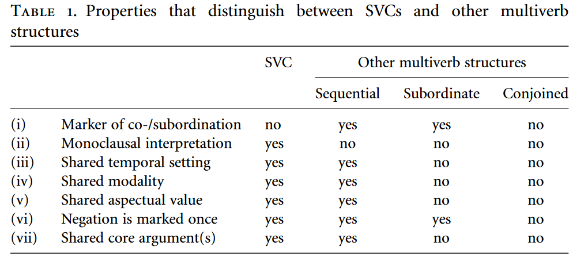

--- 
title: "Are all serial verb constructions realised in a single intonation unit?"
author: "Naomi Peck"
date: "2022-12-09"
site: bookdown::bookdown_site
documentclass: book
mainfont: arial
output:
  bookdown::gitbook:
    split_bib: true
    split_by: section
#    toc:
#      collapse: section
bibliography: [book.bib, packages.bib, references.bib]
url: https\://naomipeck.github.io/svc-prosody/
# cover-image: path to the social sharing image like images/cover.jpg
#description: |
#  This is a minimal example of using the bookdown package to write a book.
#  The HTML output format for this example is bookdown::gitbook,
#  set in the _output.yml file.
link-citations: yes
#github-repo: rstudio/bookdown-demo
---

# Abstract {-}


Serial verb constructions (SVCs) are commonly described as occurring within a single intonation unit (IU) following Givón 1991, leading to Himmelmann (2022) to assert that they are "IU-bounded constructions". However, as of yet, there is no empirical study exploring the prosodic realisation of SVCs. In this poster, I show results from a first study into the prosody of serial verb constructions, based on a sample of grammatical descriptions from 150 languages with verb serialisation, accompanied with examples from spoken corpora. I find that serial verb constructions do not necessarily need to obey a “One Intonation Unit” constraint.

Initial evidence suggests that we cannot claim that all SVCs are IU-bounded. Himmelmann's claim presupposes that a) serial verb constructions are not grammatically robust, and that b) a serial verb construction will not be recognised as such when realised over multiple IUs. In fact, we find a mix of prosodically-dependent and prosodically-robust types across languages: while the majority of constructions appear to be IU-bounded, a number of constructions can be realised as prosodic groupings (prosodically-dependent constructions consisting of multiple IUs), and elsewhere SVCs can fulfil constituent tests typical of prosodically-robust, i.e. grammaticalised, constructions in other languages.

It has been recognised for a while that the label of serial verb construction is used as an umbrella term for many different constructional subtypes (Foley 2010). My empirical investigation of the prosody of serial verb constructions shows similarly that the “single IU constraint” is not one-size-fits-all. 

Foley, William A. 2010. Events and serial verb constructions. In Mengistu Amberber, Brett Baker & Mark Harvey (eds.), Complex Predicates, 79–109. Cambridge: Cambridge University Press. https://doi.org/10.1017/CBO9780511712234.005.

Givón, Talmy. 1991. Some substantive issues concerning verb serialization: grammatical vs. cognitive packaging. In Claire Lefebvre (ed.), Serial Verbs: Grammatical, Comparative and Cognitive Approaches, 137–184. Amsterdam: John Benjamins.

Himmelmann, Nikolaus P. 2022. Prosodic phrasing and the emergence of phrase structure. Linguistics. https://doi.org/10.1515/ling-2020-0135.

<br><br>
<div class="alert alert-warning">
  <strong>Important!</strong><br> Please note that this site represents a work in progress and should not be cited without prior permission from the author.
</div>


<!--chapter:end:index.Rmd-->

# Definitions

Here I'm going to include some discussion of the definitions that I use in this poster.

## Serial Verb Construction

A serial verb construction (SVC) is a grammatical unit which consists of two or more verbs which are juxtaposed without any marking of coordination or subordination. This construction has the same distribution as single verbs in the same language, and can be grammatically defined using the same criteria (although construction-specific criteria may also apply). The verbs within the construction should be able to be used as standalone predicates (i.e., as single verbs), albeit with a different but related meaning.

## Intonation Unit

An intonation unit can be defined both as a phonetic and as a phonological unit. As a phonetic unit, intonation units can be universally defined as units of speech (and potentially sign) which commence with a 'pitch reset' [@himmelmannetal2018]. These units are often bounded by other cues, such as pauses, changes in tempo (lags/rushes), changes in voice quality (creaky/breathy), as well as intonational contour cues, such as boundary tones. Intonation units are the minimal unit in conversation, i.e. turns minimally consist of a single intonation unit [@selting1996], and are hypothesised to be the minimal unit of information packaging in human language [@chafe1996].
As a phonological unit, intonation units must be defined on a language-specific basis with reference to lower phonological units within a language. Typically, intonation units can be the domain for (morpho-)phonological rules, and feature a unit-level accent and boundary tones.
Given the universality of phonetic intonation units, as well as the universality of functions related to intonation unit-like units in speech, I assume that all languages have a phonological unit which corresponds to the phonetic intonation unit.

It is important to additionally distinguish between intonation *units* and intonation *contours*. Intonation units create chunks of language, while intonation contours encode additional information (and contribute to the ability of the intonation unit to chunk). Contours are language-specific and can extend over multiple intonation units [reference]. As such, we cannot take discussions of intonation contours to equal discussions of intonation units.

## "One Intonation Unit" constraint

The "One Intonation Unit" constraint refers more broadly to the hypothesis that all serial verb constructions must be realised within a single intonation unit. This constraint is a hypothesis which relies on a number of hypotheses and assumptions within functional-typological literature. 

Firstly, serial verb constructions are commonly assumed to encode a single event, due to their similar distribution to single verbs [e.g. @aikhenvald2006; @bisang2009].
@pawley1985 suggested that serial verb constructions actually can encode more than one event.
@givon1991 tested this hypothesis by using the proxy of breath groups for events, and found that the large majority of SVCs were realised within a single breath group. This finding was then taken more broadly to mean that all SVCs were realised in either a single intonation unit, or under a single intonation contour.
However, @chafe1996 hypothesised that no more than "one new idea" can be realised in a given intonation unit at a time, which would suggest that serial verb constructions - which realise 'one event' - should be realised within a single intonation unit. It additionally suggests, however, that discourse plays a role in how events are construed.

The constraint as it is tested in this work takes the form of @himmelmann2022's assertion that SVCs are "IU-bounded constructions", i.e. the construction is only recogniseable as an SVC when it is realised within the same intonation unit.

<!--chapter:end:01-intro.Rmd-->

# Background

Here I'm going to write something about why I'm doing this study.

Firstly, serial verb constructions are commonly assumed to encode a single event, due to their similar distribution to single verbs [e.g. @aikhenvald2006; @bisang2009].
@pawley1985 suggested that serial verb constructions actually can encode more than one event.
@givon1991 tested this hypothesis by using the proxy of breath groups for events, and found that the large majority of SVCs were realised within a single breath group. This finding was then taken more broadly to mean that all SVCs were realised in either a single intonation unit, or under a single intonation contour.
However, @chafe1996 hypothesised that no more than "one new idea" can be realised in a given intonation unit at a time, which would suggest that serial verb constructions - which realise 'one event' - should be realised within a single intonation unit. It additionally suggests, however, that discourse plays a role in how events are construed.

The constraint as it is tested in this work takes the form of @himmelmann2022's assertion that SVCs are "IU-bounded constructions", i.e. the construction is only recogniseable as an SVC when it is realised within the same intonation unit.

This will relate to this part of the abstract:
Serial verb constructions (SVCs) are commonly described as occurring within a single intonation unit (IU) following Givón 1991, leading to Himmelmann (2022) to assert that they are “IU-bounded constructions”. However, as of yet, there is no empirical study exploring the prosodic realisation of SVCs. 

<!--chapter:end:02-cross-refs.Rmd-->

# Overview of Data


Here I'm going to include an overview of what data this poster is based on, including information about my coding.


```r
full_glottolog <- lingtypology::glottolog
svc_prosody <- read.csv("svc-prosody.csv")
full_info <- merge(x=svc_prosody,y=full_glottolog,by="glottocode",all.x=TRUE)


mapping <- full_info %>%
  drop_na() %>%
  subset(select = c(language.y, glottocode, iu, grouping, grammatical, latitude, longitude)) %>%
  mutate(coding =
           case_when(
             grouping == 1 ~ "prosodic grouping",
             grammatical == 1 ~ "grammatical construction",
             TRUE ~ "intonation-unit bounded"
           )) 
       
map.feature(languages = mapping$language.y, features = mapping$coding)
```

```{=html}
<div id="htmlwidget-244aaddf2639520a3f5a" style="width:672px;height:480px;" class="leaflet html-widget"></div>
<script type="application/json" data-for="htmlwidget-244aaddf2639520a3f5a">{"x":{"options":{"crs":{"crsClass":"L.CRS.EPSG3857","code":null,"proj4def":null,"projectedBounds":null,"options":{}},"zoomControl":false},"calls":[{"method":"addTiles","args":["OpenStreetMap.Mapnik",null,null,{"minZoom":0,"maxZoom":18,"tileSize":256,"subdomains":"abc","errorTileUrl":"","tms":false,"noWrap":false,"zoomOffset":0,"zoomReverse":false,"opacity":1,"zIndex":1,"detectRetina":false}]},{"method":"addProviderTiles","args":["OpenStreetMap.Mapnik",null,"OpenStreetMap.Mapnik",{"errorTileUrl":"","noWrap":false,"opacity":1,"detectRetina":false}]},{"method":"addCircleMarkers","args":[[6.5805,-0.57073,12.2281,-6.68656,-4.66307,-13.5573,-5.54836,26.8,-6.10774,16.4185,-10.9777,30.9121,6.8688,1.21652,-16.4838,6.14153,-2.5604,9.82554,14.8116,-16.6274,2.12787,-13.61,12.483333,-8.15058,11.9777,-12.3061,-3.43957,12.0515,9.83446,27.4177713,31,10.583,-16.2696,29.8629,15.7358,-3.52309,0.58157,-10.8098,35.66354,-9.56687,-5.41439,27.410786,-23.3583,0.07337,-15.3523,6.46061,-3.10868,20.1415,4.3733,8.74455,31.5655,-5.09522,-1.13531,47.33,18.198,42.4502,-23.93447,23.9596,0.58622,-4.30064,-3.31228,18.13,7.64972,-5.25216,25.7317,-9.37937,24.6,-17.0695,-8.8704,63.7551,-5.66011,-2.80084,10.514,26.1602,-3.06952,22.8549,24.1523,19,-9.05569,46.7736,-2.1239,-1.3679,-4.71826,-4.07921,40.0209,-38.7392,-11.66,-7.17425,-9.59575,-1.18016,36.33736,24.7564,23.03,-14.74852,6.50696,1.30455,27.152,-20.2513,54.004532,39.8667,20.7926,-9.46246,9.18404,-29.7054,-19.72,-3.2929,3.15636,30.0368,15.8033,-10.173335,24.8237,51.8439,-12.9857,24.6043,4.54729,-9.12853,2.82799,7.64407,7.05022,9.85472,23.1584,53,-2.07971,-17.6485,14.2038,0.440205,14.192,0.02461,-8.39233,14.756,1.28024,-19.180953,-8.520813,9.16012,-8.53416,-13.2903,-17.496,11.3169,28.0239,28.2462,28.33,7.79964,-4.71731,27.8,7.15345,18.7757,35.75,39.8389,16.6804,5.83747],[10.2267,132.416,41.8083,142.656,143.316,130.04,148.993,105.85,312.3685,121.656,285.0847,266.9173,0.41314,281.6599,167.707,10.1194,147.282,34.6522,-3.77092,122.906,98.2517,296.32,108.016667,159.419,106.798,134.365,126.632,105.015,-1.90181,92.2255891,272.5,29.9404,168.013,80.5439,15.8517,140.947,290.5045,122.658,103.38952,147.986,142.475,89.581604,135.046,127.423,167.89,0.814975,141.64,262.4069,97.3456,9.72453,101.928,144.3375,134.037,258,265.0891,45.8064,24.69828,87.1188,290.1641,143.316,141.171,282.7388,16.7344,144.585,93.0462,295.8478,102.4,139.489,121.256,87.5466,142.069,141.303,30.003,56.4202,151.537,104.776,94.2706,102.46,159.119,235.996,115.092,132.591,152.214,145.033,116.228,288.723,133.376,146.071,143.773,133.618,102.80434,125.363,85.85,129.70152,10.5312,30.2242,95.3903,27.4096,227.920743,32.8667,93.9665,147.899,5.40031,19.0841,163.66,142.131,22.1212,75.6702,274.442,166.247188,92.2628,18.6255,299.665,121.067,305.9762,159.814,102.806,35.223,35.2826,31.7926,256.017,-1,132.157,210.55,-2.41269,291.0958,100.671,127.746,160.619,-3.28,124.964,23.998153,179.198088,34.2293,126.317,183.793,135.683,13.8996,85.0563,83.511,109.67,122.341,143.572,100.9,3.67225,271.0433,273.25,236.704,262.7124,37.3409],5,null,["","","","","","","","","","","","","","","","","","","","","","","","","","","","","","","","","","","","","","","","","","","","","","","","","","","","","","","","","","","","","","","","","","","","","","","","","","","","","","","","","","","","","","","","","","","","","","","","","","","","","","","","","","","","","","","","","","","","","","","","","","","","","","","","","","","","","","","","","","","","","","","","","","","","","",""],{"interactive":true,"className":"","stroke":false,"color":"#03F","weight":1,"opacity":0.5,"fill":true,"fillColor":["#1F77B4","#FF7F0E","#FF7F0E","#1F77B4","#FF7F0E","#FF7F0E","#FF7F0E","#FF7F0E","#FF7F0E","#FF7F0E","#FF7F0E","#FF7F0E","#1F77B4","#FF7F0E","#1F77B4","#1F77B4","#FF7F0E","#FF7F0E","#FF7F0E","#1F77B4","#FF7F0E","#FF7F0E","#FF7F0E","#FF7F0E","#FF7F0E","#FF7F0E","#FF7F0E","#FF7F0E","#FF7F0E","#FF7F0E","#FF7F0E","#FF7F0E","#2CA02C","#FF7F0E","#1F77B4","#1F77B4","#FF7F0E","#FF7F0E","#FF7F0E","#FF7F0E","#FF7F0E","#FF7F0E","#FF7F0E","#FF7F0E","#FF7F0E","#1F77B4","#FF7F0E","#FF7F0E","#FF7F0E","#FF7F0E","#FF7F0E","#1F77B4","#FF7F0E","#1F77B4","#1F77B4","#FF7F0E","#FF7F0E","#FF7F0E","#FF7F0E","#FF7F0E","#FF7F0E","#1F77B4","#1F77B4","#1F77B4","#FF7F0E","#FF7F0E","#FF7F0E","#FF7F0E","#FF7F0E","#FF7F0E","#FF7F0E","#FF7F0E","#FF7F0E","#FF7F0E","#FF7F0E","#FF7F0E","#FF7F0E","#FF7F0E","#1F77B4","#FF7F0E","#FF7F0E","#1F77B4","#FF7F0E","#2CA02C","#FF7F0E","#1F77B4","#FF7F0E","#FF7F0E","#FF7F0E","#FF7F0E","#FF7F0E","#FF7F0E","#FF7F0E","#FF7F0E","#1F77B4","#1F77B4","#1F77B4","#1F77B4","#FF7F0E","#FF7F0E","#FF7F0E","#2CA02C","#1F77B4","#FF7F0E","#FF7F0E","#FF7F0E","#FF7F0E","#FF7F0E","#FF7F0E","#FF7F0E","#FF7F0E","#FF7F0E","#FF7F0E","#FF7F0E","#1F77B4","#1F77B4","#FF7F0E","#FF7F0E","#FF7F0E","#1F77B4","#FF7F0E","#FF7F0E","#FF7F0E","#FF7F0E","#FF7F0E","#FF7F0E","#FF7F0E","#FF7F0E","#1F77B4","#FF7F0E","#FF7F0E","#FF7F0E","#FF7F0E","#FF7F0E","#2CA02C","#FF7F0E","#FF7F0E","#FF7F0E","#FF7F0E","#FF7F0E","#FF7F0E","#FF7F0E","#FF7F0E","#FF7F0E","#1F77B4","#FF7F0E","#FF7F0E","#1F77B4","#FF7F0E","#FF7F0E"],"fillOpacity":1},null,null,["<a href='https://glottolog.org/resource/languoid/id/abar1238' target='_blank'>Mungbam<\/a><br>","<a href='https://glottolog.org/resource/languoid/id/abun1252' target='_blank'>Abun<\/a><br>","<a href='https://glottolog.org/resource/languoid/id/afar1241' target='_blank'>Afar<\/a><br>","<a href='https://glottolog.org/resource/languoid/id/aime1238' target='_blank'>Aimele<\/a><br>","<a href='https://glottolog.org/resource/languoid/id/alam1246' target='_blank'>Alamblak<\/a><br>","<a href='https://glottolog.org/resource/languoid/id/amii1238' target='_blank'>Ami<\/a><br>","<a href='https://glottolog.org/resource/languoid/id/anem1249' target='_blank'>Anem<\/a><br>","<a href='https://glottolog.org/resource/languoid/id/aoua1234' target='_blank'>A'ou<\/a><br>","<a href='https://glottolog.org/resource/languoid/id/apin1244' target='_blank'>Apinayé<\/a><br>","<a href='https://glottolog.org/resource/languoid/id/arta1239' target='_blank'>Arta<\/a><br>","<a href='https://glottolog.org/resource/languoid/id/ashe1272' target='_blank'>Ashéninka Perené<\/a><br>","<a href='https://glottolog.org/resource/languoid/id/atak1252' target='_blank'>Atakapa<\/a><br>","<a href='https://glottolog.org/resource/languoid/id/avat1244' target='_blank'>Avatime<\/a><br>","<a href='https://glottolog.org/resource/languoid/id/awac1239' target='_blank'>Awa-Cuaiquer<\/a><br>","<a href='https://glottolog.org/resource/languoid/id/axam1237' target='_blank'>Axamb<\/a><br>","<a href='https://glottolog.org/resource/languoid/id/bafu1246' target='_blank'>Bafut<\/a><br>","<a href='https://glottolog.org/resource/languoid/id/balu1257' target='_blank'>Paluai<\/a><br>","<a href='https://glottolog.org/resource/languoid/id/bamb1262' target='_blank'>Bambassi<\/a><br>","<a href='https://glottolog.org/resource/languoid/id/bang1363' target='_blank'>Bangime<\/a><br>","<a href='https://glottolog.org/resource/languoid/id/bard1255' target='_blank'>Bardi<\/a><br>","<a href='https://glottolog.org/resource/languoid/id/bata1293' target='_blank'>Batak Karo<\/a><br>","<a href='https://glottolog.org/resource/languoid/id/baur1253' target='_blank'>Baure<\/a><br>","<a href='https://glottolog.org/resource/languoid/id/biha1246' target='_blank'>Bih<\/a><br>","<a href='https://glottolog.org/resource/languoid/id/blab1237' target='_blank'>Blablanga<\/a><br>","<a href='https://glottolog.org/resource/languoid/id/bulo1242' target='_blank'>Bulo Stieng<\/a><br>","<a href='https://glottolog.org/resource/languoid/id/bura1267' target='_blank'>Burarra<\/a><br>","<a href='https://glottolog.org/resource/languoid/id/buru1303' target='_blank'>Buru (Indonesia)<\/a><br>","<a href='https://glottolog.org/resource/languoid/id/cent1989' target='_blank'>Central Khmer<\/a><br>","<a href='https://glottolog.org/resource/languoid/id/chak1271' target='_blank'>Chakali<\/a><br>","<a href='https://glottolog.org/resource/languoid/id/chug1252' target='_blank'>Duhumbi<\/a><br>","<a href='https://glottolog.org/resource/languoid/id/cree1270' target='_blank'>Creek<\/a><br>","<a href='https://glottolog.org/resource/languoid/id/dagi1241' target='_blank'>Dagik<\/a><br>","<a href='https://glottolog.org/resource/languoid/id/daka1243' target='_blank'>Dakaka<\/a><br>","<a href='https://glottolog.org/resource/languoid/id/darm1243' target='_blank'>Darma<\/a><br>","<a href='https://glottolog.org/resource/languoid/id/daza1242' target='_blank'>Dazaga<\/a><br>","<a href='https://glottolog.org/resource/languoid/id/dera1245' target='_blank'>Dera (Indonesia)<\/a><br>","<a href='https://glottolog.org/resource/languoid/id/desa1247' target='_blank'>Desano<\/a><br>","<a href='https://glottolog.org/resource/languoid/id/dhao1237' target='_blank'>Dhao<\/a><br>","<a href='https://glottolog.org/resource/languoid/id/dong1285' target='_blank'>Dongxiang<\/a><br>","<a href='https://glottolog.org/resource/languoid/id/doro1266' target='_blank'>Doromu-Koki<\/a><br>","<a href='https://glottolog.org/resource/languoid/id/duna1248' target='_blank'>Duna<\/a><br>","<a href='https://glottolog.org/resource/languoid/id/dzon1239' target='_blank'>Dzongkha<\/a><br>","<a href='https://glottolog.org/resource/languoid/id/east2379' target='_blank'>Eastern Arrernte<\/a><br>","<a href='https://glottolog.org/resource/languoid/id/east2440' target='_blank'>East Makian<\/a><br>","<a href='https://glottolog.org/resource/languoid/id/east2443' target='_blank'>East Ambae<\/a><br>","<a href='https://glottolog.org/resource/languoid/id/ewee1241' target='_blank'>Ewe<\/a><br>","<a href='https://glottolog.org/resource/languoid/id/fass1245' target='_blank'>Momu-Fas<\/a><br>","<a href='https://glottolog.org/resource/languoid/id/filo1235' target='_blank'>Filomeno Mata Totonac<\/a><br>","<a href='https://glottolog.org/resource/languoid/id/gayo1244' target='_blank'>Gayo<\/a><br>","<a href='https://glottolog.org/resource/languoid/id/goem1240' target='_blank'>Goemai<\/a><br>","<a href='https://glottolog.org/resource/languoid/id/guan1266' target='_blank'>Khroskyabs<\/a><br>","<a href='https://glottolog.org/resource/languoid/id/haru1245' target='_blank'>Haruai<\/a><br>","<a href='https://glottolog.org/resource/languoid/id/hata1243' target='_blank'>Hatam<\/a><br>","<a href='https://glottolog.org/resource/languoid/id/hida1246' target='_blank'>Hidatsa<\/a><br>","<a href='https://glottolog.org/resource/languoid/id/high1276' target='_blank'>Highland Popoluca<\/a><br>","<a href='https://glottolog.org/resource/languoid/id/hinu1240' target='_blank'>Hinuq<\/a><br>","<a href='https://glottolog.org/resource/languoid/id/hoaa1235' target='_blank'>Amkoe<\/a><br>","<a href='https://glottolog.org/resource/languoid/id/hooo1248' target='_blank'>Ho<\/a><br>","<a href='https://glottolog.org/resource/languoid/id/hupd1244' target='_blank'>Hup<\/a><br>","<a href='https://glottolog.org/resource/languoid/id/iatm1242' target='_blank'>Iatmul<\/a><br>","<a href='https://glottolog.org/resource/languoid/id/imon1245' target='_blank'>Imonda<\/a><br>","<a href='https://glottolog.org/resource/languoid/id/jama1262' target='_blank'>Jamaican Creole English<\/a><br>","<a href='https://glottolog.org/resource/languoid/id/kaba1281' target='_blank'>Kaba<\/a><br>","<a href='https://glottolog.org/resource/languoid/id/kala1397' target='_blank'>Kalam<\/a><br>","<a href='https://glottolog.org/resource/languoid/id/karb1241' target='_blank'>Hills Karbi<\/a><br>","<a href='https://glottolog.org/resource/languoid/id/kari1311' target='_blank'>Karitiâna<\/a><br>","<a href='https://glottolog.org/resource/languoid/id/kats1235' target='_blank'>Katso<\/a><br>","<a href='https://glottolog.org/resource/languoid/id/kaya1319' target='_blank'>Kayardild<\/a><br>","<a href='https://glottolog.org/resource/languoid/id/keoo1238' target='_blank'>Kéo<\/a><br>","<a href='https://glottolog.org/resource/languoid/id/kett1243' target='_blank'>Ket<\/a><br>","<a href='https://glottolog.org/resource/languoid/id/kona1242' target='_blank'>Konai<\/a><br>","<a href='https://glottolog.org/resource/languoid/id/kris1246' target='_blank'>I'saka<\/a><br>","<a href='https://glottolog.org/resource/languoid/id/kron1241' target='_blank'>Krongo<\/a><br>","<a href='https://glottolog.org/resource/languoid/id/kumz1235' target='_blank'>Kumzari<\/a><br>","<a href='https://glottolog.org/resource/languoid/id/kuot1243' target='_blank'>Kuot<\/a><br>","<a href='https://glottolog.org/resource/languoid/id/lach1248' target='_blank'>Lachi<\/a><br>","<a href='https://glottolog.org/resource/languoid/id/lamk1238' target='_blank'>Lamkang<\/a><br>","<a href='https://glottolog.org/resource/languoid/id/laoo1244' target='_blank'>Lao<\/a><br>","<a href='https://glottolog.org/resource/languoid/id/lavu1241' target='_blank'>Lavukaleve<\/a><br>","<a href='https://glottolog.org/resource/languoid/id/lowe1427' target='_blank'>Lower Chehalis<\/a><br>","<a href='https://glottolog.org/resource/languoid/id/maan1238' target='_blank'>Ma'anyan<\/a><br>","<a href='https://glottolog.org/resource/languoid/id/maib1239' target='_blank'>Maybrat-Karon<\/a><br>","<a href='https://glottolog.org/resource/languoid/id/mali1284' target='_blank'>Mali<\/a><br>","<a href='https://glottolog.org/resource/languoid/id/mana1295' target='_blank'>Manam<\/a><br>","<a href='https://glottolog.org/resource/languoid/id/mand1415' target='_blank'>Mandarin Chinese<\/a><br>","<a href='https://glottolog.org/resource/languoid/id/mapu1245' target='_blank'>Mapudungun<\/a><br>","<a href='https://glottolog.org/resource/languoid/id/maun1240' target='_blank'>Mawng<\/a><br>","<a href='https://glottolog.org/resource/languoid/id/meny1245' target='_blank'>Menya<\/a><br>","<a href='https://glottolog.org/resource/languoid/id/meri1244' target='_blank'>Meriam<\/a><br>","<a href='https://glottolog.org/resource/languoid/id/meya1236' target='_blank'>Meyah<\/a><br>","<a href='https://glottolog.org/resource/languoid/id/minh1238' target='_blank'>Mangghuer<\/a><br>","<a href='https://glottolog.org/resource/languoid/id/miya1259' target='_blank'>Miyako<\/a><br>","<a href='https://glottolog.org/resource/languoid/id/mund1320' target='_blank'>Mundari<\/a><br>","<a href='https://glottolog.org/resource/languoid/id/murr1258' target='_blank'>Murriny Patha<\/a><br>","<a href='https://glottolog.org/resource/languoid/id/ncan1245' target='_blank'>Ncane-Mungong<\/a><br>","<a href='https://glottolog.org/resource/languoid/id/ngit1239' target='_blank'>Ngiti<\/a><br>","<a href='https://glottolog.org/resource/languoid/id/noct1238' target='_blank'>Nocte Naga<\/a><br>","<a href='https://glottolog.org/resource/languoid/id/nort2795' target='_blank'>Zimbabwean Ndebele<\/a><br>","<a href='https://glottolog.org/resource/languoid/id/nort2938' target='_blank'>Northern Haida<\/a><br>","<a href='https://glottolog.org/resource/languoid/id/nucl1301' target='_blank'>Turkish<\/a><br>","<a href='https://glottolog.org/resource/languoid/id/nucl1310' target='_blank'>Burmese<\/a><br>","<a href='https://glottolog.org/resource/languoid/id/nucl1630' target='_blank'>Barai<\/a><br>","<a href='https://glottolog.org/resource/languoid/id/nupe1254' target='_blank'>Nupe-Nupe-Tako<\/a><br>","<a href='https://glottolog.org/resource/languoid/id/nuuu1241' target='_blank'>Ghaap-Kalahari<\/a><br>","<a href='https://glottolog.org/resource/languoid/id/nyal1254' target='_blank'>Belep<\/a><br>","<a href='https://glottolog.org/resource/languoid/id/oloo1241' target='_blank'>Olo<\/a><br>","<a href='https://glottolog.org/resource/languoid/id/pagi1243' target='_blank'>Pagibete<\/a><br>","<a href='https://glottolog.org/resource/languoid/id/panj1256' target='_blank'>Eastern Panjabi<\/a><br>","<a href='https://glottolog.org/resource/languoid/id/pech1241' target='_blank'>Pech<\/a><br>","<a href='https://glottolog.org/resource/languoid/id/pile1238' target='_blank'>Vaeakau-Taumako<\/a><br>","<a href='https://glottolog.org/resource/languoid/id/pnar1238' target='_blank'>Pnar<\/a><br>","<a href='https://glottolog.org/resource/languoid/id/poli1260' target='_blank'>Polish<\/a><br>","<a href='https://glottolog.org/resource/languoid/id/saba1268' target='_blank'>Sabanê<\/a><br>","<a href='https://glottolog.org/resource/languoid/id/sais1237' target='_blank'>Saisiyat<\/a><br>","<a href='https://glottolog.org/resource/languoid/id/sara1340' target='_blank'>Saramaccan<\/a><br>","<a href='https://glottolog.org/resource/languoid/id/savo1255' target='_blank'>Savosavo<\/a><br>","<a href='https://glottolog.org/resource/languoid/id/seme1247' target='_blank'>Semelai<\/a><br>","<a href='https://glottolog.org/resource/languoid/id/shab1252' target='_blank'>Shabo<\/a><br>","<a href='https://glottolog.org/resource/languoid/id/shek1245' target='_blank'>Sheko<\/a><br>","<a href='https://glottolog.org/resource/languoid/id/shil1265' target='_blank'>Shilluk<\/a><br>","<a href='https://glottolog.org/resource/languoid/id/sout2976' target='_blank'>Southeastern Tepehuan<\/a><br>","<a href='https://glottolog.org/resource/languoid/id/stan1293' target='_blank'>English<\/a><br>","<a href='https://glottolog.org/resource/languoid/id/suab1238' target='_blank'>Suabo<\/a><br>","<a href='https://glottolog.org/resource/languoid/id/tahi1242' target='_blank'>Tahitian<\/a><br>","<a href='https://glottolog.org/resource/languoid/id/tama1365' target='_blank'>Tamasheq<\/a><br>","<a href='https://glottolog.org/resource/languoid/id/tari1256' target='_blank'>Tariana<\/a><br>","<a href='https://glottolog.org/resource/languoid/id/thai1261' target='_blank'>Thai<\/a><br>","<a href='https://glottolog.org/resource/languoid/id/tido1248' target='_blank'>Tidore<\/a><br>","<a href='https://glottolog.org/resource/languoid/id/toab1237' target='_blank'>To'abaita<\/a><br>","<a href='https://glottolog.org/resource/languoid/id/tomm1242' target='_blank'>Tommo So Dogon<\/a><br>","<a href='https://glottolog.org/resource/languoid/id/tond1251' target='_blank'>Tondano<\/a><br>","<a href='https://glottolog.org/resource/languoid/id/tsix1234' target='_blank'>Ts'ixa<\/a><br>","<a href='https://glottolog.org/resource/languoid/id/tuva1244' target='_blank'>Tuvalu<\/a><br>","<a href='https://glottolog.org/resource/languoid/id/uduk1239' target='_blank'>Uduk<\/a><br>","<a href='https://glottolog.org/resource/languoid/id/waim1252' target='_blank'>Waima'a<\/a><br>","<a href='https://glottolog.org/resource/languoid/id/wall1257' target='_blank'>East Uvean<\/a><br>","<a href='https://glottolog.org/resource/languoid/id/wamb1258' target='_blank'>Wambayan<\/a><br>","<a href='https://glottolog.org/resource/languoid/id/wand1278' target='_blank'>Wandala<\/a><br>","<a href='https://glottolog.org/resource/languoid/id/west2415' target='_blank'>Western Tamang<\/a><br>","<a href='https://glottolog.org/resource/languoid/id/west2418' target='_blank'>Western Magar<\/a><br>","<a href='https://glottolog.org/resource/languoid/id/west2430' target='_blank'>Western Xiangxi Miao<\/a><br>","<a href='https://glottolog.org/resource/languoid/id/west2557' target='_blank'>Western Subanon<\/a><br>","<a href='https://glottolog.org/resource/languoid/id/yima1243' target='_blank'>Yimas<\/a><br>","<a href='https://glottolog.org/resource/languoid/id/yong1270' target='_blank'>Narua<\/a><br>","<a href='https://glottolog.org/resource/languoid/id/yoru1245' target='_blank'>Yoruba<\/a><br>","<a href='https://glottolog.org/resource/languoid/id/yuca1254' target='_blank'>Yucatec Maya<\/a><br>","<a href='https://glottolog.org/resource/languoid/id/yuch1247' target='_blank'>Yuchi<\/a><br>","<a href='https://glottolog.org/resource/languoid/id/yuki1243' target='_blank'>Northern Yukian<\/a><br>","<a href='https://glottolog.org/resource/languoid/id/zani1235' target='_blank'>Zaniza Zapotec<\/a><br>","<a href='https://glottolog.org/resource/languoid/id/zays1235' target='_blank'>Zayse-Zergulla<\/a><br>"],null,null,{"interactive":false,"permanent":false,"direction":"right","opacity":1,"offset":[7.5,0],"textsize":"10px","textOnly":true,"style":{"font-size":"15px","font-family":"sans-serif"},"className":"","sticky":true},null]},{"method":"addScaleBar","args":[{"maxWidth":100,"metric":true,"imperial":true,"updateWhenIdle":true,"position":"bottomleft"}]},{"method":"addLegend","args":[{"colors":["#1F77B4","#FF7F0E","#2CA02C"],"labels":["grammatical construction","intonation-unit bounded","prosodic grouping"],"na_color":null,"na_label":"NA","opacity":1,"position":"topright","type":"factor","title":null,"extra":null,"layerId":null,"className":"info legend","group":null}]}],"limits":{"lat":[-38.7392,63.7551],"lng":[-3.77092,312.3685]}},"evals":[],"jsHooks":[]}</script>
```

# Grammatical Descriptions


<!--chapter:end:03-parts.Rmd-->

# Discussion and Results


Here I'm going to include some discussion about what I can observe from the data.


<!--chapter:end:04-citations.Rmd-->


## Abun
### Details
Glottocode: abun1252 <br> 
Family: Isolate <br>
Macroarea: Papunesia

### Coding
IU: 1 <br> Grouping: ? <br> Grammatical: 0

> The other modifying component of Abun verb phrases is *verbal particles*. These particles are attached to certain verbs like 'up' in the English, 'He *looked up* the words', which may, in English, also be in the form, 'He *looked* the words *up*'. ...
In English the verbal particules 'up', 'down', and so on, may be continuous or discontinuous with the verb. In Abun, however, the particle is discontinuous when there is a direct object ...
None of the Abun verbal particles appear to have been derived from adpositions. Instead, most of the verbal particles are derived from verbs such as *mu* 'go', *ma* 'come' and *kwop* 'die'.
[@berryberry2000, 67]

> In *simple juxtapositino*, there are no markers of conjunction. ... This strategy is permitted at all levels from sentence to noun phrase, as well as in verb phrases (verb phrases, incidentally, only allow this type of strategy to give what appear to be serial verb formations). [@berryberry2000, 94]

### Examples

(@abun1) @berry1995, 40, example 59
<table class=" lightable-minimal" style='font-family: "Trebuchet MS", verdana, sans-serif; width: auto !important; border-bottom: 0;'>
<tbody>
  <tr>
   <td style="text-align:left;"> _Prisila_ </td>
   <td style="text-align:left;"> _ma_ </td>
   <td style="text-align:left;"> _sap_ </td>
   <td style="text-align:left;"> _Barbarina_ </td>
   <td style="text-align:left;"> _o_ </td>
   <td style="text-align:left;"> _ya_ </td>
  </tr>
  <tr>
   <td style="text-align:left;"> Prisila </td>
   <td style="text-align:left;"> come </td>
   <td style="text-align:left;"> cut </td>
   <td style="text-align:left;"> Barbarina </td>
   <td style="text-align:left;"> again </td>
   <td style="text-align:left;"> <span style="font-variant:small-caps;">possib</span> </td>
  </tr>
</tbody>
<tfoot><tr><td style="padding: 0; " colspan="100%">
<sup></sup> 'Prisila might come and cut Barbarina again.'</td></tr></tfoot>
</table>

(@abun2) @berryberry2000, 67, example 5.6.a
<table class=" lightable-minimal" style='font-family: "Trebuchet MS", verdana, sans-serif; width: auto !important; border-bottom: 0;'>
<tbody>
  <tr>
   <td style="text-align:left;"> _An_ </td>
   <td style="text-align:left;"> _gwat_ </td>
   <td style="text-align:left;"> _buku_ </td>
   <td style="text-align:left;"> _ma_ </td>
   <td style="text-align:left;"> _mo_ </td>
   <td style="text-align:left;"> _nu._ </td>
  </tr>
  <tr>
   <td style="text-align:left;"> <span style="font-variant:small-caps;">3sg</span> </td>
   <td style="text-align:left;"> carry </td>
   <td style="text-align:left;"> book </td>
   <td style="text-align:left;"> come </td>
   <td style="text-align:left;"> <span style="font-variant:small-caps;">loc</span> </td>
   <td style="text-align:left;"> house </td>
  </tr>
</tbody>
<tfoot><tr><td style="padding: 0; " colspan="100%">
<sup></sup> 'He brought the book to the house.'</td></tr></tfoot>
</table>

(@abun3) @berryberry2000, 95, example 5.166
<table class=" lightable-minimal" style='font-family: "Trebuchet MS", verdana, sans-serif; width: auto !important; border-bottom: 0;'>
<tbody>
  <tr>
   <td style="text-align:left;"> _An_ </td>
   <td style="text-align:left;"> _kas_ </td>
   <td style="text-align:left;"> _mu_ </td>
   <td style="text-align:left;"> _sem_ </td>
   <td style="text-align:left;"> _mo_ </td>
   <td style="text-align:left;"> _nden._ </td>
  </tr>
  <tr>
   <td style="text-align:left;"> <span style="font-variant:small-caps;">3sg</span> </td>
   <td style="text-align:left;"> run </td>
   <td style="text-align:left;"> go </td>
   <td style="text-align:left;"> sleep </td>
   <td style="text-align:left;"> <span style="font-variant:small-caps;">loc</span> </td>
   <td style="text-align:left;"> bush </td>
  </tr>
</tbody>
<tfoot><tr><td style="padding: 0; " colspan="100%">
<sup></sup> 'He ran and went and slept in the bush.'</td></tr></tfoot>
</table>


## Afar
### Details
Glottocode: afar1241 <br> 
Family: Afro-Asiatic <br>
Macroarea: Africa

### Coding
IU: 1 <br> Grouping: ? <br> Grammatical: ?

### Examples

(@afar1) @kamil2015, 291, example 907
<table class=" lightable-minimal" style='font-family: "Trebuchet MS", verdana, sans-serif; width: auto !important; border-bottom: 0;'>
<tbody>
  <tr>
   <td style="text-align:left;"> _taamiit_ </td>
   <td style="text-align:left;"> _-íyye_ </td>
  </tr>
  <tr>
   <td style="text-align:left;"> work.<span style="font-variant:small-caps;">dim</span> </td>
   <td style="text-align:left;"> say.<span style="font-variant:small-caps;">3m</span>.<span style="font-variant:small-caps;">pfv</span> </td>
  </tr>
</tbody>
<tfoot><tr><td style="padding: 0; " colspan="100%">
<sup></sup> 'He worked a little.'</td></tr></tfoot>
</table>

(@afar2) @kamil2015, 292, example 909
<table class=" lightable-minimal" style='font-family: "Trebuchet MS", verdana, sans-serif; width: auto !important; border-bottom: 0;'>
<tbody>
  <tr>
   <td style="text-align:left;"> _boddiná_ </td>
   <td style="text-align:left;"> _mukuɖ_ </td>
   <td style="text-align:left;"> _-ítta_ </td>
  </tr>
  <tr>
   <td style="text-align:left;"> tooth </td>
   <td style="text-align:left;"> wobble </td>
   <td style="text-align:left;"> say.<span style="font-variant:small-caps;">3f</span>.<span style="font-variant:small-caps;">ipfv</span> </td>
  </tr>
</tbody>
<tfoot><tr><td style="padding: 0; " colspan="100%">
<sup></sup> 'The tooth moves.'</td></tr></tfoot>
</table>

## Ahamb
### Details
Glottocode: axam1237 <br> 
Family: Austronesian <br>
Macroarea: Papunesia

### Coding
IU: 1 <br> Grouping: ? <br> Grammatical: 1

> In Ahamb, there is a small closed class of nonprototypical verbs that appear in nuclear serialisation-like constructions. Such lexemes are referred to here as coverbs and the constructions that they form – as coverbal SVCs. ... Ahamb does not have prototypical same-subject SVCs, but has both switch-function and ambient SVCs. [@rangelov2020, 331]

> [Coverbal constructions] function prosodically as one unit with the preceding verb stem and any affixes. Some phonological processes have been attested in more commonly used coverbal constructions. [@rangelov2020, 338]

> The sequential event subject indexes, characterised by the vowel /e/ (and less commonly /ø/), are used exclusively to mark the second and subsequent verb in SECs as in (@ahamb3). The subject index on the first verb of SECs is usually a neutral subject index. [@rangelov2020, 370]

### Examples

(@ahamb1) @rangelov2020, 333, example 11.2a
<table class=" lightable-minimal" style='font-family: "Trebuchet MS", verdana, sans-serif; width: auto !important; border-bottom: 0;'>
<tbody>
  <tr>
   <td style="text-align:left;"> _Nga-ro-kar_ </td>
   <td style="text-align:left;"> _husür-i._ </td>
  </tr>
  <tr>
   <td style="text-align:left;"> <span style="font-variant:small-caps;">3sg</span>-<span style="font-variant:small-caps;">ipfv</span>-say </td>
   <td style="text-align:left;"> follow-<span style="font-variant:small-caps;">obj</span> </td>
  </tr>
</tbody>
<tfoot><tr><td style="padding: 0; " colspan="100%">
<sup></sup> 'He talks about it.'</td></tr></tfoot>
</table>

(@ahamb2) @rangelov2020, 344, example 11.14b
<table class=" lightable-minimal" style='font-family: "Trebuchet MS", verdana, sans-serif; width: auto !important; border-bottom: 0;'>
<tbody>
  <tr>
   <td style="text-align:left;"> _Ange_ </td>
   <td style="text-align:left;"> _nga-tams_ </td>
   <td style="text-align:left;"> _bbën_ </td>
   <td style="text-align:left;"> _hana_ </td>
   <td style="text-align:left;"> _na-r-maj._ </td>
  </tr>
  <tr>
   <td style="text-align:left;"> <span style="font-variant:small-caps;">3sg</span> </td>
   <td style="text-align:left;"> <span style="font-variant:small-caps;">3sg</span>-hit </td>
   <td style="text-align:left;"> eliminate </td>
   <td style="text-align:left;"> <span style="font-variant:small-caps;">1sg</span> </td>
   <td style="text-align:left;"> <span style="font-variant:small-caps;">1sg</span>-<span style="font-variant:small-caps;">sbqt</span>-die </td>
  </tr>
</tbody>
<tfoot><tr><td style="padding: 0; " colspan="100%">
<sup></sup> 'He beat me to death.'</td></tr></tfoot>
</table>

(@ahamb3) @rangelov2020, 370, example 13.19a
<table class=" lightable-minimal" style='font-family: "Trebuchet MS", verdana, sans-serif; width: auto !important; border-bottom: 0;'>
<tbody>
  <tr>
   <td style="text-align:left;"> _Ta-gmay_ </td>
   <td style="text-align:left;"> _te-prag_ </td>
   <td style="text-align:left;"> _gasin._ </td>
  </tr>
  <tr>
   <td style="text-align:left;"> <span style="font-variant:small-caps;">3pl</span>-come </td>
   <td style="text-align:left;"> <span style="font-variant:small-caps;">3pl</span>.<span style="font-variant:small-caps;">seq</span>-do </td>
   <td style="text-align:left;"> work </td>
  </tr>
</tbody>
<tfoot><tr><td style="padding: 0; " colspan="100%">
<sup></sup> 'They come, they do the work.'</td></tr></tfoot>
</table>
## Aimele
### Details
Glottocode: aime1238 <br> 
Family: Aimele <br>
Macroarea: Papunesia

### Coding
IU: 1 <br> Grouping: ? <br> Grammatical: 1

> Neither of the constituent verbs in the SVC in (@aimele1) is morphologically-marked as subordinate to a final verb. Instead, each verb is uninflected, except for the final verb, which bears predicate markers such as tense, aspect, mood, modality, and evidentiality. 
[@aiton2016, 201]

### Examples

(@aimele1) @aiton2016, 200, example 27
<table class=" lightable-minimal" style='font-family: "Trebuchet MS", verdana, sans-serif; width: auto !important; border-bottom: 0;'>
<tbody>
  <tr>
   <td style="text-align:left;"> _ko:dulu_ </td>
   <td style="text-align:left;"> _sulo:bo_ </td>
   <td style="text-align:left;"> _-mo:_ </td>
   <td style="text-align:left;"> _wɛlɛ_ </td>
   <td style="text-align:left;"> _sɛ:_ </td>
   <td style="text-align:left;"> _-ja:_ </td>
  </tr>
  <tr>
   <td style="text-align:left;"> downward </td>
   <td style="text-align:left;"> NAME </td>
   <td style="text-align:left;"> <span style="font-variant:small-caps;">dat</span> </td>
   <td style="text-align:left;"> shout </td>
   <td style="text-align:left;"> say </td>
   <td style="text-align:left;"> <span style="font-variant:small-caps;">pst</span> </td>
  </tr>
</tbody>
<tfoot><tr><td style="padding: 0; " colspan="100%">
<sup></sup> 'I shouted it down to Solo:bu.'</td></tr></tfoot>
</table>

(@aimele2) @aiton2016, 201, example 30
<table class=" lightable-minimal" style='font-family: "Trebuchet MS", verdana, sans-serif; width: auto !important; border-bottom: 0;'>
<tbody>
  <tr>
   <td style="text-align:left;"> _nɛ:_ </td>
   <td style="text-align:left;"> _ti:ɸɛ:_ </td>
   <td style="text-align:left;"> _o:ga:_ </td>
   <td style="text-align:left;"> _ɛja:_ </td>
   <td style="text-align:left;"> _o:gɛ:_ </td>
   <td style="text-align:left;"> _di_ </td>
   <td style="text-align:left;"> _a:nɛ:_ </td>
  </tr>
  <tr>
   <td style="text-align:left;"> <span style="font-variant:small-caps;">1</span>:<span style="font-variant:small-caps;">sg</span> </td>
   <td style="text-align:left;"> afterwards </td>
   <td style="text-align:left;"> pandanus </td>
   <td style="text-align:left;"> seedling:<span style="font-variant:small-caps;">abs</span> </td>
   <td style="text-align:left;"> carry_in_bilum </td>
   <td style="text-align:left;"> take </td>
   <td style="text-align:left;"> go:<span style="font-variant:small-caps;">pst</span> </td>
  </tr>
</tbody>
<tfoot><tr><td style="padding: 0; " colspan="100%">
<sup></sup> 'I went after him, taking the pandanus seeds in a bilum.'</td></tr></tfoot>
</table>

(@aimele3) @aiton2016, 201, example 31
<table class=" lightable-minimal" style='font-family: "Trebuchet MS", verdana, sans-serif; width: auto !important; border-bottom: 0;'>
<tbody>
  <tr>
   <td style="text-align:left;"> _sugu:lu:_ </td>
   <td style="text-align:left;"> _ɛna:_ </td>
   <td style="text-align:left;"> _hɛna:_ </td>
   <td style="text-align:left;"> _do:ga:_ </td>
   <td style="text-align:left;"> _dijɛ:=bi:_ </td>
   <td style="text-align:left;"> _kɛi_ </td>
  </tr>
  <tr>
   <td style="text-align:left;"> school </td>
   <td style="text-align:left;"> that:<span style="font-variant:small-caps;">abs</span> </td>
   <td style="text-align:left;"> go </td>
   <td style="text-align:left;"> house:<span style="font-variant:small-caps;">abs</span> </td>
   <td style="text-align:left;"> build=<span style="font-variant:small-caps;">imp</span> </td>
   <td style="text-align:left;"> <span style="font-variant:small-caps;">asser</span> </td>
  </tr>
</tbody>
<tfoot><tr><td style="padding: 0; " colspan="100%">
<sup></sup> 'Go build that building for the school!'</td></tr></tfoot>
</table>

## Alamblak
### Details
Glottocode: alam1246 <br> 
Family: Sepik <br>
Macroarea: Papunesia

### Coding
IU: 1 <br> Grouping: 0 <br> Grammatical: 0

> Structurally the complex-verb stem is-a serialisation of roots (verb, noun, adjective, time word and adverb). Serialised constructions range from stemlike derived and compound stems, to constructions resembling predicates of merged clauses accompanied by strict constraints on possible combinations of clause participants. Others are phrase-like constructions with head plus modifying constituents. [@bruce1984, 152]

### Examples

(@alamblak1) @bruce1984, 160, example 233c
<table class=" lightable-minimal" style='font-family: "Trebuchet MS", verdana, sans-serif; width: auto !important; border-bottom: 0;'>
<tbody>
  <tr>
   <td style="text-align:left;"> _këfrat_ </td>
   <td style="text-align:left;"> _tu-hay-më-r-r_ </td>
  </tr>
  <tr>
   <td style="text-align:left;"> spear </td>
   <td style="text-align:left;"> throw-give-<span style="font-variant:small-caps;">r</span>.<span style="font-variant:small-caps;">pst</span>-<span style="font-variant:small-caps;">3sg</span>.<span style="font-variant:small-caps;">masc</span>-<span style="font-variant:small-caps;">3sg</span>.<span style="font-variant:small-caps;">masc</span> </td>
  </tr>
</tbody>
<tfoot><tr><td style="padding: 0; " colspan="100%">
<sup></sup> 'He threw the spear to him for him.'</td></tr></tfoot>
</table>

(@alamblak2) @bruce1984, 163, example 238b
<table class=" lightable-minimal" style='font-family: "Trebuchet MS", verdana, sans-serif; width: auto !important; border-bottom: 0;'>
<tbody>
  <tr>
   <td style="text-align:left;"> _hohra-t_ </td>
   <td style="text-align:left;"> _kak-yirona-më-t-t_ </td>
  </tr>
  <tr>
   <td style="text-align:left;"> thorn-<span style="font-variant:small-caps;">3sg</span>.<span style="font-variant:small-caps;">fem</span> </td>
   <td style="text-align:left;"> get-feel_pain-<span style="font-variant:small-caps;">r</span>.<span style="font-variant:small-caps;">pst</span>-<span style="font-variant:small-caps;">3sg</span>.<span style="font-variant:small-caps;">fem</span>-<span style="font-variant:small-caps;">3sg</span>.<span style="font-variant:small-caps;">fem</span> </td>
  </tr>
</tbody>
<tfoot><tr><td style="padding: 0; " colspan="100%">
<sup></sup> 'She got/held the thorn and felt pain.'</td></tr></tfoot>
</table>

(@alamblak3) @bruce1984, 165, example 243
<table class=" lightable-minimal" style='font-family: "Trebuchet MS", verdana, sans-serif; width: auto !important; border-bottom: 0;'>
<tbody>
  <tr>
   <td style="text-align:left;"> _grha-nur-më-m_ </td>
  </tr>
  <tr>
   <td style="text-align:left;"> dance-cry-<span style="font-variant:small-caps;">r</span>.<span style="font-variant:small-caps;">pst</span>-<span style="font-variant:small-caps;">3pl</span> </td>
  </tr>
</tbody>
<tfoot><tr><td style="padding: 0; " colspan="100%">
<sup></sup> 'They danced and cried.'</td></tr></tfoot>
</table>

## Ami
### Details
Glottocode: ammi1238 <br> 
Family: Western Daly <br>
Macroarea: Australia

### Coding
IU: 1 <br> Grouping: 0 <br> Grammatical: ?

> Phonological liaison occurs between the two verbs... There are grounds here for proposing that each serial construction constitutes a single phonological conglomerate. There is no pause between the VPs and the single intonation contour points to their constituting a single clause. [@ford1998, 316]

### Examples

(@ami1) @ford1998, 316, example 8-54
<table class=" lightable-minimal" style='font-family: "Trebuchet MS", verdana, sans-serif; width: auto !important; border-bottom: 0;border-bottom: 0;'>
<tbody>
  <tr>
   <td style="text-align:left;"> _gama_ </td>
   <td style="text-align:left;"> _vulhut_ </td>
   <td style="text-align:left;"> _gama_ </td>
  </tr>
  <tr>
   <td style="text-align:left;"> <span style="font-variant:small-caps;">3min</span>.<span style="font-variant:small-caps;">s</span>.<span style="font-variant:small-caps;">r</span>.stand </td>
   <td style="text-align:left;"> beeswax </td>
   <td style="text-align:left;"> <span style="font-variant:small-caps;">3min</span>.<span style="font-variant:small-caps;">s</span>.<span style="font-variant:small-caps;">r</span>.stand </td>
  </tr>
</tbody>
<tfoot><tr><td style="padding: 0; " colspan="100%">
<sup></sup> ['kamaɸ̀ʊl̪ʊkàma]</td></tr></tfoot>
<tfoot><tr><td style="padding: 0; " colspan="100%">
<sup></sup> 'The beeswax is standing up.'</td></tr></tfoot>
</table>

(@ami2) @ford1998, 316, example 8-55
<table class=" lightable-minimal" style='font-family: "Trebuchet MS", verdana, sans-serif; width: auto !important; border-bottom: 0;border-bottom: 0;'>
<tbody>
  <tr>
   <td style="text-align:left;"> _guman-pitji_ </td>
   <td style="text-align:left;"> _gaya_ </td>
  </tr>
  <tr>
   <td style="text-align:left;"> <span style="font-variant:small-caps;">3min</span>.<span style="font-variant:small-caps;">a</span>.<span style="font-variant:small-caps;">r</span>.poke-roll </td>
   <td style="text-align:left;"> <span style="font-variant:small-caps;">3min</span>.<span style="font-variant:small-caps;">s</span>.<span style="font-variant:small-caps;">r</span>.lie </td>
  </tr>
</tbody>
<tfoot><tr><td style="padding: 0; " colspan="100%">
<sup></sup> ['kʊmanp̀ɪcɪɣàja]</td></tr></tfoot>
<tfoot><tr><td style="padding: 0; " colspan="100%">
<sup></sup> 'He is still making fire.'</td></tr></tfoot>
</table>


## Amkoe
### Details
Glottocode: hoaa1235 <br> 
Family: Kxa <br>
Macroarea: Africa

### Coding
IU: 1 <br> Grouping: ? <br> Grammatical: 0

> A serial verb construction (SVC) is where one verb immediately follows the other without any intervening adverbs, negation, tense/aspect markers, passive prefix, or conjunctions. Such a construction is also referred to as a verbal compound. Serial verbs are used in ǂHȍȁ to express a wide range of semantic relations, including directions, results, sequences of ac­ tions and benefactives. Many concepts expressed by prepositions in other languages are ex­ pressed by serial verbs in ǂHȍã. [@collinsgruber2014, 167]

### Examples

(@amkoe1) @collinsgruber2014, 167, example 2a
<table class=" lightable-minimal" style='font-family: "Trebuchet MS", verdana, sans-serif; width: auto !important; border-bottom: 0;'>
<tbody>
  <tr>
   <td style="text-align:left;"> _ma_ </td>
   <td style="text-align:left;"> _'a_ </td>
   <td style="text-align:left;"> _ǁhù_ </td>
   <td style="text-align:left;"> _ǀ'o_ </td>
   <td style="text-align:left;"> _ǰȍ_ </td>
   <td style="text-align:left;"> _kì_ </td>
   <td style="text-align:left;"> _kx'ù_ </td>
   <td style="text-align:left;"> _na_ </td>
  </tr>
  <tr>
   <td style="text-align:left;"> <span style="font-variant:small-caps;">1sg</span> </td>
   <td style="text-align:left;"> <span style="font-variant:small-caps;">prog</span> </td>
   <td style="text-align:left;"> pour </td>
   <td style="text-align:left;"> put_in </td>
   <td style="text-align:left;"> water </td>
   <td style="text-align:left;"> <span style="font-variant:small-caps;">lk</span> </td>
   <td style="text-align:left;"> pot </td>
   <td style="text-align:left;"> in </td>
  </tr>
</tbody>
<tfoot><tr><td style="padding: 0; " colspan="100%">
<sup></sup> 'I am pouring water into the pot.'</td></tr></tfoot>
</table>

(@amkoe2) @collinsgruber2014, 172, example 27
<table class=" lightable-minimal" style='font-family: "Trebuchet MS", verdana, sans-serif; width: auto !important; border-bottom: 0;'>
<tbody>
  <tr>
   <td style="text-align:left;"> _ma_ </td>
   <td style="text-align:left;"> _'a_ </td>
   <td style="text-align:left;"> _kígyè'o_ </td>
   <td style="text-align:left;"> _kíni_ </td>
   <td style="text-align:left;"> _Jefo_ </td>
  </tr>
  <tr>
   <td style="text-align:left;"> <span style="font-variant:small-caps;">1sg</span> </td>
   <td style="text-align:left;"> <span style="font-variant:small-caps;">prog</span> </td>
   <td style="text-align:left;"> call </td>
   <td style="text-align:left;"> look_for </td>
   <td style="text-align:left;"> Jeff </td>
  </tr>
</tbody>
<tfoot><tr><td style="padding: 0; " colspan="100%">
<sup></sup> 'I am calling Jeff, looking for him.'</td></tr></tfoot>
</table>

## Anem
### Details
Glottocode: anem1249 <br> 
Family: Isolate <br>
Macroarea: Papunesia

### Coding
IU: 1 <br> Grouping: ? <br> Grammatical: 0

### Examples

The glosses are adapted from the original source.

(@anem1) @thurston1982, 100, line 9
<table class=" lightable-minimal" style='font-family: "Trebuchet MS", verdana, sans-serif; width: auto !important; border-bottom: 0;'>
<tbody>
  <tr>
   <td style="text-align:left;"> _i-pik-îl_ </td>
   <td style="text-align:left;"> _i-gêx-îl_ </td>
  </tr>
  <tr>
   <td style="text-align:left;"> <span style="font-variant:small-caps;">3pl</span>.<span style="font-variant:small-caps;">sbj</span>.<span style="font-variant:small-caps;">rl</span>-jump-<span style="font-variant:small-caps;">pl</span> </td>
   <td style="text-align:left;"> <span style="font-variant:small-caps;">3pl</span>.<span style="font-variant:small-caps;">subj</span>.<span style="font-variant:small-caps;">rl</span>-descend-<span style="font-variant:small-caps;">pl</span> </td>
  </tr>
</tbody>
<tfoot><tr><td style="padding: 0; " colspan="100%">
<sup></sup> 'The two of them jumped down.'</td></tr></tfoot>
</table>

(@anem2) @thurston1982, 101, line 24
<table class=" lightable-minimal" style='font-family: "Trebuchet MS", verdana, sans-serif; width: auto !important; border-bottom: 0;'>
<tbody>
  <tr>
   <td style="text-align:left;"> _i-ki-u_ </td>
   <td style="text-align:left;"> _u-sêm_ </td>
  </tr>
  <tr>
   <td style="text-align:left;"> <span style="font-variant:small-caps;">3pl</span>.<span style="font-variant:small-caps;">sbj</span>.<span style="font-variant:small-caps;">rl</span>-hide-<span style="font-variant:small-caps;">3sg</span>.<span style="font-variant:small-caps;">obj</span>.<span style="font-variant:small-caps;">masc</span> </td>
   <td style="text-align:left;"> <span style="font-variant:small-caps;">3sg</span>.<span style="font-variant:small-caps;">masc</span>.<span style="font-variant:small-caps;">sbj</span>.<span style="font-variant:small-caps;">rl</span>-lie </td>
  </tr>
</tbody>
<tfoot><tr><td style="padding: 0; " colspan="100%">
<sup></sup> 'He was kept hidden.'</td></tr></tfoot>
</table>

## A'ou
### Details
Glottocode: aoua1234 <br> 
Family: Tai-Kadai <br>
Macroarea: Eurasia

### Coding
IU: 1 <br> Grouping: ? <br> Grammatical: 0

### Examples

(@aou1) @lietal2014, 206, example 8
<table class=" lightable-minimal" style='font-family: "Trebuchet MS", verdana, sans-serif; width: auto !important; border-bottom: 0;'>
<tbody>
  <tr>
   <td style="text-align:left;"> _ve13_ </td>
   <td style="text-align:left;"> _jɔ33_ </td>
   <td style="text-align:left;"> _i13na33_ </td>
   <td style="text-align:left;"> _məɯ31_ </td>
   <td style="text-align:left;"> _ta55_ </td>
   <td style="text-align:left;"> _ta33_ </td>
  </tr>
  <tr>
   <td style="text-align:left;"> <span style="font-variant:small-caps;">3sg</span> </td>
   <td style="text-align:left;"> ask </td>
   <td style="text-align:left;"> <span style="font-variant:small-caps;">1pl</span> </td>
   <td style="text-align:left;"> come </td>
   <td style="text-align:left;"> cut </td>
   <td style="text-align:left;"> tree </td>
  </tr>
</tbody>
<tfoot><tr><td style="padding: 0; " colspan="100%">
<sup></sup> 'They asked us to come and cut trees.'</td></tr></tfoot>
</table>

(@aou2) @lietal2014, 142, example 11
<table class=" lightable-minimal" style='font-family: "Trebuchet MS", verdana, sans-serif; width: auto !important; border-bottom: 0;'>
<tbody>
  <tr>
   <td style="text-align:left;"> _ve13_ </td>
   <td style="text-align:left;"> _tai31_ </td>
   <td style="text-align:left;"> _vlai31_ </td>
   <td style="text-align:left;"> _səɯ31_ </td>
   <td style="text-align:left;"> _təɯ33_ </td>
   <td style="text-align:left;"> _vei31_ </td>
  </tr>
  <tr>
   <td style="text-align:left;"> <span style="font-variant:small-caps;">3sg</span> </td>
   <td style="text-align:left;"> beat </td>
   <td style="text-align:left;"> die </td>
   <td style="text-align:left;"> two </td>
   <td style="text-align:left;"> <span style="font-variant:small-caps;">clf</span> </td>
   <td style="text-align:left;"> mosquito </td>
  </tr>
</tbody>
<tfoot><tr><td style="padding: 0; " colspan="100%">
<sup></sup> 'He killed two mosquitos.'</td></tr></tfoot>
</table>


## Apinayé
### Details
Glottocode: apin1244 <br> 
Family: Nuclear-Macro-Je <br>
Macroarea: South America

### Coding
IU: 1 <br> Grouping: 0 <br> Grammatical: ?

> Serialization requires the nonfinite form of verbs when the (causative or instrumental morpheme) verb *ɔ* ‘do’ is involved. Otherwise, it is just the bare form of verbs that occur in a sequence; in this case, the verbs involved are usually from the class of intransitives (i.e. they take no inflection in their finite form). In Apinajé, serialization always involves either a movement verb or a position verb. Not all verbs belonging to each category are eligible for serial constructions expressing aspectual meanings, but only a selected few. When verbs from outside this inventory are used, the resulting overall meaning of the construction is more literal than grammatical, sometimes yielding awkward or jocose meanings. [@cunhadeoliveira2005, 275]

> From the prosodic point of view, the elements of each complex construction belong within a single sentential intonation contour. Morphologically, there is only one mode marker for the whole construction, such that all elements fall under its scope. In regard to syntax, boundary indices and the internally cohesive distribution of elements in the sentence are indicative of the internal coherence of serialization... [@cunhadeoliveira2005, 276]

### Examples

(@apinaye2) @cunhadeoliveira2005, 162, example 106d
<table class=" lightable-minimal" style='font-family: "Trebuchet MS", verdana, sans-serif; width: auto !important; border-bottom: 0;'>
<tbody>
  <tr>
   <td style="text-align:left;"> _Pa_ </td>
   <td style="text-align:left;"> _tẽ_ </td>
   <td style="text-align:left;"> _tẽm._ </td>
  </tr>
  <tr>
   <td style="text-align:left;"> <span style="font-variant:small-caps;">rl</span> </td>
   <td style="text-align:left;"> go </td>
   <td style="text-align:left;"> fall </td>
  </tr>
</tbody>
<tfoot><tr><td style="padding: 0; " colspan="100%">
<sup></sup> 'I fell.'</td></tr></tfoot>
</table>

(@apinaye3) @cunhadeoliveira2005, 161, example 106a
<table class=" lightable-minimal" style='font-family: "Trebuchet MS", verdana, sans-serif; width: auto !important; border-bottom: 0;'>
<tbody>
  <tr>
   <td style="text-align:left;"> _Kɔt_ </td>
   <td style="text-align:left;"> _paj_ </td>
   <td style="text-align:left;"> _arĩ_ </td>
   <td style="text-align:left;"> _ic-krĩ_ </td>
  </tr>
  <tr>
   <td style="text-align:left;"> <span style="font-variant:small-caps;">irr</span> </td>
   <td style="text-align:left;"> <span style="font-variant:small-caps;">1</span>.<span style="font-variant:small-caps;">irr</span> </td>
   <td style="text-align:left;"> stay </td>
   <td style="text-align:left;"> <span style="font-variant:small-caps;">1</span>-sit </td>
  </tr>
</tbody>
<tfoot><tr><td style="padding: 0; " colspan="100%">
<sup></sup> 'I'll remain seated.'</td></tr></tfoot>
</table>

<!-- (@apinaye1) @cunhadeoliveira2005, 295, example 24a -->
<!-- ```{r, echo=FALSE} -->
<!-- gloss_example(transliteration = "na pa kɔtm̃ə i-ɲ-õ pĩ katprɛ ɔ tẽ", -->
<!--              glosses = "RL 1 still 1-RP-GEN wood fasten do go", -->
<!--              free_translation = "I'm still walking and fastening my wood.") -->
<!-- ``` -->


## Arta
### Details
Glottocode: arta1239 <br> 
Family: Austronesian <br>
Macroarea: Papunesia

### Coding
IU: 1 <br> Grouping: 0 <br> Grammatical: ?

> Sequential verb construction is the coordination in which the motion verbs such as (ma)ngay and (a)ngin are combined with another predicate. This construction prosodically constitutes a single intonation unit, with no intonation break between the two predicates involved. [@kimoto2017, 383]

> Tight coordination is another type of clausal coordination, in which the whole constituent is pronounced in a single intonation contour and the absolutive arguments of both of the predicates should be co-referential. If the absolutive argument is realized in a full NP, it immediately follows the first predicate before the second predicate, with the second clause having no overt person index. [@kimoto2017, 384]

### Examples

Note that genitive marking in these examples may function as ergative marking.

(@arta1) @kimoto2017, 384, example 100
<table class=" lightable-minimal" style='font-family: "Trebuchet MS", verdana, sans-serif; width: auto !important; border-bottom: 0;'>
<tbody>
  <tr>
   <td style="text-align:left;"> _Angin=mi=tid_ </td>
   <td style="text-align:left;"> _pa-sdèp-èn_ </td>
   <td style="text-align:left;"> _ti_ </td>
   <td style="text-align:left;"> _bunbun=mi._ </td>
  </tr>
  <tr>
   <td style="text-align:left;"> go=<span style="font-variant:small-caps;">1pl</span>.<span style="font-variant:small-caps;">gen</span>=<span style="font-variant:small-caps;">3pl</span>.<span style="font-variant:small-caps;">abs</span> </td>
   <td style="text-align:left;"> <span style="font-variant:small-caps;">caus</span>-enter-<span style="font-variant:small-caps;">tr</span> </td>
   <td style="text-align:left;"> <span style="font-variant:small-caps;">sg</span>.<span style="font-variant:small-caps;">obl</span>.<span style="font-variant:small-caps;">def</span> </td>
   <td style="text-align:left;"> house=<span style="font-variant:small-caps;">1pl</span>.<span style="font-variant:small-caps;">gen</span> </td>
  </tr>
</tbody>
<tfoot><tr><td style="padding: 0; " colspan="100%">
<sup></sup> 'We go and bring them into our house.'</td></tr></tfoot>
</table>

(@arta2) @kimoto2017, 385, example 105
<table class=" lightable-minimal" style='font-family: "Trebuchet MS", verdana, sans-serif; width: auto !important; '>
<tbody>
  <tr>
   <td style="text-align:left;"> _P&lt;in&gt;idut=di_ </td>
   <td style="text-align:left;"> _tidi_ </td>
   <td style="text-align:left;"> _bunga_ </td>
   <td style="text-align:left;"> _na_ </td>
   <td style="text-align:left;"> _ayu=y_ </td>
  </tr>
  <tr>
   <td style="text-align:left;"> &lt;<span style="font-variant:small-caps;">pst</span>&gt;pick_up=<span style="font-variant:small-caps;">3pl</span>.<span style="font-variant:small-caps;">gen</span> </td>
   <td style="text-align:left;"> <span style="font-variant:small-caps;">pl</span>.<span style="font-variant:small-caps;">abs</span>.<span style="font-variant:small-caps;">def</span> </td>
   <td style="text-align:left;"> fruit </td>
   <td style="text-align:left;"> <span style="font-variant:small-caps;">gen</span>.<span style="font-variant:small-caps;">indf</span> </td>
   <td style="text-align:left;"> tree=<span style="font-variant:small-caps;">spc</span> </td>
  </tr>
</tbody>
</table> <table class=" lightable-minimal" style='font-family: "Trebuchet MS", verdana, sans-serif; width: auto !important; border-bottom: 0;'>
<tbody>
  <tr>
   <td style="text-align:left;"> _n-i-lugun=di_ </td>
   <td style="text-align:left;"> _tamman_ </td>
   <td style="text-align:left;"> _ti_ </td>
   <td style="text-align:left;"> _baske:t=i._ </td>
  </tr>
  <tr>
   <td style="text-align:left;"> <span style="font-variant:small-caps;">pst</span>-<span style="font-variant:small-caps;">tr</span>-container=<span style="font-variant:small-caps;">3pl</span>.<span style="font-variant:small-caps;">gen</span> </td>
   <td style="text-align:left;"> again </td>
   <td style="text-align:left;"> <span style="font-variant:small-caps;">sg</span>.<span style="font-variant:small-caps;">obl</span>.<span style="font-variant:small-caps;">def</span> </td>
   <td style="text-align:left;"> basket=<span style="font-variant:small-caps;">spc</span> </td>
  </tr>
</tbody>
<tfoot><tr><td style="padding: 0; " colspan="100%">
<sup></sup> 'They picked up the fruits and put it into the basket again.'</td></tr></tfoot>
</table>
## Ashéninka Perené
### Details
Glottocode: ashe1272 <br> 
Family: Arawakan <br>
Macroarea: South American

### Coding
IU: 1 <br> Grouping: ? <br> Grammatical: 0

> Serialized predicates do not have more than two verbs in a verb sequence which are fully inflected grammatical and phonological words, capable of being integrated into discourse. There is no pause separating the verbs from each other... the serialized verbs are independent phonological words, each inflected for person, aspect, realis status, and mode. [@mihas2015, 163]

### Examples

(@asheninka1) @mihas2015, 165, example 6.13.b
<table class=" lightable-minimal" style='font-family: "Trebuchet MS", verdana, sans-serif; width: auto !important; border-bottom: 0;'>
<tbody>
  <tr>
   <td style="text-align:left;"> _o-_ </td>
   <td style="text-align:left;"> _ja_ </td>
   <td style="text-align:left;"> _-t_ </td>
   <td style="text-align:left;"> _-atz_ </td>
   <td style="text-align:left;"> _-i_ </td>
   <td style="text-align:left;"> _o-_ </td>
   <td style="text-align:left;"> _shimaa_ </td>
   <td style="text-align:left;"> _-t_ </td>
   <td style="text-align:left;"> _-a_ </td>
  </tr>
  <tr>
   <td style="text-align:left;"> <span style="font-variant:small-caps;">3nm</span>.<span style="font-variant:small-caps;">s</span> </td>
   <td style="text-align:left;"> go </td>
   <td style="text-align:left;"> <span style="font-variant:small-caps;">ep</span> </td>
   <td style="text-align:left;"> <span style="font-variant:small-caps;">prog</span> </td>
   <td style="text-align:left;"> <span style="font-variant:small-caps;">real</span> </td>
   <td style="text-align:left;"> <span style="font-variant:small-caps;">3nm</span>.<span style="font-variant:small-caps;">s</span> </td>
   <td style="text-align:left;"> fish </td>
   <td style="text-align:left;"> <span style="font-variant:small-caps;">ep</span> </td>
   <td style="text-align:left;"> <span style="font-variant:small-caps;">real</span> </td>
  </tr>
</tbody>
<tfoot><tr><td style="padding: 0; " colspan="100%">
<sup></sup> 'She went to fish.'</td></tr></tfoot>
</table>

(@asheninka2) @mihas2015, 168, example 6.19.b
<table class=" lightable-minimal" style='font-family: "Trebuchet MS", verdana, sans-serif; width: auto !important; border-bottom: 0;'>
<tbody>
  <tr>
   <td style="text-align:left;"> _p-_ </td>
   <td style="text-align:left;"> _aako_ </td>
   <td style="text-align:left;"> _-t_ </td>
   <td style="text-align:left;"> _-ashi_ </td>
   <td style="text-align:left;"> _-t_ </td>
   <td style="text-align:left;"> _-a_ </td>
   <td style="text-align:left;"> _pi-_ </td>
   <td style="text-align:left;"> _ma_ </td>
   <td style="text-align:left;"> _-atz_ </td>
   <td style="text-align:left;"> _-i_ </td>
   <td style="text-align:left;"> _-tsi_ </td>
  </tr>
  <tr>
   <td style="text-align:left;"> <span style="font-variant:small-caps;">2s</span> </td>
   <td style="text-align:left;"> overtake </td>
   <td style="text-align:left;"> <span style="font-variant:small-caps;">ep</span> </td>
   <td style="text-align:left;"> <span style="font-variant:small-caps;">apl</span>.<span style="font-variant:small-caps;">int</span> </td>
   <td style="text-align:left;"> <span style="font-variant:small-caps;">ep</span> </td>
   <td style="text-align:left;"> <span style="font-variant:small-caps;">real</span> </td>
   <td style="text-align:left;"> <span style="font-variant:small-caps;">2s</span> </td>
   <td style="text-align:left;"> sleep </td>
   <td style="text-align:left;"> <span style="font-variant:small-caps;">prog</span> </td>
   <td style="text-align:left;"> <span style="font-variant:small-caps;">real</span> </td>
   <td style="text-align:left;"> <span style="font-variant:small-caps;">neg</span> </td>
  </tr>
</tbody>
<tfoot><tr><td style="padding: 0; " colspan="100%">
<sup></sup> 'Don't stay asleep.'</td></tr></tfoot>
</table>


## Atakapa
### Details
Glottocode: atak1252 <br> 
Family: Isolate <br>
Macroarea: North America

### Coding
IU: 1 <br> Grouping: ? <br> Grammatical: ?

> Two, and occasionally three, verb stems are put together in the same complex so freely and in so many different ways that we find a complete gradation from stems very closely united to a purely syntactic connection. Two or three cases have already been given in which the first stem has been reduced almost to the condition of a prefix. On the other hand certain stems in the second position perform the functions of auxiliaries. Nevertheless these do not seem to be singled out for special treatment. There is nothing to differentiate them from a number of principal verb stems. The various forms of verb composition which occur may be classified as follows: (1) those in which the first stem appears to have no suffixes... [@swanton1929, 134]

### Examples

Note that glosses were not present in the original source and the orthography of the vowels has been altered to be closer to the IPA.

(@atakapa1) @swanton1929, 134
<table class=" lightable-minimal" style='font-family: "Trebuchet MS", verdana, sans-serif; width: auto !important; border-bottom: 0;'>
<tbody>
  <tr>
   <td style="text-align:left;"> _ne:ʃ_ </td>
   <td style="text-align:left;"> _po:l_ </td>
   <td style="text-align:left;"> _tsa-t_ </td>
   <td style="text-align:left;"> _ne:-t_ </td>
  </tr>
  <tr>
   <td style="text-align:left;"> wood </td>
   <td style="text-align:left;"> float </td>
   <td style="text-align:left;"> go_fast-<span style="font-variant:small-caps;">cont</span> </td>
   <td style="text-align:left;"> down-<span style="font-variant:small-caps;">cont</span> </td>
  </tr>
</tbody>
<tfoot><tr><td style="padding: 0; " colspan="100%">
<sup></sup> 'The log is floating past down stream.'</td></tr></tfoot>
</table>

(@atakapa2) @swanton1929, 134
<table class=" lightable-minimal" style='font-family: "Trebuchet MS", verdana, sans-serif; width: auto !important; border-bottom: 0;'>
<tbody>
  <tr>
   <td style="text-align:left;"> _kõ:-hi-pa-m-u:l-et_ </td>
  </tr>
  <tr>
   <td style="text-align:left;"> take.<span style="font-variant:small-caps;">sg</span>.<span style="font-variant:small-caps;">abs</span>-<span style="font-variant:small-caps;">1sg</span>.<span style="font-variant:small-caps;">abs</span>-beat-<span style="font-variant:small-caps;">pluract</span>-<span style="font-variant:small-caps;">3pl</span>.<span style="font-variant:small-caps;">erg</span>-<span style="font-variant:small-caps;">pst</span> </td>
  </tr>
</tbody>
<tfoot><tr><td style="padding: 0; " colspan="100%">
<sup></sup> 'They seized and beat me.'</td></tr></tfoot>
</table>

## Avatime
### Details
Glottocode: avat1244 <br> 
Family: Kwa Volta-Congo <br>
Macroarea: Africa

### Coding
IU: 1 <br> Grouping: ? <br> Grammatical: 1

> Avatime SVCs are characterized by the following properties: <br>
i. A sequence of two or more verbs in a single clause <br>
ii. No predicate-argument relation between the verbs <br>
iii. Only the first verb is fully inflected for subject agreement, aspect, mood, and polarity <br>
iv. Subsequent verbs may be bare or prefixed with a reduced agreement marker <br>
v. The recurrent aspect may be independently marked on subsequent verbs in some SVCs, all other aspects and moods may be marked only once on the first verb and scope over the whole construction. <br>
vi. The subject must be an argument of all verbs <br>
vii. Other arguments may also be shared by verbs within the SVC, in which case they are mentioned once only following their first verb. <br>
viii.Individual verbs may be focused
[@defina2016, 632]

<!-- abbreviations can be found on @defina2016 651 -->

### Examples

(@avatime1) @defina2016, 665, example 48
<table class=" lightable-minimal" style='font-family: "Trebuchet MS", verdana, sans-serif; width: auto !important; border-bottom: 0;'>
<tbody>
  <tr>
   <td style="text-align:left;"> _wo-trutru_ </td>
   <td style="text-align:left;"> _ò-pupu=lò_ </td>
   <td style="text-align:left;"> _dra_ </td>
  </tr>
  <tr>
   <td style="text-align:left;"> <span style="font-variant:small-caps;">2sg</span>.<span style="font-variant:small-caps;">pfv</span>-push </td>
   <td style="text-align:left;"> <span style="font-variant:small-caps;">c2</span>.<span style="font-variant:small-caps;">sg</span>-door=<span style="font-variant:small-caps;">def</span> </td>
   <td style="text-align:left;"> open </td>
  </tr>
</tbody>
<tfoot><tr><td style="padding: 0; " colspan="100%">
<sup></sup> 'You pushed the door open.'</td></tr></tfoot>
</table>

(@avatime2) @defina2016, 666, example 56
<table class=" lightable-minimal" style='font-family: "Trebuchet MS", verdana, sans-serif; width: auto !important; border-bottom: 0;'>
<tbody>
  <tr>
   <td style="text-align:left;"> _lɛ̌_ </td>
   <td style="text-align:left;"> _a-ya=lɛ_ </td>
   <td style="text-align:left;"> _e-dù=i_ </td>
  </tr>
  <tr>
   <td style="text-align:left;"> then </td>
   <td style="text-align:left;"> <span style="font-variant:small-caps;">c1sg</span>.<span style="font-variant:small-caps;">pfv</span>-divide=<span style="font-variant:small-caps;">c3</span>.<span style="font-variant:small-caps;">sg</span>.<span style="font-variant:small-caps;">obj</span> </td>
   <td style="text-align:left;"> <span style="font-variant:small-caps;">sv</span>.<span style="font-variant:small-caps;">c1sg</span>.<span style="font-variant:small-caps;">pfv</span>-put=<span style="font-variant:small-caps;">cm</span> </td>
  </tr>
</tbody>
<tfoot><tr><td style="padding: 0; " colspan="100%">
<sup></sup> 'Then she divided it (the porridge) and put it down.'</td></tr></tfoot>
</table>

## Awa-Cuaiquer
### Details
Glottocode: awac1239 <br> 
Family: Barbacoan <br>
Macroarea: South America

### Coding
IU: 1 <br> Grouping: 0 <br> Grammatical: ?

> The Awa Pit Serial Verb construction thus consists of two active verbs with identical subcategorization frames, which are obligatorily adjacent and occur in a temporally iconic order. The normal range of morphological and syntactic possibilities is open to the clause, with any inflection occurring on the second verb stem. The first verb stem is either bare (if consonant-final) or suffixed with *t* (if vowel-final). Any modification, such as negation, applies semantically to both verbs, but is indicated formally on the second verb.
[@curnow1997, 305]

### Examples

(@awa1) @curnow1997, 303, example 766
<table class=" lightable-minimal" style='font-family: "Trebuchet MS", verdana, sans-serif; width: auto !important; border-bottom: 0;'>
<tbody>
  <tr>
   <td style="text-align:left;"> _gato=na_ </td>
   <td style="text-align:left;"> _tunya_ </td>
   <td style="text-align:left;"> _pizh_ </td>
   <td style="text-align:left;"> _ku-mtu_ </td>
  </tr>
  <tr>
   <td style="text-align:left;"> cat=<span style="font-variant:small-caps;">top</span> </td>
   <td style="text-align:left;"> rat </td>
   <td style="text-align:left;"> grab </td>
   <td style="text-align:left;"> eat-<span style="font-variant:small-caps;">ipfv</span>.<span style="font-variant:small-caps;">part</span> </td>
  </tr>
</tbody>
<tfoot><tr><td style="padding: 0; " colspan="100%">
<sup></sup> 'The cat is grabbing and eating the rat.'</td></tr></tfoot>
</table>

(@awa2) @curnow1997, 306, example 776
<table class=" lightable-minimal" style='font-family: "Trebuchet MS", verdana, sans-serif; width: auto !important; border-bottom: 0;'>
<tbody>
  <tr>
   <td style="text-align:left;"> _pa_ </td>
   <td style="text-align:left;"> _azh_ </td>
   <td style="text-align:left;"> _kway-zi_ </td>
  </tr>
  <tr>
   <td style="text-align:left;"> sun </td>
   <td style="text-align:left;"> shine </td>
   <td style="text-align:left;"> drop-<span style="font-variant:small-caps;">nonlocut</span> </td>
  </tr>
</tbody>
<tfoot><tr><td style="padding: 0; " colspan="100%">
<sup></sup> 'The sun shone out.'</td></tr></tfoot>
</table>

(@awa3) @curnow1997, 306, example 775
<table class=" lightable-minimal" style='font-family: "Trebuchet MS", verdana, sans-serif; width: auto !important; border-bottom: 0;'>
<tbody>
  <tr>
   <td style="text-align:left;"> _Demetrio=na_ </td>
   <td style="text-align:left;"> _I-t_ </td>
   <td style="text-align:left;"> _kway-zi_ </td>
  </tr>
  <tr>
   <td style="text-align:left;"> Demetrio=<span style="font-variant:small-caps;">top</span> </td>
   <td style="text-align:left;"> go-<span style="font-variant:small-caps;">sv</span> </td>
   <td style="text-align:left;"> drop-<span style="font-variant:small-caps;">nonlocut</span> </td>
  </tr>
</tbody>
<tfoot><tr><td style="padding: 0; " colspan="100%">
<sup></sup> 'Demetrio left.'</td></tr></tfoot>
</table>


<!--chapter:end:examples-a.Rmd-->


## Bafut
### Details
Glottocode: bafu1246 <br> 
Family: Grassfields <br>
Macroarea: Africa

### Coding
IU: 1 <br> Grouping: ? <br> Grammatical: 1

> In the serial verb construction in Bafut, two or more verbs which all refer to subparts or aspects of a single overall event occur in a series in the same construction. The second verb usually denotes an outgrowth of the action denoted by the first verb and represents a further development, consequence, result, goal or culmination of the action of the first verb. Morphologically, the serial verb construction (henceforth SVC) is marked by an initial homorganic nasal consonant on the second verb (or subsequent verbs) when the construction is in the past tense. [@tamanji2010, 182]

### Examples

(@bafut1) @tamanji2010, 183, example 28c
<table class=" lightable-minimal" style='font-family: "Trebuchet MS", verdana, sans-serif; width: auto !important; border-bottom: 0;'>
<tbody>
  <tr>
   <td style="text-align:left;"> nó </td>
   <td style="text-align:left;"> já </td>
   <td style="text-align:left;"> kɨ̀ </td>
   <td style="text-align:left;"> kòŋnɨ̀ </td>
   <td style="text-align:left;"> nʒì </td>
   <td style="text-align:left;"> nlóó </td>
   <td style="text-align:left;"> ndɨ̀ɨ̀ </td>
   <td style="text-align:left;"> wá. </td>
  </tr>
  <tr>
   <td style="text-align:left;"> _n-ó_ </td>
   <td style="text-align:left;"> _j-á=ɨ̀_ </td>
   <td style="text-align:left;"> _kɨ̀_ </td>
   <td style="text-align:left;"> _kóŋnə̂_ </td>
   <td style="text-align:left;"> _N-ʒÎ_ </td>
   <td style="text-align:left;"> _N-lóô_ </td>
   <td style="text-align:left;"> _ǹ-dɨ̀ɨ̀_ </td>
   <td style="text-align:left;"> _w-á_ </td>
  </tr>
  <tr>
   <td style="text-align:left;"> <span style="font-variant:small-caps;">9</span>-snake </td>
   <td style="text-align:left;"> <span style="font-variant:small-caps;">9</span>-the=<span style="font-variant:small-caps;">sm</span> </td>
   <td style="text-align:left;"> <span style="font-variant:small-caps;">p2</span> </td>
   <td style="text-align:left;"> silently </td>
   <td style="text-align:left;"> <span style="font-variant:small-caps;">n</span>-come </td>
   <td style="text-align:left;"> <span style="font-variant:small-caps;">n</span>-bite </td>
   <td style="text-align:left;"> <span style="font-variant:small-caps;">1</span>-witch </td>
   <td style="text-align:left;"> <span style="font-variant:small-caps;">1</span>-the </td>
  </tr>
</tbody>
<tfoot><tr><td style="padding: 0; " colspan="100%">
<sup></sup> 'The snake silently came up and bit the witch.'</td></tr></tfoot>
</table>

(@bafut2) @tamanji2010, 183, example 29b
<table class=" lightable-minimal" style='font-family: "Trebuchet MS", verdana, sans-serif; width: auto !important; border-bottom: 0;'>
<tbody>
  <tr>
   <td style="text-align:left;"> ǹtsììtwúgɨ̀ </td>
   <td style="text-align:left;"> wá </td>
   <td style="text-align:left;"> kɨ̀ </td>
   <td style="text-align:left;"> bwíì </td>
   <td style="text-align:left;"> nlì'ìnə́ </td>
   <td style="text-align:left;"> nóò. </td>
  </tr>
  <tr>
   <td style="text-align:left;"> _ǹ-tsìì-twúgɨ̀_ </td>
   <td style="text-align:left;"> _w-á-à_ </td>
   <td style="text-align:left;"> _kɨ̀_ </td>
   <td style="text-align:left;"> _bwíì_ </td>
   <td style="text-align:left;"> _n-lì'ìnə́_ </td>
   <td style="text-align:left;"> _n-óò_ </td>
  </tr>
  <tr>
   <td style="text-align:left;"> <span style="font-variant:small-caps;">1</span>-guard-night </td>
   <td style="text-align:left;"> <span style="font-variant:small-caps;">1</span>-the=<span style="font-variant:small-caps;">sm</span> </td>
   <td style="text-align:left;"> <span style="font-variant:small-caps;">p2</span> </td>
   <td style="text-align:left;"> sleep </td>
   <td style="text-align:left;"> <span style="font-variant:small-caps;">n</span>-forget </td>
   <td style="text-align:left;"> <span style="font-variant:small-caps;">1</span>-time </td>
  </tr>
</tbody>
<tfoot><tr><td style="padding: 0; " colspan="100%">
<sup></sup> 'The snake silently came up and bit the witch.'</td></tr></tfoot>
</table>

## Bambassi
### Details
Glottocode: bamb1262 <br> 
Family: Blue Nile Mao <br>
Macroarea: Africa

### Coding
IU: 1 <br> Grouping: ? <br> Grammatical: 0

> Northern Mao natural discourse exhibits only a very occasional use of serialization, i.e. a construction in which verb stems occur in immediate succession and where the subjects of each of these verbs is the same, but where none of the verbs is marked with the SS:NF suffix or any other dependency marker. In contrast, verbal compounds, where two verb stems (i.e. roots with verbal tone melodies) join to form a single complex verb stem, the entirety of which is surrounded by inflectional prefixes and suffixes, are more commonly attested. These compounds form single morpho-phonological words. Verbal compounding mainly involves a grammaticalized verb from a small closed set of verbs joining with a lexical verb from a large open class. [@ahland2012, 601]

### Examples

(@bambassi1) @ahland2012, 602, example 12.73
<table class=" lightable-minimal" style='font-family: "Trebuchet MS", verdana, sans-serif; width: auto !important; border-bottom: 0;'>
<tbody>
  <tr>
   <td style="text-align:left;"> _kí_ </td>
   <td style="text-align:left;"> _mí-in_ </td>
   <td style="text-align:left;"> _tí-hów-j-à_ </td>
  </tr>
  <tr>
   <td style="text-align:left;"> come </td>
   <td style="text-align:left;"> eat-<span style="font-variant:small-caps;">ss</span>.<span style="font-variant:small-caps;">nf</span> </td>
   <td style="text-align:left;"> <span style="font-variant:small-caps;">1sg</span>-go-<span style="font-variant:small-caps;">away</span>-<span style="font-variant:small-caps;">decl</span> </td>
  </tr>
</tbody>
<tfoot><tr><td style="padding: 0; " colspan="100%">
<sup></sup> 'I came, ate, and left.'</td></tr></tfoot>
</table>

(@bambassi2) @ahland2012, 603, example 12.78
<table class=" lightable-minimal" style='font-family: "Trebuchet MS", verdana, sans-serif; width: auto !important; border-bottom: 0;'>
<tbody>
  <tr>
   <td style="text-align:left;"> _pàpáj_ </td>
   <td style="text-align:left;"> _kez-èt_ </td>
   <td style="text-align:left;"> _pór_ </td>
   <td style="text-align:left;"> _k'íl-kòt'-in_ </td>
   <td style="text-align:left;"> _tí-hów-kj-á_ </td>
  </tr>
  <tr>
   <td style="text-align:left;"> papaya </td>
   <td style="text-align:left;"> top-<span style="font-variant:small-caps;">loc</span> </td>
   <td style="text-align:left;"> forget </td>
   <td style="text-align:left;"> leave-<span style="font-variant:small-caps;">pf</span>-<span style="font-variant:small-caps;">ss</span>.<span style="font-variant:small-caps;">nf</span> </td>
   <td style="text-align:left;"> <span style="font-variant:small-caps;">1sg</span>-go-<span style="font-variant:small-caps;">toward</span>-<span style="font-variant:small-caps;">decl</span> </td>
  </tr>
</tbody>
<tfoot><tr><td style="padding: 0; " colspan="100%">
<sup></sup> 'I forgot and have left (it) up in the papaya tree and came.'</td></tr></tfoot>
</table>

## Bangime
### Details
Glottocode: bang1363 <br> 
Family: Isolate <br>
Macroarea: Africa

### Coding
IU: 1 <br> Grouping: ? <br> Grammatical: ?

### Examples

(@bangime1) @hantgan2013, 370, line 1
<table class=" lightable-minimal" style='font-family: "Trebuchet MS", verdana, sans-serif; width: auto !important; border-bottom: 0;'>
<tbody>
  <tr>
   <td style="text-align:left;"> _bàráá-mi=ndÈ_ </td>
   <td style="text-align:left;"> _wò_ </td>
   <td style="text-align:left;"> _jàg-ú-H_ </td>
   <td style="text-align:left;"> _nààmàà=jàà=ndÉ_ </td>
   <td style="text-align:left;"> _ng_ </td>
   <td style="text-align:left;"> _kí_ </td>
   <td style="text-align:left;"> _náà-H_ </td>
  </tr>
  <tr>
   <td style="text-align:left;"> Baraa-people=<span style="font-variant:small-caps;">pl</span> </td>
   <td style="text-align:left;"> go </td>
   <td style="text-align:left;"> cut-<span style="font-variant:small-caps;">prf</span>-<span style="font-variant:small-caps;">3</span> </td>
   <td style="text-align:left;"> <span style="font-variant:small-caps;">1pl</span>.<span style="font-variant:small-caps;">poss</span>=child=<span style="font-variant:small-caps;">pl</span> </td>
   <td style="text-align:left;"> <span style="font-variant:small-caps;">1/3</span> </td>
   <td style="text-align:left;"> <span style="font-variant:small-caps;">adp</span> </td>
   <td style="text-align:left;"> wilderness-<span style="font-variant:small-caps;">3</span> </td>
  </tr>
</tbody>
<tfoot><tr><td style="padding: 0; " colspan="100%">
<sup></sup> 'The people of Baraa went [and] attacked our children [in the] wilderness.'</td></tr></tfoot>
</table>

(@bangime2) @hantgan2013, 367, line 3
<table class=" lightable-minimal" style='font-family: "Trebuchet MS", verdana, sans-serif; width: auto !important; border-bottom: 0;'>
<tbody>
  <tr>
   <td style="text-align:left;"> _níì_ </td>
   <td style="text-align:left;"> _kóÓ_ </td>
   <td style="text-align:left;"> _n_ </td>
   <td style="text-align:left;"> _wó_ </td>
   <td style="text-align:left;"> _ng_ </td>
   <td style="text-align:left;"> _káárà-L_ </td>
   <td style="text-align:left;"> _péVÉ-rè_ </td>
   <td style="text-align:left;"> _bíé_ </td>
   <td style="text-align:left;"> _níì_ </td>
   <td style="text-align:left;"> _ng_ </td>
   <td style="text-align:left;"> _káràà-L_ </td>
  </tr>
  <tr>
   <td style="text-align:left;"> <span style="font-variant:small-caps;">3pl</span> </td>
   <td style="text-align:left;"> <span style="font-variant:small-caps;">compl</span> </td>
   <td style="text-align:left;"> <span style="font-variant:small-caps;">1/3</span> </td>
   <td style="text-align:left;"> go </td>
   <td style="text-align:left;"> <span style="font-variant:small-caps;">tr</span> </td>
   <td style="text-align:left;"> find-<span style="font-variant:small-caps;">3</span> </td>
   <td style="text-align:left;"> wind-<span style="font-variant:small-caps;">lnk</span> </td>
   <td style="text-align:left;"> <span style="font-variant:small-caps;">neg</span> </td>
   <td style="text-align:left;"> <span style="font-variant:small-caps;">3pl</span> </td>
   <td style="text-align:left;"> <span style="font-variant:small-caps;">tr</span> </td>
   <td style="text-align:left;"> obtain-<span style="font-variant:small-caps;">3</span> </td>
  </tr>
</tbody>
<tfoot><tr><td style="padding: 0; " colspan="100%">
<sup></sup> 'The people of Baraa went [and] attacked our children [in the] wilderness.'</td></tr></tfoot>
</table>


## Barai
### Details
Glottocode: nucl1630 <br> 
Family: Koiarian <br>
Macroarea: Papunesia

### Coding
IU: 1 <br> Grouping: 1 <br> Grammatical: 0

> Another important difference between [tight and loose] serial verb constructions has to do with intonation. We noted earlier that both grammatical and phonological features coincide to mark the boundaries between sentences in Barai (and Papuan languages generally) and that the significant phonological feature was an overall intonation pattern superimposed over the entire clause chain. ... The relevant fact for our consideration here is that the standard serial construction requires the phrasal contour over each conjunct of its series. The more tightly knit string of juxtaposed predicates collectively takes just a single phrasal contour. [@olson1981, 176-177]

### Examples

(@barai1) @olson1981, 177, example 57
<table class=" lightable-minimal" style='font-family: "Trebuchet MS", verdana, sans-serif; width: auto !important; border-bottom: 0;'>
<tbody>
  <tr>
   <td style="text-align:left;"> _na_ </td>
   <td style="text-align:left;"> _fi_ </td>
   <td style="text-align:left;"> _fase_ </td>
   <td style="text-align:left;"> _isoe-vo_ </td>
  </tr>
  <tr>
   <td style="text-align:left;"> <span style="font-variant:small-caps;">1sg</span> </td>
   <td style="text-align:left;"> sit </td>
   <td style="text-align:left;"> letter </td>
   <td style="text-align:left;"> write-<span style="font-variant:small-caps;">prs</span> </td>
  </tr>
</tbody>
<tfoot><tr><td style="padding: 0; " colspan="100%">
<sup></sup> 'I am sitting and writing a letter.'</td></tr></tfoot>
</table>

(@barai2) @olson1981, 177, example 58
<table class=" lightable-minimal" style='font-family: "Trebuchet MS", verdana, sans-serif; width: auto !important; border-bottom: 0;'>
<tbody>
  <tr>
   <td style="text-align:left;"> _na_ </td>
   <td style="text-align:left;"> _fase_ </td>
   <td style="text-align:left;"> _fi_ </td>
   <td style="text-align:left;"> _isoe-vo_ </td>
  </tr>
  <tr>
   <td style="text-align:left;"> <span style="font-variant:small-caps;">1sg</span> </td>
   <td style="text-align:left;"> letter </td>
   <td style="text-align:left;"> sit </td>
   <td style="text-align:left;"> write-<span style="font-variant:small-caps;">prs</span> </td>
  </tr>
</tbody>
<tfoot><tr><td style="padding: 0; " colspan="100%">
<sup></sup> 'I am sitting writing a letter.'</td></tr></tfoot>
</table>

## Bardi
### Details
Glottocode: bard1255 <br> 
Family: Nyulnyulan <br>
Macroarea: Australia

### Coding
IU: 1 <br> Grouping: ? <br> Grammatical: 1

> [Serial verbs] occur in a single intonation contour (although there are also examples with breaks, and examples where intonation units and syntactic units are not isomorphic). 
[@bowern2013, 663-664]

> A further piece of evidence shows that these clauses are joined in a single higher structure rather than chained without embedding. It is possible to extract constituents from a lower clause into a higher clause. If the clauses are conjoined, this should not be possible, since conjunction is a strong barrier to extraction...
[@bowern2013, 664-665]

### Examples

(@bardi1) @bowern2013, 663, example 16.64
<table class=" lightable-minimal" style='font-family: "Trebuchet MS", verdana, sans-serif; width: auto !important; '>
<tbody>
  <tr>
   <td style="text-align:left;"> Ginyinggon </td>
   <td style="text-align:left;"> roowil </td>
   <td style="text-align:left;"> innyana </td>
   <td style="text-align:left;"> Ngarrigoonbooroo </td>
   <td style="text-align:left;"> baalingan </td>
   <td style="text-align:left;"> darr </td>
  </tr>
  <tr>
   <td style="text-align:left;"> _Ginyinggon_ </td>
   <td style="text-align:left;"> _roowil_ </td>
   <td style="text-align:left;"> _i-n-nya-na_ </td>
   <td style="text-align:left;"> _Ngarrigoonbooroo_ </td>
   <td style="text-align:left;"> _baali-ngan_ </td>
   <td style="text-align:left;"> _darr_ </td>
  </tr>
  <tr>
   <td style="text-align:left;"> then </td>
   <td style="text-align:left;"> walk </td>
   <td style="text-align:left;"> <span style="font-variant:small-caps;">3</span>-<span style="font-variant:small-caps;">tr</span>-catch-<span style="font-variant:small-caps;">rem</span>.<span style="font-variant:small-caps;">pst</span> </td>
   <td style="text-align:left;"> NAME </td>
   <td style="text-align:left;"> shade-<span style="font-variant:small-caps;">all</span> </td>
   <td style="text-align:left;"> come </td>
  </tr>
</tbody>
</table> <table class=" lightable-minimal" style='font-family: "Trebuchet MS", verdana, sans-serif; width: auto !important; border-bottom: 0;'>
<tbody>
  <tr>
   <td style="text-align:left;"> inarnajirri </td>
   <td style="text-align:left;"> niimana </td>
   <td style="text-align:left;"> aamba </td>
   <td style="text-align:left;"> agal </td>
   <td style="text-align:left;"> ambooriny </td>
   <td style="text-align:left;"> Ngoolbirndi. </td>
  </tr>
  <tr>
   <td style="text-align:left;"> _i-n-ar-na=jirri_ </td>
   <td style="text-align:left;"> _niimana_ </td>
   <td style="text-align:left;"> _aamba_ </td>
   <td style="text-align:left;"> _agal_ </td>
   <td style="text-align:left;"> _ambooriny_ </td>
   <td style="text-align:left;"> _Ngoolbirndi._ </td>
  </tr>
  <tr>
   <td style="text-align:left;"> <span style="font-variant:small-caps;">3</span>-<span style="font-variant:small-caps;">tr</span>-spear-<span style="font-variant:small-caps;">rem</span>.<span style="font-variant:small-caps;">pst</span>=<span style="font-variant:small-caps;">3aug</span>.<span style="font-variant:small-caps;">io</span> </td>
   <td style="text-align:left;"> many </td>
   <td style="text-align:left;"> men </td>
   <td style="text-align:left;"> and </td>
   <td style="text-align:left;"> people </td>
   <td style="text-align:left;"> NAME </td>
  </tr>
</tbody>
<tfoot><tr><td style="padding: 0; " colspan="100%">
<sup></sup> 'Then Ngarrigoonbooroo walked to her camp and came across many people at Ngoolbirndi.'</td></tr></tfoot>
</table>

## Batak Karo
### Details
Glottocode: bata1293 <br> 
Family: Austronesian <br>
Macroarea: Papunesia

### Coding
IU: 1 <br> Grouping: 0 <br> Grammatical: 0

> A favourite clause-combining strategy in Karo is serialisation, whereby two clauses are welded into one by virtue of a shared nominal element (normally the subject). [@woollams1996, 325]

> It is very common in Karo for two independent clauses to be combined in a single sentence without the use of an explicit connective. This conjoining into the one sentence is signalled phonologically by a shorter than usual intersentential pause, and orthographically by a comma instead of a full stop. [@woollams1996, 344]

### Examples

(@karo1) @woollams1996, 327, example 8.213
<table class=" lightable-minimal" style='font-family: "Trebuchet MS", verdana, sans-serif; width: auto !important; border-bottom: 0;'>
<tbody>
  <tr>
   <td style="text-align:left;"> _Naktak_ </td>
   <td style="text-align:left;"> _iluh_ </td>
   <td style="text-align:left;"> _Datuk_ </td>
   <td style="text-align:left;"> _Rubia_ </td>
   <td style="text-align:left;"> _Gandé_ </td>
   <td style="text-align:left;"> _megi_ </td>
   <td style="text-align:left;"> _sora_ </td>
   <td style="text-align:left;"> _kempu-na_ </td>
   <td style="text-align:left;"> _rendé._ </td>
  </tr>
  <tr>
   <td style="text-align:left;"> fall </td>
   <td style="text-align:left;"> tears </td>
   <td style="text-align:left;"> Datuk </td>
   <td style="text-align:left;"> Rubia </td>
   <td style="text-align:left;"> Gande </td>
   <td style="text-align:left;"> hear </td>
   <td style="text-align:left;"> voice </td>
   <td style="text-align:left;"> grandson-<span style="font-variant:small-caps;">3</span>.<span style="font-variant:small-caps;">poss</span> </td>
   <td style="text-align:left;"> sing </td>
  </tr>
</tbody>
<tfoot><tr><td style="padding: 0; " colspan="100%">
<sup></sup> 'Datuk Rubia Gande shed tears as he heard his grandson singing.'</td></tr></tfoot>
</table>

(@karo1) @woollams1996, 328, example 8.219
<table class=" lightable-minimal" style='font-family: "Trebuchet MS", verdana, sans-serif; width: auto !important; border-bottom: 0;'>
<tbody>
  <tr>
   <td style="text-align:left;"> _Asuh-asuh-en-na_ </td>
   <td style="text-align:left;"> _enggo_ </td>
   <td style="text-align:left;"> _keri_ </td>
   <td style="text-align:left;"> _ben-én_ </td>
   <td style="text-align:left;"> _i-tangko_ </td>
   <td style="text-align:left;"> _kalak._ </td>
  </tr>
  <tr>
   <td style="text-align:left;"> tend-<span style="font-variant:small-caps;">rdp</span>-<span style="font-variant:small-caps;">pl</span>-<span style="font-variant:small-caps;">3</span>.<span style="font-variant:small-caps;">poss</span> </td>
   <td style="text-align:left;"> already </td>
   <td style="text-align:left;"> gone </td>
   <td style="text-align:left;"> lost-<span style="font-variant:small-caps;">pl</span> </td>
   <td style="text-align:left;"> <span style="font-variant:small-caps;">pass</span>-steal </td>
   <td style="text-align:left;"> person </td>
  </tr>
</tbody>
<tfoot><tr><td style="padding: 0; " colspan="100%">
<sup></sup> 'Their cattle were all gone, missing, stolen by somebody.'</td></tr></tfoot>
</table>

## Baure
### Details
Glottocode: baur1253 <br> 
Family: Arawakan <br>
Macroarea: South America

### Coding
IU: 1 <br> Grouping: 0 <br> Grammatical: ?

> Finite verbs with possible person cross-reference on the verb, as in Baure, may also occur in serial verb constructions. ... The coordination of predicates is identical with the coordination of clauses without connector. Serial verb constructions, on the other hand, are a number of verbs that are uttered in one clause. In Baure the two categories seem pretty well distinguishable... [@danielsen2007, 427]

### Examples

(@baure1) @danielsen2007, 428, example 144
<table class=" lightable-minimal" style='font-family: "Trebuchet MS", verdana, sans-serif; width: auto !important; border-bottom: 0;'>
<tbody>
  <tr>
   <td style="text-align:left;"> *rokačpow* </td>
   <td style="text-align:left;"> *ropinop* </td>
  </tr>
  <tr>
   <td style="text-align:left;"> _ro=kač-po-wo_ </td>
   <td style="text-align:left;"> _ro=pino-po_ </td>
  </tr>
  <tr>
   <td style="text-align:left;"> <span style="font-variant:small-caps;">3sg</span>.<span style="font-variant:small-caps;">m</span>=go-<span style="font-variant:small-caps;">prflx</span>-<span style="font-variant:small-caps;">cop</span> </td>
   <td style="text-align:left;"> <span style="font-variant:small-caps;">3sg</span>.<span style="font-variant:small-caps;">m</span>=flee-<span style="font-variant:small-caps;">prflx</span> </td>
  </tr>
</tbody>
<tfoot><tr><td style="padding: 0; " colspan="100%">
<sup></sup> 'he (went away and) fled'</td></tr></tfoot>
</table>

## Belep
### Details
Glottocode: nyal1254 <br> 
Family: Austronesian <br>
Macroarea: Papunesia

### Coding
IU: 1 <br> Grouping: 0 <br> Grammatical: 0

> In Belep, same-subject serialization with a limited set of verbs may be used to modify the aspect or modality of the clause. In such cases, the first verb provides modal information and the second verb provides lexical information. Switch-subject SVCs, by contrast, are used as a complementation strategy; in these instances, the first verb is the main verb (see §7.2.9). Belep SVCs are distinguished from compound verbs in that each verb in a SVC can serve independently as the main verb of a clause. [@mccracken2012, 370]

> The elements of the verb group always occur in a fixed order (they are an instance of templatic morphology; c.f. Bickel & Nichols 2007) and cannot undergo any syntactic operations except as a unit. Most elements in a verb group are not obligatory, but when they occur they have a conventionalized meaning and occur in an obligatory order. [@mccracken2012, 170]

> Intonation breaks, pauses, and repairs during the production of the verb group are most likely to occur immediately after the preface; however, these should be considered indicators of a phonological, rather than a grammatical, word boundary (Dixon and Aikhenvald 2002:24). [@mccracken2012, 330]

### Examples

Note that the glossing has been altered in \ref(@belep1) to reflect the grammatical dependency of *a=* 'NOM'.

(@belep1) @mccracken2012, 372, example 153
<table class=" lightable-minimal" style='font-family: "Trebuchet MS", verdana, sans-serif; width: auto !important; border-bottom: 0;border-bottom: 0;'>
<tbody>
  <tr>
   <td style="text-align:left;"> _te=mo_ </td>
   <td style="text-align:left;"> _may_ </td>
   <td style="text-align:left;"> _a=cama-la_ </td>
  </tr>
  <tr>
   <td style="text-align:left;"> <span style="font-variant:small-caps;">3sg</span>.<span style="font-variant:small-caps;">sbj</span>=live </td>
   <td style="text-align:left;"> die </td>
   <td style="text-align:left;"> <span style="font-variant:small-caps;">nom</span>=father-<span style="font-variant:small-caps;">3pl</span>.<span style="font-variant:small-caps;">poss</span> </td>
  </tr>
</tbody>
<tfoot><tr><td style="padding: 0; " colspan="100%">
<sup></sup> Te mo maac ya camala.</td></tr></tfoot>
<tfoot><tr><td style="padding: 0; " colspan="100%">
<sup></sup> 'Their father was about to die.'</td></tr></tfoot>
</table>

(@belep1) @mccracken2012, 371, example 149
<table class=" lightable-minimal" style='font-family: "Trebuchet MS", verdana, sans-serif; width: auto !important; border-bottom: 0;border-bottom: 0;'>
<tbody>
  <tr>
   <td style="text-align:left;"> _ava=jara_ </td>
   <td style="text-align:left;"> _bae_ </td>
   <td style="text-align:left;"> _pê_ </td>
  </tr>
  <tr>
   <td style="text-align:left;"> <span style="font-variant:small-caps;">1pl</span>.<span style="font-variant:small-caps;">excl</span>.<span style="font-variant:small-caps;">sbj</span>=want </td>
   <td style="text-align:left;"> bite </td>
   <td style="text-align:left;"> bread </td>
  </tr>
</tbody>
<tfoot><tr><td style="padding: 0; " colspan="100%">
<sup></sup> Ava jaar bae pê.</td></tr></tfoot>
<tfoot><tr><td style="padding: 0; " colspan="100%">
<sup></sup> 'We want to eat the bread.'</td></tr></tfoot>
</table>

## Bih
### Details
Glottocode: biha1246 <br> 
Family: Austronesian <br>
Macroarea: Eurasia

### Coding
IU: 1 <br> Grouping: 0 <br> Grammatical: 0

> ...although there is more than one verb, Bih SVCs function as a single predicate to describe a single event. Again, each construction can only take one aspect or negation marker as a single syntactic unit even though they consist of at least two verbs or they will be ungrammatical... [@nguyen2013, 188]

### Examples

(@bih1) @nguyen2013, pg, example 13.22
<table class=" lightable-minimal" style='font-family: "Trebuchet MS", verdana, sans-serif; width: auto !important; border-bottom: 0;'>
<tbody>
  <tr>
   <td style="text-align:left;"> _Ñu_ </td>
   <td style="text-align:left;"> _lŏ_ </td>
   <td style="text-align:left;"> _nao_ </td>
   <td style="text-align:left;"> _hưn_ </td>
   <td style="text-align:left;"> _hŏng_ </td>
   <td style="text-align:left;"> _palei_ </td>
   <td style="text-align:left;"> _ñu._ </td>
  </tr>
  <tr>
   <td style="text-align:left;"> <span style="font-variant:small-caps;">3</span> </td>
   <td style="text-align:left;"> again </td>
   <td style="text-align:left;"> go </td>
   <td style="text-align:left;"> inform </td>
   <td style="text-align:left;"> with </td>
   <td style="text-align:left;"> wife </td>
   <td style="text-align:left;"> <span style="font-variant:small-caps;">3</span> </td>
  </tr>
</tbody>
<tfoot><tr><td style="padding: 0; " colspan="100%">
<sup></sup> 'He again goes to inform to his wife.'</td></tr></tfoot>
</table>


## Blablanga
### Details
Glottocode: blab1237 <br> 
Family: Austronesian <br>
Macroarea: Papunesia

### Coding
IU: 1 <br> Grouping: 0 <br> Grammatical: 0

> Predicates or clauses expressing two or more consecutive events can be simply juxtaposed, which leads to two possibilities. They can be either clauses coordinated by juxtaposition in the same sentence or different juxtaposed sentences. In such cases, there are only prosodic clues to their status, mainly provided by pause and intonation, but the distinctions are many times blurred by the rapidity of speech and the degree of engagement of the speaker. The more predicates in a sequence, the more difficult it is to tell. In rapid speech, which is very often employed by my consultants, and/or when the speaker becomes extremely engaged in and enthusiastic about the narrative, prosodic pauses get shorter and shorter to the extent that they become irrelevant. Moreover, even in moderate velocity speech, prosodic pauses often do not coincide with breathing pauses. In rapid or very rapid speech, while one can still distinguish a sort of list intonation as the events are mentioned, a clearly distinguishable pause will occur only once the speaker is out of breath and, almost always, that does not express prosodic information. [@voica2018, 296-297]

### Examples

(@blablanga1) @voica2018, 299, excerpt from example 5.52
<table class=" lightable-minimal" style='font-family: "Trebuchet MS", verdana, sans-serif; width: auto !important; border-bottom: 0;'>
<tbody>
  <tr>
   <td style="text-align:left;"> _Thoke_ </td>
   <td style="text-align:left;"> _hore=o,_ </td>
   <td style="text-align:left;"> _ghohra=ni_ </td>
   <td style="text-align:left;"> _zaho_ </td>
   <td style="text-align:left;"> _ghai_ </td>
   <td style="text-align:left;"> _Sulei._ </td>
   <td style="text-align:left;"> _Zaho_ </td>
   <td style="text-align:left;"> _thoke_ </td>
   <td style="text-align:left;"> _Sulei..._ </td>
  </tr>
  <tr>
   <td style="text-align:left;"> reach </td>
   <td style="text-align:left;"> canoe=<span style="font-variant:small-caps;">dem</span>.<span style="font-variant:small-caps;">nv</span>.<span style="font-variant:small-caps;">sg</span> </td>
   <td style="text-align:left;"> paddle=<span style="font-variant:small-caps;">3sg</span>.<span style="font-variant:small-caps;">agr</span> </td>
   <td style="text-align:left;"> go </td>
   <td style="text-align:left;"> <span style="font-variant:small-caps;">1pl</span>.<span style="font-variant:small-caps;">excl</span> </td>
   <td style="text-align:left;"> Sulei </td>
   <td style="text-align:left;"> go </td>
   <td style="text-align:left;"> reach </td>
   <td style="text-align:left;"> Sulei </td>
  </tr>
</tbody>
<tfoot><tr><td style="padding: 0; " colspan="100%">
<sup></sup> 'We reach the canoe, paddle it and go to Sulei. We go and reach Sulei....'</td></tr></tfoot>
</table>


## Bulo Stieng
### Details
Glottocode: bulo1242 <br> 
Family: Austroasiatic <br>
Macroarea: Eurasia

### Coding
IU: 1 <br> Grouping: 0 <br> Grammatical: 0

> Parmi ces critères [pour les CVS] - variables d'une langue à l'autre - les suivants ont été retenus pour être appliqués au stieng:
- le critère prosodique permettant de distinguer une CVS d'une concaténation de propositions... [@bon2014, 503]

Translation: Amongst the criteria [for SVCs] - which vary from language to language - the following have been retained for application to Stieng:
- the prosodic criterion which allows us to distinguish a SVC from a concatenation of clauses...

### Examples

> Dans l'example suivant (@bulo1), la séquence [sədiaŋ-dʔuar ɡɔk lot-kətaːŋ ʔuː rənaːp-rəsɨː] constitue un premier groupe de soufle, avec une prosodie montante. La séquence [ɓɑt joːh-ndiaŋ] constitue quant à elle un second groupe de souffle avec une intonation descendante. Ainsi, il est possible d'identifier les verbs *ɡɔk* 'ê.assis' *lot-kətaːŋ* 'ê.assis.à.genoux' comme faisant partie d'une série verbale au sein d'une même proposition; et *ɓɑt* 'plier' comme tête de la proposition suivant.
[@bon2014, 504-505]

Translation: In the following example (@bulo1), the sequence [sədiaŋ-dʔuar ɡɔk lot-kətaːŋ ʔuː rənaːp-rəsɨː] constitutes the first breath group with a rising contour. The sequence [ɓɑt joːh-ndiaŋ] in turn constitutes a second breath group with a falling intonation. Thus, it is possible to identify the verbs *ɡɔk* 'sit' *lot-kətaːŋ* 'kneel' as forming a serial verb construction within a single clause, and *ɓɑt* 'fold' as the head of the following clause.

(@bulo1) @bon2014, 505, example 839
<table class=" lightable-minimal" style='font-family: "Trebuchet MS", verdana, sans-serif; width: auto !important; border-bottom: 0;'>
<tbody>
  <tr>
   <td style="text-align:left;"> _sədiaŋdʔuar_ </td>
   <td style="text-align:left;"> _ɡɔk_ </td>
   <td style="text-align:left;"> _lotkətaːŋ_ </td>
   <td style="text-align:left;"> _ʔuː_ </td>
   <td style="text-align:left;"> _rənaːprəsɨː_ </td>
   <td style="text-align:left;"> _(pause)_ </td>
   <td style="text-align:left;"> _ɓɑt_ </td>
   <td style="text-align:left;"> _joːhndiaŋ_ </td>
  </tr>
  <tr>
   <td style="text-align:left;"> woman </td>
   <td style="text-align:left;"> sit </td>
   <td style="text-align:left;"> kneel </td>
   <td style="text-align:left;"> on </td>
   <td style="text-align:left;"> bamboo.mat </td>
   <td style="text-align:left;"> (pause) </td>
   <td style="text-align:left;"> fold </td>
   <td style="text-align:left;"> shirt </td>
  </tr>
</tbody>
<tfoot><tr><td style="padding: 0; " colspan="100%">
<sup></sup> 'The woman is kneeling on a bamboo mat and folding a shirt.'</td></tr></tfoot>
</table>


## Burarra
### Details
Glottocode: bura1267 <br> 
Family: Maningrida <br>
Macroarea: Australia

### Coding
IU: 1 <br> Grouping: ? <br> Grammatical: ?

### Examples

Note that glosses have been adapted for a general audience.

(@burarra2) @green1987, 79, example 5(lxxxii)
<table class=" lightable-minimal" style='font-family: "Trebuchet MS", verdana, sans-serif; width: auto !important; border-bottom: 0;'>
<tbody>
  <tr>
   <td style="text-align:left;"> _Nginyi-pa_ </td>
   <td style="text-align:left;"> _gornabola_ </td>
   <td style="text-align:left;"> _ø-gana-ø_ </td>
   <td style="text-align:left;"> _ø-bamba-ø_ </td>
  </tr>
  <tr>
   <td style="text-align:left;"> <span style="font-variant:small-caps;">2min</span>-<span style="font-variant:small-caps;">dir</span> </td>
   <td style="text-align:left;"> wallaby </td>
   <td style="text-align:left;"> <span style="font-variant:small-caps;">2min</span>.<span style="font-variant:small-caps;">imp</span>-watch-<span style="font-variant:small-caps;">irr</span> </td>
   <td style="text-align:left;"> <span style="font-variant:small-caps;">2min</span>.<span style="font-variant:small-caps;">imp</span>-go_along-<span style="font-variant:small-caps;">irr</span> </td>
  </tr>
</tbody>
<tfoot><tr><td style="padding: 0; " colspan="100%">
<sup></sup> 'You go along watching for wallabies.'</td></tr></tfoot>
</table>

(@burarra3) @green1987, 80, example 5(lxxxix)
<table class=" lightable-minimal" style='font-family: "Trebuchet MS", verdana, sans-serif; width: auto !important; border-bottom: 0;'>
<tbody>
  <tr>
   <td style="text-align:left;"> _ngu-durtchi-nga_ </td>
   <td style="text-align:left;"> _ngu-bo-na_ </td>
  </tr>
  <tr>
   <td style="text-align:left;"> <span style="font-variant:small-caps;">1min</span>-be_full-<span style="font-variant:small-caps;">rl</span> </td>
   <td style="text-align:left;"> <span style="font-variant:small-caps;">1min</span>-go-<span style="font-variant:small-caps;">ant</span> </td>
  </tr>
</tbody>
<tfoot><tr><td style="padding: 0; " colspan="100%">
<sup></sup> 'I'm full.'</td></tr></tfoot>
</table>

(@burarra1) Green 1987:77, example 5(lxxviii)
<table class=" lightable-minimal" style='font-family: "Trebuchet MS", verdana, sans-serif; width: auto !important; border-bottom: 0;'>
<tbody>
  <tr>
   <td style="text-align:left;"> _m-ba-nga_ </td>
   <td style="text-align:left;"> _a-rrik-nga_ </td>
   <td style="text-align:left;"> _gorrngunya_ </td>
  </tr>
  <tr>
   <td style="text-align:left;"> <span style="font-variant:small-caps;">3min</span>&gt;<span style="font-variant:small-caps;">3min</span>.mun-eat-<span style="font-variant:small-caps;">pst</span> </td>
   <td style="text-align:left;"> <span style="font-variant:small-caps;">3min</span>.an-crawl-<span style="font-variant:small-caps;">pst</span> </td>
   <td style="text-align:left;"> grass&gt; </td>
  </tr>
</tbody>
<tfoot><tr><td style="padding: 0; " colspan="100%">
<sup></sup> 'He crawled along eating grass.'</td></tr></tfoot>
</table>

## Burmese
### Details
Glottocode: nucl1310 <br> 
Family: Trans-Himalayan <br>
Macroarea: Eurasian

### Coding
IU: 1 <br> Grouping: 0 <br> Grammatical: 0

> The sentence in (@burmese1) contains two verbs that are separated by the object of the second one, i.e. ‘hand’ [lɛʔ]. As suggested by the translation, we have here two clauses that are chained and not subordinated as in the previous example, while example (@burmese2) illustrated a SVC. Actually, in this sentence, the object of the second verb, i.e. ‘words’ [zəKa3], precedes the string of verbs, which suggests that the two verbs are closely associated syntactically. [@vittrant2012, 106]

<br>

> Vittrant (2006: 309): “Une construction de verbes en série (CVS) est une séquence de verbes qui ne sont syntaxiquement ni coordonnés ni subordonnés. Elle a d’autre part, la forme de surface d’un syntagme verbal unique.” [@vittrant2012, 106 footnote 9]

Translation: A serial verb construction is a sequence of verbes which are neither coordinated nor subordinated syntactically. It has, on the other hand, the surface form of a single verb phrase.

### Examples

(@burmese1) @vittrant2012, 107, example 5
<table class=" lightable-minimal" style='font-family: "Trebuchet MS", verdana, sans-serif; width: auto !important; border-bottom: 0;'>
<tbody>
  <tr>
   <td style="text-align:left;"> _pəKan^3^_ </td>
   <td style="text-align:left;"> _thɛ^3^_ </td>
   <td style="text-align:left;"> _ye^2^_ </td>
   <td style="text-align:left;"> _thɛ^1^_ </td>
   <td style="text-align:left;"> _lɛʔ_ </td>
   <td style="text-align:left;"> _she^2^=Pi^3^_ </td>
  </tr>
  <tr>
   <td style="text-align:left;"> plate </td>
   <td style="text-align:left;"> inside </td>
   <td style="text-align:left;"> water </td>
   <td style="text-align:left;"> put </td>
   <td style="text-align:left;"> hand </td>
   <td style="text-align:left;"> wash=<span style="font-variant:small-caps;">sub</span>.<span style="font-variant:small-caps;">tps</span> </td>
  </tr>
</tbody>
<tfoot><tr><td style="padding: 0; " colspan="100%">
<sup></sup> '... after having poured water into the plate and having washed his hands...'</td></tr></tfoot>
</table>

(@burmese2) @vittrant2012, 107, example 6
<table class=" lightable-minimal" style='font-family: "Trebuchet MS", verdana, sans-serif; width: auto !important; border-bottom: 0;border-bottom: 0;'>
<tbody>
  <tr>
   <td style="text-align:left;"> _θiN^2^bɔ^1^_ </td>
   <td style="text-align:left;"> _pɔ^2^_ </td>
   <td style="text-align:left;"> _=Ma^2^_ </td>
   <td style="text-align:left;"> _θiN^2^bɔ^1^_ </td>
   <td style="text-align:left;"> _pɔ^2^_ </td>
   <td style="text-align:left;"> _=Ma^2^_ </td>
   <td style="text-align:left;"> _zəKa^3^_ </td>
   <td style="text-align:left;"> _la^2^_ </td>
   <td style="text-align:left;"> _pyɔ^3^_ </td>
   <td style="text-align:left;"> _=Tɛ^2^_ </td>
  </tr>
  <tr>
   <td style="text-align:left;"> boat </td>
   <td style="text-align:left;"> on </td>
   <td style="text-align:left;"> <span style="font-variant:small-caps;">loc</span> </td>
   <td style="text-align:left;"> boat </td>
   <td style="text-align:left;"> on </td>
   <td style="text-align:left;"> <span style="font-variant:small-caps;">loc</span> </td>
   <td style="text-align:left;"> word </td>
   <td style="text-align:left;"> come </td>
   <td style="text-align:left;"> say </td>
   <td style="text-align:left;"> <span style="font-variant:small-caps;">real</span>.<span style="font-variant:small-caps;">ass</span> </td>
  </tr>
</tbody>
<tfoot><tr><td style="padding: 0; " colspan="100%">
<sup></sup> Lit. ...she came to tell me some words.</td></tr></tfoot>
<tfoot><tr><td style="padding: 0; " colspan="100%">
<sup></sup> 'On the boat, on the boat, (she) came to me to talk.'</td></tr></tfoot>
</table>


## Buru
### Details
Glottocode: buru1303 <br> 
Family: Austronesian <br>
Macroarea: Papunesia

### Coding
IU: 1 <br> Grouping: 0 <br> Grammatical: 0

> When serial verbs form a clause with 1) core arguments occurring before (and after) the serial construction, but not between, 2) shared verbal modifiers (pre-verbal TAM markers and post-verbal auxiliaries), and 3) no pause or separating intonation dip between the verbs, they are behaving as the nucleus of a clause with a single predicate head. [@grimes1991, 208]

### Examples

(@buru1) @grimes1991, 208, example 15
<table class=" lightable-minimal" style='font-family: "Trebuchet MS", verdana, sans-serif; width: auto !important; border-bottom: 0;'>
<tbody>
  <tr>
   <td style="text-align:left;"> _Da_ </td>
   <td style="text-align:left;"> _iko_ </td>
   <td style="text-align:left;"> _linga-h._ </td>
  </tr>
  <tr>
   <td style="text-align:left;"> <span style="font-variant:small-caps;">3sg</span> </td>
   <td style="text-align:left;"> go </td>
   <td style="text-align:left;"> look-<span style="font-variant:small-caps;">3sg</span>.<span style="font-variant:small-caps;">obj</span> </td>
  </tr>
</tbody>
<tfoot><tr><td style="padding: 0; " colspan="100%">
<sup></sup> 'He went to look at it. / He went and looked at it.'</td></tr></tfoot>
</table>


<!--chapter:end:examples-b.Rmd-->


<!-- ## Cahuilla -->
<!-- ### Details -->
<!-- Glottocode: cahu1264 <br>  -->
<!-- Family: Uto-Aztecan <br> -->
<!-- Macroarea: North America -->

<!-- ### Coding -->
<!-- IU: 1 <br> Grouping: ? <br> Grammatical: 1 -->

<!-- > Citation [@source2001] -->

<!-- ### Examples -->

<!-- (@language1) @source2001, pg, example 27 -->
<!-- ```{r, echo=FALSE} -->
<!-- gloss_example(transliteration = "ko:dulu sulo:bo-mo: wElE sE:-ja:", -->
<!--              glosses = "downward NAME-DAT shout say-PST", -->
<!--              free_translation = "I shouted it down to Solo:bu.") -->
<!-- ``` -->


<!-- ## Central Kanuri -->
<!-- ### Details -->
<!-- Glottocode: cent2050 <br>  -->
<!-- Family: Saharan <br> -->
<!-- Macroarea: Africa -->

<!-- ### Coding -->
<!-- IU: 1 <br> Grouping: ? <br> Grammatical: 1 -->

<!-- > Citation [@source2001] -->

<!-- ### Examples -->

<!-- (@language1) @source2001, pg, example 27 -->
<!-- ```{r, echo=FALSE} -->
<!-- gloss_example(transliteration = "ko:dulu sulo:bo-mo: wElE sE:-ja:", -->
<!--              glosses = "downward NAME-DAT shout say-PST", -->
<!--              free_translation = "I shouted it down to Solo:bu.") -->
<!-- ``` -->


## Central Khmer
### Details
Glottocode: cent1989 <br> 
Family: Austroasiatic <br>
Macroarea: Eurasia

### Coding
IU: 1 <br> Grouping: ? <br> Grammatical: 0

### Examples

> Serial verbs are different: as far as one can tell, and with one single possible exception, all serial verbs are homophonous with currently attested main verbs. There are thus virtually no dedicated serial verbs. (Or if there are, we may question whether they are in fact verbs at all.) ... Serial verbs are in many cases indistinguishable from any asyndetically following clause. [@haiman2011, 270]

(@khmer1) @haiman2011, 276, example 62b
<table class=" lightable-minimal" style='font-family: "Trebuchet MS", verdana, sans-serif; width: auto !important; border-bottom: 0;'>
<tbody>
  <tr>
   <td style="text-align:left;"> _ko:_ </td>
   <td style="text-align:left;"> _bamreah_ </td>
   <td style="text-align:left;"> _cenj_ </td>
   <td style="text-align:left;"> _pi:_ </td>
   <td style="text-align:left;"> _neum_ </td>
  </tr>
  <tr>
   <td style="text-align:left;"> ox </td>
   <td style="text-align:left;"> wriggle </td>
   <td style="text-align:left;"> exit </td>
   <td style="text-align:left;"> from </td>
   <td style="text-align:left;"> yoke </td>
  </tr>
</tbody>
<tfoot><tr><td style="padding: 0; " colspan="100%">
<sup></sup> 'The ox wriggled out from under the yoke.'</td></tr></tfoot>
</table>

(@khmer2) @haiman2011, 280, example 69
<table class=" lightable-minimal" style='font-family: "Trebuchet MS", verdana, sans-serif; width: auto !important; border-bottom: 0;'>
<tbody>
  <tr>
   <td style="text-align:left;"> _koat_ </td>
   <td style="text-align:left;"> _lu:k_ </td>
   <td style="text-align:left;"> _daj_ </td>
   <td style="text-align:left;"> _tev_ </td>
   <td style="text-align:left;"> _knong_ </td>
   <td style="text-align:left;"> _thawng.jiam_ </td>
   <td style="text-align:left;"> _haeuj_ </td>
   <td style="text-align:left;"> _daw:k_ </td>
   <td style="text-align:left;"> _luj_ </td>
   <td style="text-align:left;"> _muaj_ </td>
   <td style="text-align:left;"> _rial_ </td>
   <td style="text-align:left;"> _mau:k_ </td>
  </tr>
  <tr>
   <td style="text-align:left;"> <span style="font-variant:small-caps;">3</span> </td>
   <td style="text-align:left;"> reach </td>
   <td style="text-align:left;"> hand </td>
   <td style="text-align:left;"> go </td>
   <td style="text-align:left;"> in </td>
   <td style="text-align:left;"> knapsack </td>
   <td style="text-align:left;"> finish </td>
   <td style="text-align:left;"> remove </td>
   <td style="text-align:left;"> money </td>
   <td style="text-align:left;"> one </td>
   <td style="text-align:left;"> rial </td>
   <td style="text-align:left;"> <span style="font-variant:small-caps;">dir</span> </td>
  </tr>
</tbody>
<tfoot><tr><td style="padding: 0; " colspan="100%">
<sup></sup> 'He reached into his knapsack and then removed a one-rial piece.'</td></tr></tfoot>
</table>


## Chakali
### Details
Glottocode: chak1271 <br> 
Family: Volta-Congo <br>
Macroarea: Africa

### Coding
IU: 1 <br> Grouping: ? <br> Grammatical: ?

> Let us start by stating that the SVC in Chakali has the following properties: (i) a SVC is a sequence of verbs which act together as a single predicate, (ii) each verb in the series could occur as a predicate on its own, (iii) no connectives surface (coordination or subordination), (iv) tense, aspect, mood, and/or polarity are marked only once, (v) a verb involved in a SVC may be formally shortened, (vi) transitivity is common to the series, so arguments are shared (one argument obligatorily), (vii) the verbs in the series are not necessarily contiguous, and (viii) the grammar does not limit the number of verbs. [@brindle2017, 309]

### Examples

(@chakali1) @brindle2017, 310, example 20
<table class=" lightable-minimal" style='font-family: "Trebuchet MS", verdana, sans-serif; width: auto !important; border-bottom: 0;'>
<tbody>
  <tr>
   <td style="text-align:left;"> _hÈmbÍÍ_ </td>
   <td style="text-align:left;"> _táwá_ </td>
   <td style="text-align:left;"> _fótò_ </td>
   <td style="text-align:left;"> _làgà_ </td>
   <td style="text-align:left;"> _dáá_ </td>
   <td style="text-align:left;"> _nÍ_ </td>
  </tr>
  <tr>
   <td style="text-align:left;"> nail </td>
   <td style="text-align:left;"> pierce </td>
   <td style="text-align:left;"> picture </td>
   <td style="text-align:left;"> hang </td>
   <td style="text-align:left;"> wood </td>
   <td style="text-align:left;"> <span style="font-variant:small-caps;">postp</span> </td>
  </tr>
</tbody>
<tfoot><tr><td style="padding: 0; " colspan="100%">
<sup></sup> 'A picture hangs from a nail on a wooden pole.'</td></tr></tfoot>
</table>


## Creek
### Details
Glottocode: cree1270 <br> 
Family: Muskogean <br>
Macroarea: North America

### Coding
IU: 1 <br> Grouping: ? <br> Grammatical: ?

> Creek has several constructions in which an auxiliary verb is used with a main verb to express a stronger assertion, possibility, or aspect. ...the main verb is marked with durative -i: and agent person markers appear either on the auxiliary verb or on the main verb. [@martin2011, 298]

### Examples

(@creek1) @martin2011, 306, example 34
<table class=" lightable-minimal" style='font-family: "Trebuchet MS", verdana, sans-serif; width: auto !important; border-bottom: 0;'>
<tbody>
  <tr>
   <td style="text-align:left;"> _nis-í:_ </td>
   <td style="text-align:left;"> _po:y-iphoy-í:-t_ </td>
   <td style="text-align:left;"> _ô:-s_ </td>
  </tr>
  <tr>
   <td style="text-align:left;"> buy-<span style="font-variant:small-caps;">dur</span> </td>
   <td style="text-align:left;"> finish-<span style="font-variant:small-caps;">spon</span>.<span style="font-variant:small-caps;">impl</span>-<span style="font-variant:small-caps;">dur</span>-<span style="font-variant:small-caps;">ss</span> </td>
   <td style="text-align:left;"> be.<span style="font-variant:small-caps;">fgr</span>-<span style="font-variant:small-caps;">ind</span> </td>
  </tr>
</tbody>
<tfoot><tr><td style="padding: 0; " colspan="100%">
<sup></sup> 'They’ve bought it all.'</td></tr></tfoot>
</table>

(@creek2) @martin2011, 306, example 38
<table class=" lightable-minimal" style='font-family: "Trebuchet MS", verdana, sans-serif; width: auto !important; border-bottom: 0;'>
<tbody>
  <tr>
   <td style="text-align:left;"> _wana:y-í:_ </td>
   <td style="text-align:left;"> _mâ:h-ey-s_ </td>
  </tr>
  <tr>
   <td style="text-align:left;"> tie.<span style="font-variant:small-caps;">lgr</span>-<span style="font-variant:small-caps;">dur</span> </td>
   <td style="text-align:left;"> keep.<span style="font-variant:small-caps;">fgr</span>-<span style="font-variant:small-caps;">1sg</span>.<span style="font-variant:small-caps;">ag</span>-<span style="font-variant:small-caps;">ind</span> </td>
  </tr>
</tbody>
<tfoot><tr><td style="padding: 0; " colspan="100%">
<sup></sup> 'They’ve bought it all.'</td></tr></tfoot>
</table>

## Daakaka
### Details
Glottocode: daka1243 <br> 
Family: Austronesian <br>
Macroarea: Papunesia

### Coding
IU: 1 <br> Grouping: 1 <br> Grammatical: 0

### Examples

> One fundamental criterion according to which all serial predicate constructions can be classified into one of two groups is finite marking: Depending on the non-initial predicate, some SPCs contain only one TAM marker (single marking), while in others, each predicate is preceded by its own TAM marker (multiple marking). Subject pronouns are never allowed in a non-initial predicate, the TAM marker always takes its monosyllabic form, as with third person singular subjects (see also section 5.1). [@vonprince2012, 304]

> The main two functions of intonation in Daakaka are to mark phrase boundaries and to distinguish between speech acts. [@vonprince2012, 37]

> Regarding multiple-marking SVCs, there is a tendency for every TMA marker to be aligned with a pitch rise: In three out of six cases, a high boundary tone was found at the position before the second tense marker (Figure 17). This is the predicted position if the two verbs in a multiple-marking SVC instantiate their own IPs. In two cases, a boundary tone was not found before the second TMA marker, and one case remains unclear. [@hopperdietzel2020, 138]

(@daakaka1) @vonprince2012, 308, example 6c
<table class=" lightable-minimal" style='font-family: "Trebuchet MS", verdana, sans-serif; width: auto !important; border-bottom: 0;'>
<tbody>
  <tr>
   <td style="text-align:left;"> _mwe_ </td>
   <td style="text-align:left;"> _tavya_ </td>
   <td style="text-align:left;"> _te_ </td>
   <td style="text-align:left;"> _polo_ </td>
   <td style="text-align:left;"> _usili_ </td>
   <td style="text-align:left;"> _ló-ó_ </td>
   <td style="text-align:left;"> _swa_ </td>
   <td style="text-align:left;"> _vyan_ </td>
   <td style="text-align:left;"> _milye_ </td>
  </tr>
  <tr>
   <td style="text-align:left;"> <span style="font-variant:small-caps;">rl</span> </td>
   <td style="text-align:left;"> get_up </td>
   <td style="text-align:left;"> <span style="font-variant:small-caps;">conj</span> </td>
   <td style="text-align:left;"> climb </td>
   <td style="text-align:left;"> follow </td>
   <td style="text-align:left;"> plant-coconut </td>
   <td style="text-align:left;"> one </td>
   <td style="text-align:left;"> go </td>
   <td style="text-align:left;"> on_top </td>
  </tr>
</tbody>
<tfoot><tr><td style="padding: 0; " colspan="100%">
<sup></sup> 'she got up and climbed up a coconut palm'</td></tr></tfoot>
</table>

(@daakaka2) @vonprince2012, 336, example 80a
<table class=" lightable-minimal" style='font-family: "Trebuchet MS", verdana, sans-serif; width: auto !important; border-bottom: 0;'>
<tbody>
  <tr>
   <td style="text-align:left;"> _Ko=m_ </td>
   <td style="text-align:left;"> _en_ </td>
   <td style="text-align:left;"> _seaa_ </td>
   <td style="text-align:left;"> _ada_ </td>
   <td style="text-align:left;"> _mubuo_ </td>
   <td style="text-align:left;"> _mo_ </td>
   <td style="text-align:left;"> _nok?_ </td>
  </tr>
  <tr>
   <td style="text-align:left;"> <span style="font-variant:small-caps;">2sg</span>=<span style="font-variant:small-caps;">rl</span> </td>
   <td style="text-align:left;"> eat </td>
   <td style="text-align:left;"> all </td>
   <td style="text-align:left;"> <span style="font-variant:small-caps;">cl2</span>:<span style="font-variant:small-caps;">1du</span>.<span style="font-variant:small-caps;">incl</span>.<span style="font-variant:small-caps;">poss</span> </td>
   <td style="text-align:left;"> meat </td>
   <td style="text-align:left;"> <span style="font-variant:small-caps;">rl</span> </td>
   <td style="text-align:left;"> finish </td>
  </tr>
</tbody>
<tfoot><tr><td style="padding: 0; " colspan="100%">
<sup></sup> 'Have you eaten all our meat?'</td></tr></tfoot>
</table>

## Dagik
### Details
Glottocode: dagi1241 <br> 
Family: Narrow Talodi <br>
Macroarea: Africa

### Coding
IU: 1 <br> Grouping: ? <br> Grammatical: ?

> This section investigates verbal sequences (VS) in independent clauses. They have the following characteristics: (i) they consist of at least two verbs, (ii) aspect-mood is only marked once for the whole verbal sequence, (iii) the subject is only expressed once for the whole verbal sequence, and (iv) the verbal sequence can only be negated as a whole. These characteristics show that verbal sequences are monoclausal. The first verb of the sequence (V1) carries aspect-mood markers and agrees with the subject. The subsequent verb(s) is/are in status 2 (see section 4.7). [@vanderelst2016, 213]

### Examples

(@dagik1) @vanderelst2016, 214, example 69
<table class=" lightable-minimal" style='font-family: "Trebuchet MS", verdana, sans-serif; width: auto !important; border-bottom: 0;'>
<tbody>
  <tr>
   <td style="text-align:left;"> _a-ŋɪ_ </td>
   <td style="text-align:left;"> _b-a=nda_ </td>
   <td style="text-align:left;"> _ðɛŋg-ɔ_ </td>
   <td style="text-align:left;"> _baɽ-a_ </td>
  </tr>
  <tr>
   <td style="text-align:left;"> <span style="font-variant:small-caps;">ref</span>-<span style="font-variant:small-caps;">1sg</span> </td>
   <td style="text-align:left;"> <span style="font-variant:small-caps;">cl</span>-<span style="font-variant:small-caps;">cop</span>=afterwards </td>
   <td style="text-align:left;"> stay-<span style="font-variant:small-caps;">fv</span> </td>
   <td style="text-align:left;"> go_out-<span style="font-variant:small-caps;">fv</span> </td>
  </tr>
</tbody>
<tfoot><tr><td style="padding: 0; " colspan="100%">
<sup></sup> 'I will go out after a little while. (lit.: I will stay [and] go out)'</td></tr></tfoot>
</table>

(@dagik2) @vanderelst2016, 216, example 83
<table class=" lightable-minimal" style='font-family: "Trebuchet MS", verdana, sans-serif; width: auto !important; border-bottom: 0;'>
<tbody>
  <tr>
   <td style="text-align:left;"> _ŋ-əmasɛ_ </td>
   <td style="text-align:left;"> _ŋ-a_ </td>
   <td style="text-align:left;"> _ɾas-ɔ_ </td>
   <td style="text-align:left;"> _nag-a_ </td>
   <td style="text-align:left;"> _ð-ʊɽa_ </td>
  </tr>
  <tr>
   <td style="text-align:left;"> <span style="font-variant:small-caps;">cl</span>-child </td>
   <td style="text-align:left;"> <span style="font-variant:small-caps;">cl</span>-<span style="font-variant:small-caps;">cop</span> </td>
   <td style="text-align:left;"> come-<span style="font-variant:small-caps;">fv</span> </td>
   <td style="text-align:left;"> keep-<span style="font-variant:small-caps;">fv</span> </td>
   <td style="text-align:left;"> <span style="font-variant:small-caps;">cl</span>-stealing_activity </td>
  </tr>
</tbody>
<tfoot><tr><td style="padding: 0; " colspan="100%">
<sup></sup> ''The child will become a thief.' (e.g. as a grown-up) (lit.: 'the child will come keep stealing')'</td></tr></tfoot>
</table>

## Darma
### Details
Glottocode: darm1243 <br> 
Family: Trans-Himalayan <br>
Macroarea: Eurasia

### Coding
IU: 1 <br> Grouping: ? <br> Grammatical: ?

> When a verb functions as an auxiliary, it is found following another verb stem; the auxiliary bears the inflectional morphology of the utterance. In these cases, the two verbs form a single unit. In the following subsections I will outline the verbs found in combination. (These constructions may be better analyzed as serial verbs.) [@willis2007, 341]

> A verb includes a verb stem plus inflectional morphology. The stem is the morpheme that contains the lexical information of the verb. Verbs can be inflected for person, number, tense, aspect and mood. Verb stems generally do not appear alone except when they precede an inflected verb to form a complex verb. [@willis2007, 327]

### Examples

(@darma1) @willis2007, 342, example 36
<table class=" lightable-minimal" style='font-family: "Trebuchet MS", verdana, sans-serif; width: auto !important; border-bottom: 0;'>
<tbody>
  <tr>
   <td style="text-align:left;"> ning </td>
   <td style="text-align:left;"> gu </td>
   <td style="text-align:left;"> dar’umpha </td>
   <td style="text-align:left;"> wan </td>
   <td style="text-align:left;"> r’ahen.. </td>
  </tr>
  <tr>
   <td style="text-align:left;"> _ning_ </td>
   <td style="text-align:left;"> _gu_ </td>
   <td style="text-align:left;"> _dar'umpha_ </td>
   <td style="text-align:left;"> _wan_ </td>
   <td style="text-align:left;"> _r'a-hen_ </td>
  </tr>
  <tr>
   <td style="text-align:left;"> <span style="font-variant:small-caps;">1pl</span> </td>
   <td style="text-align:left;"> <span style="font-variant:small-caps;">poss</span> </td>
   <td style="text-align:left;"> door.at </td>
   <td style="text-align:left;"> reach </td>
   <td style="text-align:left;"> come-<span style="font-variant:small-caps;">1pl</span>.<span style="font-variant:small-caps;">npst</span> </td>
  </tr>
</tbody>
<tfoot><tr><td style="padding: 0; " colspan="100%">
<sup></sup> '(We) reach our door.'</td></tr></tfoot>
</table>

(@darma2) @willis2007, 344, example 43
<table class=" lightable-minimal" style='font-family: "Trebuchet MS", verdana, sans-serif; width: auto !important; border-bottom: 0;'>
<tbody>
  <tr>
   <td style="text-align:left;"> hã </td>
   <td style="text-align:left;"> yak </td>
   <td style="text-align:left;"> to </td>
   <td style="text-align:left;"> deen </td>
   <td style="text-align:left;"> ninsu. </td>
  </tr>
  <tr>
   <td style="text-align:left;"> _hã_ </td>
   <td style="text-align:left;"> _yak_ </td>
   <td style="text-align:left;"> _to_ </td>
   <td style="text-align:left;"> _dee-nu_ </td>
   <td style="text-align:left;"> _ni-n-su_ </td>
  </tr>
  <tr>
   <td style="text-align:left;"> then </td>
   <td style="text-align:left;"> yak </td>
   <td style="text-align:left;"> buy </td>
   <td style="text-align:left;"> go-<span style="font-variant:small-caps;">nom</span> </td>
   <td style="text-align:left;"> <span style="font-variant:small-caps;">aux</span>.<span style="font-variant:small-caps;">eq</span>-<span style="font-variant:small-caps;">1pl</span>-<span style="font-variant:small-caps;">pst</span> </td>
  </tr>
</tbody>
<tfoot><tr><td style="padding: 0; " colspan="100%">
<sup></sup> 'Then, (we) used to go buy a yak.'</td></tr></tfoot>
</table>

## Dazaga
### Details
Glottocode: daza1242 <br> 
Family: Saharan <br>
Macroarea: Africa

### Coding
IU: 1 <br> Grouping: ? <br> Grammatical: 1

> ...the two verbs in an SVC (as identified by various syntactic tests) are never separated by a coordinator, whereas clausal coordination is never asyndetic; the two verbs in an SVC always share at least one argument (as is typical in SVCs; cf. Kroeger 2004:229; Haspelmath 2016:309), whereas verbs in coordinate clauses need not share any arguments. [@walters2016, 216]

> The test of whether only one half or part of a construction can be questioned does not distinguish SVCs from coordinate constructions in Dazaga. A single constituent can be questioned from ... SVCs, as in \ref(@dazaga1) and \ref(@dazaga2). [@walters2016, 221]

### Examples

(@dazaga3) @walters2016, 222, example 585
<table class=" lightable-minimal" style='font-family: "Trebuchet MS", verdana, sans-serif; width: auto !important; border-bottom: 0;'>
<tbody>
  <tr>
   <td style="text-align:left;"> búrú </td>
   <td style="text-align:left;"> lôn </td>
   <td style="text-align:left;"> ànìSí </td>
   <td style="text-align:left;"> dÍR </td>
  </tr>
  <tr>
   <td style="text-align:left;"> _búrú_ </td>
   <td style="text-align:left;"> _X-lôn-X_ </td>
   <td style="text-align:left;"> _ànìSí_ </td>
   <td style="text-align:left;"> _X-dÍR-X_ </td>
  </tr>
  <tr>
   <td style="text-align:left;"> hole </td>
   <td style="text-align:left;"> <span style="font-variant:small-caps;">3</span>.<span style="font-variant:small-caps;">obj</span>-dig.<span style="font-variant:small-caps;">imv</span>-<span style="font-variant:small-caps;">2</span> </td>
   <td style="text-align:left;"> pure_sand </td>
   <td style="text-align:left;"> <span style="font-variant:small-caps;">3</span>.<span style="font-variant:small-caps;">obj</span>-take_out.<span style="font-variant:small-caps;">imv</span>-<span style="font-variant:small-caps;">2</span> </td>
  </tr>
</tbody>
<tfoot><tr><td style="padding: 0; " colspan="100%">
<sup></sup> 'Dig a hole to take out pure sand.'</td></tr></tfoot>
</table>

(@dazaga1) @walters2016, 221, example 579
<table class=" lightable-minimal" style='font-family: "Trebuchet MS", verdana, sans-serif; width: auto !important; border-bottom: 0;'>
<tbody>
  <tr>
   <td style="text-align:left;"> ínní </td>
   <td style="text-align:left;"> lóì </td>
   <td style="text-align:left;"> ànìSí </td>
   <td style="text-align:left;"> díRÙ </td>
  </tr>
  <tr>
   <td style="text-align:left;"> _ínní_ </td>
   <td style="text-align:left;"> _ló-X-j_ </td>
   <td style="text-align:left;"> _ànìSí_ </td>
   <td style="text-align:left;"> _X-j-tíR_ </td>
  </tr>
  <tr>
   <td style="text-align:left;"> what </td>
   <td style="text-align:left;"> dig-<span style="font-variant:small-caps;">3</span>.<span style="font-variant:small-caps;">obj</span>-<span style="font-variant:small-caps;">3</span> </td>
   <td style="text-align:left;"> pure_sand </td>
   <td style="text-align:left;"> <span style="font-variant:small-caps;">3</span>.<span style="font-variant:small-caps;">obj</span>-<span style="font-variant:small-caps;">3</span>-take_out </td>
  </tr>
</tbody>
<tfoot><tr><td style="padding: 0; " colspan="100%">
<sup></sup> 'What did he dig to take out pure sand?'</td></tr></tfoot>
</table>

(@dazaga2) @walters2016, 221, example 580
<table class=" lightable-minimal" style='font-family: "Trebuchet MS", verdana, sans-serif; width: auto !important; border-bottom: 0;'>
<tbody>
  <tr>
   <td style="text-align:left;"> búrú </td>
   <td style="text-align:left;"> lóì </td>
   <td style="text-align:left;"> ínní </td>
   <td style="text-align:left;"> díRÙ </td>
  </tr>
  <tr>
   <td style="text-align:left;"> _búrú_ </td>
   <td style="text-align:left;"> _ló-X-j_ </td>
   <td style="text-align:left;"> _ínní_ </td>
   <td style="text-align:left;"> _X-j-tíR_ </td>
  </tr>
  <tr>
   <td style="text-align:left;"> hole </td>
   <td style="text-align:left;"> dig-<span style="font-variant:small-caps;">3</span>.<span style="font-variant:small-caps;">obj</span>-<span style="font-variant:small-caps;">3</span> </td>
   <td style="text-align:left;"> what </td>
   <td style="text-align:left;"> <span style="font-variant:small-caps;">3</span>.<span style="font-variant:small-caps;">obj</span>-<span style="font-variant:small-caps;">3</span>-take_out </td>
  </tr>
</tbody>
<tfoot><tr><td style="padding: 0; " colspan="100%">
<sup></sup> 'What did he dig a hole to take out?'</td></tr></tfoot>
</table>

## Desano
### Details
Glottocode: desa1247 <br> 
Family: Tucanoan <br>
Macroarea: South America

### Coding
IU: 1 <br> Grouping: 0 <br> Grammatical: 0

> As in other Eastern Tukanoan languages, SVCs are a highly productive morphological process in Desano. The SVCs in Desano can be characterized as being ‘continuous’ and ‘incorporating’; showing both symmetrical and asymmetrical constructions, and having both single and concordant marking. Concordance marking is not very common. [@delimasilva2012, 235]

### Examples

(@desano1) @delimasilva2012, pg235-236, example 58
<table class=" lightable-minimal" style='font-family: "Trebuchet MS", verdana, sans-serif; width: auto !important; '>
<tbody>
  <tr>
   <td style="text-align:left;"> yuhunʉ̃ </td>
   <td style="text-align:left;"> yahiyẽhkõmẽɾã </td>
   <td style="text-align:left;"> mĩmĩ </td>
   <td style="text-align:left;"> iyõɾã </td>
  </tr>
  <tr>
   <td style="text-align:left;"> _yuu-~dʉ_ </td>
   <td style="text-align:left;"> _yai—~yeko—~beda_ </td>
   <td style="text-align:left;"> _~bibi_ </td>
   <td style="text-align:left;"> _wʉ-bida—~da_ </td>
  </tr>
  <tr>
   <td style="text-align:left;"> one-<span style="font-variant:small-caps;">cls</span>:day </td>
   <td style="text-align:left;"> heron-grandmother-<span style="font-variant:small-caps;">com</span> </td>
   <td style="text-align:left;"> hummingbird </td>
   <td style="text-align:left;"> fly-play-<span style="font-variant:small-caps;">3pl</span>.<span style="font-variant:small-caps;">anim</span>.<span style="font-variant:small-caps;">perf</span> </td>
  </tr>
</tbody>
</table> <table class=" lightable-minimal" style='font-family: "Trebuchet MS", verdana, sans-serif; width: auto !important; border-bottom: 0;'>
<tbody>
  <tr>
   <td style="text-align:left;"> wʉbiɾaɾã </td>
  </tr>
  <tr>
   <td style="text-align:left;"> _i—~yo—~da_ </td>
  </tr>
  <tr>
   <td style="text-align:left;"> do-<span style="font-variant:small-caps;">hsay</span>-<span style="font-variant:small-caps;">3pl</span>:<span style="font-variant:small-caps;">anim</span>.<span style="font-variant:small-caps;">perf</span> </td>
  </tr>
</tbody>
<tfoot><tr><td style="padding: 0; " colspan="100%">
<sup></sup> 'One day, the tuiuiu bird and the hummingbird were flying and playing.'</td></tr></tfoot>
</table>
<!-- fix example -->

(@desano2) @delimasilva2012, pg236, example 60
<table class=" lightable-minimal" style='font-family: "Trebuchet MS", verdana, sans-serif; width: auto !important; border-bottom: 0;'>
<tbody>
  <tr>
   <td style="text-align:left;"> peebʉ </td>
   <td style="text-align:left;"> kuɾibʉ </td>
   <td style="text-align:left;"> yʉ'ʉsã. </td>
  </tr>
  <tr>
   <td style="text-align:left;"> _pe-bʉ_ </td>
   <td style="text-align:left;"> _kudi-bʉ_ </td>
   <td style="text-align:left;"> _yʉʉ—~sa_ </td>
  </tr>
  <tr>
   <td style="text-align:left;"> listen-<span style="font-variant:small-caps;">non3</span>.<span style="font-variant:small-caps;">perf</span> </td>
   <td style="text-align:left;"> walk-<span style="font-variant:small-caps;">non3</span>.<span style="font-variant:small-caps;">perf</span> </td>
   <td style="text-align:left;"> <span style="font-variant:small-caps;">1sg</span>-<span style="font-variant:small-caps;">add</span> </td>
  </tr>
</tbody>
<tfoot><tr><td style="padding: 0; " colspan="100%">
<sup></sup> 'I also listened and walked.'</td></tr></tfoot>
</table>
<!-- fix example -->


## Dhao
### Details
Glottocode: dhao1237 <br> 
Family: Austronesian <br>
Macroarea: Papunesia

### Coding
IU: 1 <br> Grouping: ? <br> Grammatical: 0

> Juxtaposition refers to coordination without an overt linker. This type of construction occurs either on word, phrase, or clause level. Since there is no overt marking, intonation is the only means to identify conjoined units (Haspelmath, 2007: 7). [@balukh2020, 230]

> Paratactic constructions also appear like SVCs in terms of the consecutive occurrence of verbs. An extreme sequence of verbs is shown in \ref(@dhao2) below. It is a complement construction marked by the complementizer *na* (see §6.3.2.1). The matrix clause itself contains a SVC consisting of two verbs, *pèci* ‘to throw’ and the inflected verb *mere* ‘to take’. Furthermore, the complement clause has seven verbs that occur consecutively ... It is difficult to determine SVCs in this construction, as there are no overt syntactic markings. Contributing to this difficulty is the fact that subject and object deletion is a common pattern in natural discourse in Dhao. As such, argument sharing is difficult to identify. After looking at the construction in detail, it appears that it has two separate clauses tied together. The first clause involves V1-V3, while the second clause involves V4-V7. It is shown that they have separate subjects, even though the different subjects refer to the same referent. ... the complement clause covers only the first clause in this construction, while the second clause is a separate clause that designates another follow-up event, which is the event that takes place after another event (fetch). ... There still are two sequence of verbs, *lami madhutu* ‘go to fetch’ and *la’e tenge* ‘go to look for’. In turn, these will not be considered as SVCs either, due to their predicate-argument relation. As the result, no sequence of the seven verbs qualifies as a SVC. [@balukh2020, 259]

### Examples

(@dhao1) @balukh2020, 231, example 14
<table class=" lightable-minimal" style='font-family: "Trebuchet MS", verdana, sans-serif; width: auto !important; '>
<tbody>
  <tr>
   <td style="text-align:left;"> _k-ore_ </td>
   <td style="text-align:left;"> _doi,_ </td>
   <td style="text-align:left;"> _la-ku_ </td>
   <td style="text-align:left;"> _hèli_ </td>
   <td style="text-align:left;"> _èi_ </td>
   <td style="text-align:left;"> _na'i_ </td>
   <td style="text-align:left;"> _mea_ </td>
   <td style="text-align:left;"> _mèdi,_ </td>
   <td style="text-align:left;"> _mai_ </td>
   <td style="text-align:left;"> _nasu_ </td>
   <td style="text-align:left;"> _hèngu_ </td>
   <td style="text-align:left;"> _ne'e,_ </td>
   <td style="text-align:left;"> _te_ </td>
  </tr>
  <tr>
   <td style="text-align:left;"> <span style="font-variant:small-caps;">1sg</span>-take </td>
   <td style="text-align:left;"> money </td>
   <td style="text-align:left;"> go-<span style="font-variant:small-caps;">1sg</span> </td>
   <td style="text-align:left;"> buy </td>
   <td style="text-align:left;"> water </td>
   <td style="text-align:left;"> tobacco </td>
   <td style="text-align:left;"> red </td>
   <td style="text-align:left;"> black </td>
   <td style="text-align:left;"> come </td>
   <td style="text-align:left;"> boil </td>
   <td style="text-align:left;"> yarn </td>
   <td style="text-align:left;"> <span style="font-variant:small-caps;">prox</span>.<span style="font-variant:small-caps;">sg</span> </td>
   <td style="text-align:left;"> because </td>
  </tr>
</tbody>
</table> <table class=" lightable-minimal" style='font-family: "Trebuchet MS", verdana, sans-serif; width: auto !important; border-bottom: 0;'>
<tbody>
  <tr>
   <td style="text-align:left;"> _ja'a_ </td>
   <td style="text-align:left;"> _doi_ </td>
   <td style="text-align:left;"> _aad'o_ </td>
   <td style="text-align:left;"> _nga_ </td>
  </tr>
  <tr>
   <td style="text-align:left;"> <span style="font-variant:small-caps;">1sg</span> </td>
   <td style="text-align:left;"> money </td>
   <td style="text-align:left;"> be_absent </td>
   <td style="text-align:left;"> <span style="font-variant:small-caps;">part</span> </td>
  </tr>
</tbody>
<tfoot><tr><td style="padding: 0; " colspan="100%">
<sup></sup> 'I can earn money and I go to buy red and black dye and then I come to boil these yarns, because I don't have money.'</td></tr></tfoot>
</table>

(@dhao2) @balukh2020, 259, example 116
<table class=" lightable-minimal" style='font-family: "Trebuchet MS", verdana, sans-serif; width: auto !important; border-bottom: 0;'>
<tbody>
  <tr>
   <td style="text-align:left;"> _pèci_ </td>
   <td style="text-align:left;"> _m-ere_ </td>
   <td style="text-align:left;"> _na_ </td>
   <td style="text-align:left;"> _mai_ </td>
   <td style="text-align:left;"> _la-mi_ </td>
   <td style="text-align:left;"> _madhutu_ </td>
   <td style="text-align:left;"> _mai_ </td>
   <td style="text-align:left;"> _hia_ </td>
   <td style="text-align:left;"> _la-'e_ </td>
   <td style="text-align:left;"> _tenge_ </td>
  </tr>
  <tr>
   <td style="text-align:left;"> throw </td>
   <td style="text-align:left;"> <span style="font-variant:small-caps;">2pl</span>-take </td>
   <td style="text-align:left;"> <span style="font-variant:small-caps;">comp</span> </td>
   <td style="text-align:left;"> come </td>
   <td style="text-align:left;"> go-<span style="font-variant:small-caps;">2pl</span> </td>
   <td style="text-align:left;"> follow </td>
   <td style="text-align:left;"> come </td>
   <td style="text-align:left;"> give </td>
   <td style="text-align:left;"> go-<span style="font-variant:small-caps;">3sg</span> </td>
   <td style="text-align:left;"> look_for </td>
  </tr>
</tbody>
<tfoot><tr><td style="padding: 0; " colspan="100%">
<sup></sup> 'after throwing it, (you) go home and took (him), (you) come to ask (him) to find...'</td></tr></tfoot>
</table>

## Dla
### Details
Glottocode: dera1245 <br> 
Family: Senagi <br>
Macroarea: Papunesia

### Coding
IU: 1 <br> Grouping: 0 <br> Grammatical: 1

> Non-finite verb stems are used in non-finite chain verbs (§7.3.1) and verbal nouns (§7.3.2). Serial verb constructions in non-finite chain clauses have a string of non-finite verb stems (with no cross-reference suffix in between) plus other affixes. ... Serial verb constructions in independent, subordinate and chain clauses can consist of strings of finite verb root plus cross-reference suffix(es) and other affixes. [@desousa2006, 261]

### Examples

(@dla1) @desousa2006, 447, example 7-70
<table class=" lightable-minimal" style='font-family: "Trebuchet MS", verdana, sans-serif; width: auto !important; border-bottom: 0;'>
<tbody>
  <tr>
   <td style="text-align:left;"> _ser-i_ </td>
   <td style="text-align:left;"> _fa-hya-a_ </td>
   <td style="text-align:left;"> _numb-a,_ </td>
  </tr>
  <tr>
   <td style="text-align:left;"> eat-<span style="font-variant:small-caps;">1sg</span> </td>
   <td style="text-align:left;"> <span style="font-variant:small-caps;">compl</span>-<span style="font-variant:small-caps;">1sg</span>-<span style="font-variant:small-caps;">3sg</span>.<span style="font-variant:small-caps;">fem</span>.<span style="font-variant:small-caps;">obj</span> </td>
   <td style="text-align:left;"> <span style="font-variant:small-caps;">seq</span>-<span style="font-variant:small-caps;">1sg</span> </td>
  </tr>
</tbody>
<tfoot><tr><td style="padding: 0; " colspan="100%">
<sup></sup> 'I ate, and after that I...'</td></tr></tfoot>
</table>

(@dla2) @desousa2006, 38, example 1-4
<table class=" lightable-minimal" style='font-family: "Trebuchet MS", verdana, sans-serif; width: auto !important; border-bottom: 0;'>
<tbody>
  <tr>
   <td style="text-align:left;"> _hwama-i_ </td>
   <td style="text-align:left;"> _fa-i-hi,_ </td>
  </tr>
  <tr>
   <td style="text-align:left;"> hang-<span style="font-variant:small-caps;">3sg</span>.<span style="font-variant:small-caps;">masc</span> </td>
   <td style="text-align:left;"> leave-<span style="font-variant:small-caps;">3sg</span>.<span style="font-variant:small-caps;">masc</span>-<span style="font-variant:small-caps;">sim</span> </td>
  </tr>
</tbody>
<tfoot><tr><td style="padding: 0; " colspan="100%">
<sup></sup> 'While he hang and left him there...'</td></tr></tfoot>
</table>
<!-- ## Dongwang Tibetan -->
<!-- ### Details -->
<!-- Glottocode: kham1282 <br>  -->
<!-- Family: Trans-Himalayan <br> -->
<!-- Macroarea: Eurasia -->

<!-- ### Coding -->
<!-- IU: 1 <br> Grouping: ? <br> Grammatical: 1 -->

<!-- > Citation [@source2001] -->

<!-- ### Examples -->

<!-- (@language1) @source2001, pg, example 27 -->
<!-- ```{r, echo=FALSE} -->
<!-- gloss_example(transliteration = "ko:dulu sulo:bo-mo: wElE sE:-ja:", -->
<!--              glosses = "downward NAME-DAT shout say-PST", -->
<!--              free_translation = "I shouted it down to Solo:bu.") -->
<!-- ``` -->

## Doromu-Koki
### Details
Glottocode: doro1266 <br> 
Family: Manubaran <br>
Macroarea: Papunesia

### Coding
IU: 1 <br> Grouping: 0 <br> Grammatical: 0

> While serial verb constructions do occur in Doromu-Koki, they are not nearly as productive as in other Papuan languages. In fact, they are very rare. They are limited to the verbs *afe* ‘return’, *baku* ‘find’, *bo* ‘go up’, *fere* ‘leave’, *ne* ‘go down’, *ni* ‘say’, *moi* ‘get’, *re* ‘do’, and *usi* ‘follow’, which indicates that they are usually tied to motion, combining two separate actions together into one event. [@bradshaw2012, 101-102]

### Examples

An single intonation contour is given in the original source for \ref(@doromukoki1).

(@doromukoki1) @bradshaw2012, 36, example 9
<table class=" lightable-minimal" style='font-family: "Trebuchet MS", verdana, sans-serif; width: auto !important; border-bottom: 0;'>
<tbody>
  <tr>
   <td style="text-align:left;"> _Rei_ </td>
   <td style="text-align:left;"> _mona_ </td>
   <td style="text-align:left;"> _maka_ </td>
   <td style="text-align:left;"> _de_ </td>
   <td style="text-align:left;"> _re-yo_ </td>
   <td style="text-align:left;"> _ma_ </td>
   <td style="text-align:left;"> _yaku_ </td>
   <td style="text-align:left;"> _bura_ </td>
   <td style="text-align:left;"> _ri-yo_ </td>
   <td style="text-align:left;"> _urusa_ </td>
   <td style="text-align:left;"> _rofu._ </td>
  </tr>
  <tr>
   <td style="text-align:left;"> do </td>
   <td style="text-align:left;"> properly </td>
   <td style="text-align:left;"> only </td>
   <td style="text-align:left;"> <span style="font-variant:small-caps;">neg</span> </td>
   <td style="text-align:left;"> do-<span style="font-variant:small-caps;">2/3sg</span>.<span style="font-variant:small-caps;">pst</span> </td>
   <td style="text-align:left;"> and </td>
   <td style="text-align:left;"> <span style="font-variant:small-caps;">dm</span> </td>
   <td style="text-align:left;"> expose </td>
   <td style="text-align:left;"> make-<span style="font-variant:small-caps;">2/3sg</span>.<span style="font-variant:small-caps;">pst</span> </td>
   <td style="text-align:left;"> night </td>
   <td style="text-align:left;"> <span style="font-variant:small-caps;">ben</span> </td>
  </tr>
</tbody>
<tfoot><tr><td style="padding: 0; " colspan="100%">
<sup></sup> 'He did not do it properly and so he was exposed at night.'</td></tr></tfoot>
</table>

(@doromukoki2) @bradshaw2012, 102, example 113
<table class=" lightable-minimal" style='font-family: "Trebuchet MS", verdana, sans-serif; width: auto !important; border-bottom: 0;'>
<tbody>
  <tr>
   <td style="text-align:left;"> _Maruo_ </td>
   <td style="text-align:left;"> _ve-sa_ </td>
   <td style="text-align:left;"> _dada_ </td>
   <td style="text-align:left;"> _ya_ </td>
   <td style="text-align:left;"> _ferei_ </td>
   <td style="text-align:left;"> _bai-yaka._ </td>
  </tr>
  <tr>
   <td style="text-align:left;"> movie </td>
   <td style="text-align:left;"> see-<span style="font-variant:small-caps;">2sg</span>.<span style="font-variant:small-caps;">prs</span> </td>
   <td style="text-align:left;"> so </td>
   <td style="text-align:left;"> <span style="font-variant:small-caps;">2</span> </td>
   <td style="text-align:left;"> leave </td>
   <td style="text-align:left;"> come-<span style="font-variant:small-caps;">1sg</span>.<span style="font-variant:small-caps;">pst</span> </td>
  </tr>
</tbody>
<tfoot><tr><td style="padding: 0; " colspan="100%">
<sup></sup> 'You are watching a movie, so I left you and came.'</td></tr></tfoot>
</table>

## Duhumbi
### Details
Glottocode: chug1252 <br> 
Family: Trans-Himalayan <br>
Macroarea: Eurasia

### Coding
IU: 1 <br> Grouping: 0 <br> Grammatical: 0

> A Duhumbi serial verb construction is defined as a minimum of two verb roots forming a predicate in any non-finite or finite context that refer to what can be construed as a single event (though with sub-events possible) and form a single phonosyntactic unit. [@bodt2020, 437]

> The modifying verb roots in asymmetrical SVCs can be compared to what have been called ‘converbs’ in other languages (e.g. Coupe 2007 for Mongsen Ao; Hyslop 2017 for Kurtöp). Their omission from the string or breaking up the string by adding non-finite markers to the individual roots, changes the entire meaning of the clause. [@bodt2020, 444]

### Examples

(@duhumbi1) @bodt2020, 438, example 655
<table class=" lightable-minimal" style='font-family: "Trebuchet MS", verdana, sans-serif; width: auto !important; border-bottom: 0;'>
<tbody>
  <tr>
   <td style="text-align:left;"> _hentʰoŋ-kʰo_ </td>
   <td style="text-align:left;"> _pʰargiŋ_ </td>
   <td style="text-align:left;"> _kej_ </td>
   <td style="text-align:left;"> _oloʔ_ </td>
   <td style="text-align:left;"> _lek_ </td>
   <td style="text-align:left;"> _woj-ʨʰa-kʰen_ </td>
   <td style="text-align:left;"> _ose_ </td>
   <td style="text-align:left;"> _ʥu-loŋ=beʔ=oloʔ_ </td>
  </tr>
  <tr>
   <td style="text-align:left;"> neck-<span style="font-variant:small-caps;">loc</span> </td>
   <td style="text-align:left;"> yoke </td>
   <td style="text-align:left;"> place </td>
   <td style="text-align:left;"> then </td>
   <td style="text-align:left;"> field </td>
   <td style="text-align:left;"> plough-eat-<span style="font-variant:small-caps;">agn</span> </td>
   <td style="text-align:left;"> like_that </td>
   <td style="text-align:left;"> stay-<span style="font-variant:small-caps;">prf</span>=<span style="font-variant:small-caps;">cop</span>.<span style="font-variant:small-caps;">ex</span>=then </td>
  </tr>
</tbody>
<tfoot><tr><td style="padding: 0; " colspan="100%">
<sup></sup> '(He) placed the yoke on the neck. And like that (the bull) had stayed (as) the one ploughing and eating the field.'</td></tr></tfoot>
</table>
<!-- fix example -->

(@duhumbi2) @bodt2020, 446, example 668
<table class=" lightable-minimal" style='font-family: "Trebuchet MS", verdana, sans-serif; width: auto !important; border-bottom: 0;'>
<tbody>
  <tr>
   <td style="text-align:left;"> _ɕapa_ </td>
   <td style="text-align:left;"> _kʰonow_ </td>
   <td style="text-align:left;"> _ɲis=gi_ </td>
   <td style="text-align:left;"> _lon-le-da,_ </td>
   <td style="text-align:left;"> _‘Kʰar-han-ɲi'_ </td>
   <td style="text-align:left;"> _in-ba=le._ </td>
  </tr>
  <tr>
   <td style="text-align:left;"> butcher </td>
   <td style="text-align:left;"> siblings </td>
   <td style="text-align:left;"> two=<span style="font-variant:small-caps;">top</span> </td>
   <td style="text-align:left;"> come-do-<span style="font-variant:small-caps;">ipfv</span> </td>
   <td style="text-align:left;"> call-bring-<span style="font-variant:small-caps;">imp</span> </td>
   <td style="text-align:left;"> say-<span style="font-variant:small-caps;">nom</span>=<span style="font-variant:small-caps;">cop</span> </td>
  </tr>
</tbody>
<tfoot><tr><td style="padding: 0; " colspan="100%">
<sup></sup> 'After those two butcher brothers came, (the demoness) said 'Call them over!'.'</td></tr></tfoot>
</table>
<!-- fix example -->


## Duna
### Details
Glottocode: duna1248 <br> 
Family: Isolate <br>
Macroarea: Papunesia

### Coding
IU: 1 <br> Grouping: 0 <br> Grammatical: ?

> For Duna, I use the term ‘verb series’ (and related terms) to refer to sequences of verb roots for which the final verb in the sequence (Vlast) is inflected, bearing medial or final verb morphology, and the other verbs in the sequence (Vn) are uninflected. [@sanroque2008, 227]

### Examples

(@duna1) @sanroque2008, 113, example 84a
<table class=" lightable-minimal" style='font-family: "Trebuchet MS", verdana, sans-serif; width: auto !important; border-bottom: 0;'>
<tbody>
  <tr>
   <td style="text-align:left;"> _no_ </td>
   <td style="text-align:left;"> _waya_ </td>
   <td style="text-align:left;"> _sa-ya_ </td>
   <td style="text-align:left;"> _ngo._ </td>
  </tr>
  <tr>
   <td style="text-align:left;"> <span style="font-variant:small-caps;">1sg</span> </td>
   <td style="text-align:left;"> wash </td>
   <td style="text-align:left;"> take-<span style="font-variant:small-caps;">dep</span> </td>
   <td style="text-align:left;"> go.<span style="font-variant:small-caps;">pfv</span> </td>
  </tr>
</tbody>
<tfoot><tr><td style="padding: 0; " colspan="100%">
<sup></sup> 'I went to wash.'</td></tr></tfoot>
</table>


## Dzongkha
### Details
Glottocode: dzon1239 <br> 
Family: Trans-Himalayan <br>
Macroarea: Eurasia

### Coding
IU: 1 <br> Grouping: 0 <br> Grammatical: 0

> The difference between the phonological word and the grammatical word can be illustrated in the clause *d'orzü=ci tâng ta-ge* 'Let me tell you a shortened version' (S16-1). The sequence *tâng ta-ge* is an example of a serial verb construction (SVC), and it consists of two grammatical words, *tâng* 'send' and *ta-ge* 'look-ADH'. Figure 46 shows, however, that the two grammatical words are part of a single phonological word. [@watters2018, 138]

### Examples

(@dzongkha1) @watters2018, 261, example 111
<table class=" lightable-minimal" style='font-family: "Trebuchet MS", verdana, sans-serif; width: auto !important; border-bottom: 0;'>
<tbody>
  <tr>
   <td style="text-align:left;"> _zai_ </td>
   <td style="text-align:left;"> _numo-i_ </td>
   <td style="text-align:left;"> _gari_ </td>
   <td style="text-align:left;"> _jo_ </td>
   <td style="text-align:left;"> _dö_ </td>
   <td style="text-align:left;"> _ong_ </td>
   <td style="text-align:left;"> _mâ-lê_ </td>
   <td style="text-align:left;"> _phâ_ </td>
  </tr>
  <tr>
   <td style="text-align:left;"> <span style="font-variant:small-caps;">ex</span> </td>
   <td style="text-align:left;"> night-<span style="font-variant:small-caps;">emph</span> </td>
   <td style="text-align:left;"> vehicle </td>
   <td style="text-align:left;"> go </td>
   <td style="text-align:left;"> sit </td>
   <td style="text-align:left;"> <span style="font-variant:small-caps;">prob</span> </td>
   <td style="text-align:left;"> down=<span style="font-variant:small-caps;">abl</span> </td>
   <td style="text-align:left;"> over_there </td>
  </tr>
</tbody>
<tfoot><tr><td style="padding: 0; " colspan="100%">
<sup></sup> 'Yikes! Vehicles even travel at night, down across there (to Kalimpong).'</td></tr></tfoot>
</table>

<!--chapter:end:examples-cd.Rmd-->


## East Ambae
### Details
Glottocode: east2443 <br> 
Family: Austronesian <br>
Macroarea: Papunesia

### Coding
IU: 1 <br> Grouping: 0 <br> Grammatical: 0

> Intonation is an important factor in recognising SVCs, and in distinguishing them from conjoined clauses. While in many cases the only possible reading for a particular clause requires that it be recognised as containing an SVC, in numerous other cases ambiguity could arise, if it were not for the fact that the clause boundaries were indicated by intonation. Sentences \ref(@eambae1) and \ref(@eambae2) are minimal pairs which can only be distinguished by the difference in intonation. The comma in these sentences indicates the clause boundary. As discussed in §10.6.3.1.1, *rovo* 'finish' has two different functions apart from its function as an independent verbal predicate. Sentence \ref(@eambae1) contains two clauses, the first of which is an example of aspectual serialisation (§10.6.3.1), where *rovo* indicates completive aspect. Sentence \ref(@eambae2) is not an example of an SVC, but here *rovo* has a discourse function in linking clauses, expressing the fact that 'after' the event ofthe first clause, another event occurred. [@hyslop2001, 275]

### Examples

(@eambae1) @hyslop2001, 275, example 3
<table class=" lightable-minimal" style='font-family: "Trebuchet MS", verdana, sans-serif; width: auto !important; border-bottom: 0;'>
<tbody>
  <tr>
   <td style="text-align:left;"> _Mo_ </td>
   <td style="text-align:left;"> _vatu_ </td>
   <td style="text-align:left;"> _na_ </td>
   <td style="text-align:left;"> _veveo_ </td>
   <td style="text-align:left;"> _mo_ </td>
   <td style="text-align:left;"> _rovo,_ </td>
   <td style="text-align:left;"> _mo_ </td>
   <td style="text-align:left;"> _vai_ </td>
   <td style="text-align:left;"> _na_ </td>
   <td style="text-align:left;"> _hinaga..._ </td>
  </tr>
  <tr>
   <td style="text-align:left;"> <span style="font-variant:small-caps;">rl</span> </td>
   <td style="text-align:left;"> weave </td>
   <td style="text-align:left;"> <span style="font-variant:small-caps;">acc</span> </td>
   <td style="text-align:left;"> weaving </td>
   <td style="text-align:left;"> <span style="font-variant:small-caps;">rl</span> </td>
   <td style="text-align:left;"> finish </td>
   <td style="text-align:left;"> <span style="font-variant:small-caps;">rl</span> </td>
   <td style="text-align:left;"> make </td>
   <td style="text-align:left;"> <span style="font-variant:small-caps;">acc</span> </td>
   <td style="text-align:left;"> food </td>
  </tr>
</tbody>
<tfoot><tr><td style="padding: 0; " colspan="100%">
<sup></sup> 'She finished weaving the weaving, and she made the food...'</td></tr></tfoot>
</table>

(@eambae1) @hyslop2001, 275, example 4
<table class=" lightable-minimal" style='font-family: "Trebuchet MS", verdana, sans-serif; width: auto !important; border-bottom: 0;'>
<tbody>
  <tr>
   <td style="text-align:left;"> _Mo_ </td>
   <td style="text-align:left;"> _vatu_ </td>
   <td style="text-align:left;"> _na_ </td>
   <td style="text-align:left;"> _veveo,_ </td>
   <td style="text-align:left;"> _mo_ </td>
   <td style="text-align:left;"> _rovo,_ </td>
   <td style="text-align:left;"> _mo_ </td>
   <td style="text-align:left;"> _vai_ </td>
   <td style="text-align:left;"> _na_ </td>
   <td style="text-align:left;"> _hinaga..._ </td>
  </tr>
  <tr>
   <td style="text-align:left;"> <span style="font-variant:small-caps;">rl</span> </td>
   <td style="text-align:left;"> weave </td>
   <td style="text-align:left;"> <span style="font-variant:small-caps;">acc</span> </td>
   <td style="text-align:left;"> weaving </td>
   <td style="text-align:left;"> <span style="font-variant:small-caps;">rl</span> </td>
   <td style="text-align:left;"> finish </td>
   <td style="text-align:left;"> <span style="font-variant:small-caps;">rl</span> </td>
   <td style="text-align:left;"> make </td>
   <td style="text-align:left;"> <span style="font-variant:small-caps;">acc</span> </td>
   <td style="text-align:left;"> food </td>
  </tr>
</tbody>
<tfoot><tr><td style="padding: 0; " colspan="100%">
<sup></sup> 'She did the weaving, and after that she made the food...'</td></tr></tfoot>
</table>

## East Makian
### Details
Glottocode: east2440 <br> 
Family: Austronesian <br>
Macroarea: Papunesia

### Coding
IU: 1 <br> Grouping: 0 <br> Grammatical: 0

> Verbs containing SVCs characteristically have the same intonational properties as do mono-verbal clauses. Taba declarative clauses generally have a falling intonation over the last elements of the clause and speakers frequently pause at their completion. This is characteristic of clauses containing SVCs just as it is of clauses containing monoverbal clauses. Contrast \ref(@taba1), showing the characteristic intonation associated with a serial verb clause with that shown in \ref(@taba2) which is an example of simple clause chaining, showing juxtaposed clauses. [@bowden2001, 303]

### Examples

Note that intonation contours for \ref(@taba1) and \ref(@taba2) are available in the original source.

(@taba1) @bowden2001, 304, example 28
<table class=" lightable-minimal" style='font-family: "Trebuchet MS", verdana, sans-serif; width: auto !important; border-bottom: 0;'>
<tbody>
  <tr>
   <td style="text-align:left;"> Than </td>
   <td style="text-align:left;"> tronda </td>
   <td style="text-align:left;"> pope </td>
   <td style="text-align:left;"> ploili. </td>
  </tr>
  <tr>
   <td style="text-align:left;"> _t=han_ </td>
   <td style="text-align:left;"> _t=ronda_ </td>
   <td style="text-align:left;"> _po-pe_ </td>
   <td style="text-align:left;"> _Ploili_ </td>
  </tr>
  <tr>
   <td style="text-align:left;"> <span style="font-variant:small-caps;">1pl</span>.<span style="font-variant:small-caps;">incl</span>=go </td>
   <td style="text-align:left;"> <span style="font-variant:small-caps;">1pl</span>.<span style="font-variant:small-caps;">incl</span>=stroll </td>
   <td style="text-align:left;"> down-<span style="font-variant:small-caps;">ess</span> </td>
   <td style="text-align:left;"> Peleri </td>
  </tr>
</tbody>
<tfoot><tr><td style="padding: 0; " colspan="100%">
<sup></sup> 'We went strlling in Peleri.'</td></tr></tfoot>
</table>

(@taba2) @bowden2001, 304, example 29
<table class=" lightable-minimal" style='font-family: "Trebuchet MS", verdana, sans-serif; width: auto !important; border-bottom: 0;'>
<tbody>
  <tr>
   <td style="text-align:left;"> Motor </td>
   <td style="text-align:left;"> nwom... </td>
   <td style="text-align:left;"> nbantu... </td>
   <td style="text-align:left;"> nyol </td>
   <td style="text-align:left;"> manusia. </td>
  </tr>
  <tr>
   <td style="text-align:left;"> _Motor_ </td>
   <td style="text-align:left;"> _n=wom_ </td>
   <td style="text-align:left;"> _n=bantu_ </td>
   <td style="text-align:left;"> _n=yol_ </td>
   <td style="text-align:left;"> _manusia_ </td>
  </tr>
  <tr>
   <td style="text-align:left;"> motor_boat </td>
   <td style="text-align:left;"> <span style="font-variant:small-caps;">3sg</span>=come </td>
   <td style="text-align:left;"> <span style="font-variant:small-caps;">3sg</span>=help </td>
   <td style="text-align:left;"> <span style="font-variant:small-caps;">3sg</span>=carry </td>
   <td style="text-align:left;"> people </td>
  </tr>
</tbody>
<tfoot><tr><td style="padding: 0; " colspan="100%">
<sup></sup> 'Boats came... they helped... they took people away.'</td></tr></tfoot>
</table>

## East Uvean
### Details
Glottocode: wall1257 <br> 
Family: Austronesian <br>
Macroarea: Papunesia

### Coding
IU: 1 <br> Grouping: 0 <br> Grammatical: 0

> Verb serialization (in the strict V1V2 sense) is a fairly rare phenomenon in East Uvean, although it is quite grammatical and accepted as such by native speakers. It is rare, because there is a strong tendency in this language to prefer one predicate utterance followed by a nominalization, rather than twohead predications (see 2.3). In my entire text corpus (more than thirty hours of recordings), I only found some thirty occurrences of SVCs, most of them involving specialization (see 2.2, 2.4 and 2.5). [@moyse-faurie2004, 203-204]

### Examples

(@euvean1) @moyse-faurie2004, 205, example 9
<table class=" lightable-minimal" style='font-family: "Trebuchet MS", verdana, sans-serif; width: auto !important; border-bottom: 0;'>
<tbody>
  <tr>
   <td style="text-align:left;"> _Ko_ </td>
   <td style="text-align:left;"> _te_ </td>
   <td style="text-align:left;"> _tama_ </td>
   <td style="text-align:left;"> _nei_ </td>
   <td style="text-align:left;"> _'e_ </td>
   <td style="text-align:left;"> _hopo_ </td>
   <td style="text-align:left;"> _malimali_ </td>
   <td style="text-align:left;"> _i_ </td>
   <td style="text-align:left;"> _loto_ </td>
   <td style="text-align:left;"> _mala'e_ </td>
   <td style="text-align:left;"> _o_ </td>
   <td style="text-align:left;"> _te_ </td>
   <td style="text-align:left;"> _faleako_ </td>
  </tr>
  <tr>
   <td style="text-align:left;"> <span style="font-variant:small-caps;">top</span> </td>
   <td style="text-align:left;"> <span style="font-variant:small-caps;">def</span> </td>
   <td style="text-align:left;"> child </td>
   <td style="text-align:left;"> <span style="font-variant:small-caps;">deic</span> </td>
   <td style="text-align:left;"> <span style="font-variant:small-caps;">ns</span> </td>
   <td style="text-align:left;"> jump </td>
   <td style="text-align:left;"> smile </td>
   <td style="text-align:left;"> <span style="font-variant:small-caps;">obl</span> </td>
   <td style="text-align:left;"> inside </td>
   <td style="text-align:left;"> yard </td>
   <td style="text-align:left;"> <span style="font-variant:small-caps;">poss</span> </td>
   <td style="text-align:left;"> <span style="font-variant:small-caps;">def</span> </td>
   <td style="text-align:left;"> school </td>
  </tr>
</tbody>
<tfoot><tr><td style="padding: 0; " colspan="100%">
<sup></sup> 'This child jumps smiling in the school yard.'</td></tr></tfoot>
</table>


## Eastern Arrernte
### Details
Glottocode: east2379 <br> 
Family: Pama-Nyungan <br>
Macroarea: Australian

### Coding
IU: 1 <br> Grouping: ? <br> Grammatical: ?

### Examples

> Verbs formed from compounding may have verbs, nominals, or adverbials as the first element of the compound and the final element is always a verb stem. The compounding of two verb stems is not very common in Mparntwe Arrernte but it does occur. [@wilkins1989, 265]

> The process of compounding two verb stems seems to have been much more prevalent in earlier stages of Arrernte. Many of the aspectual and category of associated motions inflections can be seen to derive from the compounding of verb stems. [@wilkins1989, 265, Footnote 43]

(@arrernte1) @wilkins1989, 508, line 14
<table class=" lightable-minimal" style='font-family: "Trebuchet MS", verdana, sans-serif; width: auto !important; border-bottom: 0;'>
<tbody>
  <tr>
   <td style="text-align:left;"> _Kele_ </td>
   <td style="text-align:left;"> _arrpenhele_ </td>
   <td style="text-align:left;"> _tyarre-kng-irtne-ke._ </td>
  </tr>
  <tr>
   <td style="text-align:left;"> okay </td>
   <td style="text-align:left;"> other:<span style="font-variant:small-caps;">erg</span> </td>
   <td style="text-align:left;"> pull_out-take-<span style="font-variant:small-caps;">revers</span>-<span style="font-variant:small-caps;">pst</span>.<span style="font-variant:small-caps;">ipfv</span> </td>
  </tr>
</tbody>
<tfoot><tr><td style="padding: 0; " colspan="100%">
<sup></sup> 'So the other one pulled him along after him back towards home.'</td></tr></tfoot>
</table>

(@arrernte2) @wilkins1989, 516, line 35
<table class=" lightable-minimal" style='font-family: "Trebuchet MS", verdana, sans-serif; width: auto !important; '>
<tbody>
  <tr>
   <td style="text-align:left;"> _Relhe_ </td>
   <td style="text-align:left;"> _mape-le_ </td>
   <td style="text-align:left;"> _ante_ </td>
   <td style="text-align:left;"> _ampe_ </td>
   <td style="text-align:left;"> _mape-le_ </td>
   <td style="text-align:left;"> _arrat-intye-me-le_ </td>
   <td style="text-align:left;"> _arrwekele-werne_ </td>
   <td style="text-align:left;"> _re-nhe,_ </td>
  </tr>
  <tr>
   <td style="text-align:left;"> woman </td>
   <td style="text-align:left;"> <span style="font-variant:small-caps;">pl</span>-<span style="font-variant:small-caps;">erg</span> </td>
   <td style="text-align:left;"> and </td>
   <td style="text-align:left;"> child </td>
   <td style="text-align:left;"> <span style="font-variant:small-caps;">pl</span>-<span style="font-variant:small-caps;">erg</span> </td>
   <td style="text-align:left;"> appear-<span style="font-variant:small-caps;">do</span>.<span style="font-variant:small-caps;">coming</span>-<span style="font-variant:small-caps;">npst</span>.<span style="font-variant:small-caps;">ipfv</span>-<span style="font-variant:small-caps;">ss</span> </td>
   <td style="text-align:left;"> front-<span style="font-variant:small-caps;">all</span> </td>
   <td style="text-align:left;"> <span style="font-variant:small-caps;">3sg</span>-<span style="font-variant:small-caps;">acc</span> </td>
  </tr>
</tbody>
</table> <table class=" lightable-minimal" style='font-family: "Trebuchet MS", verdana, sans-serif; width: auto !important; '>
<tbody>
  <tr>
   <td style="text-align:left;"> _mpwepe-ke-rle_ </td>
   <td style="text-align:left;"> _tne-me-le_ </td>
   <td style="text-align:left;"> _ile-ke_ </td>
   <td style="text-align:left;"> _anteme,_ </td>
  </tr>
  <tr>
   <td style="text-align:left;"> middle-<span style="font-variant:small-caps;">dat</span>-<span style="font-variant:small-caps;">rel</span> </td>
   <td style="text-align:left;"> stand-<span style="font-variant:small-caps;">npst</span>.<span style="font-variant:small-caps;">ipfv</span>-<span style="font-variant:small-caps;">ss</span> </td>
   <td style="text-align:left;"> tell-<span style="font-variant:small-caps;">pst</span>.<span style="font-variant:small-caps;">pfv</span>(<span style="font-variant:small-caps;">rel</span>) </td>
   <td style="text-align:left;"> now </td>
  </tr>
</tbody>
</table> <table class=" lightable-minimal" style='font-family: "Trebuchet MS", verdana, sans-serif; width: auto !important; border-bottom: 0;'>
<tbody>
  <tr>
   <td style="text-align:left;"> _artange-perte-ke._ </td>
  </tr>
  <tr>
   <td style="text-align:left;"> cooperate-creep_up_on-<span style="font-variant:small-caps;">pst</span>.<span style="font-variant:small-caps;">pfv</span> </td>
  </tr>
</tbody>
<tfoot><tr><td style="padding: 0; " colspan="100%">
<sup></sup> 'The women and children came out and together they closed in on the man who was now standing in the middle talking.'</td></tr></tfoot>
</table>

<!-- ## Eleme -->
<!-- ### Details -->
<!-- Glottocode: elem1253 <br>  -->
<!-- Family: Volta-Congo <br> -->
<!-- Macroarea: Africa -->

<!-- ### Coding -->
<!-- IU: 1 <br> Grouping: ? <br> Grammatical: 1 -->

<!-- > Citation [@source2001] -->

<!-- ### Examples -->

<!-- (@language1) @source2001, pg, example 27 -->
<!-- ```{r, echo=FALSE} -->
<!-- gloss_example(transliteration = "ko:dulu sulo:bo-mo: wElE sE:-ja:", -->
<!--              glosses = "downward NAME-DAT shout say-PST", -->
<!--              free_translation = "I shouted it down to Solo:bu.") -->
<!-- ``` -->


## English
### Details
Glottocode: stan1293 <br> 
Family: Indo-European <br>
Macroarea: Eurasia

### Coding
IU: 1 <br> Grouping: 0 <br> Grammatical: 0

### Examples

> A link between catenative complementation and coordination is seen with *try* and *go* ... Go occurs with *and* in coordination, as in *Go and get yourself something to eat*, *I went and got myself something to eat*, but under restrictive conditions it appears without *and*, as in \ref(@english1). Both verbs must be in the plain form and as the construction is specific to *go* it is best treated as a special case of bare infinitival complementation. [@huddlestonpullum2002, 1225]

(@english1) @huddlestonpullum2002, 1225, 50ii
<table class=" lightable-minimal" style='font-family: "Trebuchet MS", verdana, sans-serif; width: auto !important; '>
<tbody>
  <tr>
   <td style="text-align:left;"> _Go_ </td>
   <td style="text-align:left;"> _get_ </td>
   <td style="text-align:left;"> _yourself_ </td>
   <td style="text-align:left;"> _something_ </td>
   <td style="text-align:left;"> _to_ </td>
   <td style="text-align:left;"> _eat._ </td>
  </tr>
  <tr>
   <td style="text-align:left;"> go.<span style="font-variant:small-caps;">imp</span> </td>
   <td style="text-align:left;"> get.<span style="font-variant:small-caps;">imp</span> </td>
   <td style="text-align:left;"> <span style="font-variant:small-caps;">2sg</span>.<span style="font-variant:small-caps;">refl</span> </td>
   <td style="text-align:left;"> something </td>
   <td style="text-align:left;"> <span style="font-variant:small-caps;">inf</span> </td>
   <td style="text-align:left;"> eat </td>
  </tr>
</tbody>
</table>


## Ewe
### Details
Glottocode: ewee1241 <br> 
Family: Kwa Volta-Congo <br>
Macroarea: Africa

### Coding
IU: 1 <br> Grouping: 0 <br> Grammatical: 1

> An SVC in Ewe is a sequence of two or more verb phrases (including any complements and adjuncts): <br>
- without any marker of syntactic dependency;<br>
- the VPs in the sequence are construed as occurring within the same temporal frame;<br>
- the VPs share the same mood (e.g. imperative); <br>
- the VPs can be formally marked for different aspect and modality categories; <br>
- the individual verbs can function as independent verbs in simple clauses (in the same form);<br>
- same syntactic subject for all VPs in the series but expressed only once before VP1;<br>
- monoclausal construction;<br>
- VPs cannot be formally independently negated;<br>
- the verbs can be individually focused or questioned.[@ameka2006, 128-129]

### Examples

(@ewe1) @ameka2006, 130, example 8a
<table class=" lightable-minimal" style='font-family: "Trebuchet MS", verdana, sans-serif; width: auto !important; border-bottom: 0;'>
<tbody>
  <tr>
   <td style="text-align:left;"> _é-yɔ́_ </td>
   <td style="text-align:left;"> _ɗeví-á-wó_ </td>
   <td style="text-align:left;"> _fo_ </td>
   <td style="text-align:left;"> _fú-i_ </td>
  </tr>
  <tr>
   <td style="text-align:left;"> <span style="font-variant:small-caps;">3sg</span>-call </td>
   <td style="text-align:left;"> child-<span style="font-variant:small-caps;">def</span>-<span style="font-variant:small-caps;">pl</span> </td>
   <td style="text-align:left;"> hit </td>
   <td style="text-align:left;"> bone-<span style="font-variant:small-caps;">lk</span> </td>
  </tr>
</tbody>
<tfoot><tr><td style="padding: 0; " colspan="100%">
<sup></sup> 'She called the children together.'</td></tr></tfoot>
</table>

(@ewe1) @ameka2006, 130, example 8a
<table class=" lightable-minimal" style='font-family: "Trebuchet MS", verdana, sans-serif; width: auto !important; border-bottom: 0;'>
<tbody>
  <tr>
   <td style="text-align:left;"> _é-yÓ_ </td>
   <td style="text-align:left;"> _Deví-á-wó_ </td>
   <td style="text-align:left;"> _fo_ </td>
   <td style="text-align:left;"> _fú-i_ </td>
  </tr>
  <tr>
   <td style="text-align:left;"> <span style="font-variant:small-caps;">3sg</span>-call </td>
   <td style="text-align:left;"> child-<span style="font-variant:small-caps;">def</span>-<span style="font-variant:small-caps;">pl</span> </td>
   <td style="text-align:left;"> hit </td>
   <td style="text-align:left;"> bone-<span style="font-variant:small-caps;">lk</span> </td>
  </tr>
</tbody>
<tfoot><tr><td style="padding: 0; " colspan="100%">
<sup></sup> 'She called the children together.'</td></tr></tfoot>
</table>

## Filomeno Mata Totonac
### Details
Glottocode: filo1235 <br> 
Family: Totonacan <br>
Macroarea: North American

### Coding
IU: 1 <br> Grouping: ? <br> Grammatical: ?

> When a complementtaking verb is followed by another verb with the same subject as its complement, incomplete sharing of inflection occurs. ... In such constructions, V1 is fully inflected as normally for person agreement and TAM. Whatever the aspect of V1, V2 is in the imperfective aspect, that is, it has final stress and carries the IMPF suffix –aa where expected (whenever another suffix or enclitic attaches outside it, mostly with first plural or second subjects or objects). The imperfective stem thus seems to function here like an infinitival or participial form, in a language which otherwise makes no use of non-finite forms. Tense and person marking on V2 have some degree of optionality. [@mcfarland2009, 200]

### Examples

(@ftotonac1) @mcfarland2009, 201, example 252
<table class=" lightable-minimal" style='font-family: "Trebuchet MS", verdana, sans-serif; width: auto !important; border-bottom: 0;'>
<tbody>
  <tr>
   <td style="text-align:left;"> naktayáa </td>
   <td style="text-align:left;"> nakmalakčawá </td>
  </tr>
  <tr>
   <td style="text-align:left;"> _na-k-ta-yaa-aa_ </td>
   <td style="text-align:left;"> _na-k-malakčawa-aa_ </td>
  </tr>
  <tr>
   <td style="text-align:left;"> <span style="font-variant:small-caps;">fut</span>-<span style="font-variant:small-caps;">1sbj</span>-<span style="font-variant:small-caps;">inc</span>-stand-<span style="font-variant:small-caps;">ipfv</span> </td>
   <td style="text-align:left;"> <span style="font-variant:small-caps;">fut</span>-<span style="font-variant:small-caps;">1sbj</span>-open-<span style="font-variant:small-caps;">ipfv</span> </td>
  </tr>
</tbody>
<tfoot><tr><td style="padding: 0; " colspan="100%">
<sup></sup> 'I will get up to close the door.'</td></tr></tfoot>
</table>
<!-- fix example -->


(@ftotonac2) @mcfarland2009, 202, example 257
<table class=" lightable-minimal" style='font-family: "Trebuchet MS", verdana, sans-serif; width: auto !important; border-bottom: 0;'>
<tbody>
  <tr>
   <td style="text-align:left;"> šaklaqatí </td>
   <td style="text-align:left;"> šak'an </td>
   <td style="text-align:left;"> kqaɬtawaqá </td>
  </tr>
  <tr>
   <td style="text-align:left;"> _ša-k-laqatí-aa_ </td>
   <td style="text-align:left;"> _ša-k-'an-aa_ </td>
   <td style="text-align:left;"> _k-qaɬtawaqá-aa_ </td>
  </tr>
  <tr>
   <td style="text-align:left;"> <span style="font-variant:small-caps;">pst</span>-<span style="font-variant:small-caps;">1sbj</span>-like-<span style="font-variant:small-caps;">ipfv</span> </td>
   <td style="text-align:left;"> <span style="font-variant:small-caps;">pst</span>-<span style="font-variant:small-caps;">1sbj</span>-go-<span style="font-variant:small-caps;">ipfv</span> </td>
   <td style="text-align:left;"> <span style="font-variant:small-caps;">1sbj</span>-study-<span style="font-variant:small-caps;">ipfv</span> </td>
  </tr>
</tbody>
<tfoot><tr><td style="padding: 0; " colspan="100%">
<sup></sup> 'I used to like to go to study.'</td></tr></tfoot>
</table>
<!-- fix example -->
<!-- ## Fon -->
<!-- ### Details -->
<!-- Glottocode: fonn1241 <br>  -->
<!-- Family: Kwa Volta-Congo <br> -->
<!-- Macroarea: Afroca -->

<!-- ### Coding -->
<!-- IU: 1 <br> Grouping: ? <br> Grammatical: 1 -->

<!-- > Citation [@source2001] -->

<!-- ### Examples -->

<!-- (@language1) @source2001, pg, example 27 -->
<!-- ```{r, echo=FALSE} -->
<!-- gloss_example(transliteration = "ko:dulu sulo:bo-mo: wElE sE:-ja:", -->
<!--              glosses = "downward NAME-DAT shout say-PST", -->
<!--              free_translation = "I shouted it down to Solo:bu.") -->
<!-- ``` -->


<!-- ## Gamo -->
<!-- ### Details -->
<!-- Glottocode: gamo1243 <br>  -->
<!-- Family: Ta-Ne-Omotic <br> -->
<!-- Macroarea: Africa -->

<!-- ### Coding -->
<!-- IU: 1 <br> Grouping: ? <br> Grammatical: 1 -->

<!-- > Citation [@source2001] -->

<!-- ### Examples -->

<!-- (@language1) @source2001, pg, example 27 -->
<!-- ```{r, echo=FALSE} -->
<!-- gloss_example(transliteration = "ko:dulu sulo:bo-mo: wElE sE:-ja:", -->
<!--              glosses = "downward NAME-DAT shout say-PST", -->
<!--              free_translation = "I shouted it down to Solo:bu.") -->
<!-- ``` -->

## Gayo
### Details
Glottocode: gato1244 <br> 
Family: Austronesian <br>
Macroarea: Papunesia

### Coding
IU: 1 <br> Grouping: 0 <br> Grammatical: 0

> There are a number of features that characterise serialisation in Gayo. Firstly, the verbs share a single subject NP, and the entire construction takes a single intonation contour. The two verbs represent two separate predicates, which can be separated by their shared subject. Unlike paratactic constructions (§16.5) the two verbs are not separated by a pause, and neither are the verbs marked by a conjunction, as is the case with subordination (§16.1). [@eades2005, 136]

### Examples

(@gayo1) @eades2005, 138, example 6-96
<table class=" lightable-minimal" style='font-family: "Trebuchet MS", verdana, sans-serif; width: auto !important; border-bottom: 0;'>
<tbody>
  <tr>
   <td style="text-align:left;"> _Wè_ </td>
   <td style="text-align:left;"> _kunul_ </td>
   <td style="text-align:left;"> _mongot._ </td>
  </tr>
  <tr>
   <td style="text-align:left;"> <span style="font-variant:small-caps;">3</span> </td>
   <td style="text-align:left;"> sit </td>
   <td style="text-align:left;"> <span style="font-variant:small-caps;">av</span>:weep </td>
  </tr>
</tbody>
<tfoot><tr><td style="padding: 0; " colspan="100%">
<sup></sup> 'She sat weeping. / She sat and (then) wept.'</td></tr></tfoot>
</table>

(@gayo1) @eades2005, 139, example 6-102
<table class=" lightable-minimal" style='font-family: "Trebuchet MS", verdana, sans-serif; width: auto !important; border-bottom: 0;'>
<tbody>
  <tr>
   <td style="text-align:left;"> _Maté_ </td>
   <td style="text-align:left;"> _wè_ </td>
   <td style="text-align:left;"> _i-tuh-i_ </td>
   <td style="text-align:left;"> _atang._ </td>
  </tr>
  <tr>
   <td style="text-align:left;"> die </td>
   <td style="text-align:left;"> <span style="font-variant:small-caps;">3</span> </td>
   <td style="text-align:left;"> <span style="font-variant:small-caps;">uv</span>-fall-<span style="font-variant:small-caps;">loc</span> </td>
   <td style="text-align:left;"> log </td>
  </tr>
</tbody>
<tfoot><tr><td style="padding: 0; " colspan="100%">
<sup></sup> 'He died (after having been) fallen on by a log.'</td></tr></tfoot>
</table>

## Goemai
### Details
Glottocode: goem1240 <br> 
Family: Afro-Asiatic <br>
Macroarea: Africa

### Coding
IU: 1 <br> Grouping: 0 <br> Grammatical: 0

> SVCs are distinguished from other multiverb structures by the properties summarized in Table 1. Subtypes of SVCs are deWned on the basis of how properties (iv) to (vi) are realized; and on the basis of some additional characteristics. [@hellwig2006, 91]



> As repeatedly stated in the literature, SVCs should not contain any marker of coor subordination. While this is true for Goemai, this property cannot reliably distinguish SVCs from conjoined structures (since Goemai does not employ any conjunctions and often omits recoverable subject arguments). Compare examples \ref(@goemai1) and \ref(@goemai2): the conjoined structure in \ref(@goemai2) can only be recognized by the presence of an intonation break. [@hellwig2006, 91]

### Examples

(@goemai1) @hellwig2006, 91, example 2a
<table class=" lightable-minimal" style='font-family: "Trebuchet MS", verdana, sans-serif; width: auto !important; border-bottom: 0;'>
<tbody>
  <tr>
   <td style="text-align:left;"> _sai_ </td>
   <td style="text-align:left;"> _su_ </td>
   <td style="text-align:left;"> _ru_ </td>
   <td style="text-align:left;"> _n-goede_ </td>
   <td style="text-align:left;"> _gado_ </td>
  </tr>
  <tr>
   <td style="text-align:left;"> then </td>
   <td style="text-align:left;"> run.<span style="font-variant:small-caps;">sg</span> </td>
   <td style="text-align:left;"> enter.<span style="font-variant:small-caps;">sg</span> </td>
   <td style="text-align:left;"> <span style="font-variant:small-caps;">loc</span>-bottom </td>
   <td style="text-align:left;"> bed </td>
  </tr>
</tbody>
<tfoot><tr><td style="padding: 0; " colspan="100%">
<sup></sup> 'Then (he) ran (and) entered under the bed.'</td></tr></tfoot>
</table>

(@goemai2) @hellwig2006, 91, example 2e
<table class=" lightable-minimal" style='font-family: "Trebuchet MS", verdana, sans-serif; width: auto !important; border-bottom: 0;'>
<tbody>
  <tr>
   <td style="text-align:left;"> _mûep_ </td>
   <td style="text-align:left;"> _swo_ </td>
   <td style="text-align:left;"> _/_ </td>
   <td style="text-align:left;"> _mûep_ </td>
   <td style="text-align:left;"> _rwo_ </td>
   <td style="text-align:left;"> _n-s'et_ </td>
  </tr>
  <tr>
   <td style="text-align:left;"> <span style="font-variant:small-caps;">3pl</span> </td>
   <td style="text-align:left;"> run.<span style="font-variant:small-caps;">pl</span> </td>
   <td style="text-align:left;">  </td>
   <td style="text-align:left;"> <span style="font-variant:small-caps;">3pl</span> </td>
   <td style="text-align:left;"> enter.<span style="font-variant:small-caps;">pl</span> </td>
   <td style="text-align:left;"> <span style="font-variant:small-caps;">loc</span>-bush </td>
  </tr>
</tbody>
<tfoot><tr><td style="padding: 0; " colspan="100%">
<sup></sup> 'They ran, (and) they entered into the bush.'</td></tr></tfoot>
</table>

<!-- ## Gyeli -->
<!-- ### Details -->
<!-- Glottocode: gyel1242 <br>  -->
<!-- Family: Bantu <br> -->
<!-- Macroarea: Africa -->

<!-- ### Coding -->
<!-- IU: 1 <br> Grouping: ? <br> Grammatical: 1 -->

<!-- > Citation [@source2001] -->

<!-- ### Examples -->

<!-- (@language1) @source2001, pg, example 27 -->
<!-- ```{r, echo=FALSE} -->
<!-- gloss_example(transliteration = "ko:dulu sulo:bo-mo: wElE sE:-ja:", -->
<!--              glosses = "downward NAME-DAT shout say-PST", -->
<!--              free_translation = "I shouted it down to Solo:bu.") -->
<!-- ``` -->


<!--chapter:end:examples-eg.Rmd-->


## Haida
### Details
Glottocode: nort2938 <br> 
Family: Isolate <br>
Macroarea: North America

### Coding
IU: 1 <br> Grouping: ? <br> Grammatical: 1

### Examples

> It is necessary to carefully distinguish compound verbs from serial constructions (which do not occur in Haida) on the one hand, and from sequences of main verbs plus verb-complex elements (which are phrases rather than lexical items) on the other. Like all phrases and unlike verb-verb compounds, sequences of verb followed by verb-complex element(s) exhibit productivity limited only by semantic compatibility. ... In all languages with serial verbs, verb sequences describing acts of moving and then getting something have the verbs in that order (Durie 1997:304, 310, 335-336). Note, then, the order of verb and movement verb-complex element in \ref(@haida1) and \ref(@haida2), and also the order of the transient verb-complex elements vis a vis the head verb in \ref(@haida3). [@enrico2003, 1125-1126]

Note that I understand Enrico's argument for Haida not having SVCs to be that the order of verbal elements is unlike the SVCs discussed in @durie1997; however, this argument is orthogonal to the data that he presents.

(@haida1) @enrico2003, 1125, example 36b
<table class=" lightable-minimal" style='font-family: "Trebuchet MS", verdana, sans-serif; width: auto !important; border-bottom: 0;'>
<tbody>
  <tr>
   <td style="text-align:left;"> _ya.aats'_ </td>
   <td style="text-align:left;"> _'la_ </td>
   <td style="text-align:left;"> _tl'ak'a_ </td>
   <td style="text-align:left;"> _qaa-gya.ang-gang._ </td>
  </tr>
  <tr>
   <td style="text-align:left;"> knife </td>
   <td style="text-align:left;"> <span style="font-variant:small-caps;">3</span> </td>
   <td style="text-align:left;"> whet </td>
   <td style="text-align:left;"> walk-<span style="font-variant:small-caps;">prog</span>-<span style="font-variant:small-caps;">prs</span> </td>
  </tr>
</tbody>
<tfoot><tr><td style="padding: 0; " colspan="100%">
<sup></sup> 'He is walking along whetting a knife.'</td></tr></tfoot>
</table>

(@haida2) @enrico2003, 1126, example 39a
<table class=" lightable-minimal" style='font-family: "Trebuchet MS", verdana, sans-serif; width: auto !important; border-bottom: 0;'>
<tbody>
  <tr>
   <td style="text-align:left;"> _'laa-ga_ </td>
   <td style="text-align:left;"> _'la_ </td>
   <td style="text-align:left;"> _di.ing_ </td>
   <td style="text-align:left;"> _dluwii-gwaang-gang._ </td>
  </tr>
  <tr>
   <td style="text-align:left;"> <span style="font-variant:small-caps;">3</span>-<span style="font-variant:small-caps;">postp</span> </td>
   <td style="text-align:left;"> <span style="font-variant:small-caps;">3</span> </td>
   <td style="text-align:left;"> search </td>
   <td style="text-align:left;"> run-around-<span style="font-variant:small-caps;">prs</span> </td>
  </tr>
</tbody>
<tfoot><tr><td style="padding: 0; " colspan="100%">
<sup></sup> 'He is running around searching for her.'</td></tr></tfoot>
</table>

(@haida3) @enrico2003, 1127, example 40b
<table class=" lightable-minimal" style='font-family: "Trebuchet MS", verdana, sans-serif; width: auto !important; border-bottom: 0;'>
<tbody>
  <tr>
   <td style="text-align:left;"> _'la_ </td>
   <td style="text-align:left;"> _hlranggula_ </td>
   <td style="text-align:left;"> _7in-gan._ </td>
  </tr>
  <tr>
   <td style="text-align:left;"> <span style="font-variant:small-caps;">3</span> </td>
   <td style="text-align:left;"> work </td>
   <td style="text-align:left;"> leave_to_do-<span style="font-variant:small-caps;">pst</span> </td>
  </tr>
</tbody>
<tfoot><tr><td style="padding: 0; " colspan="100%">
<sup></sup> 'He went to work (on a vehicle).'</td></tr></tfoot>
</table>

## Hakhun Tangsa
### Details
Glottocode: noct1238 <br> 
Family: Trans-Himalayan <br>
Macroarea: Eurasia

### Coding
IU: 1 <br> Grouping: ? <br> Grammatical: 1

> When we have multiple verbs in a row it is hard to tell whether we have multiple predications, and if so, where one ends and the other begins. ... There are a few formal means that help us delimit a predication. This involves morphological elements marking the boundary of the verb stems on both sides in two constructions – the auxiliary construction and the prohibitive construction. In addition, the position of certain verbs and knowledge of the possible semantic relations between the verbs can help us infer whether there are multiple predications and where the boundary is.  [@boro2017, 278]

> Thus, the checked stems occur in more nominalized constructions like the auxiliary construction, stand-alone nominalized sentences, or complement clauses. The open stems, on the other hand, function as finite verbs of finite clauses directly marked with the inflected operators (without an intervening auxiliary verb). [@boro2017, 276]

### Examples

(@hakhun1) @boro2017, 276, example 511
<table class=" lightable-minimal" style='font-family: "Trebuchet MS", verdana, sans-serif; width: auto !important; border-bottom: 0;'>
<tbody>
  <tr>
   <td style="text-align:left;"> _vàn_ </td>
   <td style="text-align:left;"> _nɤ́_ </td>
   <td style="text-align:left;"> _twè_ </td>
   <td style="text-align:left;"> _heʔ_ </td>
   <td style="text-align:left;"> _keʔ_ </td>
   <td style="text-align:left;"> _kuʔ_ </td>
   <td style="text-align:left;"> _t-iʔ_ </td>
  </tr>
  <tr>
   <td style="text-align:left;"> fire </td>
   <td style="text-align:left;"> <span style="font-variant:small-caps;">loc</span> </td>
   <td style="text-align:left;"> take </td>
   <td style="text-align:left;"> keep </td>
   <td style="text-align:left;"> go </td>
   <td style="text-align:left;"> give </td>
   <td style="text-align:left;"> <span style="font-variant:small-caps;">pst</span>-<span style="font-variant:small-caps;">1pl</span> </td>
  </tr>
</tbody>
<tfoot><tr><td style="padding: 0; " colspan="100%">
<sup></sup> '(We) throw (it) in the fire.'</td></tr></tfoot>
</table>

(@hakhun2) @boro2017, 285, example 529
<table class=" lightable-minimal" style='font-family: "Trebuchet MS", verdana, sans-serif; width: auto !important; border-bottom: 0;'>
<tbody>
  <tr>
   <td style="text-align:left;"> _pik_ </td>
   <td style="text-align:left;"> _ibə́_ </td>
   <td style="text-align:left;"> _nâm_ </td>
   <td style="text-align:left;"> _ibə́_ </td>
   <td style="text-align:left;"> _ŋé_ </td>
   <td style="text-align:left;"> _vù_ </td>
   <td style="text-align:left;"> _l-iʔ-mə_ </td>
  </tr>
  <tr>
   <td style="text-align:left;"> paddy.field </td>
   <td style="text-align:left;"> that </td>
   <td style="text-align:left;"> plant.type </td>
   <td style="text-align:left;"> that </td>
   <td style="text-align:left;"> finish </td>
   <td style="text-align:left;"> cut </td>
   <td style="text-align:left;"> <span style="font-variant:small-caps;">nf</span>-<span style="font-variant:small-caps;">1pl</span>-<span style="font-variant:small-caps;">nf</span> </td>
  </tr>
</tbody>
<tfoot><tr><td style="padding: 0; " colspan="100%">
<sup></sup> 'After finishing cutting the paddy field, the weeds...'</td></tr></tfoot>
</table>

(@hakhun3) @boro2017, 289, example 533
<table class=" lightable-minimal" style='font-family: "Trebuchet MS", verdana, sans-serif; width: auto !important; border-bottom: 0;'>
<tbody>
  <tr>
   <td style="text-align:left;"> _irə́kə́_ </td>
   <td style="text-align:left;"> _bátənî_ </td>
   <td style="text-align:left;"> _mó_ </td>
   <td style="text-align:left;"> _rik_ </td>
   <td style="text-align:left;"> _nɤʔ_ </td>
   <td style="text-align:left;"> _t-ɤʔ_ </td>
  </tr>
  <tr>
   <td style="text-align:left;"> there </td>
   <td style="text-align:left;"> perhaps </td>
   <td style="text-align:left;"> by.mistake </td>
   <td style="text-align:left;"> die </td>
   <td style="text-align:left;"> tread </td>
   <td style="text-align:left;"> <span style="font-variant:small-caps;">pst</span>-<span style="font-variant:small-caps;">1sg</span> </td>
  </tr>
</tbody>
<tfoot><tr><td style="padding: 0; " colspan="100%">
<sup></sup> 'There perhaps (I) trod (the ghost child) to death by mistake.'</td></tr></tfoot>
</table>

<!-- ## Hano -->
<!-- ### Details -->
<!-- Glottocode: hano1246 <br>  -->
<!-- Family: Austronesian <br> -->
<!-- Macroarea: Papunesia -->

<!-- ### Coding -->
<!-- IU: 1 <br> Grouping: ? <br> Grammatical: 1 -->

<!-- > Citation [@source2001] -->

<!-- ### Examples -->

<!-- (@language1) @source2001, pg, example 27 -->
<!-- ```{r, echo=FALSE} -->
<!-- gloss_example(transliteration = "ko:dulu sulo:bo-mo: wElE sE:-ja:", -->
<!--              glosses = "downward NAME-DAT shout say-PST", -->
<!--              free_translation = "I shouted it down to Solo:bu.") -->
<!-- ``` -->


## Haruai
### Details
Glottocode: haru1245 <br> 
Family: Piawi <br>
Macroarea: Papunesia

### Coding
IU: 1 <br> Grouping: ? <br> Grammatical: 1

> While a Haruai clause can contain at most one morphologically marked verb, many Haruai clauses contain more than one verb, these are serial verb constructions... Note that in the Haruai serial verb construction, it is always the last verb that shows morphological marking. [@comrie1995, 28]

> There is one further observation that needs to be made concerning the interpretation of morphological marking on verbs. In the third person singular of the present tense, Haruai has a zero inflection. In positive declarative sentences, the verb is nonetheless marked, by the declarative suffix *-a*. In interrogative or negative sentences, however, there is no declarative suffix, and the verb thus appears overtly in the same form as nonfinal verbs in a serial verb construction, as in \ref(@haruai2). ... However, such third person present forms can always be distinguished from morphologically unmarked verb forms by changing the person-number... [@comrie1995, 29]

### Examples

(@haruai1) @comrie1995, 28, example 11
<table class=" lightable-minimal" style='font-family: "Trebuchet MS", verdana, sans-serif; width: auto !important; border-bottom: 0;'>
<tbody>
  <tr>
   <td style="text-align:left;"> _An_ </td>
   <td style="text-align:left;"> _absö_ </td>
   <td style="text-align:left;"> _rag_ </td>
   <td style="text-align:left;"> _h-n-ng-a._ </td>
  </tr>
  <tr>
   <td style="text-align:left;"> we </td>
   <td style="text-align:left;"> vegetables </td>
   <td style="text-align:left;"> carry </td>
   <td style="text-align:left;"> come-<span style="font-variant:small-caps;">fut</span>-<span style="font-variant:small-caps;">1pl</span>-<span style="font-variant:small-caps;">decl</span> </td>
  </tr>
</tbody>
<tfoot><tr><td style="padding: 0; " colspan="100%">
<sup></sup> 'We will bring vegetables.'</td></tr></tfoot>
</table>

(@haruai2) @comrie1995, 29, example 14
<table class=" lightable-minimal" style='font-family: "Trebuchet MS", verdana, sans-serif; width: auto !important; border-bottom: 0;'>
<tbody>
  <tr>
   <td style="text-align:left;"> _Nöb'-akw_ </td>
   <td style="text-align:left;"> _ögapm_ </td>
   <td style="text-align:left;"> _p?_ </td>
  </tr>
  <tr>
   <td style="text-align:left;"> man-that </td>
   <td style="text-align:left;"> what </td>
   <td style="text-align:left;"> take:<span style="font-variant:small-caps;">pres</span>:<span style="font-variant:small-caps;">3sg</span> </td>
  </tr>
</tbody>
<tfoot><tr><td style="padding: 0; " colspan="100%">
<sup></sup> 'What has that man taken?'</td></tr></tfoot>
</table>

## Hatam
### Details
Glottocode: hata1243 <br> 
Family: Hatam-Mansim <br>
Macroarea: Papunesia

### Coding
IU: 1 <br> Grouping: ? <br> Grammatical: 0

> Hatam allows sequences of verbs without intervening conjunctions, usually called serial verb constructions. Although there are instances of three (or more) verbs, I will make my comments on sequences of two verbs. In most cases both verbs are marked for subject person/number... [@reesink1999, 97]

> When explicit conjunctions are employed it is clear that the sequence involves coordination of clauses. The same observation holds for sequences interrupted by a pause, as in example \ref(@hatam2). [@reesink1999, 98]

### Examples

(@hatam1) @reesink1999, 97, example 4.95
<table class=" lightable-minimal" style='font-family: "Trebuchet MS", verdana, sans-serif; width: auto !important; border-bottom: 0;'>
<tbody>
  <tr>
   <td style="text-align:left;"> _Munggwom_ </td>
   <td style="text-align:left;"> _de_ </td>
   <td style="text-align:left;"> _di-ma_ </td>
   <td style="text-align:left;"> _i-pim_ </td>
   <td style="text-align:left;"> _i-nggum_ </td>
   <td style="text-align:left;"> _lo_ </td>
   <td style="text-align:left;"> _ig-yem_ </td>
   <td style="text-align:left;"> _hum_ </td>
   <td style="text-align:left;"> _ngum._ </td>
  </tr>
  <tr>
   <td style="text-align:left;"> child </td>
   <td style="text-align:left;"> <span style="font-variant:small-caps;">pos</span> </td>
   <td style="text-align:left;"> <span style="font-variant:small-caps;">rel</span>-that </td>
   <td style="text-align:left;"> <span style="font-variant:small-caps;">3pl</span>-cry </td>
   <td style="text-align:left;"> <span style="font-variant:small-caps;">3pl</span>-hungry </td>
   <td style="text-align:left;"> but </td>
   <td style="text-align:left;"> <span style="font-variant:small-caps;">3pl</span>-eat </td>
   <td style="text-align:left;"> fire </td>
   <td style="text-align:left;"> coal </td>
  </tr>
</tbody>
<tfoot><tr><td style="padding: 0; " colspan="100%">
<sup></sup> 'Those children are crying from hunger but they are eating charcoal.'</td></tr></tfoot>
</table>

(@hatam2) @reesink1999, 97, example 4.97
<table class=" lightable-minimal" style='font-family: "Trebuchet MS", verdana, sans-serif; width: auto !important; border-bottom: 0;'>
<tbody>
  <tr>
   <td style="text-align:left;"> _Lene_ </td>
   <td style="text-align:left;"> _i-ngot_ </td>
   <td style="text-align:left;"> _igy-o,_ </td>
   <td style="text-align:left;"> _i-com_ </td>
   <td style="text-align:left;"> _tut_ </td>
   <td style="text-align:left;"> _paku_ </td>
   <td style="text-align:left;"> _ni-kinei-o..._ </td>
  </tr>
  <tr>
   <td style="text-align:left;"> then </td>
   <td style="text-align:left;"> <span style="font-variant:small-caps;">3pl</span>-tie </td>
   <td style="text-align:left;"> house-or </td>
   <td style="text-align:left;"> <span style="font-variant:small-caps;">3pl</span>-throw </td>
   <td style="text-align:left;"> along </td>
   <td style="text-align:left;"> nail </td>
   <td style="text-align:left;"> <span style="font-variant:small-caps;">3sg</span>-bad-or </td>
  </tr>
</tbody>
<tfoot><tr><td style="padding: 0; " colspan="100%">
<sup></sup> 'Then they built houses, they threw away nails that were bad...'</td></tr></tfoot>
</table>

## Hidatsa
### Details
Glottocode: hida1246 <br> 
Family: Siouan  <br>
Macroarea: North America

### Coding
IU: 1 <br> Grouping: ? <br> Grammatical: 1

> There are two types of serial verb constructions in Hidatsa. In the first type (the majority of cases), except for the final verb in the sequence, all preceding component-verbs are marked with the contemporaneous suffix that triggers ablaut on the immediately preceding vowel. In the other type, the nonfinal verbs are not marked with the contemporaneous suffix and so do not ablaut. ... Subjects of verbs in serial verb constructions are coreferential and, with the exception of component-verbs that precede motion verbs in unmarked serial constructions, usually marked with pronominal prefixes. In the normal rate of speech serial verb constructions *usually* [emphasis NP] form a pitch phrase. [@park2012, 538-539]

> Contemporaneous serial verb constructions are always paraphrasable into two clauses that are then conceptualized as two separate events; i.e., replacing the contemporaneous suffix with the coordinative suffix yields two clauses that are conceptualized as two separate events (typically, events in sequence). [@park2012, 541]

> None of the elements in an unmarked serial construction are marked with ablaut-triggering contemporaneous suffixes if the semantics of the serialized construction encodes intent, desire, or purpose. The so-called purposive serial verb constructions anticipate future events, whereby the intended action follows the intent or motion encoded in the second verb. [@park2012, 544]

Note that the final verb in a clause *must* take an illocutionary suffix, which is non-zero except for imperatives to single subjects [@park2012, 224-225].

### Examples

(@hidatsa1) @park2012, 540, example 111
<table class=" lightable-minimal" style='font-family: "Trebuchet MS", verdana, sans-serif; width: auto !important; border-bottom: 0;'>
<tbody>
  <tr>
   <td style="text-align:left;"> Miidá </td>
   <td style="text-align:left;"> nuwá </td>
   <td style="text-align:left;"> úˀsiaˀc. </td>
  </tr>
  <tr>
   <td style="text-align:left;"> _miidí-Ø_ </td>
   <td style="text-align:left;"> _nuwí-Ø_ </td>
   <td style="text-align:left;"> _úˀsia-c_ </td>
  </tr>
  <tr>
   <td style="text-align:left;"> crawl-<span style="font-variant:small-caps;">cont</span> </td>
   <td style="text-align:left;"> go.around-<span style="font-variant:small-caps;">cont</span> </td>
   <td style="text-align:left;"> arrive-<span style="font-variant:small-caps;">decl</span> </td>
  </tr>
</tbody>
<tfoot><tr><td style="padding: 0; " colspan="100%">
<sup></sup> 'He arrived by crawling.'</td></tr></tfoot>
</table>


(@hidatsa2) @park2012, 545, example 124
<table class=" lightable-minimal" style='font-family: "Trebuchet MS", verdana, sans-serif; width: auto !important; border-bottom: 0;'>
<tbody>
  <tr>
   <td style="text-align:left;"> Maréˀ </td>
   <td style="text-align:left;"> goowíwaac. </td>
  </tr>
  <tr>
   <td style="text-align:left;"> _ma-iréˀ_ </td>
   <td style="text-align:left;"> _goowí-waa-c_ </td>
  </tr>
  <tr>
   <td style="text-align:left;"> <span style="font-variant:small-caps;">1pos</span>-speak </td>
   <td style="text-align:left;"> finish-<span style="font-variant:small-caps;">1caus</span>.<span style="font-variant:small-caps;">dir</span>-<span style="font-variant:small-caps;">decl</span> </td>
  </tr>
</tbody>
<tfoot><tr><td style="padding: 0; " colspan="100%">
<sup></sup> 'I finished talking.'</td></tr></tfoot>
</table>

## Highland Populuca!
### Details
Glottocode: high1276 <br> 
Family: Mixe-Zoque <br>
Macroarea: North America

### Coding
IU: 1 <br> Grouping: ? <br> Grammatical: 1

### Examples

> Serial verb constructions, especially nuclear serial verbs, make up a unique type of multi-verb construction in that, as stated above, more than one verb forms a complex, tightly bound unit requiring no special linking morphology that denotes a single event such that they share arguments, aspect, tense and mood. Each of these properties are described here.
 [@dejongboudreault2009, 674]

(@highland1) Aiton 2016:200, example 27
<table class=" lightable-minimal" style='font-family: "Trebuchet MS", verdana, sans-serif; width: auto !important; border-bottom: 0;'>
<tbody>
  <tr>
   <td style="text-align:left;"> _a_ </td>
  </tr>
  <tr>
   <td style="text-align:left;"> word </td>
  </tr>
</tbody>
<tfoot><tr><td style="padding: 0; " colspan="100%">
<sup></sup> 'here'</td></tr></tfoot>
</table>


## Hinuq
### Details
Glottocode: hinu1240 <br> 
Family: Nakh-Dagestanian <br>
Macroarea: Eurasia

### Coding
IU: 1 <br> Grouping: 0 <br> Grammatical: 0

> Serial verb constructions in Hinuq consist of two juxtaposed verbs which act together as a single predicate. The first verb appears only as a stem without any further suffixes but retains its agreement prefixes. The second verb takes all inflectional and derivational suffixes that apply to the whole complex. ... Many serial verbs belong to the semantic domain of verbs of motion and physical actions, but they cannot be characterized by other semantic criteria (e.g. they do not follow iconic principles, they do not denote culturally important concatenations of events). Serial verbs cannot be regarded as morphosyntactic devices (except for those expressing causative constructions). [@forker2013, 697]

> Nakh-Daghestanian languages do not belong to the languages that are generally known to employ verb serialization. Nevertheless, Hinuq serial verb constructions match well with Aikhenvald’s (2006) definition. They always consist of two verbs that together form a single predicate and have one single intonation contour. The two verbs are phonologically independent words, but they form one grammatical word, as can be seen by the argument structure and the agreement. Serial verbs share all arguments and modifiers and the agreement. [@forker2013, 702]

### Examples

(@hinuq1) @forker2013, 699, example 1283a
<table class=" lightable-minimal" style='font-family: "Trebuchet MS", verdana, sans-serif; width: auto !important; border-bottom: 0;'>
<tbody>
  <tr>
   <td style="text-align:left;"> _hayɬoy_ </td>
   <td style="text-align:left;"> _ɣʷero-z_ </td>
   <td style="text-align:left;"> _t'oq_ </td>
   <td style="text-align:left;"> _hat͡ɬi-cat͡ɬi-š_ </td>
  </tr>
  <tr>
   <td style="text-align:left;"> he.<span style="font-variant:small-caps;">erg</span> </td>
   <td style="text-align:left;"> cow-<span style="font-variant:small-caps;">dat</span> </td>
   <td style="text-align:left;"> knife </td>
   <td style="text-align:left;"> bump-throw-<span style="font-variant:small-caps;">pst</span> </td>
  </tr>
</tbody>
<tfoot><tr><td style="padding: 0; " colspan="100%">
<sup></sup> 'He repeatedly hit the cow with the knife.'</td></tr></tfoot>
</table>
<!-- fix example -->

(@hinuq1) @forker2013, 700, example 1285b
<table class=" lightable-minimal" style='font-family: "Trebuchet MS", verdana, sans-serif; width: auto !important; border-bottom: 0;'>
<tbody>
  <tr>
   <td style="text-align:left;"> _hibayɬi_ </td>
   <td style="text-align:left;"> _kek-Ø-ece_ </td>
   <td style="text-align:left;"> _goɬi_ </td>
   <td style="text-align:left;"> _polnostyu_ </td>
   <td style="text-align:left;"> _kek-Ø-ece_ </td>
   <td style="text-align:left;"> _goɬi_ </td>
   <td style="text-align:left;"> _de_ </td>
  </tr>
  <tr>
   <td style="text-align:left;"> there </td>
   <td style="text-align:left;"> break-<span style="font-variant:small-caps;">i</span>-melt </td>
   <td style="text-align:left;"> be.<span style="font-variant:small-caps;">irr</span> </td>
   <td style="text-align:left;"> completely </td>
   <td style="text-align:left;"> break-<span style="font-variant:small-caps;">i</span>-melt </td>
   <td style="text-align:left;"> be.<span style="font-variant:small-caps;">irr</span> </td>
   <td style="text-align:left;"> <span style="font-variant:small-caps;">1sg</span> </td>
  </tr>
</tbody>
<tfoot><tr><td style="padding: 0; " colspan="100%">
<sup></sup> 'There I (masc.) would be smashed off, completely smashed off.'</td></tr></tfoot>
</table>
<!-- fix example -->

## Ho
### Details
Glottocode: hooo1248 <br> 
Family: Austroasiatic <br>
Macroarea: Eurasia

### Coding
IU: 1 <br> Grouping: ? <br> Grammatical: ?

> We will see that Ho has nuclear serialization. The verbs in a nuclear serialization form a tight bond; there is only one set of arguments, and aspect marking modifies the complex event (rather than each verb root separately). ... We see that serialization is a productive feature of Ho grammar and, additionally, that many common V2s have grammaticalized to varying degrees. [@pucilowski2013, 202]

> In a serial verb construction, both verb roots form part of the same predicate i.e., there is no subordinating suffix, and they share subject clitics and object suffixes. Importantly, the negative particle and subject clitic – both of which must appear immediately before the main verb precede the entire serial verb construction, illustrating that it is a single unit. [@pucilowski2013, 203]

### Examples

(@ho1) @pucilowski2013, 204, example 6.55
<table class=" lightable-minimal" style='font-family: "Trebuchet MS", verdana, sans-serif; width: auto !important; border-bottom: 0;'>
<tbody>
  <tr>
   <td style="text-align:left;"> _aɲ_ </td>
   <td style="text-align:left;"> _gaɽa-te_ </td>
   <td style="text-align:left;"> _iɖi-atu:-ɲ-pe_ </td>
  </tr>
  <tr>
   <td style="text-align:left;"> <span style="font-variant:small-caps;">1sg</span> </td>
   <td style="text-align:left;"> river-<span style="font-variant:small-caps;">all</span> </td>
   <td style="text-align:left;"> take-leave-<span style="font-variant:small-caps;">1sg</span>-<span style="font-variant:small-caps;">imp</span>.<span style="font-variant:small-caps;">2pl</span> </td>
  </tr>
</tbody>
<tfoot><tr><td style="padding: 0; " colspan="100%">
<sup></sup> 'take me to the river and leave me'</td></tr></tfoot>
</table>
<!-- fix examples -->

(@ho1) @pucilowski2013, 204, example 6.55

```
## <table class=" lightable-minimal" style='font-family: "Trebuchet MS", verdana, sans-serif; width: auto !important; '>
## <tbody>
##   <tr>
##    <td style="text-align:left;"> _naʔ=do_ </td>
##    <td style="text-align:left;"> _miyaɖ_ </td>
##    <td style="text-align:left;"> _baru_daru_ </td>
##    <td style="text-align:left;"> _baʈi-gur-ke-ɖ-a,_ </td>
##   </tr>
##   <tr>
##    <td style="text-align:left;"> now=<span style="font-variant:small-caps;">foc</span> </td>
##    <td style="text-align:left;"> one.<span style="font-variant:small-caps;">inan</span> </td>
##    <td style="text-align:left;"> kusum_tree </td>
##    <td style="text-align:left;"> overturn-fall-<span style="font-variant:small-caps;">pfv</span>-<span style="font-variant:small-caps;">tr</span>-<span style="font-variant:small-caps;">fin</span> </td>
##   </tr>
## </tbody>
## </table> <table class=" lightable-minimal" style='font-family: "Trebuchet MS", verdana, sans-serif; width: auto !important; border-bottom: 0;'>
## <tbody>
##   <tr>
##    <td style="text-align:left;"> _maʔ-gur-ke-ɖ-a=eʔ_ </td>
##   </tr>
##   <tr>
##    <td style="text-align:left;"> cut_swing-fall-<span style="font-variant:small-caps;">pfv</span>-<span style="font-variant:small-caps;">tr</span>-<span style="font-variant:small-caps;">fin</span>=<span style="font-variant:small-caps;">3sg</span> </td>
##   </tr>
## </tbody>
## <tfoot><tr><td style="padding: 0; " colspan="100%">
## <sup></sup> 'now he brought the kusum tree down, [he] chopped it down'</td></tr></tfoot>
## </table>
```
<!-- fix examples -->

<!-- ## Huli -->
<!-- ### Details -->
<!-- Glottocode: huli1244 <br>  -->
<!-- Family: Nuclear Trans-New-Guinea <br> -->
<!-- Macroarea: Papunesia -->

<!-- ### Coding -->
<!-- IU: 1 <br> Grouping: ? <br> Grammatical: 1 -->

<!-- > Citation [@source2001] -->

<!-- ### Examples -->

<!-- (@language1) @source2001, pg, example 27 -->
<!-- ```{r, echo=FALSE} -->
<!-- gloss_example(transliteration = "ko:dulu sulo:bo-mo: wElE sE:-ja:", -->
<!--              glosses = "downward NAME-DAT shout say-PST", -->
<!--              free_translation = "I shouted it down to Solo:bu.") -->
<!-- ``` -->


## Hup
### Details
Glottocode: hupd1244 <br> 
Family: Naduhup <br>
Macroarea: South America

### Coding
IU: 1 <br> Grouping: 0 <br> Grammatical: 0

> The Hup verb compound is here understood as a type of serial verb construction that involves contiguous ‘nuclear’ serialization, resulting in a single phonological word ... In those Hup compounds that follow clear iconic principles, verb order corresponds to temporal succession of actions, including sub-events in a cause-effect relationship. Those Hup compounds that are less iconic (though perhaps not completely non-iconic, as discussed below) encode coincident motion, posture, and manner ... Finally, Hup verb compounds do not allow duplicate participant roles, such as two agents or two objects...
[@epps2008, 393]

> As a single-predicate, cosubordinate construction, a compound verb in Hup must encode an event that has a degree of conceptual unity. When this unity is not judged to be present, the events are necessarily represented by two predicates, linked by subordination or coordination strategies. However, among compound verbs, the linked stems can encode a variety of more or less conceptually integrated sub-events. [@epps2008, 395]

### Examples

(@hup1) @epps2008, 396, example 9
<table class=" lightable-minimal" style='font-family: "Trebuchet MS", verdana, sans-serif; width: auto !important; border-bottom: 0;'>
<tbody>
  <tr>
   <td style="text-align:left;"> _ʔæ̌ytæn=yɨ́ʔ_ </td>
   <td style="text-align:left;"> _hɨd_ </td>
   <td style="text-align:left;"> _mæh-b'uy-d'əh-ham-yɨ́ʔ-ay-áh!_ </td>
  </tr>
  <tr>
   <td style="text-align:left;"> together=<span style="font-variant:small-caps;">tel</span> </td>
   <td style="text-align:left;"> <span style="font-variant:small-caps;">3pl</span> </td>
   <td style="text-align:left;"> kill-throw-send-go-<span style="font-variant:small-caps;">tel</span>-<span style="font-variant:small-caps;">inch</span>-<span style="font-variant:small-caps;">decl</span> </td>
  </tr>
</tbody>
<tfoot><tr><td style="padding: 0; " colspan="100%">
<sup></sup> 'Together they killed them and threw them out!'</td></tr></tfoot>
</table>


<!-- (@hup2) @epps2008, 397, example 15 -->
<!-- ```{r, echo=FALSE} -->
<!-- gloss_example(transliteration = "tɨ́h-ǎn kayǎk tɔ́ʔ hɨd g’ɔʔ-nɔ́ʔ-ɔ̃́y", -->
<!--              glosses = "3SG-OBJ manioc tuber 3PL pull_up-give-DYNM", -->
<!--              free_translation = "They’ve pulled up manioc and given it to her.") -->
<!-- ``` -->


Please note that not all diacritics could be represented accurately in (@hup3); please consult original source for original example.

(@hup3) @epps2008, 400, example 25
<table class=" lightable-minimal" style='font-family: "Trebuchet MS", verdana, sans-serif; width: auto !important; border-bottom: 0;'>
<tbody>
  <tr>
   <td style="text-align:left;"> _tɨh_ </td>
   <td style="text-align:left;"> _yok-d'əh-ham-yæh-kamí=mah_ </td>
  </tr>
  <tr>
   <td style="text-align:left;"> <span style="font-variant:small-caps;">3sg</span> </td>
   <td style="text-align:left;"> poke-send-go-<span style="font-variant:small-caps;">frust</span>-time_of=<span style="font-variant:small-caps;">rep</span> </td>
  </tr>
</tbody>
<tfoot><tr><td style="padding: 0; " colspan="100%">
<sup></sup> 'At the moment when she poked (the knife) in...'</td></tr></tfoot>
</table>
<!-- fix examples -->

## Iatmul
### Details
Glottocode: iatm1242 <br> 
Family: Ndu <br>
Macroarea: Papunesia

### Coding
IU: 1 <br> Grouping: ? <br> Grammatical: 0

### Examples

(@iatmul1) @jendraschek2012, 419, example 19.39
<table class=" lightable-minimal" style='font-family: "Trebuchet MS", verdana, sans-serif; width: auto !important; border-bottom: 0;'>
<tbody>
  <tr>
   <td style="text-align:left;"> _da'mage_ </td>
   <td style="text-align:left;"> _laavwi-di_ </td>
   <td style="text-align:left;"> _li'-ka-di'_ </td>
  </tr>
  <tr>
   <td style="text-align:left;"> door </td>
   <td style="text-align:left;"> open-<span style="font-variant:small-caps;">3pl</span> </td>
   <td style="text-align:left;"> stay-<span style="font-variant:small-caps;">prs</span>-<span style="font-variant:small-caps;">3sg</span>.<span style="font-variant:small-caps;">masc</span> </td>
  </tr>
</tbody>
<tfoot><tr><td style="padding: 0; " colspan="100%">
<sup></sup> 'They left the door open. (lit: 'they opened the door (and it) stays (open))'</td></tr></tfoot>
</table>


## Imonda
### Details
Glottocode: imon1245 <br> 
Family: Border <br>
Macroarea: Papua New Guinea

### Coding
IU: 1 <br> Grouping: 0 <br> Grammatical: ?

> Serialisation as described there consists of a lexical verb stem followed by one or more verb stems that are highly constrained and have mainly aspectual and other grammatical functions. The combination of these serialised verb stems is considered to constitute one word on the following grounds. First, there may be no pause between the stems and individual intonation contours of the stems is impossible. Second, the order of the serialised elements is strict. Third, the serialised stems share one set of verbal morphology and may not have individual arguments. [@seiler1985, 194]

> To conclude this section: Imonda possesses no morphosyntactic means to co-ordinate independent clauses. Clauses may be simply juxtaposed without any formal link. Frequently, juxtaposed clauses are reduced, often containing nothing but a verb. However, sequences of such reduced clauses are not to be regarded as monoclausal as they may have individual intonation contours, individual tense/mood marking, and individual core arguments. Semantically they do not form a unity (unlike the Vagala example cited above), but rather depict consecutive events. As far as the term verb serialisation is concerned, in this grammar this term is restricted to those cases where the individual stems form a tightly knit unity with one set of verbal morphology (5.41, and is not used for cases of reduced clauses that are neither semantically, syntactically nor phonologically tightly bound. Juxtaposed clauses need not necessarily involve a verb at all, in which case the term 'verb serialisation' would be obviously inappropriate. [@seiler1985, 196-197]

### Examples

(@imonda1) @seiler1985, 93, example 88
<table class=" lightable-minimal" style='font-family: "Trebuchet MS", verdana, sans-serif; width: auto !important; border-bottom: 0;'>
<tbody>
  <tr>
   <td style="text-align:left;"> _tõgõ_ </td>
   <td style="text-align:left;"> _fe-lõh-fna;_ </td>
   <td style="text-align:left;"> _tëla-l-fa_ </td>
   <td style="text-align:left;"> _ha-pia-fna-ba,_ </td>
   <td style="text-align:left;"> _pe-m_ </td>
   <td style="text-align:left;"> _peha-fna_ </td>
  </tr>
  <tr>
   <td style="text-align:left;"> thus </td>
   <td style="text-align:left;"> do-stand-<span style="font-variant:small-caps;">prog</span> </td>
   <td style="text-align:left;"> husband-<span style="font-variant:small-caps;">nom</span>-<span style="font-variant:small-caps;">top</span> </td>
   <td style="text-align:left;"> <span style="font-variant:small-caps;">dir</span>-come-<span style="font-variant:small-caps;">prog</span>-<span style="font-variant:small-caps;">top</span> </td>
   <td style="text-align:left;"> fear-<span style="font-variant:small-caps;">caus</span> </td>
   <td style="text-align:left;"> go_down-<span style="font-variant:small-caps;">prog</span> </td>
  </tr>
</tbody>
<tfoot><tr><td style="padding: 0; " colspan="100%">
<sup></sup> 'They used to do it like this; when her husband came, she would run away in fear.'</td></tr></tfoot>
</table>

(@imonda2) @seiler1985, 104, example 156
<table class=" lightable-minimal" style='font-family: "Trebuchet MS", verdana, sans-serif; width: auto !important; border-bottom: 0;'>
<tbody>
  <tr>
   <td style="text-align:left;"> _kë-l_ </td>
   <td style="text-align:left;"> _tad-pada-hape_ </td>
  </tr>
  <tr>
   <td style="text-align:left;"> bone-<span style="font-variant:small-caps;">nom</span> </td>
   <td style="text-align:left;"> <span style="font-variant:small-caps;">cl</span>-put-come_back </td>
  </tr>
</tbody>
<tfoot><tr><td style="padding: 0; " colspan="100%">
<sup></sup> 'He put the bones there and came back.'</td></tr></tfoot>
</table>

## Irabu
### Details
Glottocode: irab1238 <br> 
Family: Japonic <br>
Macroarea: Eurasia

### Coding
IU: 1 <br> Grouping: 0 <br> Grammatical: 0

> There are two major differences between compound verbs and agglutinative SVCs in Irabu. First, V2 in an SVC never undergoes sequential voicing, while V2 in a compound may do so ... Second, unlike compounds, V1 and V2 in an SVC constitute separate primary stems. Since each stem is a primary stem, each can carry its own derivational affix as long as it is semantically appropriate. As a single word, however, the serialised stems carry a single inflectional affix. [@shimoji2008, 302-303]

### Examples

(@irabu1) @shimoji2008, 303, example 6-71
<table class=" lightable-minimal" style='font-family: "Trebuchet MS", verdana, sans-serif; width: auto !important; border-bottom: 0;'>
<tbody>
  <tr>
   <td style="text-align:left;"> _ibi-pazїmi-sїmi-tar_ </td>
  </tr>
  <tr>
   <td style="text-align:left;"> plant-begin-<span style="font-variant:small-caps;">caus</span>-<span style="font-variant:small-caps;">pst</span> </td>
  </tr>
</tbody>
<tfoot><tr><td style="padding: 0; " colspan="100%">
<sup></sup> 'ordered someone to begin planting'</td></tr></tfoot>
</table>


## I'saka
### Details
Glottocode: kris1246 <br> 
Family: Sko <br>
Macroarea: Papunesia

### Coding
IU: 1 <br> Grouping: 0 <br> Grammatical: 0

> Independent verbs may be used in serial verb constructions, provided that they show identical subject agreement, and the same specifications for polarity, aspect, etc. Serial verb constructions are common constructions in the languages of New Guinea, and their use in I'saka can be seen in the following example, which shows both manner-of-motion and simple changeof-location verbs serialised together, each with their own inflection for subject, necessarily agreeing (if there is overt agreement – the 3PL subject in \ref(@isaka3) evokes no overt agreement on the verbs because these verbs take no agreement prefix for 3PL). [@donohuesanroque2004, 89]

> Adjacent verbs may sometimes share constituents, even when they do not form a serial verb construction. Object noun phrases are normally obligatory in bivalent clauses, but may be omitted if the clause immediately prior has the same object. Intonation patterns show that these are distinct clauses, rather than serial verbs. [@donohuesanroque2004, 88]

### Examples

(@isaka2) @donohuesanroque2004, 89, example 291
<table class=" lightable-minimal" style='font-family: "Trebuchet MS", verdana, sans-serif; width: auto !important; border-bottom: 0;'>
<tbody>
  <tr>
   <td style="text-align:left;"> _A_ </td>
   <td style="text-align:left;"> _nuo_ </td>
   <td style="text-align:left;"> _k-aliè_ </td>
   <td style="text-align:left;"> _k-ele'_ </td>
   <td style="text-align:left;"> _ya._ </td>
  </tr>
  <tr>
   <td style="text-align:left;"> pig.<span style="font-variant:small-caps;">masc</span> </td>
   <td style="text-align:left;"> big </td>
   <td style="text-align:left;"> <span style="font-variant:small-caps;">3sg</span>.<span style="font-variant:small-caps;">masc</span>-flee </td>
   <td style="text-align:left;"> <span style="font-variant:small-caps;">3sg</span>.<span style="font-variant:small-caps;">masc</span>-go </td>
   <td style="text-align:left;"> <span style="font-variant:small-caps;">comp</span> </td>
  </tr>
</tbody>
<tfoot><tr><td style="padding: 0; " colspan="100%">
<sup></sup> 'The big pig ran away.'</td></tr></tfoot>
</table>

(@isaka3) @donohuesanroque2004, 89, example 292
<table class=" lightable-minimal" style='font-family: "Trebuchet MS", verdana, sans-serif; width: auto !important; border-bottom: 0;'>
<tbody>
  <tr>
   <td style="text-align:left;"> _Dakau_ </td>
   <td style="text-align:left;"> _onde_ </td>
   <td style="text-align:left;"> _akane_ </td>
   <td style="text-align:left;"> _wíysau._ </td>
  </tr>
  <tr>
   <td style="text-align:left;"> children </td>
   <td style="text-align:left;"> go </td>
   <td style="text-align:left;"> hide </td>
   <td style="text-align:left;"> forest </td>
  </tr>
</tbody>
<tfoot><tr><td style="padding: 0; " colspan="100%">
<sup></sup> 'The children went and hid in the bush.'</td></tr></tfoot>
</table>

(@isaka1) @donohuesanroque2004, 88, example 283
<table class=" lightable-minimal" style='font-family: "Trebuchet MS", verdana, sans-serif; width: auto !important; border-bottom: 0;'>
<tbody>
  <tr>
   <td style="text-align:left;"> _Sù_ </td>
   <td style="text-align:left;"> _d-ai,_ </td>
   <td style="text-align:left;"> _n-òu._ </td>
  </tr>
  <tr>
   <td style="text-align:left;"> sago </td>
   <td style="text-align:left;"> <span style="font-variant:small-caps;">1sg</span>-get </td>
   <td style="text-align:left;"> <span style="font-variant:small-caps;">1sg</span>-eat </td>
  </tr>
</tbody>
<tfoot><tr><td style="padding: 0; " colspan="100%">
<sup></sup> 'I got some sago, and ate (it).'</td></tr></tfoot>
</table>

(@isaka4) @donohuesanroque2004, 92, line 6
<table class=" lightable-minimal" style='font-family: "Trebuchet MS", verdana, sans-serif; width: auto !important; border-bottom: 0;'>
<tbody>
  <tr>
   <td style="text-align:left;"> _Pùng_ </td>
   <td style="text-align:left;"> _dina'_ </td>
   <td style="text-align:left;"> _tù,_ </td>
   <td style="text-align:left;"> _di_ </td>
   <td style="text-align:left;"> _makaing_ </td>
   <td style="text-align:left;"> _wii._ </td>
  </tr>
  <tr>
   <td style="text-align:left;"> y.sibling </td>
   <td style="text-align:left;"> <span style="font-variant:small-caps;">1sg</span>.<span style="font-variant:small-caps;">poss</span> </td>
   <td style="text-align:left;"> <span style="font-variant:small-caps;">3sg</span>.<span style="font-variant:small-caps;">nmasc</span>.come </td>
   <td style="text-align:left;"> <span style="font-variant:small-caps;">1sg</span>.<span style="font-variant:small-caps;">acc</span> </td>
   <td style="text-align:left;"> help </td>
   <td style="text-align:left;"> <span style="font-variant:small-caps;">3sg</span>.<span style="font-variant:small-caps;">nmasc</span>.do </td>
  </tr>
</tbody>
<tfoot><tr><td style="padding: 0; " colspan="100%">
<sup></sup> 'My little sister comes, she helps me.'</td></tr></tfoot>
</table>

## Jamaican Creole English
### Details
Glottocode: jama1262 <br> 
Family: Indo-European <br>
Macroarea: North America

### Coding
IU: 1 <br> Grouping: ? <br> Grammatical: 1

> SVCs involve two or more verbs brought together without a complementizer, conjunction or infinitive marker, and with no pause. If TMA or negation are marked, the marking on all verbs agrees, and typically only occurs on the first. There is normally a single expressed subject, and one direct object (if any)... [@patrick2008]

> In Jamaican SVCs, it is also possible to focus the verbs in an SVC separately through predicate clefting ... [@hollington2015, 164]

### Examples

(@jcreole1) @hollington2015, 162, example 214
<table class=" lightable-minimal" style='font-family: "Trebuchet MS", verdana, sans-serif; width: auto !important; border-bottom: 0;'>
<tbody>
  <tr>
   <td style="text-align:left;"> _Anansi_ </td>
   <td style="text-align:left;"> _iit_ </td>
   <td style="text-align:left;"> _kyari_ </td>
   <td style="text-align:left;"> _uom_ </td>
   <td style="text-align:left;"> _di_ </td>
   <td style="text-align:left;"> _pat_ </td>
  </tr>
  <tr>
   <td style="text-align:left;"> Anansi </td>
   <td style="text-align:left;"> eat </td>
   <td style="text-align:left;"> carry </td>
   <td style="text-align:left;"> home </td>
   <td style="text-align:left;"> <span style="font-variant:small-caps;">def</span> </td>
   <td style="text-align:left;"> pot </td>
  </tr>
</tbody>
<tfoot><tr><td style="padding: 0; " colspan="100%">
<sup></sup> 'Anansi ate and carried the pot home.'</td></tr></tfoot>
</table>

(@jcreole2) @hollington2015, 164, example 223
<table class=" lightable-minimal" style='font-family: "Trebuchet MS", verdana, sans-serif; width: auto !important; border-bottom: 0;'>
<tbody>
  <tr>
   <td style="text-align:left;"> _A_ </td>
   <td style="text-align:left;"> _gi_ </td>
   <td style="text-align:left;"> _im_ </td>
   <td style="text-align:left;"> _bai_ </td>
   <td style="text-align:left;"> _di_ </td>
   <td style="text-align:left;"> _buk_ </td>
   <td style="text-align:left;"> _gi_ </td>
   <td style="text-align:left;"> _im_ </td>
  </tr>
  <tr>
   <td style="text-align:left;"> <span style="font-variant:small-caps;">cop</span> </td>
   <td style="text-align:left;"> give </td>
   <td style="text-align:left;"> <span style="font-variant:small-caps;">3sg</span> </td>
   <td style="text-align:left;"> buy </td>
   <td style="text-align:left;"> <span style="font-variant:small-caps;">def</span> </td>
   <td style="text-align:left;"> book </td>
   <td style="text-align:left;"> give </td>
   <td style="text-align:left;"> <span style="font-variant:small-caps;">3sg</span> </td>
  </tr>
</tbody>
<tfoot><tr><td style="padding: 0; " colspan="100%">
<sup></sup> '(S)he bought the book *for* him/her.'</td></tr></tfoot>
</table>

(@jcreole3) @hollington2015, 164, example 223
<table class=" lightable-minimal" style='font-family: "Trebuchet MS", verdana, sans-serif; width: auto !important; border-bottom: 0;'>
<tbody>
  <tr>
   <td style="text-align:left;"> _A_ </td>
   <td style="text-align:left;"> _bai_ </td>
   <td style="text-align:left;"> _im_ </td>
   <td style="text-align:left;"> _bai_ </td>
   <td style="text-align:left;"> _di_ </td>
   <td style="text-align:left;"> _buk_ </td>
   <td style="text-align:left;"> _gi_ </td>
   <td style="text-align:left;"> _im_ </td>
  </tr>
  <tr>
   <td style="text-align:left;"> <span style="font-variant:small-caps;">cop</span> </td>
   <td style="text-align:left;"> buy </td>
   <td style="text-align:left;"> <span style="font-variant:small-caps;">3sg</span> </td>
   <td style="text-align:left;"> buy </td>
   <td style="text-align:left;"> <span style="font-variant:small-caps;">def</span> </td>
   <td style="text-align:left;"> book </td>
   <td style="text-align:left;"> give </td>
   <td style="text-align:left;"> <span style="font-variant:small-caps;">3sg</span> </td>
  </tr>
</tbody>
<tfoot><tr><td style="padding: 0; " colspan="100%">
<sup></sup> '(S)he *bought* the book for him/her.'</td></tr></tfoot>
</table>

<!--chapter:end:examples-hj.Rmd-->


## Kaba
### Details
Glottocode: kaba1281 <br> 
Family: Central Sudanic <br>
Macroarea: Africa

### Coding
IU: 1 <br> Grouping: ? <br> Grammatical: 1

> Serial verb constructions, on the other hand, appear to function as monoclausal predicates, sharing subject or object arguments and making reference to a single event. The second verb does not take any independent tense/aspect, modality, or iIIocutionary force marking, and negation has scope over the entire clause. Restrictions occur with regard to pronominal subjects and objects in these complex predicates. Full inflection occurs on the main verb if it occurs clause-finally. [@moser2004, 328-329]

### Examples

(@kaba1) @moser2004, 333, example 4
<table class=" lightable-minimal" style='font-family: "Trebuchet MS", verdana, sans-serif; width: auto !important; border-bottom: 0;'>
<tbody>
  <tr>
   <td style="text-align:left;"> _E-ddèe_ </td>
   <td style="text-align:left;"> _e-dda_ </td>
   <td style="text-align:left;"> _are_ </td>
   <td style="text-align:left;"> _kùla_ </td>
   <td style="text-align:left;"> _lè-í_ </td>
   <td style="text-align:left;"> _ngàa_ </td>
   <td style="text-align:left;"> _uwa_ </td>
   <td style="text-align:left;"> _éngrú_ </td>
  </tr>
  <tr>
   <td style="text-align:left;"> <span style="font-variant:small-caps;">2sg</span>-come </td>
   <td style="text-align:left;"> <span style="font-variant:small-caps;">2sg</span>-do </td>
   <td style="text-align:left;"> <span style="font-variant:small-caps;">caus</span> </td>
   <td style="text-align:left;"> string </td>
   <td style="text-align:left;"> <span style="font-variant:small-caps;">gen</span>-<span style="font-variant:small-caps;">2sg</span> </td>
   <td style="text-align:left;"> now </td>
   <td style="text-align:left;"> catch </td>
   <td style="text-align:left;"> pigeon </td>
  </tr>
</tbody>
<tfoot><tr><td style="padding: 0; " colspan="100%">
<sup></sup> 'You come and act now as if it was your string that caught this chicken.'</td></tr></tfoot>
</table>

(@kaba2) @moser2004, 334, example 9
<table class=" lightable-minimal" style='font-family: "Trebuchet MS", verdana, sans-serif; width: auto !important; border-bottom: 0;'>
<tbody>
  <tr>
   <td style="text-align:left;"> _T`@j`@_ </td>
   <td style="text-align:left;"> _á_ </td>
   <td style="text-align:left;"> _e-tàa-i_ </td>
   <td style="text-align:left;"> _X-Óyn_ </td>
   <td style="text-align:left;"> _e-túwa-je_ </td>
   <td style="text-align:left;"> _né_ </td>
   <td style="text-align:left;"> _màann_ </td>
   <td style="text-align:left;"> _lé_ </td>
  </tr>
  <tr>
   <td style="text-align:left;"> honey </td>
   <td style="text-align:left;"> <span style="font-variant:small-caps;">foc</span> </td>
   <td style="text-align:left;"> <span style="font-variant:small-caps;">2sg</span>-take-<span style="font-variant:small-caps;">irr</span> </td>
   <td style="text-align:left;"> <span style="font-variant:small-caps;">2sg</span>-suck </td>
   <td style="text-align:left;"> <span style="font-variant:small-caps;">2sg</span>-evacuate-<span style="font-variant:small-caps;">hon</span> </td>
   <td style="text-align:left;"> <span style="font-variant:small-caps;">ana</span> </td>
   <td style="text-align:left;"> water </td>
   <td style="text-align:left;"> <span style="font-variant:small-caps;">det</span> </td>
  </tr>
</tbody>
<tfoot><tr><td style="padding: 0; " colspan="100%">
<sup></sup> 'Here is the honey, you take, you suck, and you evacuate that water with it!'</td></tr></tfoot>
</table>

## Kalam
### Details
Glottocode: kala1397 <br> 
Family: Nuclear Trans-New-Guinea <br>
Macroarea: Papunesia

### Coding
IU: 1 <br> Grouping: 0 <br> Grammatical: 1

> Kalam, a Papuan (non-Austronesian) language of the New Guinea Highlands, allows constructions in which one or more uninflected verb stems precede an inflected verb stem. Such constructions correspond to the cross-linguistically attested phenomenon of serial verb constructions (SVCs). [@lane2007, 1]

> It seems likely that the ease with which long stretches of material can intervene between SVC-initial motion stems and the following stem contributes to the possibility of ‘getting lost’ in this way. It is also possible for a speaker to pause when *am-* or *ap-* are followed by long NPs, either immediately after the verb stem itself or after the following NP. In contrast, there would be no pause in an SVC such as *pak dad apl* ‘hit carrying having-come’. The intervention of long stretches of non-verb material, and the concomitant possibility of a pause and of the recapitulation of the subject, are evidence of a weaker bond between motion verbs and the following stem(s) than the bond which usually holds between the stems of an SVC. [@lane2007, 83]

### Examples

(@kalam1) @lane2007, 89, example 4.40
<table class=" lightable-minimal" style='font-family: "Trebuchet MS", verdana, sans-serif; width: auto !important; border-bottom: 0;'>
<tbody>
  <tr>
   <td style="text-align:left;"> _...kti_ </td>
   <td style="text-align:left;"> _am_ </td>
   <td style="text-align:left;"> _kmn_ </td>
   <td style="text-align:left;"> _pak_ </td>
   <td style="text-align:left;"> _dad_ </td>
   <td style="text-align:left;"> _ap-l_ </td>
   <td style="text-align:left;"> _nb_ </td>
   <td style="text-align:left;"> _okok..._ </td>
  </tr>
  <tr>
   <td style="text-align:left;"> they </td>
   <td style="text-align:left;"> go </td>
   <td style="text-align:left;"> game_mammal </td>
   <td style="text-align:left;"> hit </td>
   <td style="text-align:left;"> carry </td>
   <td style="text-align:left;"> come-<span style="font-variant:small-caps;">ss</span>.<span style="font-variant:small-caps;">prior</span> </td>
   <td style="text-align:left;"> place </td>
   <td style="text-align:left;"> these </td>
  </tr>
</tbody>
<tfoot><tr><td style="padding: 0; " colspan="100%">
<sup></sup> '... they having gone (and) hit and carried back game mammals...'</td></tr></tfoot>
</table>

<!-- ## Kam -->
<!-- ### Details -->
<!-- Glottocode: kamm1249 <br>  -->
<!-- Family: Volta-Congo <br> -->
<!-- Macroarea: Africa -->

<!-- ### Coding -->
<!-- IU: 1 <br> Grouping: ? <br> Grammatical: 1 -->

<!-- > Citation [@source2001] -->

<!-- ### Examples -->

<!-- (@language1) @source2001, pg, example 27 -->
<!-- ```{r, echo=FALSE} -->
<!-- gloss_example(transliteration = "ko:dulu sulo:bo-mo: wElE sE:-ja:", -->
<!--              glosses = "downward NAME-DAT shout say-PST", -->
<!--              free_translation = "I shouted it down to Solo:bu.") -->
<!-- ``` -->

<!-- ## Kambera -->
<!-- ### Details -->
<!-- Glottocode: kamb1299 <br>  -->
<!-- Family: Austronesian <br> -->
<!-- Macroarea: Papunesia -->

<!-- ### Coding -->
<!-- IU: 1 <br> Grouping: ? <br> Grammatical: 1 -->

<!-- > Citation [@source2001] -->

<!-- ### Examples -->

<!-- (@language1) @source2001, pg, example 27 -->
<!-- ```{r, echo=FALSE} -->
<!-- gloss_example(transliteration = "ko:dulu sulo:bo-mo: wElE sE:-ja:", -->
<!--              glosses = "downward NAME-DAT shout say-PST", -->
<!--              free_translation = "I shouted it down to Solo:bu.") -->
<!-- ``` -->


## Karbi!
### Details
Glottocode: karb1241 <br> 
Family: Trans-Himalayan <br>
Macroarea: Eurasia

### Coding
IU: 1 <br> Grouping: ? <br> Grammatical: 0

### Examples

> Citation [@konnerth2017, 250-258]

(@karbi1) Aiton 2016:200, example 27
<table class=" lightable-minimal" style='font-family: "Trebuchet MS", verdana, sans-serif; width: auto !important; border-bottom: 0;'>
<tbody>
  <tr>
   <td style="text-align:left;"> _ko:dulu_ </td>
   <td style="text-align:left;"> _sulo:bo-mo:_ </td>
   <td style="text-align:left;"> _wElE_ </td>
   <td style="text-align:left;"> _sE:-ja:_ </td>
  </tr>
  <tr>
   <td style="text-align:left;"> downward </td>
   <td style="text-align:left;"> <span style="font-variant:small-caps;">name</span>-<span style="font-variant:small-caps;">dat</span> </td>
   <td style="text-align:left;"> shout </td>
   <td style="text-align:left;"> say-<span style="font-variant:small-caps;">pst</span> </td>
  </tr>
</tbody>
<tfoot><tr><td style="padding: 0; " colspan="100%">
<sup></sup> 'I shouted it down to Solo:bu.'</td></tr></tfoot>
</table>


## Karitiâna
### Details
Glottocode: kari1311 <br> 
Family: Tupian <br>
Macroarea: South America

### Coding
IU: 1 <br> Grouping: ? <br> Grammatical: ?


> Occasionally in Karitiana two verbs may be serialized. In such cases, the second verb is often *tat*, "to go." The first verb is not similarly restricted. [@everett2006]

### Examples

(@karitiana1) @everett2006, 385, example 15.111
<table class=" lightable-minimal" style='font-family: "Trebuchet MS", verdana, sans-serif; width: auto !important; border-bottom: 0;'>
<tbody>
  <tr>
   <td style="text-align:left;"> _ɨ-kɨsepkɨsep_ </td>
   <td style="text-align:left;"> _ɨ-taka-tat-ø_ </td>
   <td style="text-align:left;"> _ɨ-taktang_ </td>
  </tr>
  <tr>
   <td style="text-align:left;"> <span style="font-variant:small-caps;">1sg</span>.<span style="font-variant:small-caps;">abs</span>-jump </td>
   <td style="text-align:left;"> <span style="font-variant:small-caps;">1sg</span>.<span style="font-variant:small-caps;">abs</span>-<span style="font-variant:small-caps;">sap</span>-go-<span style="font-variant:small-caps;">nfut</span> </td>
   <td style="text-align:left;"> <span style="font-variant:small-caps;">1sg</span>.<span style="font-variant:small-caps;">abs</span>-swim </td>
  </tr>
</tbody>
<tfoot><tr><td style="padding: 0; " colspan="100%">
<sup></sup> 'I went jumping to swim.'</td></tr></tfoot>
</table>


## Kayardild
### Details
Glottocode: kaya1319 <br> 
Family: Tangkic <br>
Macroarea: Australia

### Coding
IU: 1 <br> Grouping: ? <br> Grammatical: 0

> In (@kayardild2) the verbs belong to different clauses, as shown by the independent intonation contours (indicated here by a comma); a literal meaning is forced. ... In (@kayardild3) ... *thaatha* is a clausemate and follows the main verb, giving the 'go and return' meaning. [@evans1995, 308]

### Examples

(@kayardild1) @evans1995, 306-307, example 8-40
<table class=" lightable-minimal" style='font-family: "Trebuchet MS", verdana, sans-serif; width: auto !important; border-bottom: 0;'>
<tbody>
  <tr>
   <td style="text-align:left;"> _nyingka_ </td>
   <td style="text-align:left;"> _dathin-ki_ </td>
   <td style="text-align:left;"> _dulk-i_ </td>
   <td style="text-align:left;"> _ngadi-ja_ </td>
   <td style="text-align:left;"> _kuluu-j,_ </td>
   <td style="text-align:left;"> _nyingka_ </td>
   <td style="text-align:left;"> _kalka-th_ </td>
  </tr>
  <tr>
   <td style="text-align:left;"> <span style="font-variant:small-caps;">2sg</span>.<span style="font-variant:small-caps;">nom</span> </td>
   <td style="text-align:left;"> that-<span style="font-variant:small-caps;">mloc</span> </td>
   <td style="text-align:left;"> place-<span style="font-variant:small-caps;">mloc</span> </td>
   <td style="text-align:left;"> wound-<span style="font-variant:small-caps;">act</span> </td>
   <td style="text-align:left;"> scratch-<span style="font-variant:small-caps;">act</span> </td>
   <td style="text-align:left;"> <span style="font-variant:small-caps;">2sg</span>.<span style="font-variant:small-caps;">nom</span> </td>
   <td style="text-align:left;"> sicken-<span style="font-variant:small-caps;">act</span> </td>
  </tr>
</tbody>
<tfoot><tr><td style="padding: 0; " colspan="100%">
<sup></sup> 'You have despoiled that place by digging there, and you have fallen ill.'</td></tr></tfoot>
</table>

(@kayardild2) @evans1995, 308, example 8-45
<table class=" lightable-minimal" style='font-family: "Trebuchet MS", verdana, sans-serif; width: auto !important; border-bottom: 0;'>
<tbody>
  <tr>
   <td style="text-align:left;"> _niya_ </td>
   <td style="text-align:left;"> _kuujuu-j,_ </td>
   <td style="text-align:left;"> _thaa-th_ </td>
  </tr>
  <tr>
   <td style="text-align:left;"> <span style="font-variant:small-caps;">3sg</span>.<span style="font-variant:small-caps;">nom</span> </td>
   <td style="text-align:left;"> swim-<span style="font-variant:small-caps;">act</span> </td>
   <td style="text-align:left;"> return-<span style="font-variant:small-caps;">act</span> </td>
  </tr>
</tbody>
<tfoot><tr><td style="padding: 0; " colspan="100%">
<sup></sup> 'He had a swim, and came back.'</td></tr></tfoot>
</table>

(@kayardild3) @evans1995, 308, example 8-47
<table class=" lightable-minimal" style='font-family: "Trebuchet MS", verdana, sans-serif; width: auto !important; border-bottom: 0;'>
<tbody>
  <tr>
   <td style="text-align:left;"> _niya_ </td>
   <td style="text-align:left;"> _kuujuu-ja_ </td>
   <td style="text-align:left;"> _thaa-th_ </td>
  </tr>
  <tr>
   <td style="text-align:left;"> <span style="font-variant:small-caps;">3sg</span>.<span style="font-variant:small-caps;">nom</span> </td>
   <td style="text-align:left;"> swim-<span style="font-variant:small-caps;">act</span> </td>
   <td style="text-align:left;"> return-<span style="font-variant:small-caps;">act</span> </td>
  </tr>
</tbody>
<tfoot><tr><td style="padding: 0; " colspan="100%">
<sup></sup> 'He's gone for a swim (and will come back).'</td></tr></tfoot>
</table>

## Keo
### Details
Glottocode: keoo1238 <br> 
Family: Austronesian <br>
Macroarea: Papunesia

### Coding
IU: 1 <br> Grouping: 0 <br> Grammatical: 0

> The following criteria are diagnostic of serial verb constructions in Kéo: <br>
1. A serial verb construction contains two or more verbs, which occur in the same clause describing a single event; <br> 
2. The whole serial verb complex is negated by a negator preceding the first verb (see 12.6.1);<br> 
3. All verbs come under the scope of one aspect or mood particle (see 12.2 and 12.3) which precedes the verb complex;<br> 
4. All verbs share a single subject, at the surface level;<br> 
5. The construction falls under the one intonation contour. That is, there are no pauses between the verbs in a serial construction. [@baird2002, 286-287]

> Based on auditory analysis, the verb complex falls under the one intonation contour. Therefore, in fluent speech there are no pauses with a grammatical function between contiguous verbs in serial verb constructions.<br>
Intonation does not fall nor rise on non-final verbs in a serial verb complex. A break in intonation, either in the form of a marked rise or fall on a non-final verb in a series, indicates that the verbs belong to different clauses. [@baird2002, 291]

### Examples

(@keo1) @baird2002, 292, example 11
<table class=" lightable-minimal" style='font-family: "Trebuchet MS", verdana, sans-serif; width: auto !important; border-bottom: 0;'>
<tbody>
  <tr>
   <td style="text-align:left;"> _'Imu_ </td>
   <td style="text-align:left;"> _kai_ </td>
   <td style="text-align:left;"> _mbana_ </td>
   <td style="text-align:left;"> _pasa_ </td>
   <td style="text-align:left;"> _rédé_ </td>
   <td style="text-align:left;"> _So'a._ </td>
  </tr>
  <tr>
   <td style="text-align:left;"> <span style="font-variant:small-caps;">3sg</span> </td>
   <td style="text-align:left;"> go </td>
   <td style="text-align:left;"> walk </td>
   <td style="text-align:left;"> market </td>
   <td style="text-align:left;"> up </td>
   <td style="text-align:left;"> So'a </td>
  </tr>
</tbody>
<tfoot><tr><td style="padding: 0; " colspan="100%">
<sup></sup> 'She went to the market in So'a.'</td></tr></tfoot>
</table>

(@keo2) @baird2002, 292, example 12
<table class=" lightable-minimal" style='font-family: "Trebuchet MS", verdana, sans-serif; width: auto !important; border-bottom: 0;'>
<tbody>
  <tr>
   <td style="text-align:left;"> _'Imu_ </td>
   <td style="text-align:left;"> _kai,_ </td>
   <td style="text-align:left;"> _mbana_ </td>
   <td style="text-align:left;"> _pasa_ </td>
   <td style="text-align:left;"> _rédé_ </td>
   <td style="text-align:left;"> _So'a._ </td>
  </tr>
  <tr>
   <td style="text-align:left;"> <span style="font-variant:small-caps;">3sg</span> </td>
   <td style="text-align:left;"> go </td>
   <td style="text-align:left;"> walk </td>
   <td style="text-align:left;"> market </td>
   <td style="text-align:left;"> up </td>
   <td style="text-align:left;"> So'a </td>
  </tr>
</tbody>
<tfoot><tr><td style="padding: 0; " colspan="100%">
<sup></sup> 'She went, (she) went (walking) to the market in So'a.'</td></tr></tfoot>
</table>

## Ket
### Details
Glottocode: kett1243 <br> 
Family: Teniseian <br>
Macroarea: Eurasian

### Coding
IU: 1 <br> Grouping: 0 <br> Grammatical: 0

> While the use of asyndetic coordination to conjoin two coordinands at the level of noun phrases does not pose any problem, it is not the case with asyndetic coordination at the interclausal level. ... Ket verbs can stand on their own as independent sentences. Therefore, it is difficult to know whether two clauses are combined into a complex construction or rather constitute two standalone sentences linked in discourse. The criterion of intonation does not really seem to be of much help here. [@nefedov2015, 95]

### Examples

(@ket1) @nefedov2015, 107, example 4.51
<table class=" lightable-minimal" style='font-family: "Trebuchet MS", verdana, sans-serif; width: auto !important; border-bottom: 0;'>
<tbody>
  <tr>
   <td style="text-align:left;"> dɨˀlʲ </td>
   <td style="text-align:left;"> dúkkʌːn </td>
   <td style="text-align:left;"> dúrɛn </td>
  </tr>
  <tr>
   <td style="text-align:left;"> _dɨˀl_ </td>
   <td style="text-align:left;"> _du-k-hən_ </td>
   <td style="text-align:left;"> _du-den_ </td>
  </tr>
  <tr>
   <td style="text-align:left;"> child </td>
   <td style="text-align:left;"> <span style="font-variant:small-caps;">3</span>-<span style="font-variant:small-caps;">th</span>-stand </td>
   <td style="text-align:left;"> <span style="font-variant:small-caps;">3</span>-weep </td>
  </tr>
</tbody>
<tfoot><tr><td style="padding: 0; " colspan="100%">
<sup></sup> 'The child is standing (and) crying.'</td></tr></tfoot>
</table>


## Khatso
### Details
Glottocode: kats1235 <br> 
Family: Trans-Himalayan <br>
Macroarea: Eurasia

### Coding
IU: 1 <br> Grouping: 0 <br> Grammatical: 0

> Like many langauges in the Tibeto-Burman family, Khatso allows multiple verbs to occur adjacently in a single clause. These serial verbs work together to form a unitary predicate that expresses one, or sometimes two, events. Syntactically, these constructions, which may contain two or three verbs, share the same arguments and aspect markers, with no indication that one verb is subordinate to another. [@donlay2019, 273]

### Examples

(@khatso1) @donlay2019, 276, example 510
<table class=" lightable-minimal" style='font-family: "Trebuchet MS", verdana, sans-serif; width: auto !important; border-bottom: 0;'>
<tbody>
  <tr>
   <td style="text-align:left;"> _ŋa31_ </td>
   <td style="text-align:left;"> _ma24_ </td>
   <td style="text-align:left;"> _vɤ323_ </td>
   <td style="text-align:left;"> _kɯ33_ </td>
   <td style="text-align:left;"> _li33._ </td>
  </tr>
  <tr>
   <td style="text-align:left;"> fish </td>
   <td style="text-align:left;"> <span style="font-variant:small-caps;">cl</span>.<span style="font-variant:small-caps;">gen</span> </td>
   <td style="text-align:left;"> buy </td>
   <td style="text-align:left;"> enter </td>
   <td style="text-align:left;"> come </td>
  </tr>
</tbody>
<tfoot><tr><td style="padding: 0; " colspan="100%">
<sup></sup> 'Buy (and bring) home a fish.'</td></tr></tfoot>
</table>

(@khatso2) @donlay2019, 288, example 545
<table class=" lightable-minimal" style='font-family: "Trebuchet MS", verdana, sans-serif; width: auto !important; border-bottom: 0;'>
<tbody>
  <tr>
   <td style="text-align:left;"> _tɛi33ni44_ </td>
   <td style="text-align:left;"> _ta31_ </td>
   <td style="text-align:left;"> _tɕo35_ </td>
   <td style="text-align:left;"> _o31ma33tsa35_ </td>
   <td style="text-align:left;"> _tɛi31_ </td>
   <td style="text-align:left;"> _ko55_ </td>
   <td style="text-align:left;"> _xa55_ </td>
   <td style="text-align:left;"> _tsa31._ </td>
  </tr>
  <tr>
   <td style="text-align:left;"> this_way </td>
   <td style="text-align:left;"> after </td>
   <td style="text-align:left;"> then </td>
   <td style="text-align:left;"> turnip_soup </td>
   <td style="text-align:left;"> one </td>
   <td style="text-align:left;"> <span style="font-variant:small-caps;">cl</span>.<span style="font-variant:small-caps;">col</span> </td>
   <td style="text-align:left;"> boil </td>
   <td style="text-align:left;"> eat </td>
  </tr>
</tbody>
<tfoot><tr><td style="padding: 0; " colspan="100%">
<sup></sup> 'Because of that, (we would) boil a batch of turnip soup to eat.'</td></tr></tfoot>
</table>

## Khroskyabs!
### Details
Glottocode: guan1266 <br> 
Family: Trans-Himalayan <br>
Macroarea: Eurasia

### Coding
IU: 1 <br> Grouping: ? <br> Grammatical: ?

### Examples

> Citation [@lai2017, 608-610]

(@khroskyabs1) Aiton 2016:200, example 27
<table class=" lightable-minimal" style='font-family: "Trebuchet MS", verdana, sans-serif; width: auto !important; border-bottom: 0;'>
<tbody>
  <tr>
   <td style="text-align:left;"> _ko:dulu_ </td>
   <td style="text-align:left;"> _sulo:bo-mo:_ </td>
   <td style="text-align:left;"> _wElE_ </td>
   <td style="text-align:left;"> _sE:-ja:_ </td>
  </tr>
  <tr>
   <td style="text-align:left;"> downward </td>
   <td style="text-align:left;"> <span style="font-variant:small-caps;">name</span>-<span style="font-variant:small-caps;">dat</span> </td>
   <td style="text-align:left;"> shout </td>
   <td style="text-align:left;"> say-<span style="font-variant:small-caps;">pst</span> </td>
  </tr>
</tbody>
<tfoot><tr><td style="padding: 0; " colspan="100%">
<sup></sup> 'I shouted it down to Solo:bu.'</td></tr></tfoot>
</table>


## Konai
### Details
Glottocode: kona1242 <br> 
Family: East Strickland <br>
Macroarea: Papunesia

### Coding
IU: 1 <br> Grouping: ? <br> Grammatical: ?

> There are, however, several constructions where one verb follows on another, and where it is not possible to insert anything in between, while still keeping the same meaning. These qualify as serial verb constructions. [@arsjo2016, 140]

### Examples

(@konai1) @arsjo2016, 141, excerpt from example 748
<table class=" lightable-minimal" style='font-family: "Trebuchet MS", verdana, sans-serif; width: auto !important; border-bottom: 0;'>
<tbody>
  <tr>
   <td style="text-align:left;"> _Ke=nou=si_ </td>
   <td style="text-align:left;"> _o_ </td>
   <td style="text-align:left;"> _dia_ </td>
   <td style="text-align:left;"> _hiyou=ye_ </td>
   <td style="text-align:left;"> _ha_ </td>
   <td style="text-align:left;"> _i._ </td>
  </tr>
  <tr>
   <td style="text-align:left;"> that=only=<span style="font-variant:small-caps;">cntr</span> </td>
   <td style="text-align:left;"> man </td>
   <td style="text-align:left;"> <span style="font-variant:small-caps;">3pl</span> </td>
   <td style="text-align:left;"> steal=<span style="font-variant:small-caps;">ins</span> </td>
   <td style="text-align:left;"> cut </td>
   <td style="text-align:left;"> go.<span style="font-variant:small-caps;">nfut</span> </td>
  </tr>
</tbody>
<tfoot><tr><td style="padding: 0; " colspan="100%">
<sup></sup> 'But the men cut (my sago palm) down, stealing it.'</td></tr></tfoot>
</table>

(@konai2) @arsjo2016, 143, example 763

```
## Warning in glosses_by_word[which(glosses_by_word != "PUNCT")] <-
## unlist(strsplit(glosses, : number of items to replace is not a multiple of
## replacement length
```

```
## Warning in matrix(for_matrix, nrow = nrow_matrix, byrow = TRUE): data length
## [11] is not a sub-multiple or multiple of the number of rows [2]
```

<table class=" lightable-minimal" style='font-family: "Trebuchet MS", verdana, sans-serif; width: auto !important; border-bottom: 0;'>
<tbody>
  <tr>
   <td style="text-align:left;"> _awa_ </td>
   <td style="text-align:left;"> _dio_ </td>
   <td style="text-align:left;"> _..._ </td>
   <td style="text-align:left;"> _mou-ma_ </td>
   <td style="text-align:left;"> _hagua=sige_ </td>
   <td style="text-align:left;"> _fele-ga-i._ </td>
  </tr>
  <tr>
   <td style="text-align:left;"> black_palm </td>
   <td style="text-align:left;"> bone </td>
   <td style="text-align:left;"> get-put </td>
   <td style="text-align:left;"> come-<span style="font-variant:small-caps;">du/pl</span> </td>
   <td style="text-align:left;"> come_up-<span style="font-variant:small-caps;">du/pl</span>-<span style="font-variant:small-caps;">nfut</span> </td>
   <td style="text-align:left;"> _awa_ </td>
  </tr>
</tbody>
<tfoot><tr><td style="padding: 0; " colspan="100%">
<sup></sup> 'plenty of people ... brought lots of black palm strips'</td></tr></tfoot>
</table>

<!-- ## Korowai -->
<!-- ### Details -->
<!-- Glottocode: koro1312 <br>  -->
<!-- Family: Nuclear Trans-New-Guinea <br> -->
<!-- Macroarea: Papunesia -->

<!-- ### Coding -->
<!-- IU: 1 <br> Grouping: ? <br> Grammatical: 1 -->

<!-- > Citation [@source2001] -->

<!-- ### Examples -->

<!-- (@language1) @source2001, pg, example 27 -->
<!-- ```{r, echo=FALSE} -->
<!-- gloss_example(transliteration = "ko:dulu sulo:bo-mo: wElE sE:-ja:", -->
<!--              glosses = "downward NAME-DAT shout say-PST", -->
<!--              free_translation = "I shouted it down to Solo:bu.") -->
<!-- ``` -->

## Krongo
### Details
Glottocode: kron1241 <br> 
Family: Kadugli-Krongo <br>
Macroarea: Africa

### Coding
IU: 1 <br> Grouping: ? <br> Grammatical: ?

> Ein stärkerer Grad an Subordination liegt vor, wenn der Gliedsatz zwar über ein eigenes Subjekt verfügt - das allerdings mit dem Subjekt des Matrixsatzes identisch ist -, aber nur einen einzigen Aspekt aufweisen kann, und zwar den imperfektiven. Derartige Sätze drücken zumeist eine Modalbeziehung aus, können aber auch eine temporale Bedeutung haben \ref(@krongo3). [@reh1985, 332-333]

Translation: A stronger degree of subordination occurs when a subordinate clause has its own subject - which is identical to the subject of the matrix clause - but can only have one aspect, namely the imperfective. These clauses usually express modality, but can also have a temporal meaning.

> Semantisch zusammenhängende Sätze können ohne formales Verbindungszeichen nebeneinander stehen. Der Zusammenhang ergibt sich aus der Bedeutung der Sätze und durch die Intonation, indem nach dem ersten Satz kein vollständiges Absinken der Tonlage erfolgt. [@reh1985, 329]

Translation: Semantically related clauses can be juxtaposed without any formal marking. The two clauses become linked via the meaning of the clauses and through intonation, as there is no complete fall in pitch after the end of the first clause. 

### Examples

(@krongo1) @reh1985, 271, example 8
<table class=" lightable-minimal" style='font-family: "Trebuchet MS", verdana, sans-serif; width: auto !important; border-bottom: 0;'>
<tbody>
  <tr>
   <td style="text-align:left;"> _m-íisò_ </td>
   <td style="text-align:left;"> _ìttóŋ_ </td>
   <td style="text-align:left;"> _m-yáaw_ </td>
   <td style="text-align:left;"> _àtʊ́ná_ </td>
   <td style="text-align:left;"> _bárákóorà._ </td>
  </tr>
  <tr>
   <td style="text-align:left;"> <span style="font-variant:small-caps;">fem</span>-run:<span style="font-variant:small-caps;">ipfv</span> </td>
   <td style="text-align:left;"> rabbit </td>
   <td style="text-align:left;"> <span style="font-variant:small-caps;">lk</span>:<span style="font-variant:small-caps;">fem</span>-go:<span style="font-variant:small-caps;">ipfv</span> </td>
   <td style="text-align:left;"> <span style="font-variant:small-caps;">dir</span>.<span style="font-variant:small-caps;">hum</span> </td>
   <td style="text-align:left;"> jackal </td>
  </tr>
</tbody>
<tfoot><tr><td style="padding: 0; " colspan="100%">
<sup></sup> 'The rabbit runs to jackal.'</td></tr></tfoot>
</table>

(@krongo2) @reh1985, 281, example g
<table class=" lightable-minimal" style='font-family: "Trebuchet MS", verdana, sans-serif; width: auto !important; border-bottom: 0;'>
<tbody>
  <tr>
   <td style="text-align:left;"> _n-ácáaw_ </td>
   <td style="text-align:left;"> _àʔàŋ_ </td>
   <td style="text-align:left;"> _ò-dì_ </td>
   <td style="text-align:left;"> _n-yʊ́ŋwá_ </td>
   <td style="text-align:left;"> _àʔàŋ._ </td>
  </tr>
  <tr>
   <td style="text-align:left;"> <span style="font-variant:small-caps;">1/2</span>-go:<span style="font-variant:small-caps;">pst</span> </td>
   <td style="text-align:left;"> <span style="font-variant:small-caps;">1sg</span> </td>
   <td style="text-align:left;"> <span style="font-variant:small-caps;">dat</span>-home </td>
   <td style="text-align:left;"> <span style="font-variant:small-caps;">1/2</span>-be_alone:<span style="font-variant:small-caps;">ipfv</span> </td>
   <td style="text-align:left;"> <span style="font-variant:small-caps;">1sg</span> </td>
  </tr>
</tbody>
<tfoot><tr><td style="padding: 0; " colspan="100%">
<sup></sup> 'I went home alone.'</td></tr></tfoot>
</table>

(@krongo3) @reh1985, 333, example 3
<table class=" lightable-minimal" style='font-family: "Trebuchet MS", verdana, sans-serif; width: auto !important; border-bottom: 0;'>
<tbody>
  <tr>
   <td style="text-align:left;"> _n-áa_ </td>
   <td style="text-align:left;"> _t-ánkwà-ànì_ </td>
   <td style="text-align:left;"> _nʊ́rʊ̀ná-ŋ_ </td>
   <td style="text-align:left;"> _ʊ́ʊní_ </td>
   <td style="text-align:left;"> _kànáày._ </td>
  </tr>
  <tr>
   <td style="text-align:left;"> <span style="font-variant:small-caps;">lk</span>:<span style="font-variant:small-caps;">neut</span>-<span style="font-variant:small-caps;">cop</span> </td>
   <td style="text-align:left;"> <span style="font-variant:small-caps;">inf</span>-walk_around-<span style="font-variant:small-caps;">dtr</span> </td>
   <td style="text-align:left;"> <span style="font-variant:small-caps;">lk</span>:<span style="font-variant:small-caps;">neut</span>:look_for:<span style="font-variant:small-caps;">ipfv</span>-<span style="font-variant:small-caps;">tr</span> </td>
   <td style="text-align:left;"> tracks </td>
   <td style="text-align:left;"> <span style="font-variant:small-caps;">poss</span>:<span style="font-variant:small-caps;">3pl</span> </td>
  </tr>
</tbody>
<tfoot><tr><td style="padding: 0; " colspan="100%">
<sup></sup> 'She walks around and looks for their tracks.'</td></tr></tfoot>
</table>

<!-- ## Kulsab -->
<!-- ### Details -->
<!-- Glottocode: fait1240 <br>  -->
<!-- Family: Nuclear Trans-New-Guinea <br> -->
<!-- Macroarea:  -->

<!-- ### Coding -->
<!-- IU: 1 <br> Grouping: ? <br> Grammatical: 1 -->

<!-- > Citation [@source2001] -->

<!-- ### Examples -->

<!-- (@language1) @source2001, pg, example 27 -->
<!-- ```{r, echo=FALSE} -->
<!-- gloss_example(transliteration = "ko:dulu sulo:bo-mo: wElE sE:-ja:", -->
<!--              glosses = "downward NAME-DAT shout say-PST", -->
<!--              free_translation = "I shouted it down to Solo:bu.") -->
<!-- ``` -->


## Kumzari
### Details
Glottocode: kumz1235 <br> 
Family: Indo-European <br>
Macroarea: Eurasia

### Coding
IU: 1 <br> Grouping: ? <br> Grammatical: ?

> Kumzari has verb phrases with finite verbs, compound verbs, and auxiliary verbs. Compound verb phrases have morphosyntactic properties similar to those of finite verb phrases, but these are shared over two words: a deverb and a light verb. Auxiliary verbs do not necessarily share morphosyntax with their referent lexical verb, and they may be marked separately. [@walanonby2015, 112]

> The auxiliary verb takes the appropriate conjugation for the context, which is often the same as the lexical verb (@kumzari1). [@walanonby2015, 122]

### Examples

(@kumzari1) @walanonby2015, 122, example 271
<table class=" lightable-minimal" style='font-family: "Trebuchet MS", verdana, sans-serif; width: auto !important; border-bottom: 0;'>
<tbody>
  <tr>
   <td style="text-align:left;"> _brō_ </td>
   <td style="text-align:left;"> _ūn-ī_ </td>
   <td style="text-align:left;"> _pēna_ </td>
   <td style="text-align:left;"> _muẓgit._ </td>
  </tr>
  <tr>
   <td style="text-align:left;"> go:<span style="font-variant:small-caps;">2sg</span>.<span style="font-variant:small-caps;">imp</span> </td>
   <td style="text-align:left;"> sit.<span style="font-variant:small-caps;">imp</span>-<span style="font-variant:small-caps;">2sg</span> </td>
   <td style="text-align:left;"> beside </td>
   <td style="text-align:left;"> mosque </td>
  </tr>
</tbody>
<tfoot><tr><td style="padding: 0; " colspan="100%">
<sup></sup> 'Go sit beside the mosque.'</td></tr></tfoot>
</table>

<!-- (@kumzari2) @walanonby2015, 122, example 273 -->
<!-- ```{r} -->
<!-- gloss_example(transliteration = "č-im tkard–im ba xō kō-ō", -->
<!--              glosses = "go:IMPF-1PL cultivate:IMPF-1PL for REFL mountain-the", -->
<!--              free_translation = "We will go cultivate for ourselves on the mountain.") -->
<!-- ``` -->

## Kuot
### Details
Glottocode: kuot1243 <br> 
Family: Isolate <br>
Macroarea: Papunesia

### Coding
IU: 1 <br> Grouping: 0 <br> Grammatical: 0

> There are three verbs that serialise with other verbs (*-la* ‘go’, *mu-o* ‘come’ and *-op* ‘come’). [@lindstrom2002, 131]

### Examples

(@kuot1) @lindstrom2002, 218, excerpt from line 17

```
## <table class=" lightable-minimal" style='font-family: "Trebuchet MS", verdana, sans-serif; width: auto !important; '>
## <tbody>
##   <tr>
##    <td style="text-align:left;"> _me_ </td>
##    <td style="text-align:left;"> _e_ </td>
##    <td style="text-align:left;"> _i-la_ </td>
##    <td style="text-align:left;"> _i-ar@-am_ </td>
##    <td style="text-align:left;"> _ip@p_ </td>
##    <td style="text-align:left;"> _ga_ </td>
##   </tr>
##   <tr>
##    <td style="text-align:left;"> for </td>
##    <td style="text-align:left;"> <span style="font-variant:small-caps;">imm</span>.<span style="font-variant:small-caps;">fut</span> </td>
##    <td style="text-align:left;"> <span style="font-variant:small-caps;">3fem</span>.<span style="font-variant:small-caps;">sbj</span>-go </td>
##    <td style="text-align:left;"> <span style="font-variant:small-caps;">3fem</span>.<span style="font-variant:small-caps;">sbj</span>-take-<span style="font-variant:small-caps;">3pl</span>.<span style="font-variant:small-caps;">obj</span> </td>
##    <td style="text-align:left;"> leaf </td>
##    <td style="text-align:left;"> and </td>
##   </tr>
## </tbody>
## </table> <table class=" lightable-minimal" style='font-family: "Trebuchet MS", verdana, sans-serif; width: auto !important; border-bottom: 0;'>
## <tbody>
##   <tr>
##    <td style="text-align:left;"> _ma-ko-ieN_ </td>
##    <td style="text-align:left;"> _panap,_ </td>
##   </tr>
##   <tr>
##    <td style="text-align:left;"> <span style="font-variant:small-caps;">3pl</span>.<span style="font-variant:small-caps;">obj</span>-throw=<span style="font-variant:small-caps;">3fem</span>.<span style="font-variant:small-caps;">sbj</span> </td>
##    <td style="text-align:left;"> rubbish.<span style="font-variant:small-caps;">nsg</span> </td>
##   </tr>
## </tbody>
## <tfoot><tr><td style="padding: 0; " colspan="100%">
## <sup></sup> '[when she went] to get the leaves and throw the rubbish...'</td></tr></tfoot>
## </table>
```


## Lachi
### Details
Glottocode: lach1248 <br> 
Family: Tai-Kadai <br>
Macroarea: Eurasia

### Coding
IU: 1 <br> Grouping: ? <br> Grammatical: 1

> A predicative serialization refers to a syntactic construction where more than two predicatives with the identical lexeme as their subject are enumerated in the chronological order with no intermediate lexical assistance. Not only sequences of predicatives but also those of predicative expressions are considered as predicative serializations here. The Lachi language generally prefers the construction of predicative serializations to prepositional constructions. [@kosaka2000, 113]

### Examples

Note that glossing was not provided in the original source.

(@lachi1) @kosaka2000, 113
<table class=" lightable-minimal" style='font-family: "Trebuchet MS", verdana, sans-serif; width: auto !important; border-bottom: 0;'>
<tbody>
  <tr>
   <td style="text-align:left;"> _khu43_ </td>
   <td style="text-align:left;"> _ŋwi22_ </td>
   <td style="text-align:left;"> _m0paN43_ </td>
   <td style="text-align:left;"> _ta0qɑ45_ </td>
   <td style="text-align:left;"> _fu43_ </td>
   <td style="text-align:left;"> _fɑN43_ </td>
   <td style="text-align:left;"> _qɑ0the23_ </td>
  </tr>
  <tr>
   <td style="text-align:left;"> <span style="font-variant:small-caps;">i</span> </td>
   <td style="text-align:left;"> sleep </td>
   <td style="text-align:left;"> dream </td>
   <td style="text-align:left;"> see </td>
   <td style="text-align:left;"> two </td>
   <td style="text-align:left;"> <span style="font-variant:small-caps;">cls</span> </td>
   <td style="text-align:left;"> tiger </td>
  </tr>
</tbody>
<tfoot><tr><td style="padding: 0; " colspan="100%">
<sup></sup> 'I dreamt of two tigers.'</td></tr></tfoot>
</table>

<!-- ## Lamaholot -->
<!-- ### Details -->
<!-- Glottocode: lama1277 <br>  -->
<!-- Family: Austronesian <br> -->
<!-- Macroarea: Papunesia -->

<!-- ### Coding -->
<!-- IU: 1 <br> Grouping: ? <br> Grammatical: 1 -->

<!-- > Citation [@source2001] -->

<!-- ### Examples -->

<!-- (@language1) @source2001, pg, example 27 -->
<!-- ```{r, echo=FALSE} -->
<!-- gloss_example(transliteration = "ko:dulu sulo:bo-mo: wElE sE:-ja:", -->
<!--              glosses = "downward NAME-DAT shout say-PST", -->
<!--              free_translation = "I shouted it down to Solo:bu.") -->
<!-- ``` -->


## Lamkang!
### Details
Glottocode: lamk1238 <br> 
Family: Trans-Himalayan <br>
Macroarea: Eurasia

### Coding
IU: 1 <br> Grouping: ? <br> Grammatical: 0

### Examples

> Citation [@thounaojamchelliah2007, 65-66]

(@lamkang1) Aiton 2016:200, example 27
<table class=" lightable-minimal" style='font-family: "Trebuchet MS", verdana, sans-serif; width: auto !important; border-bottom: 0;'>
<tbody>
  <tr>
   <td style="text-align:left;"> _ko:dulu_ </td>
   <td style="text-align:left;"> _sulo:bo-mo:_ </td>
   <td style="text-align:left;"> _wElE_ </td>
   <td style="text-align:left;"> _sE:-ja:_ </td>
  </tr>
  <tr>
   <td style="text-align:left;"> downward </td>
   <td style="text-align:left;"> <span style="font-variant:small-caps;">name</span>-<span style="font-variant:small-caps;">dat</span> </td>
   <td style="text-align:left;"> shout </td>
   <td style="text-align:left;"> say-<span style="font-variant:small-caps;">pst</span> </td>
  </tr>
</tbody>
<tfoot><tr><td style="padding: 0; " colspan="100%">
<sup></sup> 'I shouted it down to Solo:bu.'</td></tr></tfoot>
</table>


## Lao
### Details
Glottocode: laoo1244 <br> 
Family: Tai-Kadai <br>
Macroarea: Eurasia

### Coding
IU: 1 <br> Grouping: ? <br> Grammatical: 0

> In referring to multi-verb constructions, I restrict this in general to sequences which normally form prosodically integrated units. [@enfield2007, 339]

> A multi-verb construction shows clause separability if it can be paraphrased with insertion of overt marking which forces a reading of the verbs as belonging to independent clauses, and where this causes no significant change in the basic semantic relationship between those verbs (although certain pragmatic effects may arise). 
One way to clause-separate a multi-verb construction is to insert between verbs a marked pause... [@enfield2007, 340]

### Examples

(@lao1) @enfield2007, 341, example 951a
<table class=" lightable-minimal" style='font-family: "Trebuchet MS", verdana, sans-serif; width: auto !important; border-bottom: 0;'>
<tbody>
  <tr>
   <td style="text-align:left;"> _kap2-khùùn2_ </td>
   <td style="text-align:left;"> _maa2_ </td>
   <td style="text-align:left;"> _pathêêt4_ </td>
   <td style="text-align:left;"> _hian2_ </td>
   <td style="text-align:left;"> _tòò1_ </td>
  </tr>
  <tr>
   <td style="text-align:left;"> go_back-return </td>
   <td style="text-align:left;"> come </td>
   <td style="text-align:left;"> country </td>
   <td style="text-align:left;"> study </td>
   <td style="text-align:left;"> continue </td>
  </tr>
</tbody>
<tfoot><tr><td style="padding: 0; " colspan="100%">
<sup></sup> '(They) came back to (their) country to continue (their) studies.'</td></tr></tfoot>
</table>

(@lao2) @enfield2007, 482, example 1419
<table class=" lightable-minimal" style='font-family: "Trebuchet MS", verdana, sans-serif; width: auto !important; border-bottom: 0;'>
<tbody>
  <tr>
   <td style="text-align:left;"> _ñaang1_ </td>
   <td style="text-align:left;"> _paj3_ </td>
   <td style="text-align:left;"> _qaw3_ </td>
   <td style="text-align:left;"> _nam4_ </td>
   <td style="text-align:left;"> _juu1_ </td>
   <td style="text-align:left;"> _kakhuq1_ </td>
  </tr>
  <tr>
   <td style="text-align:left;"> walk </td>
   <td style="text-align:left;"> go </td>
   <td style="text-align:left;"> take </td>
   <td style="text-align:left;"> water </td>
   <td style="text-align:left;"> be_at </td>
   <td style="text-align:left;"> bucket </td>
  </tr>
</tbody>
<tfoot><tr><td style="padding: 0; " colspan="100%">
<sup></sup> '(He) walks (to) get water in a bucket.'</td></tr></tfoot>
</table>

<!-- ## Laven -->
<!-- ### Details -->
<!-- Glottocode: lave1248 <br>  -->
<!-- Family: Austroasiatic <br> -->
<!-- Macroarea: Eurasia -->

<!-- ### Coding -->
<!-- IU: 1 <br> Grouping: ? <br> Grammatical: 1 -->

<!-- > Citation [@source2001] -->

<!-- ### Examples -->

<!-- (@language1) @source2001, pg, example 27 -->
<!-- ```{r, echo=FALSE} -->
<!-- gloss_example(transliteration = "ko:dulu sulo:bo-mo: wElE sE:-ja:", -->
<!--              glosses = "downward NAME-DAT shout say-PST", -->
<!--              free_translation = "I shouted it down to Solo:bu.") -->
<!-- ``` -->

## Lavukaleve
### Details
Glottocode: lavu1241 <br> 
Family: Isolate <br>
Macroarea: Papunesia

### Coding
IU: 1 <br> Grouping: 0 <br> Grammatical: 1

> Serial verb constructions consist of two or, rarely, three verbs in juxtaposition, functioning as a single predicate, with no morphology to mark their relationship with each other. Each of the verbs receives its own stress, and thus is a separate phonological word, but the construction as a whole is expressed in one intonational unit. Verbs of a serial verb construction share their subjects and (if more than one member is transitive) objects. They also share adjuncts. They share all their morphology except object marking; all transitive verbs cross-reference their own objects. However, all other categories that can be marked on verbs (e.g. subject marking, TAM, polarity, valency changing, and other morphology) are marked only once on the predicate, and have scope over the whole predicate. [@terrill1999, 339-340]

> Such constructions, with two independent predicates occurring next to each other but not in a serial verb construction and with no overt relationship to each other, only occur with verbs *tave* and *tuna*; in all other cases, clauses in sequence must be overtly marked for their relationship with each other, either as subordinate-dependent or coordinate-dependent or coordinated independent clauses. [@terrill1999, 46-47]

### Examples

(@lavukaleve1) @terrill1999, 227, example 57

```
## <table class=" lightable-minimal" style='font-family: "Trebuchet MS", verdana, sans-serif; width: auto !important; '>
## <tbody>
##   <tr>
##    <td style="text-align:left;"> Voluri </td>
##    <td style="text-align:left;"> vofo </td>
##    <td style="text-align:left;"> vokae </td>
##    <td style="text-align:left;"> lolove </td>
##   </tr>
##   <tr>
##    <td style="text-align:left;"> _vo-luri_ </td>
##    <td style="text-align:left;"> _vo-fo_ </td>
##    <td style="text-align:left;"> _vo-kae_ </td>
##    <td style="text-align:left;"> _lolove_ </td>
##   </tr>
##   <tr>
##    <td style="text-align:left;"> <span style="font-variant:small-caps;">3pl</span>.<span style="font-variant:small-caps;">obj</span>-sort_out </td>
##    <td style="text-align:left;"> <span style="font-variant:small-caps;">3pl</span>.<span style="font-variant:small-caps;">obj</span>-lift </td>
##    <td style="text-align:left;"> <span style="font-variant:small-caps;">3pl</span>.<span style="font-variant:small-caps;">obj</span>-put_up </td>
##    <td style="text-align:left;"> last_forever </td>
##   </tr>
## </tbody>
## </table> <table class=" lightable-minimal" style='font-family: "Trebuchet MS", verdana, sans-serif; width: auto !important; border-bottom: 0;'>
## <tbody>
##   <tr>
##    <td style="text-align:left;"> eiva. </td>
##   </tr>
##   <tr>
##    <td style="text-align:left;"> _e-i-va_ </td>
##   </tr>
##   <tr>
##    <td style="text-align:left;"> <span style="font-variant:small-caps;">3sg</span>.<span style="font-variant:small-caps;">neut</span>.<span style="font-variant:small-caps;">obj</span>-do-<span style="font-variant:small-caps;">pct</span>.<span style="font-variant:small-caps;">imp</span>.<span style="font-variant:small-caps;">sg</span> </td>
##   </tr>
## </tbody>
## <tfoot><tr><td style="padding: 0; " colspan="100%">
## <sup></sup> 'Rule them and lift them up forever.'</td></tr></tfoot>
## </table>
```

(@lavukaleve2) @terrill1999, 343, example 10
<table class=" lightable-minimal" style='font-family: "Trebuchet MS", verdana, sans-serif; width: auto !important; '>
<tbody>
  <tr>
   <td style="text-align:left;"> Oile </td>
   <td style="text-align:left;"> nato </td>
   <td style="text-align:left;"> ro </td>
   <td style="text-align:left;"> ole </td>
  </tr>
  <tr>
   <td style="text-align:left;"> _o-o-i-le_ </td>
   <td style="text-align:left;"> _nato_ </td>
   <td style="text-align:left;"> _ro_ </td>
   <td style="text-align:left;"> _o-le_ </td>
  </tr>
  <tr>
   <td style="text-align:left;"> <span style="font-variant:small-caps;">3sg</span>.<span style="font-variant:small-caps;">fem</span>.<span style="font-variant:small-caps;">obj</span>-<span style="font-variant:small-caps;">3sg</span>.<span style="font-variant:small-caps;">sbj</span>-do-<span style="font-variant:small-caps;">pot</span> </td>
   <td style="text-align:left;"> sago_palm(<span style="font-variant:small-caps;">fem</span>) </td>
   <td style="text-align:left;"> one.<span style="font-variant:small-caps;">sg</span>.<span style="font-variant:small-caps;">fem</span> </td>
   <td style="text-align:left;"> <span style="font-variant:small-caps;">3sg</span>.<span style="font-variant:small-caps;">fem</span>.<span style="font-variant:small-caps;">obj</span>-see </td>
  </tr>
</tbody>
</table> <table class=" lightable-minimal" style='font-family: "Trebuchet MS", verdana, sans-serif; width: auto !important; border-bottom: 0;border-bottom: 0;'>
<tbody>
  <tr>
   <td style="text-align:left;"> okoroi </td>
   <td style="text-align:left;"> oume. </td>
  </tr>
  <tr>
   <td style="text-align:left;"> _o-koroi_ </td>
   <td style="text-align:left;"> _o-u-me_ </td>
  </tr>
  <tr>
   <td style="text-align:left;"> <span style="font-variant:small-caps;">3sg</span>.<span style="font-variant:small-caps;">fem</span>.<span style="font-variant:small-caps;">obj</span>-chop </td>
   <td style="text-align:left;"> <span style="font-variant:small-caps;">3sg</span>.<span style="font-variant:small-caps;">fem</span>.<span style="font-variant:small-caps;">obj</span>-eat-<span style="font-variant:small-caps;">hort</span> </td>
  </tr>
</tbody>
<tfoot><tr><td style="padding: 0; " colspan="100%">
<sup></sup> lit.: If it does it, let's find, cut down and eat a sago tree.</td></tr></tfoot>
<tfoot><tr><td style="padding: 0; " colspan="100%">
<sup></sup> 'Let's go find and cut down a sago tree and eat it.'</td></tr></tfoot>
</table>

(@lavukaleve2) @terrill1999, 207, example 4
<table class=" lightable-minimal" style='font-family: "Trebuchet MS", verdana, sans-serif; width: auto !important; '>
<tbody>
  <tr>
   <td style="text-align:left;"> Lo </td>
   <td style="text-align:left;"> fi, </td>
   <td style="text-align:left;"> ohan </td>
   <td style="text-align:left;"> va </td>
   <td style="text-align:left;"> vofou, </td>
  </tr>
  <tr>
   <td style="text-align:left;"> _lo_ </td>
   <td style="text-align:left;"> _fi_ </td>
   <td style="text-align:left;"> _o-ha-n_ </td>
   <td style="text-align:left;"> _va_ </td>
   <td style="text-align:left;"> _vo-fou_ </td>
  </tr>
  <tr>
   <td style="text-align:left;"> finish </td>
   <td style="text-align:left;"> <span style="font-variant:small-caps;">3sg</span>.<span style="font-variant:small-caps;">neut</span>.<span style="font-variant:small-caps;">foc</span> </td>
   <td style="text-align:left;"> <span style="font-variant:small-caps;">3sg</span>.<span style="font-variant:small-caps;">poss</span>-rib_of_canoe-<span style="font-variant:small-caps;">pl</span> </td>
   <td style="text-align:left;"> <span style="font-variant:small-caps;">art</span>.<span style="font-variant:small-caps;">pl</span> </td>
   <td style="text-align:left;"> <span style="font-variant:small-caps;">3sg</span>.<span style="font-variant:small-caps;">pl</span>.<span style="font-variant:small-caps;">obj</span>-put_on </td>
  </tr>
</tbody>
</table> <table class=" lightable-minimal" style='font-family: "Trebuchet MS", verdana, sans-serif; width: auto !important; border-bottom: 0;'>
<tbody>
  <tr>
   <td style="text-align:left;"> voakurure. </td>
   <td style="text-align:left;"> Filifilimal </td>
   <td style="text-align:left;"> vona. </td>
  </tr>
  <tr>
   <td style="text-align:left;"> _vo-a-kuru-re_ </td>
   <td style="text-align:left;"> _filifilimal_ </td>
   <td style="text-align:left;"> _vo-na_ </td>
  </tr>
  <tr>
   <td style="text-align:left;"> <span style="font-variant:small-caps;">3sg</span>.<span style="font-variant:small-caps;">pl</span>.<span style="font-variant:small-caps;">obj</span>-<span style="font-variant:small-caps;">1sg</span>.<span style="font-variant:small-caps;">sbj</span>-hit-<span style="font-variant:small-caps;">fut</span> </td>
   <td style="text-align:left;"> nails </td>
   <td style="text-align:left;"> <span style="font-variant:small-caps;">3pl</span>.<span style="font-variant:small-caps;">obj</span>-in </td>
  </tr>
</tbody>
<tfoot><tr><td style="padding: 0; " colspan="100%">
<sup></sup> 'Having finished, I make the ribs and hammer them. With nails.'</td></tr></tfoot>
</table>

<!-- ## Lele -->
<!-- ### Details -->
<!-- Glottocode: lele1270 <br>  -->
<!-- Family: Austronesian <br> -->
<!-- Macroarea: Papunesia -->

<!-- ### Coding -->
<!-- IU: 1 <br> Grouping: ? <br> Grammatical: 1 -->

<!-- > Citation [@source2001] -->

<!-- ### Examples -->

<!-- (@language1) @source2001, pg, example 27 -->
<!-- ```{r, echo=FALSE} -->
<!-- gloss_example(transliteration = "ko:dulu sulo:bo-mo: wElE sE:-ja:", -->
<!--              glosses = "downward NAME-DAT shout say-PST", -->
<!--              free_translation = "I shouted it down to Solo:bu.") -->
<!-- ``` -->

<!-- ## Lelepa -->
<!-- ### Details -->
<!-- Glottocode: lele1267 <br>  -->
<!-- Family: Austronesian <br> -->
<!-- Macroarea: Papunesia -->

<!-- ### Coding -->
<!-- IU: 1 <br> Grouping: ? <br> Grammatical: 1 -->

<!-- > Citation [@source2001] -->

<!-- ### Examples -->

<!-- (@language1) @source2001, pg, example 27 -->
<!-- ```{r, echo=FALSE} -->
<!-- gloss_example(transliteration = "ko:dulu sulo:bo-mo: wElE sE:-ja:", -->
<!--              glosses = "downward NAME-DAT shout say-PST", -->
<!--              free_translation = "I shouted it down to Solo:bu.") -->
<!-- ``` -->


## Lower Chehalis
### Details
Glottocode: lowe1427 <br> 
Family: Salishan <br>
Macroarea: North America

### Coding
IU: 1 <br> Grouping: ? <br> Grammatical: ?

> In ɬəw̓á̓lməš frequently a series of predicates runs together as serial verbs, a phenomenon that has been discussed only a little in the Salish literature. ... In other words those sequences of verbs all are in the same clause, i.e. without conjunctions, complementizers, or prepositions joining them; they are identical in subject, aspect, tense and mood (and perhaps usually in voice). [@robertson2014, 147]

### Examples

(@lchehalis1) @robertson2014, 148, example 342
<table class=" lightable-minimal" style='font-family: "Trebuchet MS", verdana, sans-serif; width: auto !important; border-bottom: 0;'>
<tbody>
  <tr>
   <td style="text-align:left;"> _√ʔís-n_ </td>
   <td style="text-align:left;"> _√ʔúcət-w̓-n_ </td>
  </tr>
  <tr>
   <td style="text-align:left;"> √come-<span style="font-variant:small-caps;">3</span>.<span style="font-variant:small-caps;">sbj</span>.<span style="font-variant:small-caps;">ipfv</span> </td>
   <td style="text-align:left;"> √enter-<span style="font-variant:small-caps;">intr</span>-<span style="font-variant:small-caps;">3</span>.<span style="font-variant:small-caps;">sbj</span>.<span style="font-variant:small-caps;">ipfv</span> </td>
  </tr>
</tbody>
<tfoot><tr><td style="padding: 0; " colspan="100%">
<sup></sup> 'she come [and] enters'</td></tr></tfoot>
</table>

(@lchehalis2) @robertson2014, 148, example 343
<table class=" lightable-minimal" style='font-family: "Trebuchet MS", verdana, sans-serif; width: auto !important; border-bottom: 0;'>
<tbody>
  <tr>
   <td style="text-align:left;"> _xʷát-√xʷətəq-aʔ_ </td>
   <td style="text-align:left;"> _√č̓ə́qʷ-ɬ-aʔ_ </td>
   <td style="text-align:left;"> _√pə́kʷ=čəp-aʔ-n_ </td>
  </tr>
  <tr>
   <td style="text-align:left;"> <span style="font-variant:small-caps;">rdup</span>-√jump-<span style="font-variant:small-caps;">imp</span> </td>
   <td style="text-align:left;"> √get.up-<span style="font-variant:small-caps;">ints</span>-<span style="font-variant:small-caps;">imp</span> </td>
   <td style="text-align:left;"> √ignite=fire-<span style="font-variant:small-caps;">imp</span>-<span style="font-variant:small-caps;">x</span> </td>
  </tr>
</tbody>
<tfoot><tr><td style="padding: 0; " colspan="100%">
<sup></sup> 'hurry up, get up, and make a fire!'</td></tr></tfoot>
</table>
<!-- check gloss of -n in lchehalis2 -->

<!--chapter:end:examples-kl.Rmd-->


## Ma'anyan!
### Details
Glottocode: maan1238 <br> 
Family: Austronesian <br>
Macroarea: Papunesia

### Coding
IU: 1 <br> Grouping: ? <br> Grammatical: ?

### Examples

> Citation [@gudai1985, 284-286]

(@maanyan1) Aiton 2016:200, example 27
<table class=" lightable-minimal" style='font-family: "Trebuchet MS", verdana, sans-serif; width: auto !important; border-bottom: 0;'>
<tbody>
  <tr>
   <td style="text-align:left;"> _ko:dulu_ </td>
   <td style="text-align:left;"> _sulo:bo-mo:_ </td>
   <td style="text-align:left;"> _wElE_ </td>
   <td style="text-align:left;"> _sE:-ja:_ </td>
  </tr>
  <tr>
   <td style="text-align:left;"> downward </td>
   <td style="text-align:left;"> <span style="font-variant:small-caps;">name</span>-<span style="font-variant:small-caps;">dat</span> </td>
   <td style="text-align:left;"> shout </td>
   <td style="text-align:left;"> say-<span style="font-variant:small-caps;">pst</span> </td>
  </tr>
</tbody>
<tfoot><tr><td style="padding: 0; " colspan="100%">
<sup></sup> 'I shouted it down to Solo:bu.'</td></tr></tfoot>
</table>

<!-- ## Mafea -->
<!-- ### Details -->
<!-- Glottocode: mafe1237 <br>  -->
<!-- Family: Austronesian <br> -->
<!-- Macroarea: Papunesia -->

<!-- ### Coding -->
<!-- IU: 1 <br> Grouping: ? <br> Grammatical: 1 -->

<!-- > Citation [@source2001] -->

<!-- ### Examples -->

<!-- (@language1) @source2001, pg, example 27 -->
<!-- ```{r, echo=FALSE} -->
<!-- gloss_example(transliteration = "ko:dulu sulo:bo-mo: wElE sE:-ja:", -->
<!--              glosses = "downward NAME-DAT shout say-PST", -->
<!--              free_translation = "I shouted it down to Solo:bu.") -->
<!-- ``` -->


## Mali
### Details
Glottocode: mali1284 <br> 
Family: Baining <br>
Macroarea: Papunesia

### Coding
IU: 1 <br> Grouping: ? <br> Grammatical: 0

> Mali makes use of an asymmetrical SVC to encode the semantics of aspect and modality. This construction is somewhat fossilised, with only one of the particles that function as a minor verb in an asymmetrical SVC also occurring as an independent verb. [@stebbins2011, 212]

> The term ‘clause chaining’ is also applicable to a specific sentence level syntactic construction in Mali in which strings of short clauses are marked with a distinctive tense pattern on the final verb. These clause chains typically refer to a series of actions that make up a larger event that can be viewed as a unified whole. <br> The final verb in the chain is always in the present tense... [@stebbins2011, 291-292]

### Examples

(@mali1) @stebbins2011, 213, example 13.19

```
## <table class=" lightable-minimal" style='font-family: "Trebuchet MS", verdana, sans-serif; width: auto !important; '>
## <tbody>
##   <tr>
##    <td style="text-align:left;"> Kama </td>
##    <td style="text-align:left;"> me:ngga </td>
##    <td style="text-align:left;"> sa </td>
##    <td style="text-align:left;"> chave </td>
##    <td style="text-align:left;"> re:n.se:cha </td>
##    <td style="text-align:left;"> i </td>
##   </tr>
##   <tr>
##    <td style="text-align:left;"> _kama_ </td>
##    <td style="text-align:left;"> _me:ng-ka_ </td>
##    <td style="text-align:left;"> _sa_ </td>
##    <td style="text-align:left;"> _ka=pe_ </td>
##    <td style="text-align:left;"> _the:n.se:=ka_ </td>
##    <td style="text-align:left;"> _i_ </td>
##   </tr>
##   <tr>
##    <td style="text-align:left;"> <span style="font-variant:small-caps;">art</span> </td>
##    <td style="text-align:left;"> tree-<span style="font-variant:small-caps;">masc</span>.<span style="font-variant:small-caps;">sg</span> </td>
##    <td style="text-align:left;"> <span style="font-variant:small-caps;">nef</span> </td>
##    <td style="text-align:left;"> <span style="font-variant:small-caps;">3masc</span>.<span style="font-variant:small-caps;">sg</span>=be_there </td>
##    <td style="text-align:left;"> grow_well.<span style="font-variant:small-caps;">fut</span>=<span style="font-variant:small-caps;">3masc</span>.<span style="font-variant:small-caps;">sg</span> </td>
##    <td style="text-align:left;"> because </td>
##   </tr>
## </tbody>
## </table> <table class=" lightable-minimal" style='font-family: "Trebuchet MS", verdana, sans-serif; width: auto !important; border-bottom: 0;'>
## <tbody>
##   <tr>
##    <td style="text-align:left;"> mali </td>
##    <td style="text-align:left;"> cha </td>
##    <td style="text-align:left;"> nangger. </td>
##   </tr>
##   <tr>
##    <td style="text-align:left;"> _mali_ </td>
##    <td style="text-align:left;"> _ka_ </td>
##    <td style="text-align:left;"> _nangger_ </td>
##   </tr>
##   <tr>
##    <td style="text-align:left;"> earlier </td>
##    <td style="text-align:left;"> <span style="font-variant:small-caps;">3masc</span>.<span style="font-variant:small-caps;">sg</span> </td>
##    <td style="text-align:left;"> be_bent.<span style="font-variant:small-caps;">ni</span> </td>
##   </tr>
## </tbody>
## <tfoot><tr><td style="padding: 0; " colspan="100%">
## <sup></sup> 'The three is standing up where once (lit. 'because') it was bent.'</td></tr></tfoot>
## </table>
```

(@mali2) @stebbins2011, 292, example 18.24
<table class=" lightable-minimal" style='font-family: "Trebuchet MS", verdana, sans-serif; width: auto !important; '>
<tbody>
  <tr>
   <td style="text-align:left;"> De: </td>
   <td style="text-align:left;"> tha </td>
   <td style="text-align:left;"> the:k.nathe:vama </td>
   <td style="text-align:left;"> chasesta... </td>
   <td style="text-align:left;"> va </td>
   <td style="text-align:left;"> tha </td>
   <td style="text-align:left;"> thet </td>
   <td style="text-align:left;"> ti </td>
   <td style="text-align:left;"> ngim </td>
   <td style="text-align:left;"> nani </td>
  </tr>
  <tr>
   <td style="text-align:left;"> _da_ </td>
   <td style="text-align:left;"> _ta_ </td>
   <td style="text-align:left;"> _the:k.ne:=athe:vama_ </td>
   <td style="text-align:left;"> _chases-ta_ </td>
   <td style="text-align:left;"> _va_ </td>
   <td style="text-align:left;"> _ta_ </td>
   <td style="text-align:left;"> _thet_ </td>
   <td style="text-align:left;"> _ti_ </td>
   <td style="text-align:left;"> _ngim_ </td>
   <td style="text-align:left;"> _nani_ </td>
  </tr>
  <tr>
   <td style="text-align:left;"> and </td>
   <td style="text-align:left;"> <span style="font-variant:small-caps;">3h</span>.<span style="font-variant:small-caps;">pl</span> </td>
   <td style="text-align:left;"> send.<span style="font-variant:small-caps;">npres</span>=<span style="font-variant:small-caps;">3h</span>.<span style="font-variant:small-caps;">pl</span>.<span style="font-variant:small-caps;">poss</span> </td>
   <td style="text-align:left;"> spy-<span style="font-variant:small-caps;">h</span>.<span style="font-variant:small-caps;">pl</span> </td>
   <td style="text-align:left;"> <span style="font-variant:small-caps;">purp</span> </td>
   <td style="text-align:left;"> <span style="font-variant:small-caps;">3h</span>.<span style="font-variant:small-caps;">pl</span> </td>
   <td style="text-align:left;"> go.<span style="font-variant:small-caps;">fut</span> </td>
   <td style="text-align:left;"> <span style="font-variant:small-caps;">3h</span>.<span style="font-variant:small-caps;">pl</span> </td>
   <td style="text-align:left;"> look.<span style="font-variant:small-caps;">pres</span> </td>
   <td style="text-align:left;"> for </td>
  </tr>
</tbody>
</table> <table class=" lightable-minimal" style='font-family: "Trebuchet MS", verdana, sans-serif; width: auto !important; border-bottom: 0;'>
<tbody>
  <tr>
   <td style="text-align:left;"> chama </td>
   <td style="text-align:left;"> arutha... </td>
  </tr>
  <tr>
   <td style="text-align:left;"> _kama_ </td>
   <td style="text-align:left;"> _a=ru-ta_ </td>
  </tr>
  <tr>
   <td style="text-align:left;"> <span style="font-variant:small-caps;">art</span> </td>
   <td style="text-align:left;"> <span style="font-variant:small-caps;">spec</span>=person-<span style="font-variant:small-caps;">h</span>.<span style="font-variant:small-caps;">pl</span> </td>
  </tr>
</tbody>
<tfoot><tr><td style="padding: 0; " colspan="100%">
<sup></sup> 'And they sent their spies... to go out and look for people...'</td></tr></tfoot>
</table>

## Manam
### Details
Glottocode: mana1295 <br> 
Family: Austronesian <br>
Macroarea: Papunesia

### Coding
IU: 1 <br> Grouping: 1 <br> Grammatical: 0

> In our discussion of Manam sentence structures in this and the preceding chapters, we have encountered several constructions that exhibit an otherwise unusual characteristic: two verbs occur in sequence, and an argument of the second verb may precede the first verb, even though it is not an argument of that verb. [@lichtenberk1983, 560]

> Two facts concerning the Manam constructions under discussion should now be noted: <br>
1. The verbs in sequence may or may not be joined by *be* 'and': *be* is used in the vigorous action construction, it is not used in the ability constructions, and it is apparently optional in pseudo-purpose sentences. <br>
2. The intonation patterns are those characteristic of complex sentences, i.e., a slight rise in intonation at the end of the first verb. [@lichtenberk1983, 563-564]

### Examples

(@manam1) @lichtenberk1983, 561
<table class=" lightable-minimal" style='font-family: "Trebuchet MS", verdana, sans-serif; width: auto !important; border-bottom: 0;'>
<tbody>
  <tr>
   <td style="text-align:left;"> _waríge_ </td>
   <td style="text-align:left;"> _ŋe_ </td>
   <td style="text-align:left;"> _go-láʔo_ </td>
   <td style="text-align:left;"> _go-tótoʔ-i_ </td>
  </tr>
  <tr>
   <td style="text-align:left;"> rope </td>
   <td style="text-align:left;"> this </td>
   <td style="text-align:left;"> <span style="font-variant:small-caps;">2sg</span>.<span style="font-variant:small-caps;">irr</span>-go </td>
   <td style="text-align:left;"> <span style="font-variant:small-caps;">2sg</span>.<span style="font-variant:small-caps;">irr</span>-cut-<span style="font-variant:small-caps;">3sg</span>.<span style="font-variant:small-caps;">obj</span> </td>
  </tr>
</tbody>
<tfoot><tr><td style="padding: 0; " colspan="100%">
<sup></sup> 'Go cut this rope!'</td></tr></tfoot>
</table>


## Mandarin Chinese
### Details
Glottocode: mand1415 <br> 
Family: Trans-Himalayan <br>
Macroarea: Eurasia

### Coding
IU: 1 <br> Grouping: ? <br> Grammatical: 0

> Indeed, the notion of coverb itself can be conceived of as a construction or recurring pattern rather than a part of speech or word class. In the coverbial construction, a verb forms a compound predicate together with the next verb, or MAIN VERB, which means that they share a subject, and that the coverbial phrase provides additional details about the event expressed by the main verb. [@wiedenhof2015, 134]

> Sentence (@mandarin2) will not be taken to mean (2) my writing of a letter on his behalf (‘I am writing a letter for him’) unless realized with a intonational break signaling an afterthought construction (§3.4): *Wó xiě xìn, gěi ta.* ‘I am writing a letter; for him, that is.’ But like (@mandarin1), this special prosodic pattern also allows for reading (1) ‘I am writing a letter; to him, that is.’. [@wiedenhof2015, 137]

### Examples

(@mandarin1) @wiedenhof2015, 136, example 5.34a
<table class=" lightable-minimal" style='font-family: "Trebuchet MS", verdana, sans-serif; width: auto !important; border-bottom: 0;border-bottom: 0;'>
<tbody>
  <tr>
   <td style="text-align:left;"> _wó_ </td>
   <td style="text-align:left;"> _gěi_ </td>
   <td style="text-align:left;"> _ta_ </td>
   <td style="text-align:left;"> _xiě_ </td>
   <td style="text-align:left;"> _xìn_ </td>
  </tr>
  <tr>
   <td style="text-align:left;"> <span style="font-variant:small-caps;">1</span>.<span style="font-variant:small-caps;">sg</span> </td>
   <td style="text-align:left;"> give </td>
   <td style="text-align:left;"> <span style="font-variant:small-caps;">3</span> </td>
   <td style="text-align:left;"> write </td>
   <td style="text-align:left;"> letter </td>
  </tr>
</tbody>
<tfoot><tr><td style="padding: 0; " colspan="100%">
<sup></sup> (i) ‘I am writing him a letter’ (the letter being written to him)<br>             (ii) ‘I am writing a letter for him’</td></tr></tfoot>
<tfoot><tr><td style="padding: 0; " colspan="100%">
<sup></sup> 'literally ‘I bestow on him and write a letter’ &gt;'</td></tr></tfoot>
</table>

(@mandarin2) @wiedenhof2015, 136, example 5.34b
<table class=" lightable-minimal" style='font-family: "Trebuchet MS", verdana, sans-serif; width: auto !important; border-bottom: 0;border-bottom: 0;'>
<tbody>
  <tr>
   <td style="text-align:left;"> _wó_ </td>
   <td style="text-align:left;"> _xiě_ </td>
   <td style="text-align:left;"> _xìn_ </td>
   <td style="text-align:left;"> _gěi_ </td>
   <td style="text-align:left;"> _ta_ </td>
  </tr>
  <tr>
   <td style="text-align:left;"> <span style="font-variant:small-caps;">1</span>.<span style="font-variant:small-caps;">sg</span> </td>
   <td style="text-align:left;"> write </td>
   <td style="text-align:left;"> letter </td>
   <td style="text-align:left;"> give </td>
   <td style="text-align:left;"> <span style="font-variant:small-caps;">3</span> </td>
  </tr>
</tbody>
<tfoot><tr><td style="padding: 0; " colspan="100%">
<sup></sup> ‘I am writing a letter to him’</td></tr></tfoot>
<tfoot><tr><td style="padding: 0; " colspan="100%">
<sup></sup> 'literally ‘I write a letter and bestow on him’ &gt;'</td></tr></tfoot>
</table>

(@mandarin3) @wiedenhof2015, 130, example 5.27
<table class=" lightable-minimal" style='font-family: "Trebuchet MS", verdana, sans-serif; width: auto !important; border-bottom: 0;'>
<tbody>
  <tr>
   <td style="text-align:left;"> _Suóyi_ </td>
   <td style="text-align:left;"> _dà_ </td>
   <td style="text-align:left;"> _bùfen_ </td>
   <td style="text-align:left;"> _de_ </td>
   <td style="text-align:left;"> _rén_ </td>
   <td style="text-align:left;"> _&lt;m&gt;_ </td>
   <td style="text-align:left;"> _dōu_ </td>
   <td style="text-align:left;"> _shi_ </td>
   <td style="text-align:left;"> _yòng_ </td>
   <td style="text-align:left;"> _xīshì_ </td>
   <td style="text-align:left;"> _jié_ </td>
   <td style="text-align:left;"> _hūn_ </td>
   <td style="text-align:left;"> _&lt;oh&gt;_ </td>
  </tr>
  <tr>
   <td style="text-align:left;"> therefore </td>
   <td style="text-align:left;"> big </td>
   <td style="text-align:left;"> part </td>
   <td style="text-align:left;"> <span style="font-variant:small-caps;">sub</span> </td>
   <td style="text-align:left;"> person </td>
   <td style="text-align:left;"> mm </td>
   <td style="text-align:left;"> all </td>
   <td style="text-align:left;"> be </td>
   <td style="text-align:left;"> use </td>
   <td style="text-align:left;"> western_style </td>
   <td style="text-align:left;"> connect </td>
   <td style="text-align:left;"> marriage </td>
   <td style="text-align:left;"> oh </td>
  </tr>
</tbody>
<tfoot><tr><td style="padding: 0; " colspan="100%">
<sup></sup> 'Therefore most people <mm> have a Western-style wedding <oh>.'</oh></mm>
</td></tr></tfoot>
</table>


### Corpus Examples

## Mangghuer
### Details
Glottocode: minh1238 <br> 
Family: Mongolic-Khitan <br>
Macroarea: Eurasia

### Coding
IU: 1 <br> Grouping: ? <br> Grammatical: 0

> In a main verb + auxiliary construction, the main verb is nonfinite. There are six morphological possibilities. In many instances, the main verb appears as just a verb stem, with no morphology at all. ...
An auxiliary verb always follows the main verb. The auxiliary verb (the final one, if more than one is present in a particular clause) bears finite morphology, or, if the clause is dependent, it is the auxiliary verb which bears whatever nonfinite morphology is used to define the relationship between the clause and another clause, on which it is dependent.[@slater2005, 132]

> In fact, it turns out that constructions of just these two types account for all of the appearances of nonfinite bare verb stems in Mangghuer. It would be possible to treat these two construction types as serializations, and this would certainly be commensurate with previous discussions of serial constructions. However, constructions of the first type can also be accounted for as instances of clause chaining, and we will see in this chapter that they fall naturally into the category of Mangghuer non-final clauses. Constructions of the second type have already been accounted for in Chapter 4, as verb + auxiliary constructions. Thus, although these Mangghuer constructions could be described as instances of serialization, I will describe them with other terms instead. [@slater2005, 231]

> No such postposing of zero-marked non-final clauses is possible. These clauses rely on their position (preceding another clause) to give them a semantic interpretation (preceding the action of the other clause in time). The fact that zero-marked clauses cannot be postposed thus appears to be not a syntactic fact, but rather, simply a semantic fact. If the zero marker had more semantic content, as do some of the other markers we have seen, zero-marked clauses might also be postposable. However, due to the lack of semantic specificity which obtains when no suffix at all is used, linear positioning must bear an unusual semantic load, and postposing becomes impossible. [@slater2005, 262]

### Examples

(@mangghuer1) @slater2005, 135, example 43
<table class=" lightable-minimal" style='font-family: "Trebuchet MS", verdana, sans-serif; width: auto !important; border-bottom: 0;'>
<tbody>
  <tr>
   <td style="text-align:left;"> _nughuai_ </td>
   <td style="text-align:left;"> _pusa_ </td>
   <td style="text-align:left;"> _di_ </td>
   <td style="text-align:left;"> _ge-jiang._ </td>
  </tr>
  <tr>
   <td style="text-align:left;"> dog </td>
   <td style="text-align:left;"> another </td>
   <td style="text-align:left;"> eat </td>
   <td style="text-align:left;"> do-<span style="font-variant:small-caps;">obj</span>:<span style="font-variant:small-caps;">perf</span> </td>
  </tr>
</tbody>
<tfoot><tr><td style="padding: 0; " colspan="100%">
<sup></sup> 'the dog also ate (it).'</td></tr></tfoot>
</table>

(@mangghuer2) @slater2005, 244, example 50
<table class=" lightable-minimal" style='font-family: "Trebuchet MS", verdana, sans-serif; width: auto !important; border-bottom: 0;'>
<tbody>
  <tr>
   <td style="text-align:left;"> _gan_ </td>
   <td style="text-align:left;"> _xi_ </td>
   <td style="text-align:left;"> _gan=ni_ </td>
   <td style="text-align:left;"> _bulai=ni_ </td>
   <td style="text-align:left;"> _liang-banjier_ </td>
   <td style="text-align:left;"> _cida_ </td>
   <td style="text-align:left;"> _danana_ </td>
   <td style="text-align:left;"> _gerdi_ </td>
   <td style="text-align:left;"> _kerla_ </td>
   <td style="text-align:left;"> _gher-gha-jiang._ </td>
  </tr>
  <tr>
   <td style="text-align:left;"> <span style="font-variant:small-caps;">3sg</span> </td>
   <td style="text-align:left;"> go </td>
   <td style="text-align:left;"> <span style="font-variant:small-caps;">3sg</span>=<span style="font-variant:small-caps;">gen</span> </td>
   <td style="text-align:left;"> child=<span style="font-variant:small-caps;">acc</span> </td>
   <td style="text-align:left;"> two-piece </td>
   <td style="text-align:left;"> tear </td>
   <td style="text-align:left;"> after </td>
   <td style="text-align:left;"> roof </td>
   <td style="text-align:left;"> throw </td>
   <td style="text-align:left;"> go_out-<span style="font-variant:small-caps;">caus</span>-<span style="font-variant:small-caps;">obj</span>:<span style="font-variant:small-caps;">perf</span> </td>
  </tr>
</tbody>
<tfoot><tr><td style="padding: 0; " colspan="100%">
<sup></sup> 'He (Monkey) went, tore his child into two pieces, (and) threw (the pieces) onto the roof.'</td></tr></tfoot>
</table>

(@mangghuer3) @slater2005, 259, example 81
<table class=" lightable-minimal" style='font-family: "Trebuchet MS", verdana, sans-serif; width: auto !important; border-bottom: 0;'>
<tbody>
  <tr>
   <td style="text-align:left;"> _zaohuang=du_ </td>
   <td style="text-align:left;"> _xi_ </td>
   <td style="text-align:left;"> _shuer=ni_ </td>
   <td style="text-align:left;"> _bari_ </td>
   <td style="text-align:left;"> _gui-jiang._ </td>
  </tr>
  <tr>
   <td style="text-align:left;"> kitchen=<span style="font-variant:small-caps;">dat</span> </td>
   <td style="text-align:left;"> go </td>
   <td style="text-align:left;"> chopsticks=<span style="font-variant:small-caps;">acc</span> </td>
   <td style="text-align:left;"> take </td>
   <td style="text-align:left;"> run-<span style="font-variant:small-caps;">obj</span>:<span style="font-variant:small-caps;">perf</span> </td>
  </tr>
</tbody>
<tfoot><tr><td style="padding: 0; " colspan="100%">
<sup></sup> '(she) went into the kitchen, took the chopsticks and ran.'</td></tr></tfoot>
</table>

## Mapudungun!
### Details
Glottocode: mapu1245 <br> 
Family: Araucanian <br>
Macroarea: South America

### Coding
IU: 1 <br> Grouping: ? <br> Grammatical: 1

### Examples

> Citation [@smeets2008, 176; @zuniga2006, 10-11, 38]

(@language1) Aiton 2016:200, example 27
<table class=" lightable-minimal" style='font-family: "Trebuchet MS", verdana, sans-serif; width: auto !important; border-bottom: 0;'>
<tbody>
  <tr>
   <td style="text-align:left;"> _ko:dulu_ </td>
   <td style="text-align:left;"> _sulo:bo-mo:_ </td>
   <td style="text-align:left;"> _wElE_ </td>
   <td style="text-align:left;"> _sE:-ja:_ </td>
  </tr>
  <tr>
   <td style="text-align:left;"> downward </td>
   <td style="text-align:left;"> <span style="font-variant:small-caps;">name</span>-<span style="font-variant:small-caps;">dat</span> </td>
   <td style="text-align:left;"> shout </td>
   <td style="text-align:left;"> say-<span style="font-variant:small-caps;">pst</span> </td>
  </tr>
</tbody>
<tfoot><tr><td style="padding: 0; " colspan="100%">
<sup></sup> 'I shouted it down to Solo:bu.'</td></tr></tfoot>
</table>


## Mawng
### Details
Glottocode: maun1240 <br> 
Family: Iwaidjan <br>
Macroarea: Australia

### Coding
IU: 1 <br> Grouping: ? <br> Grammatical: ?

Although there is some evidence for the serial verb construction forming a grammatical unit [@singer2006, 132], there is no grammatical marking involved which could potentially signal the continuation of a syntactic unit across a pause.

### Examples

(@mawng1) @singer2006, 131, example 4-85
<table class=" lightable-minimal" style='font-family: "Trebuchet MS", verdana, sans-serif; width: auto !important; '>
<tbody>
  <tr>
   <td style="text-align:left;"> _Waka-pa_ </td>
   <td style="text-align:left;"> _k-i-wani-ø_ </td>
   <td style="text-align:left;"> _k-ani-mirlaju-n_ </td>
   <td style="text-align:left;"> _ja_ </td>
  </tr>
  <tr>
   <td style="text-align:left;"> <span style="font-variant:small-caps;">dist</span>.<span style="font-variant:small-caps;">land</span>-<span style="font-variant:small-caps;">emph</span> </td>
   <td style="text-align:left;"> <span style="font-variant:small-caps;">prs</span>-<span style="font-variant:small-caps;">3masc</span>-sit-<span style="font-variant:small-caps;">npst</span> </td>
   <td style="text-align:left;"> <span style="font-variant:small-caps;">prs</span>-<span style="font-variant:small-caps;">3masc/3land</span>-wait_for-<span style="font-variant:small-caps;">npst</span> </td>
   <td style="text-align:left;"> <span style="font-variant:small-caps;">masc</span> </td>
  </tr>
</tbody>
</table> <table class=" lightable-minimal" style='font-family: "Trebuchet MS", verdana, sans-serif; width: auto !important; border-bottom: 0;'>
<tbody>
  <tr>
   <td style="text-align:left;"> _y-ara_ </td>
   <td style="text-align:left;"> _ja_ </td>
   <td style="text-align:left;"> _single._ </td>
  </tr>
  <tr>
   <td style="text-align:left;"> <span style="font-variant:small-caps;">masc</span>-other </td>
   <td style="text-align:left;"> <span style="font-variant:small-caps;">masc</span> </td>
   <td style="text-align:left;"> single_man </td>
  </tr>
</tbody>
<tfoot><tr><td style="padding: 0; " colspan="100%">
<sup></sup> 'During that time he keeps on waiting (for a wife), the single man.'</td></tr></tfoot>
</table>

(@mawng2) @singer2006, 131, example 4-86
<table class=" lightable-minimal" style='font-family: "Trebuchet MS", verdana, sans-serif; width: auto !important; border-bottom: 0;'>
<tbody>
  <tr>
   <td style="text-align:left;"> _K-a-wani-ø_ </td>
   <td style="text-align:left;"> _apu-la-ngung_ </td>
   <td style="text-align:left;"> _walij_ </td>
  </tr>
  <tr>
   <td style="text-align:left;"> <span style="font-variant:small-caps;">prs</span>-<span style="font-variant:small-caps;">3pl</span>-sit-<span style="font-variant:small-caps;">npst</span> </td>
   <td style="text-align:left;"> <span style="font-variant:small-caps;">3pl/3edib</span>-eat-<span style="font-variant:small-caps;">pst</span>.<span style="font-variant:small-caps;">cont</span> </td>
   <td style="text-align:left;"> food </td>
  </tr>
</tbody>
<tfoot><tr><td style="padding: 0; " colspan="100%">
<sup></sup> 'They were eating food.'</td></tr></tfoot>
</table>

(@mawng3) @singer2006, 132, example 4-87
<table class=" lightable-minimal" style='font-family: "Trebuchet MS", verdana, sans-serif; width: auto !important; border-bottom: 0;'>
<tbody>
  <tr>
   <td style="text-align:left;"> _Nuka_ </td>
   <td style="text-align:left;"> _ja_ </td>
   <td style="text-align:left;"> _k-i-wani-ø_ </td>
   <td style="text-align:left;"> _k-ani-wurru-n._ </td>
  </tr>
  <tr>
   <td style="text-align:left;"> <span style="font-variant:small-caps;">prox</span>.<span style="font-variant:small-caps;">masc</span> </td>
   <td style="text-align:left;"> <span style="font-variant:small-caps;">masc</span> </td>
   <td style="text-align:left;"> <span style="font-variant:small-caps;">prs</span>-<span style="font-variant:small-caps;">3masc</span>-sit-<span style="font-variant:small-caps;">npst</span> </td>
   <td style="text-align:left;"> <span style="font-variant:small-caps;">prs</span>-<span style="font-variant:small-caps;">3masc/3land</span>-know-<span style="font-variant:small-caps;">npst</span> </td>
  </tr>
</tbody>
<tfoot><tr><td style="padding: 0; " colspan="100%">
<sup></sup> 'He's the one who knows.'</td></tr></tfoot>
</table>

## Maybrat-Karon
### Details
Glottocode: maib1239 <br> 
Family: Isolate <br>
Macroarea: Papunesia

### Coding
IU: 1 <br> Grouping: 0 <br> Grammatical: 1

> Sequences involving these verbs are highly similar to the coordinating constructions described in §8.1. To begin with, they may be dominated by either a single intonation contour \ref(@maybrat1), or by an intonation contour over each verb plus its arguments, with a pause between the verbs \ref(@maybrat2), without effecting a marked semantic difference. ... <br> Secondly, all the verbs in sequences ... take an obligatory person prefix (whether overt or covert)... [@dol2007, 213-214]

> All the constructions discussed so far in this section deviate from the coordinating sequence in one important respect: to a certain extent, they allow extraction of objects, or, in other words, they violate Ross’ CSC. [@dol2007, 215-216]

> In other words, these constructions seem similar to two types of construction discussed before: they are similar to *coordinating constructions* from the point of view of intonation, and morphology, and they behave largely the same when placed in the interrogative mood. However, these forms violate the CSC. [@dol2007, 220]

### Examples

Note here that pauses are stylised as \</\>.

(@maybrat1) @dol2007, 213, example 124a

```
## Warning in matrix(for_matrix, nrow = nrow_matrix, byrow = TRUE): data length [7]
## is not a sub-multiple or multiple of the number of rows [2]
```

<table class=" lightable-minimal" style='font-family: "Trebuchet MS", verdana, sans-serif; width: auto !important; border-bottom: 0;'>
<tbody>
  <tr>
   <td style="text-align:left;"> _m-amo_ </td>
   <td style="text-align:left;"> _m-ate_ </td>
   <td style="text-align:left;"> _ayà_ </td>
   <td style="text-align:left;"> _/_ </td>
  </tr>
  <tr>
   <td style="text-align:left;"> <span style="font-variant:small-caps;">3</span>.<span style="font-variant:small-caps;">uv</span>-go </td>
   <td style="text-align:left;"> <span style="font-variant:small-caps;">3</span>.<span style="font-variant:small-caps;">uv</span>-go_under </td>
   <td style="text-align:left;"> water </td>
   <td style="text-align:left;"> _m-amo_ </td>
  </tr>
</tbody>
<tfoot><tr><td style="padding: 0; " colspan="100%">
<sup></sup> 'She goes and bathes.'</td></tr></tfoot>
</table>

(@maybrat2) @dol2007, 213, example 124b

```
## Warning in matrix(for_matrix, nrow = nrow_matrix, byrow = TRUE): data length [9]
## is not a sub-multiple or multiple of the number of rows [2]
```

<table class=" lightable-minimal" style='font-family: "Trebuchet MS", verdana, sans-serif; width: auto !important; border-bottom: 0;'>
<tbody>
  <tr>
   <td style="text-align:left;"> _m-amo_ </td>
   <td style="text-align:left;"> _/_ </td>
   <td style="text-align:left;"> _m-ate_ </td>
   <td style="text-align:left;"> _ayà_ </td>
   <td style="text-align:left;"> _/_ </td>
  </tr>
  <tr>
   <td style="text-align:left;"> <span style="font-variant:small-caps;">3</span>.<span style="font-variant:small-caps;">uv</span>-go </td>
   <td style="text-align:left;">  </td>
   <td style="text-align:left;"> <span style="font-variant:small-caps;">3</span>.<span style="font-variant:small-caps;">uv</span>-go_under </td>
   <td style="text-align:left;"> water </td>
   <td style="text-align:left;"> _m-amo_ </td>
  </tr>
</tbody>
<tfoot><tr><td style="padding: 0; " colspan="100%">
<sup></sup> 'She goes, and bathes.'</td></tr></tfoot>
</table>

(@maybrat3) @dol2007, 216, example 140b
<table class=" lightable-minimal" style='font-family: "Trebuchet MS", verdana, sans-serif; width: auto !important; border-bottom: 0;'>
<tbody>
  <tr>
   <td style="text-align:left;"> _aya_ </td>
   <td style="text-align:left;"> _ro_ </td>
   <td style="text-align:left;"> _m-amo_ </td>
   <td style="text-align:left;"> _m-ate_ </td>
   <td style="text-align:left;"> _m-hu_ </td>
   <td style="text-align:left;"> _e_ </td>
  </tr>
  <tr>
   <td style="text-align:left;"> water </td>
   <td style="text-align:left;"> <span style="font-variant:small-caps;">rel</span> </td>
   <td style="text-align:left;"> <span style="font-variant:small-caps;">3</span>.<span style="font-variant:small-caps;">uv</span>-go </td>
   <td style="text-align:left;"> <span style="font-variant:small-caps;">3</span>.<span style="font-variant:small-caps;">uv</span>-go_under </td>
   <td style="text-align:left;"> <span style="font-variant:small-caps;">3</span>.<span style="font-variant:small-caps;">uv</span>-stay </td>
   <td style="text-align:left;"> far </td>
  </tr>
</tbody>
<tfoot><tr><td style="padding: 0; " colspan="100%">
<sup></sup> 'The river that she goes and bathes in is far.'</td></tr></tfoot>
</table>

<!-- ## Mehek -->
<!-- ### Details -->
<!-- Glottocode: mehe1243 <br>  -->
<!-- Family: Sepik <br> -->
<!-- Macroarea: Papunesia -->

<!-- ### Coding -->
<!-- IU: 1 <br> Grouping: ? <br> Grammatical: 1 -->

<!-- > Citation [@source2001] -->

<!-- ### Examples -->

<!-- (@language1) @source2001, pg, example 27 -->
<!-- ```{r, echo=FALSE} -->
<!-- gloss_example(transliteration = "ko:dulu sulo:bo-mo: wElE sE:-ja:", -->
<!--              glosses = "downward NAME-DAT shout say-PST", -->
<!--              free_translation = "I shouted it down to Solo:bu.") -->
<!-- ``` -->


## Menya!
### Details
Glottocode: meny1245 <br> 
Family: Angan <br>
Macroarea: Papunesia

### Coding
IU: 1 <br> Grouping: ? <br> Grammatical: ?

### Examples

> Source [@whitehead2004, 29-30, 181-187]

(@menya1) Aiton 2016:200, example 27
<table class=" lightable-minimal" style='font-family: "Trebuchet MS", verdana, sans-serif; width: auto !important; border-bottom: 0;'>
<tbody>
  <tr>
   <td style="text-align:left;"> _ko:dulu_ </td>
   <td style="text-align:left;"> _sulo:bo-mo:_ </td>
   <td style="text-align:left;"> _wElE_ </td>
   <td style="text-align:left;"> _sE:-ja:_ </td>
  </tr>
  <tr>
   <td style="text-align:left;"> downward </td>
   <td style="text-align:left;"> <span style="font-variant:small-caps;">name</span>-<span style="font-variant:small-caps;">dat</span> </td>
   <td style="text-align:left;"> shout </td>
   <td style="text-align:left;"> say-<span style="font-variant:small-caps;">pst</span> </td>
  </tr>
</tbody>
<tfoot><tr><td style="padding: 0; " colspan="100%">
<sup></sup> 'I shouted it down to Solo:bu.'</td></tr></tfoot>
</table>

## Meriam
### Details
Glottocode: meri1244 <br> 
Family: Eastern Trans-Fly <br>
Macroarea: Papunesia

### Coding
IU: 1 <br> Grouping: 0 <br> Grammatical: ?

### Examples

(@meriam2) @piper1989, 100, example 3.65
<table class=" lightable-minimal" style='font-family: "Trebuchet MS", verdana, sans-serif; width: auto !important; border-bottom: 0;'>
<tbody>
  <tr>
   <td style="text-align:left;"> _wi_ </td>
   <td style="text-align:left;"> _na-kasir_ </td>
   <td style="text-align:left;"> _weret-lare_ </td>
  </tr>
  <tr>
   <td style="text-align:left;"> <span style="font-variant:small-caps;">3nsg</span>.<span style="font-variant:small-caps;">sbj</span> </td>
   <td style="text-align:left;"> <span style="font-variant:small-caps;">3nsg</span>.<span style="font-variant:small-caps;">sbj</span>-go_along </td>
   <td style="text-align:left;"> <span style="font-variant:small-caps;">aux</span>.<span style="font-variant:small-caps;">pl</span>-<span style="font-variant:small-caps;">nprs</span>.<span style="font-variant:small-caps;">pl</span> </td>
  </tr>
</tbody>
<tfoot><tr><td style="padding: 0; " colspan="100%">
<sup></sup> 'They were going along.'</td></tr></tfoot>
</table>

(@meriam1) @piper1989, 96, example 3.58
<table class=" lightable-minimal" style='font-family: "Trebuchet MS", verdana, sans-serif; width: auto !important; border-bottom: 0;'>
<tbody>
  <tr>
   <td style="text-align:left;"> _ma_ </td>
   <td style="text-align:left;"> _ta-bakyamu-ø,_ </td>
   <td style="text-align:left;"> _ge_ </td>
   <td style="text-align:left;"> _ikedi-ø_ </td>
  </tr>
  <tr>
   <td style="text-align:left;"> <span style="font-variant:small-caps;">2sg</span>.<span style="font-variant:small-caps;">sbj</span> </td>
   <td style="text-align:left;"> <span style="font-variant:small-caps;">deix</span>-go.<span style="font-variant:small-caps;">sg/du</span>.<span style="font-variant:small-caps;">sbj</span>-<span style="font-variant:small-caps;">2/3</span>.<span style="font-variant:small-caps;">fut</span> </td>
   <td style="text-align:left;"> <span style="font-variant:small-caps;">deix</span> </td>
   <td style="text-align:left;"> put_down.<span style="font-variant:small-caps;">sg/du</span>.<span style="font-variant:small-caps;">obj</span>-<span style="font-variant:small-caps;">2/3</span>.<span style="font-variant:small-caps;">fut</span> </td>
  </tr>
</tbody>
<tfoot><tr><td style="padding: 0; " colspan="100%">
<sup></sup> 'Come, put it down here.'</td></tr></tfoot>
</table>

## Meyah
### Details
Glottocode: meya1236 <br> 
Family: East Bird's Head <br>
Macroarea: Papunesia

### Coding
IU: 1 <br> Grouping: 0 <br> Grammatical: 0

> With motion-action sequences the first verb is the motion verb, as would be expected with the temporal sequencing of sub-events. The second verb denotes an activity. This kind of sequence differs from asyndetic coordination in the following ways: a) only the motion verb can take an optional aspect or irrealis prefix; b) the second verb is only marked for subject, but it can receive an instrument prefix if it is a transitive verb; c) a distinct pause does not occur between the verbs. [@gravelle2004, 238]

> In addition to the omission of conjunctions, Meyah also has a tendency to omit direct objects and prepositional phrases when they are established in the discourse. The omission of conjunctions and arguments results in juxtaposed verb constructions. A pause between verbs (indicated by a slant line) marks the clause boundary. [@gravelle2004, 236-237]

### Examples

(@meyah1) @gravelle2004, 238, example 238
<table class=" lightable-minimal" style='font-family: "Trebuchet MS", verdana, sans-serif; width: auto !important; border-bottom: 0;'>
<tbody>
  <tr>
   <td style="text-align:left;"> _Rua_ </td>
   <td style="text-align:left;"> _ri-em-eja_ </td>
   <td style="text-align:left;"> _ri-agob_ </td>
   <td style="text-align:left;"> _rua_ </td>
   <td style="text-align:left;"> _ongga_ </td>
   <td style="text-align:left;"> _Morum_ </td>
  </tr>
  <tr>
   <td style="text-align:left;"> they </td>
   <td style="text-align:left;"> <span style="font-variant:small-caps;">3pl</span>-<span style="font-variant:small-caps;">irr</span>-go </td>
   <td style="text-align:left;"> <span style="font-variant:small-caps;">3pl</span>-strike </td>
   <td style="text-align:left;"> they </td>
   <td style="text-align:left;"> <span style="font-variant:small-caps;">rel</span> </td>
   <td style="text-align:left;"> Mpur </td>
  </tr>
</tbody>
<tfoot><tr><td style="padding: 0; " colspan="100%">
<sup></sup> 'They would go to fight those who were Mpur people.'</td></tr></tfoot>
</table>

(@meyah1) @gravelle2004, 237, example 192
<table class=" lightable-minimal" style='font-family: "Trebuchet MS", verdana, sans-serif; width: auto !important; border-bottom: 0;'>
<tbody>
  <tr>
   <td style="text-align:left;"> _ri-agob_ </td>
   <td style="text-align:left;"> _/_ </td>
   <td style="text-align:left;"> _ef_ </td>
   <td style="text-align:left;"> _marfeb_ </td>
   <td style="text-align:left;"> _/_ </td>
   <td style="text-align:left;"> _eij_ </td>
  </tr>
  <tr>
   <td style="text-align:left;"> <span style="font-variant:small-caps;">3pl</span>-strike </td>
   <td style="text-align:left;">  </td>
   <td style="text-align:left;"> hang </td>
   <td style="text-align:left;"> rope </td>
   <td style="text-align:left;">  </td>
   <td style="text-align:left;"> throw </td>
  </tr>
</tbody>
<tfoot><tr><td style="padding: 0; " colspan="100%">
<sup></sup> 'They killed (a tree kangaroo, and then) he/she tied (it with a rope and) he/she threw (it over their back).'</td></tr></tfoot>
</table>

<!-- ## Mian -->
<!-- ### Details -->
<!-- Glottocode: mian1256 <br>  -->
<!-- Family: Nuclear Trans-New-Guinea <br> -->
<!-- Macroarea: Papunesia -->

<!-- ### Coding -->
<!-- IU: 1 <br> Grouping: ? <br> Grammatical: 1 -->

<!-- > Citation [@source2001] -->

<!-- ### Examples -->

<!-- (@language1) @source2001, pg, example 27 -->
<!-- ```{r, echo=FALSE} -->
<!-- gloss_example(transliteration = "ko:dulu sulo:bo-mo: wElE sE:-ja:", -->
<!--              glosses = "downward NAME-DAT shout say-PST", -->
<!--              free_translation = "I shouted it down to Solo:bu.") -->
<!-- ``` -->

## Momu-Fas
### Details
Glottocode: fass1245 <br> 
Family: Baibai-Fas <br>
Macroarea: Papunesia

### Coding
IU: 1 <br> Grouping: 0 <br> Grammatical: 0

> Relevant diagnostic and classificatory criteria for SVCs in Momu include (1) concordant or shared subject marking and TAM marking; (2) the absence of marking of coordination or subordination, and the absence of sequence marking particles or expressions; (3) lexemic status; (4) the absence of participants (especially non-subject participants); and (5) the ordering of participants such that they precede verbs that do not license them. <br>
Shared subject marking on the final verb indicates that the verbs or verb phrases are not coordinated. [@honeyman2016, 418]

> In \ref(@momu1) three verbs combine in an SVC. Again, these verbs are tightly bound. The first two verbs *pwe(n)* ‘come’ and *pana(i)* ‘get one’ show a degree of predictable truncation (§2.5.3). As a further indication of the tightness of the combining verbs, the argument (*fyi* ‘water’) common to the second verb *pana(i)* ‘get one’ and third verb *kiy* ‘consume’ occurs before the first verb *pwe(n)* ‘come’. In \ref(@momu3) on the other hand, despite the shared subject, these are better considered coordinated clauses as reflected by the pause, the lack of truncation of *pi(n)* and to a lesser degree the position of the object argument adjacent to the verb that licenses it. [@honeyman2016, 420]

### Examples

(@momu1) @honeyman2016, 420, example 13.2a
<table class=" lightable-minimal" style='font-family: "Trebuchet MS", verdana, sans-serif; width: auto !important; border-bottom: 0;'>
<tbody>
  <tr>
   <td style="text-align:left;"> _Fyi_ </td>
   <td style="text-align:left;"> _pwe=pana=kiye!_ </td>
  </tr>
  <tr>
   <td style="text-align:left;"> beer </td>
   <td style="text-align:left;"> |one.|comes=get.one=consume:<span style="font-variant:small-caps;">sg</span>:<span style="font-variant:small-caps;">imp</span> </td>
  </tr>
</tbody>
<tfoot><tr><td style="padding: 0; " colspan="100%">
<sup></sup> 'Come drink a beer!'</td></tr></tfoot>
</table>

(@momu3) @honeyman2016, 420, example 13.2b
<table class=" lightable-minimal" style='font-family: "Trebuchet MS", verdana, sans-serif; width: auto !important; border-bottom: 0;'>
<tbody>
  <tr>
   <td style="text-align:left;"> _Te_ </td>
   <td style="text-align:left;"> _pin,_ </td>
   <td style="text-align:left;"> _abe_ </td>
   <td style="text-align:left;"> _panai._ </td>
  </tr>
  <tr>
   <td style="text-align:left;"> <span style="font-variant:small-caps;">1sg</span> </td>
   <td style="text-align:left;"> one.goes|1/3SG.<span style="font-variant:small-caps;">sbj|</span> </td>
   <td style="text-align:left;"> axe </td>
   <td style="text-align:left;"> get.one|1SG.<span style="font-variant:small-caps;">sbj|</span> </td>
  </tr>
</tbody>
<tfoot><tr><td style="padding: 0; " colspan="100%">
<sup></sup> 'Come drink a beer!'</td></tr></tfoot>
</table>

(@momu2) @honeyman2016, 474, example 14.37
<table class=" lightable-minimal" style='font-family: "Trebuchet MS", verdana, sans-serif; width: auto !important; border-bottom: 0;'>
<tbody>
  <tr>
   <td style="text-align:left;"> _Na_ </td>
   <td style="text-align:left;"> _fyi=m_ </td>
   <td style="text-align:left;"> _kuw_ </td>
   <td style="text-align:left;"> _mereke-ta_ </td>
   <td style="text-align:left;"> _fey=m_ </td>
   <td style="text-align:left;"> _ta-mu._ </td>
  </tr>
  <tr>
   <td style="text-align:left;"> and </td>
   <td style="text-align:left;"> beer=<span style="font-variant:small-caps;">obl</span> </td>
   <td style="text-align:left;"> consume_3SG.<span style="font-variant:small-caps;">sbj</span> </td>
   <td style="text-align:left;"> soft-<span style="font-variant:small-caps;">inch</span> </td>
   <td style="text-align:left;"> fight=<span style="font-variant:small-caps;">obl</span> </td>
   <td style="text-align:left;"> do_3SG.<span style="font-variant:small-caps;">sbj</span>-<span style="font-variant:small-caps;">vol</span>.<span style="font-variant:small-caps;">fut</span> </td>
  </tr>
</tbody>
<tfoot><tr><td style="padding: 0; " colspan="100%">
<sup></sup> 'And then he became drunk and (he) wanted to fight.'</td></tr></tfoot>
</table>

<!-- ## Mon -->
<!-- ### Details -->
<!-- Glottocode: monn1252 <br>  -->
<!-- Family: Austroasiatic <br> -->
<!-- Macroarea: Eurasia -->

<!-- ### Coding -->
<!-- IU: 1 <br> Grouping: ? <br> Grammatical: 1 -->

<!-- > Citation [@source2001] -->

<!-- ### Examples -->

<!-- (@language1) @source2001, pg, example 27 -->
<!-- ```{r, echo=FALSE} -->
<!-- gloss_example(transliteration = "ko:dulu sulo:bo-mo: wElE sE:-ja:", -->
<!--              glosses = "downward NAME-DAT shout say-PST", -->
<!--              free_translation = "I shouted it down to Solo:bu.") -->
<!-- ``` -->

## Mundari
### Details
Glottocode: mund1320 <br> 
Family: Austroasiatic <br>
Macroarea: Eurasia

### Coding
IU: 1 <br> Grouping: ? <br> Grammatical: ?

> We define the serial verb as one with a compound verb (ie., V+V) construction. ... The serial verbs in Mundari are classified into three types on the basis of their semantic functions. [@osada1992, 109]

### Examples

(@mundari1) @osada1992, 110, example 70
<table class=" lightable-minimal" style='font-family: "Trebuchet MS", verdana, sans-serif; width: auto !important; border-bottom: 0;'>
<tbody>
  <tr>
   <td style="text-align:left;"> _ne_ </td>
   <td style="text-align:left;"> _saan_ </td>
   <td style="text-align:left;"> _sarima-cetaN-te-bu_ </td>
   <td style="text-align:left;"> _dondo-rakah-e-a_ </td>
  </tr>
  <tr>
   <td style="text-align:left;"> this </td>
   <td style="text-align:left;"> firewood </td>
   <td style="text-align:left;"> roof-over-to-<span style="font-variant:small-caps;">1pl</span>.<span style="font-variant:small-caps;">incl</span> </td>
   <td style="text-align:left;"> lift-go_up-it-Prd </td>
  </tr>
</tbody>
<tfoot><tr><td style="padding: 0; " colspan="100%">
<sup></sup> 'We will lift this firewood and take it up to the roof.'</td></tr></tfoot>
</table>

## Mungbam
### Details
Glottocode: abar1238 <br> 
Family: Bantoid <br>
Macroarea: Africa

### Coding
IU: 1 <br> Grouping: 0 <br> Grammatical: 1

### Examples

(@mungbam1) @lovegren2013, 219, example 8.12

```
## Warning in glosses_by_word[which(glosses_by_word != "PUNCT")] <-
## unlist(strsplit(glosses, : number of items to replace is not a multiple of
## replacement length
```

```
## Warning in matrix(for_matrix, nrow = nrow_matrix, byrow = TRUE): data length
## [15] is not a sub-multiple or multiple of the number of rows [2]
```

<table class=" lightable-minimal" style='font-family: "Trebuchet MS", verdana, sans-serif; width: auto !important; border-bottom: 0;'>
<tbody>
  <tr>
   <td style="text-align:left;"> _ù_ </td>
   <td style="text-align:left;"> _kwˆO_ </td>
   <td style="text-align:left;"> _wˆıl@_ </td>
   <td style="text-align:left;"> _f@_ </td>
   <td style="text-align:left;"> _`_ </td>
   <td style="text-align:left;"> _bEˆhE_ </td>
   <td style="text-align:left;"> _lO`_ </td>
   <td style="text-align:left;"> _ì-wìl@_ </td>
  </tr>
  <tr>
   <td style="text-align:left;"> <span style="font-variant:small-caps;">cl1</span> </td>
   <td style="text-align:left;"> hold.<span style="font-variant:small-caps;">ipfv</span> </td>
   <td style="text-align:left;"> peel.<span style="font-variant:small-caps;">ipfv</span> </td>
   <td style="text-align:left;"> off.<span style="font-variant:small-caps;">ipfv</span> </td>
   <td style="text-align:left;"> exit.<span style="font-variant:small-caps;">ipfv</span> </td>
   <td style="text-align:left;"> <span style="font-variant:small-caps;">vent</span>.<span style="font-variant:small-caps;">ipfv</span> </td>
   <td style="text-align:left;"> <span style="font-variant:small-caps;">cl5</span>-skin </td>
   <td style="text-align:left;"> _ù_ </td>
  </tr>
</tbody>
<tfoot><tr><td style="padding: 0; " colspan="100%">
<sup></sup> 'He is peeling off the [pig’s] skin [towards himself]...'</td></tr></tfoot>
</table>

(@mungbam2) @lovegren2013, 247, example 8.122
<table class=" lightable-minimal" style='font-family: "Trebuchet MS", verdana, sans-serif; width: auto !important; border-bottom: 0;'>
<tbody>
  <tr>
   <td style="text-align:left;"> _bú_ </td>
   <td style="text-align:left;"> _mà_ </td>
   <td style="text-align:left;"> _ú-tőm_ </td>
   <td style="text-align:left;"> _m@`_ </td>
   <td style="text-align:left;"> _dzoˆ_ </td>
   <td style="text-align:left;"> _kwàha_ </td>
  </tr>
  <tr>
   <td style="text-align:left;"> <span style="font-variant:small-caps;">cl2</span> </td>
   <td style="text-align:left;"> take </td>
   <td style="text-align:left;"> <span style="font-variant:small-caps;">cl3</span>-village </td>
   <td style="text-align:left;"> then </td>
   <td style="text-align:left;"> call </td>
   <td style="text-align:left;"> gather </td>
  </tr>
</tbody>
<tfoot><tr><td style="padding: 0; " colspan="100%">
<sup></sup> 'They took the village and called and gathered [them].'</td></tr></tfoot>
</table>

(@mungbam3) @lovegren2013, 350, example 11.32

```
## <table class=" lightable-minimal" style='font-family: "Trebuchet MS", verdana, sans-serif; width: auto !important; '>
## <tbody>
##   <tr>
##    <td style="text-align:left;"> _Nk`E_ </td>
##    <td style="text-align:left;"> _w`O_ </td>
##    <td style="text-align:left;"> _wū_ </td>
##    <td style="text-align:left;"> _à_ </td>
##    <td style="text-align:left;"> _jÉl`@_ </td>
##    <td style="text-align:left;"> _kì_ </td>
##    <td style="text-align:left;"> _fa̋-NkŹOn@,_ </td>
##    <td style="text-align:left;"> _wà_ </td>
##    <td style="text-align:left;"> _toŹ_ </td>
##   </tr>
##   <tr>
##    <td style="text-align:left;"> as </td>
##    <td style="text-align:left;"> <span style="font-variant:small-caps;">cl1</span>.child </td>
##    <td style="text-align:left;"> <span style="font-variant:small-caps;">cl1</span>.<span style="font-variant:small-caps;">det</span> </td>
##    <td style="text-align:left;"> <span style="font-variant:small-caps;">expl</span>.<span style="font-variant:small-caps;">sbj</span> </td>
##    <td style="text-align:left;"> ascend.<span style="font-variant:small-caps;">irr</span> </td>
##    <td style="text-align:left;"> <span style="font-variant:small-caps;">ipfv</span> </td>
##    <td style="text-align:left;"> <span style="font-variant:small-caps;">cl16</span>-compound </td>
##    <td style="text-align:left;"> <span style="font-variant:small-caps;">cl1</span>.<span style="font-variant:small-caps;">sbj</span> </td>
##    <td style="text-align:left;"> come.<span style="font-variant:small-caps;">irr</span> </td>
##   </tr>
## </tbody>
## </table> <table class=" lightable-minimal" style='font-family: "Trebuchet MS", verdana, sans-serif; width: auto !important; border-bottom: 0;'>
## <tbody>
##   <tr>
##    <td style="text-align:left;"> _pıŹ_ </td>
##    <td style="text-align:left;"> _tˆa_ </td>
##    <td style="text-align:left;"> _m`-pıŹ-n`@_ </td>
##   </tr>
##   <tr>
##    <td style="text-align:left;"> die.<span style="font-variant:small-caps;">irr</span> </td>
##    <td style="text-align:left;"> only </td>
##    <td style="text-align:left;"> <span style="font-variant:small-caps;">cl1</span>.<span style="font-variant:small-caps;">inf</span>-die-<span style="font-variant:small-caps;">inf</span> </td>
##   </tr>
## </tbody>
## <tfoot><tr><td style="padding: 0; " colspan="100%">
## <sup></sup> 'As the child came up into the compound, he would just come and *die*.'</td></tr></tfoot>
## </table>
```

## Murrinhpatha
### Details
Glottocode: murr1258 <br> 
Family: Southern Daly <br>
Macroarea: Australia

### Coding
IU: 1 <br> Grouping: 0 <br> Grammatical: ?

### Examples

(@murrinhpatha2) @blythe2009, 364, On the Flat line 103
<table class=" lightable-minimal" style='font-family: "Trebuchet MS", verdana, sans-serif; width: auto !important; border-bottom: 0;'>
<tbody>
  <tr>
   <td style="text-align:left;"> _ngunu-murrk-nu=ngi_ </td>
  </tr>
  <tr>
   <td style="text-align:left;"> <span style="font-variant:small-caps;">1sg</span>.<span style="font-variant:small-caps;">s</span>.7go.<span style="font-variant:small-caps;">fut</span>-eat-<span style="font-variant:small-caps;">fut</span>=<span style="font-variant:small-caps;">1sg</span>.<span style="font-variant:small-caps;">s</span>.1sit.<span style="font-variant:small-caps;">fut</span> </td>
  </tr>
</tbody>
<tfoot><tr><td style="padding: 0; " colspan="100%">
<sup></sup> 'I want to eat some.'</td></tr></tfoot>
</table>

(@murrinhpatha3) @blythe2009, 378, Ningbingi line 13
<table class=" lightable-minimal" style='font-family: "Trebuchet MS", verdana, sans-serif; width: auto !important; border-bottom: 0;'>
<tbody>
  <tr>
   <td style="text-align:left;"> _me-nge-dha=pirri_ </td>
  </tr>
  <tr>
   <td style="text-align:left;"> <span style="font-variant:small-caps;">3sg</span>.<span style="font-variant:small-caps;">s</span>.say.<span style="font-variant:small-caps;">pstimp</span>-<span style="font-variant:small-caps;">3sg</span>.<span style="font-variant:small-caps;">io</span>-<span style="font-variant:small-caps;">pst</span>=<span style="font-variant:small-caps;">3sg</span>.<span style="font-variant:small-caps;">s</span>.3stand.<span style="font-variant:small-caps;">pstimp</span> </td>
  </tr>
</tbody>
<tfoot><tr><td style="padding: 0; " colspan="100%">
<sup></sup> 'He was saying to her...'</td></tr></tfoot>
</table>

(@murrinhpatha1) @blythe2009, 364, On the Flat line 87
<table class=" lightable-minimal" style='font-family: "Trebuchet MS", verdana, sans-serif; width: auto !important; '>
<tbody>
  <tr>
   <td style="text-align:left;"> _ku_ </td>
   <td style="text-align:left;"> _panda_ </td>
   <td style="text-align:left;"> _thanggugu_ </td>
  </tr>
  <tr>
   <td style="text-align:left;"> animate </td>
   <td style="text-align:left;"> that.you.know </td>
   <td style="text-align:left;"> what_animate?animate </td>
  </tr>
</tbody>
</table> <table class=" lightable-minimal" style='font-family: "Trebuchet MS", verdana, sans-serif; width: auto !important; border-bottom: 0;'>
<tbody>
  <tr>
   <td style="text-align:left;"> _thurdana-ngintha-yitj-tha=tjini_ </td>
   <td style="text-align:left;"> _ha_ </td>
   <td style="text-align:left;"> _ha_ </td>
  </tr>
  <tr>
   <td style="text-align:left;"> <span style="font-variant:small-caps;">2sg</span>.<span style="font-variant:small-caps;">s</span>.<span style="font-variant:small-caps;">30</span>.<span style="font-variant:small-caps;">pstimp</span>-<span style="font-variant:small-caps;">du</span>.<span style="font-variant:small-caps;">f</span>.<span style="font-variant:small-caps;">nsib</span>-tell_story-<span style="font-variant:small-caps;">pst</span>=<span style="font-variant:small-caps;">2sg</span>.<span style="font-variant:small-caps;">s</span>.1sit.<span style="font-variant:small-caps;">pstimp</span> </td>
   <td style="text-align:left;"> ha </td>
   <td style="text-align:left;"> ha </td>
  </tr>
</tbody>
<tfoot><tr><td style="padding: 0; " colspan="100%">
<sup></sup> 'That thing of the 'ku' class, whatitsname. You two were telling that story. '</td></tr></tfoot>
</table>

<!--chapter:end:examples-m.Rmd-->


## N|uuki!
### Details
Glottocode: nuuu1241 <br> 
Family: Tuu <br>
Macroarea: Africa

### Coding
IU: 1 <br> Grouping: ? <br> Grammatical: 0

### Examples

> Citation [@collinsnamaseb2011, 53-56]

(@nuu1) Aiton 2016:200, example 27
<table class=" lightable-minimal" style='font-family: "Trebuchet MS", verdana, sans-serif; width: auto !important; border-bottom: 0;'>
<tbody>
  <tr>
   <td style="text-align:left;"> _ko:dulu_ </td>
   <td style="text-align:left;"> _sulo:bo-mo:_ </td>
   <td style="text-align:left;"> _wElE_ </td>
   <td style="text-align:left;"> _sE:-ja:_ </td>
  </tr>
  <tr>
   <td style="text-align:left;"> downward </td>
   <td style="text-align:left;"> <span style="font-variant:small-caps;">name</span>-<span style="font-variant:small-caps;">dat</span> </td>
   <td style="text-align:left;"> shout </td>
   <td style="text-align:left;"> say-<span style="font-variant:small-caps;">pst</span> </td>
  </tr>
</tbody>
<tfoot><tr><td style="padding: 0; " colspan="100%">
<sup></sup> 'I shouted it down to Solo:bu.'</td></tr></tfoot>
</table>


<!-- ## Namuyi -->
<!-- ### Details -->
<!-- Glottocode: namu1246 <br>  -->
<!-- Family: Trans-Himalayan <br> -->
<!-- Macroarea: Eurasia -->

<!-- ### Coding -->
<!-- IU: 1 <br> Grouping: ? <br> Grammatical: 1 -->

<!-- > Citation [@source2001] -->

<!-- ### Examples -->

<!-- (@language1) @source2001, pg, example 27 -->
<!-- ```{r, echo=FALSE} -->
<!-- gloss_example(transliteration = "ko:dulu sulo:bo-mo: wElE sE:-ja:", -->
<!--              glosses = "downward NAME-DAT shout say-PST", -->
<!--              free_translation = "I shouted it down to Solo:bu.") -->
<!-- ``` -->

## Ncane-Mungong
### Details
Glottocode: ncan1245 <br> 
Family: Bantoid <br>
Macroarea: Africa

### Coding
IU: 1 <br> Grouping: ? <br> Grammatical: 1

> Sentences with multiple verbs are common in Nchane. Those which consist of clauses of equal status could possibly be described as serial verb constructions (henceforth SVCs)... There are no morphological or syntactic markers of clausal subordination or of support clause status, nor of clausal adjunction in either example. Subject marking is usually associated with each verb of a sequence. ... the tense-marking strategy of the language [] usually establishes tense at discourse boundaries, with little or no tense marking for later sentences. [@boutwell2020, 284-285]

> Prosodies represent another possible indicator to differentiate SVCs. However, prosodic elements in Nchane sentences are somewhat inconsistently realized. Clause boundaries are often marked by pauses, but this is not always the case. Example \ref(@ncane1) presents multiple verbal elements with no apparent pause, change in intensity or tonal phenomena to mark a clause boundary. However, the two verbs may not be interpreted as encoding a single complex event, but rather two separate events in sequence. Thus, I interpret this sentence as comprised of two juxtaposed, independent clauses. ... Conversely, some sentences with multiple verbs which seem to express a single event, and thus, representative of an SVC analysis, have clear pauses following the verbs. Such is the case in \ref(@ncane2), which has a distinct pause following the verb ‘go’. [@boutwell2020, 286]

### Examples

(@ncane1) @boutwell2020, 286, example 13.3
<table class=" lightable-minimal" style='font-family: "Trebuchet MS", verdana, sans-serif; width: auto !important; border-bottom: 0;'>
<tbody>
  <tr>
   <td style="text-align:left;"> _wɔ́_ </td>
   <td style="text-align:left;"> _gɛ̄:_ </td>
   <td style="text-align:left;"> _à_ </td>
   <td style="text-align:left;"> _màŋ-kàlà_ </td>
   <td style="text-align:left;"> _mā-nē_ </td>
   <td style="text-align:left;"> _lē,_ </td>
   <td style="text-align:left;"> _wɔ́_ </td>
   <td style="text-align:left;"> _ɲá_ </td>
   <td style="text-align:left;"> _wù_ </td>
   <td style="text-align:left;"> _lē_ </td>
  </tr>
  <tr>
   <td style="text-align:left;"> <span style="font-variant:small-caps;">2sg</span>.<span style="font-variant:small-caps;">fut</span> </td>
   <td style="text-align:left;"> put </td>
   <td style="text-align:left;"> in </td>
   <td style="text-align:left;"> c6a-cassava.puff </td>
   <td style="text-align:left;"> c6a-<span style="font-variant:small-caps;">prox</span> </td>
   <td style="text-align:left;"> <span style="font-variant:small-caps;">appl</span> </td>
   <td style="text-align:left;"> <span style="font-variant:small-caps;">2sg</span>.<span style="font-variant:small-caps;">fut</span> </td>
   <td style="text-align:left;"> give </td>
   <td style="text-align:left;"> <span style="font-variant:small-caps;">3sg</span> </td>
   <td style="text-align:left;"> <span style="font-variant:small-caps;">appl</span> </td>
  </tr>
</tbody>
<tfoot><tr><td style="padding: 0; " colspan="100%">
<sup></sup> '...you put [it] (the poison) in this cassava puff and give [it] to him.'</td></tr></tfoot>
</table>

(@ncane2) @boutwell2020, 287, example 13.4
<table class=" lightable-minimal" style='font-family: "Trebuchet MS", verdana, sans-serif; width: auto !important; border-bottom: 0;'>
<tbody>
  <tr>
   <td style="text-align:left;"> _mɛ́_ </td>
   <td style="text-align:left;"> _ń-tú_ </td>
   <td style="text-align:left;"> _ŋ́-gɛ̰᷆́:_ </td>
   <td style="text-align:left;"> _/_ </td>
   <td style="text-align:left;"> _ɲ̄-jí_ </td>
   <td style="text-align:left;"> _bvū-lɛ̰̀́:_ </td>
   <td style="text-align:left;"> _bɛ́_ </td>
   <td style="text-align:left;"> _ɲàŋ_ </td>
   <td style="text-align:left;"> _yī_ </td>
   <td style="text-align:left;"> _shi_ </td>
  </tr>
  <tr>
   <td style="text-align:left;"> <span style="font-variant:small-caps;">1sg</span>.<span style="font-variant:small-caps;">pro</span> </td>
   <td style="text-align:left;"> <span style="font-variant:small-caps;">1sg</span>-then </td>
   <td style="text-align:left;"> <span style="font-variant:small-caps;">1sg</span>-go </td>
   <td style="text-align:left;">  </td>
   <td style="text-align:left;"> <span style="font-variant:small-caps;">1sg</span>-eat </td>
   <td style="text-align:left;"> c14-food </td>
   <td style="text-align:left;"> with </td>
   <td style="text-align:left;"> c9.meat </td>
   <td style="text-align:left;"> c9AM </td>
   <td style="text-align:left;"> c9.chicken </td>
  </tr>
</tbody>
<tfoot><tr><td style="padding: 0; " colspan="100%">
<sup></sup> 'I then went and ate fufu with chicken...'</td></tr></tfoot>
</table>


## Ndebele!
### Details
Glottocode: nort2795 <br> 
Family: Bantu <br>
Macroarea: Africa

### Coding
IU: 1 <br> Grouping: ? <br> Grammatical: 1

### Examples

> Citation [@bowernlotridge2002; @pellingpelling1974]

(@ndebele1) Aiton 2016:200, example 27
<table class=" lightable-minimal" style='font-family: "Trebuchet MS", verdana, sans-serif; width: auto !important; border-bottom: 0;'>
<tbody>
  <tr>
   <td style="text-align:left;"> _ko:dulu_ </td>
   <td style="text-align:left;"> _sulo:bo-mo:_ </td>
   <td style="text-align:left;"> _wElE_ </td>
   <td style="text-align:left;"> _sE:-ja:_ </td>
  </tr>
  <tr>
   <td style="text-align:left;"> downward </td>
   <td style="text-align:left;"> <span style="font-variant:small-caps;">name</span>-<span style="font-variant:small-caps;">dat</span> </td>
   <td style="text-align:left;"> shout </td>
   <td style="text-align:left;"> say-<span style="font-variant:small-caps;">pst</span> </td>
  </tr>
</tbody>
<tfoot><tr><td style="padding: 0; " colspan="100%">
<sup></sup> 'I shouted it down to Solo:bu.'</td></tr></tfoot>
</table>

<!-- ## Nese -->
<!-- ### Details -->
<!-- Glottocode: nese1235 <br>  -->
<!-- Family: Austronesian <br> -->
<!-- Macroarea: Papunesia -->

<!-- ### Coding -->
<!-- IU: 1 <br> Grouping: ? <br> Grammatical: 1 -->

<!-- > Citation [@source2001] -->

<!-- ### Examples -->

<!-- (@language1) @source2001, pg, example 27 -->
<!-- ```{r, echo=FALSE} -->
<!-- gloss_example(transliteration = "ko:dulu sulo:bo-mo: wElE sE:-ja:", -->
<!--              glosses = "downward NAME-DAT shout say-PST", -->
<!--              free_translation = "I shouted it down to Solo:bu.") -->
<!-- ``` -->

## Ngiti
### Details
Glottocode: ngit1239 <br> 
Family: Central Sudanic <br>
Macroarea: Africa

### Coding
IU: 1 <br> Grouping: ? <br> Grammatical: 1

> The Perfective Present is also used in serial verb constructions. The first verb in a serial verb construction is inflected for tense/aspect. Any following verb is found in the Perfective Present and carries a subject clitic which is often (but not necessarily) identical to the subject of the initial verb. Both negative markers ... are attested with the Perfective Present when used as second or subsequent verb in a serial verb construction. [@kutschlojenga1994, 253]

> This means that, when used as a consecutive, the Perfective Present does not refer to a particular time by itself, but that it indicates a continuation of the previously-set time of the narration. [@kutschlojenga1994, 254]

Note that there is no suffix associated with the Perfective Present [@kutschlojenga1994, 251].

### Examples

(@ngiti1) @kutschlojenga1994, 224
<table class=" lightable-minimal" style='font-family: "Trebuchet MS", verdana, sans-serif; width: auto !important; border-bottom: 0;'>
<tbody>
  <tr>
   <td style="text-align:left;"> _ma_ </td>
   <td style="text-align:left;"> _m-òzè_ </td>
   <td style="text-align:left;"> _m-ozò_ </td>
   <td style="text-align:left;"> _kÀpÙ_ </td>
  </tr>
  <tr>
   <td style="text-align:left;"> <span style="font-variant:small-caps;">1sg</span> </td>
   <td style="text-align:left;"> <span style="font-variant:small-caps;">1sg</span>-want:<span style="font-variant:small-caps;">pfv</span>.<span style="font-variant:small-caps;">prs</span> </td>
   <td style="text-align:left;"> <span style="font-variant:small-caps;">1sg</span>-plant:<span style="font-variant:small-caps;">pfv</span>.<span style="font-variant:small-caps;">prs</span> </td>
   <td style="text-align:left;"> bean </td>
  </tr>
</tbody>
<tfoot><tr><td style="padding: 0; " colspan="100%">
<sup></sup> 'I want to plant beans.'</td></tr></tfoot>
</table>

(@ngiti1) @kutschlojenga1994, 380
<table class=" lightable-minimal" style='font-family: "Trebuchet MS", verdana, sans-serif; width: auto !important; border-bottom: 0;'>
<tbody>
  <tr>
   <td style="text-align:left;"> kòzè </td>
   <td style="text-align:left;"> ná </td>
   <td style="text-align:left;"> ndÒnyÙ </td>
   <td style="text-align:left;"> tsìtsì? </td>
  </tr>
  <tr>
   <td style="text-align:left;"> _k`-òzè_ </td>
   <td style="text-align:left;"> _ná_ </td>
   <td style="text-align:left;"> _nd`-ÒnyÙ_ </td>
   <td style="text-align:left;"> _tsìtsì_ </td>
  </tr>
  <tr>
   <td style="text-align:left;"> <span style="font-variant:small-caps;">3sg</span>-want.<span style="font-variant:small-caps;">pfv</span>.<span style="font-variant:small-caps;">prs</span> </td>
   <td style="text-align:left;"> <span style="font-variant:small-caps;">q</span> </td>
   <td style="text-align:left;"> <span style="font-variant:small-caps;">3sg</span>.<span style="font-variant:small-caps;">log</span>-eat:<span style="font-variant:small-caps;">pfv</span>.<span style="font-variant:small-caps;">prs</span> </td>
   <td style="text-align:left;"> banana </td>
  </tr>
</tbody>
<tfoot><tr><td style="padding: 0; " colspan="100%">
<sup></sup> 'Does he want to eat a banana?'</td></tr></tfoot>
</table>

<!-- ## Northern Qiang -->
<!-- ### Details -->
<!-- Glottocode: nort2722 <br>  -->
<!-- Family: Trans-Himalayan <br> -->
<!-- Macroarea: Eurasia -->

<!-- ### Coding -->
<!-- IU: 1 <br> Grouping: ? <br> Grammatical: 1 -->

<!-- > Citation [@source2001] -->

<!-- ### Examples -->

<!-- (@language1) @source2001, pg, example 27 -->
<!-- ```{r, echo=FALSE} -->
<!-- gloss_example(transliteration = "ko:dulu sulo:bo-mo: wElE sE:-ja:", -->
<!--              glosses = "downward NAME-DAT shout say-PST", -->
<!--              free_translation = "I shouted it down to Solo:bu.") -->
<!-- ``` -->


## Northern Yukian
### Details
Glottocode: yuki1243 <br> 
Family: Yuki-Wappo <br>
Macroarea: North America

### Coding
IU: 1 <br> Grouping: ? <br> Grammatical: 1

> Non-final verbs can be bare verb roots or can be verb roots affixed with derivational morphology, in Yuki serial verb constructions. The non-final verbs in the serial verb construction are never marked for tense or with *=mil*. The final verb in the sequence will be affixed with finite *=mil*. [@balodis2011, 665]

### Examples

(@yuki1) @balodis2011, 666, example 83
<table class=" lightable-minimal" style='font-family: "Trebuchet MS", verdana, sans-serif; width: auto !important; border-bottom: 0;'>
<tbody>
  <tr>
   <td style="text-align:left;"> sámi: </td>
   <td style="text-align:left;"> kimáse </td>
   <td style="text-align:left;"> hąšáˀ </td>
   <td style="text-align:left;"> hąp </td>
   <td style="text-align:left;"> šú: </td>
   <td style="text-align:left;"> kopwóktlmil </td>
   <td style="text-align:left;"> tá:tkí:li. </td>
  </tr>
  <tr>
   <td style="text-align:left;"> _sąmi_ </td>
   <td style="text-align:left;"> _ki-mas-i_ </td>
   <td style="text-align:left;"> _hąša_ </td>
   <td style="text-align:left;"> _hąp_ </td>
   <td style="text-align:left;"> _šuˀ_ </td>
   <td style="text-align:left;"> _kop-wok-tl=mil_ </td>
   <td style="text-align:left;"> _tat-k-il_ </td>
  </tr>
  <tr>
   <td style="text-align:left;"> and:then </td>
   <td style="text-align:left;"> <span style="font-variant:small-caps;">dst</span>-<span style="font-variant:small-caps;">dstr</span>-<span style="font-variant:small-caps;">anim</span> </td>
   <td style="text-align:left;"> again </td>
   <td style="text-align:left;"> sing </td>
   <td style="text-align:left;"> sit </td>
   <td style="text-align:left;"> feather-dance-<span style="font-variant:small-caps;">tr</span>=<span style="font-variant:small-caps;">fin</span> </td>
   <td style="text-align:left;"> fix-<span style="font-variant:small-caps;">pnct</span>-<span style="font-variant:small-caps;">mpsv</span> </td>
  </tr>
</tbody>
<tfoot><tr><td style="padding: 0; " colspan="100%">
<sup></sup> 'And then in turn these others sing, sit, and dance the feather dance and fix themselves up.'</td></tr></tfoot>
</table>

(@yuki2) @balodis2011, 667, example 84
<table class=" lightable-minimal" style='font-family: "Trebuchet MS", verdana, sans-serif; width: auto !important; border-bottom: 0;'>
<tbody>
  <tr>
   <td style="text-align:left;"> seˀéy </td>
   <td style="text-align:left;"> lákti </td>
   <td style="text-align:left;"> nąwkílmil </td>
   <td style="text-align:left;"> kí </td>
   <td style="text-align:left;"> ˀipsák </td>
  </tr>
  <tr>
   <td style="text-align:left;"> _siˀi_ </td>
   <td style="text-align:left;"> _lak-t_ </td>
   <td style="text-align:left;"> _nąw-k-il=mil_ </td>
   <td style="text-align:left;"> _ki_ </td>
   <td style="text-align:left;"> _ˀipsak_ </td>
  </tr>
  <tr>
   <td style="text-align:left;"> then:<span style="font-variant:small-caps;">hsay</span> </td>
   <td style="text-align:left;"> go.out-<span style="font-variant:small-caps;">intr</span> </td>
   <td style="text-align:left;"> see-<span style="font-variant:small-caps;">pnct</span>-<span style="font-variant:small-caps;">mpsv</span>=<span style="font-variant:small-caps;">fin</span> </td>
   <td style="text-align:left;"> <span style="font-variant:small-caps;">dst</span> </td>
   <td style="text-align:left;"> boy </td>
  </tr>
</tbody>
<tfoot><tr><td style="padding: 0; " colspan="100%">
<sup></sup> 'Then going out, the boy looked.'</td></tr></tfoot>
</table>

<!-- ## Nungon -->
<!-- ### Details -->
<!-- Glottocode: yaum1237 <br>  -->
<!-- Family: Nuclear Trans-New-Guinea <br> -->
<!-- Macroarea: Papunesia -->

<!-- ### Coding -->
<!-- IU: 1 <br> Grouping: ? <br> Grammatical: 1 -->

<!-- > Citation [@source2001] -->

<!-- ### Examples -->

<!-- (@language1) @source2001, pg, example 27 -->
<!-- ```{r, echo=FALSE} -->
<!-- gloss_example(transliteration = "ko:dulu sulo:bo-mo: wElE sE:-ja:", -->
<!--              glosses = "downward NAME-DAT shout say-PST", -->
<!--              free_translation = "I shouted it down to Solo:bu.") -->
<!-- ``` -->


## Nupe!
### Details
Glottocode: nupe1254 <br> 
Family: Volta-Congo <br>
Macroarea: Africa

### Coding
IU: 1 <br> Grouping: ? <br> Grammatical: 1

### Examples

> Citation [@kandybowicz2008, 54-58]

(@language1) Aiton 2016:200, example 27
<table class=" lightable-minimal" style='font-family: "Trebuchet MS", verdana, sans-serif; width: auto !important; border-bottom: 0;'>
<tbody>
  <tr>
   <td style="text-align:left;"> _ko:dulu_ </td>
   <td style="text-align:left;"> _sulo:bo-mo:_ </td>
   <td style="text-align:left;"> _wElE_ </td>
   <td style="text-align:left;"> _sE:-ja:_ </td>
  </tr>
  <tr>
   <td style="text-align:left;"> downward </td>
   <td style="text-align:left;"> <span style="font-variant:small-caps;">name</span>-<span style="font-variant:small-caps;">dat</span> </td>
   <td style="text-align:left;"> shout </td>
   <td style="text-align:left;"> say-<span style="font-variant:small-caps;">pst</span> </td>
  </tr>
</tbody>
<tfoot><tr><td style="padding: 0; " colspan="100%">
<sup></sup> 'I shouted it down to Solo:bu.'</td></tr></tfoot>
</table>


<!-- ## Nyam -->
<!-- ### Details -->
<!-- Glottocode: nyam1285 <br>  -->
<!-- Family: Afro-Asiatic <br> -->
<!-- Macroarea: Africa -->

<!-- ### Coding -->
<!-- IU: 1 <br> Grouping: ? <br> Grammatical: 1 -->

<!-- > Citation [@source2001] -->

<!-- ### Examples -->

<!-- (@language1) @source2001, pg, example 27 -->
<!-- ```{r, echo=FALSE} -->
<!-- gloss_example(transliteration = "ko:dulu sulo:bo-mo: wElE sE:-ja:", -->
<!--              glosses = "downward NAME-DAT shout say-PST", -->
<!--              free_translation = "I shouted it down to Solo:bu.") -->
<!-- ``` -->

<!-- ## Oko -->
<!-- ### Details -->
<!-- Glottocode: okoe1238 <br>  -->
<!-- Family: Volta-Congo <br> -->
<!-- Macroarea: Africa -->

<!-- ### Coding -->
<!-- IU: 1 <br> Grouping: ? <br> Grammatical: 1 -->

<!-- > Citation [@source2001] -->

<!-- ### Examples -->

<!-- (@language1) @source2001, pg, example 27 -->
<!-- ```{r, echo=FALSE} -->
<!-- gloss_example(transliteration = "ko:dulu sulo:bo-mo: wElE sE:-ja:", -->
<!--              glosses = "downward NAME-DAT shout say-PST", -->
<!--              free_translation = "I shouted it down to Solo:bu.") -->
<!-- ``` -->


## Olo!
### Details
Glottocode: oloo1241 <br> 
Family: Nuclear Torricelli <br>
Macroarea: Papunesia

### Coding
IU: 1 <br> Grouping: ? <br> Grammatical: ?

### Examples

> Citation [@staley2007, 37-41]

(@olo1) Aiton 2016:200, example 27
<table class=" lightable-minimal" style='font-family: "Trebuchet MS", verdana, sans-serif; width: auto !important; border-bottom: 0;'>
<tbody>
  <tr>
   <td style="text-align:left;"> _ko:dulu_ </td>
   <td style="text-align:left;"> _sulo:bo-mo:_ </td>
   <td style="text-align:left;"> _wElE_ </td>
   <td style="text-align:left;"> _sE:-ja:_ </td>
  </tr>
  <tr>
   <td style="text-align:left;"> downward </td>
   <td style="text-align:left;"> <span style="font-variant:small-caps;">name</span>-<span style="font-variant:small-caps;">dat</span> </td>
   <td style="text-align:left;"> shout </td>
   <td style="text-align:left;"> say-<span style="font-variant:small-caps;">pst</span> </td>
  </tr>
</tbody>
<tfoot><tr><td style="padding: 0; " colspan="100%">
<sup></sup> 'I shouted it down to Solo:bu.'</td></tr></tfoot>
</table>


<!--chapter:end:examples-no.Rmd-->


## Pagibete
### Details
Glottocode: pagi1243 <br> 
Family: Bantu <br>
Macroarea: Africa

### Coding
IU: 1 <br> Grouping: ? <br> Grammatical: ?

> The final type of complement clause is an apparent paratactic construction. Again, the first verbs which occur in this type of construction are a restricted set: *gɛnɛ́ye* ‘to go’, *biyɛ́ye* ‘to come’, and *sikɛ́ye* ‘to repeat'. In this construction, two fully inflected verbs appear one after the other without any kind of conjunction or complementizer, just as in two regularly juxtaposed clauses. Semantically, however, they are tightly bound together. [@reader1998, 83-84]

### Examples

(@pagibete1) @reader1998, 84, example 91a
<table class=" lightable-minimal" style='font-family: "Trebuchet MS", verdana, sans-serif; width: auto !important; border-bottom: 0;'>
<tbody>
  <tr>
   <td style="text-align:left;"> _...mba'bú_ </td>
   <td style="text-align:left;"> _asiké_ </td>
   <td style="text-align:left;"> _awɛndá_ </td>
   <td style="text-align:left;"> _embále_ </td>
   <td style="text-align:left;"> _lɔ́ɔ_ </td>
   <td style="text-align:left;"> _go'bɛlɔ́ɔ..._ </td>
  </tr>
  <tr>
   <td style="text-align:left;"> Rat </td>
   <td style="text-align:left;"> <span style="font-variant:small-caps;">3sg</span>:repeat:<span style="font-variant:small-caps;">narr</span> </td>
   <td style="text-align:left;"> <span style="font-variant:small-caps;">3sg</span>:see:<span style="font-variant:small-caps;">narr</span> </td>
   <td style="text-align:left;"> <span style="font-variant:small-caps;">c5</span>:money </td>
   <td style="text-align:left;"> <span style="font-variant:small-caps;">c5</span>.<span style="font-variant:small-caps;">dem</span> </td>
   <td style="text-align:left;"> that:there:<span style="font-variant:small-caps;">c5</span> </td>
  </tr>
</tbody>
<tfoot><tr><td style="padding: 0; " colspan="100%">
<sup></sup> '...Rat again saw that money there...'</td></tr></tfoot>
</table>

<!-- ## Pagu -->
<!-- ### Details -->
<!-- Glottocode: pagu1249 <br>  -->
<!-- Family: North Halmahera <br> -->
<!-- Macroarea: Papunesia -->

<!-- ### Coding -->
<!-- IU: 1 <br> Grouping: ? <br> Grammatical: 1 -->

<!-- > Citation [@source2001] -->

<!-- ### Examples -->

<!-- (@language1) @source2001, pg, example 27 -->
<!-- ```{r, echo=FALSE} -->
<!-- gloss_example(transliteration = "ko:dulu sulo:bo-mo: wElE sE:-ja:", -->
<!--              glosses = "downward NAME-DAT shout say-PST", -->
<!--              free_translation = "I shouted it down to Solo:bu.") -->
<!-- ``` -->

## Paluai
### Details
Glottocode: balu1257 <br> 
Family: Austronesian <br>
Macroarea: Papunesia

### Coding
IU: 1 <br> Grouping: ? <br> Grammatical: ?

> It is widely agreed that a sequence of verbs must comply with the following criteria to be regarded as a SVC (based on Aikhenvald (2006a) and references there):<br> 
1. Form a single predicate, without any overt marking of coordination, subordination or syntactic dependency<br>  
2. Describe what is conceptualised as a single event<br>  
3. Have intonation properties that are the same as those of a monoverbal clause<br>  
4. Have one tense, aspect and polarity value<br>  
5. Each component must be able to appear on its own<br>  
For Paluai SVCs, all of the criteria apply. [@schokkin2014, 317]

### Examples

(@paluai1) @schokkin2014, 324, example 1
<table class=" lightable-minimal" style='font-family: "Trebuchet MS", verdana, sans-serif; width: auto !important; border-bottom: 0;'>
<tbody>
  <tr>
   <td style="text-align:left;"> ipkapêl </td>
   <td style="text-align:left;"> pwon </td>
   <td style="text-align:left;"> yep </td>
   <td style="text-align:left;"> teo </td>
  </tr>
  <tr>
   <td style="text-align:left;"> _ip=ka-pêl_ </td>
   <td style="text-align:left;"> _pwon_ </td>
   <td style="text-align:left;"> _yep_ </td>
   <td style="text-align:left;"> _te-yo_ </td>
  </tr>
  <tr>
   <td style="text-align:left;"> <span style="font-variant:small-caps;">3pl</span>=<span style="font-variant:small-caps;">irr</span>.<span style="font-variant:small-caps;">nsg</span>-roll </td>
   <td style="text-align:left;"> be_covered </td>
   <td style="text-align:left;"> fire </td>
   <td style="text-align:left;"> <span style="font-variant:small-caps;">emp</span>-<span style="font-variant:small-caps;">dem</span>.<span style="font-variant:small-caps;">int</span> </td>
  </tr>
</tbody>
<tfoot><tr><td style="padding: 0; " colspan="100%">
<sup></sup> 'They will cover up the fire by rolling stones onto it.'</td></tr></tfoot>
</table>

(@paluai2) @schokkin2014, 325, example 4
<table class=" lightable-minimal" style='font-family: "Trebuchet MS", verdana, sans-serif; width: auto !important; border-bottom: 0;'>
<tbody>
  <tr>
   <td style="text-align:left;"> kino </td>
   <td style="text-align:left;"> arei </td>
   <td style="text-align:left;"> mari </td>
  </tr>
  <tr>
   <td style="text-align:left;"> _ki-no_ </td>
   <td style="text-align:left;"> _arei_ </td>
   <td style="text-align:left;"> _mat=i_ </td>
  </tr>
  <tr>
   <td style="text-align:left;"> <span style="font-variant:small-caps;">irr</span>.<span style="font-variant:small-caps;">3sg</span>-<span style="font-variant:small-caps;">ipfv</span> </td>
   <td style="text-align:left;"> bite </td>
   <td style="text-align:left;"> die=<span style="font-variant:small-caps;">3sg</span> </td>
  </tr>
</tbody>
<tfoot><tr><td style="padding: 0; " colspan="100%">
<sup></sup> 'He may bite him to death.'</td></tr></tfoot>
</table>

## Pech
### Details
Glottocode: pech1241 <br> 
Family: Chibchan <br>
Macroarea: North America

### Coding
IU: 1 <br> Grouping: ? <br> Grammatical: ?

> Verb + verb conjunction is accomplished by the use of serial verb-stems which include, for each verb involved, the stem and the subject-suffix (except for the 1st-person plural, for which only the stem is used for all but the last verb-stem), plus any associated object-prefixes... [@holt1999, 68]

### Examples

Note that glossing was not provided in the original source.

<!-- (@pech1) @holt1999, 68 -->
<!-- ```{r} -->
<!-- gloss_example(transliteration = "mángoh kúh-ẽ̀ʔ-pẽ́ʔ", -->
<!--              glosses = "mango buy-eat-FUT:EMPH", -->
<!--              free_translation = "He will buy and eat a mango.") -->
<!-- ``` -->

(@pech2) @holt1999, 68
<table class=" lightable-minimal" style='font-family: "Trebuchet MS", verdana, sans-serif; width: auto !important; border-bottom: 0;'>
<tbody>
  <tr>
   <td style="text-align:left;"> _mikátes_ </td>
   <td style="text-align:left;"> _kúha-pèʔka-uši_ </td>
  </tr>
  <tr>
   <td style="text-align:left;"> rope </td>
   <td style="text-align:left;"> buy:<span style="font-variant:small-caps;">1sg</span>-bring:<span style="font-variant:small-caps;">1sg</span>-<span style="font-variant:small-caps;">1sg</span>.<span style="font-variant:small-caps;">recpst</span> </td>
  </tr>
</tbody>
<tfoot><tr><td style="padding: 0; " colspan="100%">
<sup></sup> 'I bought a rope and brought it (home).'</td></tr></tfoot>
</table>

## Pnar
### Details
Glottocode: pnar1238 <br> 
Family: Austroasiatic <br>
Macroarea: Eurasia

### Coding
IU: 1 <br> Grouping: ? <br> Grammatical: 0

> SVCs in Pnar ... are composed of two verbal elements which occur together in a way that allows both verbs to affect the semantics of the verbal event. The two verbal elements generally occur side by side as a single element... 
In the case of SVCs without a clear head, neither verb root receives affixation, whereas in SVCs with a clear head, the head verb is (or can be) affixed. When the first verb can receive affixation, there seem to be no clear restrictions on what verbs can occur as the second element. When the second verb can receive affixation the first element tends to be a ‘light’ verb or auxiliary. [@ring2015,439]

### Examples

(@pnar1) @ring2015, 442, example 1090
<table class=" lightable-minimal" style='font-family: "Trebuchet MS", verdana, sans-serif; width: auto !important; '>
<tbody>
  <tr>
   <td style="text-align:left;"> heipor </td>
   <td style="text-align:left;"> dang </td>
   <td style="text-align:left;"> ya-chong </td>
   <td style="text-align:left;"> ha </td>
   <td style="text-align:left;"> ka </td>
   <td style="text-align:left;"> palong </td>
   <td style="text-align:left;"> khian </td>
   <td style="text-align:left;"> ka </td>
   <td style="text-align:left;"> palong </td>
   <td style="text-align:left;"> tdut </td>
   <td style="text-align:left;"> ah </td>
   <td style="text-align:left;"> ko </td>
   <td style="text-align:left;"> ha </td>
  </tr>
  <tr>
   <td style="text-align:left;"> _he=i=pɔr_ </td>
   <td style="text-align:left;"> _daŋ_ </td>
   <td style="text-align:left;"> _ja-tʃɔŋ_ </td>
   <td style="text-align:left;"> _ha_ </td>
   <td style="text-align:left;"> _ka=_ </td>
   <td style="text-align:left;"> _palɔŋ_ </td>
   <td style="text-align:left;"> _kʰian_ </td>
   <td style="text-align:left;"> _ka=_ </td>
   <td style="text-align:left;"> _palɔŋ_ </td>
   <td style="text-align:left;"> _tdut_ </td>
   <td style="text-align:left;"> _aʔ_ </td>
   <td style="text-align:left;"> _kɔ_ </td>
   <td style="text-align:left;"> _ha_ </td>
  </tr>
  <tr>
   <td style="text-align:left;"> <span style="font-variant:small-caps;">loc</span>=<span style="font-variant:small-caps;">neut</span>=time </td>
   <td style="text-align:left;"> <span style="font-variant:small-caps;">prog</span> </td>
   <td style="text-align:left;"> <span style="font-variant:small-caps;">pluract</span>-sit </td>
   <td style="text-align:left;"> <span style="font-variant:small-caps;">loc</span> </td>
   <td style="text-align:left;"> <span style="font-variant:small-caps;">fem</span>= </td>
   <td style="text-align:left;"> bed </td>
   <td style="text-align:left;"> be_small </td>
   <td style="text-align:left;"> <span style="font-variant:small-caps;">fem</span>= </td>
   <td style="text-align:left;"> bed </td>
   <td style="text-align:left;"> break </td>
   <td style="text-align:left;"> cut </td>
   <td style="text-align:left;"> <span style="font-variant:small-caps;">nom</span> </td>
   <td style="text-align:left;"> <span style="font-variant:small-caps;">loc</span> </td>
  </tr>
</tbody>
</table> <table class=" lightable-minimal" style='font-family: "Trebuchet MS", verdana, sans-serif; width: auto !important; border-bottom: 0;'>
<tbody>
  <tr>
   <td style="text-align:left;"> kani </td>
   <td style="text-align:left;"> ka </td>
   <td style="text-align:left;"> kjat </td>
   <td style="text-align:left;"> o </td>
  </tr>
  <tr>
   <td style="text-align:left;"> _ka=ni_ </td>
   <td style="text-align:left;"> _ka_ </td>
   <td style="text-align:left;"> _kdʒat_ </td>
   <td style="text-align:left;"> _ɔ_ </td>
  </tr>
  <tr>
   <td style="text-align:left;"> <span style="font-variant:small-caps;">fem</span>=<span style="font-variant:small-caps;">prox</span> </td>
   <td style="text-align:left;"> <span style="font-variant:small-caps;">fem</span>= </td>
   <td style="text-align:left;"> leg </td>
   <td style="text-align:left;"> <span style="font-variant:small-caps;">1sg</span>.<span style="font-variant:small-caps;">nom</span> </td>
  </tr>
</tbody>
<tfoot><tr><td style="padding: 0; " colspan="100%">
<sup></sup> 'once, while we were sitting on the small bed, suddenly the bed broke, cutting my leg'</td></tr></tfoot>
</table>

(@pnar2) @ring2015, 445, example 1100
<table class=" lightable-minimal" style='font-family: "Trebuchet MS", verdana, sans-serif; width: auto !important; border-bottom: 0;'>
<tbody>
  <tr>
   <td style="text-align:left;"> tæ </td>
   <td style="text-align:left;"> sñiaw </td>
   <td style="text-align:left;"> ræm </td>
   <td style="text-align:left;"> keih </td>
   <td style="text-align:left;"> i </td>
   <td style="text-align:left;"> ka </td>
   <td style="text-align:left;"> chnong </td>
   <td style="text-align:left;"> ka </td>
   <td style="text-align:left;"> thaw </td>
   <td style="text-align:left;"> ngut </td>
  </tr>
  <tr>
   <td style="text-align:left;"> _tɛ_ </td>
   <td style="text-align:left;"> _sɲiaw_ </td>
   <td style="text-align:left;"> _rɛm_ </td>
   <td style="text-align:left;"> _keʔ_ </td>
   <td style="text-align:left;"> _i_ </td>
   <td style="text-align:left;"> _ka=_ </td>
   <td style="text-align:left;"> _tʃɔŋ_ </td>
   <td style="text-align:left;"> _ka=_ </td>
   <td style="text-align:left;"> _tʰaw_ </td>
   <td style="text-align:left;"> _ŋut_ </td>
  </tr>
  <tr>
   <td style="text-align:left;"> <span style="font-variant:small-caps;">nvis</span> </td>
   <td style="text-align:left;"> sense </td>
   <td style="text-align:left;"> lose </td>
   <td style="text-align:left;"> cry </td>
   <td style="text-align:left;"> <span style="font-variant:small-caps;">1pl</span> </td>
   <td style="text-align:left;"> <span style="font-variant:small-caps;">fem</span>= </td>
   <td style="text-align:left;"> village </td>
   <td style="text-align:left;"> <span style="font-variant:small-caps;">fem</span>= </td>
   <td style="text-align:left;"> place </td>
   <td style="text-align:left;"> <span style="font-variant:small-caps;">cl</span>.<span style="font-variant:small-caps;">hum</span> </td>
  </tr>
</tbody>
<tfoot><tr><td style="padding: 0; " colspan="100%">
<sup></sup> 'so we felt disgraced, the people of the village'</td></tr></tfoot>
</table>

(@pnar3) @ring2015, 469, example 1171
<table class=" lightable-minimal" style='font-family: "Trebuchet MS", verdana, sans-serif; width: auto !important; border-bottom: 0;'>
<tbody>
  <tr>
   <td style="text-align:left;"> neitæ </td>
   <td style="text-align:left;"> yeñ </td>
   <td style="text-align:left;"> lai </td>
   <td style="text-align:left;"> liloor </td>
   <td style="text-align:left;"> o </td>
  </tr>
  <tr>
   <td style="text-align:left;"> _ne=i=tɛ_ </td>
   <td style="text-align:left;"> _jeɲ_ </td>
   <td style="text-align:left;"> _laj_ </td>
   <td style="text-align:left;"> _li-lor_ </td>
   <td style="text-align:left;"> _ɔ_ </td>
  </tr>
  <tr>
   <td style="text-align:left;"> <span style="font-variant:small-caps;">abl</span>=<span style="font-variant:small-caps;">neut</span>=<span style="font-variant:small-caps;">nvis</span> </td>
   <td style="text-align:left;"> stand </td>
   <td style="text-align:left;"> go </td>
   <td style="text-align:left;"> <span style="font-variant:small-caps;">dur</span>-plow </td>
   <td style="text-align:left;"> <span style="font-variant:small-caps;">1sg</span>.<span style="font-variant:small-caps;">nom</span> </td>
  </tr>
</tbody>
<tfoot><tr><td style="padding: 0; " colspan="100%">
<sup></sup> 'then I would stand and continue/begin plowing again'</td></tr></tfoot>
</table>

## Polish!
### Details
Glottocode: poli1269 <br> 
Family: Indo-European <br>
Macroarea: Eurasia

### Coding
IU: 1 <br> Grouping: 0 <br> Grammatical: 0

### Examples

> Citation [@andrason2018]

(@polish1) Aiton 2016:200, example 27
<table class=" lightable-minimal" style='font-family: "Trebuchet MS", verdana, sans-serif; width: auto !important; border-bottom: 0;'>
<tbody>
  <tr>
   <td style="text-align:left;"> _ko:dulu_ </td>
   <td style="text-align:left;"> _sulo:bo-mo:_ </td>
   <td style="text-align:left;"> _wElE_ </td>
   <td style="text-align:left;"> _sE:-ja:_ </td>
  </tr>
  <tr>
   <td style="text-align:left;"> downward </td>
   <td style="text-align:left;"> <span style="font-variant:small-caps;">name</span>-<span style="font-variant:small-caps;">dat</span> </td>
   <td style="text-align:left;"> shout </td>
   <td style="text-align:left;"> say-<span style="font-variant:small-caps;">pst</span> </td>
  </tr>
</tbody>
<tfoot><tr><td style="padding: 0; " colspan="100%">
<sup></sup> 'I shouted it down to Solo:bu.'</td></tr></tfoot>
</table>

## Punjabi
### Details
Glottocode: panj1256 <br> 
Family: Indo-European <br>
Macroarea: Eurasia

### Coding
IU: 1 <br> Grouping: 0 <br> Grammatical: 0

> ...compound verbs involve primarily a sequence of two verbs. The first verb in the sequence is termed the 'main verb'. The second verb has variously been referred to as operator, auxiliary, reinforcer, vector, and explicator in hte South Asian linguistic literature (we will, henceforth, use the term explicator). The explicator verbs add specific abstract meaning to the meaning of the main verb. The primary meaning of the sentence is determined by the lexical meaning of the main verb. The explicator receives tense-aspectual marking. [@bhatia1993, 326]

> Often it is possible to drop the conjunction leaving the two sentences juxtaposed. The gap of the conjunction marker is filled either by a pause or by context. [@bhatia1993, 103]

### Examples

(@punjabi1) @bhatia1993, 326, example 1
<table class=" lightable-minimal" style='font-family: "Trebuchet MS", verdana, sans-serif; width: auto !important; border-bottom: 0;'>
<tbody>
  <tr>
   <td style="text-align:left;"> _gurjit_ </td>
   <td style="text-align:left;"> _kaur_ </td>
   <td style="text-align:left;"> _bol_ </td>
   <td style="text-align:left;"> _báiTh-ii_ </td>
  </tr>
  <tr>
   <td style="text-align:left;"> Gurjit </td>
   <td style="text-align:left;"> Kaur </td>
   <td style="text-align:left;"> speak </td>
   <td style="text-align:left;"> sit:<span style="font-variant:small-caps;">pst</span>-<span style="font-variant:small-caps;">f</span>.<span style="font-variant:small-caps;">s</span> </td>
  </tr>
</tbody>
<tfoot><tr><td style="padding: 0; " colspan="100%">
<sup></sup> 'Gurjit Kaur spoke inappropriately.'</td></tr></tfoot>
</table>

(@punjabi2) @bhatia1993, 327, example 6
<table class=" lightable-minimal" style='font-family: "Trebuchet MS", verdana, sans-serif; width: auto !important; border-bottom: 0;'>
<tbody>
  <tr>
   <td style="text-align:left;"> _ó_ </td>
   <td style="text-align:left;"> _ro_ </td>
   <td style="text-align:left;"> _ditt-ii_ </td>
  </tr>
  <tr>
   <td style="text-align:left;"> <span style="font-variant:small-caps;">3sg</span> </td>
   <td style="text-align:left;"> cry </td>
   <td style="text-align:left;"> give-<span style="font-variant:small-caps;">pst</span>.<span style="font-variant:small-caps;">f</span>.<span style="font-variant:small-caps;">s</span> </td>
  </tr>
</tbody>
<tfoot><tr><td style="padding: 0; " colspan="100%">
<sup></sup> 'She cried (overtly).'</td></tr></tfoot>
</table>

<!-- ## Puyuma -->
<!-- ### Details -->
<!-- Glottocode: puyu1239 <br>  -->
<!-- Family: Austronesian <br> -->
<!-- Macroarea: Papunesia -->

<!-- ### Coding -->
<!-- IU: 1 <br> Grouping: ? <br> Grammatical: 1 -->

<!-- > Citation [@source2001] -->

<!-- ### Examples -->

<!-- (@language1) @source2001, pg, example 27 -->
<!-- ```{r, echo=FALSE} -->
<!-- gloss_example(transliteration = "ko:dulu sulo:bo-mo: wElE sE:-ja:", -->
<!--              glosses = "downward NAME-DAT shout say-PST", -->
<!--              free_translation = "I shouted it down to Solo:bu.") -->
<!-- ``` -->

<!-- ## Riuk Bekati' -->
<!-- ### Details -->
<!-- Glottocode: beka1241 <br>  -->
<!-- Family: Austronesian <br> -->
<!-- Macroarea: Papunesia -->

<!-- ### Coding -->
<!-- IU: 1 <br> Grouping: ? <br> Grammatical: 1 -->

<!-- > Citation [@source2001] -->

<!-- ### Examples -->

<!-- (@language1) @source2001, pg, example 27 -->
<!-- ```{r, echo=FALSE} -->
<!-- gloss_example(transliteration = "ko:dulu sulo:bo-mo: wElE sE:-ja:", -->
<!--              glosses = "downward NAME-DAT shout say-PST", -->
<!--              free_translation = "I shouted it down to Solo:bu.") -->
<!-- ``` -->

<!-- ## Rukai -->
<!-- ### Details -->
<!-- Glottocode: ruka1240 <br>  -->
<!-- Family: Austronesian <br> -->
<!-- Macroarea: Papunesia -->

<!-- ### Coding -->
<!-- IU: 1 <br> Grouping: ? <br> Grammatical: 1 -->

<!-- > Citation [@source2001] -->

<!-- ### Examples -->

<!-- (@language1) @source2001, pg, example 27 -->
<!-- ```{r, echo=FALSE} -->
<!-- gloss_example(transliteration = "ko:dulu sulo:bo-mo: wElE sE:-ja:", -->
<!--              glosses = "downward NAME-DAT shout say-PST", -->
<!--              free_translation = "I shouted it down to Solo:bu.") -->
<!-- ``` -->


## Sabanê!
### Details
Glottocode: saba1268 <br> 
Family: Nambiquaran <br>
Macroarea: South America

### Coding
IU: 1 <br> Grouping: 0 <br> Grammatical: 0

> When an identical agent/subject is involved in two actions in coordinated sentences, the verbs can be concatenated in which case only the last one receives all verbal suffixes. ... However, if tense or arguments are distinct, each sentence has its own TAM structure. In this case, sentences are just concatenated. [@dearaujo2004, 189-190]

### Examples

(@sabane1) @dearaujo2004, 129, example 8
<table class=" lightable-minimal" style='font-family: "Trebuchet MS", verdana, sans-serif; width: auto !important; border-bottom: 0;'>
<tbody>
  <tr>
   <td style="text-align:left;"> _ip-a-ntal-i_ </td>
   <td style="text-align:left;"> _a-san-i-ntal-i_ </td>
  </tr>
  <tr>
   <td style="text-align:left;"> see-<span style="font-variant:small-caps;">vs</span>-<span style="font-variant:small-caps;">pret</span>-<span style="font-variant:small-caps;">assr</span> </td>
   <td style="text-align:left;"> <span style="font-variant:small-caps;">3obj</span>-catch-<span style="font-variant:small-caps;">vs</span>-<span style="font-variant:small-caps;">pret</span>-<span style="font-variant:small-caps;">assr</span> </td>
  </tr>
</tbody>
<tfoot><tr><td style="padding: 0; " colspan="100%">
<sup></sup> 'S/he saw it and caught it.'</td></tr></tfoot>
</table>

(@sabane2) @dearaujo2004, 152, example 122
<table class=" lightable-minimal" style='font-family: "Trebuchet MS", verdana, sans-serif; width: auto !important; border-bottom: 0;border-bottom: 0;'>
<tbody>
  <tr>
   <td style="text-align:left;"> _sa-n-n_ </td>
   <td style="text-align:left;"> _t-osa-n-n_ </td>
  </tr>
  <tr>
   <td style="text-align:left;"> catch-<span style="font-variant:small-caps;">vs</span>-<span style="font-variant:small-caps;">imp</span> </td>
   <td style="text-align:left;"> <span style="font-variant:small-caps;">1obj</span>-give-<span style="font-variant:small-caps;">vs</span>-<span style="font-variant:small-caps;">imp</span> </td>
  </tr>
</tbody>
<tfoot><tr><td style="padding: 0; " colspan="100%">
<sup></sup> [ˌsãˑtoˈsãː]</td></tr></tfoot>
<tfoot><tr><td style="padding: 0; " colspan="100%">
<sup></sup> 'Catch (it) and give it to me.'</td></tr></tfoot>
</table>

(@sabane3) @dearaujo2004, 190, example 118
<table class=" lightable-minimal" style='font-family: "Trebuchet MS", verdana, sans-serif; width: auto !important; border-bottom: 0;'>
<tbody>
  <tr>
   <td style="text-align:left;"> _towali_ </td>
   <td style="text-align:left;"> _wola_ </td>
   <td style="text-align:left;"> _ilul-i_ </td>
   <td style="text-align:left;"> _iney-i-dana_ </td>
  </tr>
  <tr>
   <td style="text-align:left;"> <span style="font-variant:small-caps;">1sbj</span> </td>
   <td style="text-align:left;"> a_lot </td>
   <td style="text-align:left;"> eat-<span style="font-variant:small-caps;">vs</span> </td>
   <td style="text-align:left;"> drink-<span style="font-variant:small-caps;">vs</span>-<span style="font-variant:small-caps;">prs</span>.<span style="font-variant:small-caps;">evid</span> </td>
  </tr>
</tbody>
<tfoot><tr><td style="padding: 0; " colspan="100%">
<sup></sup> 'I eat and drink a lot.'</td></tr></tfoot>
</table>

## Saisiyat
### Details
Glottocode: sais1237 <br> 
Family: Austronesian <br>
Macroarea: Papunesia

### Coding
IU: 1 <br> Grouping: 0 <br> Grammatical: 0


@wang2018, 321

### Examples

(@saisiyat1) @wang2018, 316, example 7.18a
<table class=" lightable-minimal" style='font-family: "Trebuchet MS", verdana, sans-serif; width: auto !important; border-bottom: 0;'>
<tbody>
  <tr>
   <td style="text-align:left;"> _lasia_ </td>
   <td style="text-align:left;"> _kash-re're'_ </td>
   <td style="text-align:left;"> _ka_ </td>
   <td style="text-align:left;"> _loehoeng_ </td>
   <td style="text-align:left;"> _t&lt;om&gt;awbon_ </td>
   <td style="text-align:left;"> _ka_ </td>
   <td style="text-align:left;"> _ho'ol_ </td>
  </tr>
  <tr>
   <td style="text-align:left;"> <span style="font-variant:small-caps;">3pl</span>.<span style="font-variant:small-caps;">nom</span> </td>
   <td style="text-align:left;"> step_on-tight </td>
   <td style="text-align:left;"> <span style="font-variant:small-caps;">acc</span> </td>
   <td style="text-align:left;"> mortar </td>
   <td style="text-align:left;"> &lt;<span style="font-variant:small-caps;">av</span>&gt;stomp </td>
   <td style="text-align:left;"> <span style="font-variant:small-caps;">acc</span> </td>
   <td style="text-align:left;"> glutinous_rice. </td>
  </tr>
</tbody>
<tfoot><tr><td style="padding: 0; " colspan="100%">
<sup></sup> 'They step onto the mortar to stomp the glutinous rice.'</td></tr></tfoot>
</table>

<!-- ## Samba Leko -->
<!-- ### Details -->
<!-- Glottocode: samb1305 <br>  -->
<!-- Family: Volta-Congo <br> -->
<!-- Macroarea: Africa -->

<!-- ### Coding -->
<!-- IU: 1 <br> Grouping: ? <br> Grammatical: 1 -->

<!-- > Citation [@source2001] -->

<!-- ### Examples -->

<!-- (@language1) @source2001, pg, example 27 -->
<!-- ```{r, echo=FALSE} -->
<!-- gloss_example(transliteration = "ko:dulu sulo:bo-mo: wElE sE:-ja:", -->
<!--              glosses = "downward NAME-DAT shout say-PST", -->
<!--              free_translation = "I shouted it down to Solo:bu.") -->
<!-- ``` -->


## Santa Mongolian
### Details
Glottocode: dong1285 <br> 
Family: Mongolic-Khitan <br>
Macroarea: Eurasian

### Coding
IU: 1 <br> Grouping: ? <br> Grammatical: ?

> ...the primary function ... is to specify 1) that the unmarked verb and the following verb are the *same* event; and 2) that there is a temporal/semantic relationship of *integration* between the two verbs. [@field1997, 422]

### Examples

(@santa1) @field1997, 390, example 93
<table class=" lightable-minimal" style='font-family: "Trebuchet MS", verdana, sans-serif; width: auto !important; border-bottom: 0;'>
<tbody>
  <tr>
   <td style="text-align:left;"> _bi_ </td>
   <td style="text-align:left;"> _xolu_ </td>
   <td style="text-align:left;"> _ɑndɑ_ </td>
   <td style="text-align:left;"> _irə-wo_ </td>
  </tr>
  <tr>
   <td style="text-align:left;"> <span style="font-variant:small-caps;">1sg</span>.<span style="font-variant:small-caps;">nom</span> </td>
   <td style="text-align:left;"> run </td>
   <td style="text-align:left;"> escape </td>
   <td style="text-align:left;"> come-<span style="font-variant:small-caps;">pfv</span> </td>
  </tr>
</tbody>
<tfoot><tr><td style="padding: 0; " colspan="100%">
<sup></sup> 'I ran and escaped. / I escaped by running. / I came by means of escaping by running.'</td></tr></tfoot>
</table>

(@santa2) @field1997, 422, example 123
<table class=" lightable-minimal" style='font-family: "Trebuchet MS", verdana, sans-serif; width: auto !important; border-bottom: 0;'>
<tbody>
  <tr>
   <td style="text-align:left;"> _bi_ </td>
   <td style="text-align:left;"> _ɑji_ </td>
   <td style="text-align:left;"> _xolu_ </td>
   <td style="text-align:left;"> _hətʂə_ </td>
   <td style="text-align:left;"> _buɕin-dɑ-dʐiwo_ </td>
  </tr>
  <tr>
   <td style="text-align:left;"> <span style="font-variant:small-caps;">1sg</span>.<span style="font-variant:small-caps;">nom</span> </td>
   <td style="text-align:left;"> afraid </td>
   <td style="text-align:left;"> run </td>
   <td style="text-align:left;"> tire </td>
   <td style="text-align:left;"> weak-<span style="font-variant:small-caps;">vblzr</span>-<span style="font-variant:small-caps;">prog</span> </td>
  </tr>
</tbody>
<tfoot><tr><td style="padding: 0; " colspan="100%">
<sup></sup> 'I am running because I was afraid and I have became so tired I am weak.'</td></tr></tfoot>
</table>

## Saramaccan
### Details
Glottocode: sara1340 <br> 
Family: Indo-European <br>
Macroarea: South America

### Coding
IU: 1 <br> Grouping: ? <br> Grammatical: 1

> Verbs in Saramaccan can occur in the same clause without markers of coordination or subordination, depicting single events that entail both actions. In this relationship, usually one of the verbs has grammaticalized or semantically drifted to some degree and modifies the other verb. However, other cases simply reveal Saramaccan as a grammar in which parataxis plays a greater role than in European languages. [@mcwhortergood2012, 137]

> Second verbs in serial verb constructions (cf. Chapter 8) can be clefted and copied when their usage as a serial verb is only moderately grammaticalized, such that a lexical residue remains (@saramaccan4). [@mcwhortergood2012, 206]

### Examples

(@saramaccan1) @mcwhortergood2012, 137, example 1
<table class=" lightable-minimal" style='font-family: "Trebuchet MS", verdana, sans-serif; width: auto !important; border-bottom: 0;'>
<tbody>
  <tr>
   <td style="text-align:left;"> _Mi_ </td>
   <td style="text-align:left;"> _tá_ </td>
   <td style="text-align:left;"> _tjá_ </td>
   <td style="text-align:left;"> _wáta_ </td>
   <td style="text-align:left;"> _gó_ </td>
   <td style="text-align:left;"> _butá_ </td>
   <td style="text-align:left;"> _a_ </td>
   <td style="text-align:left;"> _di_ </td>
   <td style="text-align:left;"> _bóto_ </td>
   <td style="text-align:left;"> _déndu._ </td>
  </tr>
  <tr>
   <td style="text-align:left;"> <span style="font-variant:small-caps;">1sg</span> </td>
   <td style="text-align:left;"> <span style="font-variant:small-caps;">ipfv</span> </td>
   <td style="text-align:left;"> carry </td>
   <td style="text-align:left;"> water </td>
   <td style="text-align:left;"> go </td>
   <td style="text-align:left;"> put </td>
   <td style="text-align:left;"> <span style="font-variant:small-caps;">loc</span> </td>
   <td style="text-align:left;"> <span style="font-variant:small-caps;">def</span> </td>
   <td style="text-align:left;"> boat </td>
   <td style="text-align:left;"> inside </td>
  </tr>
</tbody>
<tfoot><tr><td style="padding: 0; " colspan="100%">
<sup></sup> 'I am carrying water into the boat.'</td></tr></tfoot>
</table>

(@saramaccan2) @mcwhortergood2012, 137, example 2
<table class=" lightable-minimal" style='font-family: "Trebuchet MS", verdana, sans-serif; width: auto !important; border-bottom: 0;'>
<tbody>
  <tr>
   <td style="text-align:left;"> _A_ </td>
   <td style="text-align:left;"> _tá_ </td>
   <td style="text-align:left;"> _kulé_ </td>
   <td style="text-align:left;"> _tá_ </td>
   <td style="text-align:left;"> _lṍtu._ </td>
  </tr>
  <tr>
   <td style="text-align:left;"> <span style="font-variant:small-caps;">3sg</span> </td>
   <td style="text-align:left;"> <span style="font-variant:small-caps;">ipfv</span> </td>
   <td style="text-align:left;"> run </td>
   <td style="text-align:left;"> <span style="font-variant:small-caps;">ipfv</span> </td>
   <td style="text-align:left;"> go_round </td>
  </tr>
</tbody>
<tfoot><tr><td style="padding: 0; " colspan="100%">
<sup></sup> 'He is running in circles.'</td></tr></tfoot>
</table>

(@saramaccan3) @mcwhortergood2012, 149, example 88
<table class=" lightable-minimal" style='font-family: "Trebuchet MS", verdana, sans-serif; width: auto !important; border-bottom: 0;'>
<tbody>
  <tr>
   <td style="text-align:left;"> _A_ </td>
   <td style="text-align:left;"> _súti_ </td>
   <td style="text-align:left;"> _dí_ </td>
   <td style="text-align:left;"> _patupátu_ </td>
   <td style="text-align:left;"> _túwɛ_ </td>
   <td style="text-align:left;"> _gó_ </td>
   <td style="text-align:left;"> _kai_ </td>
   <td style="text-align:left;"> _a_ </td>
   <td style="text-align:left;"> _wáta._ </td>
  </tr>
  <tr>
   <td style="text-align:left;"> <span style="font-variant:small-caps;">3sg</span> </td>
   <td style="text-align:left;"> shoot </td>
   <td style="text-align:left;"> <span style="font-variant:small-caps;">def</span> </td>
   <td style="text-align:left;"> duck </td>
   <td style="text-align:left;"> throw </td>
   <td style="text-align:left;"> go </td>
   <td style="text-align:left;"> fall </td>
   <td style="text-align:left;"> <span style="font-variant:small-caps;">loc</span> </td>
   <td style="text-align:left;"> water </td>
  </tr>
</tbody>
<tfoot><tr><td style="padding: 0; " colspan="100%">
<sup></sup> 'He shot the duck and it fell into the water.'</td></tr></tfoot>
</table>

(@saramaccan4) @mcwhortergood2012, 206, example 7
<table class=" lightable-minimal" style='font-family: "Trebuchet MS", verdana, sans-serif; width: auto !important; border-bottom: 0;'>
<tbody>
  <tr>
   <td style="text-align:left;"> _Gó_ </td>
   <td style="text-align:left;"> _Kobí_ </td>
   <td style="text-align:left;"> _kulé_ </td>
   <td style="text-align:left;"> _gó_ </td>
   <td style="text-align:left;"> _a_ </td>
   <td style="text-align:left;"> _dí_ </td>
   <td style="text-align:left;"> _wósu._ </td>
  </tr>
  <tr>
   <td style="text-align:left;"> go </td>
   <td style="text-align:left;"> Kobi </td>
   <td style="text-align:left;"> run </td>
   <td style="text-align:left;"> go </td>
   <td style="text-align:left;"> <span style="font-variant:small-caps;">loc</span> </td>
   <td style="text-align:left;"> <span style="font-variant:small-caps;">def</span> </td>
   <td style="text-align:left;"> house </td>
  </tr>
</tbody>
<tfoot><tr><td style="padding: 0; " colspan="100%">
<sup></sup> 'Kobi ran *to* the house.'</td></tr></tfoot>
</table>

(@saramaccan5) @mcwhortergood2012, 207, example 15
<table class=" lightable-minimal" style='font-family: "Trebuchet MS", verdana, sans-serif; width: auto !important; border-bottom: 0;'>
<tbody>
  <tr>
   <td style="text-align:left;"> _Dí_ </td>
   <td style="text-align:left;"> _wósu_ </td>
   <td style="text-align:left;"> _wɛ_ </td>
   <td style="text-align:left;"> _a_ </td>
   <td style="text-align:left;"> _mbéi_ </td>
   <td style="text-align:left;"> _kabá._ </td>
  </tr>
  <tr>
   <td style="text-align:left;"> <span style="font-variant:small-caps;">def</span> </td>
   <td style="text-align:left;"> house </td>
   <td style="text-align:left;"> <span style="font-variant:small-caps;">foc</span> </td>
   <td style="text-align:left;"> <span style="font-variant:small-caps;">3sg</span> </td>
   <td style="text-align:left;"> make </td>
   <td style="text-align:left;"> finish </td>
  </tr>
</tbody>
<tfoot><tr><td style="padding: 0; " colspan="100%">
<sup></sup> 'He built the *house*.'</td></tr></tfoot>
</table>

## Savosavo
### Details
Glottocode: savo1255 <br> 
Family: Isolate <br>
Macroarea: Papunesia

### Coding
IU: 1 <br> Grouping: 0 <br> Grammatical: 1

> Serial verb constructions are commonly used in Savosavo. The criteria for identifying SVCs in Savosavo are that a sequence of verbs in one utterance <br> – are not linked by any overt conjunctive or subjunctive morpheme **AND** <br>– share one overt marking of finiteness, tense, aspect and/or mood on the last verb of the sequence. [@wegener2012, 186]

### Examples

(@savosavo1) @wegener2012, 187, example 359

```
## <table class=" lightable-minimal" style='font-family: "Trebuchet MS", verdana, sans-serif; width: auto !important; '>
## <tbody>
##   <tr>
##    <td style="text-align:left;"> _Kati=ze_ </td>
##    <td style="text-align:left;"> _ata_ </td>
##    <td style="text-align:left;"> _lo_ </td>
##    <td style="text-align:left;"> _japani=gha=na_ </td>
##    <td style="text-align:left;"> _l-olomi_ </td>
##    <td style="text-align:left;"> _bo_ </td>
##   </tr>
##   <tr>
##    <td style="text-align:left;"> <span style="font-variant:small-caps;">cert</span>=<span style="font-variant:small-caps;">3pl</span> </td>
##    <td style="text-align:left;"> here </td>
##    <td style="text-align:left;"> <span style="font-variant:small-caps;">3sg</span>.<span style="font-variant:small-caps;">masc</span> </td>
##    <td style="text-align:left;"> Japanese=<span style="font-variant:small-caps;">pl</span>=<span style="font-variant:small-caps;">nom</span> </td>
##    <td style="text-align:left;"> <span style="font-variant:small-caps;">3sg</span>.<span style="font-variant:small-caps;">masc</span>.<span style="font-variant:small-caps;">obj</span>-know </td>
##    <td style="text-align:left;"> go </td>
##   </tr>
## </tbody>
## </table> <table class=" lightable-minimal" style='font-family: "Trebuchet MS", verdana, sans-serif; width: auto !important; border-bottom: 0;'>
## <tbody>
##   <tr>
##    <td style="text-align:left;"> _bomu-li_ </td>
##    <td style="text-align:left;"> _ta-i._ </td>
##   </tr>
##   <tr>
##    <td style="text-align:left;"> bomb-<span style="font-variant:small-caps;">3sg</span>.<span style="font-variant:small-caps;">masc</span>.<span style="font-variant:small-caps;">obj</span> </td>
##    <td style="text-align:left;"> <span style="font-variant:small-caps;">fut</span>-<span style="font-variant:small-caps;">fin</span> </td>
##   </tr>
## </tbody>
## <tfoot><tr><td style="padding: 0; " colspan="100%">
## <sup></sup> 'Later the Japanese here will know it, go, and bomb it.'</td></tr></tfoot>
## </table>
```

(@savosavo2) @wegener2012, 188, example 365
<table class=" lightable-minimal" style='font-family: "Trebuchet MS", verdana, sans-serif; width: auto !important; border-bottom: 0;'>
<tbody>
  <tr>
   <td style="text-align:left;"> _Elekati=gne_ </td>
   <td style="text-align:left;"> _kokoqa_ </td>
   <td style="text-align:left;"> _l-au_ </td>
   <td style="text-align:left;"> _p-ali_ </td>
   <td style="text-align:left;"> _ta-i._ </td>
  </tr>
  <tr>
   <td style="text-align:left;"> <span style="font-variant:small-caps;">cert</span>=<span style="font-variant:small-caps;">1sg</span>.<span style="font-variant:small-caps;">nom</span> </td>
   <td style="text-align:left;"> stick </td>
   <td style="text-align:left;"> <span style="font-variant:small-caps;">3sg</span>.<span style="font-variant:small-caps;">masc</span>.<span style="font-variant:small-caps;">obj</span>-take </td>
   <td style="text-align:left;"> <span style="font-variant:small-caps;">2du</span>.<span style="font-variant:small-caps;">obj</span>-hit </td>
   <td style="text-align:left;"> <span style="font-variant:small-caps;">fut</span>-<span style="font-variant:small-caps;">fin</span> </td>
  </tr>
</tbody>
<tfoot><tr><td style="padding: 0; " colspan="100%">
<sup></sup> 'I will take a stick and hit you two.'</td></tr></tfoot>
</table>

<!-- ## Selaru -->
<!-- ### Details -->
<!-- Glottocode: sela1259 <br>  -->
<!-- Family: Austronesian <br> -->
<!-- Macroarea: Papunesia -->

<!-- ### Coding -->
<!-- IU: 1 <br> Grouping: ? <br> Grammatical: 1 -->

<!-- > Citation [@source2001] -->

<!-- ### Examples -->

<!-- (@language1) @source2001, pg, example 27 -->
<!-- ```{r, echo=FALSE} -->
<!-- gloss_example(transliteration = "ko:dulu sulo:bo-mo: wElE sE:-ja:", -->
<!--              glosses = "downward NAME-DAT shout say-PST", -->
<!--              free_translation = "I shouted it down to Solo:bu.") -->
<!-- ``` -->

<!-- ## Selee -->
<!-- ### Details -->
<!-- Glottocode: sele1249 <br>  -->
<!-- Family: Kwa Volta-Congo <br> -->
<!-- Macroarea: Africa -->

<!-- ### Coding -->
<!-- IU: 1 <br> Grouping: ? <br> Grammatical: 1 -->

<!-- > Citation [@source2001] -->

<!-- ### Examples -->

<!-- (@language1) @source2001, pg, example 27 -->
<!-- ```{r, echo=FALSE} -->
<!-- gloss_example(transliteration = "ko:dulu sulo:bo-mo: wElE sE:-ja:", -->
<!--              glosses = "downward NAME-DAT shout say-PST", -->
<!--              free_translation = "I shouted it down to Solo:bu.") -->
<!-- ``` -->


## Semelai
### Details
Glottocode: seme1247 <br> 
Family: Austroasiatic <br>
Macroarea: Eurasia

### Coding
IU: 1 <br> Grouping: ? <br> Grammatical: 0

> The serial construction consists of two verbs, which combine into a single predicate in a monoclausal structure, forming a single phonological phrase. The serial unit conveys a single proposition. Syntactically, it consists not of two clauses, but of two predicates which share a single set of arguments. [@kruspe2004, 359]

> The SVC has the intonation contour of a single clause construction. There is no intonational indication of a clause boundary separating the two predicates. The introduction of such would change the whole nature of the clause. [@kruspe2004, 361-362]

> Clause concatenation is a string of two or more clauses, which a speaker chooses to represent as a string of events in a single unit under a single intonation contour. This construction is referred to as a sentence. Each clause within the sentence is marked off from the other clauses in the construction by a non-final pause. [@kruspe2004, 373]

### Examples

(@semelai1) @kruspe2004, 362, example 123
<table class=" lightable-minimal" style='font-family: "Trebuchet MS", verdana, sans-serif; width: auto !important; border-bottom: 0;'>
<tbody>
  <tr>
   <td style="text-align:left;"> _ki=gorj_ </td>
   <td style="text-align:left;"> _paloh_ </td>
   <td style="text-align:left;"> _la=bapaʔ=hn_ </td>
   <td style="text-align:left;"> _knon=hn_ </td>
  </tr>
  <tr>
   <td style="text-align:left;"> <span style="font-variant:small-caps;">3a</span>=take </td>
   <td style="text-align:left;"> flee </td>
   <td style="text-align:left;"> <span style="font-variant:small-caps;">a</span>=father=<span style="font-variant:small-caps;">3poss</span> </td>
   <td style="text-align:left;"> offspring=<span style="font-variant:small-caps;">3poss</span> </td>
  </tr>
</tbody>
<tfoot><tr><td style="padding: 0; " colspan="100%">
<sup></sup> 'The father fled taking his child.'</td></tr></tfoot>
</table>

(@semelai2) @kruspe2004, 362, example 124
<table class=" lightable-minimal" style='font-family: "Trebuchet MS", verdana, sans-serif; width: auto !important; border-bottom: 0;'>
<tbody>
  <tr>
   <td style="text-align:left;"> _ki=gorj_ </td>
   <td style="text-align:left;"> _la=bapaʔ=hn,_ </td>
   <td style="text-align:left;"> _paloh_ </td>
   <td style="text-align:left;"> _knon=hn_ </td>
  </tr>
  <tr>
   <td style="text-align:left;"> <span style="font-variant:small-caps;">3a</span>=take </td>
   <td style="text-align:left;"> <span style="font-variant:small-caps;">a</span>=father=<span style="font-variant:small-caps;">3poss</span> </td>
   <td style="text-align:left;"> flee </td>
   <td style="text-align:left;"> offspring=<span style="font-variant:small-caps;">3poss</span> </td>
  </tr>
</tbody>
<tfoot><tr><td style="padding: 0; " colspan="100%">
<sup></sup> 'His father took (it) (and) (his) child fled.'</td></tr></tfoot>
</table>

(@semelai1) @kruspe2004, 362, example 125
<table class=" lightable-minimal" style='font-family: "Trebuchet MS", verdana, sans-serif; width: auto !important; border-bottom: 0;'>
<tbody>
  <tr>
   <td style="text-align:left;"> _ki=gorj_ </td>
   <td style="text-align:left;"> _la=bapaʔ=hn_ </td>
   <td style="text-align:left;"> _knon=hn,_ </td>
   <td style="text-align:left;"> _paloh_ </td>
  </tr>
  <tr>
   <td style="text-align:left;"> <span style="font-variant:small-caps;">3a</span>=take </td>
   <td style="text-align:left;"> <span style="font-variant:small-caps;">a</span>=father=<span style="font-variant:small-caps;">3poss</span> </td>
   <td style="text-align:left;"> offspring=<span style="font-variant:small-caps;">3poss</span> </td>
   <td style="text-align:left;"> flee </td>
  </tr>
</tbody>
<tfoot><tr><td style="padding: 0; " colspan="100%">
<sup></sup> 'His father took his child (and they) fled.'</td></tr></tfoot>
</table>

## Shabo
### Details
Glottocode: shab1252 <br> 
Family: Isolate <br>
Macroarea: Africa

### Coding
IU: 1 <br> Grouping: ? <br> Grammatical: 0

> “A serial verb construction contains two or more verb roots neither that are compounded ...nor members of separate clauses.” (Payne, 2006, p. 288). Serial verbs express various faces of one complex event. According to Payne, the difference of a prototypical serial verb from a coordinate clause construction is that in serial verb construction: 1. There is only one subject. 2. The tense/aspect marking is done only on one verb. 3. The intonation is characteristic of a single clause. (Payne, 2006, p. 289) <br> Chabu [exhibits] serial verbs that fulfill the criteria discussed by Payne. Most of them are formed using a movement verb as first component and the verbs *am* ‘come’ or *no* ‘go’ as a second component of the serial. [@kibebe2015, 327-328]

> ...there is only one subject in each clause. In addition, tense, aspect and number markers are suffixed to only the second verb in the clause. In fact there is a helping auxiliary that precedes the first verb which hosts some person, tense and aspect markers. However, the auxiliary and the markers attached to the auxiliary do not repeat themselves before the second verb. ... most Chabu serial verb constructions place the two verbs that constitute the serial in successive, adjacent position as compounded entities. [@kibebe2015, 329]

### Examples

(@shabo1) @kibebe2015, 328, example 746
<table class=" lightable-minimal" style='font-family: "Trebuchet MS", verdana, sans-serif; width: auto !important; border-bottom: 0;'>
<tbody>
  <tr>
   <td style="text-align:left;"> _no-ʔa-k_ </td>
   <td style="text-align:left;"> _aɓal_ </td>
   <td style="text-align:left;"> _am-e_ </td>
  </tr>
  <tr>
   <td style="text-align:left;"> go-<span style="font-variant:small-caps;">cvb</span>-<span style="font-variant:small-caps;">aux</span> </td>
   <td style="text-align:left;"> buy </td>
   <td style="text-align:left;"> come-<span style="font-variant:small-caps;">pst</span> </td>
  </tr>
</tbody>
<tfoot><tr><td style="padding: 0; " colspan="100%">
<sup></sup> 'He went, bought and came.'</td></tr></tfoot>
</table>

(@shabo2) @kibebe2015, 328, example 747
<table class=" lightable-minimal" style='font-family: "Trebuchet MS", verdana, sans-serif; width: auto !important; border-bottom: 0;'>
<tbody>
  <tr>
   <td style="text-align:left;"> _baj-e-m_ </td>
   <td style="text-align:left;"> _doku_ </td>
   <td style="text-align:left;"> _ponti-ka-k_ </td>
   <td style="text-align:left;"> _gera_ </td>
   <td style="text-align:left;"> _no-mo-je_ </td>
  </tr>
  <tr>
   <td style="text-align:left;"> monkey-<span style="font-variant:small-caps;">def</span>-<span style="font-variant:small-caps;">masc</span> </td>
   <td style="text-align:left;"> house </td>
   <td style="text-align:left;"> on-<span style="font-variant:small-caps;">all</span>-<span style="font-variant:small-caps;">aux</span> </td>
   <td style="text-align:left;"> ascend </td>
   <td style="text-align:left;"> go-<span style="font-variant:small-caps;">prog</span>-<span style="font-variant:small-caps;">pst</span> </td>
  </tr>
</tbody>
<tfoot><tr><td style="padding: 0; " colspan="100%">
<sup></sup> 'The monkey was ascending on top of the house (away from the ground where the speaker was).'</td></tr></tfoot>
</table>

## Sheko!
### Details
Glottocode: shek1245 <br> 
Family: Dizoid <br>
Macroarea: Africa

### Coding
IU: 1 <br> Grouping: ? <br> Grammatical: ?

### Examples

> Citation [@hellenthal2010, 334-341]

(@language1) Aiton 2016:200, example 27
<table class=" lightable-minimal" style='font-family: "Trebuchet MS", verdana, sans-serif; width: auto !important; border-bottom: 0;'>
<tbody>
  <tr>
   <td style="text-align:left;"> _ko:dulu_ </td>
   <td style="text-align:left;"> _sulo:bo-mo:_ </td>
   <td style="text-align:left;"> _wElE_ </td>
   <td style="text-align:left;"> _sE:-ja:_ </td>
  </tr>
  <tr>
   <td style="text-align:left;"> downward </td>
   <td style="text-align:left;"> <span style="font-variant:small-caps;">name</span>-<span style="font-variant:small-caps;">dat</span> </td>
   <td style="text-align:left;"> shout </td>
   <td style="text-align:left;"> say-<span style="font-variant:small-caps;">pst</span> </td>
  </tr>
</tbody>
<tfoot><tr><td style="padding: 0; " colspan="100%">
<sup></sup> 'I shouted it down to Solo:bu.'</td></tr></tfoot>
</table>

## Shilluk
### Details
Glottocode: shil1265 <br> 
Family: Nilotic <br>
Macroarea: Africa

### Coding
IU: 1 <br> Grouping: ? <br> Grammatical: 1

> Serialisation can be defined by the presence of two lexical roots serving as predicates within the same clause. In such constructions, any tense marking is expressed on the first verb, and the topic is resumed by a pronoun before the second constituent head. [@remijsenayoker2018, 51, footnote 22]

> A second example involves a serial verb construction. In \ref(@shilluk1), the topic of this clause is a woman called Apwodho. She is referenced before the first constituent verb in the serialisation (á-weekɪ ̀ ), and again, resumptively, by the pronoun ɛ́ , immediately before the second constituent verb, cʊ̂́ʊʊl ̄ , which is in Applicative voice. Apwodho constitutes the semantic role of Instrument, used to compensate the hippo, the semantic object that follows the verb. [@remijsenayoker2018, 25]

### Examples

(@shilluk1) @remijsenayoker2018, 25, example 19
<table class=" lightable-minimal" style='font-family: "Trebuchet MS", verdana, sans-serif; width: auto !important; '>
<tbody>
  <tr>
   <td style="text-align:left;"> _ápwǒoot̪ɔ́_ </td>
   <td style="text-align:left;"> _ɲɪ̄_ </td>
   <td style="text-align:left;"> _ɟɪ̀ɪw_ </td>
   <td style="text-align:left;"> _ɲɪ̄_ </td>
   <td style="text-align:left;"> _mīi_ </td>
   <td style="text-align:left;"> _ʊ́kwɛ́r_ </td>
   <td style="text-align:left;"> _á-weekɪ̀_ </td>
  </tr>
  <tr>
   <td style="text-align:left;"> Apwodho </td>
   <td style="text-align:left;"> daughter:<span style="font-variant:small-caps;">prt</span> </td>
   <td style="text-align:left;"> Jiw </td>
   <td style="text-align:left;"> daughter:<span style="font-variant:small-caps;">prt</span> </td>
   <td style="text-align:left;"> father:<span style="font-variant:small-caps;">prt</span> </td>
   <td style="text-align:left;"> Okwer </td>
   <td style="text-align:left;"> <span style="font-variant:small-caps;">pst</span>-give:<span style="font-variant:small-caps;">bnf</span>:<span style="font-variant:small-caps;">ov</span> </td>
  </tr>
</tbody>
</table> <table class=" lightable-minimal" style='font-family: "Trebuchet MS", verdana, sans-serif; width: auto !important; border-bottom: 0;'>
<tbody>
  <tr>
   <td style="text-align:left;"> _ɲɪ́kāaaŋɔ̄_ </td>
   <td style="text-align:left;"> _ɛ́_ </td>
   <td style="text-align:left;"> _cʊ̂́ʊʊl_ </td>
   <td style="text-align:left;"> _̄a_ </td>
   <td style="text-align:left;"> _pʌ̀ʌʌr_ </td>
  </tr>
  <tr>
   <td style="text-align:left;"> Nyikango </td>
   <td style="text-align:left;"> <span style="font-variant:small-caps;">pr3s</span> </td>
   <td style="text-align:left;"> pay.for:<span style="font-variant:small-caps;">xv</span> </td>
   <td style="text-align:left;"> <span style="font-variant:small-caps;">foc</span> </td>
   <td style="text-align:left;"> hippo </td>
  </tr>
</tbody>
<tfoot><tr><td style="padding: 0; " colspan="100%">
<sup></sup> 'Apwodho, the daughter of Jiw, the sister of Okwer, was given to Nyikango in compensation for for the hippo.'</td></tr></tfoot>
</table>

(@shilluk2) @remijsenayoker2018, 51, example 71b
<table class=" lightable-minimal" style='font-family: "Trebuchet MS", verdana, sans-serif; width: auto !important; border-bottom: 0;'>
<tbody>
  <tr>
   <td style="text-align:left;"> _ábác_ </td>
   <td style="text-align:left;"> _cấm̄_ </td>
   <td style="text-align:left;"> _kwʌ̄n_ </td>
   <td style="text-align:left;"> _ɛ́_ </td>
   <td style="text-align:left;"> _ʊ́-cùŋɔ_ </td>
  </tr>
  <tr>
   <td style="text-align:left;"> Abac </td>
   <td style="text-align:left;"> eat:<span style="font-variant:small-caps;">ntens</span> </td>
   <td style="text-align:left;"> porridge </td>
   <td style="text-align:left;"> <span style="font-variant:small-caps;">pr3s</span> </td>
   <td style="text-align:left;"> <span style="font-variant:small-caps;">impf</span>-stand </td>
  </tr>
</tbody>
<tfoot><tr><td style="padding: 0; " colspan="100%">
<sup></sup> 'Abac eats porridge while standing.'</td></tr></tfoot>
</table>

## Southeastern Tepehuan
### Details
Glottocode: sout2976 <br> 
Family: Uto-Aztecan <br>
Macroarea: North America

### Coding
IU: 1 <br> Grouping: ? <br> Grammatical: 0

> In (@tepehuan1) there are three clauses. The first two are linked without conjunction or drop in intonation, so that the pronoun referring to the subject of the second is phonologically suffixed to the subject enclitic of the first. This is the highest form of continuity possible between two events. The second two are linked only by a slight pause and drop in intonation, indicated by the period.
[@willett1991,223]

> SET has a limited number of complex verb phrases that function as a complementation strategy. They have no overt subordination or coordination markers. These constructions exhibit the following properties of serial verb constructions: i) they share the same subject and markers of tense and aspect; ii) they contain two verbs without overt markers of coordination or subordination; iii) the verbs form a single predicate; iv) serialized verbs also occur alone in non-serial constructions; v) the negation particle *cham* has scope over the two verbs; vi) the adverb has scope over the two verbs; vii) there is no lexical or grammatical material between the verbs, with the exception of the cause-effect type; and viii) these predicates are not marked by the suffix -ji, which is a productive marker expressing dependency. [@garciasalido2014, 141]

> Juxtaposition is often preferred in natural conjunction--that is, when the two conjuncts usually go together and form some kind of conceptual unit. In SET the lack of an overt coordinator may allow the encoding of a construction that is called a serial verb, where the two verbs in a sequence express one single event, as illustrated in (@tepehuan2) with the verbs ‘work’ and ‘plant.’ The two verbs in this construction do not show any kind of dependency.
[@garciasalido2014, 194]

### Examples

(@tepehuan3) @garciasalido2014, 223, example 86b
<table class=" lightable-minimal" style='font-family: "Trebuchet MS", verdana, sans-serif; width: auto !important; border-bottom: 0;'>
<tbody>
  <tr>
   <td style="text-align:left;"> _Mi'-ñ-kiijax_ </td>
   <td style="text-align:left;"> _chu-di-dha'_ </td>
   <td style="text-align:left;"> _gu_ </td>
   <td style="text-align:left;"> _burru_ </td>
  </tr>
  <tr>
   <td style="text-align:left;"> <span style="font-variant:small-caps;">dir</span>-<span style="font-variant:small-caps;">1sg</span>.<span style="font-variant:small-caps;">po</span>-kick </td>
   <td style="text-align:left;"> <span style="font-variant:small-caps;">dur</span>-make-<span style="font-variant:small-caps;">appl</span> </td>
   <td style="text-align:left;"> <span style="font-variant:small-caps;">det</span> </td>
   <td style="text-align:left;"> donkey </td>
  </tr>
</tbody>
<tfoot><tr><td style="padding: 0; " colspan="100%">
<sup></sup> 'He made the donkey kick me.'</td></tr></tfoot>
</table>

(@tepehuan1) @willett1991, 223, example 658
<table class=" lightable-minimal" style='font-family: "Trebuchet MS", verdana, sans-serif; width: auto !important; border-bottom: 0;'>
<tbody>
  <tr>
   <td style="text-align:left;"> _Jiñ-pahlvuidya-'-ap-añ_ </td>
   <td style="text-align:left;"> _jupsa-'_ </td>
   <td style="text-align:left;"> _dyi_ </td>
   <td style="text-align:left;"> _postis._ </td>
   <td style="text-align:left;"> _Jai'-ñ_ </td>
   <td style="text-align:left;"> _mi-chuttu-'._ </td>
  </tr>
  <tr>
   <td style="text-align:left;"> <span style="font-variant:small-caps;">1sg</span>-help-<span style="font-variant:small-caps;">fut</span>-<span style="font-variant:small-caps;">2sg</span>-<span style="font-variant:small-caps;">1sg</span> </td>
   <td style="text-align:left;"> remove-<span style="font-variant:small-caps;">fut</span> </td>
   <td style="text-align:left;"> <span style="font-variant:small-caps;">art</span> </td>
   <td style="text-align:left;"> posts </td>
   <td style="text-align:left;"> others-<span style="font-variant:small-caps;">1sg</span> </td>
   <td style="text-align:left;"> there-stand-<span style="font-variant:small-caps;">fut</span> </td>
  </tr>
</tbody>
<tfoot><tr><td style="padding: 0; " colspan="100%">
<sup></sup> 'Please help me remove these posts. I (want to) put other ones in.'</td></tr></tfoot>
</table>

(@tepehuan2) @garciasalido2014, 195, example 23
<table class=" lightable-minimal" style='font-family: "Trebuchet MS", verdana, sans-serif; width: auto !important; '>
<tbody>
  <tr>
   <td style="text-align:left;"> _Tu-tur_ </td>
   <td style="text-align:left;"> _gok_ </td>
   <td style="text-align:left;"> _yuntach_ </td>
   <td style="text-align:left;"> _ja-bia'-ka_ </td>
   <td style="text-align:left;"> _tu-m-jua-da'_ </td>
   <td style="text-align:left;"> _ti-m-ɨs-da'_ </td>
  </tr>
  <tr>
   <td style="text-align:left;"> <span style="font-variant:small-caps;">red</span>:<span style="font-variant:small-caps;">pl</span>-bull </td>
   <td style="text-align:left;"> two </td>
   <td style="text-align:left;"> yoke </td>
   <td style="text-align:left;"> <span style="font-variant:small-caps;">3pl</span>.<span style="font-variant:small-caps;">po</span>-have-<span style="font-variant:small-caps;">est</span> </td>
   <td style="text-align:left;"> <span style="font-variant:small-caps;">dur</span>-<span style="font-variant:small-caps;">3r/m</span>-work-<span style="font-variant:small-caps;">cont</span> </td>
   <td style="text-align:left;"> <span style="font-variant:small-caps;">dur</span>-<span style="font-variant:small-caps;">3r/m</span>-plant-<span style="font-variant:small-caps;">cont</span> </td>
  </tr>
</tbody>
</table> <table class=" lightable-minimal" style='font-family: "Trebuchet MS", verdana, sans-serif; width: auto !important; '>
<tbody>
  <tr>
   <td style="text-align:left;"> _gu_ </td>
   <td style="text-align:left;"> _tu-kua-da-ich_ </td>
   <td style="text-align:left;"> _gio_ </td>
   <td style="text-align:left;"> _ba'_ </td>
   <td style="text-align:left;"> _na-gu'_ </td>
   <td style="text-align:left;"> _tu-m-juan-da'_ </td>
   <td style="text-align:left;"> _aserradera_ </td>
  </tr>
  <tr>
   <td style="text-align:left;"> <span style="font-variant:small-caps;">det</span> </td>
   <td style="text-align:left;"> <span style="font-variant:small-caps;">dur</span>-food-<span style="font-variant:small-caps;">cont</span>-<span style="font-variant:small-caps;">1pl</span>.<span style="font-variant:small-caps;">sbj</span>.<span style="font-variant:small-caps;">pfv</span> </td>
   <td style="text-align:left;"> <span style="font-variant:small-caps;">coord</span> </td>
   <td style="text-align:left;"> <span style="font-variant:small-caps;">seq</span> </td>
   <td style="text-align:left;"> <span style="font-variant:small-caps;">sub</span>-<span style="font-variant:small-caps;">advr</span> </td>
   <td style="text-align:left;"> <span style="font-variant:small-caps;">dur</span>-<span style="font-variant:small-caps;">3r/m</span>-work-<span style="font-variant:small-caps;">cont</span> </td>
   <td style="text-align:left;"> sawmill </td>
  </tr>
</tbody>
</table> <table class=" lightable-minimal" style='font-family: "Trebuchet MS", verdana, sans-serif; width: auto !important; border-bottom: 0;'>
<tbody>
  <tr>
   <td style="text-align:left;"> _ji'x-na=m_ </td>
   <td style="text-align:left;"> _jiipi'ñ-ka'_ </td>
   <td style="text-align:left;"> _na-gu'_ </td>
   <td style="text-align:left;"> _gu_ </td>
   <td style="text-align:left;"> _alhi=p_ </td>
   <td style="text-align:left;"> _ba=r-gɜ'-ka'_ </td>
  </tr>
  <tr>
   <td style="text-align:left;"> <span style="font-variant:small-caps;">quant</span>-<span style="font-variant:small-caps;">sub</span>=<span style="font-variant:small-caps;">3pl</span>.<span style="font-variant:small-caps;">sbj</span> </td>
   <td style="text-align:left;"> rest-<span style="font-variant:small-caps;">est</span> </td>
   <td style="text-align:left;"> <span style="font-variant:small-caps;">sub</span>-<span style="font-variant:small-caps;">advr</span> </td>
   <td style="text-align:left;"> <span style="font-variant:small-caps;">det</span> </td>
   <td style="text-align:left;"> boy=<span style="font-variant:small-caps;">it</span> </td>
   <td style="text-align:left;"> <span style="font-variant:small-caps;">cmp</span>=<span style="font-variant:small-caps;">cop</span>-big-<span style="font-variant:small-caps;">est</span> </td>
  </tr>
</tbody>
<tfoot><tr><td style="padding: 0; " colspan="100%">
<sup></sup> 'We had two yoke of oxen, there was work, there was planting, we used to eat, and then there was work at the sawmill and when they rested...because the child was already big.'</td></tr></tfoot>
</table>


<!-- ## Sri Lanka Malay -->
<!-- ### Details -->
<!-- Glottocode: sril1245 <br>  -->
<!-- Family: Austronesian <br> -->
<!-- Macroarea: Eurasia -->

<!-- ### Coding -->
<!-- IU: 1 <br> Grouping: ? <br> Grammatical: 1 -->

<!-- > Citation [@source2001] -->

<!-- ### Examples -->

<!-- (@language1) @source2001, pg, example 27 -->
<!-- ```{r, echo=FALSE} -->
<!-- gloss_example(transliteration = "ko:dulu sulo:bo-mo: wElE sE:-ja:", -->
<!--              glosses = "downward NAME-DAT shout say-PST", -->
<!--              free_translation = "I shouted it down to Solo:bu.") -->
<!-- ``` -->

## Suabo
### Details
Glottocode: suab1238 <br> 
Family: Inanwatan <br>
Macroarea: Papunesia

### Coding
IU: 1 <br> Grouping: ? <br> Grammatical: ?

> Verb roots can be combined in compound verb stems like *dewo-* 'to come across' in \ref(@suabo1) and in complex phrasal verbs like *mógo-we-wo-re* in \ref(@suabo2). <br>
The verbs *de-* and *wo-* are phonologically and morphologically integratated in the compound verb *dewo-* but in phrasal verbs there is only phonological integration. For example, *mógo-* 'to carry' in \ref(@suabo2) is phonologically one word with the inflected second verb. A sign that these phrasal verb combinations form phonological words is the stress pattern, the bare verb root attracts the main word stress and the second inflected verb receives secondary stress. Another sign is that the /m/ of the subject prefix me- is always realized by its intervocalic allophone [w]. The fact that the subject and object prefixes separale the bare verb form tile following inflected verb signals that there is no morphological integration of the two verbs, in contrast with compound verbs. Complex phrasal verbs frequently occur in the texts ... both with two Inanwatan verbs and with a Malay loan or code mix followed by an inflected form of *ge-* 'to do'. [@devries2004, 57]

### Examples

(@suabo1) @devries2004, 57, example 4.35
<table class=" lightable-minimal" style='font-family: "Trebuchet MS", verdana, sans-serif; width: auto !important; border-bottom: 0;'>
<tbody>
  <tr>
   <td style="text-align:left;"> _Wé-de-wo-re._ </td>
  </tr>
  <tr>
   <td style="text-align:left;"> <span style="font-variant:small-caps;">3</span>.<span style="font-variant:small-caps;">sbj</span>-go_across-come-<span style="font-variant:small-caps;">pst</span> </td>
  </tr>
</tbody>
<tfoot><tr><td style="padding: 0; " colspan="100%">
<sup></sup> 'They came across.'</td></tr></tfoot>
</table>

(@suabo2) @devries2004, 57, example 4.36
<table class=" lightable-minimal" style='font-family: "Trebuchet MS", verdana, sans-serif; width: auto !important; border-bottom: 0;'>
<tbody>
  <tr>
   <td style="text-align:left;"> _Suqére_ </td>
   <td style="text-align:left;"> _mógo-we-wo-re._ </td>
  </tr>
  <tr>
   <td style="text-align:left;"> sago </td>
   <td style="text-align:left;"> carry-<span style="font-variant:small-caps;">3</span>.<span style="font-variant:small-caps;">sbj</span>-come-<span style="font-variant:small-caps;">pst</span> </td>
  </tr>
</tbody>
<tfoot><tr><td style="padding: 0; " colspan="100%">
<sup></sup> 'She brought sago.'</td></tr></tfoot>
</table>

(@suabo3) @devries2004, 84, excerpt from line 10
<table class=" lightable-minimal" style='font-family: "Trebuchet MS", verdana, sans-serif; width: auto !important; border-bottom: 0;'>
<tbody>
  <tr>
   <td style="text-align:left;"> _ao_árubugere_ </td>
   <td style="text-align:left;"> _urú-we-de-wo-i,_ </td>
   <td style="text-align:left;"> _mó-uwu-i..._ </td>
  </tr>
  <tr>
   <td style="text-align:left;"> his_relatives </td>
   <td style="text-align:left;"> together-<span style="font-variant:small-caps;">3</span>.<span style="font-variant:small-caps;">sbj</span>-cross-come-<span style="font-variant:small-caps;">pst</span>.<span style="font-variant:small-caps;">sg</span>.<span style="font-variant:small-caps;">m</span> </td>
   <td style="text-align:left;"> <span style="font-variant:small-caps;">3</span>.<span style="font-variant:small-caps;">sbj</span>-sit-<span style="font-variant:small-caps;">pst</span>.<span style="font-variant:small-caps;">sg</span>.<span style="font-variant:small-caps;">m</span> </td>
  </tr>
</tbody>
<tfoot><tr><td style="padding: 0; " colspan="100%">
<sup></sup> '...he brought across his relatives and settled...'</td></tr></tfoot>
</table>

<!-- ## Sundanese -->
<!-- ### Details -->
<!-- Glottocode: sund1252 <br>  -->
<!-- Family: Austronesian <br> -->
<!-- Macroarea: Papunesia -->

<!-- ### Coding -->
<!-- IU: 1 <br> Grouping: ? <br> Grammatical: 1 -->

<!-- > Citation [@source2001] -->

<!-- ### Examples -->

<!-- (@language1) @source2001, pg, example 27 -->
<!-- ```{r, echo=FALSE} -->
<!-- gloss_example(transliteration = "ko:dulu sulo:bo-mo: wElE sE:-ja:", -->
<!--              glosses = "downward NAME-DAT shout say-PST", -->
<!--              free_translation = "I shouted it down to Solo:bu.") -->
<!-- ``` -->


<!--chapter:end:examples-ps.Rmd-->


## Tahitian!
### Details
Glottocode: tahi1242 <br> 
Family: Austronesian <br>
Macroarea: Papunesia

### Coding
IU: 1 <br> Grouping: ? <br> Grammatical: ?

### Examples

> Citation [@lazardpeltzer2000, 31-33]

(@tahiti1) Aiton 2016:200, example 27

```r
gloss_example(transliteration = "ko:dulu sulo:bo-mo: wElE sE:-ja:",
             glosses = "downward NAME-DAT shout say-PST",
             free_translation = "I shouted it down to Solo:bu.")
```

<table class=" lightable-minimal" style='font-family: "Trebuchet MS", verdana, sans-serif; width: auto !important; border-bottom: 0;'>
<tbody>
  <tr>
   <td style="text-align:left;"> _ko:dulu_ </td>
   <td style="text-align:left;"> _sulo:bo-mo:_ </td>
   <td style="text-align:left;"> _wElE_ </td>
   <td style="text-align:left;"> _sE:-ja:_ </td>
  </tr>
  <tr>
   <td style="text-align:left;"> downward </td>
   <td style="text-align:left;"> <span style="font-variant:small-caps;">name</span>-<span style="font-variant:small-caps;">dat</span> </td>
   <td style="text-align:left;"> shout </td>
   <td style="text-align:left;"> say-<span style="font-variant:small-caps;">pst</span> </td>
  </tr>
</tbody>
<tfoot><tr><td style="padding: 0; " colspan="100%">
<sup></sup> 'I shouted it down to Solo:bu.'</td></tr></tfoot>
</table>


<!-- ## Tajio -->
<!-- ### Details -->
<!-- Glottocode: taji1246 <br>  -->
<!-- Family: Austronesian <br> -->
<!-- Macroarea: Papunesia -->

<!-- ### Coding -->
<!-- IU: 1 <br> Grouping: ? <br> Grammatical: 1 -->

<!-- > Citation [@source2001] -->

<!-- ### Examples -->

<!-- (@language1) @source2001, pg, example 27 -->
<!-- ```{r, echo=FALSE} -->
<!-- gloss_example(transliteration = "ko:dulu sulo:bo-mo: wElE sE:-ja:", -->
<!--              glosses = "downward NAME-DAT shout say-PST", -->
<!--              free_translation = "I shouted it down to Solo:bu.") -->
<!-- ``` -->

<!-- ## Tamambo -->
<!-- ### Details -->
<!-- Glottocode: malo1243 <br>  -->
<!-- Family: Austronesian <br> -->
<!-- Macroarea: Papunesia -->

<!-- ### Coding -->
<!-- IU: 1 <br> Grouping: ? <br> Grammatical: 1 -->

<!-- > Citation [@source2001] -->

<!-- ### Examples -->

<!-- (@language1) @source2001, pg, example 27 -->
<!-- ```{r, echo=FALSE} -->
<!-- gloss_example(transliteration = "ko:dulu sulo:bo-mo: wElE sE:-ja:", -->
<!--              glosses = "downward NAME-DAT shout say-PST", -->
<!--              free_translation = "I shouted it down to Solo:bu.") -->
<!-- ``` -->

## Tamasheq
### Details
Glottocode: tama1365 <br> 
Family: Afro-Asiatic <br>
Macroarea: Africa

### Coding
IU: 1 <br> Grouping: ? <br> Grammatical: ?

> A positive clause with a Shlmpf or Imprt verb can be added to another positive clause in the future construction, without repeating Future ad. In \ref(@tamasheq1), ɑ̀d occurs once at the beginning followed by the usual Shlmpf, but a second Shlmpf clause is conjoined (without another Fut particle or other overt connective). If a direct object or dative NP occurs in both clauses, it appears in pronominal form (object or dative clitic) in the second \ref(@tamasheq2). Any clitics in the add-on clause are hosted by the verb. ... In all cases, the two clauses have separate accentuation. [@heath2005, 680]

### Examples

(@tamasheq1) @heath2005, 680, example 828a

```r
gloss_example(transliteration = "ɑ̀d n-ækš n-əsə́w",
             glosses = "FUT 1PL.SBJ-eat.IPFV 1PL.SBJ-drink.IPFV",
             free_translation = "We will eat and drink.")
```

<table class=" lightable-minimal" style='font-family: "Trebuchet MS", verdana, sans-serif; width: auto !important; border-bottom: 0;'>
<tbody>
  <tr>
   <td style="text-align:left;"> _ɑ̀d_ </td>
   <td style="text-align:left;"> _n-ækš_ </td>
   <td style="text-align:left;"> _n-əsə́w_ </td>
  </tr>
  <tr>
   <td style="text-align:left;"> <span style="font-variant:small-caps;">fut</span> </td>
   <td style="text-align:left;"> <span style="font-variant:small-caps;">1pl</span>.<span style="font-variant:small-caps;">sbj</span>-eat.<span style="font-variant:small-caps;">ipfv</span> </td>
   <td style="text-align:left;"> <span style="font-variant:small-caps;">1pl</span>.<span style="font-variant:small-caps;">sbj</span>-drink.<span style="font-variant:small-caps;">ipfv</span> </td>
  </tr>
</tbody>
<tfoot><tr><td style="padding: 0; " colspan="100%">
<sup></sup> 'We will eat and drink.'</td></tr></tfoot>
</table>

Note that the orthography in \ref(@tamasheq2) has been altered slightly; please consult the original source for the correct rendering.

(@tamasheq2) @heath2005, 681, example 828c

```r
gloss_example(transliteration = "ɑd ə̀wət-Aɤ t-è-hæle æ̀ŋɤ-æq-qæt",
             glosses = "FUT hit.IPFV-1SG.SBJ FEM-SG-sheep kill.IPFV-1SG.SBJ-3SG.FEM.OBJ",
             free_translation = "I will hit and kill the sheep.")
```

<table class=" lightable-minimal" style='font-family: "Trebuchet MS", verdana, sans-serif; width: auto !important; border-bottom: 0;'>
<tbody>
  <tr>
   <td style="text-align:left;"> _ɑd_ </td>
   <td style="text-align:left;"> _ə̀wət-Aɤ_ </td>
   <td style="text-align:left;"> _t-è-hæle_ </td>
   <td style="text-align:left;"> _æ̀ŋɤ-æq-qæt_ </td>
  </tr>
  <tr>
   <td style="text-align:left;"> <span style="font-variant:small-caps;">fut</span> </td>
   <td style="text-align:left;"> hit.<span style="font-variant:small-caps;">ipfv</span>-<span style="font-variant:small-caps;">1sg</span>.<span style="font-variant:small-caps;">sbj</span> </td>
   <td style="text-align:left;"> <span style="font-variant:small-caps;">fem</span>-<span style="font-variant:small-caps;">sg</span>-sheep </td>
   <td style="text-align:left;"> kill.<span style="font-variant:small-caps;">ipfv</span>-<span style="font-variant:small-caps;">1sg</span>.<span style="font-variant:small-caps;">sbj</span>-<span style="font-variant:small-caps;">3sg</span>.<span style="font-variant:small-caps;">fem</span>.<span style="font-variant:small-caps;">obj</span> </td>
  </tr>
</tbody>
<tfoot><tr><td style="padding: 0; " colspan="100%">
<sup></sup> 'I will hit and kill the sheep.'</td></tr></tfoot>
</table>

## Tariana!
### Details
Glottocode: tari1256 <br> 
Family: Arawakan <br>
Macroarea: South America

### Coding
IU: 1 <br> Grouping: 0 <br> Grammatical: 0

### Examples

> Citation [@aikhenvald1999]

(@language1) Aiton 2016:200, example 27

```r
gloss_example(transliteration = "ko:dulu sulo:bo-mo: wElE sE:-ja:",
             glosses = "downward NAME-DAT shout say-PST",
             free_translation = "I shouted it down to Solo:bu.")
```

<table class=" lightable-minimal" style='font-family: "Trebuchet MS", verdana, sans-serif; width: auto !important; border-bottom: 0;'>
<tbody>
  <tr>
   <td style="text-align:left;"> _ko:dulu_ </td>
   <td style="text-align:left;"> _sulo:bo-mo:_ </td>
   <td style="text-align:left;"> _wElE_ </td>
   <td style="text-align:left;"> _sE:-ja:_ </td>
  </tr>
  <tr>
   <td style="text-align:left;"> downward </td>
   <td style="text-align:left;"> <span style="font-variant:small-caps;">name</span>-<span style="font-variant:small-caps;">dat</span> </td>
   <td style="text-align:left;"> shout </td>
   <td style="text-align:left;"> say-<span style="font-variant:small-caps;">pst</span> </td>
  </tr>
</tbody>
<tfoot><tr><td style="padding: 0; " colspan="100%">
<sup></sup> 'I shouted it down to Solo:bu.'</td></tr></tfoot>
</table>

<!-- ## Teop -->
<!-- ### Details -->
<!-- Glottocode: teop1238 <br>  -->
<!-- Family: Austronesian <br> -->
<!-- Macroarea: Papunesia -->

<!-- ### Coding -->
<!-- IU: 1 <br> Grouping: ? <br> Grammatical: 1 -->

<!-- > Citation [@source2001] -->

<!-- ### Examples -->

<!-- (@language1) @source2001, pg, example 27 -->
<!-- ```{r, echo=FALSE} -->
<!-- gloss_example(transliteration = "ko:dulu sulo:bo-mo: wElE sE:-ja:", -->
<!--              glosses = "downward NAME-DAT shout say-PST", -->
<!--              free_translation = "I shouted it down to Solo:bu.") -->
<!-- ``` -->


## Thai
### Details
Glottocode: thai1261 <br> 
Family: Tai-Kadai <br>
Macroarea: Eurasia

### Coding
IU: 1 <br> Grouping: ? <br> Grammatical: 0

> A serial verb construction refers to a grammatical structure in which two or more verbs or verb phrases appear together without a marker of coordination or subordination. ... A serial verb construction is common in isolating languages like Thai in which no verbal morphology distinguishes finite and nonfinite verb forms. The degree of integration and relationship between verbs or verb phrases in a series determines the types of serial verb construction. Three major types of serial verb construction in Thai are: the 'subordination' type, the 'coordination' type, and the 'hybrid' type. [@iwasakihorie2005, 231]

### Examples

(@thai1) @iwasakihorie2005, 233

```r
gloss_example(transliteration = "mɛ̂ɛ cà pǐt fay nɔɔn lɛ́ɛw ná",
             glosses = "mother.1 CM turn_off light sleep ASP PART",
             free_translation = "Mother will turn off the light and go to bed, okay.")
```

<table class=" lightable-minimal" style='font-family: "Trebuchet MS", verdana, sans-serif; width: auto !important; border-bottom: 0;'>
<tbody>
  <tr>
   <td style="text-align:left;"> _mɛ̂ɛ_ </td>
   <td style="text-align:left;"> _cà_ </td>
   <td style="text-align:left;"> _pǐt_ </td>
   <td style="text-align:left;"> _fay_ </td>
   <td style="text-align:left;"> _nɔɔn_ </td>
   <td style="text-align:left;"> _lɛ́ɛw_ </td>
   <td style="text-align:left;"> _ná_ </td>
  </tr>
  <tr>
   <td style="text-align:left;"> mother.<span style="font-variant:small-caps;">1</span> </td>
   <td style="text-align:left;"> <span style="font-variant:small-caps;">cm</span> </td>
   <td style="text-align:left;"> turn_off </td>
   <td style="text-align:left;"> light </td>
   <td style="text-align:left;"> sleep </td>
   <td style="text-align:left;"> <span style="font-variant:small-caps;">asp</span> </td>
   <td style="text-align:left;"> <span style="font-variant:small-caps;">part</span> </td>
  </tr>
</tbody>
<tfoot><tr><td style="padding: 0; " colspan="100%">
<sup></sup> 'Mother will turn off the light and go to bed, okay.'</td></tr></tfoot>
</table>

(@thai2) @iwasakihorie2005, 234

```r
gloss_example(transliteration = "man lóm tháp khon nay rót khâ",
             glosses = "3 fall press person in car PART",
             free_translation = "It (= a big gas tank) fell down on the person in the pick-up truck.")
```

<table class=" lightable-minimal" style='font-family: "Trebuchet MS", verdana, sans-serif; width: auto !important; border-bottom: 0;'>
<tbody>
  <tr>
   <td style="text-align:left;"> _man_ </td>
   <td style="text-align:left;"> _lóm_ </td>
   <td style="text-align:left;"> _tháp_ </td>
   <td style="text-align:left;"> _khon_ </td>
   <td style="text-align:left;"> _nay_ </td>
   <td style="text-align:left;"> _rót_ </td>
   <td style="text-align:left;"> _khâ_ </td>
  </tr>
  <tr>
   <td style="text-align:left;"> <span style="font-variant:small-caps;">3</span> </td>
   <td style="text-align:left;"> fall </td>
   <td style="text-align:left;"> press </td>
   <td style="text-align:left;"> person </td>
   <td style="text-align:left;"> in </td>
   <td style="text-align:left;"> car </td>
   <td style="text-align:left;"> <span style="font-variant:small-caps;">part</span> </td>
  </tr>
</tbody>
<tfoot><tr><td style="padding: 0; " colspan="100%">
<sup></sup> 'It (= a big gas tank) fell down on the person in the pick-up truck.'</td></tr></tfoot>
</table>

(@thai3) @iwasakihorie2005, 240

```r
gloss_example(transliteration = "nók nǎaw taay",
             glosses = "bird cold die",
             free_translation = "The bird froze to death.")
```

<table class=" lightable-minimal" style='font-family: "Trebuchet MS", verdana, sans-serif; width: auto !important; border-bottom: 0;'>
<tbody>
  <tr>
   <td style="text-align:left;"> _nók_ </td>
   <td style="text-align:left;"> _nǎaw_ </td>
   <td style="text-align:left;"> _taay_ </td>
  </tr>
  <tr>
   <td style="text-align:left;"> bird </td>
   <td style="text-align:left;"> cold </td>
   <td style="text-align:left;"> die </td>
  </tr>
</tbody>
<tfoot><tr><td style="padding: 0; " colspan="100%">
<sup></sup> 'The bird froze to death.'</td></tr></tfoot>
</table>

## Tidore
### Details
Glottocode: tido1248 <br> 
Family: North Halmahera <br>
Macroarea: Papunesia

### Coding
IU: 1 <br> Grouping: 0 <br> Grammatical: 0

> In this section it will be shown that the number of true serial verb constructions is limited indeed. In most cases, constructions that now resemble serial verb constructions are either the result of the loss of inflectional morphology, in particular the loss of the object prefix, or they are grammaticalised verbal elements that still show remnants of an erstwhile status as main predicates. Examples of the former are the expressions of manner and modality, examples of the latter are the verbal conjunctions and prepositions. Constructions with directional verbs, too, display some evidence for serialisation, but they are better characterised as simple clauses with adverbially used verbs (sections 10.14.2 and 10.14.4). Instances of ‘true serialisation’ are the constructions with aspectual verbs maleko ‘on and on’, sari ‘about to’ and jaga ‘often’, but it is noteworthy that two out of three of these verbs are Malay loan words. [@vanstaden2000, 308]

> Paratactic constructions are characterised by a single intonation contour marking as one utterance a unit of more than one independent clause. By independent clause, I mean a finite clause with its own independent truth-values, i.e. it can be negated or modified independent of the other clause(s). The relation between the clauses is not overtly expressed. Iconicity in the relation of events in discourse and the context in which the utterance is placed suggest the relation between the clauses. [@vanstaden2000, 278]

> The distinction between parataxis and serialisation is not always straightforward. In general the ‘tightly-knit’ paratactic constructions will be closest to serialisation. Neither parataxis nor serialisation use conjunctions, and the intonation of both is often like a single clause. In the case of parataxis, however, pauses and a non-final contour on the first clause are always possible, without significantly changing the interpretation, or the interpretation possibilities of the construction... [@vanstaden2000, 280]

### Examples

(@tidore1) @vanstaden2000, 278, example 40

```r
gloss_example(transliteration = "yeye polu gosa isa",
             glosses = "grandmother gather carry landwards",
             free_translation = "grandmother gathers and carries home (stones)")
```

<table class=" lightable-minimal" style='font-family: "Trebuchet MS", verdana, sans-serif; width: auto !important; border-bottom: 0;'>
<tbody>
  <tr>
   <td style="text-align:left;"> _yeye_ </td>
   <td style="text-align:left;"> _polu_ </td>
   <td style="text-align:left;"> _gosa_ </td>
   <td style="text-align:left;"> _isa_ </td>
  </tr>
  <tr>
   <td style="text-align:left;"> grandmother </td>
   <td style="text-align:left;"> gather </td>
   <td style="text-align:left;"> carry </td>
   <td style="text-align:left;"> landwards </td>
  </tr>
</tbody>
<tfoot><tr><td style="padding: 0; " colspan="100%">
<sup></sup> 'grandmother gathers and carries home (stones)'</td></tr></tfoot>
</table>

(@tidore1) @vanstaden2000, 309, example 169

```r
gloss_example(transliteration = "una wo-maleko wo-reke",
             glosses = "3SG.MASC 3SG.MASC.A-continually 3SG.MASC.A-cry",
             free_translation = "He cried on and on")
```

<table class=" lightable-minimal" style='font-family: "Trebuchet MS", verdana, sans-serif; width: auto !important; border-bottom: 0;'>
<tbody>
  <tr>
   <td style="text-align:left;"> _una_ </td>
   <td style="text-align:left;"> _wo-maleko_ </td>
   <td style="text-align:left;"> _wo-reke_ </td>
  </tr>
  <tr>
   <td style="text-align:left;"> <span style="font-variant:small-caps;">3sg</span>.<span style="font-variant:small-caps;">masc</span> </td>
   <td style="text-align:left;"> <span style="font-variant:small-caps;">3sg</span>.<span style="font-variant:small-caps;">masc</span>.<span style="font-variant:small-caps;">a</span>-continually </td>
   <td style="text-align:left;"> <span style="font-variant:small-caps;">3sg</span>.<span style="font-variant:small-caps;">masc</span>.<span style="font-variant:small-caps;">a</span>-cry </td>
  </tr>
</tbody>
<tfoot><tr><td style="padding: 0; " colspan="100%">
<sup></sup> 'He cried on and on'</td></tr></tfoot>
</table>


<!-- ## Tigon Mbembe -->
<!-- ### Details -->
<!-- Glottocode: tigo1236 <br>  -->
<!-- Family: Volta-Congo <br> -->
<!-- Macroarea: Africa -->

<!-- ### Coding -->
<!-- IU: 1 <br> Grouping: ? <br> Grammatical: 1 -->

<!-- > Citation [@source2001] -->

<!-- ### Examples -->

<!-- (@language1) @source2001, pg, example 27 -->
<!-- ```{r, echo=FALSE} -->
<!-- gloss_example(transliteration = "ko:dulu sulo:bo-mo: wElE sE:-ja:", -->
<!--              glosses = "downward NAME-DAT shout say-PST", -->
<!--              free_translation = "I shouted it down to Solo:bu.") -->
<!-- ``` -->

## Tommo So Dogon
### Details
Glottocode: tomm1242 <br> 
Family: Dogon <br>
Macroarea: Africa

### Coding
IU: 1 <br> Grouping: 0 <br> Grammatical: 0

> Tommo So makes great use of verb chaining, in which two (or more) verbal events are strung together with no overt subordinating morpheme. The events involved often come together to form a coherent whole (i.e. the actions are related), in which case they typically involve at least one consistent argument shared by all verbs in the chain; this argument is not necessarily the subject. In other cases, the verbs involved are not as tightly bound together, and the morphology of verb chaining is simply used to conjoin or subordinate clauses. [@mcpherson2013, 441]

> If the verb is a regular, conjugating verb, a serial construction tends to be used to link the two phrases. There is no separate serial verb form of quasi-verbs. [@mcpherson2013, 217]

### Examples

(@dogon1) @mcpherson2013, 442, example 895b

```r
gloss_example(transliteration = "Bíku=gɛ gòò-nd-áa ú=ɲ̀ òb-ì-m",
             glosses = "pen=DEF go_out-FACT-PFV 2SG.PRO=OBJ give-PFV.L-1SG",
             free_translation = "I took out the pen and gave it to you.")
```

<table class=" lightable-minimal" style='font-family: "Trebuchet MS", verdana, sans-serif; width: auto !important; border-bottom: 0;'>
<tbody>
  <tr>
   <td style="text-align:left;"> _Bíku=gɛ_ </td>
   <td style="text-align:left;"> _gòò-nd-áa_ </td>
   <td style="text-align:left;"> _ú=ɲ̀_ </td>
   <td style="text-align:left;"> _òb-ì-m_ </td>
  </tr>
  <tr>
   <td style="text-align:left;"> pen=<span style="font-variant:small-caps;">def</span> </td>
   <td style="text-align:left;"> go_out-<span style="font-variant:small-caps;">fact</span>-<span style="font-variant:small-caps;">pfv</span> </td>
   <td style="text-align:left;"> <span style="font-variant:small-caps;">2sg</span>.<span style="font-variant:small-caps;">pro</span>=<span style="font-variant:small-caps;">obj</span> </td>
   <td style="text-align:left;"> give-<span style="font-variant:small-caps;">pfv</span>.<span style="font-variant:small-caps;">l</span>-<span style="font-variant:small-caps;">1sg</span> </td>
  </tr>
</tbody>
<tfoot><tr><td style="padding: 0; " colspan="100%">
<sup></sup> 'I took out the pen and gave it to you.'</td></tr></tfoot>
</table>

## Tondano
### Details
Glottocode: tond1251 <br> 
Family: Austronesian <br>
Macroarea: Papunesia

### Coding
IU: 1 <br> Grouping: 0 <br> Grammatical: ?

> The broad definition of an SVC applied here follows that of Haspelmath (ibid: 2) which states that an SVC is “a monoclausal construction consisting of multiple independent verbs with no element linking them and with no predicate-argument relation254 between the verbs”. <br>
In addition to this overarching feature, SVCs in Tondano also have the following characteristics (these are also considered characteristics of SVCs in Durie 1997:291, Aikhenvald 2006, Dixon 2006, and Noonan 2007:65, 88): <br>
- SVCs are comprised of multiple verbs which occur together within a clause. Other elements (e.g. conjunctions, negators, NPs, or PPs) do not occur between the two verbs. <br> 
- The multiple verbs function as the head of a single predicate, and more importantly, they refer to a situation which is viewed as a single overall event. <br>
- Each verb in the SVC may also function independently as the sole verb in a verbal clause. <br>
- An SVC has only one shared pivot argument. [@brickell2014, 424]

> Example \ref(@tondano2) again displays two separate clauses, despite the absence of a co-ordinating conjunction. The reason this can only be an instance of parataxis is due to a number of features, these are: the pause in intonation between the two verbs, the difference in TAM marking (*<um>* is irrealis while *meN-* is realis), the separate representations of the PIV arguments, and the fact that there are two separate assertions (events) denoted by the verbal predicates.

### Examples

(@tondano1) @brickell2014, 425, example 772

```r
gloss_example(transliteration = "ko=<um>èa s<um>iwo litir mana=mèè",
             glosses = "2SG.PIV=<AV>go <AV>make dike there=DIR.MED",
             free_translation = "Will you go and build dikes over there?",
             annotation = "komèa sumiwo litir manamèè?")
```

<table class=" lightable-minimal" style='font-family: "Trebuchet MS", verdana, sans-serif; width: auto !important; border-bottom: 0;'>
<tbody>
  <tr>
   <td style="text-align:left;"> komèa </td>
   <td style="text-align:left;"> sumiwo </td>
   <td style="text-align:left;"> litir </td>
   <td style="text-align:left;"> manamèè? </td>
  </tr>
  <tr>
   <td style="text-align:left;"> _ko=&lt;um&gt;èa_ </td>
   <td style="text-align:left;"> _s&lt;um&gt;iwo_ </td>
   <td style="text-align:left;"> _litir_ </td>
   <td style="text-align:left;"> _mana=mèè_ </td>
  </tr>
  <tr>
   <td style="text-align:left;"> <span style="font-variant:small-caps;">2sg</span>.<span style="font-variant:small-caps;">piv</span>=&lt;<span style="font-variant:small-caps;">av</span>&gt;go </td>
   <td style="text-align:left;"> &lt;<span style="font-variant:small-caps;">av</span>&gt;make </td>
   <td style="text-align:left;"> dike </td>
   <td style="text-align:left;"> there=<span style="font-variant:small-caps;">dir</span>.<span style="font-variant:small-caps;">med</span>.=&lt; </td>
  </tr>
</tbody>
<tfoot><tr><td style="padding: 0; " colspan="100%">
<sup></sup> 'Will you go and build dikes over there?'</td></tr></tfoot>
</table>

(@tondano2) @brickell2014, 427, example 776

```r
gloss_example(transliteration = "sèa <um>upu=mow sè=meN-CVCV-kantar",
             glosses = "3SG <AV>pick=CPL 3PL.PIV=AV.DYN-RDP-sing",
             free_translation = "They would pick (rice), they are singing.",
             annotation = "sèa mupumou, èmengantangantar")
```

```
## Warning in matrix(for_matrix, nrow = nrow_matrix, byrow = TRUE): data length
## [10] is not a sub-multiple or multiple of the number of rows [3]
```

<table class=" lightable-minimal" style='font-family: "Trebuchet MS", verdana, sans-serif; width: auto !important; border-bottom: 0;'>
<tbody>
  <tr>
   <td style="text-align:left;"> sèa </td>
   <td style="text-align:left;"> mupumou, </td>
   <td style="text-align:left;"> èmengantangantar </td>
   <td style="text-align:left;"> _sèa_ </td>
  </tr>
  <tr>
   <td style="text-align:left;"> _&lt;um&gt;upu=mow_ </td>
   <td style="text-align:left;"> _sè=meN-CVCV-kantar_ </td>
   <td style="text-align:left;"> <span style="font-variant:small-caps;">3sg</span> </td>
   <td style="text-align:left;"> &lt;<span style="font-variant:small-caps;">av</span>&gt;pick=<span style="font-variant:small-caps;">cpl</span> </td>
  </tr>
  <tr>
   <td style="text-align:left;"> <span style="font-variant:small-caps;">3pl</span>.<span style="font-variant:small-caps;">piv</span>=<span style="font-variant:small-caps;">av</span>.<span style="font-variant:small-caps;">dyn</span>-<span style="font-variant:small-caps;">rdp</span>-sing </td>
   <td style="text-align:left;"> &lt; </td>
   <td style="text-align:left;"> sèa </td>
   <td style="text-align:left;"> mupumou, </td>
  </tr>
</tbody>
<tfoot><tr><td style="padding: 0; " colspan="100%">
<sup></sup> 'They would pick (rice), they are singing.'</td></tr></tfoot>
</table>

<!-- ## Tonga -->
<!-- ### Details -->
<!-- Glottocode: tong1325 <br>  -->
<!-- Family: Austronesian <br> -->
<!-- Macroarea: Papunesia -->

<!-- ### Coding -->
<!-- IU: 1 <br> Grouping: ? <br> Grammatical: 1 -->

<!-- > Citation [@source2001] -->

<!-- ### Examples -->

<!-- (@language1) @source2001, pg, example 27 -->
<!-- ```{r, echo=FALSE} -->
<!-- gloss_example(transliteration = "ko:dulu sulo:bo-mo: wElE sE:-ja:", -->
<!--              glosses = "downward NAME-DAT shout say-PST", -->
<!--              free_translation = "I shouted it down to Solo:bu.") -->
<!-- ``` -->

## Toqabaqita
### Details
Glottocode: toab1237 <br> 
Family: Austronesian <br>
Macroarea: Papunesia

### Coding
IU: 1 <br> Grouping: ? <br> Grammatical: 1

> Toqabaqita has both symmetrical and asymmetrical SVCs; there can be only two constituents in an SVC but there may be nesting of an SVC within an SVC; the constituent verbs are always contiguous; and SVCs have the status of single grammatical words. [@lichtenberk2006, 257]

> Finally, there is also prosodic evidence of the unitary word status of Toqabaqita SVCs: they are said under one intonation contour, and normally there is no pause between the constituents. [@lichtenberk2006, 262]

### Examples

(@toqabaqita1) @lichtenberk2006, 258, example 16

```r
gloss_example(transliteration = "...kwa riki thaitoqoma-na maka nau...",
             glosses = "1SG:SEQ see know-3.OBJ father 1SG",
             free_translation = "...I recognised my father by sight...")
```

<table class=" lightable-minimal" style='font-family: "Trebuchet MS", verdana, sans-serif; width: auto !important; border-bottom: 0;'>
<tbody>
  <tr>
   <td style="text-align:left;"> _...kwa_ </td>
   <td style="text-align:left;"> _riki_ </td>
   <td style="text-align:left;"> _thaitoqoma-na_ </td>
   <td style="text-align:left;"> _maka_ </td>
   <td style="text-align:left;"> _nau..._ </td>
  </tr>
  <tr>
   <td style="text-align:left;"> <span style="font-variant:small-caps;">1sg</span>:<span style="font-variant:small-caps;">seq</span> </td>
   <td style="text-align:left;"> see </td>
   <td style="text-align:left;"> know-<span style="font-variant:small-caps;">3</span>.<span style="font-variant:small-caps;">obj</span> </td>
   <td style="text-align:left;"> father </td>
   <td style="text-align:left;"> <span style="font-variant:small-caps;">1sg</span> </td>
  </tr>
</tbody>
<tfoot><tr><td style="padding: 0; " colspan="100%">
<sup></sup> '...I recognised my father by sight...'</td></tr></tfoot>
</table>

## Ts'ixa
### Details
Glottocode: tsix1234 <br> 
Family: Khoe-Kwadi <br>
Macroarea: Africa

### Coding
IU: 1 <br> Grouping: ? <br> Grammatical: ?

> Ts’ixa makes use of multiverbal predicates to refer to a particular set of states of affairs which are considered “complex” by the speakers. Verb serialisation has been identified a distinctive feature of the Kx’a and Tuu language families (Güldemann & Vossen 2000), and “lexically complex predicates” (cf. Güldemann 2006, Güldemann & Fehn, forthc.) are known to exist in all known Khoisan languages... I will not follow Kilian-Hatz (2006, 2008, 2013) and Haacke (2014) who refer to them as “serial verb constructions” (SVC). ... I will refer to them as “juncture-verb constructions” (JVC) instead. [@fehn2014, 175-176]

> It may therefore be assumed that synchronically, the juncture is not an active marker in Ts’ixa, and that marking of active voice is not its function in the complex predicates under discussion. Its main function appears to lie in conveying that a verb will be followed by another verbal element – either a full verb or a suffix of verbal origin. All derivative suffixes and two of the three ANTERIOR / PAST suffixes requiring use of the juncture can be shown to have grammaticalised from a verbal source. One may therefore think of the juncture as an element putting verbs into a “construct state” (T. Güldemann, p.c.). Although this function does not coincide with an outright co- or subordination marker, more prototypical SVCs, e.g., those found in Western African languages or in the Kx’a and Tuu families, feature two or more full verbs which do not require any linking element between them. [@fehn2014, 177]

### Examples

<!-- (@tsixa1) @fehn2014, 181, example 243b -->
<!-- ```{r} -->
<!-- gloss_example(transliteration = "tí kò kama-nà kũ̀ũ̀", -->
<!--              glosses = "1SG IPFV track-LK go", -->
<!--              free_translation = "I walk tracking.") -->
<!-- ``` -->

<!-- (@tsixa2) @fehn2014, 185, example 253b -->
<!-- ```{r} -->
<!-- gloss_example(transliteration = "ʔabá='m kòrè gǁóé=sì xàè kyeé.kyeè kùè ʔé.sérà nyũ̀u-a k'uì=xù.", -->
<!--              glosses = "dog=SG.MASC CONJ tortoise=SG.FEM CONJ listen IPFV 3DU.FEM sit-LK talk=NMLZ", -->
<!--              free_translation = "The dog and the tortoise are listening to them talking in a sitting position.") -->
<!-- ``` -->

<!-- ## Tukang Besi -->
<!-- ### Details -->
<!-- Glottocode: tuka1248 <br>  -->
<!-- Family: Austronesian <br> -->
<!-- Macroarea: Papunesia -->

<!-- ### Coding -->
<!-- IU: 1 <br> Grouping: ? <br> Grammatical: 1 -->

<!-- > Citation [@source2001] -->

<!-- ### Examples -->

<!-- (@language1) @source2001, pg, example 27 -->
<!-- ```{r, echo=FALSE} -->
<!-- gloss_example(transliteration = "ko:dulu sulo:bo-mo: wElE sE:-ja:", -->
<!--              glosses = "downward NAME-DAT shout say-PST", -->
<!--              free_translation = "I shouted it down to Solo:bu.") -->
<!-- ``` -->


## Turkish
### Details
Glottocode: nucl1301 <br> 
Family: Turkic <br>
Macroarea: Eurasia

### Coding
IU: 1 <br> Grouping: 0 <br> Grammatical: 0

> There are verbal sequences with certain aspectual "light" verbs that yield verbal compounds, but which are restricted to occurring with the same tense / aspect suffixes on both parts of the compound. [@kornfilt1997, 478]

### Examples

(@turkish1) @kornfilt1997, 478, example 1719

```r
gloss_example(transliteration = "söyle-n-ir dur-ur",
             glosses = "tell-REFL-AOR stay-AOR",
             free_translation = "She keeps on grumbling.")
```

<table class=" lightable-minimal" style='font-family: "Trebuchet MS", verdana, sans-serif; width: auto !important; border-bottom: 0;'>
<tbody>
  <tr>
   <td style="text-align:left;"> _söyle-n-ir_ </td>
   <td style="text-align:left;"> _dur-ur_ </td>
  </tr>
  <tr>
   <td style="text-align:left;"> tell-<span style="font-variant:small-caps;">refl</span>-<span style="font-variant:small-caps;">aor</span> </td>
   <td style="text-align:left;"> stay-<span style="font-variant:small-caps;">aor</span> </td>
  </tr>
</tbody>
<tfoot><tr><td style="padding: 0; " colspan="100%">
<sup></sup> 'She keeps on grumbling.'</td></tr></tfoot>
</table>

(@turkish2) @kornfilt1997, 478, example 1720

```r
gloss_example(transliteration = "söyle-n-di dur-di",
             glosses = "tell-REFL-PST stay-PST",
             free_translation = "She keeps on grumbling.")
```

<table class=" lightable-minimal" style='font-family: "Trebuchet MS", verdana, sans-serif; width: auto !important; border-bottom: 0;'>
<tbody>
  <tr>
   <td style="text-align:left;"> _söyle-n-di_ </td>
   <td style="text-align:left;"> _dur-di_ </td>
  </tr>
  <tr>
   <td style="text-align:left;"> tell-<span style="font-variant:small-caps;">refl</span>-<span style="font-variant:small-caps;">pst</span> </td>
   <td style="text-align:left;"> stay-<span style="font-variant:small-caps;">pst</span> </td>
  </tr>
</tbody>
<tfoot><tr><td style="padding: 0; " colspan="100%">
<sup></sup> 'She keeps on grumbling.'</td></tr></tfoot>
</table>

## Tuvalu
### Details
Glottocode: tuva1244 <br> 
Family: Austronesian <br>
Macroarea: Papunesia

### Coding
IU: 1 <br> Grouping: ? <br> Grammatical: 0

> The existence of verb serialization, or verb chains, is well attested among Oceanic languages other than members of the Polynesian family (e.g., Foley and Olson 1985, Harrison 1984a). In contrast, no Polynesian language has so far been described as having structures of this type, although Hooper (1993:239) suggests that they exist in Tokelauan. No Tuvaluan structure can be unequivocally identified as verb chains, but certain strings of verbs resemble verb chains. Such is the case, for example, of the verbs *fakasiga* ‘[make oneself] fall’ and *tagi* ‘cry’ in \ref(@tuvalu1). [@besnier2000, 538]

> Verbs in series cannot be separated by anything, and share the same tense-aspect-mood marker. However, they need not share the same argument structure and need not agree in valency. [@besnier2000, 538]

### Examples

(@tuvalu1) @besnier2000, 538, example 2781

```r
gloss_example(transliteration = "Ne fakasiga tagi ki vae o tena maatua kee fakamaagalo ia.",
             glosses = "PST CST:fall cry to foot of his mother SBJ forgive 3SG",
             free_translation = "[He] fell cry[ing] to his mother's feet [for her] to forgive him.")
```

<table class=" lightable-minimal" style='font-family: "Trebuchet MS", verdana, sans-serif; width: auto !important; border-bottom: 0;'>
<tbody>
  <tr>
   <td style="text-align:left;"> _Ne_ </td>
   <td style="text-align:left;"> _fakasiga_ </td>
   <td style="text-align:left;"> _tagi_ </td>
   <td style="text-align:left;"> _ki_ </td>
   <td style="text-align:left;"> _vae_ </td>
   <td style="text-align:left;"> _o_ </td>
   <td style="text-align:left;"> _tena_ </td>
   <td style="text-align:left;"> _maatua_ </td>
   <td style="text-align:left;"> _kee_ </td>
   <td style="text-align:left;"> _fakamaagalo_ </td>
   <td style="text-align:left;"> _ia._ </td>
  </tr>
  <tr>
   <td style="text-align:left;"> <span style="font-variant:small-caps;">pst</span> </td>
   <td style="text-align:left;"> <span style="font-variant:small-caps;">cst</span>:fall </td>
   <td style="text-align:left;"> cry </td>
   <td style="text-align:left;"> to </td>
   <td style="text-align:left;"> foot </td>
   <td style="text-align:left;"> of </td>
   <td style="text-align:left;"> his </td>
   <td style="text-align:left;"> mother </td>
   <td style="text-align:left;"> <span style="font-variant:small-caps;">sbj</span> </td>
   <td style="text-align:left;"> forgive </td>
   <td style="text-align:left;"> <span style="font-variant:small-caps;">3sg</span> </td>
  </tr>
</tbody>
<tfoot><tr><td style="padding: 0; " colspan="100%">
<sup></sup> '[He] fell cry[ing] to his mother's feet [for her] to forgive him.'</td></tr></tfoot>
</table>

## Uduk
### Details
Glottocode: uduk1239 <br> 
Family: Koman <br>
Macroarea: Africa

### Coding
IU: 1 <br> Grouping: ? <br> Grammatical: 0

> In Uduk serial verb constructions, there are at least two verb roots in a single predicate, the first verb of the series bearing finite inflectional morphology and further verbs occurring in a non-finite form. Tonal aspectual changes and argument cross-referencing are possible only for the first verb of the construction; further verbs must stay consistent with scope and aspect. [@killian2015, 248]

### Examples

(@uduk1) @killian2015, 246, example 773

```r
gloss_example(transliteration = "wàthíʔ dǒsh-óʼd ì yà ʼdéʼk shōʼk āràbíyāʔ",
             glosses = "man stand:IPFV-3SG LK go lift foot vehicle",
             free_translation = "The man is standing and goes to lift a tire.")
```

<table class=" lightable-minimal" style='font-family: "Trebuchet MS", verdana, sans-serif; width: auto !important; border-bottom: 0;'>
<tbody>
  <tr>
   <td style="text-align:left;"> _wàthíʔ_ </td>
   <td style="text-align:left;"> _dǒsh-ó'd_ </td>
   <td style="text-align:left;"> _ì_ </td>
   <td style="text-align:left;"> _yà_ </td>
   <td style="text-align:left;"> _'dé'k_ </td>
   <td style="text-align:left;"> _shō'k_ </td>
   <td style="text-align:left;"> _āràbíyāʔ_ </td>
  </tr>
  <tr>
   <td style="text-align:left;"> man </td>
   <td style="text-align:left;"> stand:<span style="font-variant:small-caps;">ipfv</span>-<span style="font-variant:small-caps;">3sg</span> </td>
   <td style="text-align:left;"> <span style="font-variant:small-caps;">lk</span> </td>
   <td style="text-align:left;"> go </td>
   <td style="text-align:left;"> lift </td>
   <td style="text-align:left;"> foot </td>
   <td style="text-align:left;"> vehicle </td>
  </tr>
</tbody>
<tfoot><tr><td style="padding: 0; " colspan="100%">
<sup></sup> 'The man is standing and goes to lift a tire.'</td></tr></tfoot>
</table>

(@uduk2) @killian2015, 249, example 785

```r
gloss_example(transliteration = "gù'b rús-ù 'bár mò",
             glosses = "house mud:PFV-IMPRS finish PART",
             free_translation = "All of the hosue was mudded.")
```

<table class=" lightable-minimal" style='font-family: "Trebuchet MS", verdana, sans-serif; width: auto !important; border-bottom: 0;'>
<tbody>
  <tr>
   <td style="text-align:left;"> _gù'b_ </td>
   <td style="text-align:left;"> _rús-ù_ </td>
   <td style="text-align:left;"> _'bár_ </td>
   <td style="text-align:left;"> _mò_ </td>
  </tr>
  <tr>
   <td style="text-align:left;"> house </td>
   <td style="text-align:left;"> mud:<span style="font-variant:small-caps;">pfv</span>-<span style="font-variant:small-caps;">imprs</span> </td>
   <td style="text-align:left;"> finish </td>
   <td style="text-align:left;"> <span style="font-variant:small-caps;">part</span> </td>
  </tr>
</tbody>
<tfoot><tr><td style="padding: 0; " colspan="100%">
<sup></sup> 'All of the hosue was mudded.'</td></tr></tfoot>
</table>

## Vaeakau-Taumako
### Details
Glottocode: pile1238 <br> 
Family: Austronesian <br>
Macroarea: Papunesia

### Coding
IU: 1 <br> Grouping: ? <br> Grammatical: 0

> ...a verb may modify another verb in a construction which may formally be classified as nuclear-layer serialization (Foley and Van Valin 1984:190): two verbs joined together to form a single complex verb-phrase nucleus, where the second verb semantically modifies the first. Such verbs share arguments and tense-aspect-mood markers, and must agree in transitivity status: if the first verb (V1) is transitive, the second verb (V2) takes the transitive suffix *-ina*. [@naesshovdhaugen2011, 374]

> There are constructions in Vaeakau-Taumako which resemble core-layer serialization, but which are impossible in practice to distinguish reliably from juxtaposed clauses with equi-deletion of coreferential arguments \ref(@vt2). [@naesshovdhaugen2011, 378]

> The main criteria which may be applied to distinguish compounding from modification and verb serialization in Vaeakau-Taumako are phonology and semantics. A compound behaves like a single word phonologically, with a single main stress and a single intonation contour, whereas modification and serialization constructions involve distinct phonological words. [@naesshovdhaugen2011, 232]

### Examples

(@vt2) @naesshovdhaugen2011, 383, example 14

```r
gloss_example(transliteration = "ko-i to-a ko takoto=ake ko takoto ko-i tao-na",
             glosses = "INCP-3SG take-TR INCP lie=go_up INCP lie INCP-3SG bake-TR",
             free_translation = "He lay down to be baked.",
             annotation = "Koi toa ko takorake ko takoro koi taona.")
```

<table class=" lightable-minimal" style='font-family: "Trebuchet MS", verdana, sans-serif; width: auto !important; border-bottom: 0;'>
<tbody>
  <tr>
   <td style="text-align:left;"> Koi </td>
   <td style="text-align:left;"> toa </td>
   <td style="text-align:left;"> ko </td>
   <td style="text-align:left;"> takorake </td>
   <td style="text-align:left;"> ko </td>
   <td style="text-align:left;"> takoro </td>
   <td style="text-align:left;"> koi </td>
   <td style="text-align:left;"> taona. </td>
  </tr>
  <tr>
   <td style="text-align:left;"> _ko-i_ </td>
   <td style="text-align:left;"> _to-a_ </td>
   <td style="text-align:left;"> _ko_ </td>
   <td style="text-align:left;"> _takoto=ake_ </td>
   <td style="text-align:left;"> _ko_ </td>
   <td style="text-align:left;"> _takoto_ </td>
   <td style="text-align:left;"> _ko-i_ </td>
   <td style="text-align:left;"> _tao-na_ </td>
  </tr>
  <tr>
   <td style="text-align:left;"> <span style="font-variant:small-caps;">incp</span>-<span style="font-variant:small-caps;">3sg</span> </td>
   <td style="text-align:left;"> take-<span style="font-variant:small-caps;">tr</span> </td>
   <td style="text-align:left;"> <span style="font-variant:small-caps;">incp</span> </td>
   <td style="text-align:left;"> lie=go_up </td>
   <td style="text-align:left;"> <span style="font-variant:small-caps;">incp</span> </td>
   <td style="text-align:left;"> lie </td>
   <td style="text-align:left;"> <span style="font-variant:small-caps;">incp</span>-<span style="font-variant:small-caps;">3sg</span> </td>
   <td style="text-align:left;"> bake-<span style="font-variant:small-caps;">tr</span> </td>
  </tr>
</tbody>
<tfoot><tr><td style="padding: 0; " colspan="100%">
<sup></sup> 'He lay down to be baked.'</td></tr></tfoot>
</table>

(@vt2) @naesshovdhaugen2011, 378, example 7

```r
gloss_example(transliteration = "ko hano=ange te athua la ko-i ta-pena-kina kaikai",
             glosses = "INCP go.SG=go_along SG.SP spirit DEM INCP-3SG PREF-prepare-APPL food",
             free_translation = "The spirit went and prepared some food.",
             annotation = "ko nhange te tua la koi tapenakina kaikai")
```

<table class=" lightable-minimal" style='font-family: "Trebuchet MS", verdana, sans-serif; width: auto !important; border-bottom: 0;'>
<tbody>
  <tr>
   <td style="text-align:left;"> ko </td>
   <td style="text-align:left;"> nhange </td>
   <td style="text-align:left;"> te </td>
   <td style="text-align:left;"> tua </td>
   <td style="text-align:left;"> la </td>
   <td style="text-align:left;"> koi </td>
   <td style="text-align:left;"> tapenakina </td>
   <td style="text-align:left;"> kaikai </td>
  </tr>
  <tr>
   <td style="text-align:left;"> _ko_ </td>
   <td style="text-align:left;"> _hano=ange_ </td>
   <td style="text-align:left;"> _te_ </td>
   <td style="text-align:left;"> _athua_ </td>
   <td style="text-align:left;"> _la_ </td>
   <td style="text-align:left;"> _ko-i_ </td>
   <td style="text-align:left;"> _ta-pena-kina_ </td>
   <td style="text-align:left;"> _kaikai_ </td>
  </tr>
  <tr>
   <td style="text-align:left;"> <span style="font-variant:small-caps;">incp</span> </td>
   <td style="text-align:left;"> go.<span style="font-variant:small-caps;">sg</span>=go_along </td>
   <td style="text-align:left;"> <span style="font-variant:small-caps;">sg</span>.<span style="font-variant:small-caps;">sp</span> </td>
   <td style="text-align:left;"> spirit </td>
   <td style="text-align:left;"> <span style="font-variant:small-caps;">dem</span> </td>
   <td style="text-align:left;"> <span style="font-variant:small-caps;">incp</span>-<span style="font-variant:small-caps;">3sg</span> </td>
   <td style="text-align:left;"> <span style="font-variant:small-caps;">pref</span>-prepare-<span style="font-variant:small-caps;">appl</span> </td>
   <td style="text-align:left;"> food </td>
  </tr>
</tbody>
<tfoot><tr><td style="padding: 0; " colspan="100%">
<sup></sup> 'The spirit went and prepared some food.'</td></tr></tfoot>
</table>

<!-- ## Vatlongos -->
<!-- ### Details -->
<!-- Glottocode: sout2859 <br>  -->
<!-- Family: Austronesian <br> -->
<!-- Macroarea: Papunesia -->

<!-- ### Coding -->
<!-- IU: 1 <br> Grouping: ? <br> Grammatical: 1 -->

<!-- > Citation [@source2001] -->

<!-- ### Examples -->

<!-- (@language1) @source2001, pg, example 27 -->
<!-- ```{r, echo=FALSE} -->
<!-- gloss_example(transliteration = "ko:dulu sulo:bo-mo: wElE sE:-ja:", -->
<!--              glosses = "downward NAME-DAT shout say-PST", -->
<!--              free_translation = "I shouted it down to Solo:bu.") -->
<!-- ``` -->

<!-- ## Vera'a -->
<!-- ### Details -->
<!-- Glottocode: vera1241 <br>  -->
<!-- Family: Austronesian <br> -->
<!-- Macroarea: Papunesia -->

<!-- ### Coding -->
<!-- IU: 1 <br> Grouping: ? <br> Grammatical: 1 -->

<!-- > Citation [@source2001] -->

<!-- ### Examples -->

<!-- (@language1) @source2001, pg, example 27 -->
<!-- ```{r, echo=FALSE} -->
<!-- gloss_example(transliteration = "ko:dulu sulo:bo-mo: wElE sE:-ja:", -->
<!--              glosses = "downward NAME-DAT shout say-PST", -->
<!--              free_translation = "I shouted it down to Solo:bu.") -->
<!-- ``` -->


<!--chapter:end:examples-tu.Rmd-->


## Waigeo
### Details
Glottocode: waig1244 <br> 
Family: Austronesian <br>
Macroarea: Papunesia

### Coding
IU: 1 <br> Grouping: ? <br> Grammatical: 1

> Citation [@source2001]

### Examples

(@language1) @source2001, pg, example 27

```r
gloss_example(transliteration = "ko:dulu sulo:bo-mo: wElE sE:-ja:",
             glosses = "downward NAME-DAT shout say-PST",
             free_translation = "I shouted it down to Solo:bu.")
```

<table class=" lightable-minimal" style='font-family: "Trebuchet MS", verdana, sans-serif; width: auto !important; border-bottom: 0;'>
<tbody>
  <tr>
   <td style="text-align:left;"> _ko:dulu_ </td>
   <td style="text-align:left;"> _sulo:bo-mo:_ </td>
   <td style="text-align:left;"> _wElE_ </td>
   <td style="text-align:left;"> _sE:-ja:_ </td>
  </tr>
  <tr>
   <td style="text-align:left;"> downward </td>
   <td style="text-align:left;"> <span style="font-variant:small-caps;">name</span>-<span style="font-variant:small-caps;">dat</span> </td>
   <td style="text-align:left;"> shout </td>
   <td style="text-align:left;"> say-<span style="font-variant:small-caps;">pst</span> </td>
  </tr>
</tbody>
<tfoot><tr><td style="padding: 0; " colspan="100%">
<sup></sup> 'I shouted it down to Solo:bu.'</td></tr></tfoot>
</table>


## Waima'a!
### Details
Glottocode: waim1252 <br> 
Family: Austronesian <br>
Macroarea: Papunesia

### Coding
IU: 1 <br> Grouping: 1 <br> Grammatical: 0

### Examples

> Citation Culhane p.c.

(@waimaa1) Aiton 2016:200, example 27

```r
gloss_example(transliteration = "ko:dulu sulo:bo-mo: wElE sE:-ja:",
             glosses = "downward NAME-DAT shout say-PST",
             free_translation = "I shouted it down to Solo:bu.")
```

<table class=" lightable-minimal" style='font-family: "Trebuchet MS", verdana, sans-serif; width: auto !important; border-bottom: 0;'>
<tbody>
  <tr>
   <td style="text-align:left;"> _ko:dulu_ </td>
   <td style="text-align:left;"> _sulo:bo-mo:_ </td>
   <td style="text-align:left;"> _wElE_ </td>
   <td style="text-align:left;"> _sE:-ja:_ </td>
  </tr>
  <tr>
   <td style="text-align:left;"> downward </td>
   <td style="text-align:left;"> <span style="font-variant:small-caps;">name</span>-<span style="font-variant:small-caps;">dat</span> </td>
   <td style="text-align:left;"> shout </td>
   <td style="text-align:left;"> say-<span style="font-variant:small-caps;">pst</span> </td>
  </tr>
</tbody>
<tfoot><tr><td style="padding: 0; " colspan="100%">
<sup></sup> 'I shouted it down to Solo:bu.'</td></tr></tfoot>
</table>


## Wambayan
### Details
Glottocode: wamb1258 <br> 
Family: Mirndi <br>
Macroarea: Australia

### Coding
IU: 1 <br> Grouping: ? <br> Grammatical: 0

> Examples of complex predicates ... are more complicated. In these examples, all of which are in the non-future tense, it is not possible to clearly identify one verb as being the main verb, and the other as a modifier. In fact, it may be that the verbs in these examples are serialised. ...  These examples appear to have the intonational contour of single clauses and thus, are not analysable as coordinate clauses along the lines of those discussed in 8.2.2. However, at this stage of this investigation, such a distinction is based on purely impressionistic grounds...
[@nordlinger1998, 194-195]

### Examples

(@wambaya1) @nordlinger1998, 194, example 7-118

```r
gloss_example(transliteration = "Gayini g-a yarru ginkanyi nanganangali?",
             glosses = "what.I(NOM) 3SG.SBJ-PST go this_way sneak_away",
             free_translation = "Who was it that snuck off this way?")
```

<table class=" lightable-minimal" style='font-family: "Trebuchet MS", verdana, sans-serif; width: auto !important; border-bottom: 0;'>
<tbody>
  <tr>
   <td style="text-align:left;"> _Gayini_ </td>
   <td style="text-align:left;"> _g-a_ </td>
   <td style="text-align:left;"> _yarru_ </td>
   <td style="text-align:left;"> _ginkanyi_ </td>
   <td style="text-align:left;"> _nanganangali?_ </td>
  </tr>
  <tr>
   <td style="text-align:left;"> what.<span style="font-variant:small-caps;">i</span>(<span style="font-variant:small-caps;">nom</span>) </td>
   <td style="text-align:left;"> <span style="font-variant:small-caps;">3sg</span>.<span style="font-variant:small-caps;">sbj</span>-<span style="font-variant:small-caps;">pst</span> </td>
   <td style="text-align:left;"> go </td>
   <td style="text-align:left;"> this_way </td>
   <td style="text-align:left;"> sneak_away </td>
  </tr>
</tbody>
<tfoot><tr><td style="padding: 0; " colspan="100%">
<sup></sup> 'Who was it that snuck off this way?'</td></tr></tfoot>
</table>

(@wambaya2) @nordlinger1998, 195, example 7-124

```r
gloss_example(transliteration = "Yugu-yugu-lumi gin-a irra bard-babu.",
             glosses = "cry-RDP-CAUS 3SG.MASC.A-PST 3PL.ACC run-APPL",
             free_translation = "He took them away (from their mothers) and made them cry.")
```

<table class=" lightable-minimal" style='font-family: "Trebuchet MS", verdana, sans-serif; width: auto !important; border-bottom: 0;'>
<tbody>
  <tr>
   <td style="text-align:left;"> _Yugu-yugu-lumi_ </td>
   <td style="text-align:left;"> _gin-a_ </td>
   <td style="text-align:left;"> _irra_ </td>
   <td style="text-align:left;"> _bard-babu._ </td>
  </tr>
  <tr>
   <td style="text-align:left;"> cry-<span style="font-variant:small-caps;">rdp</span>-<span style="font-variant:small-caps;">caus</span> </td>
   <td style="text-align:left;"> <span style="font-variant:small-caps;">3sg</span>.<span style="font-variant:small-caps;">masc</span>.<span style="font-variant:small-caps;">a</span>-<span style="font-variant:small-caps;">pst</span> </td>
   <td style="text-align:left;"> <span style="font-variant:small-caps;">3pl</span>.<span style="font-variant:small-caps;">acc</span> </td>
   <td style="text-align:left;"> run-<span style="font-variant:small-caps;">appl</span> </td>
  </tr>
</tbody>
<tfoot><tr><td style="padding: 0; " colspan="100%">
<sup></sup> 'He took them away (from their mothers) and made them cry.'</td></tr></tfoot>
</table>


## Wandala
### Details
Glottocode: wand1278 <br> 
Family: Afro-Asiatic <br>
Macroarea: Africa

### Coding
IU: 1 <br> Grouping: ? <br> Grammatical: ?

> The coding of directionality with non-movement verbs involves a serial verb construction consisting of the main verb followed by a verb of movement. The direction ‘to’ is marked by the verb d ‘go’, and the movement ‘from’ by the verb s ‘come from’ \ref(@wandala1). [@frajzyngier2012, 304]

> If the predicate is a serial verb construction, the plural subject marker occurs after the last verb \ref(@wandala2). [@frajzyngier2012, 438]

### Examples

(@wandala1) @frajzyngier2012, 304, example 27a

```r
gloss_example(transliteration = "yè vlà-nà d-á múrà",
             glosses = "1SG send-3SG go-GO Mora",
             free_translation = "I sent it to Mora.")
```

<table class=" lightable-minimal" style='font-family: "Trebuchet MS", verdana, sans-serif; width: auto !important; border-bottom: 0;'>
<tbody>
  <tr>
   <td style="text-align:left;"> _yè_ </td>
   <td style="text-align:left;"> _vlà-nà_ </td>
   <td style="text-align:left;"> _d-á_ </td>
   <td style="text-align:left;"> _múrà_ </td>
  </tr>
  <tr>
   <td style="text-align:left;"> <span style="font-variant:small-caps;">1sg</span> </td>
   <td style="text-align:left;"> send-<span style="font-variant:small-caps;">3sg</span> </td>
   <td style="text-align:left;"> go-<span style="font-variant:small-caps;">go</span> </td>
   <td style="text-align:left;"> Mora </td>
  </tr>
</tbody>
<tfoot><tr><td style="padding: 0; " colspan="100%">
<sup></sup> 'I sent it to Mora.'</td></tr></tfoot>
</table>

(@wandala2) @frajzyngier2012, 438, example 51

```r
gloss_example(transliteration = "á ɮá dá-r kà",
             glosses = "3SG come go-3PL NEG",
             free_translation = "Don't let them go!")
```

<table class=" lightable-minimal" style='font-family: "Trebuchet MS", verdana, sans-serif; width: auto !important; border-bottom: 0;'>
<tbody>
  <tr>
   <td style="text-align:left;"> _á_ </td>
   <td style="text-align:left;"> _ɮá_ </td>
   <td style="text-align:left;"> _dá-r_ </td>
   <td style="text-align:left;"> _kà_ </td>
  </tr>
  <tr>
   <td style="text-align:left;"> <span style="font-variant:small-caps;">3sg</span> </td>
   <td style="text-align:left;"> come </td>
   <td style="text-align:left;"> go-<span style="font-variant:small-caps;">3pl</span> </td>
   <td style="text-align:left;"> <span style="font-variant:small-caps;">neg</span> </td>
  </tr>
</tbody>
<tfoot><tr><td style="padding: 0; " colspan="100%">
<sup></sup> 'Don't let them go!'</td></tr></tfoot>
</table>

<!-- ## West Coast Bajau -->
<!-- ### Details -->
<!-- Glottocode: west2560 <br>  -->
<!-- Family: Austronesian <br> -->
<!-- Macroarea: Papunesia -->

<!-- ### Coding -->
<!-- IU: 1 <br> Grouping: ? <br> Grammatical: 1 -->

<!-- > Citation [@source2001] -->

<!-- ### Examples -->

<!-- (@language1) @source2001, pg, example 27 -->
<!-- ```{r, echo=FALSE} -->
<!-- gloss_example(transliteration = "ko:dulu sulo:bo-mo: wElE sE:-ja:", -->
<!--              glosses = "downward NAME-DAT shout say-PST", -->
<!--              free_translation = "I shouted it down to Solo:bu.") -->
<!-- ``` -->


## West Subanon
### Details
Glottocode: west2557 <br> 
Family: Austronesian <br>
Macroarea: Papunesia

### Coding
IU: 1 <br> Grouping: 0 <br> Grammatical: 0

> A serial verb construction (SVC) is a sequence of two or more verbs that express a single complex event (Aikhenvald & Dixon 2006:1; Pavey 2010:236). Serial verb constructions in Subanon consist of two \ref(@wsubanon1-@wsubanon2) or even three verbs \ref(@wsubanon3) functioning as a single predicate. Serial constructions consisting of two verbs are more common than those that are made up of three. In this description, I call the first verb in the sequence V1, the second V2, and the third V3. In some SVCs, the V1 modifies the following verbs and thus functions like an adverb in the clause, as in \ref(@wsubanon1). In other cases, the V1 and V2 are different actions expressing a single event, as in \ref(@wsubanon2). [@estioca2020, 291]

> Finally, there is a phonological criterion that characterizes a serial verb construction. SVCs only have one intonation phrase (IP). ... However, if there is a coordinator *bu* ‘and’ between any of these verbs, ... the entire sentence has two IPs... [@estioca2020, 301]

### Examples

(@wsubanon1) @estioca2020, 291, example 1a

```r
gloss_example(transliteration = "Mig-domuk mog-dondam si kaka' Maria.",
             glosses = "AV.RL-frown AV.RL-spread_mat PSA older_sibling Maria",
             free_translation = "Older sibling Maria spread the sleeping mat frowning.")
```

<table class=" lightable-minimal" style='font-family: "Trebuchet MS", verdana, sans-serif; width: auto !important; border-bottom: 0;'>
<tbody>
  <tr>
   <td style="text-align:left;"> _Mig-domuk_ </td>
   <td style="text-align:left;"> _mog-dondam_ </td>
   <td style="text-align:left;"> _si_ </td>
   <td style="text-align:left;"> _kaka'_ </td>
   <td style="text-align:left;"> _Maria._ </td>
  </tr>
  <tr>
   <td style="text-align:left;"> <span style="font-variant:small-caps;">av</span>.<span style="font-variant:small-caps;">rl</span>-frown </td>
   <td style="text-align:left;"> <span style="font-variant:small-caps;">av</span>.<span style="font-variant:small-caps;">rl</span>-spread_mat </td>
   <td style="text-align:left;"> <span style="font-variant:small-caps;">psa</span> </td>
   <td style="text-align:left;"> older_sibling </td>
   <td style="text-align:left;"> Maria </td>
  </tr>
</tbody>
<tfoot><tr><td style="padding: 0; " colspan="100%">
<sup></sup> 'Older sibling Maria spread the sleeping mat frowning.'</td></tr></tfoot>
</table>

(@wsubanon2) @estioca2020, 291, example 1b

```r
gloss_example(transliteration = "Dioyo og principal, mig-bantoy mok-panad dianami.",
             glosses = "there PSA principal AV.RL-watch AV.IRR-teach 1PL.EXCL.OBL",
             free_translation = "There is the principal, watching us while we teach.")
```

<table class=" lightable-minimal" style='font-family: "Trebuchet MS", verdana, sans-serif; width: auto !important; border-bottom: 0;'>
<tbody>
  <tr>
   <td style="text-align:left;"> _Dioyo_ </td>
   <td style="text-align:left;"> _og_ </td>
   <td style="text-align:left;"> _principal,_ </td>
   <td style="text-align:left;"> _mig-bantoy_ </td>
   <td style="text-align:left;"> _mok-panad_ </td>
   <td style="text-align:left;"> _dianami._ </td>
  </tr>
  <tr>
   <td style="text-align:left;"> there </td>
   <td style="text-align:left;"> <span style="font-variant:small-caps;">psa</span> </td>
   <td style="text-align:left;"> principal </td>
   <td style="text-align:left;"> <span style="font-variant:small-caps;">av</span>.<span style="font-variant:small-caps;">rl</span>-watch </td>
   <td style="text-align:left;"> <span style="font-variant:small-caps;">av</span>.<span style="font-variant:small-caps;">irr</span>-teach </td>
   <td style="text-align:left;"> <span style="font-variant:small-caps;">1pl</span>.<span style="font-variant:small-caps;">excl</span>.<span style="font-variant:small-caps;">obl</span> </td>
  </tr>
</tbody>
<tfoot><tr><td style="padding: 0; " colspan="100%">
<sup></sup> 'There is the principal, watching us while we teach.'</td></tr></tfoot>
</table>

(@wsubanon3) @estioca2020, 291, example 2

```r
gloss_example(transliteration = "Mik-tantu=u mok-podonsama' mok-talu'.",
             glosses = "AV.RL-sincere=1SG.PSA AV.IRR-warn AV.IRR-speak",
             free_translation = "I sincerely gave a warning.")
```

<table class=" lightable-minimal" style='font-family: "Trebuchet MS", verdana, sans-serif; width: auto !important; border-bottom: 0;'>
<tbody>
  <tr>
   <td style="text-align:left;"> _Mik-tantu=u_ </td>
   <td style="text-align:left;"> _mok-podonsama'_ </td>
   <td style="text-align:left;"> _mok-talu'._ </td>
  </tr>
  <tr>
   <td style="text-align:left;"> <span style="font-variant:small-caps;">av</span>.<span style="font-variant:small-caps;">rl</span>-sincere=<span style="font-variant:small-caps;">1sg</span>.<span style="font-variant:small-caps;">psa</span> </td>
   <td style="text-align:left;"> <span style="font-variant:small-caps;">av</span>.<span style="font-variant:small-caps;">irr</span>-warn </td>
   <td style="text-align:left;"> <span style="font-variant:small-caps;">av</span>.<span style="font-variant:small-caps;">irr</span>-speak </td>
  </tr>
</tbody>
<tfoot><tr><td style="padding: 0; " colspan="100%">
<sup></sup> 'I sincerely gave a warning.'</td></tr></tfoot>
</table>

<!-- ## West Uvean -->
<!-- ### Details -->
<!-- Glottocode: west2516 <br>  -->
<!-- Family: Austronesian <br> -->
<!-- Macroarea: Papunesia -->

<!-- ### Coding -->
<!-- IU: 1 <br> Grouping: ? <br> Grammatical: 1 -->

<!-- > Citation [@source2001] -->

<!-- ### Examples -->

<!-- (@language1) @source2001, pg, example 27 -->
<!-- ```{r, echo=FALSE} -->
<!-- gloss_example(transliteration = "ko:dulu sulo:bo-mo: wElE sE:-ja:", -->
<!--              glosses = "downward NAME-DAT shout say-PST", -->
<!--              free_translation = "I shouted it down to Solo:bu.") -->
<!-- ``` -->


<!-- ## Western Bru -->
<!-- ### Details -->
<!-- Glottocode: west2397 <br>  -->
<!-- Family: Austroasiatic <br> -->
<!-- Macroarea: Eurasia -->

<!-- ### Coding -->
<!-- IU: 1 <br> Grouping: ? <br> Grammatical: 1 -->

<!-- > Citation [@source2001] -->

<!-- ### Examples -->

<!-- (@language1) @source2001, pg, example 27 -->
<!-- ```{r, echo=FALSE} -->
<!-- gloss_example(transliteration = "ko:dulu sulo:bo-mo: wElE sE:-ja:", -->
<!--              glosses = "downward NAME-DAT shout say-PST", -->
<!--              free_translation = "I shouted it down to Solo:bu.") -->
<!-- ``` -->


## Western Magar
### Details
Glottocode: west218 <br> 
Family: Trans-Himalayan  <br>
Macroarea: Eurasia

### Coding
IU: 1 <br> Grouping: ? <br> Grammatical: ?

> Serialized verbs are two juxtaposed verbs which share derivational and inflectional morphology. The first verb in the sequence is a bare stem and the second is inflected, as seen in (@wmagar1). ... Serial verbs, combining two verbs, might be considered parts of separate clauses. Nevertheless, they are treated as single complex verbs, because they are unary in meaning, in other words, they express a single event/ predication. They also share a single argument and a single set of inflectional and derivational morphology, thus are considered to be one syntactic unit. [@grunow-harsta2008, 384]

### Examples

(@wmagar1) @grunow-harsta2008, 384, example 6b

```r
gloss_example(transliteration = "jaja-ko ŋɦet-ke ma-cip-raɦ-a",
             glosses = "child-PL cow-DAT NEG-squeeze-come-PST",
             free_translation = "The children did not come milk the cow.")
```

<table class=" lightable-minimal" style='font-family: "Trebuchet MS", verdana, sans-serif; width: auto !important; border-bottom: 0;'>
<tbody>
  <tr>
   <td style="text-align:left;"> _jaja-ko_ </td>
   <td style="text-align:left;"> _ŋɦet-ke_ </td>
   <td style="text-align:left;"> _ma-cip-raɦ-a_ </td>
  </tr>
  <tr>
   <td style="text-align:left;"> child-<span style="font-variant:small-caps;">pl</span> </td>
   <td style="text-align:left;"> cow-<span style="font-variant:small-caps;">dat</span> </td>
   <td style="text-align:left;"> <span style="font-variant:small-caps;">neg</span>-squeeze-come-<span style="font-variant:small-caps;">pst</span> </td>
  </tr>
</tbody>
<tfoot><tr><td style="padding: 0; " colspan="100%">
<sup></sup> 'The children did not come milk the cow.'</td></tr></tfoot>
</table>


## Western Tamang
### Details
Glottocode: west2415 <br> 
Family: Trans-Himalayan <br>
Macroarea: Eurasia

### Coding
IU: 1 <br> Grouping: ? <br> Grammatical: 1

> Modal and serial verb constructions are generally formed from the bare predicate root (although sometimes the root is nominalized) followed by an inflected verb which provides either modal information, or information about the manner of an action (which may be aspectual). ... Serial and modal constructions can be distinguished by the fact that modal constructions can be used in negative and interrogative clauses (see example 3.15 below), whereas serial verbs cannot (the simple inflectional form is used instead). [@owen-smith2015, 86]

### Examples

(@wtamang1) @owen-smith2015, 89, example 3.18

```r
gloss_example(transliteration = "2kon-na=no 3to: 1yu-cim",
             glosses = "nephew-PL=FOC arrive come_down-EXPER",
             free_translation = "(Our) nephews have come down!")
```

<table class=" lightable-minimal" style='font-family: "Trebuchet MS", verdana, sans-serif; width: auto !important; border-bottom: 0;'>
<tbody>
  <tr>
   <td style="text-align:left;"> _2kon-na=no_ </td>
   <td style="text-align:left;"> _3to:_ </td>
   <td style="text-align:left;"> _1yu-cim_ </td>
  </tr>
  <tr>
   <td style="text-align:left;"> nephew-<span style="font-variant:small-caps;">pl</span>=<span style="font-variant:small-caps;">foc</span> </td>
   <td style="text-align:left;"> arrive </td>
   <td style="text-align:left;"> come_down-<span style="font-variant:small-caps;">exper</span> </td>
  </tr>
</tbody>
<tfoot><tr><td style="padding: 0; " colspan="100%">
<sup></sup> '(Our) nephews have come down!'</td></tr></tfoot>
</table>


## Western Xiangxi Miao
### Details
Glottocode: west2430 <br> 
Family: Hmong-Mien <br>
Macroarea: Eurasia

### Coding
IU: 1 <br> Grouping: ? <br> Grammatical: ?

> The fact that [multiverbal constructions] involve multiple verbs without any overt markers of coordination or subordination might be rather incidental, and the author suspects that in at least some cases there might well be more semantic and grammatical similarities between a particular type of multiverbal construction and a particular overtly marked coordinative or subordinative construction than there are between two different types of multiverbal construction. [@sposato2015, 542]

### Examples

(@xong1) @sposato2015, 541, example 12.1

```r
gloss_example(transliteration = "Aod-ngonl naus beux daos geud giab nonx.",
             glosses = "one-CLF.ANIM bird hit die hold stir_fry eat",
             free_translation = "(I) killed the bird and cooked it (to eat).")
```

<table class=" lightable-minimal" style='font-family: "Trebuchet MS", verdana, sans-serif; width: auto !important; border-bottom: 0;'>
<tbody>
  <tr>
   <td style="text-align:left;"> _Aod-ngonl_ </td>
   <td style="text-align:left;"> _naus_ </td>
   <td style="text-align:left;"> _beux_ </td>
   <td style="text-align:left;"> _daos_ </td>
   <td style="text-align:left;"> _geud_ </td>
   <td style="text-align:left;"> _giab_ </td>
   <td style="text-align:left;"> _nonx._ </td>
  </tr>
  <tr>
   <td style="text-align:left;"> one-<span style="font-variant:small-caps;">clf</span>.<span style="font-variant:small-caps;">anim</span> </td>
   <td style="text-align:left;"> bird </td>
   <td style="text-align:left;"> hit </td>
   <td style="text-align:left;"> die </td>
   <td style="text-align:left;"> hold </td>
   <td style="text-align:left;"> stir_fry </td>
   <td style="text-align:left;"> eat </td>
  </tr>
</tbody>
<tfoot><tr><td style="padding: 0; " colspan="100%">
<sup></sup> '(I) killed the bird and cooked it (to eat).'</td></tr></tfoot>
</table>

(@xong2) @sposato2015, 566, example 12.91

```r
gloss_example(transliteration = "Yul hnef monx jaont monx ghad dionb nzhaod lol.",
             glosses = "again CLF.day 2SG herd 2SG then lead return come",
             free_translation = "Next time when you go herding, lead the bird back here with you.")
```

<table class=" lightable-minimal" style='font-family: "Trebuchet MS", verdana, sans-serif; width: auto !important; border-bottom: 0;'>
<tbody>
  <tr>
   <td style="text-align:left;"> _Yul_ </td>
   <td style="text-align:left;"> _hnef_ </td>
   <td style="text-align:left;"> _monx_ </td>
   <td style="text-align:left;"> _jaont_ </td>
   <td style="text-align:left;"> _monx_ </td>
   <td style="text-align:left;"> _ghad_ </td>
   <td style="text-align:left;"> _dionb_ </td>
   <td style="text-align:left;"> _nzhaod_ </td>
   <td style="text-align:left;"> _lol._ </td>
  </tr>
  <tr>
   <td style="text-align:left;"> again </td>
   <td style="text-align:left;"> <span style="font-variant:small-caps;">clf</span>.day </td>
   <td style="text-align:left;"> <span style="font-variant:small-caps;">2sg</span> </td>
   <td style="text-align:left;"> herd </td>
   <td style="text-align:left;"> <span style="font-variant:small-caps;">2sg</span> </td>
   <td style="text-align:left;"> then </td>
   <td style="text-align:left;"> lead </td>
   <td style="text-align:left;"> return </td>
   <td style="text-align:left;"> come </td>
  </tr>
</tbody>
<tfoot><tr><td style="padding: 0; " colspan="100%">
<sup></sup> 'Next time when you go herding, lead the bird back here with you.'</td></tr></tfoot>
</table>

<!-- ## Wooi -->
<!-- ### Details -->
<!-- Glottocode: woii1237 <br>  -->
<!-- Family: Austronesian <br> -->
<!-- Macroarea: Papunesia -->

<!-- ### Coding -->
<!-- IU: 1 <br> Grouping: 0 <br> Grammatical: 0 -->

<!-- > Citation [@source2001] -->

<!-- ### Examples -->

<!-- (@language1) @source2001, pg, example 27 -->
<!-- ```{r, echo=FALSE} -->
<!-- gloss_example(transliteration = "ko:dulu sulo:bo-mo: wElE sE:-ja:", -->
<!--              glosses = "downward NAME-DAT shout say-PST", -->
<!--              free_translation = "I shouted it down to Solo:bu.") -->
<!-- ``` -->


<!-- ## Yabêm -->
<!-- ### Details -->
<!-- Glottocode: yabe1254 <br>  -->
<!-- Family: Austronesian <br> -->
<!-- Macroarea: Papunesia -->

<!-- ### Coding -->
<!-- IU: 1 <br> Grouping: ? <br> Grammatical: 1 -->

<!-- > Citation [@source2001] -->

<!-- ### Examples -->

<!-- (@language1) @source2001, pg, example 27 -->
<!-- ```{r, echo=FALSE} -->
<!-- gloss_example(transliteration = "ko:dulu sulo:bo-mo: wElE sE:-ja:", -->
<!--              glosses = "downward NAME-DAT shout say-PST", -->
<!--              free_translation = "I shouted it down to Solo:bu.") -->
<!-- ``` -->

<!-- ## Yami -->
<!-- ### Details -->
<!-- Glottocode: yami1254 <br>  -->
<!-- Family: Austronesian <br> -->
<!-- Macroarea: Papunesia -->


<!-- ### Coding -->
<!-- IU: 1 <br> Grouping: ? <br> Grammatical: 1 -->

<!-- > Citation [@source2001] -->

<!-- ### Examples -->

<!-- (@language1) @source2001, pg, example 27 -->
<!-- ```{r, echo=FALSE} -->
<!-- gloss_example(transliteration = "ko:dulu sulo:bo-mo: wElE sE:-ja:", -->
<!--              glosses = "downward NAME-DAT shout say-PST", -->
<!--              free_translation = "I shouted it down to Solo:bu.") -->
<!-- ``` -->


## Yimas
### Details
Glottocode: yima1243 <br> 
Family: Lower Sepik <br>
Macroarea: Papunesia

### Coding
IU: 1 <br> Grouping: ? <br> Grammatical: ?

> Serial verbs in Yimas fall into two structural types: those connected simply by juxtaposition, with no overt morphological links; and those connected by an overt morpheme, most commonly, *-mpi* SEQ. As would be expected, these two types contrast semantically. The former is used for coding events which are viewed as simultaneous or especially close cause-effect relations (close in both space and time). The latter is used for events which are seen to occur sequentially in the normal progression of events, but with no strong causal link between them. [@foley1991, 322]

### Examples

(@yimas1) @foley1999, 322, example 6-89a

```r
gloss_example(transliteration = "impa-n-yakal-kulanang-kanta-k",
             glosses = "3DL.P-3SG.A-CONT-walk-follow-IRR",
             free_translation = "He was walking following those two.")
```

<table class=" lightable-minimal" style='font-family: "Trebuchet MS", verdana, sans-serif; width: auto !important; border-bottom: 0;'>
<tbody>
  <tr>
   <td style="text-align:left;"> _impa-n-yakal-kulanang-kanta-k_ </td>
  </tr>
  <tr>
   <td style="text-align:left;"> <span style="font-variant:small-caps;">3dl</span>.<span style="font-variant:small-caps;">p</span>-<span style="font-variant:small-caps;">3sg</span>.<span style="font-variant:small-caps;">a</span>-<span style="font-variant:small-caps;">cont</span>-walk-follow-<span style="font-variant:small-caps;">irr</span> </td>
  </tr>
</tbody>
<tfoot><tr><td style="padding: 0; " colspan="100%">
<sup></sup> 'He was walking following those two.'</td></tr></tfoot>
</table>

(@yimas2) @foley1999, 324, example 6-92a

```r
gloss_example(transliteration = "narm pu-tpul-kamprak-r-akn",
             glosses = "skin(VI) 3PL.SBJ-hit-break-PERF-3SG.D",
             free_translation = "They hit and broke his skin.")
```

<table class=" lightable-minimal" style='font-family: "Trebuchet MS", verdana, sans-serif; width: auto !important; border-bottom: 0;'>
<tbody>
  <tr>
   <td style="text-align:left;"> _narm_ </td>
   <td style="text-align:left;"> _pu-tpul-kamprak-r-akn_ </td>
  </tr>
  <tr>
   <td style="text-align:left;"> skin(<span style="font-variant:small-caps;">vi</span>) </td>
   <td style="text-align:left;"> <span style="font-variant:small-caps;">3pl</span>.<span style="font-variant:small-caps;">sbj</span>-hit-break-<span style="font-variant:small-caps;">perf</span>-<span style="font-variant:small-caps;">3sg</span>.<span style="font-variant:small-caps;">d</span> </td>
  </tr>
</tbody>
<tfoot><tr><td style="padding: 0; " colspan="100%">
<sup></sup> 'They hit and broke his skin.'</td></tr></tfoot>
</table>

## Yongning Na
### Details
Glottocode: yong1270 <br> 
Family: Trans-Himalayan <br>
Macroarea: Eurasia

### Coding
IU: 1 <br> Grouping: ? <br> Grammatical: ?

> Most concatenations of verbs in Na fall into one of the following categories: verb phrases which belong to separate clauses but appear adjacently because their nominal arguments are not overt; a complement taking predicate with an adjacent infinitive-like verb; a verb with an aspect marker which has grammaticalized from a verb and thus has an isomorphic verb counterpart; or a resultative/cause-and-effect SVC. ... Symmetrical serial verb constructions tend to match Aktionsart marking on each verb. [@lidz2010, 396]

### Examples

(@yongningna1) @lidz2010, 397, example 566

```r
gloss_example(transliteration = "tʰi13 lə33- wæ33 zɔ33 tʰɯ33 ʐɯ33mi33 tʰɯ33 lɯ33 lə33- wɔ13 lə33- sɩ31 lə33- yɔ33 hɯ33",
             glosses = "so ACCOMP- call CSM this hearth.room this CLS ACCOMP- return ACCOMP- live ACCOMP- come FUT.REM",
             free_translation = "Having called it, the hearth room will come back to life.")
```

<table class=" lightable-minimal" style='font-family: "Trebuchet MS", verdana, sans-serif; width: auto !important; '>
<tbody>
  <tr>
   <td style="text-align:left;"> _tʰi13_ </td>
   <td style="text-align:left;"> _lə33-_ </td>
   <td style="text-align:left;"> _wæ33_ </td>
   <td style="text-align:left;"> _zɔ33_ </td>
   <td style="text-align:left;"> _tʰɯ33_ </td>
   <td style="text-align:left;"> _ʐɯ33mi33_ </td>
   <td style="text-align:left;"> _tʰɯ33_ </td>
   <td style="text-align:left;"> _lɯ33_ </td>
   <td style="text-align:left;"> _lə33-_ </td>
   <td style="text-align:left;"> _wɔ13_ </td>
   <td style="text-align:left;"> _lə33-_ </td>
   <td style="text-align:left;"> _sɩ31_ </td>
   <td style="text-align:left;"> _lə33-_ </td>
  </tr>
  <tr>
   <td style="text-align:left;"> so </td>
   <td style="text-align:left;"> <span style="font-variant:small-caps;">accomp</span>- </td>
   <td style="text-align:left;"> call </td>
   <td style="text-align:left;"> <span style="font-variant:small-caps;">csm</span> </td>
   <td style="text-align:left;"> this </td>
   <td style="text-align:left;"> hearth.room </td>
   <td style="text-align:left;"> this </td>
   <td style="text-align:left;"> <span style="font-variant:small-caps;">cls</span> </td>
   <td style="text-align:left;"> <span style="font-variant:small-caps;">accomp</span>- </td>
   <td style="text-align:left;"> return </td>
   <td style="text-align:left;"> <span style="font-variant:small-caps;">accomp</span>- </td>
   <td style="text-align:left;"> live </td>
   <td style="text-align:left;"> <span style="font-variant:small-caps;">accomp</span>-so </td>
  </tr>
</tbody>
</table> <table class=" lightable-minimal" style='font-family: "Trebuchet MS", verdana, sans-serif; width: auto !important; border-bottom: 0;'>
<tbody>
  <tr>
   <td style="text-align:left;"> _yɔ33_ </td>
   <td style="text-align:left;"> _hɯ33_ </td>
  </tr>
  <tr>
   <td style="text-align:left;"> come </td>
   <td style="text-align:left;"> <span style="font-variant:small-caps;">fut</span>.<span style="font-variant:small-caps;">rem</span> </td>
  </tr>
</tbody>
<tfoot><tr><td style="padding: 0; " colspan="100%">
<sup></sup> 'Having called it, the hearth room will come back to life.'</td></tr></tfoot>
</table>


## Yoruba
### Details
Glottocode: yoru1245 <br> 
Family: Volta-Congo <br>
Macroarea: Africa

### Coding
IU: 1 <br> Grouping: ? <br> Grammatical: 1

> ... there are a number of tests that prove the difference between cordination and the morphosyntactically more coherent SVC. One of them is extraction. While it is possible to move *ìwé* 'book' to the clausal-initial position in an SVC (@yoruba2), this is ungrammatical with coordination (@yoruba4).
[@bisang2009, 796]

### Examples

(@yoruba1) @stahlke1970, 61, example 1

```r
gloss_example(transliteration = "Mo mú ìwé wá ilé.",
             glosses = "1SG take book come house",
             free_translation = "I brought a book home.")
```

<table class=" lightable-minimal" style='font-family: "Trebuchet MS", verdana, sans-serif; width: auto !important; border-bottom: 0;'>
<tbody>
  <tr>
   <td style="text-align:left;"> _Mo_ </td>
   <td style="text-align:left;"> _mú_ </td>
   <td style="text-align:left;"> _ìwé_ </td>
   <td style="text-align:left;"> _wá_ </td>
   <td style="text-align:left;"> _ilé._ </td>
  </tr>
  <tr>
   <td style="text-align:left;"> <span style="font-variant:small-caps;">1sg</span> </td>
   <td style="text-align:left;"> take </td>
   <td style="text-align:left;"> book </td>
   <td style="text-align:left;"> come </td>
   <td style="text-align:left;"> house </td>
  </tr>
</tbody>
<tfoot><tr><td style="padding: 0; " colspan="100%">
<sup></sup> 'I brought a book home.'</td></tr></tfoot>
</table>

(@yoruba2) @bisang2009, 796, example 3'

```r
gloss_example(transliteration = "Ìwé ni mo mú wá ilé.",
             glosses = "book FOC 1SG take come house",
             free_translation = "It was a book I brought home.")
```

<table class=" lightable-minimal" style='font-family: "Trebuchet MS", verdana, sans-serif; width: auto !important; border-bottom: 0;'>
<tbody>
  <tr>
   <td style="text-align:left;"> _Ìwé_ </td>
   <td style="text-align:left;"> _ni_ </td>
   <td style="text-align:left;"> _mo_ </td>
   <td style="text-align:left;"> _mú_ </td>
   <td style="text-align:left;"> _wá_ </td>
   <td style="text-align:left;"> _ilé._ </td>
  </tr>
  <tr>
   <td style="text-align:left;"> book </td>
   <td style="text-align:left;"> <span style="font-variant:small-caps;">foc</span> </td>
   <td style="text-align:left;"> <span style="font-variant:small-caps;">1sg</span> </td>
   <td style="text-align:left;"> take </td>
   <td style="text-align:left;"> come </td>
   <td style="text-align:left;"> house </td>
  </tr>
</tbody>
<tfoot><tr><td style="padding: 0; " colspan="100%">
<sup></sup> 'It was a book I brought home.'</td></tr></tfoot>
</table>

(@yoruba3) @stahlke1970, 78, example 50

```r
gloss_example(transliteration = "Mo mú ìwé, mo sì wá ilé.",
             glosses = "1SG take book 1SG and come home",
             free_translation = "I picked up a book and came home.")
```

<table class=" lightable-minimal" style='font-family: "Trebuchet MS", verdana, sans-serif; width: auto !important; border-bottom: 0;'>
<tbody>
  <tr>
   <td style="text-align:left;"> _Mo_ </td>
   <td style="text-align:left;"> _mú_ </td>
   <td style="text-align:left;"> _ìwé,_ </td>
   <td style="text-align:left;"> _mo_ </td>
   <td style="text-align:left;"> _sì_ </td>
   <td style="text-align:left;"> _wá_ </td>
   <td style="text-align:left;"> _ilé._ </td>
  </tr>
  <tr>
   <td style="text-align:left;"> <span style="font-variant:small-caps;">1sg</span> </td>
   <td style="text-align:left;"> take </td>
   <td style="text-align:left;"> book </td>
   <td style="text-align:left;"> <span style="font-variant:small-caps;">1sg</span> </td>
   <td style="text-align:left;"> and </td>
   <td style="text-align:left;"> come </td>
   <td style="text-align:left;"> home </td>
  </tr>
</tbody>
<tfoot><tr><td style="padding: 0; " colspan="100%">
<sup></sup> 'I picked up a book and came home.'</td></tr></tfoot>
</table>

(@yoruba4) @stahlke1970, 79, example 57

```r
gloss_example(transliteration = "Ìwé ni mo mú, mo sì wá ilé.",
             glosses = "book FOC 1SG take 1SG and come house",
             free_translation = "It was a book I took and I came home.",
             grammaticality = "*")
```

<table class=" lightable-minimal" style='font-family: "Trebuchet MS", verdana, sans-serif; width: auto !important; border-bottom: 0;'>
<tbody>
  <tr>
   <td style="text-align:left;"> ＊ </td>
   <td style="text-align:left;"> _Ìwé_ </td>
   <td style="text-align:left;"> _ni_ </td>
   <td style="text-align:left;"> _mo_ </td>
   <td style="text-align:left;"> _mú,_ </td>
   <td style="text-align:left;"> _mo_ </td>
   <td style="text-align:left;"> _sì_ </td>
   <td style="text-align:left;"> _wá_ </td>
   <td style="text-align:left;"> _ilé._ </td>
  </tr>
  <tr>
   <td style="text-align:left;">  </td>
   <td style="text-align:left;"> book </td>
   <td style="text-align:left;"> <span style="font-variant:small-caps;">foc</span> </td>
   <td style="text-align:left;"> <span style="font-variant:small-caps;">1sg</span> </td>
   <td style="text-align:left;"> take </td>
   <td style="text-align:left;"> <span style="font-variant:small-caps;">1sg</span> </td>
   <td style="text-align:left;"> and </td>
   <td style="text-align:left;"> come </td>
   <td style="text-align:left;"> house </td>
  </tr>
</tbody>
<tfoot><tr><td style="padding: 0; " colspan="100%">
<sup></sup> 'It was a book I took and I came home.'</td></tr></tfoot>
</table>

## Yucatec Maya
### Details
Glottocode: yuca1254 <br> 
Family: Mayan <br>
Macroarea: North America

### Coding
IU: 1 <br> Grouping: ? <br> Grammatical: ?

> Infinitives do not exist in the Mayan language in the same sense that they do exist in English. ... For the transitive and intransitive conjugations there are ways of putting two or more verbs together, as will be shown in the following sections. ... <br>
Transitive infinitives: the transitive infinitive is formed by putting the acting verb in the intransitive conjugation with whatever tense and person needed and then adding on what would be the infinitive in English. This “infinitive” appears as the fourth form of the transitive conjugation preceded by a Set A pronoun which agrees in person with the person of the acting verb. ... <br>
Intransitive infinitives: the intransitive infinitive is formed by putting the acting verb in the intransitive conjugation with whatever tense and person needed and then adding on what would be the infinitive in English. This “infinitive” appears as the general form of the intransitive conjugation. No personal pronoun accompanies it.[@bollesbolles2014,112-113]

### Examples

Note that the glosses were not originally provided by the authors of the text.

(@ymaya1) @bollesbolles2014, 113, section 108

```r
gloss_example(transliteration = "Yan in hokol in caxte in uooch.",
             glosses = "have_to 1SG go_out 1SG gather 1SG ",
             free_translation = "I have to go out to gather my food.")
```

```
## Warning in glosses_by_word[which(glosses_by_word != "PUNCT")] <-
## unlist(strsplit(glosses, : number of items to replace is not a multiple of
## replacement length
```

<table class=" lightable-minimal" style='font-family: "Trebuchet MS", verdana, sans-serif; width: auto !important; border-bottom: 0;'>
<tbody>
  <tr>
   <td style="text-align:left;"> _Yan_ </td>
   <td style="text-align:left;"> _in_ </td>
   <td style="text-align:left;"> _hokol_ </td>
   <td style="text-align:left;"> _in_ </td>
   <td style="text-align:left;"> _caxte_ </td>
   <td style="text-align:left;"> _in_ </td>
   <td style="text-align:left;"> _uooch._ </td>
  </tr>
  <tr>
   <td style="text-align:left;"> have_to </td>
   <td style="text-align:left;"> <span style="font-variant:small-caps;">1sg</span> </td>
   <td style="text-align:left;"> go_out </td>
   <td style="text-align:left;"> <span style="font-variant:small-caps;">1sg</span> </td>
   <td style="text-align:left;"> gather </td>
   <td style="text-align:left;"> <span style="font-variant:small-caps;">1sg</span> </td>
   <td style="text-align:left;"> have_to </td>
  </tr>
</tbody>
<tfoot><tr><td style="padding: 0; " colspan="100%">
<sup></sup> 'I have to go out to gather my food.'</td></tr></tfoot>
</table>

(@ymaya2) @bollesbolles2014, 113, section 109

```r
gloss_example(transliteration = "Yan in hokol okot.",
             glosses = "have_to 1SG go_out dance",
             free_translation = "I have to go out to dance.")
```

<table class=" lightable-minimal" style='font-family: "Trebuchet MS", verdana, sans-serif; width: auto !important; border-bottom: 0;'>
<tbody>
  <tr>
   <td style="text-align:left;"> _Yan_ </td>
   <td style="text-align:left;"> _in_ </td>
   <td style="text-align:left;"> _hokol_ </td>
   <td style="text-align:left;"> _okot._ </td>
  </tr>
  <tr>
   <td style="text-align:left;"> have_to </td>
   <td style="text-align:left;"> <span style="font-variant:small-caps;">1sg</span> </td>
   <td style="text-align:left;"> go_out </td>
   <td style="text-align:left;"> dance </td>
  </tr>
</tbody>
<tfoot><tr><td style="padding: 0; " colspan="100%">
<sup></sup> 'I have to go out to dance.'</td></tr></tfoot>
</table>

## Yuchi
### Details
Glottocode: yuch1247 <br> 
Family: Isolate <br>
Macroarea: North America

### Coding
IU: 1 <br> Grouping: ? <br> Grammatical: ?

### Examples

(@yuchi1) @linn2001, 282, example 20b

```r
gloss_example(transliteration = "William dzothishi wenõ hõ-nẽ hõ-wethla jẽ",
             glosses = "William doctor CL/DET(NE) 3SG(EM).ACT-see 3SG.ACT-go PST",
             free_translation = "William went to see the doctor.")
```

<table class=" lightable-minimal" style='font-family: "Trebuchet MS", verdana, sans-serif; width: auto !important; border-bottom: 0;'>
<tbody>
  <tr>
   <td style="text-align:left;"> _William_ </td>
   <td style="text-align:left;"> _dzothishi_ </td>
   <td style="text-align:left;"> _wenõ_ </td>
   <td style="text-align:left;"> _hõ-nẽ_ </td>
   <td style="text-align:left;"> _hõ-wethla_ </td>
   <td style="text-align:left;"> _jẽ_ </td>
  </tr>
  <tr>
   <td style="text-align:left;"> William </td>
   <td style="text-align:left;"> doctor </td>
   <td style="text-align:left;"> <span style="font-variant:small-caps;">cl/det</span>(<span style="font-variant:small-caps;">ne</span>) </td>
   <td style="text-align:left;"> <span style="font-variant:small-caps;">3sg</span>(<span style="font-variant:small-caps;">em</span>).<span style="font-variant:small-caps;">act</span>-see </td>
   <td style="text-align:left;"> <span style="font-variant:small-caps;">3sg</span>.<span style="font-variant:small-caps;">act</span>-go </td>
   <td style="text-align:left;"> <span style="font-variant:small-caps;">pst</span> </td>
  </tr>
</tbody>
<tfoot><tr><td style="padding: 0; " colspan="100%">
<sup></sup> 'William went to see the doctor.'</td></tr></tfoot>
</table>


## Zaniza Zapotec
### Details
Glottocode: zani1235 <br> 
Family: Otomanguean <br>
Macroarea: North America

### Coding
IU: 1 <br> Grouping: 0 <br> Grammatical: ?

> In same-subject constructions with selected complement-taking verbs, such as can, go, begin and finish, both verbs carry TAM markers but (typically) only the complement verb is inflected for person. [@operstein2015, 105]

> Coordinate clauses may be joined by simple juxtaposition. [@operstein2015, 102]

### Examples

(@zaniza3) @operstein2015, 105

```r
gloss_example(transliteration = "ja jed-m",
             glosses = "STAT.go COMPL.come-3SG.FEM.HON",
             free_translation = "She comes and goes.")
```

<table class=" lightable-minimal" style='font-family: "Trebuchet MS", verdana, sans-serif; width: auto !important; border-bottom: 0;'>
<tbody>
  <tr>
   <td style="text-align:left;"> _ja_ </td>
   <td style="text-align:left;"> _jed-m_ </td>
  </tr>
  <tr>
   <td style="text-align:left;"> <span style="font-variant:small-caps;">stat</span>.go </td>
   <td style="text-align:left;"> <span style="font-variant:small-caps;">compl</span>.come-<span style="font-variant:small-caps;">3sg</span>.<span style="font-variant:small-caps;">fem</span>.<span style="font-variant:small-caps;">hon</span> </td>
  </tr>
</tbody>
<tfoot><tr><td style="padding: 0; " colspan="100%">
<sup></sup> 'She comes and goes.'</td></tr></tfoot>
</table>

(@zaniza1) @operstein2015, 102

```r
gloss_example(transliteration = "uja-a: biɾiɲ-a:",
             glosses = "COMPL.go-1SG COMPL.arrive-1SG",
             free_translation = "I went and came back.")
```

<table class=" lightable-minimal" style='font-family: "Trebuchet MS", verdana, sans-serif; width: auto !important; border-bottom: 0;'>
<tbody>
  <tr>
   <td style="text-align:left;"> _uja-a:_ </td>
   <td style="text-align:left;"> _biɾiɲ-a:_ </td>
  </tr>
  <tr>
   <td style="text-align:left;"> <span style="font-variant:small-caps;">compl</span>.go-<span style="font-variant:small-caps;">1sg</span> </td>
   <td style="text-align:left;"> <span style="font-variant:small-caps;">compl</span>.arrive-<span style="font-variant:small-caps;">1sg</span> </td>
  </tr>
</tbody>
<tfoot><tr><td style="padding: 0; " colspan="100%">
<sup></sup> 'I went and came back.'</td></tr></tfoot>
</table>

(@zaniza2) @operstein2015, 102

```r
gloss_example(transliteration = "u-du-tib-j jag-gi', guʂ kwidʒ",
             glosses = "COMP-ANTI-roll-3SG.MASC stairs COMP.break-3SG.MASC leg",
             free_translation = "He rolled (i.e. fell) down the stairs (and) broke his leg.")
```

<table class=" lightable-minimal" style='font-family: "Trebuchet MS", verdana, sans-serif; width: auto !important; border-bottom: 0;'>
<tbody>
  <tr>
   <td style="text-align:left;"> _u-du-tib-j_ </td>
   <td style="text-align:left;"> _jag-gi',_ </td>
   <td style="text-align:left;"> _guʂ_ </td>
   <td style="text-align:left;"> _kwidʒ_ </td>
  </tr>
  <tr>
   <td style="text-align:left;"> <span style="font-variant:small-caps;">comp</span>-<span style="font-variant:small-caps;">anti</span>-roll-<span style="font-variant:small-caps;">3sg</span>.<span style="font-variant:small-caps;">masc</span> </td>
   <td style="text-align:left;"> stairs </td>
   <td style="text-align:left;"> <span style="font-variant:small-caps;">comp</span>.break-<span style="font-variant:small-caps;">3sg</span>.<span style="font-variant:small-caps;">masc</span> </td>
   <td style="text-align:left;"> leg </td>
  </tr>
</tbody>
<tfoot><tr><td style="padding: 0; " colspan="100%">
<sup></sup> 'He rolled (i.e. fell) down the stairs (and) broke his leg.'</td></tr></tfoot>
</table>

## Zayse-Zergulla
### Details
Glottocode: zays1235 <br> 
Family: Ta-Ne-Omotic <br>
Macroarea: Africa

### Coding
IU: 1 <br> Grouping: 0 <br> Grammatical: 0

> Non-final verbs in chains of two or more VP's having a common subject (i.e., a syntactic situation where Amharic would employ the converb form) tend to appear in the short perfect form. The overall aspect / tense setting of the sentence is determined by the form of the final verb. [@hayward1990a, 317-318]

### Examples

Note that not all glossing was present in the original source.

(@zayse1) @hayward1990a, 318

```r
gloss_example(transliteration = "ʔe=ʔas̀í gel-í ʔútt-i múud-i geháttesin",
             glosses = "DET.MASC=man.NOM enter-PFV sit-PFV eat-PFV sleep.3SG.MASC.PFV",
             free_translation = "The man returned home, sat down, ate, and went to sleep.")
```

<table class=" lightable-minimal" style='font-family: "Trebuchet MS", verdana, sans-serif; width: auto !important; border-bottom: 0;'>
<tbody>
  <tr>
   <td style="text-align:left;"> _ʔe=ʔas̀í_ </td>
   <td style="text-align:left;"> _gel-í_ </td>
   <td style="text-align:left;"> _ʔútt-i_ </td>
   <td style="text-align:left;"> _múud-i_ </td>
   <td style="text-align:left;"> _geháttesin_ </td>
  </tr>
  <tr>
   <td style="text-align:left;"> <span style="font-variant:small-caps;">det</span>.<span style="font-variant:small-caps;">masc</span>=man.<span style="font-variant:small-caps;">nom</span> </td>
   <td style="text-align:left;"> enter-<span style="font-variant:small-caps;">pfv</span> </td>
   <td style="text-align:left;"> sit-<span style="font-variant:small-caps;">pfv</span> </td>
   <td style="text-align:left;"> eat-<span style="font-variant:small-caps;">pfv</span> </td>
   <td style="text-align:left;"> sleep.<span style="font-variant:small-caps;">3sg</span>.<span style="font-variant:small-caps;">masc</span>.<span style="font-variant:small-caps;">pfv</span> </td>
  </tr>
</tbody>
<tfoot><tr><td style="padding: 0; " colspan="100%">
<sup></sup> 'The man returned home, sat down, ate, and went to sleep.'</td></tr></tfoot>
</table>
<!-- doublecheck orthography -->

<!--chapter:end:examples-wz.Rmd-->

# Corpus Data


## Aimele
### Details
Glottocode: aime1238 <br> 
Family: Aimele <br>
Macroarea: Papunesia

### Coding
IU: 1 <br> Grouping: ? <br> Grammatical: 1

## Avatime
### Details
Glottocode: avat1244 <br> 
Family: Kwa Volta-Congo <br>
Macroarea: Africa

### Coding
IU: 1 <br> Grouping: ? <br> Grammatical: 1

## Daakaka
### Details
Glottocode: daka1243 <br> 
Family: Austronesian <br>
Macroarea: Papunesia

### Coding
IU: 1 <br> Grouping: 1 <br> Grammatical: 0

## Duhumbi
### Details
Glottocode: chug1252 <br> 
Family: Trans-Himalayan <br>
Macroarea: Eurasia

### Coding
IU: 1 <br> Grouping: 0 <br> Grammatical: 0

## Goemai
### Details
Glottocode: goem1240 <br> 
Family: Afro-Asiatic <br>
Macroarea: Africa

### Coding
IU: 1 <br> Grouping: 0 <br> Grammatical: 0

## Highland Populuca
### Details
Glottocode: high1276 <br> 
Family: Mixe-Zoque <br>
Macroarea: North America

### Coding
IU: 1 <br> Grouping: ? <br> Grammatical: 1

## Mandarin Chinese
### Details
Glottocode: mand1415 <br> 
Family: Trans-Himalayan <br>
Macroarea: Eurasia

### Coding
IU: 1 <br> Grouping: ? <br> Grammatical: 0

## Mapudungun
### Details
Glottocode: mapu1245 <br> 
Family: Araucanian <br>
Macroarea: South America

### Coding
IU: 1 <br> Grouping: ? <br> Grammatical: 1

## Murrinhpatha
### Details
Glottocode: murr1258 <br> 
Family: Southern Daly <br>
Macroarea: Australia

### Coding
IU: 1 <br> Grouping: 0 <br> Grammatical: ?
## Tondano
### Details
Glottocode: tond1251 <br> 
Family: Austronesian <br>
Macroarea: Papunesia

### Coding
IU: 1 <br> Grouping: 0 <br> Grammatical: ?

<!--chapter:end:corpus-data.Rmd-->

# Implications

Here I'm going to write about what the the outcomes of my study are and what this means more broadly for the field.

<!--chapter:end:05-blocks.Rmd-->

# Acknowledgements {-}

Here I'm going to write in funding acknowledgements and acknowledgements for those who have discussed this topic with me.

<!--chapter:end:06-share.Rmd-->

